# 🛡️ Compliance Frameworks & Resources

This section provides structured documentation for major cybersecurity compliance frameworks and supporting governance materials.  
It is part of the [SecurityAndSafety](https://github.com/Danielkaas94/SecurityAndSafety) repository and focuses on bridging practical security work with recognized standards.

---

## 🧩 Included Frameworks

- [CIS Controls v8 (CIS18)](./CIS18/)
- [ISO/IEC 27001:2022](./ISO27001/)
- [NIS2 Directive](./NIS2/)

Each framework folder contains:
- Clause/control breakdowns  
- Implementation notes  
- Mappings and cross-references  
- Practical documentation templates  

---

## 🎯 Purpose

This repository aims to:
- Support compliance readiness and risk management activities.
- Build a unified knowledge base for security controls.
- Provide templates and resources for practical governance, risk, and compliance (GRC) operations.

---

## ⚙️ Risk Assessment Template

A risk assessment helps identify and evaluate threats to organizational assets, determining which controls to apply and how to prioritize them.

| **ID** | **Risk Description** | **Caused by & Consequences** | **Risk Owner (Name & Role)** | **Inherent Probability** | **Inherent Impact** | **Inherent Risk Rating** | **Existing Controls** | **Residual Probability** | **Residual Impact** | **Residual Risk Rating** |
|:------:|----------------------|------------------------------|------------------------------|--------------------------|--------------------|--------------------------|-----------------------|--------------------------|--------------------|--------------------------|
| RA-001 | Unauthorized access to internal systems | Caused by weak password policy. Consequences include data theft and service disruption. | J. Larsen, IT Security Lead | High | High | **High** | MFA, password complexity enforced, lockout policy | Medium | Medium | **Medium** |
| RA-002 | Malware infection via phishing emails | Caused by untrained users. Consequences include data corruption and downtime. | L. Jensen, Operations Manager | Very High | Medium | **High** | Email filtering, awareness training | Medium | Low | **Low** |
| RA-003 | Loss of backup data | Caused by failed replication or misconfiguration. Consequences include loss of critical data. | P. Hansen, Infrastructure Engineer | Medium | Very High | **High** | Automated monitoring, offsite backup rotation | Low | Medium | **Medium** |

> 💡 **Tip:**  
> Inherent risk = before applying any controls.  
> Residual risk = after applying mitigating controls.

> 📎 **Reference:** [NIST SP 800-30 – Guide for Conducting Risk Assessments](https://csrc.nist.gov/publications/detail/sp/800-30/rev-1/final)

---

## 📊 Risk Matrix (5×5 Model)

The risk matrix supports prioritization by assessing **probability** and **impact** levels.  
Use it to visualize and rank risks before deciding on treatment strategies.

| **Likelihood ↓ / Impact →** | **Very Low** | **Low** | **Medium** | **High** | **Very High** |
|------------------------------|---------------|----------|-------------|-----------|----------------|
| **Very High** | Medium | High | High | Critical | Critical |
| **High** | Medium | Medium | High | High | Critical |
| **Medium** | Low | Medium | Medium | High | High |
| **Low** | Low | Low | Medium | Medium | High |
| **Very Low** | Low | Low | Low | Medium | Medium |

> 🎨 **Scale Definitions**
>
> **Probability Levels:**
> - Very High: Expected to occur frequently  
> - High: Likely to occur at least once per year  
> - Medium: Possible under certain conditions  
> - Low: Unlikely, but conceivable  
> - Very Low: Rare or highly improbable  
>
> **Impact Levels:**
> - Very High: Catastrophic business disruption or severe legal implications  
> - High: Major operational disruption or data breach  
> - Medium: Noticeable operational impact or service interruption  
> - Low: Minor inconvenience, low financial or reputational loss  
> - Very Low: Negligible effect, easily mitigated  

---

## 📚 Additional Reading

- [ENISA: Cybersecurity for SMEs](https://www.enisa.europa.eu/topics/csirt-cert-services/sme)
- [CIS Controls v8 Overview](https://www.cisecurity.org/controls/cis-controls-list)
- [ISO/IEC 27001:2022 Overview – ISO.org](https://www.iso.org/standard/82875.html)
- [NIS2 Directive Summary (European Commission)](https://digital-strategy.ec.europa.eu/en/policies/nis2-directive)
- [NIST Risk Management Framework](https://csrc.nist.gov/projects/risk-management)
- [How to Make a Risk Assessment Matrix in Excel](https://www.youtube.com/watch?v=KIS4L4kn0RM)

---

## 🧭 Planned Additions

- 🔒 Cross-framework control mapping (CIS ↔ ISO ↔ NIS2)  
- 📈 Markdown & Excel-based Risk Register  
- 🧰 Open-source GRC tool references (e.g., OpenGRC, ArcherySec)  
- 🧾 Control implementation examples with measurable KPIs  

---

> 📄 Maintained by [Daniel Kaas](https://github.com/Danielkaas94) — _Security & Compliance Research_

---
---

### 📊 **Visual Risk Matrix (Mermaid)**

## 📊 Visual Risk Matrix (5×5)

```mermaid
%%{init: {"theme": "base", "themeVariables": {
  "primaryColor": "#ffffff",
  "edgeLabelBackground":"#ffffff",
  "fontSize":"14px",
  "fontFamily":"Inter, sans-serif"
}}}%%
graph TB

subgraph VeryHigh["Impact →  Very High"]
A1["🟥 Critical"]:::critical
A2["🟥 Critical"]:::critical
A3["🟥 Critical"]:::critical
A4["🟥 High"]:::high
A5["🟧 High"]:::high
end

subgraph High["High"]
B1["🟥 Critical"]:::critical
B2["🟥 High"]:::high
B3["🟧 High"]:::high
B4["🟧 Medium"]:::medium
B5["🟨 Medium"]:::medium
end

subgraph Medium["Medium"]
C1["🟧 High"]:::high
C2["🟧 Medium"]:::medium
C3["🟨 Medium"]:::medium
C4["🟩 Low"]:::low
C5["🟩 Low"]:::low
end

subgraph Low["Low"]
D1["🟨 Medium"]:::medium
D2["🟩 Low"]:::low
D3["🟩 Low"]:::low
D4["🟩 Low"]:::low
D5["🟩 Very Low"]:::verylow
end

subgraph VeryLow["Very Low"]
E1["🟨 Medium"]:::medium
E2["🟩 Low"]:::low
E3["🟩 Very Low"]:::verylow
E4["🟩 Very Low"]:::verylow
E5["🟩 Very Low"]:::verylow
end

classDef critical fill:#d00000,color:#fff,stroke:#b00000;
classDef high fill:#ff6f00,color:#fff,stroke:#d85a00;
classDef medium fill:#ffcc00,color:#000,stroke:#d4aa00;
classDef low fill:#9ccc65,color:#000,stroke:#7cb342;
classDef verylow fill:#a5d6a7,color:#000,stroke:#81c784;

```

🟩 **Very Low** — Minimal impact, easily managed  
🟨 **Medium** — Requires monitoring or mitigation  
🟧 **High** — Needs active mitigation  
🟥 **Critical** — Immediate management attention required  

---
