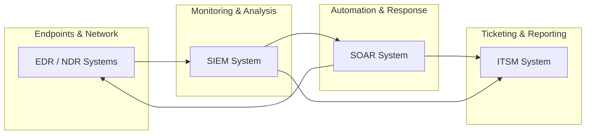

# 🛡️ Security Operations Center (SOC)

This section of the repository focuses on SOC operations, blue team workflows, and the tools, methodologies, and frameworks used by modern security teams to detect, investigate, and respond to incidents.

---

## Table of Contents

- [Overview](#overview)
- [Tool Ecosystem](#tool-ecosystem)
- [Attack Lifecycle](#attack-lifecycle)
- [Playbooks](#playbooks)
- [Training and Resources](#training-and-resources)
- [References](#references)
- [Further Reading](#further-reading)
- [Future Additions](#future-additions)

---

## Overview

A Security Operations Center (SOC) is the operational hub for cybersecurity monitoring, detection, investigation, and response. SOC teams use a combination of technologies and playbooks to manage alerts, investigate incidents, and coordinate responses across people, processes, and tools.  

Key responsibilities include:

- Continuous monitoring of networks, endpoints, and cloud environments  
- Investigation and triage of security alerts  
- Incident containment, remediation, and reporting  
- Threat hunting and proactive defense strategies  

---

## Tool Ecosystem

SOC teams rely on multiple technologies to detect, analyze, and respond to threats.  

| Solution | Examples | Description |
|----------|----------|-------------|
| **SIEM System** | Splunk ES, Elastic | SIEMs provide robust alert management and are a core component for most SOC teams. |
| **EDR or NDR** | MS Defender, CrowdStrike | Endpoint or network detection solutions provide alert dashboards. SIEM or SOAR integration is often preferred. |
| **SOAR System** | Splunk SOAR, Cortex SOAR | Aggregates and centralizes alerts from multiple sources, automates response tasks, and improves efficiency for larger SOC teams. |
| **ITSM System** | Jira, TheHive | Custom ticket management solutions for incident tracking, reporting, and workflow management. |

> Note: The GIF above is taken from Trello, a simple tool that can be adapted to ITSM needs.

---

## Attack Lifecycle

Understanding the stages of an attack helps design detection and response playbooks. Below is a concise attack lifecycle table based on the common kill chain steps.  

| Technique | Purpose | Examples |
|-----------|---------|----------|
| Reconnaissance | Obtain information on the target | Harvesting emails, OSINT |
| Weaponization | Combine the objective with an exploit. Commonly results in a deliverable payload. | Exploit with backdoor, malicious Office document |
| Delivery | How the weaponized artifact will be delivered to the target | Email, web, USB |
| Exploitation | Exploit the target's system to execute code | MS17-010, Zero-Logon |
| Installation | Install malware or other tooling | Mimikatz, Rubeus |
| Command & Control | Control the compromised asset from a remote central controller | Empire, Cobalt Strike |
| Actions on Objectives | Any end objectives: ransomware, data exfiltration, etc. | Conti, LockBit2.0 |

> Recommended: Consider creating a separate file `playbooks/attack_lifecycle.md` with expanded notes, detection ideas, and hunting queries.

---

## Playbooks

SOC playbooks provide standardized procedures for responding to common incidents. Example playbooks:

- `playbooks/phishing-response.md`
- `playbooks/malware-investigation.md`
- `playbooks/privilege-escalation.md`
- `playbooks/attack_lifecycle.md`  

Each playbook should include:

1. Purpose and scope  
2. Detection triggers (SIEM rule IDs, EDR alerts)  
3. Triage checklist  
4. Investigation steps and commands  
5. Containment and remediation steps  
6. Post-incident reporting and lessons learned  

---

## Training and Resources

- SOC Analyst Roadmap: tasks and progression from level 1 to level 3  
- Blue Team labs and realistic scenarios  
- Threat intelligence feeds and OSINT tooling  
- Simulation exercises for SIEM, EDR, and SOAR correlation  

---

## References

- [MITRE ATT&CK Framework](https://attack.mitre.org/)  
- [NIST SP 800-61: Incident Handling Guide](https://nvlpubs.nist.gov/nistpubs/SpecialPublications/NIST.SP.800-61r2.pdf)  
- [ISO/IEC 27035: Incident Management](https://www.iso.org/standard/44379.html)  
- [SANS Blue Team Resources](https://www.sans.org/blue-team/)  

---

## Further Reading: Cyber Kill Chains & Attack Frameworks

- [Lockheed Martin Cyber Kill Chain](https://www.lockheedmartin.com/en-us/capabilities/cyber/cyber-kill-chain.html)  
- [Unified Kill Chain](https://unifiedkillchain.com/)  
- [Varonis Cyber Kill Chain](https://www.varonis.com/blog/cyber-kill-chain/)  
- [Active Directory Attack Cycle](https://github.com/infosecn1nja/AD-Attack-Defense)  

---

## Future Additions

- SOC Metrics and KPIs  
- Incident report templates and timelines  
- SOAR playbooks and automation examples  
- Sample SIEM correlation rules and dashboards  
- Lab setups for SIEM + EDR correlation  

---

Maintained as part of the [SecurityAndSafety](https://github.com/Danielkaas94/SecurityAndSafety) repository.


### 🧠 Brainstorm: Folder Structure

```
SecurityAndSafety/
└── SOC/
    ├── README.md
    ├── playbooks/
    │   ├── phishing-response.md
    │   ├── malware-investigation.md
    │   ├── privilege-escalation.md
    │   └── ...
    ├── tools/
    │   ├── siem/
    │   │   ├── splunk.md
    │   │   ├── elastic.md
    │   │   └── ...
    │   ├── edr_ndr/
    │   │   ├── defender.md
    │   │   ├── crowdstrike.md
    │   │   └── ...
    │   ├── soar/
    │   │   ├── cortex.md
    │   │   ├── splunk-soar.md
    │   │   └── ...
    │   └── itsm/
    │       ├── jira.md
    │       ├── thehive.md
    │       └── ...
    ├── threat_intel/
    │   ├── osint-tools.md
    │   ├── intel_feeds.md
    │   └── ...
    ├── training/
    │   ├── blue_team_labs.md
    │   ├── soc_analyst_roadmap.md
    │   ├── labs_and_simulations.md
    │   └── ...
    └── references/
        ├── frameworks.md  # e.g. MITRE ATT&CK, NIST, ISO27035
        ├── best_practices.md
        └── further_reading.md
```

---
---
---

## SOC Workflow Diagram - Mermaid




### Explanation of the flow:

1. **EDR/NDR systems** detect suspicious activity on endpoints or the network.  
2. Alerts are **sent to SIEM** for aggregation, correlation, and enrichment.  
3. **SOAR** can automatically respond to incidents, enrich alerts, or orchestrate workflows.  
4. Both **SIEM and SOAR feed incidents into ITSM** for ticketing, tracking, and reporting.  
5. SOAR may also **communicate back to EDR/NDR** to enforce containment actions.  

This creates a full-cycle view of **detection → analysis → response → reporting**.

---
---