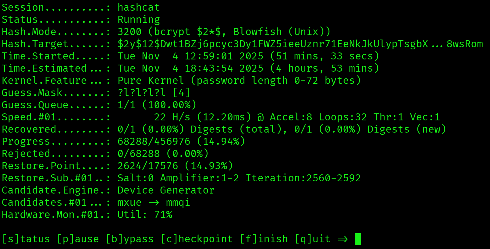
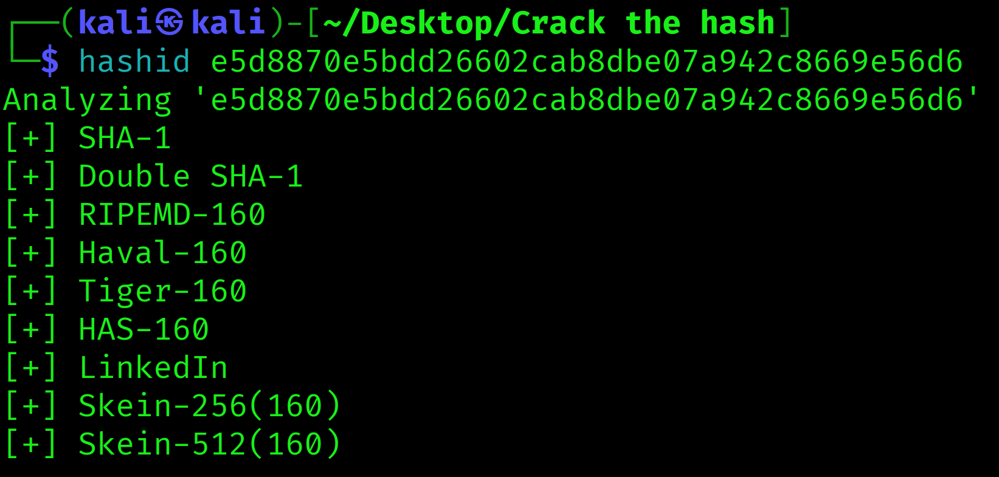
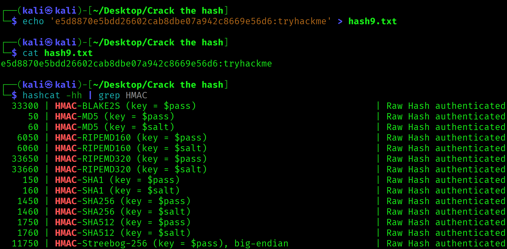
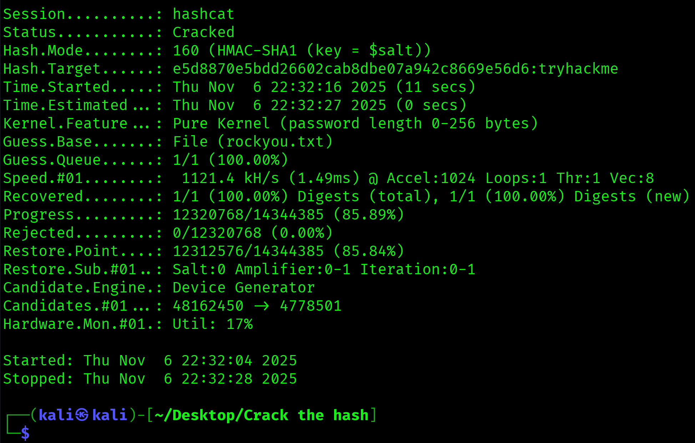
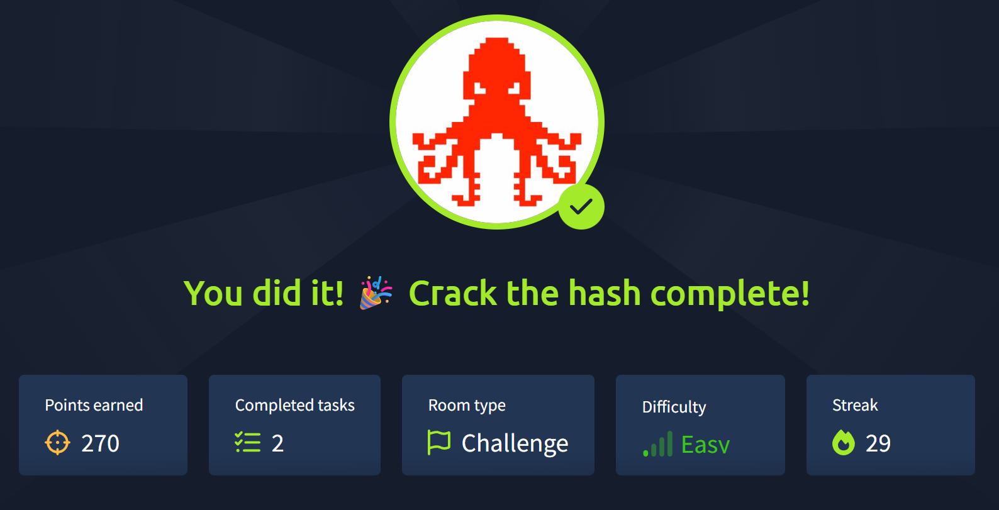
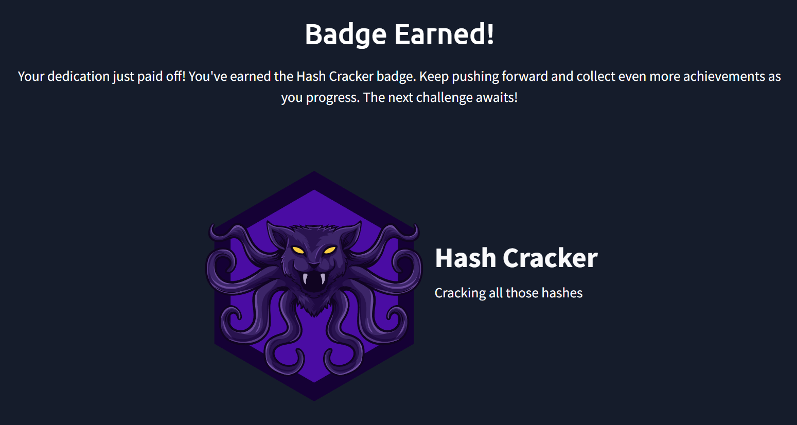

### [Browserling - All Hash Generator - World's simplest online hash calculator for web developers and programmers](https://www.browserling.com/tools/all-hashes)

## [crack station - Free Password Hash Cracker](https://crackstation.net/)
*CrackStation uses massive pre-computed lookup tables to crack password hashes. These tables store a mapping between the hash of a password, and the correct password for that hash. The hash values are indexed so that it is possible to quickly search the database for a given hash. If the hash is present in the database, the password can be recovered in a fraction of a second. This only works for "unsalted" hashes.*

Alternative to Crack Station is [Hashes.com - ](https://hashes.com/en/decrypt/hash) Decrypt MD5, SHA1, MySQL, NTLM, SHA256, MD5 Email, SHA256 Email, SHA512 hashes

on linux you can use `hashid`
```bash
┌──(kali㉿kali)-[~/Desktop/Crack the hash]
└─$ hashid 48bb6e862e54f2a795ffc4e541caed4d        
Analyzing '48bb6e862e54f2a795ffc4e541caed4d'
[+] MD2 
[+] MD5 
[+] MD4 
[+] Double MD5 
[+] LM 
[+] RIPEMD-128 
[+] Haval-128 
[+] Tiger-128 
[+] Skein-256(128) 
[+] Skein-512(128) 
[+] Lotus Notes/Domino 5 
[+] Skype 
[+] Snefru-128 
[+] NTLM 
[+] Domain Cached Credentials 
[+] Domain Cached Credentials 2 
[+] DNSSEC(NSEC3) 
[+] RAdmin v2.x
```

# [TryHackMe - Crack the hash](https://tryhackme.com/room/crackthehash)

#### [HashCat - Example hashes](https://hashcat.net/wiki/doku.php?id=example_hashes)

### [Hashcat Hash Modes - GitHub](https://github.com/unstable-deadlock/brashendeavours.gitbook.io/blob/master/pentesting-cheatsheets/hashcat-hash-modes.md)


```bash
# You can also you this, if you already know the hash name
hashcat --help | grep MD5

# From hashcat -hh
      # | Name                                                       | Category
  ======+============================================================+======================================
    900 | MD4                                                        | Raw Hash
      0 | MD5                                                        | Raw Hash
  34600 | MD6 (256)                                                  | Raw Hash
    100 | SHA1                                                       | Raw Hash
   1300 | SHA2-224                                                   | Raw Hash
   1400 | SHA2-256                                                   | Raw Hash
  10800 | SHA2-384                                                   | Raw Hash
   1700 | SHA2-512                                                   | Raw Hash
  17300 | SHA3-224                                                   | Raw Hash
  17400 | SHA3-256                                                   | Raw Hash
  17500 | SHA3-384                                                   | Raw Hash
  17600 | SHA3-512                                                   | Raw Has
```

You can also use hashid

```bash

```

---
# Level 1

Can you complete the level 1 tasks by cracking the hashes?

---
### Alright lets get going with the first one, which should be a MD5 hash

### 🔹 1️⃣ `48bb6e862e54f2a795ffc4e541caed4d`
* **Length:** 32 hex characters
* **Hex only (0–9, a–f)**
  ✅ **Likely:** **MD5** (128-bit = 32 hex chars)

**Command**: `hashcat -m 0 -a 3 hash1 ?a?a?a?a `
**Password**: `easy`

---

```bash
┌──(kali㉿kali)-[~/Desktop/Crack the hash]
└─$ hashcat -m 0 -a 3 hash1 ?a?a?a?a           
hashcat (v7.1.2) starting

OpenCL API (OpenCL 3.0 PoCL 6.0+debian  Linux, None+Asserts, RELOC, SPIR-V, LLVM 18.1.8, SLEEF, DISTRO, POCL_DEBUG) - Platform #1 [The pocl project]
====================================================================================================================================================
* Device #01: cpu-haswell-13th Gen Intel(R) Core(TM) i7-13700HX, 2317/4634 MB (1024 MB allocatable), 8MCU

Minimum password length supported by kernel: 0
Maximum password length supported by kernel: 256

Hashes: 1 digests; 1 unique digests, 1 unique salts
Bitmaps: 16 bits, 65536 entries, 0x0000ffff mask, 262144 bytes, 5/13 rotates

Optimizers applied:
* Zero-Byte
* Early-Skip
* Not-Salted
* Not-Iterated
* Single-Hash
* Single-Salt
* Brute-Force
* Raw-Hash

ATTENTION! Pure (unoptimized) backend kernels selected.
Pure kernels can crack longer passwords, but drastically reduce performance.
If you want to switch to optimized kernels, append -O to your commandline.
See the above message to find out about the exact limits.

Watchdog: Temperature abort trigger set to 90c

Host memory allocated for this attack: 514 MB (4053 MB free)

48bb6e862e54f2a795ffc4e541caed4d:easy                     
                                                          
Session..........: hashcat
Status...........: Cracked
Hash.Mode........: 0 (MD5)
Hash.Target......: 48bb6e862e54f2a795ffc4e541caed4d
Time.Started.....: Tue Nov  4 11:20:58 2025 (1 sec)
Time.Estimated...: Tue Nov  4 11:20:59 2025 (0 secs)
Kernel.Feature...: Pure Kernel (password length 0-256 bytes)
Guess.Mask.......: ?a?a?a?a [4]
Guess.Queue......: 1/1 (100.00%)
Speed.#01........: 20459.2 kH/s (8.34ms) @ Accel:1024 Loops:64 Thr:1 Vec:8
Recovered........: 1/1 (100.00%) Digests (total), 1/1 (100.00%) Digests (new)
Progress.........: 13754368/81450625 (16.89%)
Rejected.........: 0/13754368 (0.00%)
Restore.Point....: 139264/857375 (16.24%)
Restore.Sub.#01..: Salt:0 Amplifier:0-64 Iteration:0-64
Candidate.Engine.: Device Generator
Candidates.#01...: s`S2 -> Qm8a
Hardware.Mon.#01.: Util: 10%

Started: Tue Nov  4 11:20:34 2025
Stopped: Tue Nov  4 11:21:00 2025
                                                                                                        
┌──(kali㉿kali)-[~/Desktop/Crack the hash]
└─$ hashcat --show -m 0 hash1       
48bb6e862e54f2a795ffc4e541caed4d:easy
```


----
---

### 🔹 2️⃣ `CBFDAC6008F9CAB4083784CBD1874F76618D2A97`

* **Length:** 40 hex characters
  ✅ **Likely:** **SHA-1** (160-bit = 40 hex chars)

**Command**: `hashcat -m 100 hash2 rockyou.txt`
**Password**: `password123`


```bash
┌──(kali㉿kali)-[~/Desktop/Crack the hash]
└─$ hashcat -m 100 hash2 rockyou.txt 
hashcat (v7.1.2) starting

OpenCL API (OpenCL 3.0 PoCL 6.0+debian  Linux, None+Asserts, RELOC, SPIR-V, LLVM 18.1.8, SLEEF, DISTRO, POCL_DEBUG) - Platform #1 [The pocl project]
====================================================================================================================================================
* Device #01: cpu-haswell-13th Gen Intel(R) Core(TM) i7-13700HX, 2317/4634 MB (1024 MB allocatable), 8MCU

Minimum password length supported by kernel: 0
Maximum password length supported by kernel: 256

Hashes: 1 digests; 1 unique digests, 1 unique salts
Bitmaps: 16 bits, 65536 entries, 0x0000ffff mask, 262144 bytes, 5/13 rotates
Rules: 1

Optimizers applied:
* Zero-Byte
* Early-Skip
* Not-Salted
* Not-Iterated
* Single-Hash
* Single-Salt
* Raw-Hash

ATTENTION! Pure (unoptimized) backend kernels selected.
Pure kernels can crack longer passwords, but drastically reduce performance.
If you want to switch to optimized kernels, append -O to your commandline.
See the above message to find out about the exact limits.

Watchdog: Temperature abort trigger set to 90c

Host memory allocated for this attack: 514 MB (4288 MB free)
                                                                                                                       
Dictionary cache built:
* Filename..: rockyou.txt                                                                                              
* Passwords.: 14344392                                                                                                 
* Bytes.....: 139921507                                                                                                
* Keyspace..: 14344385                                                                                                 
* Runtime...: 0 secs                                                                                                   
                                                                                                                       
cbfdac6008f9cab4083784cbd1874f76618d2a97:password123      
                                                                                                                       
Session..........: hashcat
Status...........: Cracked
Hash.Mode........: 100 (SHA1)
Hash.Target......: cbfdac6008f9cab4083784cbd1874f76618d2a97
Time.Started.....: Tue Nov  4 12:16:06 2025 (0 secs)
Time.Estimated...: Tue Nov  4 12:16:06 2025 (0 secs)
Kernel.Feature...: Pure Kernel (password length 0-256 bytes)
Guess.Base.......: File (rockyou.txt)
Guess.Queue......: 1/1 (100.00%)
Speed.#01........:   165.1 kH/s (0.37ms) @ Accel:1024 Loops:1 Thr:1 Vec:8
Recovered........: 1/1 (100.00%) Digests (total), 1/1 (100.00%) Digests (new)
Progress.........: 8192/14344385 (0.06%)
Rejected.........: 0/8192 (0.00%)
Restore.Point....: 0/14344385 (0.00%)
Restore.Sub.#01..: Salt:0 Amplifier:0-1 Iteration:0-1
Candidate.Engine.: Device Generator
Candidates.#01...: 123456 -> whitetiger
Hardware.Mon.#01.: Util: 11%

Started: Tue Nov  4 12:15:56 2025
Stopped: Tue Nov  4 12:16:07 2025
                                                                                               
┌──(kali㉿kali)-[~/Desktop/Crack the hash]
└─$ hashcat --show -m 100 hash2 
cbfdac6008f9cab4083784cbd1874f76618d2a97:password123
```


---
---

### 🔹 3️⃣ `1C8BFE8F801D79745C4631D09FFF36C82AA37FC4CCE4FC946683D7B336B63032`

* **Length:** 64 hex characters
  ✅ **Likely:** **SHA-256** (256-bit = 64 hex chars)

**Command**: `hashcat -m 1400 hash3 rockyou.txt`
**Password**: `letmein`

```bash
┌──(kali㉿kali)-[~/Desktop/Crack the hash]
└─$ hashcat -m 1400 hash3 rockyou.txt                                               
hashcat (v7.1.2) starting

OpenCL API (OpenCL 3.0 PoCL 6.0+debian  Linux, None+Asserts, RELOC, SPIR-V, LLVM 18.1.8, SLEEF, DISTRO, POCL_DEBUG) - Platform #1 [The pocl project]
====================================================================================================================================================
* Device #01: cpu-haswell-13th Gen Intel(R) Core(TM) i7-13700HX, 2317/4634 MB (1024 MB allocatable), 8MCU

Minimum password length supported by kernel: 0
Maximum password length supported by kernel: 256

Hashes: 1 digests; 1 unique digests, 1 unique salts
Bitmaps: 16 bits, 65536 entries, 0x0000ffff mask, 262144 bytes, 5/13 rotates
Rules: 1

Optimizers applied:
* Zero-Byte
* Early-Skip
* Not-Salted
* Not-Iterated
* Single-Hash
* Single-Salt
* Raw-Hash

ATTENTION! Pure (unoptimized) backend kernels selected.
Pure kernels can crack longer passwords, but drastically reduce performance.
If you want to switch to optimized kernels, append -O to your commandline.
See the above message to find out about the exact limits.

Watchdog: Temperature abort trigger set to 90c

Host memory allocated for this attack: 514 MB (4311 MB free)

Dictionary cache hit:
* Filename..: rockyou.txt
* Passwords.: 14344385
* Bytes.....: 139921507
* Keyspace..: 14344385

1c8bfe8f801d79745c4631d09fff36c82aa37fc4cce4fc946683d7b336b63032:letmein
                                                          
Session..........: hashcat
Status...........: Cracked
Hash.Mode........: 1400 (SHA2-256)
Hash.Target......: 1c8bfe8f801d79745c4631d09fff36c82aa37fc4cce4fc94668...b63032
Time.Started.....: Tue Nov  4 12:24:40 2025 (0 secs)
Time.Estimated...: Tue Nov  4 12:24:40 2025 (0 secs)
Kernel.Feature...: Pure Kernel (password length 0-256 bytes)
Guess.Base.......: File (rockyou.txt)
Guess.Queue......: 1/1 (100.00%)
Speed.#01........:  1305.3 kH/s (0.52ms) @ Accel:1024 Loops:1 Thr:1 Vec:8
Recovered........: 1/1 (100.00%) Digests (total), 1/1 (100.00%) Digests (new)
Progress.........: 8192/14344385 (0.06%)
Rejected.........: 0/8192 (0.00%)
Restore.Point....: 0/14344385 (0.00%)
Restore.Sub.#01..: Salt:0 Amplifier:0-1 Iteration:0-1
Candidate.Engine.: Device Generator
Candidates.#01...: 123456 -> whitetiger
Hardware.Mon.#01.: Util:  6%

Started: Tue Nov  4 12:24:30 2025
Stopped: Tue Nov  4 12:24:41 2025

```

---

### 🔹 4️⃣ `$2y$12$Dwt1BZj6pcyc3Dy1FWZ5ieeUznr71EeNkJkUlypTsgbX1H68wsRom`

* **Prefix:** `$2y$`
  ✅ **Likely:** **bcrypt**

  * `$2a$`, `$2b$`, `$2y$` all indicate bcrypt
  * `12` = cost factor

**Command**: `hashcat -m 3200 -a 0 hash4 rockyou-4.txt`
**Command**: `hashcat -m 3200 -a 3 hash4 ?l?l?l?l`

---

**Password**: `123`

**Hint**: Search the hashcat examples page (https://hashcat.net/wiki/doku.php?id=example_hashes) for `$2y$`. This type of hash can take a very long time to crack, so either filter rockyou for four character words, or use a mask for four lower case alphabetical characters.

```bash
awk 'length($0)==4' /usr/share/wordlists/rockyou.txt > rockyou-4.txt
# or (if you want to allow spaces, use): awk 'length($0)==4' RS='\n' ORS='\n' rockyou.txt > rockyou-4.txt
```


This is going to take a walk, I will take a walk and maybe clean the kitchen 😅😴





```
Session..........: hashcat                                
Status...........: Quit
Hash.Mode........: 3200 (bcrypt $2*$, Blowfish (Unix))
Hash.Target......: $2y$12$Dwt1BZj6pcyc3Dy1FWZ5ieeUznr71EeNkJkUlypTsgbX...8wsRom
Time.Started.....: Tue Nov  4 12:59:01 2025 (53 mins, 32 secs)
Time.Estimated...: Tue Nov  4 18:41:07 2025 (4 hours, 48 mins)
Kernel.Feature...: Pure Kernel (password length 0-72 bytes)
Guess.Mask.......: ?l?l?l?l [4]
Guess.Queue......: 1/1 (100.00%)
Speed.#01........:       22 H/s (11.92ms) @ Accel:8 Loops:32 Thr:1 Vec:1
Recovered........: 0/1 (0.00%) Digests (total), 0/1 (0.00%) Digests (new)
Progress.........: 71488/456976 (15.64%)
Rejected.........: 0/71488 (0.00%)
Restore.Point....: 2688/17576 (15.29%)
Restore.Sub.#01..: Salt:0 Amplifier:25-26 Iteration:2624-2656
Candidate.Engine.: Device Generator
Candidates.#01...: xszm -> xgac
Hardware.Mon.#01.: Util: 75%

Started: Tue Nov  4 12:58:46 2025
Stopped: Tue Nov  4 13:52:34 2025

```

### I give up and use **John The Ripper**! RELEASE THE KRAKKEN! 🦑

**Why John?** bcrypt is slow; Hashcat’s bcrypt support is limited on CPU-only setups.


#### **John The Ripper**

word-list
**Command: `john --format=bcrypt-opencl --wordlist=rockyou-4.txt hash4.txt`

Mask
Command**: `john --format=bcrypt --mask='?l?l?l?l' hash4.txt`


```bash
# To save all passwords for mask '?d?d?d?d' (all four digits words) to a file:
./john --mask='?d?d?d?d' --stdout > 4d.txt

# To launch a mask attack, use a command like:
./john --mask='MASK' HASH-FILE


# Crack with John (CPU) - 
# If you have a standard CPU build of John (jumbo), run a mask attack for 4 lowercase letters:
john --format=bcrypt --mask='?l?l?l?l' hash.txt

# If you have multiple CPU cores and want to parallelize (if supported), you can try:
john --format=bcrypt --mask='?l?l?l?l' --fork=4 hash.txt

# Crack with John (GPU / OpenCL) — faster for many cases
# If your John build includes OpenCL (and you prefer GPU acceleration), use the OpenCL bcrypt format:
john --format=bcrypt-opencl --mask='?l?l?l?l' hash.txt

```


#### *Somehow I could not figure it out with john, so i went back with hashcat and used rockyou-4 instead of ?l?l?l?l*


```bash
┌──(kali㉿kali)-[~/Desktop/Crack the hash]
└─$ hashcat -m 3200 -a 0 hash4.txt rockyou-4.txt
hashcat (v7.1.2) starting

OpenCL API (OpenCL 3.0 PoCL 6.0+debian  Linux, None+Asserts, RELOC, SPIR-V, LLVM 18.1.8, SLEEF, DISTRO, POCL_DEBUG) - Platform #1 [The pocl project]
====================================================================================================================================================
* Device #01: cpu-haswell-13th Gen Intel(R) Core(TM) i7-13700HX, 2317/4634 MB (1024 MB allocatable), 8MCU

Minimum password length supported by kernel: 0
Maximum password length supported by kernel: 72
Minimum salt length supported by kernel: 0
Maximum salt length supported by kernel: 256

Hashes: 1 digests; 1 unique digests, 1 unique salts
Bitmaps: 16 bits, 65536 entries, 0x0000ffff mask, 262144 bytes, 5/13 rotates
Rules: 1

Optimizers applied:
* Zero-Byte
* Single-Hash
* Single-Salt

Watchdog: Temperature abort trigger set to 90c

Host memory allocated for this attack: 512 MB (4224 MB free)

Dictionary cache built:
* Filename..: rockyou-4.txt
* Passwords.: 18152
* Bytes.....: 91391
* Keyspace..: 18152
* Runtime...: 0 secs

# how could this take 10 seconds, but 52 minutes and no cigar with ?l?l?l?l  WTF you numb digger!
Session..........: hashcat
Status...........: Cracked
Hash.Mode........: 3200 (bcrypt $2*$, Blowfish (Unix))
Hash.Target......: $2y$12$Dwt1BZj6pcyc3Dy1FWZ5ieeUznr71EeNkJkUlypTsgbX...8wsRom
Time.Started.....: Tue Nov  4 15:03:04 2025 (10 secs)
Time.Estimated...: Tue Nov  4 15:03:14 2025 (0 secs)
Kernel.Feature...: Pure Kernel (password length 0-72 bytes)
Guess.Base.......: File (rockyou-4.txt)
Guess.Queue......: 1/1 (100.00%)
Speed.#01........:       39 H/s (12.00ms) @ Accel:8 Loops:32 Thr:1 Vec:1
Recovered........: 1/1 (100.00%) Digests (total), 1/1 (100.00%) Digests (new)
Progress.........: 704/18152 (3.88%)
Rejected.........: 0/704 (0.00%)
Restore.Point....: 640/18152 (3.53%)
Restore.Sub.#01..: Salt:0 Amplifier:0-1 Iteration:4064-4096
Candidate.Engine.: Device Generator
Candidates.#01...: karl -> Nick
Hardware.Mon.#01.: Util: 81%

Started: Tue Nov  4 15:03:02 2025
Stopped: Tue Nov  4 15:03:14 2025
```


```bash
# Functional John The Ripper Solution!
┌──(kali㉿kali)-[~/Desktop/Crack the hash]
└─$ john --format=bcrypt --wordlist=rockyou-4.txt hash4.txt 
Using default input encoding: UTF-8
Loaded 1 password hash (bcrypt [Blowfish 32/64 X3])
Cost 1 (iteration count) is 4096 for all loaded hashes
Will run 8 OpenMP threads
Press 'q' or Ctrl-C to abort, almost any other key for status
bleh             (?)     
1g 0:00:00:06 DONE (2025-11-04 15:19) 0.1533g/s 110.4p/s 110.4c/s 110.4C/s bleh..turd
Use the "--show" option to display all of the cracked passwords reliably
Session completed
```

What did we learn little n00b (talking to myself)?
- Using mask is super slow compared to wordlist `?l?l?l?l vs. rockyou-4.txt`
- If something takes close to an hour on a simple password, YOU might have done something totally wrong with the syntax
- John The Ripper is usually faster? Depending on the hash type?


---
---

### 🔹 5️⃣ `279412f945939ba78ce0758d3fd83daa`

* **Length:** 32 hex chars again
  ✅ **Likely:** **MD5**
  (could also be MD4 or NTLM, but NTLM usually **uppercase** hex)


~~**Command**: `hashcat -m 900 279412f945939ba78ce0758d3fd83daa`~~
~~**Command**: `hashcat -m 900 rockyou.txt`~~
**Command (After I know the password)**: `hashcat -m 900 -a 6 hash5.txt rockyou.txt ?d?d -w 3 --show`
**Password**: `Eternity22`

Since there is no salt involved we can also just use the website [crack station - Free Password Hash Cracker](https://crackstation.net/), it takes less than a second to crack


I tried with hashcat with this command (`hashcat -m 900 rockyou.txt`), but they do not work, the tool get `exhausted` and so am I, am I missing something? The password is not inside ``rockyou.txt``? has ``rockyou.txt`` been corrupted and is no longer working as before?

```bash
┌──(kali㉿kali)-[~/Desktop/Crack the hash]
└─$ hashcat -m 900 hash5 rockyou.txt
hashcat (v7.1.2) starting

OpenCL API (OpenCL 3.0 PoCL 6.0+debian  Linux, None+Asserts, RELOC, SPIR-V, LLVM 18.1.8, SLEEF, DISTRO, POCL_DEBUG) - Platform #1 [The pocl project]
====================================================================================================================================================
* Device #01: cpu-haswell-13th Gen Intel(R) Core(TM) i7-13700HX, 2317/4634 MB (1024 MB allocatable), 8MCU

Minimum password length supported by kernel: 0
Maximum password length supported by kernel: 256

Hashes: 1 digests; 1 unique digests, 1 unique salts
Bitmaps: 16 bits, 65536 entries, 0x0000ffff mask, 262144 bytes, 5/13 rotates
Rules: 1

Optimizers applied:
* Zero-Byte
* Early-Skip
* Not-Salted
* Not-Iterated
* Single-Hash
* Single-Salt
* Raw-Hash

ATTENTION! Pure (unoptimized) backend kernels selected.
Pure kernels can crack longer passwords, but drastically reduce performance.
If you want to switch to optimized kernels, append -O to your commandline.
See the above message to find out about the exact limits.

Watchdog: Temperature abort trigger set to 90c

Host memory allocated for this attack: 514 MB (4714 MB free)

Dictionary cache hit:
* Filename..: rockyou.txt
* Passwords.: 14344385
* Bytes.....: 139921507
* Keyspace..: 14344385

Approaching final keyspace - workload adjusted.           

Session..........: hashcat                                
Status...........: Exhausted
Hash.Mode........: 900 (MD4)
Hash.Target......: 279412f945939ba78ce0758d3fd83daa
Time.Started.....: Thu Nov  6 09:42:29 2025 (5 secs)
Time.Estimated...: Thu Nov  6 09:42:34 2025 (0 secs)
Kernel.Feature...: Pure Kernel (password length 0-256 bytes)
Guess.Base.......: File (rockyou.txt)
Guess.Queue......: 1/1 (100.00%)
Speed.#01........:  3021.4 kH/s (0.23ms) @ Accel:1024 Loops:1 Thr:1 Vec:8
Recovered........: 0/1 (0.00%) Digests (total), 0/1 (0.00%) Digests (new)
Progress.........: 14344385/14344385 (100.00%)
Rejected.........: 0/14344385 (0.00%)
Restore.Point....: 14344385/14344385 (100.00%)
Restore.Sub.#01..: Salt:0 Amplifier:0-1 Iteration:0-1
Candidate.Engine.: Device Generator
Candidates.#01...:  kristenanne -> $HEX[042a0337c2a156616d6f732103]
Hardware.Mon.#01.: Util: 20%

Started: Thu Nov  6 09:42:29 2025
Stopped: Thu Nov  6 09:42:35 2025

```

Okay, this is fucking stupid... I found this tutorial [Crack the Hash: TryHackMe Walkthrough Guide](https://crackthehashblog.wordpress.com/2025/05/22/crack-the-hash-tryhackme-walkthrough-guide/)
What is wrong?? Is the author a lying scumbag? Several other walkthroughs says it is not possible with hashcat and use crackstation instead for this assignment.
And the actual password cannot be found inside rockyou.txt

they use the commands 
```bash
hashcat -m 900 -a 0 hash5.txt /usr/share/wordlists/rockyou.txt
hashcat -m 900 -a 0 --force -O hash5.txt /usr/share/wordlists/rockyou.txt

# They are able to get the password 'Eternity22' 
I just get Status: Exhausted

# If I use greb the password for the answer is not inside rockyou
┌──(kali㉿kali)-[~/Desktop/Crack the hash]
└─$ grep Eternity rockyou.txt
Eternity
Eternity7
Eternity3
Eternity1
Eternity03
4Eternity
rlove4Eternity
LoveForEternity2
LoveEternity2
JayydaEternity123
Eternity_Love
EternityBears1994
Eternity90
Eternity728
Eternity46
Eternity4
Eternity23
Eternity2
Eternity16
Eternity10
Eternity05
4Eternitys
2Eternity!
08Eternity08

```

### Could we somehow make a hybrid-mask? 'Eternity' is inside ``rockyou.txt``, then just add ?d?d 


```bash
# Proof of concept
# -m 900 = raw MD4
hashcat -m 900 -a 6 hash5.txt rockyou.txt ?d?d -w 3 --show

# Shall we try with -w 4? Just for the lulz?
- [ Workload Profiles (-w) ] -
  # | Performance | Runtime | Power Consumption | Desktop Impact
 ===+=============+=========+===================+=================
  1 | Low         |   2 ms  | Low               | Minimal
  2 | Default     |  12 ms  | Economic          | Noticeable
  3 | High        |  96 ms  | High              | Unresponsive
  4 | Nightmare   | 480 ms  | Insane            | Headless

#
- [ Attack Modes (-a)] -
  # | Mode
 ===+======
  0 | Straight
  1 | Combination
  3 | Brute-force
  6 | Hybrid Wordlist + Mask
  7 | Hybrid Mask + Wordlist
  9 | Association

┌──(kali㉿kali)-[~/Desktop/Crack the hash]
└─$ hashcat -m 900 -a 6 hash5.txt rockyou.txt ?d?d -w 4       
hashcat (v7.1.2) starting

OpenCL API (OpenCL 3.0 PoCL 6.0+debian  Linux, None+Asserts, RELOC, SPIR-V, LLVM 18.1.8, SLEEF, DISTRO, POCL_DEBUG) - Platform #1 [The pocl project]
====================================================================================================================================================
* Device #01: cpu-haswell-13th Gen Intel(R) Core(TM) i7-13700HX, 2317/4634 MB (1024 MB allocatable), 8MCU

Minimum password length supported by kernel: 0
Maximum password length supported by kernel: 256

Hashes: 1 digests; 1 unique digests, 1 unique salts
Bitmaps: 16 bits, 65536 entries, 0x0000ffff mask, 262144 bytes, 5/13 rotates

Optimizers applied:
* Zero-Byte
* Early-Skip
* Not-Salted
* Not-Iterated
* Single-Hash
* Single-Salt
* Raw-Hash

ATTENTION! Pure (unoptimized) backend kernels selected.
Pure kernels can crack longer passwords, but drastically reduce performance.
If you want to switch to optimized kernels, append -O to your commandline.
See the above message to find out about the exact limits.

Watchdog: Temperature abort trigger set to 90c

Host memory allocated for this attack: 514 MB (4075 MB free)

Dictionary cache hit:
* Filename..: rockyou.txt
* Passwords.: 14344385
* Bytes.....: 139921507
* Keyspace..: 1434438500

279412f945939ba78ce0758d3fd83daa:Eternity22               
                                                          
Session..........: hashcat
Status...........: Cracked
Hash.Mode........: 900 (MD4)
Hash.Target......: 279412f945939ba78ce0758d3fd83daa
Time.Started.....: Thu Nov  6 17:23:25 2025 (1 sec)
Time.Estimated...: Thu Nov  6 17:23:26 2025 (0 secs)
Kernel.Feature...: Pure Kernel (password length 0-256 bytes)
Guess.Base.......: File (rockyou.txt), Left Side
Guess.Mod........: Mask (?d?d) [2], Right Side
Guess.Queue.Base.: 1/1 (100.00%)
Guess.Queue.Mod..: 1/1 (100.00%)
Speed.#01........: 49451.5 kH/s (4.47ms) @ Accel:1024 Loops:64 Thr:1 Vec:8
Recovered........: 1/1 (100.00%) Digests (total), 1/1 (100.00%) Digests (new)
Progress.........: 15269888/1434438500 (1.06%)
Rejected.........: 0/15269888 (0.00%)
Restore.Point....: 147456/14344385 (1.03%)
Restore.Sub.#01..: Salt:0 Amplifier:0-64 Iteration:0-64
Candidate.Engine.: Device Generator
Candidates.#01...: mckinley112 -> shelby9534
Hardware.Mon.#01.: Util:  9%

Started: Thu Nov  6 17:23:17 2025
Stopped: Thu Nov  6 17:23:27 2025
```


---
# Level 2

This task increases the difficulty. All of the answers will be in the classic [rock you](https://github.com/brannondorsey/naive-hashcat/releases/download/data/rockyou.txt) password list.
You might have to start using hashcat here and not online tools. It might also be handy to look at some example hashes on [hashcats page](https://hashcat.net/wiki/doku.php?id=example_hashes).

---


### 🔹 6️⃣ `F09EDCB1FCEFC6DFB23DC3505A882655FF77375ED8AA2D1C13F640FCCC2D0C85`

* **Length:** 64 hex characters
  ✅ **Likely:** **SHA-256**

**Command**: `hashcat -m 1400 hash6.txt rockyou.txt`
**Password**: `paule`


```bash
# Get The Hash ID
┌──(kali㉿kali)-[~/Desktop/Crack the hash]
└─$ hashid F09EDCB1FCEFC6DFB23DC3505A882655FF77375ED8AA2D1C13F640FCCC2D0C85            
Analyzing 'F09EDCB1FCEFC6DFB23DC3505A882655FF77375ED8AA2D1C13F640FCCC2D0C85'
[+] Snefru-256 
[+] SHA-256 
[+] RIPEMD-256 
[+] Haval-256 
[+] GOST R 34.11-94 
[+] GOST CryptoPro S-Box 
[+] SHA3-256 
[+] Skein-256 
[+] Skein-512(256)

# Get the code for SHA-256
# Keep in mind with grep, that you get different results searching sha or SHA, it's case sensitive 
┌──(kali㉿kali)-[~/Desktop/Crack the hash]
└─$ hashcat -hh | grep SHA2 
   1300 | SHA2-224                                                   | Raw Hash
   1400 | SHA2-256                                                   | Raw Hash
  10800 | SHA2-384                                                   | Raw Hash
   1700 | SHA2-512                                                   | Raw Hash
   1450 | HMAC-SHA256 (key = $pass)                                  | Raw Hash authenticated
   1460 | HMAC-SHA256 (key = $salt)                                  | Raw Hash authenticated

# 
┌──(kali㉿kali)-[~/Desktop/Crack the hash]
└─$ hashcat -m 1400 hash6.txt rockyou.txt 
hashcat (v7.1.2) starting

OpenCL API (OpenCL 3.0 PoCL 6.0+debian  Linux, None+Asserts, RELOC, SPIR-V, LLVM 18.1.8, SLEEF, DISTRO, POCL_DEBUG) - Platform #1 [The pocl project]
====================================================================================================================================================
* Device #01: cpu-haswell-13th Gen Intel(R) Core(TM) i7-13700HX, 2317/4634 MB (1024 MB allocatable), 8MCU

Minimum password length supported by kernel: 0
Maximum password length supported by kernel: 256

Hashes: 1 digests; 1 unique digests, 1 unique salts
Bitmaps: 16 bits, 65536 entries, 0x0000ffff mask, 262144 bytes, 5/13 rotates
Rules: 1

Optimizers applied:
* Zero-Byte
* Early-Skip
* Not-Salted
* Not-Iterated
* Single-Hash
* Single-Salt
* Raw-Hash

ATTENTION! Pure (unoptimized) backend kernels selected.
Pure kernels can crack longer passwords, but drastically reduce performance.
If you want to switch to optimized kernels, append -O to your commandline.
See the above message to find out about the exact limits.

Watchdog: Temperature abort trigger set to 90c

Host memory allocated for this attack: 514 MB (4610 MB free)

Dictionary cache hit:
* Filename..: rockyou.txt
* Passwords.: 14344385
* Bytes.....: 139921507
* Keyspace..: 14344385

f09edcb1fcefc6dfb23dc3505a882655ff77375ed8aa2d1c13f640fccc2d0c85:paule
                                                          
Session..........: hashcat
Status...........: Cracked
Hash.Mode........: 1400 (SHA2-256)
Hash.Target......: f09edcb1fcefc6dfb23dc3505a882655ff77375ed8aa2d1c13f...2d0c85
Time.Started.....: Thu Nov  6 20:27:54 2025 (0 secs)
Time.Estimated...: Thu Nov  6 20:27:54 2025 (0 secs)
Kernel.Feature...: Pure Kernel (password length 0-256 bytes)
Guess.Base.......: File (rockyou.txt)
Guess.Queue......: 1/1 (100.00%)
Speed.#01........:  2870.0 kH/s (0.35ms) @ Accel:1024 Loops:1 Thr:1 Vec:8
Recovered........: 1/1 (100.00%) Digests (total), 1/1 (100.00%) Digests (new)
Progress.........: 81920/14344385 (0.57%)
Rejected.........: 0/81920 (0.00%)
Restore.Point....: 73728/14344385 (0.51%)
Restore.Sub.#01..: Salt:0 Amplifier:0-1 Iteration:0-1
Candidate.Engine.: Device Generator
Candidates.#01...: compu -> janson
Hardware.Mon.#01.: Util:  4%

Started: Thu Nov  6 20:27:53 2025
Stopped: Thu Nov  6 20:27:56 2025
```

---

### 🔹 7️⃣ `1DFECA0C002AE40B8619ECF94819CC1B`

Hint: NTLM

* **Length:** 32 hex characters (but *uppercase*)
  ✅ **Possibly:** **MD4** or **NTLM hash**
  * NTLM hashes are *uppercase* MD4 of the UTF-16 password.

**Command**: `hashcat -m 1000 hash7.txt rockyou.txt`
**Password**: `n63umy8lkf4i`

```bash
# Make new file with the hash
┌──(kali㉿kali)-[~/Desktop/Crack the hash]
└─$ echo '1DFECA0C002AE40B8619ECF94819CC1B' > hash7.txt                                
                                                                                                                              
: ' Candidate for the hash ID
The ordering is not a proof of probability. 
The list is a set of possible matches; placement can reflect match rules or internal ordering, not a confidence ranking you should trust as definitive.
'
┌──(kali㉿kali)-[~/Desktop/Crack the hash]
└─$ hashid 1DFECA0C002AE40B8619ECF94819CC1B                                
Analyzing '1DFECA0C002AE40B8619ECF94819CC1B'
[+] MD2 
[+] MD5 
[+] MD4 
[+] Double MD5 
[+] LM 
[+] RIPEMD-128 
[+] Haval-128 
[+] Tiger-128 
[+] Skein-256(128) 
[+] Skein-512(128) 
[+] Lotus Notes/Domino 5 
[+] Skype 
[+] Snefru-128 
[+] NTLM 
[+] Domain Cached Credentials 
[+] Domain Cached Credentials 2 
[+] DNSSEC(NSEC3) 
[+] RAdmin v2.x

# 
┌──(kali㉿kali)-[~/Desktop/Crack the hash]
└─$ hashcat -hh | grep NTLM             
   5500 | NetNTLMv1 / NetNTLMv1+ESS                                  | Network Protocol
  27000 | NetNTLMv1 / NetNTLMv1+ESS (NT)                             | Network Protocol
   5600 | NetNTLMv2                                                  | Network Protocol
  27100 | NetNTLMv2 (NT)                                             | Network Protocol
   1000 | NTLM                                                       | Operating System

# 
┌──(kali㉿kali)-[~/Desktop/Crack the hash]
└─$ hashcat -m 1000 hash7.txt rockyou.txt
hashcat (v7.1.2) starting

OpenCL API (OpenCL 3.0 PoCL 6.0+debian  Linux, None+Asserts, RELOC, SPIR-V, LLVM 18.1.8, SLEEF, DISTRO, POCL_DEBUG) - Platform #1 [The pocl project]
====================================================================================================================================================
* Device #01: cpu-haswell-13th Gen Intel(R) Core(TM) i7-13700HX, 2317/4634 MB (1024 MB allocatable), 8MCU

Minimum password length supported by kernel: 0
Maximum password length supported by kernel: 256

Hashes: 1 digests; 1 unique digests, 1 unique salts
Bitmaps: 16 bits, 65536 entries, 0x0000ffff mask, 262144 bytes, 5/13 rotates
Rules: 1

Optimizers applied:
* Zero-Byte
* Early-Skip
* Not-Salted
* Not-Iterated
* Single-Hash
* Single-Salt
* Raw-Hash

ATTENTION! Pure (unoptimized) backend kernels selected.
Pure kernels can crack longer passwords, but drastically reduce performance.
If you want to switch to optimized kernels, append -O to your commandline.
See the above message to find out about the exact limits.

Watchdog: Temperature abort trigger set to 90c

Host memory allocated for this attack: 514 MB (4328 MB free)

Dictionary cache hit:
* Filename..: rockyou.txt
* Passwords.: 14344385
* Bytes.....: 139921507
* Keyspace..: 14344385

1dfeca0c002ae40b8619ecf94819cc1b:n63umy8lkf4i             
                                                          
Session..........: hashcat
Status...........: Cracked
Hash.Mode........: 1000 (NTLM)
Hash.Target......: 1dfeca0c002ae40b8619ecf94819cc1b
Time.Started.....: Thu Nov  6 21:10:25 2025 (2 secs)
Time.Estimated...: Thu Nov  6 21:10:27 2025 (0 secs)
Kernel.Feature...: Pure Kernel (password length 0-256 bytes)
Guess.Base.......: File (rockyou.txt)
Guess.Queue......: 1/1 (100.00%)
Speed.#01........:  3583.4 kH/s (0.23ms) @ Accel:1024 Loops:1 Thr:1 Vec:8
Recovered........: 1/1 (100.00%) Digests (total), 1/1 (100.00%) Digests (new)
Progress.........: 5242880/14344385 (36.55%)
Rejected.........: 0/5242880 (0.00%)
Restore.Point....: 5234688/14344385 (36.49%)
Restore.Sub.#01..: Salt:0 Amplifier:0-1 Iteration:0-1
Candidate.Engine.: Device Generator
Candidates.#01...: nabete -> n1ckow3n
Hardware.Mon.#01.: Util: 16%

Started: Thu Nov  6 21:10:16 2025
Stopped: Thu Nov  6 21:10:28 2025

```

---

### 🔹 8️⃣ 
`$6$aReallyHardSalt$6WKUTqzq.UQQmrm0p/T7MPpMbGNnzXPMAXi4bJMl9be.cfi3/qxIf.hsGpS41BqMhSrHVXgMpdjS6xeKZAs02.`

* **Prefix:** `$6$`
  ✅ **Likely:** **SHA-512 crypt** (used in `/etc/shadow` on Linux)

**Command**: `hashcat -m 1800 hash8.txt rockyou.txt -w 4`
**Password**: `waka99`

```bash
┌──(kali㉿kali)-[~/Desktop/Crack the hash]
└─$ echo '$6$aReallyHardSalt$6WKUTqzq.UQQmrm0p/T7MPpMbGNnzXPMAXi4bJMl9be.cfi3/qxIf.hsGpS41BqMhSrHVXgMpdjS6xeKZAs02.' > hash8.txt

┌──(kali㉿kali)-[~/Desktop/Crack the hash]
└─$ hashcat -hh | grep sha512
   1770 | sha512(utf16le($pass))                                     | Raw Hash
   1710 | sha512($pass.$salt)                                        | Raw Hash salted and/or iterated
   1720 | sha512($salt.$pass)                                        | Raw Hash salted and/or iterated
   1740 | sha512($salt.utf16le($pass))                               | Raw Hash salted and/or iterated
  32410 | sha512(sha512($pass).$salt)                                | Raw Hash salted and/or iterated
  32420 | sha512(sha512_bin($pass).$salt)                            | Raw Hash salted and/or iterated
   1730 | sha512(utf16le($pass).$salt)                               | Raw Hash salted and/or iterated
  28400 | bcrypt(sha512($pass))                                      | Generic KDF
   6500 | AIX {ssha512}                                              | Operating System
   1800 | sha512crypt $6$, SHA512 (Unix)                             | Operating System
  21600 | Web2py pbkdf2-sha512                                       | Framework
  20200 | Python passlib pbkdf2-sha512                               | Framework
  21000 | BitShares v0.x - sha512(sha512_bin(pass))                  | Cryptocurrency Wallet
  
#
┌──(kali㉿kali)-[~/Desktop/Crack the hash]
└─$ hashcat -m 1800 hash8.txt rockyou.txt -w 4
hashcat (v7.1.2) starting

OpenCL API (OpenCL 3.0 PoCL 6.0+debian  Linux, None+Asserts, RELOC, SPIR-V, LLVM 18.1.8, SLEEF, DISTRO, POCL_DEBUG) - Platform #1 [The pocl project]
====================================================================================================================================================
* Device #01: cpu-haswell-13th Gen Intel(R) Core(TM) i7-13700HX, 2317/4634 MB (1024 MB allocatable), 8MCU

Minimum password length supported by kernel: 0
Maximum password length supported by kernel: 256
Minimum salt length supported by kernel: 0
Maximum salt length supported by kernel: 256

Hashes: 1 digests; 1 unique digests, 1 unique salts
Bitmaps: 16 bits, 65536 entries, 0x0000ffff mask, 262144 bytes, 5/13 rotates
Rules: 1

Optimizers applied:
* Zero-Byte
* Single-Hash
* Single-Salt
* Uses-64-Bit
* Register-Limit

ATTENTION! Pure (unoptimized) backend kernels selected.
Pure kernels can crack longer passwords, but drastically reduce performance.
If you want to switch to optimized kernels, append -O to your commandline.
See the above message to find out about the exact limits.

Watchdog: Temperature abort trigger set to 90c

Host memory allocated for this attack: 514 MB (4474 MB free)

Dictionary cache hit:
* Filename..: rockyou.txt
* Passwords.: 14344385
* Bytes.....: 139921507
* Keyspace..: 14344385

Cracking performance lower than expected?                 

* Append -O to the commandline.
  This lowers the maximum supported password/salt length (usually down to 32).

* Append -S to the commandline.
  This has a drastic speed impact but can be better for specific attacks.
  Typical scenarios are a small wordlist but a large ruleset.

* Update your backend API runtime / driver the right way:
  https://hashcat.net/faq/wrongdriver

* Create more work items to make use of your parallelization power:
  https://hashcat.net/faq/morework

[s]tatus [p]ause [b]ypass [c]heckpoint [f]inish [q]uit => s

Session..........: hashcat
Status...........: Running
Hash.Mode........: 1800 (sha512crypt $6$, SHA512 (Unix))
Hash.Target......: $6$aReallyHardSalt$6WKUTqzq.UQQmrm0p/T7MPpMbGNnzXPM...ZAs02.
Time.Started.....: Thu Nov  6 21:42:12 2025 (1 min, 20 secs)
Time.Estimated...: Thu Nov  6 22:36:27 2025 (52 mins, 55 secs)
Kernel.Feature...: Pure Kernel (password length 0-256 bytes)
Guess.Base.......: File (rockyou.txt)
Guess.Queue......: 1/1 (100.00%)
Speed.#01........:     4406 H/s (405.80ms) @ Accel:1024 Loops:1000 Thr:1 Vec:4
Recovered........: 0/1 (0.00%) Digests (total), 0/1 (0.00%) Digests (new)
Progress.........: 352256/14344385 (2.46%)
Rejected.........: 0/352256 (0.00%)
Restore.Point....: 352256/14344385 (2.46%)
Restore.Sub.#01..: Salt:0 Amplifier:0-1 Iteration:3000-4000
Candidate.Engine.: Device Generator
Candidates.#01...: iloveconan -> clay14
Hardware.Mon.#01.: Util: 53%
 
  
$6$aReallyHardSalt$6WKUTqzq.UQQmrm0p/T7MPpMbGNnzXPMAXi4bJMl9be.cfi3/qxIf.hsGpS41BqMhSrHVXgMpdjS6xeKZAs02.:waka99
                                                          
Session..........: hashcat
Status...........: Cracked
Hash.Mode........: 1800 (sha512crypt $6$, SHA512 (Unix))
Hash.Target......: $6$aReallyHardSalt$6WKUTqzq.UQQmrm0p/T7MPpMbGNnzXPM...ZAs02.
Time.Started.....: Thu Nov  6 21:42:12 2025 (9 mins, 33 secs)
Time.Estimated...: Thu Nov  6 21:51:45 2025 (0 secs)
Kernel.Feature...: Pure Kernel (password length 0-256 bytes)
Guess.Base.......: File (rockyou.txt)
Guess.Queue......: 1/1 (100.00%)
Speed.#01........:     4941 H/s (334.03ms) @ Accel:1024 Loops:1000 Thr:1 Vec:4
Recovered........: 1/1 (100.00%) Digests (total), 1/1 (100.00%) Digests (new)
Progress.........: 2834432/14344385 (19.76%)
Rejected.........: 0/2834432 (0.00%)
Restore.Point....: 2826240/14344385 (19.70%)
Restore.Sub.#01..: Salt:0 Amplifier:0-1 Iteration:4000-5000
Candidate.Engine.: Device Generator
Candidates.#01...: walo769 -> wagner1973
Hardware.Mon.#01.: Util: 40%

Started: Thu Nov  6 21:42:09 2025
Stopped: Thu Nov  6 21:51:46 2025
                                                                                                                                            
┌──(kali㉿kali)-[~/Desktop/Crack the hash]
└─$ 

```

---

### 🔹 9️⃣ `e5d8870e5bdd26602cab8dbe07a942c8669e56d6`

Hint: HMAC-SHA1

Salt: tryhackme

* **Length:** 40 hex chars
  ✅ **Likely:** **SHA-1**

**Command**: `hashcat -m rockyou.txt`
**Password**: `123`


```bash
: '
In HMAC, the password acts as the _key_, and the data (here: salt) is the message.

HMAC-SHA1 where the password is used as the HMAC key.

'
┌──(kali㉿kali)-[~/Desktop/Crack the hash]
└─$ echo 'e5d8870e5bdd26602cab8dbe07a942c8669e56d6:tryhackme' > hash9.txt                                                                 
                                                                                                                                            
┌──(kali㉿kali)-[~/Desktop/Crack the hash]
└─$ hashid e5d8870e5bdd26602cab8dbe07a942c8669e56d6                                                                 
Analyzing 'e5d8870e5bdd26602cab8dbe07a942c8669e56d6'
[+] SHA-1 
[+] Double SHA-1 
[+] RIPEMD-160 
[+] Haval-160 
[+] Tiger-160 
[+] HAS-160 
[+] LinkedIn 
[+] Skein-256(160) 
[+] Skein-512(160) 


┌──(kali㉿kali)-[~/Desktop/Crack the hash]
└─$ hashcat -hh | grep HMAC                        
  33300 | HMAC-BLAKE2S (key = $pass)                                 | Raw Hash authenticated
     50 | HMAC-MD5 (key = $pass)                                     | Raw Hash authenticated
     60 | HMAC-MD5 (key = $salt)                                     | Raw Hash authenticated
   6050 | HMAC-RIPEMD160 (key = $pass)                               | Raw Hash authenticated
   6060 | HMAC-RIPEMD160 (key = $salt)                               | Raw Hash authenticated
  33650 | HMAC-RIPEMD320 (key = $pass)                               | Raw Hash authenticated
  33660 | HMAC-RIPEMD320 (key = $salt)                               | Raw Hash authenticated
    150 | HMAC-SHA1 (key = $pass)                                    | Raw Hash authenticated
    160 | HMAC-SHA1 (key = $salt)                                    | Raw Hash authenticated

```












---
---

# What is HMAC-SHA1?

**HMAC-SHA1** = **HMAC** (Hash-based Message Authentication Code) that uses **SHA-1** as the underlying hash function.  
It produces a **message authentication code** (MAC): a short fixed-size tag that authenticates both the integrity and authenticity of a message when two parties share a secret key.

- Output length: **160 bits** (20 bytes) — the SHA-1 digest size.
- Block size for SHA-1: **64 bytes** (512 bits).
- Standardized by RFC 2104 (HMAC) and commonly used in older protocols and systems (HOTP/TOTP uses HMAC-SHA1).
# Why HMAC is designed that way (intuition)

- The inner hash mixes the key with the message; the outer hash prevents certain attacks and strengthens the construction.
- Even if the underlying hash has some weaknesses (e.g., collision attacks), HMAC resists many of those weaknesses because the attacker does not control the keyed inputs in the same way as plain hashing.
- Security of HMAC reduces to the cryptographic properties of the underlying hash as a PRF; collision attacks on SHA-1 do **not** trivially break HMAC-SHA1, but they weaken the margin of safety.
# Security status / practical guidance

- **HMAC-SHA1 is still widely used** (legacy systems, HOTP/TOTP), and for MAC purposes it remains **more resistant** to SHA-1 collision attacks than plain SHA-1 hashing.
- **However**, modern guidance is to prefer stronger hashes: **HMAC-SHA256** or **HMAC-SHA512** for new designs. SHA-1 has known collision attacks; while collisions don’t directly break HMAC in a simple way, it reduces confidence for long-term security.
- Use **sufficient key length** (at least as long as the hash output; e.g., ≥160 bits for HMAC-SHA1), and choose the key uniformly at random.
- Always use **constant-time** comparison when verifying MACs to avoid timing attacks.
- If you must interoperate with legacy systems that require HMAC-SHA1 (e.g., some OTP standards), HMAC-SHA1 is acceptable; for new systems prefer SHA-2/3.

---

### 📘 Summary Table

| Example         | Length        | Clues         | Likely Algorithm |
| --------------- | ------------- | ------------- | ---------------- |
| `48bb6e862e...` | 32            | Hex           | MD5              |
| `CBFDAC6008...` | 40            | Hex           | SHA-1            |
| `1C8BFE8F80...` | 64            | Hex           | SHA-256          |
| `$2y$12$...`    | Prefix `$2y$` | bcrypt        | bcrypt           |
| `279412f945...` | 32            | Hex           | MD5              |
| `F09EDCB1FC...` | 64            | Hex           | SHA-256          |
| `1DFECA0C00...` | 32            | Uppercase hex | NTLM / MD4       |
| `$6$aReally...` | Prefix `$6$`  | SHA-512 crypt |                  |
| `e5d8870e5b...` | 40            | Hex           | SHA-1            |

---

### 🧠 Quick Recognition Tips

| Hash Type     | Length   | Charset                | Example Prefix      |
| ------------- | -------- | ---------------------- | ------------------- |
| MD5           | 32       | hex                    | —                   |
| MD4 / NTLM    | 32       | uppercase hex          | —                   |
| SHA-1         | 40       | hex                    | —                   |
| SHA-256       | 64       | hex                    | —                   |
| SHA-512       | 128      | hex                    | —                   |
| bcrypt        | 60       | `$2a$`, `$2b$`, `$2y$` | bcrypt              |
| SHA-512 crypt | variable | `$6$`                  | Linux `/etc/shadow` |
| MD5 crypt     | variable | `$1$`                  | Linux `/etc/shadow` |

---
---
---

## Question 1 - ChatGPT

```
What does the flag -a? 
like in "hashcat -m <mode> -a 3 hash.txt ?a?a?a?a"
```


`-a` in **hashcat** selects the **attack mode**.  
So in your command:

```bash
hashcat -m <mode> -a 3 hash.txt ?a?a?a?a
```


`-a` in **hashcat** selects the **attack mode**.
So in your command:

```bash
hashcat -m <mode> -a 3 hash.txt ?a?a?a?a
```

`-a 3` = **mask attack** (a.k.a. brute-force with a pattern). It generates candidates according to the mask you provide (`?a?a?a?a` here) and tests them against the hash — very fast for small, known-length passwords.

### Common `-a` values

* `-a 0` — **dictionary** (wordlist).
* `-a 1` — **combinator** (combine two wordlists).
* `-a 3` — **mask** (brute-force with patterns). ← your case.
* `-a 6` — **hybrid wordlist + mask** (wordlist as base, append mask).
* `-a 7` — **hybrid mask + wordlist** (mask as base, append wordlist).

### What `?a?a?a?a` means

* `?a` = **all built-in characters** (lowercase + uppercase + digits + special).
* Each `?` token is a charset placeholder:

  * `?l` = lowercase letters (26)
  * `?u` = uppercase letters (26)
  * `?d` = digits (10)
  * `?s` = special characters (varies; printable punctuation)
  * `?a` = `?l?u?d?s` (all printable)
  * `?h` = hex (`0123456789abcdef`)
  * `?b` = all bytes (rarely used interactively)
* You can use custom charsets: `-1 abc123` then `?1?1?1?1`.

### Keyspace examples (exact values)

* `?l?l?l?l` = 26⁴ = **456,976** candidates.
* `?a?a?a?a` = 95⁴ = **81,450,625** candidates.
* `?l?u?d?d` (26×26×10×10) = 14,776,336.
* `?d?d?d?d` = 10⁴ = 10,000.

(These numbers show why masks are powerful: if you know the charset and length, the keyspace can be tiny.)

### Useful mask options & tips

* `--increment` allows trying shorter masks up to the one you gave (e.g. `--increment --increment-min=1 --increment-max=4 ?l?l?l?l`).
* Custom charset example:

  ```bash
  hashcat -m <mode> -a 3 hash.txt -1 ?l?d ?1?1?1?1
  ```

  or restrict to only letters/digits:

  ```bash
  hashcat -m <mode> -a 3 hash.txt ?l?l?l?d
  ```
* If you already have `rockyou.txt` and **know** length=4, filtering to 4-char lines is sensible:

  ```bash
  awk 'length($0)==4' rockyou.txt > rockyou-4.txt
  hashcat -m <mode> -a 0 hash.txt rockyou-4.txt
  ```

  But for strict length & known charset, mask (`-a 3`) is usually faster.

### Performance considerations

* Mask attacks use optimized kernels and are *much* faster than testing a large dictionary when the keyspace is small.
* For slow hashes (bcrypt, `sha512crypt`, etc.) even small keyspaces are slower — check the hashcat benchmark for attempts/sec.
* `-O` (optimized kernel) can speed things but imposes limits (max password length), use if appropriate.
* `-w` controls workload profile (`-w 3` for heavy).

### Example: try all lowercase 4-letter passwords

```bash
hashcat -m 0 -a 3 hash.txt ?l?l?l?l
```

### Example: all printable 4-char (bigger!)

```bash
hashcat -m 0 -a 3 hash.txt ?a?a?a?a
# ~81.45 million candidates — trivial on a GPU but heavier than 26^4
```

If you want, tell me the hash type (or paste one of your hashes) and I’ll give the exact `-m` number and a recommended mask / custom-charset tuned for your situation.


---
---
---

## Question 2 - ChatGPT


```
How would I do it, when my hash.txt looks like this? "$2y$12$Dwt1BZj6pcyc3Dy1FWZ5ieeUznr71EeNkJkUlypTsgbX1H68wsRom"
```


Nice — that hash is **bcrypt** (`$2y$`), so you’ll use **hashcat mode `-m 3200`**. A few practical points first, then exact commands.

# Key points

* `"$2y$12$…"` → bcrypt (cost factor `12` is in the hash).
* Bcrypt is **intentionally slow** (CPU/GPU attempts/sec much lower than raw MD5/SHA). Cracking is still *possible* for a 4‑char password because the keyspace is small, but expect it to be much slower than raw-hash modes.
* Put the raw hash (no extra quotes or surrounding text) **one per line** in `hash.txt`.

---

# Prepare the hash file correctly

If the hash is currently surrounded by quotes, create the file like this (keeps quotes out of the stored hash):

```bash
# use single quotes in the echo command so double quotes are not stored
echo '$2y$12$Dwt1BZj6pcyc3Dy1FWZ5ieeUznr71EeNkJkUlypTsgbX1H68wsRom' > hash.txt
# verify
cat -A hash.txt
```

`cat -A` will show hidden chars; line should look like:

```
$2y$12$Dwt1B...Rom$
```

---

# Recommended hashcat commands

### 1) Mask attack (best when you know length = 4)

Try all lowercase letters:

```bash
hashcat -m 3200 -a 3 -w 3 hash.txt ?l?l?l?l
```

All digits (PIN):

```bash
hashcat -m 3200 -a 3 -w 3 hash.txt ?d?d?d?d
```

All printable 4-char (much bigger):

```bash
hashcat -m 3200 -a 3 -w 3 hash.txt ?a?a?a?a
```

### 2) Use rockyou but only 4-character entries (dictionary mode)

Filter rockyou for length 4, then run dictionary attack:

```bash
awk 'length($0)==4' /usr/share/wordlists/rockyou.txt > rockyou-4.txt
hashcat -m 3200 -a 0 -w 3 hash.txt rockyou-4.txt
```

### 3) Show cracked results

After/while running, to show cracked entries:

```bash
hashcat --show -m 3200 hash.txt
```

---

# Flags & tuning

* `-m 3200` → bcrypt.
* `-a 3` → mask attack.
* `-w 3` → higher workload (useful on a dedicated cracking machine).
* Do **not** use `-O` (optimized kernel) for bcrypt — it’s not applicable/beneficial for many slow schemes.
* Use `--potfile-path` if you want a custom potfile.

---

# Practical expectations

* Bcrypt with cost `12` is **orders of magnitude slower** per attempt than MD5/SHA.
* For a 4‑char keyspace (e.g. `?l?l?l?l` = 456,976 candidates) it’s often *feasible* to finish, but exact time depends on your hardware (CPU vs GPU and GPU model). If you jump to `?a?a?a?a` (~81M candidates), time increases proportionally and may become impractical on weaker hardware.

---

# If you’d like, I can:

* Give the exact command tuned for the charset you expect (digits / lowercase / rockyou subset).
* Show how to estimate time given your GPU model (if you tell me what GPU/CPU you’ll use).

Which charset do you expect the 4‑char password to use (digits / lowercase / letters+s, or want to try rockyou-4)?


---
---

# Question 3 - ChatGPT

#### *When waiting for hashcat, I have a few options, what do they do? 
#### `[s]tatus [p]ause [b]ypass [c]heckpoint [f]inish [q]uit =>`*


Nice — here’s a clear cheat‑sheet for those interactive keys and what they do while a hashcat job is running.

> When you see the prompt:
>
> `[s]tatus [p]ause [b]ypass [c]heckpoint [f]inish [q]uit =>`
>
> those single letters are interactive commands you can press (no Enter required in most terminals).

### What each option does

* **s — status**
  Immediately dump the full status screen (progress, speed, recovered, restore point, etc.). Useful when you don’t want to wait for the periodic status timer. ([hashcat.net][1])

* **p — pause**
  Pause the running attack. Press **r** to **resume**. Use this if you want to temporarily suspend work without quitting. (Note: `r` only makes sense after a `p`.) ([hashcat.net][2])

* **b — bypass**
  Skip the **current** attack or mask and move on to the next attack in the session. If there are no more attacks left, hashcat will quit. (Useful when you run multiple attacks in one command and want to skip a slow one.) ([hashcat.net][1])

* **c — checkpoint (checkpoint quit)**
  Ask hashcat to create a restore/checkpoint and **then quit gracefully** once the restore file has been updated. This is the safe way to stop if you want to resume later with `--restore` (or `--session <name> --restore`). It may wait a short while until the restore point is reached. ([hashcat.net][3])

* **f — finish**
  Finish the **current** attack segment (for example: finish the current wordlist or mask) and then stop. Handy if you want to let the current chunk complete but not continue to further attacks. ([hashcat.net][4])

* **q — quit**
  Quit **immediately**. This does **not** wait for the restore file to be updated and thus may lose progress since the last restore point. Use it only if you want an immediate stop and accept the restore risk. ([hashcat.net][3])

---

### Resume & restore tips

* If you used **checkpoint** (`c`) or hashcat created restore points automatically, resume with:

```bash
hashcat --session <your-session-name> --restore
# or simply
hashcat --restore
```

(Use `--session <name>` when starting the job so your restore file is easy to find later.) ([hashcat.net][3])

### Terminal quirks / gotchas

* Some terminals or driver/OS issues can make the interactive keys not register — if pressing `s`/`p`/etc. only prints the letter and does nothing, try a different terminal or run without `sudo` (forum threads report that). ([hashcat.net][5])
* For very fast jobs or particular hash types, checkpointing may only occur infrequently — `c` can take a while to actually stop because hashcat waits for the restore file update. ([hashcat.net][3])

---

If you want, tell me how you usually launch long runs (do you use `--session`?), and I’ll give a short recommended workflow (session naming, checkpoint cadence, and how to safely stop/resume).

[1]: https://hashcat.net/wiki/doku.php?id=hashcat&utm_source=chatgpt.com "hashcat [hashcat wiki]"
[2]: https://hashcat.net/forum/archive/index.php?thread-6917-2.html=&utm_source=chatgpt.com "hashcat Forum - correct command line"
[3]: https://hashcat.net/wiki/doku.php?id=restore&utm_source=chatgpt.com "restore [hashcat wiki]"
[4]: https://hashcat.net/forum/thread-11084.html?utm_source=chatgpt.com "[f]inish"
[5]: https://hashcat.net/forum/printthread.php?page=2&tid=6202&utm_source=chatgpt.com "Problem with status , pause , resume ... - Printable Version"


---
---
---

## Question 4 - ChatGPT

### *Tell me, when should I use hashcat or john the ripper? Is john the ripper always faster?*


Short answer: **Neither is always better** — pick the tool that fits the hash type, your hardware, and the attack style.
Hashcat typically wins when you have a GPU and need raw speed for large keyspaces or masks. John the Ripper shines for flexible wordlist/rule workflows, single-mode (user-informed) attacks, and when you only have CPU or need formats only John supports.

# When to use **hashcat**

* **You have a capable GPU** (NVIDIA/AMD + drivers) and want maximum attempts/sec.
* **Masks & pure brute-force** on small/medium keyspaces (very optimized `-a 3` kernels).
* **Huge wordlists / big jobs** where GPU acceleration dramatically reduces runtime.
* **Many common/modern formats** with well-optimized kernels (`MD5`, `SHA1`, `NTLM`, `SHA256`, raw hashes, etc.).
* **Distributed or repeated large runs** — integrates with orchestrators like Hashtopolis.
* You care about fine tuning (kernels, workload profiles, GPU optimizations).

Example: GPU brute forcing all 4-char lowercase MD5:

```bash
hashcat -m 0 -a 3 hash.txt ?l?l?l?l
```

# When to use **John the Ripper**

* **CPU only** environments (John’s CPU performance and `--fork` can be good).
* **Single mode** (JtR’s `--single`) — builds candidates from account metadata (usernames, gecos) — extremely effective for targeted cracking.
* **Complex rule sets / custom processors** and format flexibility (Jumbo supports obscure formats).
* **Experimenting with many formats** and hybrid strategies without worrying about GPU drivers.
* **Quick, small jobs** or when John’s available format is known to be well-tuned (e.g., some OpenCL formats).
* You want an all-in-one toolbox (wordlist rules, incremental, single, external modes, etc.).

Example: 4-lowercase bcrypt with JtR:

```bash
john --format=bcrypt --mask='?l?l?l?l' hash.txt
```

# Is John always faster?

**No.**

* **Hashcat is usually faster on GPUs** because it’s specifically designed and heavily optimized for GPU kernels and mask attacks.
* **John can sometimes be faster** for particular formats (especially on CPU or with John’s single mode / clever rules) or when John’s OpenCL format implementation has optimizations for your GPU.
* For **slow, salted KDFs** (bcrypt, scrypt, Argon2) both are limited by the algorithm; differences are smaller and depend on implementation, OpenCL support, and hardware. For bcrypt (cost 12) a 4-char search is trivial for both; for longer searches hashcat on GPU may still be faster.

# How to decide (practical checklist)

1. **Do you have a GPU with drivers installed?**

   * Yes → prefer **hashcat** for raw speed.
   * No → use **john** (or hashcat CPU mode but John is friendlier).
2. **Do you need single-mode (account info aware)?** → **john**.
3. **Is the format unusual or only in John’s Jumbo build?** → use **john** (get Jumbo).
4. **Do you need mask, custom charsets, or huge keyspace brute force on GPU?** → **hashcat**.
5. **Want to try both quickly?** Run quick benchmarks for each (see below).

# Quick benchmark commands

* Hashcat GPU benchmark:

```bash
hashcat --benchmark
```

* John CPU/OpenCL benchmark:

```bash
john --test
# or for OpenCL-enabled John:
john --test --format=bcrypt-opencl
```

Compare attempts/sec for the format you care about.

# Practical workflow I use

1. **Identify hash** (visual + `hashid`/`hash-identifier`).
2. **If GPU available:** try hashcat mask first for small known keyspace; if no luck try filtered wordlist + rules.
3. **If CPU or need single-mode / username-aware:** use John’s `--single`, `--wordlist + --rules`, or mask via `--mask`.
4. If unsure, **try both** on the small keyspace and compare speeds; both tools are fast to test with short masks.

# Final tips

* Make sure you use the right **format** (`-m` for hashcat, `--format` for John). Wrong format = no cracks.
* Use **filtered wordlists** (only length/charset you need) to avoid wasting cycles.
* Both tools have excellent rule engines — learn the rules if you plan serious cracking.
* Always obey the law — only crack hashes you own or are authorized to test.

Want me to suggest the exact command for your hash on your hardware? Tell me whether you have a GPU (model) or are CPU-only and I’ll give recommended commands and an estimated runtime for a 4-letter lowercase search.
